# Protein Variant Finder — and the ITPR census

Two things live in this repository:

1. **A GUI/CLI tool** that enumerates every known protein isoform / ortholog
   of a gene across NCBI, Ensembl, UniProt, Compara, BLAST, AlphaFold DB and
   Foldseek, then analyses what it finds (MSA → tree → clusters →
   novel-paralog scoring).
2. **A publication project** using that tool: a systematic census of the
   **IP3 receptor (ITPR) family** — the endoplasmic reticulum's ligand-gated
   calcium-release channel — across a declared set of genomes and proteomes,
   to the evidence standard of an MBE / GBE / Genome Research paper. Plan and
   task ledger: [`PUBLICATION_ROADMAP.md`](PUBLICATION_ROADMAP.md);
   per-session narrative: [`SESSION_LOG.md`](SESSION_LOG.md); the biology:
   [`docs/ip3r_background.md`](docs/ip3r_background.md).

> **Reading order for a new session:** `PUBLICATION_ROADMAP.md` (protocol +
> ledger) → `docs/session_briefs.md` (the current task's brief) →
> `INTERFACE.md` (module map). This README is the state-of-the-project
> summary and is refreshed at the end of every session.

**Status: S14c complete — every analysis is in the paper; 32 of the 35 ledger
rows are done.** What remains is three tasks about *how the work is reported*:
the thesis (S25), the paper series (S26), and the human-gated deposit (S14b —
a Zenodo DOI, the repository made public, reference verification and a
preprint upload). The
submission package builds end to end from the committed tables: `python
scripts/s14_assemble.py` runs figures → claims → stitch → PDF → deposit and
exits zero on **7 main + 16 Extended Data + 6 Supplementary figures (140
files, none missing), 276/276 load-bearing numbers re-verified against their
source tables, 17 sections → 17,807 words, a 60-page typeset PDF and 1,937
deposited files with a checksum each**. The paper is *Retained in every
vertebrate, lost repeatedly elsewhere: a 503-genome census of the IP₃ receptor
family*, and its three results are the family's repeated loss outside the
animals, its complete retention inside the vertebrates, and the archive that
holds a quarter of it. Six items still need a human, listed in
[`manuscript/reviewer_checklist.md`](manuscript/reviewer_checklist.md).

The build has six guards — a missing figure, a missing section, a cited key
with no reference row, a glyph the document font cannot set, a self-audit
whose claim count has drifted, and a number that no longer matches its table
— and each was tested by breaking it on purpose. The Extended Data figures
are numbered in order of first mention and a seventh check enforces that:
before S14c two of them were cited by no sentence in the paper at all. The
previous draft is frozen in [`manuscript_v1/`](manuscript_v1/FROZEN.md),
because S14c found two completed analyses (gene architecture and ligand-site
evolution) missing from it entirely and integrating them changed the Results
structure.

**The paper is not the whole of the work, and two planned tasks say so.** Its
17,807 words and 29 references stand on 109,243 words of committed task
reports, 68 recorded methodological decisions and a 137-reference literature
review. **S25** writes the long form — one chapter per block of the work, the
reasoning behind each instrument, the approaches that were measured and
abandoned, and the roughly 300 constructed negative controls as a body of work
rather than a Methods sentence — with every new reference audited on entry,
because a bibliography that grows without an audit launders assumptions into
citations. **S26** carves the same results into individual papers under six
stated rules, the last being the honest test of a series against a slice:
*what does this paper claim if none of the others is ever published?* Both are
specified in [`docs/session_briefs.md`](docs/session_briefs.md).

**Every figure has now been read against its own legend** (S24, D11): 26
findings, 16 legend corrections and 10 figure fixes, each recorded in
[`results/supplementary/figure_findings.tsv`](results/supplementary/figure_findings.tsv)
with the committed table it was re-derived from. The mechanical half of that
audit — every figure has a legend, every legend a figure, every Extended Data
figure's legend letters match its panel files — now runs on every build. And
`figstyle.save` drops the PDF creation timestamp, so a figure rebuilt from
the same code on the same data is byte-identical; before this session no
checksum recorded against a figure pdf meant anything.

**The census itself is enumerated, aligned, dated,
audited, counted, traced back to the duplications that made it, scored
residue by residue, audited against the records that hold it, and
measured against its own error rate.**
**We can say exactly how often the search failed, which almost no survey
can.** Because no IP3 receptor has been lost anywhere in the 309-genome
scope, every cell where the search came up empty is a **false negative of the
method** rather than a missing gene: **140 of 923 (15.2 %)**, and the
ryanodine receptors measured independently in the same assemblies agree at
**13.6 %**. **Every failure is the assembly** — a missed gene's contigs
average 23 kb against 3.4 Mb for a found one, and above D4's contiguity bar
the failure rate is **0.9 %**, which validates a threshold chosen from gene
geometry before any error was measured. Two results change how anyone would
run this again. **Bait-panel breadth is nearly free**: four human baits
recover 782 of the 783 genes the 38-bait panel recovers, while dropping one
paralog's baits costs a quarter of its copies. And **the standard guard
against iterative-search drift fires on none of the seven runs, including all
three that drifted**, because wandering *dilutes* the signal the guard
watches. Meanwhile **940 of 1,232 genes we demonstrated (76.3 %) cannot be
reached from any protein database at all** (§ *S19* below).

The build-up. The literature baseline is verified with a citation on every
claim ([`docs/ip3r_review_2026.md`](docs/ip3r_review_2026.md), 32 pages,
12 figures), the discovery scorer is benchmarked at **96 % recall / 100 %
specificity** ([`results/benchmark_controls/`](results/benchmark_controls/)),
and the domain enumeration returned **15,421 proteins across 1,488 taxa**
([`results/census_v2/`](results/census_v2/)). S3 then built two profile
HMMs — `itpr.hmm` and `ryr.hmm` — and swept **763 vertebrate reference
proteomes (14.4 M proteins)**. Profile assignment and the domain-architecture
rule read entirely different evidence and **agree on 11,875 of 11,876
records**; the profiles resolve **2,314 of the 3,361 the architecture rule
could not call**, and add **618 proteins the domain search never returned**.
Census v3 is **16,039 records — 8,000 IP3 receptors, 7,432 ryanodine
receptors, 605 uncallable, 2 conflicts**
([`results/census_v3/`](results/census_v3/)). S4 declared the genome
denominator — **309 assemblies, 161 vertebrate orders ∪ 169 margin species,
552.5 Gbp** ([`results/genome_manifest.tsv`](results/genome_manifest.tsv)) —
and S5a built and calibrated the genomic sweep that runs over them. **S5b then
swept all 309 genomes — 2,144 gene loci, zero failures** — producing the
found/lost/assembly-gap ledger and census v4 (17,097 records)
([`results/genome_ledger/report.md`](results/genome_ledger/report.md)). **S20
then swept the rest of the tree — 6,928 non-vertebrate reference proteomes,
63.1 M proteins, 24.93 G residues** — and settled the plant and fungal
question: **land plants 0/384 and Dikarya 0/1,353**, each negative carrying a
positive control inside the same search, and all 99 plant and fungal records
chased individually to **47 real genes, 52 fragmentary models and zero
contaminants**. Census v5 is **17,882 records, 8,807 IP3 receptors across
1,401 taxa** ([`results/s20_sweep/report.md`](results/s20_sweep/report.md)).
**S20b** then iterated each group's search to convergence and found the same answer the expensive way: in all four groups the iterated model settles on **exactly** the single pass's receptor count, so nothing was missed.

**S23a** built the instrument that takes those absences to *genome* level — a declared **194-genome, 100 Gbp** denominator, thresholds re-measured for a tree where the family's gene span varies 100× rather than 6.5×, and a **new positive control**, because S5's ryanodine-receptor control does not exist in plants or fungi and would have made every negative claim look controlled while being unfalsifiable ([`results/s23_scope/report.md`](results/s23_scope/report.md)). Piloted on the 14 anchor genomes, **0 failures**: every positive control recovered and annotation-matched, and the Dikarya and land-plant absences are now *controlled* genome facts — while *Toxoplasma* comes back `uncontrolled`, so the Apicomplexa absence cannot yet be taken to assembly level.

**S23b** then had to fix the control before the sweep could run. S23a's
apicomplexan genome came back `uncontrolled` — no receptor *and* no control —
so the Apicomplexa absence was unprovable. The fault was not the control
protein; it was **choosing one control protein in advance for every clade**.
Which family makes a good control is a property of the clade and can be
measured: six candidate profiles run over each clade's own swept proteomes,
each clade takes the one that is there. **Apicomplexa takes myosin — present
in 36/36 and 23/23 of its swept proteomes** against the old control's one
protein per class — and *Toxoplasma* is now controlled *across a kingdom
boundary*. **Red algae make the same point in reverse**: they have largely
lost myosin (8 % of proteomes), so they take a chromosome-maintenance protein
at 12/12. Two thresholds were re-measured the same way — a locus identity
floor that could not be measured at all until the sweep stopped discarding the
evidence at the very cut-off being calibrated (**D27**), and copy number, which
is now counted on complete alignments rather than on alignment clusters after
*Drosophila*'s 22 kb receptor was found sitting inside a **297 kb cluster —
35× its own coding footprint** (**D28**).

**S23c** ran it: **194 genomes, 100 Gbp, 0 failures**. **All 35 absence clades hold at assembly level and all 35 are controlled** — Ascomycota 0/31, Streptophyta 0/25, Basidiomycota 0/17, **Apicomplexa 0/3** — with **zero genomes uncontrolled**, against 1 of 14 in the pilot. **Copy number outside the vertebrates runs 0 to 18**: most invertebrates have one, but the flatworm *Macrostomum lignano* has **18** complete genes (its 62 database records resolve to 18 real ones), the ciliate *Stentor coeruleus* 13, sponges 6 and 8. And the sweep retired a threshold rather than retuning it: **identity to the nearest bait does not separate real genes from junk out here** — the genuine ones reach down to 19 %, the junk up to 32 %, and S5b's inherited 0.40 would have discarded **87 confirmed loci, 56 of them complete genes**. Similarity to the nearest reference measures how far away the nearest reference is, which outside the vertebrates is a whole phylum (**D29**). The family call is now the profile's, validated 10/10 and 10-of-11 against the assemblies' own annotations. → [`results/s23_scope/report.md`](results/s23_scope/report.md)

**S6** built the alignment every later result stands on — **134
representatives, 11,777 columns, trimmed to 1,797 of which 96.8 % are
parsimony-informative** ([`results/msa_v2/report.md`](results/msa_v2/report.md))
— and two of its eight selection rules had to be rewritten by what the data
showed. A paralog number outside the vertebrates is annotation transfer, not
descent, so an amoeba is no longer allowed to be an "ITPR2"; and **a bait
attribution is not a paralog label where it is constant**. That second rule
came from a finding: the sea lamprey, the inshore hagfish and *Myxine* each
carry **three** full-length IP₃ receptors, and the sweep's ITPR1 bait wins
**all six** — an attribution that discriminates nothing. Whether those three
are the same three genes we have (2R) or a lineage-specific expansion is the
sharpest test of the vertebrate-duplication story this project can run, and
the alignment says the ITPR1 lean is real rather than an artefact: the
groups that certainly have no vertebrate paralogues lean the same way at a
median margin of 0.007, the cyclostome loci at 0.043. The family's own
separation from the ryanodine receptors is **confirmed** at 0.650 identity
units, and the unsettled question of which two paralogues are sisters has
its first quantitative answer — **ITPR1 × ITPR2, with a non-overlapping
interquartile range** — carried into S7 as the hypothesis its AU test is run
against, not as a result. **S7 rejected it.**

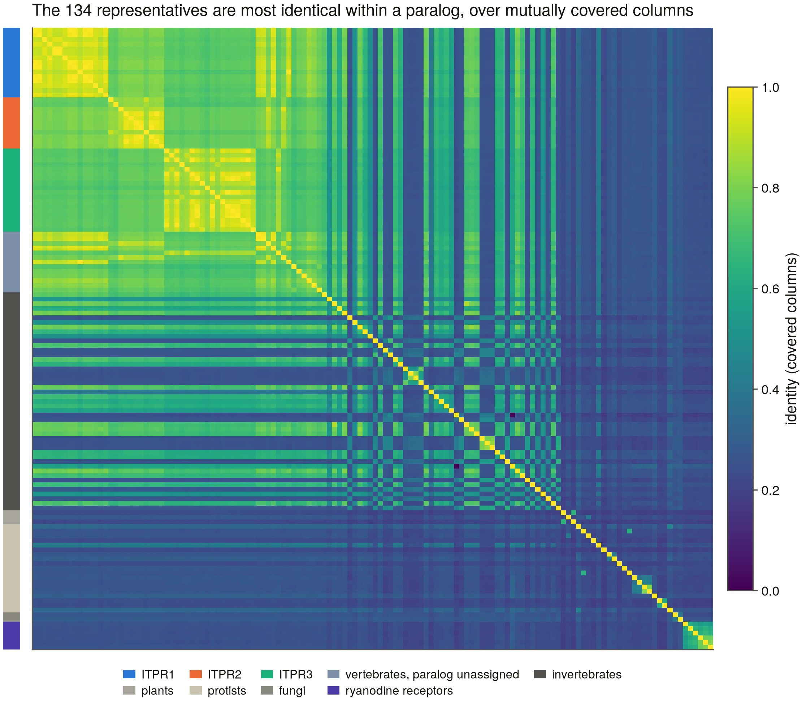

**S7** answered the question the literature has never settled with a rooted,
support-annotated analysis: **ITPR2 and ITPR3 are sisters, and ITPR1 is
outside the pair**. The unconstrained ML tree groups them at SH-aLRT 100 /
UFBoot 100, and an AU test over the three constrained topologies at 10,000
RELL replicates **rejects ITPR1+ITPR2 (p-AU 1.8 × 10⁻⁵) and ITPR1+ITPR3
(1.65 × 10⁻⁵)** while leaving ITPR2+ITPR3 (0.476) and the ML tree (0.525)
standing — both survivors carrying the same pair. So the pairing S6's
identity ranking put *first* is the one likelihood rejects *hardest*, which
is the difference between resemblance and ancestry stated as a number.
134 tips × 1,797 columns under `Q.insect+R7`, **69.5 %** of 131 internal
nodes clearing SH-aLRT ≥ 80 *and* UFBoot ≥ 95, and a `--bnni` re-run that
weakens and loses nothing. All five names the tree declines to place are
upheld by reciprocal best hits, so those are the tree's uncertainty and not
a database's error. And the six cyclostome loci resolve into **two
well-supported clades that each hold both hagfish and lamprey** — neither
the lineage-specific expansion nor the three 1:1 orthologues S6 offered,
but duplications older than the hagfish/lamprey split.
→ [`results/phylogeny/report.md`](results/phylogeny/report.md)

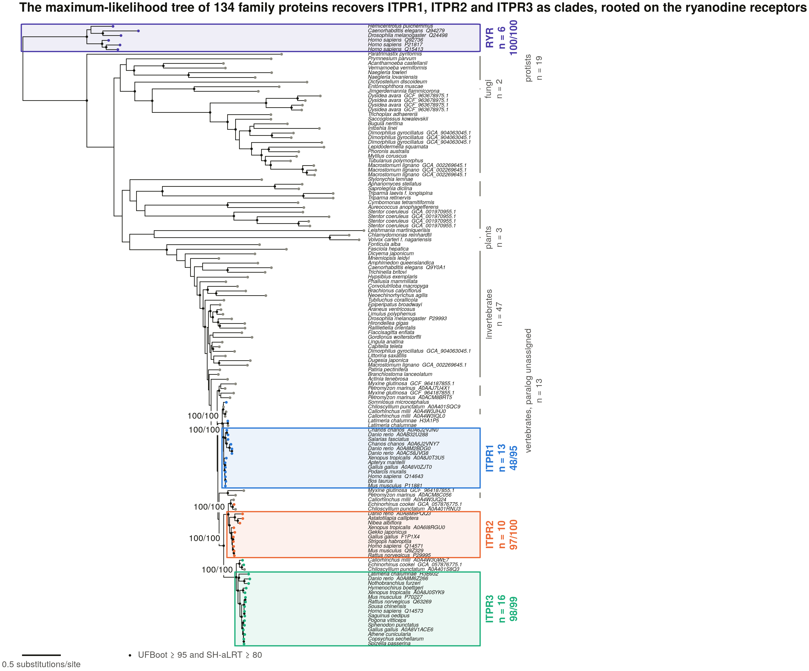

**S8** checked those paralogue labels with an instrument that never sees the
protein: the *neighbouring* genes. Across 2,144 loci in 309 genomes, two loci
carrying the same paralogue label share their flanking-gene symbols
**216×–413× more than two matched random neighbourhoods in the same two
genomes** — the null every number here is read against — with 98–99.8 % of
individual pairs beating their own control, while every cross-paralogue and
every ITPR × RyR class sits at or below that null (max mean Jaccard 0.0002
over 168,241 pairs). The 2R paralogon is invisible to symbol matching by
construction, since ohnologues almost never share a symbol; scored on gene
*family* roots against the same random background, exactly two shared
families survive and **both connect to ITPR1** — BHLHE40/BHLHE41
(ITPR1–ITPR2, 84× background) and GRM7/GRM4 (ITPR1–ITPR3, 93×) — while
**ITPR2 and ITPR3 retain none**, which is a tension with S7's sister pair
worth stating rather than smoothing, because flank retention records
deletion and a tree records duplication order. A leave-one-species-out
consensus caller, its threshold chosen by maximising call rate minus
random-window false-call rate, is **405/405 correct on the
annotation-confirmed loci** and adds **131 paralogue assignments** no random
neighbourhood could have produced. The one thing it cannot do is the
question S7 handed it: all six cyclostome loci score no better than a random
stretch of their own genome, so the answer is *underpowered*, not negative.
→ [`results/synteny/report.md`](results/synteny/report.md)

**S9a** built the codon alignment every selection test stands on: a
nucleotide sequence for all **57** vertebrate tips that provably encodes the
exact protein S6 aligned, 3,253 codons of which trimAl keeps 2,459. Two of
those 57 needed more than one attempt, and both are human — UniProt
cross-references five Ensembl transcripts for ITPR1 and two for ITPR2, and
in each the *first* is not the isoform the tree was built on, so a route
that returns the first CDS it can download silently analyses a different
protein (D36).

**S9b** ran the models — 40 codeml jobs and 3 HyPhy RELAX runs. **ITPR1 is
held about twice as tightly as ITPR2 and ITPR3**, and three instruments that
share no machinery agree: one-ratio ω 0.024 against 0.043 and 0.042; a
whole-tree two-ratio test putting ITPR1's clade at 0.024 against a 0.043
background (q = 3e-63); and RELAX finding selection on ITPR1 **intensified**
(k = 9.4) while ITPR2 and ITPR3 are **relaxed** (k = 0.91, 0.84). The gene
carrying almost all of this family's human disease is the gene evolution has
been least willing to let change.

**Nothing in the family is under positive selection today, and saying so
took the fitted parameter rather than the p-value (D38).** M8 beats M7 in
all three paralogues at q ≈ 2×10⁻⁴, but the class it adds sits at exactly
ω = 1 — codeml's boundary — on under 1 % of sites: a sliver of *unguarded*
positions, not adaptation. Branch-site model A is significant on all three
duplication stems, but on two of them the foreground ω runs to codeml's 999
ceiling with the likelihood flat above it, so only the **ITPR1 stem** is
reported as a result — ω = 5.5 on 11 % of sites, stable across restarts,
with 8 positions identified at posterior ≥ 0.95. Synonymous sites turn out
to be saturated *within* a single paralogue (89 % of pairs past dS = 1.5),
so every ω here is tree-based and the pairwise matrix is a diagnostic.
→ [`results/selection/report.md`](results/selection/report.md)

**S10** audited the annotations from the genome side and then took the two
worst failures apart exon by exon. **The reassuring number comes first: at
375 of the 382 loci where the annotation could reasonably have delivered the
gene, it did** — one gene model covering the whole coding footprint, median
annotation loss 0. The failures are a short list, not a gradient: seven
genes in three genomes. Which two get validated is a rule applied to all 880
recovered loci, and the rule that does the work is a control — *does this
annotation build genes this long anywhere else in the same genome?* It
removes exactly six loci in two assemblies whose gene sets top out below an
IP3 receptor's length (*Cirrhinus mrigala* at 42 kb, *Saguinus oedipus* at
138 kb against a 726 kb locus), so a genome-wide length ceiling cannot be
written up as a bug at this gene.

**In *Nibea albiflora* the ITPR2 gene is complete, spliced and invisible.**
56 coding exons, none of them carrying an annotated gene model; 2,673 codons
with **zero internal stops** where neutral drift would have left ~14; 55 of
55 introns spliceable; 52 of 55 exon boundaries shared by a majority of 35
independently annotated genomes. It sits between **SSPN and BHLHE41** —
ITPR2's two most conserved neighbours across 197 and 183 of 215 swept
vertebrates — so it is not merely present but at the family's most
recognisable address. The same genome files **every complete receptor gene
it has as a pseudogene** (31.6 % of its whole gene set), and its
"ITPR2"-named model is, by its own translated sequence, the **ITPR3** gene —
which settles one of the three naming conflicts S5b deliberately left open.
In *Dissostichus eleginoides* one 68 kb ITPR3 gene is called as three
protein-coding models tiling residues 1–67, 52–467 and 468–1593, with the
3′ 41 % — the entire channel — unmodelled. **Both species: three complete
IP3-receptor genes in the DNA, zero IP3-receptor protein records in any
database.**
→ [`results/annotation_bugs/report.md`](results/annotation_bugs/report.md)

**S12** put S10's finding to biology rather than to software. If the seven
genes the annotations lose are real, cells should be transcribing them —
so 67 public RNA-seq runs (**536 million reads**, 16 studies, 11 tissues)
were streamed against a reference built from the recovered loci themselves.
**All seven are transcribed and spliced**, each in 6–9 tissues, and **298 of
the 314 splice junctions no annotated model spans (94.9 %) are crossed by
reads** — the same rate as the junctions the annotations *do* model in the
same genes. A junction only exists in a transcript, never in the DNA, so
those reads cannot come from genomic carryover. Read coverage also falls
outside the annotation in the proportion S10 measured from the coding
footprint, from aligned reads instead of a GFF. **In *Nibea albiflora* the
family reaches no protein database by any route**: ITPR2 is unannotated and
ITPR1 and ITPR3 are annotated *as pseudogenes* over 97–98 % of their coding
footprint, yet all three are transcribed in 31–32 of 32 libraries. The
deposit-based cross-check was re-asked on the one species that should have
answered it — *D. mawsoni*'s 37,166 mRNA records — and returned **0
spanning hits, including 0 for the annotated RyR control**; at a median
deposit length of 547 nt against an 8 kb transcript it never could have,
which is the verdict the report renders. **Three inherited assumptions were
measured rather than carried over, and two changed the result**: the
translation-identity floor for validating a reference (wrong instrument — a
correct reference scores 1.00 with no frameshifts and 0.92 with nine),
the ported decoy floor of zero (**42 reads here**, bounded to ~64 bp and
changing no call), and the closed-set cross-mapping risk (measured, 0 of
12,500).
→ [`results/expression/report.md`](results/expression/report.md)


*Every splice junction of all seven loci the annotation loses, at its
position in the spliced coding sequence. Violet: a junction no annotated
gene model spans. Blue: one it does. A junction nothing crossed is marked on
the baseline, so the denominator is in the picture.*

**S13** put both duplications on the vertebrate tree, and they are not on
the same branch. The split separating **ITPR1 from ITPR2+ITPR3 sits on the
vertebrate stem** — before hagfish and lampreys parted from the jawed
vertebrates, older than crown Vertebrata (published estimates 480–615 Ma) —
while the split separating **ITPR2 from ITPR3 sits on the gnathostome stem**,
bracketed **462–563 Ma**. So the trio was not made in one event; there was a
two-receptor stage long enough to be visible. The species tree is an **input,
not a result** (D15): 31 species, 29 named internal nodes, each with a
literature age, the spread of published estimates, a stem age and its source,
validated before use. **The topology turns out to be irrelevant and the taxon
sampling to be everything** — all five gene trees (the ML tree, the three
AU-scored sister constraints, the `--bnni` guard) give identical counts, while
dropping six cyclostome loci moves the older placement forward a whole branch.
Those six therefore carry the result, so three things were measured rather than
asserted: the placement **survives collapsing every node below S7's own support
bar** (the ITPR1 split sits on a 17.4/54 node, and collapsing it merges two
vertebrate-stem duplications into one carried at 100/100); **minimum-event
rooting picks a different edge and agrees** on the placement; and the
long-branch artefact that would explain the result away **is not present** —
the six tips are 0.96–1.04× the median root-to-tip distance, ranking 18–55 of
57. The reconstruction also recovers a **third ancestral vertebrate lineage
that survives only in cyclostomes** and in no jawed vertebrate at all. And the
loss count is the methodological result again: of **51–53 implied losses, 0
survive contact with the genomes** — the last four to fall were ITPR2 and ITPR3
in the two cyclostomes, which read `absent` only because the bait panel has no
cyclostome bait to fill those cells with (**D45**).
→ [`results/reconciliation/report.md`](results/reconciliation/report.md)


*The dated species tree with every duplication drawn on the branch it maps to.
Ages and their published spreads are read from the committed calibration table,
placements from the reconciliation; nothing is positioned by eye.*

**S11** asked whether what the census calls an IP3 receptor *folds* like one,
and whether it can be told from a ryanodine receptor by shape alone. **It
can: 20 of 20 structures the fold test could call agree with the census, and
0 of 3 negative controls receives a family call** — a sixth instrument for
D14, and the first that reads no gene symbol, no domain annotation, no
alignment score and no tree. The references were resolved by an RCSB query
over the family's own Pfam signatures and assigned a family by this
project's census, never by an entry title; enumerating on the union of the
four signatures is load-bearing, because RCSB's annotation of the project's
own IP3R reference (6DQN) carries no PF08709. **The negative controls earned
their place immediately**: gated on the inherited relative margin alone the
rule calls a dynein heavy chain, a Cav2.1 and a talin IP3 receptors — a
margin between two non-matches is still a margin — so a family call now
requires the winner to clear TM-align's own 0.50 same-fold bar first (D39).

**Almost none of this family has ever been folded.** AlphaFold DB holds a
usable model for **13 of the 5,861 census records at or above the family's
2,000 aa floor (0.2 %)**, and for 9 of S6's 134 representatives. The reason
is length, not obscurity: the monomer pipeline stops near 2,700 residues and
a vertebrate subunit is ~2,700, so the coverage that exists is concentrated
on fragments (median modelled record 392 aa against 2,674 aa unmodelled).
**AFDB also answers a canonical accession with an isoform** — human ITPR2
comes back as 181 residues of a 2,701-residue protein — so coverage here is
the modelled span against the census length, and that model is rejected by
rule rather than used. Per-domain confidence puts the **IP3-binding core
highest (median pLDDT 83.9) and the pore lowest (71.0)**, which is the
answer S17 and S22 needed. A Foldseek sweep of AFDB's Swiss-Prot subset
returns the family and, apart from it, only SDF2/SDF2L1 across five
kingdoms — PF02815 and nothing else, the one control class the PDB could not
fill. → [`results/structures/report.md`](results/structures/report.md)

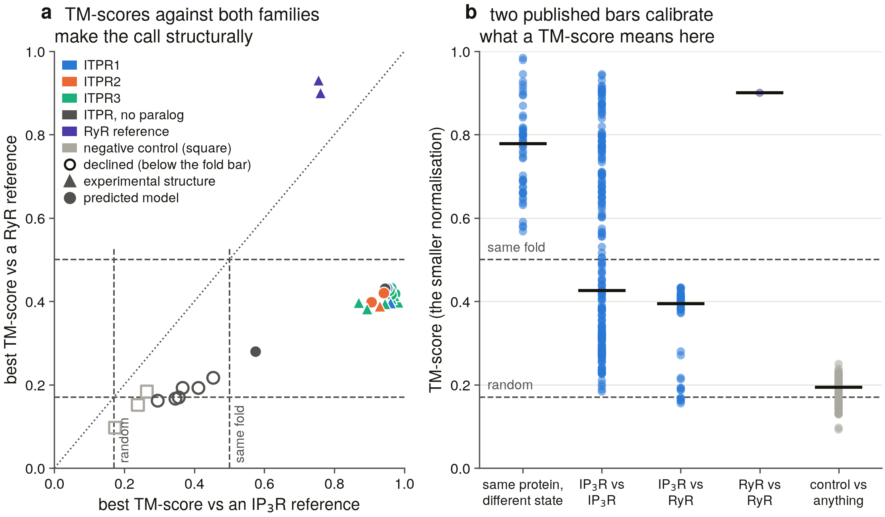

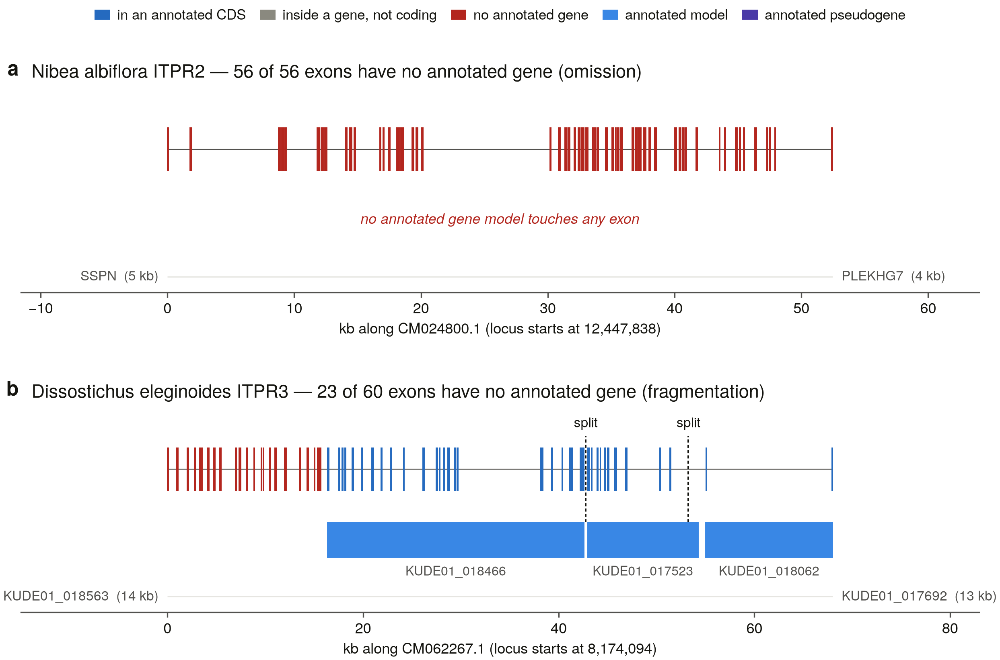


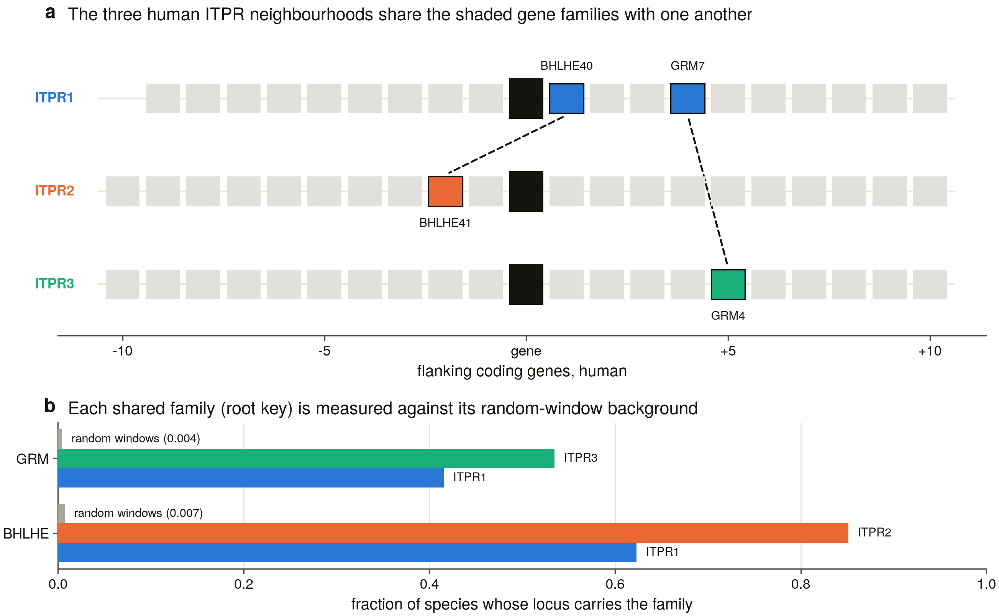

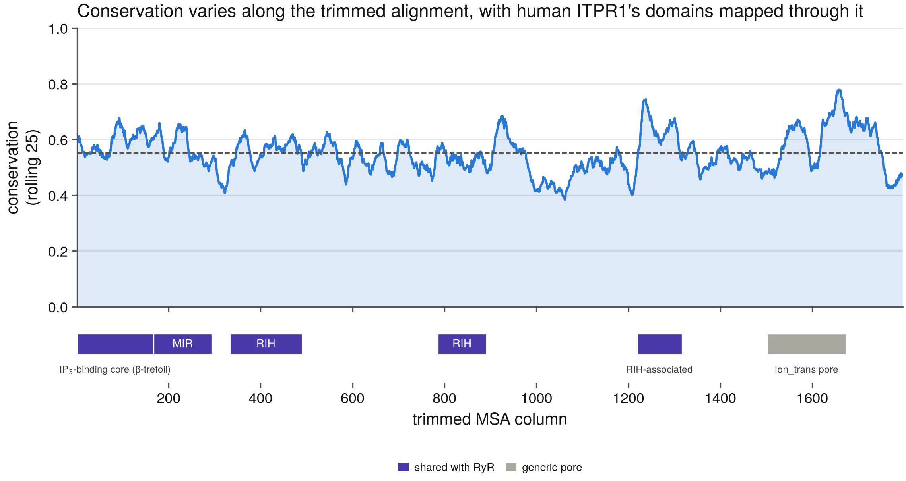


---

## Quickstart

```bash
# GUI
python run.py --email you@example.com

# Headless, against live APIs
python run.py --headless --preset ip3r --save-results
python run.py --headless --preset ip3r_zebrafish --save-results

# The project dashboard (stdlib only, no env needed)
python3 scripts/dashboard.py --open
python3 scripts/dashboard.py --watch &

# Is the bulk-storage drive attached? (exit 1 = no; that is a stop)
python -m src.utils.data_root --require
```

Dependencies: `pip install -r requirements.txt` (`biopython`, `requests`).
The analysis toolchain is installed and version-pinned as of S1 — MAFFT
v7.526, HMMER 3.4, BLAST+ 2.16.0+, miniprot 0.18-r281, trimAl v1.5.rev1,
IQ-TREE 2.3.6, NCBI `datasets` 18.35.0, Foldseek 10.941cd33. Exact paths and
Python package versions:
[`results/toolchain_manifest.txt`](results/toolchain_manifest.txt),
regenerated by `python3 scripts/s1_toolchain.py`. BLAST+, `datasets` and
Foldseek resolve inside the `piezo1` conda env rather than on the bare PATH,
so run project scripts with
`/opt/anaconda3/envs/piezo1/bin/python` (Decisions D18).

---

## The science

The IP3 receptor releases calcium from the ER when IP3 binds it — the origin
of most agonist-evoked calcium signals in non-muscle cells, of the calcium
waves that pattern development, and of the ER-to-mitochondrion transfer that
sets the apoptotic threshold. Vertebrates have three paralogs of about 2,700
residues each, assembled as tetramers, and each is associated with a
different human disease:

| Gene | UniProt | Length | Disease association *(verified in S0)* |
|------|---------|--------|-----------------------------------------|
| ITPR1 | Q14643 | 2,758 aa | spinocerebellar ataxia (SCA15/SCA29), Gillespie syndrome |
| ITPR2 | Q14571 | 2,701 aa | autosomal recessive isolated anhidrosis |
| ITPR3 | Q14573 | 2,671 aa | dominant Charcot–Marie–Tooth neuropathy |

**The complication that shapes the project.** The ryanodine receptors
(RYR1/2/3, ~5,000 aa) carry *every* Pfam domain that marks an IP3 receptor —
checked directly: human RYR1 carries PF08709, PF01365, PF08454 and PF02815.
They are inside every search this project runs. So separating ITPR from RYR
is a positive test at every stage (roadmap Decisions **D14**) — and, turned
around, it is an opportunity: both families get counted by the same
instrument, and RyR gives the ITPR tree a proper outgroup.

### What is already visible

Re-derived by S0 on 2026-08-18 and enumerated to exhaustion by S2 on
2026-09-03 ([`results/census_v2/`](results/census_v2/)):

- The family is overwhelmingly an animal family — **10,936 of the 15,421**
  enumerated proteins are vertebrate, another 3,706 non-vertebrate metazoan.
- **Outside the animals it survives in a pattern, not at random — and S20
  showed the pattern is real.** Sweeping the proteomes themselves, with no
  Pfam-annotation filter: **Streptophyta 0/384 reference proteomes** against
  15/48 in the green algae, and **Dikarya 0/1,353** against 28/1,527 across
  the fungi. The fungal losses are patchy rather than basal — Glomeromycota,
  Mortierellomycota, Kickxellomycota and Microsporidia are empty too. Absent
  from bacteria (0/3,537) and archaea (0/634) entirely.
- **Half of what the search returns is the wrong family.** 6,807 of the
  15,421 records are ryanodine receptors, which carry every ITPR-diagnostic
  Pfam. Separating them is a positive test at every stage (**D14**).
- **One signature is not enough to find the family.** Enumerating on
  PF08709 alone — the IP3-binding core, the domain that names it — would
  miss 2,914 records, 758 of them real IP3 receptors across 385 taxa
  (**D21**).
- Zebrafish carries **four**: `itpr1a`, `itpr1b`, `itpr2`, `itpr3` — the
  first two look like a teleost-duplication pair.

### The questions the project answers

- **Range.** What is the family's true taxonomic distribution, and are the
  famous absences facts about genomes or about proteome databases?
- **Origin.** Are ITPR1/2/3 2R ohnologs? Are the teleost pairs from 3R? Did
  the ryanodine receptors triplicate at the same time?
- **Fates.** Has any paralog ever been lost, and how often independently?
- **Records.** How often is a real ITPR locus missing, split, unnamed, or
  filed as a ryanodine receptor?
- **Machine.** Do the pathogenic variants sit in the most constrained parts
  of the channel, and is the constrained core the same in all three paralogs?
- **Anything unnamed.** Is there a fourth vertebrate ITPR, or an ITPR in a
  lineage reported to lack one?

---

## Project status board

One task per session. Full ledger with dependencies and results in
[`PUBLICATION_ROADMAP.md`](PUBLICATION_ROADMAP.md).

| ID | Task | Status |
|----|------|--------|
| S0 | Literature baseline + scope confirmation | ✅ completed 2026-08-18 |
| S1 | Toolchain + positive/negative controls (RyR is the sharp decoy) | ✅ completed 2026-08-18 |
| S2 | Uncapped InterPro enumeration → census v2 | ✅ completed 2026-09-03 |
| S3 | Profile-HMM sweep (itpr.hmm + ryr.hmm) + convergence argument | ✅ completed 2026-09-04 |
| S4 | Genome scope manifest (the denominator) | ✅ completed 2026-09-04 |
| S5a | Genomic sweep: bait panel, calibrated pipeline, pilot | ✅ completed 2026-09-04 |
| S5b | The full 309-genome sweep → ledger + census v4 | ✅ completed 2026-09-05 |
| S20a | Non-vertebrate sweep — the family's true range | ✅ completed 2026-09-05 |
| S20b | The remaining per-group convergence runs | ✅ completed 2026-09-05 |
| S23a | Non-vertebrate sweep: scope, calibration, bait panel, pilot | ✅ completed 2026-09-05 |
| S23b | The blocking measurements, and the instrument they change | ✅ completed 2026-09-06 |
| S23c | The full 194-genome non-vertebrate sweep → census v6 | ✅ completed 2026-09-06 |
| S6 | Alignment upgrade (MAFFT L-INS-i + trimAl) | ✅ completed 2026-09-06 |
| S7 | ML phylogeny, rooted on RyR; which paralogs are sisters | ✅ completed 2026-09-07 |
| S8 | Synteny across the ITPR loci | ✅ completed 2026-09-07 |
| S9a | The codon alignment every selection test stands on | ✅ completed 2026-09-07 |
| S9b | ML selection (codeml branch/site models, HyPhy RELAX) | ✅ completed 2026-09-08 |
| S10 | Annotation-bug molecular validation | ✅ completed 2026-09-08 |
| S11 | Structures + TM-align vs cryo-EM references | ✅ completed 2026-09-08 |
| S12 | Expression evidence (SRA junction reads) | ✅ completed 2026-09-08 |
| S13 | Reconciliation & dating | ✅ completed 2026-09-08 |
| S15a | Loss dynamics — the instrument and the character matrix | ✅ completed 2026-09-08 |
| S15b | Loss dynamics — the counts and the sensitivity matrix | ✅ completed 2026-09-08 |
| S16 | Duplication history (2R / 3R, and the RyR parallel) | ✅ completed 2026-09-08 |
| S17 | Constraint & function — the clinical-variant test | ✅ completed 2026-09-08 |
| S18 | Annotation-quality audit + correction list | ✅ completed 2026-09-08 |
| S19 | Methods results | ✅ completed 2026-09-08 |
| S21 | Gene architecture (~58 exons) | ✅ completed 2026-09-08 |
| S22 | Ligand-site evolution | ✅ completed 2026-09-09 |
| S14a | Manuscript assembly | ✅ completed 2026-09-08 |
| S24 | Supplementary figures + figure audit | ✅ completed 2026-09-08 |
| S14c | Manuscript rewrite pass | ✅ completed 2026-09-09 |
| S25 | The thesis — the long form, with an audited bibliography | ⏳ pending |
| S26 | The paper series — the results regrouped as individual papers | ⏳ pending |
| S14b | Deposit + release (Zenodo, public repo, preprint) | ⏳ pending — human-gated |

---

## Findings so far

Plain-language entries per task: [`FINDINGS.md`](FINDINGS.md). Headlines:

**S22 — the part that binds the messenger is not the part evolution
protects.** Comparing the IP₃-binding core against the pore module **inside
the same protein and paired per orthologue** — one core number and one pore
number per sweep orthologue, 246–262 per paralogue — the **pore is the more
conserved of the two**: by 0.024 identity in ITPR1 (223 tips to 32,
q = 3.6e-34) and 0.020 in ITPR3 (218 to 42, q = 1.6e-28), with ITPR2 level.
The module that names the family is not the one under the tightest
constraint. **And the answer reverses on one boundary**: leave the
50-residue luminal loop inside PF00520, as InterPro draws it, and all three
paralogues flip to core > pore at q < 1e-37 (Decisions **D69**). Both are
correct about their own region; neither is a statement about "the pore".

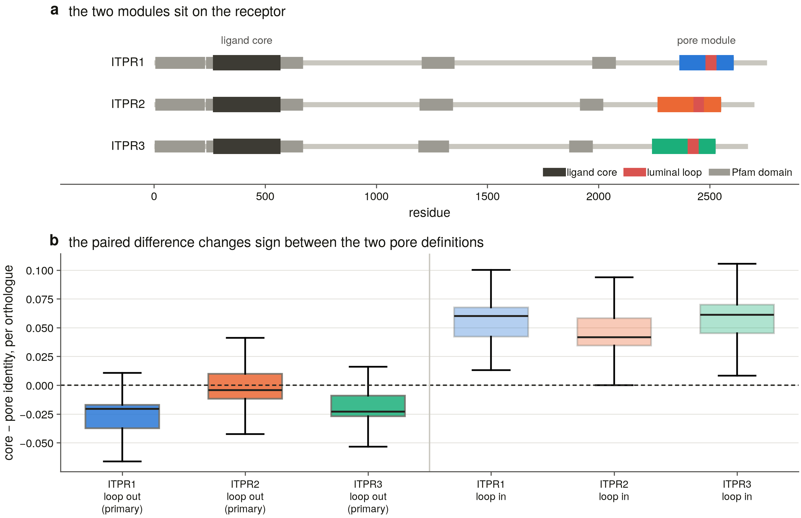

**S22 — what selection holds is a pocket, not a contact set.** Every residue
within 15 Å of the ligand was measured **all-atom** across **six**
independent IP₃-bound human ITPR3 structures, with S0's ten contacts
recovered in S0's own structure as a hard-failure control (**D70**). The
consensus contact set is **twelve**, not ten — Ala276 and **Arg411**, an
arginine invariant across 265 orthologues and 4.1–4.6 Å from the ligand's
phosphates in every structure, are contacts one map cannot see. The ten
contacts beat the rest of the binding core (q = 0.048 / 0.017 / 0.041) and
beat the rest of the pocket in **none** of the three paralogues; every shell
out to 15 Å sits above the whole-protein mean and there is no step at 4.5 Å.

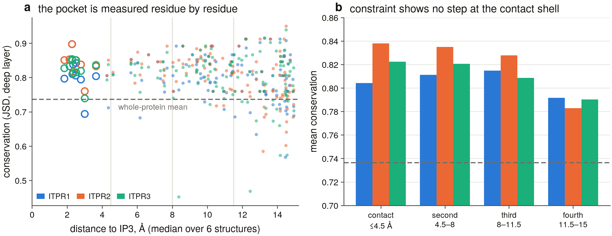

**S22 — 64 eukaryotes carry the receptor without the enzyme that makes its
ligand, and their binding site has not decayed.** PI-PLC presence (both
catalytic halves, PF00387 **and** PF00388) swept over all **3,527 eukaryotic
reference proteomes**: 760 of 763 vertebrate proteomes carry one — the
positive control — and **64 carry an ITPR and no PI-PLC**, concentrated in
the oomycetes and the early-diverging fungi, every one of them holding a
full-length receptor. Pooled, their ligand core looks relaxed (p = 9.7e-6);
that is a **clade artefact** (median pore identity 0.358 against 0.589).
Matched on divergence, all 36 that enter the test find controls and the
effect is **gone** — median within-pair difference −0.0064, 95 % CI −0.016
to +0.015, p = 0.87 — against a ryanodine-receptor positive control measured
on the same instrument at the same divergence whose shift is −0.062 and
which the matched test detects with essentially full power (**D71**). A
bounded null, not a caveat.

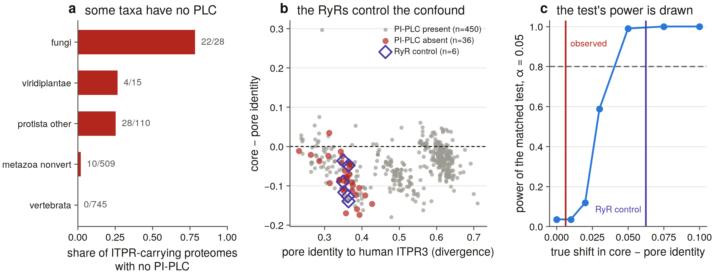

**S21 — the same gene, packed three different ways.** The exon/intron
architecture, read off the sweep's own alignments to 309 genomes. Across
**1,378 genes in 189 genomes** above D4's contiguity bar, ITPR1 has **58**
coding exons, ITPR2 **57** and ITPR3 **58** — the literature's "~58-60" had
only ever been checked in human — against **104** for the ryanodine receptor
control. But the three carry near-identical coding sequence (8,250 / 8,100 /
8,008 bp) in wildly different amounts of chromosome: **ITPR3 in 58 kb, ITPR1
in 147 kb, ITPR2 in 244 kb**, a 4.2-fold spread that holds gene by gene
*inside* genomes (ITPR3 is shorter than ITPR1 in 161 of 182), so it is not an
averaging artefact.


**S21 — the three copies inherited one exon structure, and the ryanodine
receptors did not.** Each intron was located in a coordinate frame shared by
all three proteins — an alignment column plus which of the three codon
positions it interrupts — and the frame was checked against all **14
residues S0 measured on the 6DQN structure**, which land in the same column in
all three paralogues. The three paralogues share **~48 of their ~58 intron
positions**, against 0.55 expected by chance, significant in **every one** of
181–183 genomes. The ryanodine receptors — which carry every ITPR-diagnostic
Pfam domain and are inside every search this project runs — share **one**, in
**0 of 188**. The two families' genes are built from the same protein parts
and have no exon structure in common.


**S21 — a database "fragment" is usually not a gene boundary.** Of the 291
loci S18 called `split` or `fragmentary`, **228 carry an annotated model
terminus inside an exon** of the gene model, where nothing splices; only
**3** are broken entirely at real junctions. And the instrument behind that
claim is corroborated twice: **99.89 %** of 112,254 exon junctions read as a
canonical or minor splice pair off the genome, and **94.5 %** of 188,146
annotated CDS edges produced by an independent pipeline land exactly on a
sweep exon boundary — S10's two-case check generalised to 164 genomes, with
D9's contrast surviving it (RefSeq 94.9 %, GenBank 91.1 %).


**S17 — the gate has not changed, and the domain named after IP3 is not the
IP3 site.** With 250 orthologues of each human copy pulled out of the 309
swept genomes, constraint can be read residue by residue. The five gate
residues are the most invariant sequence in the receptor and are **identical
in ITPR1, ITPR2 and ITPR3**; the selectivity filter is 86–100 % identical
between copies and the ten measured IP3 contacts are more conserved than the
rest of the domains they sit in. Those domains are **MIR and RIH** — the ones
shared with the ryanodine receptors — because **not one of the ten contacts
lies inside PF08709**, the signature every database record calls "Inositol
1,4,5-trisphosphate/ryanodine receptor". Meanwhile a **50-residue ER-luminal
loop inside the pore domain is the least conserved sequence in the protein**
(13–31 % identity between copies against 64–70 % overall; the same answer
from residue conservation and from per-site dN/dS). Unresolved, its
variability dragged the whole pore domain below the receptor's floppy
linkers, which would have meant reporting that the pore of an ion channel is
less constrained than its spacers.

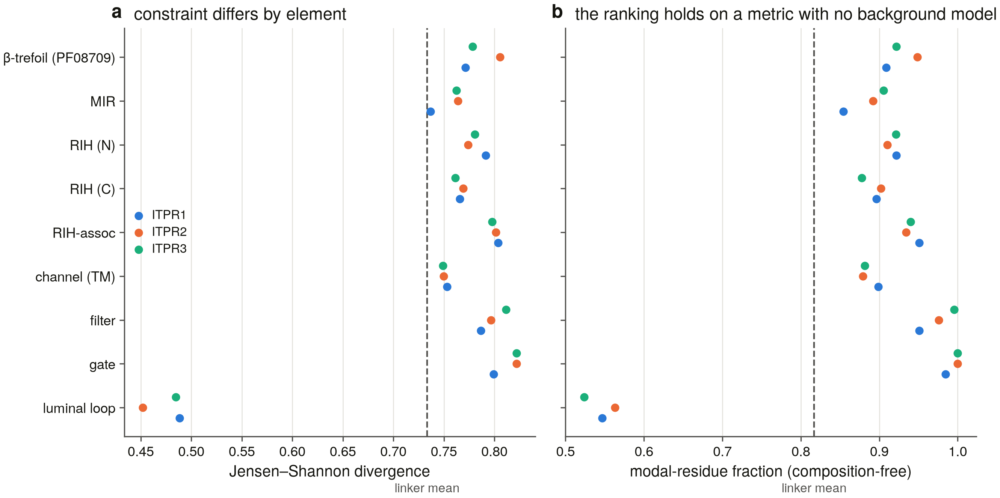

**S17 — conservation does read the variants, and 88 % of them are
unreadable.** Against ClinVar's own labels, pathogenic positions are markedly
more conserved than benign ones (AUC **0.872** on a fixed set of 44 vs 34
positions) — and the layer that does it best is conservation across the
*whole* family, protists to humans, not deep conservation within one human
gene (0.758). But **1,546 of 1,753 missense records are of uncertain
significance**, and **ITPR2's entire pathogenic record is one variant** —
which is ascertainment, not tolerance: its gate is identical to the others'
and its IP3 contacts are the most conserved of the three, with 8 of 10
invariant across 249 species. All 1,753 records now carry a per-site score.

**S24 — every figure read against its own legend, and the two joins the
supplementary set exists to let a reader check.** Six supplementary figures,
all drawn from committed files only. Before any of them was drawn the trimAl
column map was verified by an **exhaustive walk** — all **1,797** trimmed
columns against all **134** sequences, because an off-by-one still maps every
column to a column and would silently renumber every residue claim in the
paper — and every clinically labelled residue was checked against the residue
its own paralogue's table holds there (**1,780** variants, **2,699** aligned
partners). **22 pathogenic positions** fall in the ligand core or the pore
module and **20 carry the same residue in all three paralogues**. A structure
may carry a human variant position only if *every* residue it shares with the
human table matches: human ITPR2 (9YKK) and ITPR3 (8TKG) pass 2,168/2,168 and
2,210/2,210, the ITPR1 reference is **rat** (736/2,300) and AlphaFold DB's
human ITPR1 model is the **2,695-residue Q14643-4 isoform** (479/2,695), so
ITPR1's 55 pathogenic positions are **not placed**. The audit itself:
**26 findings, 16 legend corrections and 10 figure fixes** — a legend that
counted four backbone labels where the tree draws five, one that named the
wrong colour for the fragmentary class, one that said 51–53 implied losses
for a panel plotting up to 102, one that called a 30-bar panel the
29-structure panel. None changes a result; all survived a build that
re-derives 180 numbers from their tables on every run.
→ [`results/supplementary/report.md`](results/supplementary/report.md)

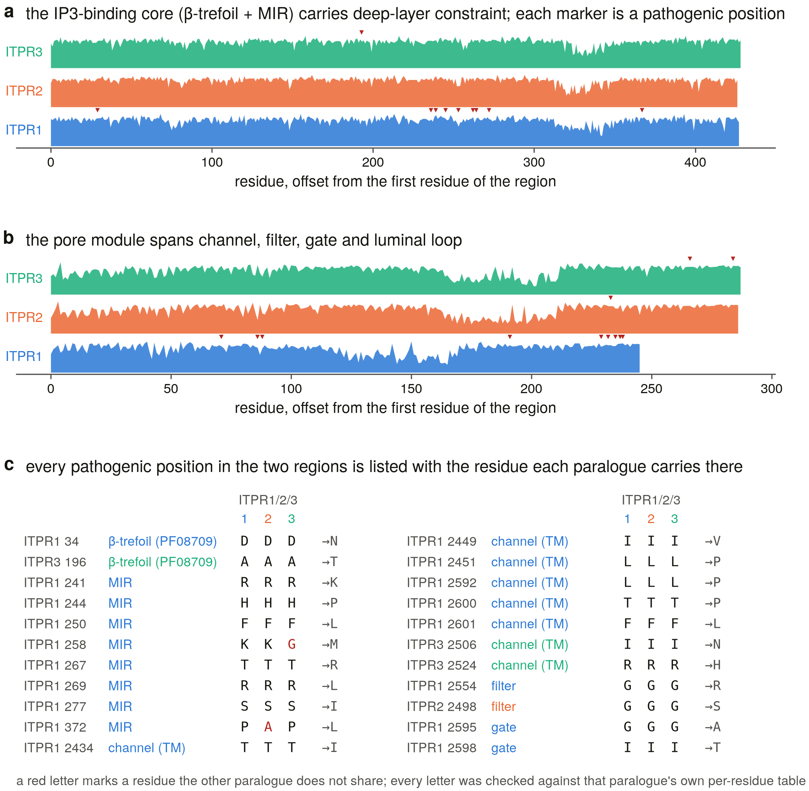

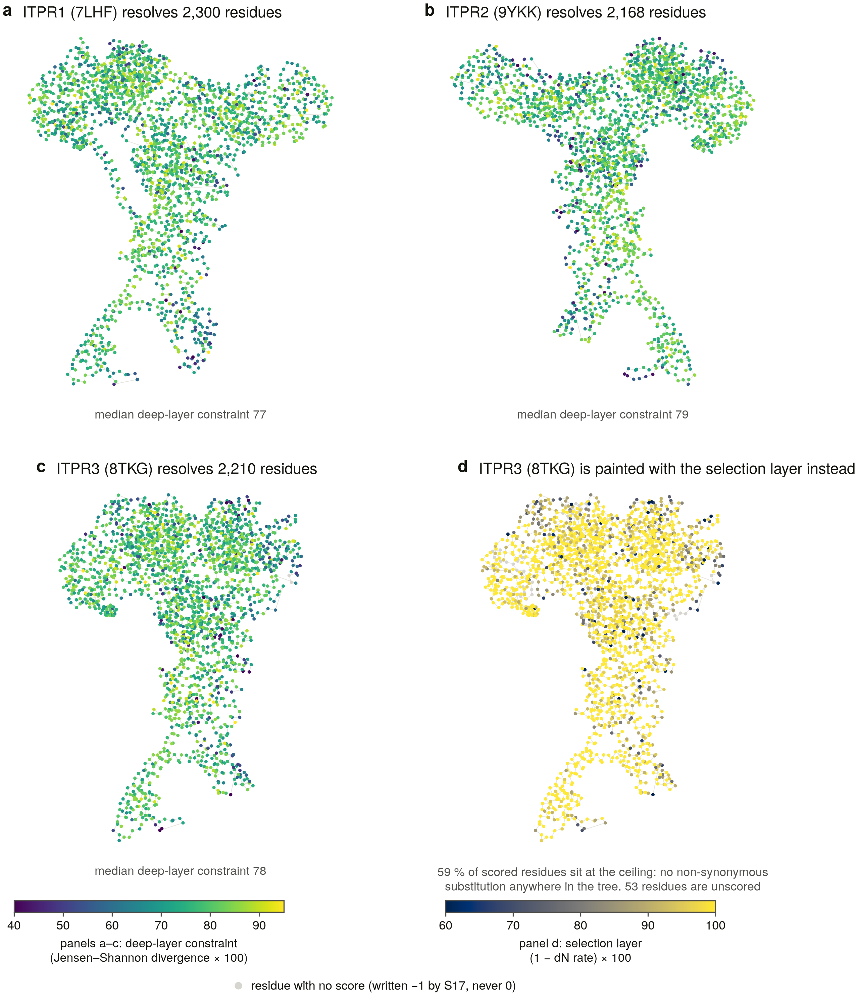

**S19 — the search missed one gene in seven, and every miss is an
assembly.** S15b reconstructs no losses anywhere in the 309-genome scope, so
all 923 assignable cells hold a gene that is there and every ledger cell not
graded `found` is a **false negative of the method**: **140/923, 15.2 %**.
The ryanodine receptor cell — present in every vertebrate, swept by the same
aligner in the same assemblies, using none of S15a's state assignments —
gives **42/309, 13.6 %**, indistinguishable from it (Fisher *p* = 0.58).
A missed cell's median contig N50 is **23,460 bp against 3,396,515 bp** for a
found one; the odds of finding the gene rise **8.1× per tenfold** of contig
N50. On chromosome-level assemblies the search misses **3 of 512** ITPR cells
and **0 of 172** RyR cells. **D4's contiguity bar — 142,212 bp, the median
measured ITPR genomic span, chosen a priori with no error rate in its
derivation — gives 0.9 % residual error and stands.** It costs 38.8 % of the
scope, disproportionately the margin species the scope was extended for.
→ [`results/methods/report.md`](results/methods/report.md)

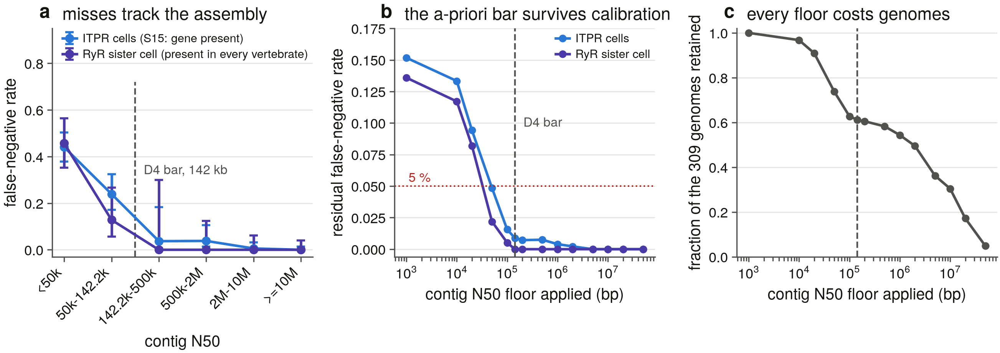

**S19 — the bait panel could have been four baits.** The ablation is exact
rather than modelled: dropping baits from the 309 retained miniprot
alignments and re-clustering reproduces the committed ledger **1,236 cells
out of 1,236**. **Four human baits recover 782 of the 783 cells the 38-bait
panel recovers.** Dropping every mammal, bird, reptile, amphibian or fish
bait costs at most two cells each; dropping the ryanodine-receptor control
changes **no** ITPR call, so the positive family test is free. What is not
free is paralog coverage: removing one paralog's own baits costs **238–241
cells**, about a quarter of its recovery. The three unlabelled
`vertebrate_basal` baits change **0** cells and on their own recover **0** —
an unlabelled bait cannot fill a paralog cell by itself. And a single bait
recovers its gene at any identity above **0.5** (1,143 of 1,145 measurements
at 0.60–0.70).


**S19 — three quarters of these genes are in no protein database, and the
profile HMM is not what found them.** Of 1,232 demonstrated genome × cell
genes, **940 (76.3 %) are unreachable by any protein-database search**: 386
species with no reference proteome, 248 whose only family records are
fragments, 286 where records exist and none resolves to that paralog. It is
not a margin-species artefact — 74.3 % for order representatives against
78.5 % for margin species. And inside a single searched database, at gene
scale a family profile HMM adds **1 record to 3,135** in the vertebrates and
2 to 1,021 in the non-vertebrate metazoa; its whole gain is under 1,000 aa.
The exception is the **protists, where it adds 89 gene-scale records** the
domain enumeration never returned.

**S19 — the guard against iterative-search drift fires on none of the runs it
was written for.** Scored against a drift outcome measured on the finished
model (the seven jackhmmer runs separate at 0.34 against 0.81 with nothing
between), **K1 — sister-family contamination — has sensitivity 0.00**, K2
0.33, and K3 catches all three at specificity 0.25. The reason is that
off-family accretion *dilutes* the sister share, which **fell** over the run
in 4 of 7. Moving K1's own 0.10 threshold to the off-family share separates
all seven at sensitivity 1.00 and specificity 1.00 — reported as a proposal
and deliberately not applied, because seven runs cannot establish a
specificity of 1.00 *(pending: validation on an independent set of runs)*.

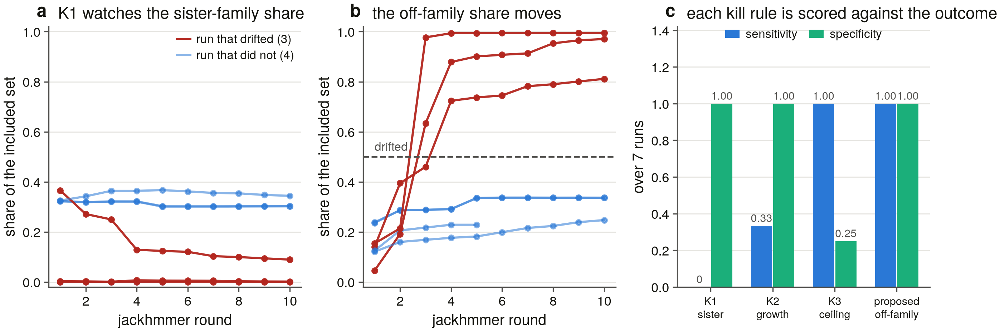

**S18 — the family is not badly recorded; vertebrate gene sets are.** Every
one of the 2,144 gene-scale loci in the genome scope was scored *complete /
split / fragmentary / non-coding only / unannotated*, on CDS blocks and same
strand only, with the ryanodine receptors measured beside them as the control.
ITPR **73.9 %** complete against RyR **77.9 %**, no state differing after BH
except one — an ITPR locus is **2.7× more likely** to be held only by a
non-coding feature (42 vs 16, q = 0.006), which is a gene the annotation names
correctly and files as `gene_biotype=other`, so no protein record is ever
created. Even that does not survive the contiguity control (4 vs 5 above D4's
bar, q = 1.0), so it may be a fact about the assemblies rather than the genes.
The two effects that dwarf the family are **the archive** (RefSeq 98.8 % vs
submitter GenBank 37.5 %, 99.4 % vs 63.8 % once contiguity is held constant)
and **the assembly** (failure 26.1 % → 6.7 % across D4's bar). The
completeness bar was **inherited from S5 and validated, not re-derived**: over
1,077 correctly-named, fully-recovered loci a single model covers a median
0.993, so 0.50 is that distribution's 1.3 % point, and across bars 0.30–0.95
`complete` moves only 76.4 % → 68.1 %.

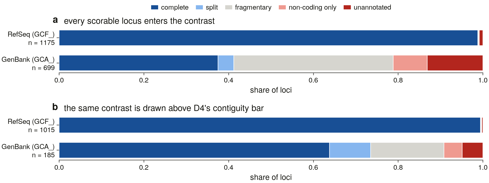

**S18 — the protein records are named right and cannot be found, and all 15
"missing" proteomes have the gene.** Of 11,402 full-length family protein
records blastp'd against the labelled bait panel, **4** disagree with the
project's own family call and **5** are named for the sister family — all
non-vertebrate, all under 200 bits. The paralog is right too: 52 of 8,306
vertebrate symbols name a different type from the one the panel assigns. But
**3,872 records carry a placeholder gene symbol and 2,395 carry none** — 55 %
of the record set is unreachable by name — and 66 more are named for the
superfamily, which separates neither family. Separately, the **15 vertebrate
reference proteomes S3's profile sweep found nothing in are all gene-caller
failures**: every species has a genome in scope and every genome carries the
gene, 0 genuine absences, 11 of the 15 birds. The task ships **297
corrections** (52 high priority, 18 withheld under D6's integrity veto), each
with assembly, coordinates, current state, proposal and an archived evidence
file.

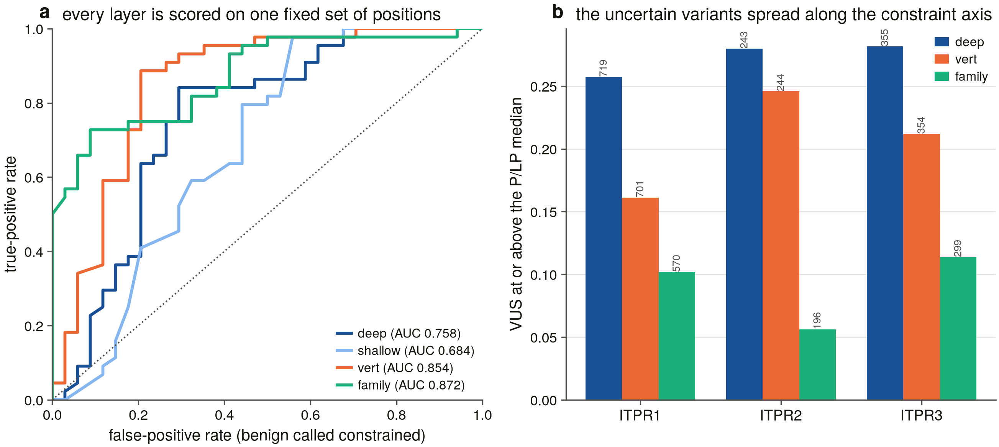

**S16 — the family's origin is still visible in the genome, and it runs
through ITPR1.** Two rounds of whole-genome duplication made the vertebrate
trio, and the neighbourhoods around the three genes are still recognisably
copies of one another — but not symmetrically. ITPR1's neighbours have
relatives beside ITPR2 in **141 of 175** genomes and beside ITPR3 in **89 of
152**; ITPR2's and ITPR3's neighbourhoods share relatives at **exactly the
2.6 % background rate** measured on matched random neighbourhoods in the same
genomes. Dating each link against Ensembl Compara's duplication nodes then
splits the two that survive: the glutamate-receptor pair beside ITPR1 and
ITPR3 was duplicated at the origin of the vertebrates, and the clock-gene
pair beside ITPR1 and ITPR2 was duplicated before animals and fungi parted —
relatives in the right places for the wrong reason. The ryanodine receptors,
this project's sharpest decoy, were run through the identical test as a
positive control and behave identically.

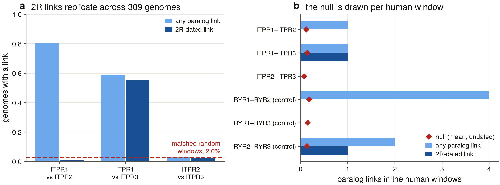

**S16 — the teleost genome duplication kept ITPR1 twice and threw the other
two away.** In 73 well-assembled ray-finned genomes ITPR1 averages **1.97**
copies and ITPR2 and ITPR3 average 1.04 — while the ryanodine receptors in
the very same fish average **5.82**, so this is retention and not a failure
to find things. The pre-duplication ray-fins (bichir, gar, bowfin) carry one
of each and three RyRs; the lineages with a *further* duplication (sturgeon,
salmon) carry more of everything again. The two ITPR1 copies divide their
ancestor's neighbourhood between them in **45 of 49** genomes, and all **705
of 705** cross-anchor comparisons agree on which copy is which — one
ancestral duplication, not a series of independent ones.

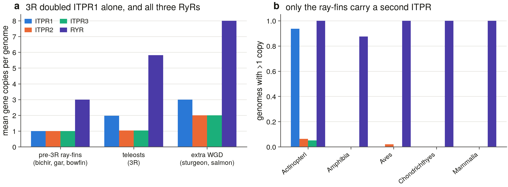

**S15b — how hard you have to try to find a loss.** The count of lost IP3
receptor genes across 309 vertebrate genomes, placed formally on the tree,
is **zero** — and the method that returns it is one that finds constructed
losses on known branches, merges two losses in sister lineages into the
single event they would have been, and refuses to over-count under
unresolved parts of the tree. What is worth reporting is the shape of that
zero. Across 32 settings of the evidence rules, from the most generous the
data allow to a setting that accepts nothing but a complete uninterrupted
gene model and ignores whether the assembly could hold one, asking *does
this animal have an IP3 receptor at all* produces a loss in **2 of 32**
settings, worst case one animal in 309; asking *does it have this
particular one of the three* produces one in **18 of 32**, up to 45 at the
extreme. None of the 45 is real. Two knobs turn out to change nothing —
the threshold for accepting a gene reassembled from scattered pieces, moved
across the whole range its own calibration leaves open, changes not one of
the 927 answers; and the assumed timescale of the tree cannot change a
count of losses at all. One knob changes a great deal: refusing to allow
that a genome carrying spare unidentifiable family copies is not evidence
against a particular copy immediately produces four losses, in the hagfish
and the lamprey, both of which carry three IP3 receptor genes.
→ [`results/loss_counts/report.md`](results/loss_counts/report.md)

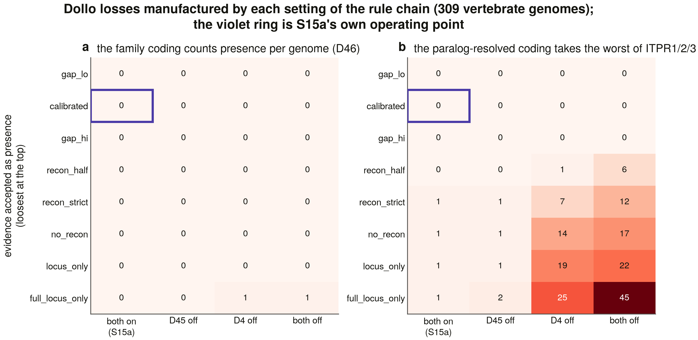

**S15b — no rate of loss can be quoted, and no dead genes exist to read.**
A model asked for the rate at which a gene is lost, on a gene that has
never been lost, returns whatever number it started from. That was measured
rather than asserted: traced across eight orders of magnitude, the fit
slides monotonically to the edge every time, under every model and every
assumed timescale. And a gene that died long ago should leave a corpse —
a recognisable but broken copy. Of 1,760 gene models examined, 44 carry
enough small disruptions to be worth a second look, and **all 44 are
complete genes**. There is no test to run for shared damage between related
dead copies, because there are none.

**S15b — the ITPR3 disruption excess is a bird result.** The previous
session found that ITPR3's gene models carry more small reading-frame
disruptions than its siblings do in the same animal, and could not say why.
Split by animal group, the answer is sharp: in **25 of 27 birds** ITPR3
carries more than its siblings; in ray-finned fishes the same test is 7 to
6, which is nothing. The catch is printed beside it — birds have the most
fragmented assemblies of any group here and 21 of those 27 sit below this
project's quality bar. The six above it all point the same way and none
points against, but six cannot settle it. The lineage is named; the
mechanism is not *(pending: S19 — S18 measured annotation quality, which is a different instrument from the gene models this rests on)*.


**S15a — nobody has lost this gene.** Across 309 vertebrate genomes, from
hagfish to hummingbirds, there is not one case of a species that has lost an
IP3 receptor: all 927 species-by-gene slots come back present, and in every
one of the 189 genomes good enough to hold the gene on a single piece of DNA
there are exactly three copies. The raw search had left about fifty slots
unresolved — four reading "absent", forty-four with scattered fragments, a
hundred and twenty cut off part-way — and all of it dissolves once you ask
what the assembly was capable of showing. The forty-four scattered cases are
whole genes shattered by the assembly: mostly decade-old bird genomes whose
DNA fragments are shorter than the gene, so reassembling across them
recovers four-fifths of the protein from about six separate pieces. The
check that this is not wishful thinking is a calibration against fragments
belonging to a gene the search had *already* found intact elsewhere in the
same genome — those score 3 % of the protein where the real candidates score
80 %, with no overlap.
→ [`results/loss_dynamics/report.md`](results/loss_dynamics/report.md)


**S15a — the plan to settle it by neighbourhood did not work, and the number
is the result.** Unresolved cases were to be decided by looking at the genes
on either side, a neighbourhood being stable over hundreds of millions of
years. The instrument works — where it applies it is right every time, and it
agreed with the sequence evidence on every case it reached. It reached eight
of four hundred and thirty-two. For two hundred and seventy-three of the rest
the piece of DNA carrying the gene fragment has no other gene on it at all:
the reason the gene is unresolved is the same reason its neighbourhood cannot
be read.

**S13 — the three receptors were not made in one event.** The duplication
that separated ITPR1 from the ancestor of ITPR2 and ITPR3 happened before
hagfish and lampreys split from the jawed vertebrates — more than about 563
million years ago. The one that separated ITPR2 from ITPR3 happened later, on
the jawed-vertebrate branch, between about 462 and 563 million years ago. The
evidence is six genes in two animals: hagfish and lamprey each carry three IP3
receptors, the tree pairs them one-to-one across the two species, and one of
those pairs sits immediately beside the ITPR2/ITPR3 group. Remove them and the
older date slides forward a whole branch. The obvious objection — that
fast-evolving sequences get pulled to the base of trees — was measured and does
not apply here: those six are within four per cent of the median rate for the
57 vertebrate sequences in the tree.
→ [`results/reconciliation/report.md`](results/reconciliation/report.md)

**S13 — fifty apparent gene losses, none of them real.** The reconstruction
implies the receptor has been lost about fifty times across the species
examined. Checked one at a time against the genome sweep, every one is
bookkeeping: species whose gene was simply not chosen for the alignment, or
species with no sequenced genome in the project. The last four to fall looked
most like biology — hagfish and lamprey each missing two of the three
receptors — and were an artefact of the search having no hagfish or lamprey
sequence to search with, so all three of each animal's genes were filed under
one name. A loss count taken from a tree built on a representative sample is
not a loss count.

**S20 — the land plants really did lose it, and the search that says so can
be checked.** Zero IP3 receptors in 384 land-plant reference proteomes and 16
million proteins — every flowering plant, moss, fern and conifer in the set —
while the green algae next door have it. The same for the yeasts and moulds:
zero in 1,353 proteomes. What makes those numbers worth believing is what the
same search finds in the same genomes: the domain the family shares with
unrelated proteins comes back **633 times in land plants and 4,376 times in
the Dikarya**, and the domain that names the family comes back **not once**.
The instrument is working there; it is finding everything except the receptor.
→ [`results/s20_sweep/report.md`](results/s20_sweep/report.md)


**S20 — the plant and fungal records are real genes, not database mistakes.**
All 99 were chased one at a time against the obvious worry, that a sequencing
project had picked up an animal and filed its DNA under an alga. Every record's
nearest relative outside its own kingdom sits at **20–46 % identity, median
24 %** — the ordinary range for genes that parted a billion years ago, nowhere
near the 95 % that would mean a sequence in the wrong assembly. Not one
contaminant, and not one without a genome to sit in.
→ [`results/s20_sweep/report.md`](results/s20_sweep/report.md)


**S5b — searched as DNA, the two families never once get confused.** Across
**2,144 gene loci in 309 genomes, every one was matched by one family's
sequences and not at all by the other's** — not one close call. This is the
family that defeated this project's own detector completely at the protein
level, where ryanodine receptors carry every signature that identifies an IP3
receptor. The ambiguity is a property of searching protein fragments, not of
the two families.
→ [`results/genome_ledger/report.md`](results/genome_ledger/report.md)


**S5b — lampreys and hagfish have one receptor where other vertebrates have
three.** The only `absent` calls in 309 genomes, and there are four of them:
*Petromyzon marinus* and *Myxine glutinosa* each carry ITPR1 and lack ITPR2 and
ITPR3. Both genomes clear the contiguity bar and both fired the positive
control, so the call survives the two gates that disqualify every other
candidate absence. Jawless fishes split before the genome duplications thought
to have produced most vertebrate gene trios. **Everywhere else in the jawed
vertebrates — sharks, rays, coelacanth, lungfish, and every bird, fish, mammal,
amphibian and reptile in scope — there is no evidence of loss at all**: 98–99 %
recovery in any genome assembled well enough to hold the gene.

**S5b — 485 receptor genes no name-based search can reach.** 318 exist only as
DNA, and 167 more sit inside a gene the databases record but never named. And
the databases are not equally good at the three paralogs: controlling for
assembly quality, a gene model names the right paralog 88 % of the time for
ITPR3 but only **65 % for ITPR1** — genes of near-identical protein length in
the same genomes, so any count built from names reports a copy-number
difference that does not exist.

**S5a — the genomes we suspected are mostly the genomes we cannot read.**
The 169 "margin" species were flagged because their protein sets were missing
an IP3 receptor or held only fragments. Before searching them we asked whether
their assembled pieces are even long enough to hold the gene, which spans
80–500 kb. **120 of the 309 genomes are not** — and not at random: **66 % of
birds against 11 % of ray-finned fishes, 68 % of margin species against 12 %
of order representatives.** The suspicion and the artefact that would
manufacture it live in the same genomes. Worse, the bias runs the same
direction as the biology: below the bar the pilot recovers the compact ITPR3
(82 kb) in 2 of 3 genomes and the sprawling ITPR1 (186 kb) and ITPR2 (231 kb)
in none — a broken assembly loses the *big* paralogs first, which is exactly
the pattern that would be read as birds having lost ITPR1 and ITPR2.
→ [`results/genome_ledger/report.md`](results/genome_ledger/report.md)

**S5a — two inherited constants that did not survive measurement.** This
project's machinery is ported from the PIEZO project, whose decisions are
carried forward as pre-agreed rules. Two of them were numbers, and numbers do
not port. miniprot's max-intron setting is a threshold on the ledger's own
call — too small, and a gene is *split* and reads as a fragment — so it was
measured: **no IP3 receptor in an 11-species panel has an intron over the
200 kb default**, though the ryanodine control exceeds it twice. And the
margin used to attribute a fragmentary trace to a paralog came from a family
whose paralogs are 40–50 % identical, where these are 61–68 %: at complete
loci of independently-known identity, **7 of 9 fall below it**, so under the
inherited value no absence could ever have been attributed (new decision
**D25**).

**S5a — searched as DNA, the two families stop confusing each other.**
Ryanodine receptors carry every protein signature that identifies an IP3
receptor, and at the protein level they fooled this project's own detector
completely (S1). Across the pilot's **43 genomic loci, every one was matched
by one family's baits and simply not by the other's.** The ambiguity is a
property of searching protein fragments, not of the two families.

**S3 — a second opinion on 15,000 proteins, and one correction.** The
domain rule and the sequence profiles read completely different evidence —
one reads what a database says a protein carries, the other reads the
residues — and they disagree on **exactly one record in 11,876**. That one
is a real correction: a 2,845-aa slime-mould protein filed as a ryanodine
receptor because it carries a domain *named* "Ryanodine Receptor TM 4-6",
which is in fact the pore both families share. The profiles score it 303 to
133 the other way. Meanwhile the profiles resolve **2,314 of the 3,361
records the domain rule had to leave uncallable**, and the sweep's misses,
checked one by one against the search database, include **zero sensitivity
failures**.
→ [`results/census_v3/report.md`](results/census_v3/report.md)


**S3 — the sister family's shared module nearly wrecked the sweep.** The
first run called **14,981 vertebrate proteins ryanodine receptors** —
troponins, calcium-binding proteins, ubiquitin ligases — because `ryr.hmm`
contains SPRY, a small module that sits in thousands of unrelated proteins
and that `itpr.hmm` has nothing to match against. The gate is measured, not
chosen: a match must span **200 model positions**, which is the shortest this
project has measured the family's own defining domain (PF08709) to be, and
comfortably above the longest SPRY it has measured (137). A by-product is
the project's largest annotation lead so far — **1,794 hits carrying a real
family gene name that fall under the gate**, because their gene models have
been broken into pieces too short to recognise.

**S1 — the search called all six ryanodine receptors IP3 receptors.**
Benchmarked against 25 known family members and 31 impostors, the discovery
scorer promoted **every single ryanodine-receptor decoy** at a score of 45.
They carry all four of the domain signatures that define the family, so the
strongest evidence the scorer has is the one piece that cannot tell the two
families apart. The fix ignores gene names entirely — a candidate is asked
whether it is more similar to a labelled IP3 receptor or to a labelled
ryanodine receptor. That comparison separates them completely: true family
members lean the right way by 7–87 points, ryanodine receptors by 54–87, with
no overlap. Final scores: **recall 24/25, specificity 31/31.**
→ [`results/benchmark_controls/report.md`](results/benchmark_controls/report.md)

**S1 — but the test fails at the base of the tree.** *Dictyostelium*'s IP3
receptor is real and is called correctly, by 6.5 points — inside the band the
project's own rules treat as "too close to call". The comparison is a
metazoan instrument. Any claim about IP3 receptors in deep-branching
eukaryotes needs profile-based assignment instead (S3, S20).

**S0 — half of what a "clean" family search returns is the wrong family.**
Asking the databases for every zebrafish protein carrying PF08709 — the
IP3-binding domain that *defines* the family — returns 109 proteins.
**53 of them (49 %) are ryanodine receptors.** This is the exact query the
project's own planning document quoted as evidence that zebrafish carries
four IP3 receptors. It is a measured floor on the contamination every
Pfam-driven count inherits, and it is why separating ITPR from RyR is a
positive test at every stage rather than a filter.
→ [`results/s0_baseline/report.md`](results/s0_baseline/report.md)

**S0 — three genes, one machine, 6.5× different sizes.** ITPR1/2/3 encode
near-identical proteins (2,671–2,758 aa, within 3 %) from 57–62 exons each —
but ITPR2 spans 498 kb and **ITPR3 spans 76 kb**. This corrected a starting
claim that all three span "hundreds of kb". What has been adding or removing
intronic content in one paralog and not another is still open, but S21
measured the pattern across the scope: the span difference holds gene by gene
in 189 genomes while the exon count does not move.

**S0 — the audit.** 19 claims checked against 51 references: 12 verified,
3 qualified, **2 struck**, 1 retagged as an open question (whether the IP3R
and RyR triplications were independent — that is the project's own Q2, and it
was about to be an assumption), 1 upgraded to a database fact.

**The literature baseline.** A full, 137-reference review of the family —
architecture and cryo-EM, gating and the all-four-sites requirement,
regulation, cell physiology, the three paralogues, evolution, genetic models,
human disease, pharmacology, and the eight questions the field cannot currently
answer. Read it as [markdown](docs/ip3r_review_2026.md) or as the typeset
[32-page PDF](docs/ip3r_review_2026.pdf). It is **generated** from
[`docs/review/`](docs/review/) by `scripts/s0_review_build.py` — edit the
section files, never the assembled document.

**Its twelve figures are generated too** (`scripts/s0_review_figures.py`),
each from a committed table and none from a live query, and each tagged on
the canvas as *measured*, *computed*, *schematic* or *curated* — the same
provenance discipline the prose uses. Measuring the deposited structure for
them produced three things the text had not had: the pore's filter and gate
recovered from geometry alone and landing on the residues the literature
names, the receptor's famous "100 Å" resolved into 103 Å along the axis and
120 Å through space, and a characterised *Dictyostelium* IP3 receptor that
carries **none** of the three signatures a census would look for.

---

## Storage

Bulk data (genome assemblies, reference proteomes, BLAST databases,
structures, SRA) never enters the repository. It lives under the path in
[`data_root.txt`](data_root.txt) — currently `/Volumes/FANTOM/IP3R_DATA`, an
**external drive that must be attached before any bulk session**. Moving it
is a one-line edit; the directory layout recreates itself.

`python -m src.utils.data_root --require` exits non-zero when the drive is
absent, and the session protocol runs it at the start of every session, so a
400 GB download cannot land on the laptop by accident.

Expected footprint, from the equivalent PIEZO-project measurements:
assemblies ~400 GB (fetch → search → delete keeps the live footprint near
20 GB), reference proteomes ~10 GB, sweep evidence ~30 GB, HMMER output
~12 GB, structures ~2 GB.

---

## Provenance

The application, the figure style, the dashboard, the manuscript-assembly
and claim-checking tooling and the session protocol are ported from the
PIEZO project (`../piezo_genes`), which took 24 sessions to build and
harden them. Its `INTERFACE.md` maps a reference implementation for most
tasks here, and its methodological rules are carried forward as **D0–D17**
in the roadmap's Decisions log rather than being re-derived.

The family is defined in exactly one place — `src/utils/family.py` — so
nothing else in `src/` hard-codes a gene name. **No result is ported.**
Every number in this repository must come from this project's own runs.
