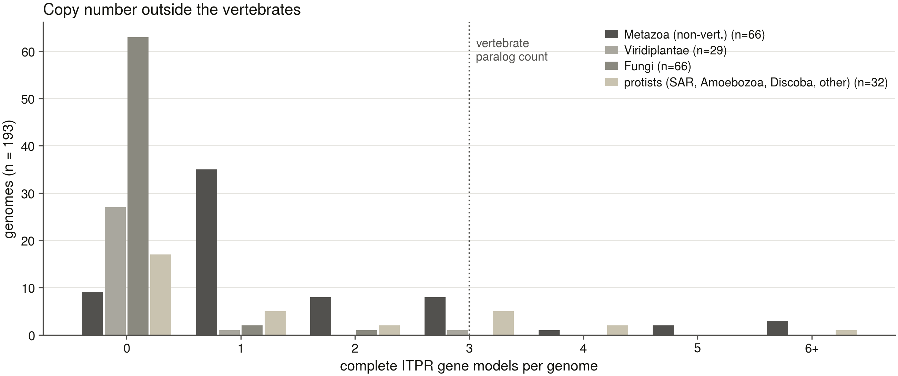
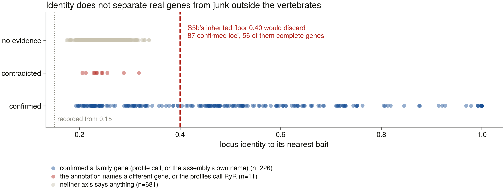
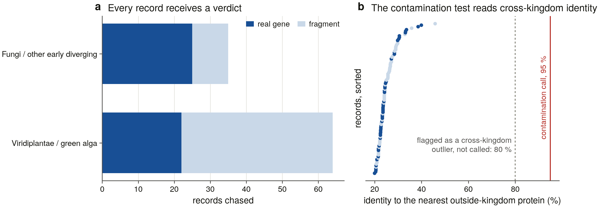
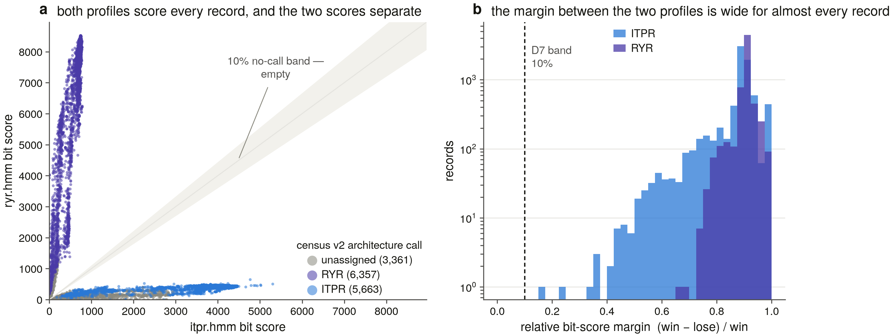

# Protein Variant Finder — and the ITPR census

Two things live in this repository:

1. **A GUI/CLI tool** that enumerates every known protein isoform / ortholog
   of a gene across NCBI, Ensembl, UniProt, Compara, BLAST, AlphaFold DB and
   Foldseek, then analyses what it finds (MSA → tree → clusters →
   novel-paralog scoring).
2. **A publication project** using that tool: a systematic census of the
   **IP3 receptor (ITPR) family** — the endoplasmic reticulum's ligand-gated
   calcium-release channel — across a declared set of genomes and proteomes,
   to the evidence standard of an MBE / GBE / Genome Research paper. Plan and
   task ledger: [`PUBLICATION_ROADMAP.md`](PUBLICATION_ROADMAP.md);
   per-session narrative: [`SESSION_LOG.md`](SESSION_LOG.md); the biology:
   [`docs/ip3r_background.md`](docs/ip3r_background.md).

> **Reading order for a new session:** `PUBLICATION_ROADMAP.md` (protocol +
> ledger) → `docs/session_briefs.md` (the current task's brief) →
> `INTERFACE.md` (module map). This README is the state-of-the-project
> summary and is refreshed at the end of every session.

**Status: S3 complete — the census now carries two independent verdicts on
every protein.** The literature baseline is verified with a citation on every
claim ([`docs/ip3r_review_2026.md`](docs/ip3r_review_2026.md), 32 pages,
12 figures), the discovery scorer is benchmarked at **96 % recall / 100 %
specificity** ([`results/benchmark_controls/`](results/benchmark_controls/)),
and the domain enumeration returned **15,421 proteins across 1,488 taxa**
([`results/census_v2/`](results/census_v2/)). S3 then built two profile
HMMs — `itpr.hmm` and `ryr.hmm` — and swept **763 vertebrate reference
proteomes (14.4 M proteins)**. Profile assignment and the domain-architecture
rule read entirely different evidence and **agree on 11,875 of 11,876
records**; the profiles resolve **2,314 of the 3,361 the architecture rule
could not call**, and add **618 proteins the domain search never returned**.
Census v3 is **16,039 records — 8,000 IP3 receptors, 7,432 ryanodine
receptors, 605 uncallable, 2 conflicts**
([`results/census_v3/`](results/census_v3/)). S4 declared the genome
denominator — **309 assemblies, 161 vertebrate orders ∪ 169 margin species,
552.5 Gbp** ([`results/genome_manifest.tsv`](results/genome_manifest.tsv)) —
and S5a built and calibrated the genomic sweep that runs over them. **S5b then
swept all 309 genomes — 2,144 gene loci, zero failures** — producing the
found/lost/assembly-gap ledger and census v4 (17,097 records)
([`results/genome_ledger/report.md`](results/genome_ledger/report.md)). **S20
then swept the rest of the tree — 6,928 non-vertebrate reference proteomes,
63.1 M proteins, 24.93 G residues** — and settled the plant and fungal
question: **land plants 0/384 and Dikarya 0/1,353**, each negative carrying a
positive control inside the same search, and all 99 plant and fungal records
chased individually to **47 real genes, 52 fragmentary models and zero
contaminants**. Census v5 is **17,882 records, 8,807 IP3 receptors across
1,401 taxa** ([`results/s20_sweep/report.md`](results/s20_sweep/report.md)).
**S20b** then iterated each group's search to convergence and found the same answer the expensive way: in all four groups the iterated model settles on **exactly** the single pass's receptor count, so nothing was missed.

**S23a** built the instrument that takes those absences to *genome* level — a declared **194-genome, 100 Gbp** denominator, thresholds re-measured for a tree where the family's gene span varies 100× rather than 6.5×, and a **new positive control**, because S5's ryanodine-receptor control does not exist in plants or fungi and would have made every negative claim look controlled while being unfalsifiable ([`results/s23_scope/report.md`](results/s23_scope/report.md)). Piloted on the 14 anchor genomes, **0 failures**: every positive control recovered and annotation-matched, and the Dikarya and land-plant absences are now *controlled* genome facts — while *Toxoplasma* comes back `uncontrolled`, so the Apicomplexa absence cannot yet be taken to assembly level.

**S23b** then had to fix the control before the sweep could run. S23a's
apicomplexan genome came back `uncontrolled` — no receptor *and* no control —
so the Apicomplexa absence was unprovable. The fault was not the control
protein; it was **choosing one control protein in advance for every clade**.
Which family makes a good control is a property of the clade and can be
measured: six candidate profiles run over each clade's own swept proteomes,
each clade takes the one that is there. **Apicomplexa takes myosin — present
in 36/36 and 23/23 of its swept proteomes** against the old control's one
protein per class — and *Toxoplasma* is now controlled *across a kingdom
boundary*. **Red algae make the same point in reverse**: they have largely
lost myosin (8 % of proteomes), so they take a chromosome-maintenance protein
at 12/12. Two thresholds were re-measured the same way — a locus identity
floor that could not be measured at all until the sweep stopped discarding the
evidence at the very cut-off being calibrated (**D27**), and copy number, which
is now counted on complete alignments rather than on alignment clusters after
*Drosophila*'s 22 kb receptor was found sitting inside a **297 kb cluster —
35× its own coding footprint** (**D28**).

**S23c** ran it: **194 genomes, 100 Gbp, 0 failures**. **All 35 absence clades hold at assembly level and all 35 are controlled** — Ascomycota 0/31, Streptophyta 0/25, Basidiomycota 0/17, **Apicomplexa 0/3** — with **zero genomes uncontrolled**, against 1 of 14 in the pilot. **Copy number outside the vertebrates runs 0 to 18**: most invertebrates have one, but the flatworm *Macrostomum lignano* has **18** complete genes (its 62 database records resolve to 18 real ones), the ciliate *Stentor coeruleus* 13, sponges 6 and 8. And the sweep retired a threshold rather than retuning it: **identity to the nearest bait does not separate real genes from junk out here** — the genuine ones reach down to 19 %, the junk up to 32 %, and S5b's inherited 0.40 would have discarded **87 confirmed loci, 56 of them complete genes**. Similarity to the nearest reference measures how far away the nearest reference is, which outside the vertebrates is a whole phylum (**D29**). The family call is now the profile's, validated 10/10 and 10-of-11 against the assemblies' own annotations. → [`results/s23_scope/report.md`](results/s23_scope/report.md)





---

## Quickstart

```bash
# GUI
python run.py --email you@example.com

# Headless, against live APIs
python run.py --headless --preset ip3r --save-results
python run.py --headless --preset ip3r_zebrafish --save-results

# The project dashboard (stdlib only, no env needed)
python3 scripts/dashboard.py --open
python3 scripts/dashboard.py --watch &

# Is the bulk-storage drive attached? (exit 1 = no; that is a stop)
python -m src.utils.data_root --require
```

Dependencies: `pip install -r requirements.txt` (`biopython`, `requests`).
The analysis toolchain is installed and version-pinned as of S1 — MAFFT
v7.526, HMMER 3.4, BLAST+ 2.16.0+, miniprot 0.18-r281, trimAl v1.5.rev1,
IQ-TREE 2.3.6, NCBI `datasets` 18.35.0, Foldseek 10.941cd33. Exact paths and
Python package versions:
[`results/toolchain_manifest.txt`](results/toolchain_manifest.txt),
regenerated by `python3 scripts/s1_toolchain.py`. BLAST+, `datasets` and
Foldseek resolve inside the `piezo1` conda env rather than on the bare PATH,
so run project scripts with
`/opt/anaconda3/envs/piezo1/bin/python` (Decisions D18).

---

## The science

The IP3 receptor releases calcium from the ER when IP3 binds it — the origin
of most agonist-evoked calcium signals in non-muscle cells, of the calcium
waves that pattern development, and of the ER-to-mitochondrion transfer that
sets the apoptotic threshold. Vertebrates have three paralogs of about 2,700
residues each, assembled as tetramers, and each is associated with a
different human disease:

| Gene | UniProt | Length | Disease association *(verified in S0)* |
|------|---------|--------|-----------------------------------------|
| ITPR1 | Q14643 | 2,758 aa | spinocerebellar ataxia (SCA15/SCA29), Gillespie syndrome |
| ITPR2 | Q14571 | 2,701 aa | autosomal recessive isolated anhidrosis |
| ITPR3 | Q14573 | 2,671 aa | dominant Charcot–Marie–Tooth neuropathy |

**The complication that shapes the project.** The ryanodine receptors
(RYR1/2/3, ~5,000 aa) carry *every* Pfam domain that marks an IP3 receptor —
checked directly: human RYR1 carries PF08709, PF01365, PF08454 and PF02815.
They are inside every search this project runs. So separating ITPR from RYR
is a positive test at every stage (roadmap Decisions **D14**) — and, turned
around, it is an opportunity: both families get counted by the same
instrument, and RyR gives the ITPR tree a proper outgroup.

### What is already visible

Re-derived by S0 on 2026-08-18 and enumerated to exhaustion by S2 on
2026-09-03 ([`results/census_v2/`](results/census_v2/)):

- The family is overwhelmingly an animal family — **10,936 of the 15,421**
  enumerated proteins are vertebrate, another 3,706 non-vertebrate metazoan.
- **Outside the animals it survives in a pattern, not at random — and S20
  showed the pattern is real.** Sweeping the proteomes themselves, with no
  Pfam-annotation filter: **Streptophyta 0/384 reference proteomes** against
  15/48 in the green algae, and **Dikarya 0/1,353** against 28/1,527 across
  the fungi. The fungal losses are patchy rather than basal — Glomeromycota,
  Mortierellomycota, Kickxellomycota and Microsporidia are empty too. Absent
  from bacteria (0/3,537) and archaea (0/634) entirely.
- **Half of what the search returns is the wrong family.** 6,807 of the
  15,421 records are ryanodine receptors, which carry every ITPR-diagnostic
  Pfam. Separating them is a positive test at every stage (**D14**).
- **One signature is not enough to find the family.** Enumerating on
  PF08709 alone — the IP3-binding core, the domain that names it — would
  miss 2,914 records, 758 of them real IP3 receptors across 385 taxa
  (**D21**).
- Zebrafish carries **four**: `itpr1a`, `itpr1b`, `itpr2`, `itpr3` — the
  first two look like a teleost-duplication pair.

### The questions the project answers

- **Range.** What is the family's true taxonomic distribution, and are the
  famous absences facts about genomes or about proteome databases?
- **Origin.** Are ITPR1/2/3 2R ohnologs? Are the teleost pairs from 3R? Did
  the ryanodine receptors triplicate at the same time?
- **Fates.** Has any paralog ever been lost, and how often independently?
- **Records.** How often is a real ITPR locus missing, split, unnamed, or
  filed as a ryanodine receptor?
- **Machine.** Do the pathogenic variants sit in the most constrained parts
  of the channel, and is the constrained core the same in all three paralogs?
- **Anything unnamed.** Is there a fourth vertebrate ITPR, or an ITPR in a
  lineage reported to lack one?

---

## Project status board

One task per session. Full ledger with dependencies and results in
[`PUBLICATION_ROADMAP.md`](PUBLICATION_ROADMAP.md).

| ID | Task | Status |
|----|------|--------|
| S0 | Literature baseline + scope confirmation | ✅ completed 2026-08-18 |
| S1 | Toolchain + positive/negative controls (RyR is the sharp decoy) | ✅ completed 2026-08-18 |
| S2 | Uncapped InterPro enumeration → census v2 | ✅ completed 2026-09-03 |
| S3 | Profile-HMM sweep (itpr.hmm + ryr.hmm) + convergence argument | ✅ completed 2026-09-04 |
| S4 | Genome scope manifest (the denominator) | ✅ completed 2026-09-04 |
| S5a | Genomic sweep: bait panel, calibrated pipeline, pilot | ✅ completed 2026-09-04 |
| S5b | The full 309-genome sweep → ledger + census v4 | ✅ completed 2026-09-05 |
| S20a | Non-vertebrate sweep — the family's true range | ✅ completed 2026-09-05 |
| S20b | The remaining per-group convergence runs | ✅ completed 2026-09-05 |
| S23a | Non-vertebrate sweep: scope, calibration, bait panel, pilot | ✅ completed 2026-09-05 |
| S23b | The blocking measurements, and the instrument they change | ✅ completed 2026-09-06 |
| S23c | The full 194-genome non-vertebrate sweep → census v6 | ✅ completed 2026-09-06 |
| S6 | Alignment upgrade (MAFFT L-INS-i + trimAl) | ⏳ pending |
| S7 | ML phylogeny, rooted on RyR; which paralogs are sisters | ⏳ pending |
| S8 | Synteny across the ITPR loci | ⏳ pending |
| S9 | ML selection (codeml, HyPhy RELAX) | ⏳ pending |
| S10 | Annotation-bug molecular validation | ⏳ pending |
| S11 | Structures + TM-align vs cryo-EM references | ⏳ pending |
| S12 | Expression evidence (SRA junction reads) | ⏳ pending |
| S13 | Reconciliation & dating | ⏳ pending |
| S15 | Loss dynamics | ⏳ pending |
| S16 | Duplication history (2R / 3R, and the RyR parallel) | ⏳ pending |
| S17 | Constraint & function — the clinical-variant test | ⏳ pending |
| S18 | Annotation-quality audit + correction list | ⏳ pending |
| S19 | Methods results | ⏳ pending |
| S21 | Gene architecture (~58 exons) | ⏳ pending |
| S22 | Ligand-site evolution | ⏳ pending |
| S14a | Manuscript assembly | ⏳ pending |
| S24 | Supplementary figures + figure audit | ⏳ pending |
| S14c | Manuscript rewrite pass | ⏳ pending |
| S14b | Deposit + release (Zenodo, public repo, preprint) | ⏳ pending — human-gated |

---

## Findings so far

Plain-language entries per task: [`FINDINGS.md`](FINDINGS.md). Headlines:

**S20 — the land plants really did lose it, and the search that says so can
be checked.** Zero IP3 receptors in 384 land-plant reference proteomes and 16
million proteins — every flowering plant, moss, fern and conifer in the set —
while the green algae next door have it. The same for the yeasts and moulds:
zero in 1,353 proteomes. What makes those numbers worth believing is what the
same search finds in the same genomes: the domain the family shares with
unrelated proteins comes back **633 times in land plants and 4,376 times in
the Dikarya**, and the domain that names the family comes back **not once**.
The instrument is working there; it is finding everything except the receptor.
→ [`results/s20_sweep/report.md`](results/s20_sweep/report.md)


**S20 — the plant and fungal records are real genes, not database mistakes.**
All 99 were chased one at a time against the obvious worry, that a sequencing
project had picked up an animal and filed its DNA under an alga. Every record's
nearest relative outside its own kingdom sits at **20–46 % identity, median
24 %** — the ordinary range for genes that parted a billion years ago, nowhere
near the 95 % that would mean a sequence in the wrong assembly. Not one
contaminant, and not one without a genome to sit in.
→ [`results/s20_sweep/report.md`](results/s20_sweep/report.md)



**S5b — searched as DNA, the two families never once get confused.** Across
**2,144 gene loci in 309 genomes, every one was matched by one family's
sequences and not at all by the other's** — not one close call. This is the
family that defeated this project's own detector completely at the protein
level, where ryanodine receptors carry every signature that identifies an IP3
receptor. The ambiguity is a property of searching protein fragments, not of
the two families.
→ [`results/genome_ledger/report.md`](results/genome_ledger/report.md)


**S5b — lampreys and hagfish have one receptor where other vertebrates have
three.** The only `absent` calls in 309 genomes, and there are four of them:
*Petromyzon marinus* and *Myxine glutinosa* each carry ITPR1 and lack ITPR2 and
ITPR3. Both genomes clear the contiguity bar and both fired the positive
control, so the call survives the two gates that disqualify every other
candidate absence. Jawless fishes split before the genome duplications thought
to have produced most vertebrate gene trios. **Everywhere else in the jawed
vertebrates — sharks, rays, coelacanth, lungfish, and every bird, fish, mammal,
amphibian and reptile in scope — there is no evidence of loss at all**: 98–99 %
recovery in any genome assembled well enough to hold the gene.

**S5b — 485 receptor genes no name-based search can reach.** 318 exist only as
DNA, and 167 more sit inside a gene the databases record but never named. And
the databases are not equally good at the three paralogs: controlling for
assembly quality, a gene model names the right paralog 88 % of the time for
ITPR3 but only **65 % for ITPR1** — genes of near-identical protein length in
the same genomes, so any count built from names reports a copy-number
difference that does not exist.

**S5a — the genomes we suspected are mostly the genomes we cannot read.**
The 169 "margin" species were flagged because their protein sets were missing
an IP3 receptor or held only fragments. Before searching them we asked whether
their assembled pieces are even long enough to hold the gene, which spans
80–500 kb. **120 of the 309 genomes are not** — and not at random: **66 % of
birds against 11 % of ray-finned fishes, 68 % of margin species against 12 %
of order representatives.** The suspicion and the artefact that would
manufacture it live in the same genomes. Worse, the bias runs the same
direction as the biology: below the bar the pilot recovers the compact ITPR3
(82 kb) in 2 of 3 genomes and the sprawling ITPR1 (186 kb) and ITPR2 (231 kb)
in none — a broken assembly loses the *big* paralogs first, which is exactly
the pattern that would be read as birds having lost ITPR1 and ITPR2.
→ [`results/genome_ledger/report.md`](results/genome_ledger/report.md)

**S5a — two inherited constants that did not survive measurement.** This
project's machinery is ported from the PIEZO project, whose decisions are
carried forward as pre-agreed rules. Two of them were numbers, and numbers do
not port. miniprot's max-intron setting is a threshold on the ledger's own
call — too small, and a gene is *split* and reads as a fragment — so it was
measured: **no IP3 receptor in an 11-species panel has an intron over the
200 kb default**, though the ryanodine control exceeds it twice. And the
margin used to attribute a fragmentary trace to a paralog came from a family
whose paralogs are 40–50 % identical, where these are 61–68 %: at complete
loci of independently-known identity, **7 of 9 fall below it**, so under the
inherited value no absence could ever have been attributed (new decision
**D25**).

**S5a — searched as DNA, the two families stop confusing each other.**
Ryanodine receptors carry every protein signature that identifies an IP3
receptor, and at the protein level they fooled this project's own detector
completely (S1). Across the pilot's **43 genomic loci, every one was matched
by one family's baits and simply not by the other's.** The ambiguity is a
property of searching protein fragments, not of the two families.

**S3 — a second opinion on 15,000 proteins, and one correction.** The
domain rule and the sequence profiles read completely different evidence —
one reads what a database says a protein carries, the other reads the
residues — and they disagree on **exactly one record in 11,876**. That one
is a real correction: a 2,845-aa slime-mould protein filed as a ryanodine
receptor because it carries a domain *named* "Ryanodine Receptor TM 4-6",
which is in fact the pore both families share. The profiles score it 303 to
133 the other way. Meanwhile the profiles resolve **2,314 of the 3,361
records the domain rule had to leave uncallable**, and the sweep's misses,
checked one by one against the search database, include **zero sensitivity
failures**.
→ [`results/census_v3/report.md`](results/census_v3/report.md)



**S3 — the sister family's shared module nearly wrecked the sweep.** The
first run called **14,981 vertebrate proteins ryanodine receptors** —
troponins, calcium-binding proteins, ubiquitin ligases — because `ryr.hmm`
contains SPRY, a small module that sits in thousands of unrelated proteins
and that `itpr.hmm` has nothing to match against. The gate is measured, not
chosen: a match must span **200 model positions**, which is the shortest this
project has measured the family's own defining domain (PF08709) to be, and
comfortably above the longest SPRY it has measured (137). A by-product is
the project's largest annotation lead so far — **1,794 hits carrying a real
family gene name that fall under the gate**, because their gene models have
been broken into pieces too short to recognise.

**S1 — the search called all six ryanodine receptors IP3 receptors.**
Benchmarked against 25 known family members and 31 impostors, the discovery
scorer promoted **every single ryanodine-receptor decoy** at a score of 45.
They carry all four of the domain signatures that define the family, so the
strongest evidence the scorer has is the one piece that cannot tell the two
families apart. The fix ignores gene names entirely — a candidate is asked
whether it is more similar to a labelled IP3 receptor or to a labelled
ryanodine receptor. That comparison separates them completely: true family
members lean the right way by 7–87 points, ryanodine receptors by 54–87, with
no overlap. Final scores: **recall 24/25, specificity 31/31.**
→ [`results/benchmark_controls/report.md`](results/benchmark_controls/report.md)

**S1 — but the test fails at the base of the tree.** *Dictyostelium*'s IP3
receptor is real and is called correctly, by 6.5 points — inside the band the
project's own rules treat as "too close to call". The comparison is a
metazoan instrument. Any claim about IP3 receptors in deep-branching
eukaryotes needs profile-based assignment instead (S3, S20).

**S0 — half of what a "clean" family search returns is the wrong family.**
Asking the databases for every zebrafish protein carrying PF08709 — the
IP3-binding domain that *defines* the family — returns 109 proteins.
**53 of them (49 %) are ryanodine receptors.** This is the exact query the
project's own planning document quoted as evidence that zebrafish carries
four IP3 receptors. It is a measured floor on the contamination every
Pfam-driven count inherits, and it is why separating ITPR from RyR is a
positive test at every stage rather than a filter.
→ [`results/s0_baseline/report.md`](results/s0_baseline/report.md)

**S0 — three genes, one machine, 6.5× different sizes.** ITPR1/2/3 encode
near-identical proteins (2,671–2,758 aa, within 3 %) from 57–62 exons each —
but ITPR2 spans 498 kb and **ITPR3 spans 76 kb**. This corrected a starting
claim that all three span "hundreds of kb". What has been adding or removing
intronic content in one paralog and not another is an open question for S21.

**S0 — the audit.** 19 claims checked against 51 references: 12 verified,
3 qualified, **2 struck**, 1 retagged as an open question (whether the IP3R
and RyR triplications were independent — that is the project's own Q2, and it
was about to be an assumption), 1 upgraded to a database fact.

**The literature baseline.** A full, 137-reference review of the family —
architecture and cryo-EM, gating and the all-four-sites requirement,
regulation, cell physiology, the three paralogues, evolution, genetic models,
human disease, pharmacology, and the eight questions the field cannot currently
answer. Read it as [markdown](docs/ip3r_review_2026.md) or as the typeset
[32-page PDF](docs/ip3r_review_2026.pdf). It is **generated** from
[`docs/review/`](docs/review/) by `scripts/s0_review_build.py` — edit the
section files, never the assembled document.

**Its twelve figures are generated too** (`scripts/s0_review_figures.py`),
each from a committed table and none from a live query, and each tagged on
the canvas as *measured*, *computed*, *schematic* or *curated* — the same
provenance discipline the prose uses. Measuring the deposited structure for
them produced three things the text had not had: the pore's filter and gate
recovered from geometry alone and landing on the residues the literature
names, the receptor's famous "100 Å" resolved into 103 Å along the axis and
120 Å through space, and a characterised *Dictyostelium* IP3 receptor that
carries **none** of the three signatures a census would look for.

---

## Storage

Bulk data (genome assemblies, reference proteomes, BLAST databases,
structures, SRA) never enters the repository. It lives under the path in
[`data_root.txt`](data_root.txt) — currently `/Volumes/FANTOM/IP3R_DATA`, an
**external drive that must be attached before any bulk session**. Moving it
is a one-line edit; the directory layout recreates itself.

`python -m src.utils.data_root --require` exits non-zero when the drive is
absent, and the session protocol runs it at the start of every session, so a
400 GB download cannot land on the laptop by accident.

Expected footprint, from the equivalent PIEZO-project measurements:
assemblies ~400 GB (fetch → search → delete keeps the live footprint near
20 GB), reference proteomes ~10 GB, sweep evidence ~30 GB, HMMER output
~12 GB, structures ~2 GB.

---

## Provenance

The application, the figure style, the dashboard, the manuscript-assembly
and claim-checking tooling and the session protocol are ported from the
PIEZO project (`../piezo_genes`), which took 24 sessions to build and
harden them. Its `INTERFACE.md` maps a reference implementation for most
tasks here, and its methodological rules are carried forward as **D0–D17**
in the roadmap's Decisions log rather than being re-derived.

The family is defined in exactly one place — `src/utils/family.py` — so
nothing else in `src/` hard-codes a gene name. **No result is ported.**
Every number in this repository must come from this project's own runs.
