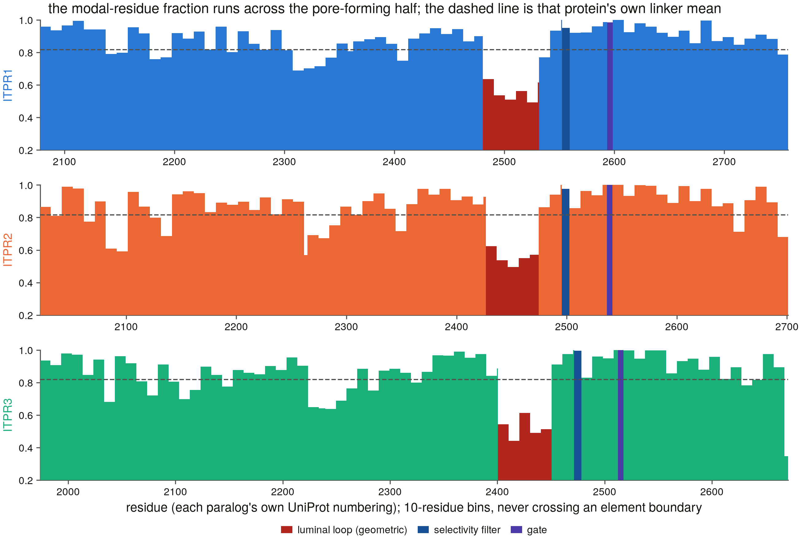

# The IP₃ receptor calcium channel is an ancient eukaryotic gene family, lost repeatedly outside the animals but kept in all three copies by every vertebrate

This repository holds a systematic survey of one gene family, the **IP₃
receptors** (genes *ITPR1*, *ITPR2* and *ITPR3* in humans), across 7,691
proteomes and 503 genomes spanning the eukaryotes. It asks where the family
occurs, where it has been lost, how the three human genes arose, which parts
of the protein evolution will not let change, and how well public databases
record the genes. The survey searches genomes directly rather than relying on
database names, runs the closely related **ryanodine receptors** as a built-in
control at every step, and generates every number and figure from tables
committed here.

The repository also contains the database-search application the survey was
built on (see [The Protein Variant Finder app](#the-protein-variant-finder-app)).

> **The write-ups:** a paper, *Retained in every vertebrate, lost repeatedly
> elsewhere: a 503-genome census of the IP₃ receptor family*
> ([`manuscript/`](manuscript/README.md), 60-page PDF); a long-form thesis
> covering the same work in full ([`thesis/`](thesis/README.md), 190-page
> PDF); the same results as six separate papers, each with its own question,
> controls and figures ([`papers/`](papers/README.md), 122 pages in all); and a
> literature review of the family
> ([`docs/ip3r_review_2026.pdf`](docs/ip3r_review_2026.pdf)).

**Status:** the analyses and all three write-ups are complete (36 of 37
planned tasks). One task remains: the public release with a DOI and preprint
(S14b), which needs a human. See [Project status](#project-status).

---

## Contents

- [Background: what the receptor does](#background)
- [Key terms](#key-terms)
- [What the survey covered](#what-the-survey-covered)
- [Key results](#key-results)
- [What the repository produces](#what-the-repository-produces)
- [Getting started](#getting-started)
- [Reproducing the analyses](#reproducing-the-analyses)
- [How the evidence is held to account](#how-the-evidence-is-held-to-account)
- [Repository layout](#repository-layout)
- [Project status](#project-status)
- [How this project was made](#how-this-project-was-made)
- [Citing, licence, contact](#citing-licence-contact)

---

## Background

Most cells store calcium inside the endoplasmic reticulum (ER), a membrane
network in the cytoplasm. When a hormone or neurotransmitter binds a receptor
on the cell surface, the enzyme phospholipase C (PLC) makes a small messenger
molecule, inositol 1,4,5-trisphosphate (IP₃). IP₃ diffuses to the ER and opens
the **IP₃ receptor**, a channel of four identical ~2,700-residue subunits, and
calcium pours out of the store. This release starts most hormone-driven calcium
signals in non-muscle cells, drives the calcium waves that pattern early
development, and passes calcium to mitochondria, where it helps set whether a
cell survives or dies.


**How to read this figure.** (**a**) A schematic of the signalling pathway:
an agonist activates a surface receptor, PLC converts the membrane lipid PIP₂
into IP₃, and IP₃ opens the receptor on the ER, releasing calcium. The receptor
(blue) is the protein this project studies. (**b**) The channel drawn to the
dimensions measured on the cryo-EM structure PDB 6DQN. Most of each subunit is
a large cytosolic domain (the "solenoid") above the membrane. The IP₃ binding
sites sit about 103 Å above the channel's gate, so a signal has to travel a long
way through the protein to open it. The bar underneath shows one subunit as a
line of 2,671 residues, with its recognised domains as coloured blocks and the
pore at the end. (**c**) The actual amino-acid sequence at two key places, in
the three human receptors and the fly receptor: one of the residues that grips
IP₃, and the selectivity filter that lets calcium through. Filled cells are
identical in all four sequences, and red outlines mark residues the structure
shows doing the job. Both sites are unchanged between humans and flies, whose
lineages split more than 550 million years ago.

Vertebrates have three versions of the gene, and each is linked to a different
human disease:

| Gene | UniProt | Length | Disease association |
|------|---------|-------:|---------------------|
| *ITPR1* | [Q14643](https://www.uniprot.org/uniprotkb/Q14643) | 2,758 aa | spinocerebellar ataxia 15/29, Gillespie syndrome |
| *ITPR2* | [Q14571](https://www.uniprot.org/uniprotkb/Q14571) | 2,701 aa | isolated anhidrosis (inability to sweat) |
| *ITPR3* | [Q14573](https://www.uniprot.org/uniprotkb/Q14573) | 2,671 aa | Charcot–Marie–Tooth neuropathy |

**Why a new survey was needed.** Statements about where the family occurs
("present in animals, absent from land plants and yeast") come from searches
whose scope was never written down, so an absence could mean the gene is
missing or that nobody looked properly. Three properties make this family
especially easy to get wrong:

1. **A close relative carries all the same signature domains.** The
   ryanodine receptors (RYR1/2/3, ~5,000 residues), which release calcium in
   muscle, contain every protein domain used to recognise an IP₃ receptor. Any
   search sensitive enough to find a divergent IP₃ receptor also finds them:
   6,807 of the first 15,421 records this project collected were ryanodine
   receptors. Every step here therefore has to decide positively which family
   a hit belongs to. In return, the ryanodine receptors make an ideal control,
   measured by the same methods in the same genomes.
2. **The gene is long.** It has about 58 exons spread over tens to hundreds of
   kilobases of DNA, which is longer than the assembled DNA fragments
   ("contigs") of many published genomes. A gene that looks missing is often
   just broken across fragments.
3. **It is poorly named in databases.** Many copies are filed under
   placeholder names or no name at all, so searching by name undercounts the
   family.

The biology baseline, with every statement graded by how far it can be
trusted, is in [`docs/ip3r_background.md`](docs/ip3r_background.md).

---

## Key terms

| Term | Meaning here |
|---|---|
| **Paralogue** | One of several related genes in the same genome that arose by gene duplication. *ITPR1*, *ITPR2* and *ITPR3* are paralogues. |
| **Orthologue** | The same gene in a different species (human *ITPR1* and mouse *Itpr1*). |
| **2R / 3R** | Whole-genome duplications. Two rounds (2R) happened early in vertebrate evolution; a third (3R) happened in the ancestor of teleost fish (most living fish). |
| **Proteome / genome** | A proteome is a database's list of a species' predicted proteins; a genome is the assembled DNA. A gene can be in the genome but missing from the proteome if gene prediction failed. |
| **Contig N50** | A measure of how fragmented a genome assembly is: half the assembly is in pieces at least this long. |
| **Contiguity bar** | The contig N50 (142 kb) below which an assembly is too fragmented to reliably hold a whole IP₃ receptor gene on one piece. Absences below it are treated as undecidable. |
| **ω (dN/dS)** | The rate of protein-changing DNA mutations relative to silent ones. ω = 1 is neutral; ω far below 1 means natural selection removes most changes to the protein. |
| **Positive control** | A second, unrelated, long and widely conserved gene searched in the same genome. If it is found, the search demonstrably worked there, so a missing IP₃ receptor is a real absence. |

---

## What the survey covered

The survey declares its search space up front and searches genome DNA
directly, so a missing gene can be told apart from a missing database record.

| Search space | Size |
|---|---|
| Reference proteomes searched with profile models of both families | **7,691** (77.6 million proteins): 763 vertebrate and 6,928 other eukaryotes, plus 634 archaea and 3,537 bacteria |
| Vertebrate genomes searched directly: one per taxonomic order, plus every species the databases left in doubt | **309** |
| Non-vertebrate genomes, sampled most densely in the groups reported to lack the gene | **194** |
| Vertebrate IP₃ receptor genes found and placed in a genome | **923**, with 309 ryanodine receptor genes measured alongside as the control |

On this census the project builds a family tree of 134 representative
proteins, tests how the three genes arose using the genes around them on the
chromosome, measures natural selection on each gene, dates the duplications,
counts gene losses, compares exon–intron structure, maps which residues are
conserved onto the 3-D structure, tests that map against human disease
variants, audits how every gene is recorded in public databases, and measures
how often its own search fails.

---

## Key results

### 1. The receptor is ancient in eukaryotes, and land plants, yeasts and several other groups have lost it

**Why it matters.** Whether a gene family is an animal invention or an
ancient eukaryotic feature that some lineages discarded changes how we
understand calcium signalling in plants, fungi and parasites. The standard
answer relied on searches that were never controlled.

**What we found.** The receptor is present in animals, amoebae, green algae,
the early-branching fungi and several protist groups, so it was already
present in the common ancestor of eukaryotes. It is absent from **all 384
land-plant** and **all 1,353 Dikarya** proteomes (the yeasts, moulds and
mushrooms), and from the malaria parasites and their relatives
(Apicomplexa), Microsporidia, red algae, diatoms and four further fungal
phyla. It never occurs in bacteria or archaea. The pattern points to
repeated, independent losses rather than one loss in a common ancestor.


**How to read this figure.** Each bar is one phylum or class. Its length is
the fraction of that group's reference proteomes in which an IP₃ receptor was
found, with the count beside it (for example 292/311 arthropod proteomes). The
italic labels on the right name the larger group each block belongs to.
Counting proteomes rather than protein records stops a single well-studied
species from dominating a group. Bars at zero with large counts (land plants
0/384, Ascomycota 0/1,034) are the absences.

A proteome that lacks a gene could still carry it in its genome, if the gene
predictor missed it. So each absence was re-tested in the genomes themselves:


**How to read this figure.** Each row is a group with no IP₃ receptor in its
proteomes (the number in brackets is how many proteomes were searched). The
grey bar counts the genomes of that group searched directly in which the
positive control was found, which proves the search reached the assembly. A
blue bar would mark a genome where an IP₃ receptor turned up after all. There
are none: all 35 group-level absences hold at the genome level.

### 2. No vertebrate genome has lost any of the three genes

**Why it matters.** Most gene families lose copies over evolutionary time,
and a lost paralogue tells you which functions a lineage could do without.
Apparent losses in vertebrate genomes had never been checked against the
assemblies themselves.

**What we found.** None of the 927 gene slots (309 genomes × 3 genes) is a
confirmed loss. Every apparent absence sits in an assembly too fragmented to
hold the gene. In all 189 assemblies contiguous enough to hold it, all three
genes are present. A formal count of losses along the vertebrate tree (Dollo
parsimony) gives zero. The analysis also asks what it would take to
manufacture a loss by re-running the count under 32 combinations of analysis
settings. Counted for the family as a whole, only 2 of the 32 produce any
loss, and the worst produces a single one, only when the analysis both accepts
nothing but a complete gene and ignores the contiguity bar. Counted gene by
gene, 18 of the 32 produce losses, which is why an apparent absence of one
particular paralogue in a fragmented genome should not be trusted.


**How to read this figure.** (**a**) Each column is one of the 309 vertebrate
genomes, ordered from most fragmented (left) to most complete (right). Each
row is one of the three genes. Dark blue means one complete gene was found;
lighter shades mean the gene was found but broken or split by a poor assembly.
No cell anywhere is "absent". The vertical line is the contiguity bar: every
incomplete call sits to its left, in the 120 genomes too fragmented to hold the
gene on one piece. (**b**) The number of IP₃ receptor genes each genome holds.
Every genome above the bar (blue) has at least three.

**How reliable is a "zero losses" result?** Because the gene is known to be
present everywhere, every place the search failed to find it measures the
method's own miss rate:


**How to read this figure.** (**a**) The fraction of gene slots where the
search missed a gene known to be present, grouped by assembly contiguity, for
the IP₃ receptors (blue) and, independently, the ryanodine receptors (purple).
Misses are common in fragmented assemblies (about 45 % below 50 kb) and nearly
vanish above the contiguity bar (dashed). (**b**) The miss rate that remains if
genomes below a given contiguity are discarded: at the bar it falls to 0.9 %.
(**c**) How many genomes each cut-off costs. Overall the search missed 140 of
923 present genes (15.2 %), every miss traces to the assembly, and the
ryanodine receptors agree (13.6 %). This is what makes "no losses" a
measurement rather than a failure to look.

### 3. *ITPR2* and *ITPR3* are each other's closest relatives, and both splits happened over 460 million years ago

**Why it matters.** Knowing the order in which the three genes arose tells us
which of them is most like the ancestral receptor, and whether the vertebrate
whole-genome duplications created them.

**What we found.** The tree places the three genes as separate groups, with
*ITPR2* and *ITPR3* as sisters. A formal test rejects both alternative
pairings. Dating places the *ITPR1* split on the stem of all vertebrates and
the *ITPR2*/*ITPR3* split on the stem of jawed vertebrates, 462–563 million
years ago.


**How to read this figure.** A maximum-likelihood tree of 134 representative
proteins from across the eukaryotes. Branch length is amino-acid change
(scale bar: 0.5 substitutions per site). The ryanodine receptors (purple box,
top) root the tree. Invertebrate, protist, plant and fungal receptors (grey)
branch off first, and the vertebrate receptors fall into three boxed groups,
*ITPR1* (blue), *ITPR2* (orange) and *ITPR3* (green). The two numbers beside
each box are the statistical support for that group (SH-aLRT / ultrafast
bootstrap, out of 100). *ITPR2* (97/100) and *ITPR3* (98/99) are strongly
supported. *ITPR1* (48/95) is weaker, because several shark and jawless-fish
genes (grey, "paralog unassigned") sit near its base. Black dots mark nodes
that pass both support thresholds.


**How to read this figure.** Each row is one possible answer to "which two
genes are closest relatives". (**a**) How much worse the tree fits the data
when it is forced into that arrangement: forcing *ITPR2*+*ITPR3* costs almost
nothing (0.5 log-likelihood units), and the other two cost 114. (**b**) The
approximately unbiased (AU) test p-value: arrangements to the left of the red
line (p < 0.05) are rejected. *ITPR1*+*ITPR2* and *ITPR1*+*ITPR3* are rejected
at p < 2 × 10⁻⁵, so the result is an exclusion, not just a preference.

The genes surrounding each receptor on its chromosome tell the same story
from independent evidence. After a whole-genome duplication, the neighbours of
a duplicated gene are duplicated too, so paralogous neighbourhoods keep
matching pairs of genes:


**How to read this figure.** (**a**) For each pair of receptor genes, the
fraction of the 309 genomes in which their chromosomal neighbourhoods share
at least one pair of related genes (light blue), and a pair specifically dated
to the vertebrate duplications (dark blue). The red dashed line is the rate for
random genomic neighbourhoods of the same size (2.6 %). The *ITPR1*–*ITPR3*
neighbourhoods share duplication-dated genes in over half of all genomes,
about twenty times the random rate. (**b**) The same test in the human genome,
with the ryanodine receptors as a control (red diamonds are the random
expectation). The retained neighbourhood links run through *ITPR1*. They
record which copies survived deletion rather than the order of branching,
which is why they can point differently from the tree.

### 4. *ITPR1* is the copy fish kept twice, and the one selection guards most tightly

**Why it matters.** After a genome duplication most extra copies are lost
again. Which copies are kept, and how strongly each is protected, shows which
functions are under the most pressure.

**What we found.** In teleost fish only *ITPR1* was kept in two copies after
the fish-specific genome duplication (97.3 % of 73 teleost genomes carry both).
*ITPR1* is also under roughly twice the purifying selection of its sisters: its
ω is 0.024 against 0.043 and 0.042, and a separate test (RELAX) finds selection
on *ITPR1* intensified (k = 9.36).


**How to read this figure.** (**a**) Average number of copies of each gene per
genome, in three groups of ray-finned fish: lineages that split off before
the fish-specific duplication (bichir, gar, bowfin), teleosts (which went
through it), and lineages with a further, more recent duplication (sturgeon,
salmon). Before the duplication every IP₃ receptor gene has one copy; in
teleosts *ITPR1* alone has two; with the extra duplication all have more. The
ryanodine receptors (purple, three genes counted together) double as expected,
showing that the method detects duplicated copies. (**b**) The fraction of genomes in each
vertebrate class with more than one copy. Essentially only ray-finned fish
(Actinopteri) carry a second IP₃ receptor copy, and in them it is almost
always *ITPR1*.


**How to read this figure.** Each bar is one gene's ω (dN/dS) on a log scale.
The dashed line at ω = 1 is neutral evolution. All three sit far below it, so
selection removes almost every protein-changing mutation, and *ITPR1*'s bar is
about half the height of the others. Hatched bars repeat the estimate using
only curated database sequences, which shows the result does not depend on
this project's own gene reconstructions.

### 5. The three genes still share one exon–intron layout, more than 460 million years after they split

**Why it matters.** Intron positions change slowly, so shared positions are
strong evidence of common ancestry, and they show whether the duplicates
inherited one gene structure or rebuilt it.

**What we found.** In every genome, the three genes share 46 to 49 of their
roughly 58 intron positions, 85 to 88 times more than chance. The ryanodine
receptors, which carry all the same protein domains, share only one, so the
domain resemblance between the two families is not matched by a shared gene
structure.


**How to read this figure.** (**a**) Every intron position observed in each
gene, ranked by the fraction of genomes that have it. All three IP₃ receptor
genes (blue, orange, green) share a core of about 48–49 positions found in at
least 90 % of genomes (the dashed line), before the curves drop steeply. The
ryanodine receptor (purple) has its own, separate core. (**b**) Each point is
one genome and one pair of genes: the number of intron positions the pair
shares (vertical) against the number expected by chance (horizontal). The
dashed line is chance. Pairs of IP₃ receptor genes share 25–50 positions where
chance predicts less than one; IP₃ receptor versus ryanodine receptor pairs
(purple) share about one.

### 6. The gate and the calcium filter are the least changeable parts of the channel, and the pore-lining loop between them the most

**Why it matters.** Residues that evolution never allows to change are the
ones the protein cannot work without, and mutations there are the likeliest
to cause disease. A map of conservation on the structure is therefore a map of
function and of clinical risk.

**What we found.** Across the channel-forming half of all three receptors,
the gate and the selectivity filter are the most conserved elements, and the
gate is identical between the paralogues. Yet only about 50 residues from
the filter lies a 50-residue loop facing the ER interior that is the least
conserved sequence in the whole receptor. Conservation also separates ClinVar's disease-causing variants from
its harmless ones well (area under the curve up to 0.87).



**How to read this figure.** One panel per gene, covering its last ~700
residues (horizontal axis, each gene's own numbering). Bar height is the
fraction of about 250 vertebrate orthologues that carry the most common amino
acid at that position, averaged over 10-residue windows: 1.0 means the site
never changes. The selectivity filter (dark blue) and gate (purple) sit near
1.0. The red block is the loop on the ER-interior side of the pore, which dips
to about 0.5. The dashed line is the average for the protein's linker regions,
for comparison.


**How to read this figure.** (**a**) How well four conservation measures
separate the positions of 44 pathogenic from 34 benign human variants in
ClinVar. Each curve plots true positives against false positives as the cut-off
moves; the dotted diagonal is guessing. The measures differ in which sequences
they compare: *deep* uses ~250 orthologues of the same gene, *vert* 57
vertebrate receptors of all three genes, *family* 128 receptors from across the
eukaryotes, and *shallow* a small panel as a baseline. The broadest,
*family*, predicts best (AUC 0.87), ahead of *vert* (0.85), *deep* (0.76) and
*shallow* (0.68). (**b**) For each gene and measure, the fraction of
variants of uncertain significance (VUS) that fall at or above the typical
conservation score of the known pathogenic variants (numbers are how many VUS
were scored). About a quarter of VUS in the deep measure look like pathogenic
variants by this criterion, which makes them priorities for follow-up. This is
a ranking for triage, not a diagnosis. The labelled set is small, and 49 of
the 55 pathogenic records are in *ITPR1*.

### 7. The IP₃-binding site is less conserved than the pore, and what is conserved is a 15 Å pocket rather than the ten contact residues

**Why it matters.** A channel opened by a ligand might be expected to guard
its binding site most closely. Testing that directly shows which part of the
receptor is actually under the tightest constraint.

**What we found.** Compared residue for residue in the same proteins, the
IP₃-binding core is slightly *less* conserved than the pore. This comparison
depends on one choice: counting the 50-residue ER-interior loop as part of the
pore reverses it in all three genes. The ten residues that touch IP₃ are
more conserved than the rest of the binding core, but not more than the other
residues of the surrounding pocket. What evolution preserves is the whole
pocket, about 15 Å across, rather than the contact residues alone.


**How to read this figure.** (**a**) Where the two modules sit along each
receptor: the IP₃-binding core (dark) near the start and the pore module
(coloured) near the end, with the ER-interior loop marked in red inside it.
(**b**) For each gene, the difference in sequence identity between the binding
core and the pore, measured separately in each of about 250 orthologues (box =
middle half of values, line = median). Below zero, the core is less conserved
than the pore. With the loop excluded (left, the primary definition) the
difference is at or below zero; with the loop included (right) it flips above
zero. The figure shows both, so a reader can see how much the conclusion
depends on where the pore is taken to end.


**How to read this figure.** (**a**) Every residue within 15 Å of the bound IP₃
(horizontal axis, distance measured in six independent structures), plotted by
how conserved it is across orthologues (vertical axis). Open circles are the
ten residues that directly contact IP₃; the dashed line is the average for the
whole protein. (**b**) Mean conservation in four distance shells. If only the
contact residues were constrained, conservation would drop sharply beyond
4.5 Å. Instead it stays high across the whole pocket and declines only
gradually, and every shell stays above the whole-protein average.

### 8. Public databases record the genes poorly, and the curation pipeline matters more than the gene

**Why it matters.** Most researchers find genes by searching protein
databases. If those databases miss or mislabel a gene, every downstream study
inherits the error.

**What we found.** 55.0 % of full-length IP₃ receptor protein records carry no
usable gene name, and 744 of the 923 IP₃ receptor genes this survey found in
genomes (80.6 %) cannot be reached by any protein-database search. Whether a gene is
recorded correctly depends mainly on which pipeline annotated the genome: NCBI's
curated RefSeq annotations have 98.8 % of loci complete, against 37.5 % for
annotations deposited by submitters in GenBank. The ryanodine receptors are
recorded no better in the same genomes, so the problem lies with the archives,
not with this particular family. A list of proposed corrections addressed to
the databases is in
[`results/annotation_audit/corrections.tsv`](results/annotation_audit/corrections.tsv).


**How to read this figure.** Each bar splits every IP₃ receptor gene the survey
found into five states according to the genome's own annotation: complete
(dark blue), split into several gene models, fragmentary, present only as a
non-coding record, or not annotated at all (red). (**a**) All genes; RefSeq
(top) is almost entirely complete, GenBank (bottom) mostly is not. (**b**) Only
genes in assemblies contiguous enough to hold them. The gap narrows (99.4 %
against 63.8 %) but stays large, so it is not only a matter of assembly
quality.


**How to read this figure.** Two individual genes this survey found in
published fish genomes, drawn to scale along the chromosome. Each vertical
tick is one exon. Red exons have no annotated gene model at all; blue exons
fall inside an annotated model (blue bars below). (**a**) In the croaker
*Nibea albiflora* the whole *ITPR2* gene, 56 exons over 52 kb, has no
annotation, although it sits in its usual place: its neighbour *SSPN* is
beside *ITPR2* in 197 of 215 vertebrate genomes. (**b**) In the Patagonian toothfish, *ITPR3* is chopped into
three separate gene models with 23 of its 60 exons outside any of them. Both
genes are real: their reading frames are intact, and public RNA-sequencing
reads cross their exon junctions, so they are transcribed and spliced.

The plain-language story, task by task, is in [`FINDINGS.md`](FINDINGS.md).
Each analysis also has its own rendered `results/<task>/report.md`.

---

## What the repository produces

| Output | Where | Built by |
|---|---|---|
| **Manuscript**: 17 sections, 7 main + 16 Extended Data + 6 Supplementary figures, 276 load-bearing numbers re-verified on every build, 60-page PDF | [`manuscript/`](manuscript/README.md) · [PDF](manuscript/itpr_family_manuscript.pdf) | `scripts/s14_assemble.py` |
| **Thesis**: 16 chapters + 5 appendices, ~80,700 words, 104 figures, 116 audited references, 190-page PDF | [`thesis/`](thesis/README.md) · [PDF](thesis/itpr_family_thesis.pdf) | `scripts/s25_assemble.py` |
| **Literature review**: 32 pages, 137 references, 12 figures, with a claim-by-claim audit | [`docs/ip3r_review_2026.pdf`](docs/ip3r_review_2026.pdf) | `scripts/s0_review_build.py --pdf` |
| **Analysis results**: one directory per task, holding tables, figures and a rendered `report.md` | [`results/`](results/) | `scripts/s<n>_*.py` |
| **Deposit manifest**: 1,957 files, each with a checksum, plus the commands that regenerate the bulk data left out of the repository | [`manuscript/deposit_manifest.tsv`](manuscript/deposit_manifest.tsv) | `s14_assemble.py --only deposit` |
| **Protein Variant Finder**: GUI/CLI app | [`src/`](src/), [`run.py`](run.py) | `python run.py` |

### The Protein Variant Finder app

The app the project started from lists every protein isoform and ortholog of
a gene across **NCBI, Ensembl, UniProt, Ensembl Compara, BLAST, InterPro,
AlphaFold DB and Foldseek**, normalises the results into one record type, and
then analyses them: it aligns the sequences, builds a tree, clusters them,
and scores any candidate that might be an unrecognised new paralogue. It can
also estimate selection (dN/dS), tabulate which species carry which genes,
check whether a protein segment is predicted to fold (ESMFold), and write a
detailed "case file" on any single accession. Network calls never run on the GUI thread. The
family is defined in a single file,
[`src/utils/family.py`](src/utils/family.py), so pointing the app at another
gene family means editing that file and the presets.

---

## Getting started

```bash
git clone git@github.com:gddickinson/ip3r_genes.git
cd ip3r_genes
pip install -r requirements.txt          # biopython, requests

# The GUI
python run.py --email you@example.com    # NCBI asks for a contact address

# Headless, against the live APIs
python run.py --headless --preset ip3r --save-results
python run.py --headless --preset ip3r_zebrafish --save-results
```

Bundled presets in [`presets/`](presets/): `ip3r`, `ip3r_zebrafish`,
`ip3r_discovery`, `ip3r_paralog_mine`, `ip3r_domain_scan` (enumerates every
protein carrying a family Pfam) and `ip3r_all` (exhaustive harvest plus every
analysis).

### Analysis toolchain

The publication pipeline shells out to pinned versions of: MAFFT 7.526,
HMMER 3.4, BLAST+ 2.16.0, miniprot 0.18, trimAl 1.5, IQ-TREE 2.3.6, PAML,
HyPhy, TM-align, HISAT2, sra-tools, NCBI `datasets` 18.35 and Foldseek.
Exact versions and paths are in
[`results/toolchain_manifest.txt`](results/toolchain_manifest.txt), which
`python scripts/s1_toolchain.py` regenerates. Documents are typeset with
pandoc + xelatex.

### Bulk data

Genomes, proteomes, BLAST databases and structures (far too large for git) never
enter the repository. They live under a data root named in
[`data_root.txt`](data_root.txt):

```bash
python -m src.utils.data_root --require   # exits non-zero if the data root is missing
```

---

## Reproducing the analyses

Each ledger task has a driver with ordered, resumable stages (`--list`,
`--only <stage>`, `--from <stage>`). Each driver runs its negative controls
before it writes anything.

```bash
python scripts/s7_run.py --list           # phylogeny
python scripts/s17_run.py                 # constraint & clinical variants
python scripts/s14_assemble.py            # figures → claims → stitch → pdf → deposit
python scripts/s25_assemble.py            # the thesis
python3 scripts/dashboard.py --open       # project dashboard (stdlib only)
```

Most analyses from S6 onwards read only committed tables and rebuild
offline. The sweeps (S2–S5, S20, S23) need the network and the bulk data
root. [`INTERFACE.md`](INTERFACE.md) maps every script and module, and
[`docs/session_briefs.md`](docs/session_briefs.md) gives each task's goal,
steps and completion criteria.

---

## How the evidence is held to account

The project's working rules are recorded as numbered decisions (D1, D2, …)
in the [roadmap's Decisions log](PUBLICATION_ROADMAP.md). The ones that shape
every result:

- **Every reported number comes from a committed table (D13).** Reports,
  figures and the manuscript are generated from the TSV and JSON files in
  `results/`, never typed by hand. On every build, the manuscript's "claims
  ledger" re-reads 276 quoted numbers from their source tables and fails if
  any has changed.
- **Each hit is positively assigned to one family (D14).** A protein counts
  as an IP₃ receptor only if it matches the IP₃ receptor profile clearly
  better than the ryanodine receptor profile, or sits clearly closer to known
  IP₃ receptors than to known ryanodine receptors. Protein length is used as
  supporting evidence, never as the deciding test.
- **An absence needs proof that the search worked (D4).** A genome in which
  the positive control is not found supports no absence claim, and an
  assembly too fragmented to hold the gene is recorded as *undecidable*, not
  *absent*.
- **Thresholds are measured, not guessed.** Cut-offs such as the largest
  intron to allow, the minimum sequence identity for a hit, and when a gene
  counts as "complete" are each calibrated against independent evidence (for
  example, genes the genome's own annotation already names), and the
  calibration is saved next to the result.
- **Each rule is tested on cases built to break it.** 437 purpose-built test
  cases check that every rule rejects what it should, and they run before an
  analysis writes any output. Most test suites are also checked by
  deliberately breaking a rule and confirming the tests catch it.
- **Runs are reproducible (D24).** Alignment and tree programs run with a
  fixed random seed and thread count, databases are pinned to dated releases,
  and a figure rebuilt from the same data is byte-for-byte identical.
- **Figures and text are checked as they are written.** A figure cannot be
  saved if its labels overlap, are cut off, run into a neighbouring panel or
  sit on top of the data, or if a title is a phrase with no verb. Every
  figure legend must open with a full statement, and every figure must be
  discussed in the text. All 30 of these build checks are deliberately broken
  on every build to prove each one still works.
- **References are verified before they are cited.** Each new citation is
  entered as a PubMed ID or DOI plus a phrase its title must contain, and is
  looked up live. This caught 9 references that had been written from memory
  and pointed to entirely different papers.

---

## Repository layout

```
run.py                     app entry point (GUI / --headless)
src/                       the app: core/, databases/, analysis/, discovery/,
                           investigation/, gui/, utils/family.py
scripts/                   one module family per ledger task (s0_… s28_),
                           plus figstyle.py, dashboard.py and the build drivers
results/<task>/            committed tables, figures and report.md per task
manuscript/                the paper: hand-written sections + generated build
manuscript_v1/             the first draft, frozen
thesis/                    the long form: chapter sources + generated build
papers/                    the six-paper series: one directory per paper,
                           plus the assignment, rules and one claims ledger
docs/                      background, literature review, session briefs,
                           analysis catalogue, review figures
presets/                   bundled app queries
PUBLICATION_ROADMAP.md     task ledger, Decisions log, session protocol
FINDINGS.md                the biological story, task by task
SESSION_LOG.md             what ran in each session
INTERFACE.md               module-by-module navigation map
```

---

## Project status

The work ran as a ledger of single-task sessions. Dependencies, results and
decisions for every task are in
[`PUBLICATION_ROADMAP.md`](PUBLICATION_ROADMAP.md).

| Phase | Tasks | Status |
|---|---|---|
| Baseline & controls | S0 literature audit · S1 toolchain and control benchmark | ✅ |
| Enumeration | S2 InterPro census · S3 profile-HMM sweep · S4 genome manifest · S5 309-genome vertebrate sweep · S20 non-vertebrate proteome sweep · S23 194-genome non-vertebrate sweep | ✅ |
| Evolution | S6 alignment · S7 phylogeny · S8 synteny · S9 selection · S13 reconciliation & dating · S15 loss dynamics · S16 duplication history · S21 gene architecture | ✅ |
| Function & records | S10 annotation-bug validation · S11 structures · S12 expression · S17 constraint & variants · S18 annotation audit · S19 methods · S22 ligand site | ✅ |
| Writing | S14a/S14c manuscript · S24 supplementary figures & figure audit · S25 thesis · S27 editorial pass | ✅ |
| Revision | S28 legends, in-figure text, typesetting | ✅ |
| Series | S26 the results regrouped as six individual papers | ✅ |
| Release | S14b Zenodo DOI, public repository, preprint | ⏳ pending, needs a human |

What still needs a human before submission is listed in
[`manuscript/reviewer_checklist.md`](manuscript/reviewer_checklist.md).

---

## How this project was made

The project was carried out with [Claude Code](https://claude.com/claude-code),
following the protocol in the roadmap: one ledger task per session, a written
brief with completion criteria, a literature baseline audited claim by claim,
a download scope decided by rule and committed as a manifest, analyses left
to run unattended, and every report, figure and document generated from
committed tables. The app, the tooling and the protocol were ported from a
companion project on the PIEZO family; methods were ported, results were
not. Chapter 16 of the thesis describes the process, and its numbers are
measured from this repository on every build.

---

## Citing, licence, contact

The manuscript is in preparation. A Zenodo DOI and preprint will be added
here at release (S14b). Until then, please cite the repository:

