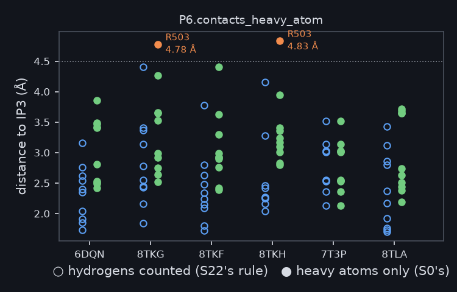
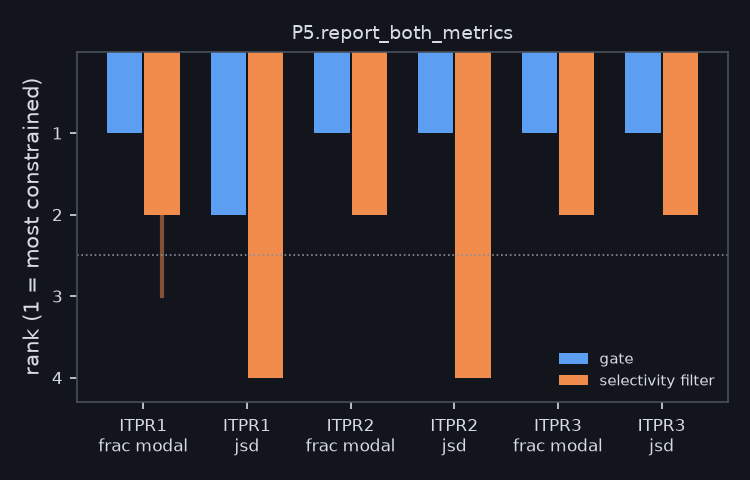
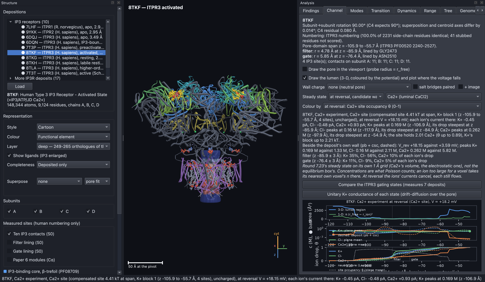

# S29 — the companion simulator's review (2026-09-28)

`../ip3r_simulation` is an interactive structural and physics model of the
receptor that re-derives this project's findings with code of its own
(`python -m ip3r checks`). Each check is calibrated: a planted change to one
of the tables it declares must flip its verdict. On 2026-09-27, against this
repository at `be01abf`, 50 of 52 checks confirmed. This page records the two
that did not, what S29 measured here about each, and one qualification from
the simulator's permeation work. Every figure was drawn by the simulator.

## 1. The IP₃ contact control holds in 8TKG and 8TKH only through a hydrogen

**Figure S29.1.** The ten IP₃ contacts in each of S22's six depositions,
measured as the distance to the chain's own IP₃. Open markers count
hydrogens, as S22 does. Filled markers use heavy atoms only, as S0 did when it
defined the ten on 6DQN. Arg503 crosses the 4.5 Å line in 8TKG (4.78 Å) and
8TKH (4.83 Å) and in no other deposition. Drawn by the simulator's
`P6.contacts_heavy_atom` exhibit. S29 re-measured it with this project's own
reader: `results/ligand_site/contact_rule.tsv`, from `s29_contact_rule.py`.

## 2. "On both metrics" was one metric too many

**Figure S29.2.** The gate's and the filter's rank among the named elements,
per paralogue, on the modal-residue fraction and on the Jensen–Shannon
divergence (1 = most constrained; a vertical stroke marks a tie). Both are in
the top two (dotted line) on the modal fraction everywhere. On the divergence
the gate is second in ITPR1, and the filter falls to fourth in ITPR1 and
ITPR2. The papers state this. Before S29 the thesis (§11.10) and the S17 and
S22 reports said both metrics. Drawn by the simulator's
`P5.report_both_metrics` exhibit, from `constraint_by_element.tsv` and the
per-paralogue constraint tables.

## 3. A qualification: the pore's geometry does not give its calcium preference

**Figure S29.3.** Bi-ionic permeability ratio P_Ca:P_K through the activated
(8TKF) and open (7T3T) pores, from the simulator's 3-D Poisson–Nernst–Planck
model at Vais et al. 2010's reversal protocol. The dotted line is the
uncharged pore, geometry alone: 0.26 and 0.52, so it prefers potassium. The
dashed line is the measured 15.2. A saturable Ca²⁺ site over the membrane
span raises the ratio. It reaches the measurement only when the site stays
neutral as it fills and its occupancy blocks K⁺ (orange), which it does at a
depth of 4.4 and 4.0 kT (stars; K_d 3–6 mM). This is the anomalous
mole-fraction mechanism, and it is a model's hypothesis, not a measurement.
It bears only on the plain-language reading in `FINDINGS.md` (2026-08-18) and
the S0 review, which read "not a precision filter" off the filter's width. No
paper here makes a permeation claim. Source: `ip3r_simulation`
`docs/SCIENCE_CASITE.md`, `scripts/figure_casite.py`.

**Figure S29.4.** The same site drawn on 8TKF's lumen in the simulator,
coloured by its occupancy (blue empty, red full). The lower plot shows each
ion's concentration and electrochemical drop along the pore axis, with the
occupancy dotted. K⁺ is resisted inside the occupied band (steepest at
z −86 Å), and Ca²⁺ where it leaves the band (z −55 Å).

## What did not change

No headline, no table and no figure of any paper moved. The ligand paper and
the manuscript gained one sentence each, stating the heavy-atom distances
(LI39–40, C288–289). The thesis, the S17 report and the S22 report now carry
the papers' narrower wording on the element ranking.
