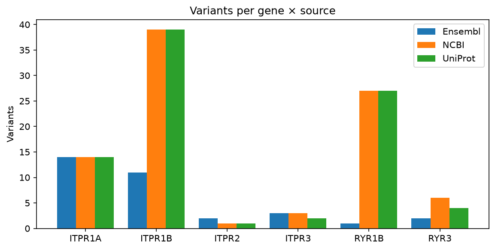
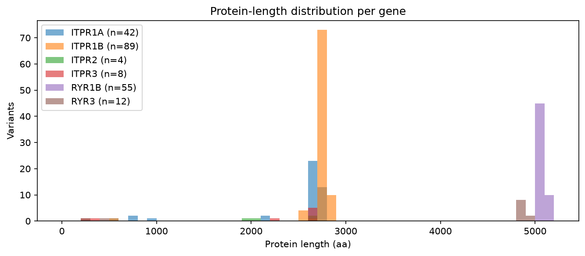

# Protein Variant Report — itpr1a, itpr1b, itpr2, itpr3, ryr1b, ryr3

_Generated 2026-08-18 09:22:59_

## 1. Query

- **Genes searched**: `itpr1a, itpr1b, itpr2, itpr3, ryr1b, ryr3`
- **Species filter**: `Danio rerio`
- **Sources queried**: `NCBI, Ensembl, UniProt`
- **Sequences fetched**: `no`
- **Total variants returned**: **210**

_Notes:_ Headless run of preset 'ip3r_zebrafish'.

## 2. Per-source overview

## 3. Cross-database length agreement

Disagreement between sources on the maximum protein length flags incomplete or fragmented annotation, which is how a real gene ends up recorded as two short models or none at all.

| Gene | Per-source max length | Δ | Flag |
|------|-----------------------|---|------|
| ITPR1A | Ensembl=2745, NCBI=2711, UniProt=2711 | 34 | ok |
| ITPR1B | Ensembl=2782, NCBI=2819, UniProt=2819 | 37 | ok |
| ITPR2 | Ensembl=2008, NCBI=2665, UniProt=2665 | 657 | ⚠️ |
| ITPR3 | Ensembl=2634, NCBI=2635, UniProt=2635 | 1 | ok |
| RYR1B | Ensembl=5078, NCBI=5109, UniProt=5109 | 31 | ok |
| RYR3 | Ensembl=4987, NCBI=4863, UniProt=4863 | 124 | ⚠️ |
## 6. Methods

Variants were aggregated from NCBI Entrez (`Bio.Entrez`), Ensembl REST and UniProt REST. Predicted 3D structures were pulled from the AlphaFold Protein Structure Database; structural homologs were (optionally) searched via Foldseek. Pairwise alignments use BLOSUM62 with open / extend gap penalties of −10 / −0.5. The multiple sequence alignment is a star alignment seeded by the longest sequence (or MAFFT --auto when available). Pairwise identity excludes columns where both rows are gaps. Neighbor-joining trees are constructed via Bio.Phylo.TreeConstruction with the 1 − identity distance matrix. Per-column conservation is 1 − Shannon entropy normalized to min(n_rows, 21). Novel-paralog candidates are scored on six independent criteria (size, domain signature, structural fold, sequence outlier, taxonomic breadth, cluster exclusion); see `discovery/candidates.tsv` for full evidence per candidate.

---

_Report generated by the Protein Variant Finder._
