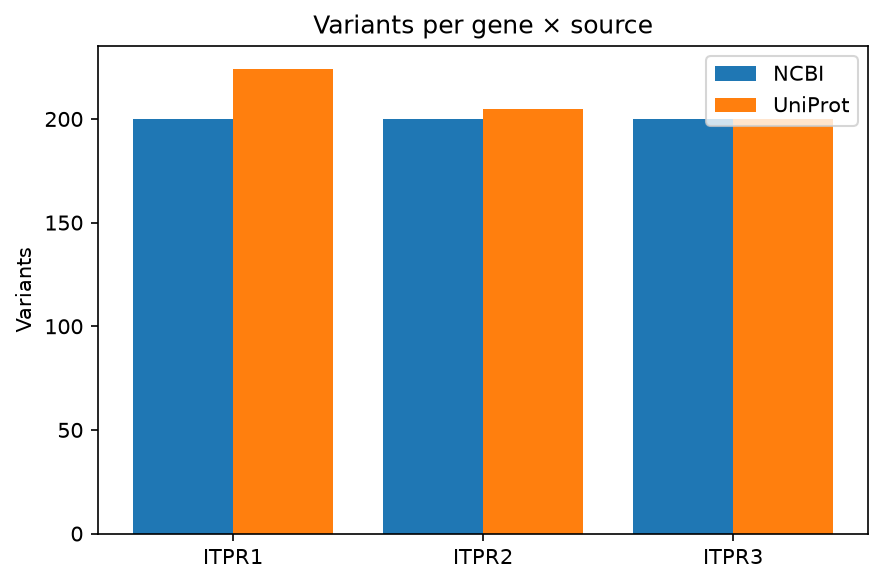
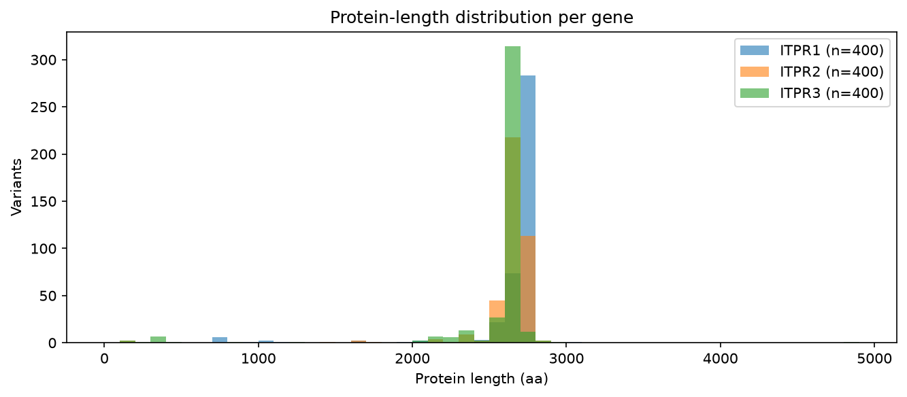

# Protein Variant Report — ITPR1, ITPR2, ITPR3

_Generated 2026-08-18 12:33:01_

## 1. Query

- **Genes searched**: `ITPR1, ITPR2, ITPR3`
- **Species filter**: `(any)`
- **Sources queried**: `NCBI, Ensembl, UniProt`
- **Sequences fetched**: `no`
- **Total variants returned**: **1229**

_Notes:_ Headless run of preset 'ip3r'.

## 2. Per-source overview

## 3. Cross-database length agreement

Disagreement between sources on the maximum protein length flags incomplete or fragmented annotation, which is how a real gene ends up recorded as two short models or none at all.

| Gene | Per-source max length | Δ | Flag |
|------|-----------------------|---|------|
| ITPR1 | NCBI=3001, UniProt=2779 | 222 | ⚠️ |
| ITPR2 | NCBI=2806, UniProt=2802 | 4 | ok |
| ITPR3 | NCBI=4853, UniProt=2860 | 1993 | ⚠️ |
## 6. Methods

Variants were aggregated from NCBI Entrez (`Bio.Entrez`), Ensembl REST and UniProt REST. Predicted 3D structures were pulled from the AlphaFold Protein Structure Database; structural homologs were (optionally) searched via Foldseek. Pairwise alignments use BLOSUM62 with open / extend gap penalties of −10 / −0.5. The multiple sequence alignment is a star alignment seeded by the longest sequence (or MAFFT --auto when available). Pairwise identity excludes columns where both rows are gaps. Neighbor-joining trees are constructed via Bio.Phylo.TreeConstruction with the 1 − identity distance matrix. Per-column conservation is 1 − Shannon entropy normalized to min(n_rows, 21). Novel-paralog candidates are scored on six independent criteria (size, domain signature, structural fold, sequence outlier, taxonomic breadth, cluster exclusion); see `discovery/candidates.tsv` for full evidence per candidate.

---

_Report generated by the Protein Variant Finder._
