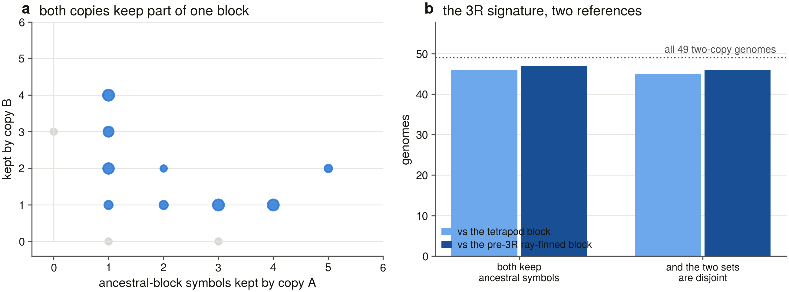
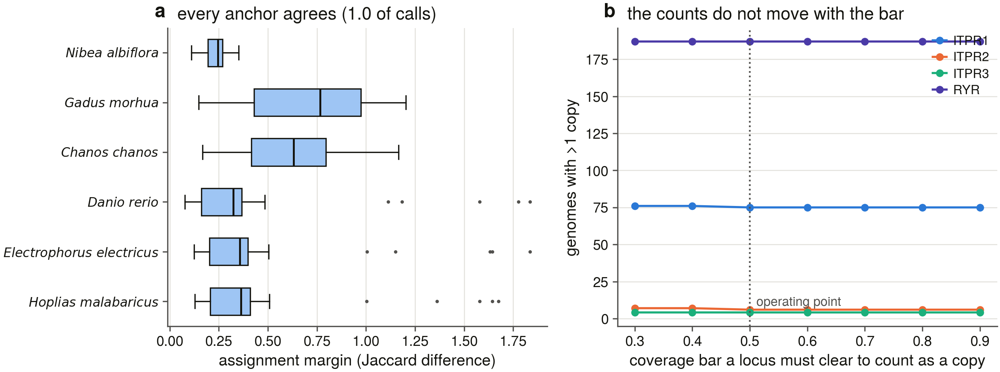

# S16 — duplication history of the IP3 receptor family

*Generated 2026-09-08 17:15; 2,146 loci in 309 genomes; 5,000 permutations per null, seed 20260908.*

**What this task asks.** S7 gave the family's tree and S13 placed its two duplications on the species tree. Neither says what kind of event made them. This task asks the genome instead: a whole-genome duplication copies a *block*, so the three ITPR neighbourhoods should still be paralogous to one another, and the teleost duplicate should still sit in the block its single ancestor occupied.

## 1. What is in the analysis

S16 asks two questions about where ITPR1/2/3 came from: are they a **2R** quartet, and are the two teleost ITPR1 copies **3R** ohnologs. Both are questions about *blocks* of genome rather than about the gene, so both are asked of neighbourhoods.

The unit of observation is the **locus**, not the ledger cell. The S5 ledger holds one row per genome x cell and therefore only each cell's best locus, which is exactly the information a duplication question needs — S8 and S15a both hit this. So every alignment is read back out of the sweep's own `summary.json`: **2,146 loci across 309 genomes**, of which **1,841** clear the copy rule below.

| cell | loci | copies | genomes carrying >1 copy, above D4's bar |
|---|---|---|---|
| ITPR1 | 401 | 357 | 75 of 189 |
| ITPR2 | 323 | 279 | 6 of 189 |
| ITPR3 | 335 | 290 | 4 of 189 |
| RYR | 1,085 | 915 | 187 of 189 |

**The RyR cell is this task's positive control and it is not a fourth paralog.** RYR1/2/3 are a three-member vertebrate family of the same age and the same 2R candidacy as ITPR1/2/3, and D14 puts them inside every search this project runs anyway. Every measurement below is made on both families with the same instrument, in the same genomes, in the same run. A rule that finds one family's duplicates and not the other's is a rule about the instrument, and there is no other way to see that.

## 2. The instrument

### 2.1 What counts as a copy, and what counts as one gene

Two rules, pulling opposite ways. A **copy** is a locus whose own model covers at least 50% of its bait, over 500 aligned residues, at or above the sweep's own recording floor of 40% identity — read back from the sweep rather than retyped. And two models are **one gene** when they sit on one strand of one contig within 100,000 bp *and* their bait spans are complementary rather than repeated: two alignments each covering residues 1–2748 of the same bait are two genes however close they are, and two covering 1–1300 and 1310–2748 are one gene however far apart.

The merge is the brief's requirement and it is load-bearing in one direction only — a split model manufactures a duplication, which is the claim this task is testing. **It fired on 0 of 2,146 loci**: S5's own clustering already chained miniprot's alignments into loci, so the artefact this rule exists to catch is not present in this sweep. That zero is only worth printing because the rule that returns it is one that folds a constructed split — `s16_test_dup.py` T1 builds two halves that each clear the copy bar on their own and requires the merge to return one copy, which is the only configuration in which the merge changes a count.

The coverage bar is a threshold this task owns, so every count is recomputed at seven of them in `copy_sensitivity.tsv` (0.3–0.9). Figure `s16_blocks` panel b draws the result: across the whole range the number of genomes carrying a second ITPR1 moves by one.

### 2.2 The 2R test: paralogy, not synteny

S8 measured microsynteny between the three neighbourhoods and got a flat **zero** — cross-paralog symbol Jaccard 0.000 in every direction. That is what a 2R signal looks like to a test that is looking for the same word twice: after ~500 Myr the neighbours are no longer the same genes, they are *paralogs* of each other. So the test needs a paralogy map.

The map is Ensembl Compara, pulled from **BioMart against a pinned dated archive host** (`jun2026.archive.ensembl.org`, serving **Ensembl Genes 116**). Pinning is D24's discipline applied to a database release: the rolling host follows the release cycle, so a rerun a month later would score the same windows against a different Compara tree. The archive's own registry is committed as `biomart_registry.xml`, so the release the numbers were made on is evidence in this directory and not a sentence in a report. **22,564 undirected paralog pairs** touch a real neighbourhood gene.

Three rules make the test a test rather than a restatement:

1. **Every ITPR *and* RyR gene is removed from every window** (`ITPR, RYR`). Counting the ITPR1–ITPR2 paralogy itself as evidence that their blocks are paralogous is circular — that pair is the thing being explained — and leaving a RyR in an ITPR window would import the control's answer into the test.
2. **The null is drawn from real genomic windows** (D17): 5,000 draws per direction from the actual gene order at the matched gene count, so the clustering of gene families that a shuffled gene set throws away is kept. That is the conservative choice — a tandem array inflates the real window and the null alike. A Poisson cross-check is committed beside it.
3. **Links are dated.** Compara puts a duplication node on every pair, and that column is the difference between a paralogon test and a paralogy test: an older duplication whose two copies happen to sit in these blocks is not a 2R ohnolog pair. Two nested vocabularies are reported so the answer does not rest on one line — `2R_core` = Chordata, Vertebrata; `2R_window` adds Gnathostomata, Euteleostomi, where Compara's LCA reconstruction puts a real 2R pair when the deep outgroup genes are missing from its tree. **This changed the answer** (§4.1).

The primary setting is **±10 genes, `2R_window`** — ±10 is S8's own window and the highest-power one available, because the null mean rises with window size, so a wider window buys genes and loses signal. ±20 and ±30 are committed beside it as the sensitivity.

Multiple testing is corrected **twice**, because the two families of tests answer different questions and reporting only one of them would be a choice made after seeing the numbers (S9's rule, stated at both scopes). `q_stratum` corrects across the 15 pairs of one (level set, window) — the family a reader actually reads a row against, since the three level sets are nested and the three windows are nested. `q_global` corrects across every test the stage ran, which is the conservative bound. And `pooled_test.tsv` asks the question a reader actually has — *do these three neighbourhoods retain more dated ohnologs than random windows do* — as **one** hypothesis per family instead of three, which is where the power is.

### 2.3 The 3R test: five predictions, all checked

| # | prediction | how it is checked |
|---|---|---|
| 1 | the pre-3R ray-fins carry one copy | bichir, gar and bowfin in the sweep, above D4's bar |
| 2 | a lineage with a *further* WGD carries more | Acipenseriformes and Salmoniformes, reported separately and never folded into the 3R count |
| 3 | the second copy is spread across the radiation | orders and classes carrying it |
| 4 | the copies are not tandem | measured separation, not asserted |
| 5 | double-conserved synteny | both copies keep part of the *same* ancestral block, against a tetrapod **and** a pre-3R ray-finned reference |

Flank sets come from S8's committed `flanks.tsv`, which flanked **every locus** and not one per cell, so the brief's *flank sets for every copy* is a join on (accession, cell, contig, start) rather than a second extraction (D13) — and S16 therefore cannot disagree with S8 about what a flank is. A copy enters the DCS test with at least 5 informative symbols; the ancestral block is the set carried by at least 40% of the single-copy non-teleost loci.

The sixth check is the one that separates *one* ancestral duplication from a series of independent lineage-specific ones: **cross-anchor block identity**. The obvious statistic — does the matched pairing of two genomes beat the crossed one — has no power, because each genome's own copy labels are arbitrary and the winner is a coin flip either way. So several well-flanked genomes from different orders are taken as anchors, every other genome's two copies are matched onto each anchor independently, and the anchors are asked whether they agree. Agreement between two anchors is defined only up to one global flip, so the statistic is max(f, 1−f) against a two-sided binomial at p = 0.5.

### 2.4 The negative controls, run before anything is written

`scripts/s16_test_dup.py` (the pattern of `s5_bait_screen.self_test()` and `s15_test_loss.py`) constructs cases for every rule above and aborts the run on a failure. Two of S16's failure modes are silent, which is why the tests are mostly tests on *refusal* and on *reachability*:

| test | what it refuses, or requires to be reachable |
|---|---|
| T1 | a split model whose halves *each* clear the copy bar must merge to one copy — the only configuration in which the merge changes a count |
| T2 | two models each covering the whole bait stay two copies however close, or the rule would delete real duplications |
| T3 | complementary spans on opposite strands, or on two contigs, are not one split gene |
| T4 | the merge is order-invariant, or a copy number is a fact about a JSON file |
| T5 | each copy floor fires on its own violation and nothing else |
| T6 | no ITPR or RyR symbol survives in a window — the circularity guard |
| T7 | the duplication-node filter discriminates, **and the null is built from the same link set as the test** |
| T8 | the permutation null is non-degenerate, and a window with no paralogs scores 0 |
| T9 | nine adjacent zinc fingers are one family, not nine |
| T10 | BH is monotone, bounded, and never below its own p |
| T11 | every 3R group is assigned by rule, including the species-level cyprinid 4R this scope contains none of |
| T12 | **random blocks must agree at about chance** — a cross-anchor statistic that returned 1.0 on noise would make the 3R result unfalsifiable |
| T13 | and two genuinely shared blocks must be recovered even when each genome's copy order is scrambled |
| T14 | the binomial tail is exact |

## 3. The copy-number landscape

Above D4's contiguity bar, **every non-teleost gnathostome genome in the sweep carries exactly one of each ITPR and three RyRs**. The whole of this task's copy-number variation is in the ray-fins.

| class | genomes above the bar | ITPR1 | ITPR2 | ITPR3 | RyR | genomes with >1 ITPR1 |
|---|---|---|---|---|---|---|
| Actinopteri | 78 | 1.96 | 1.06 | 1.06 | 5.77 | 93.6% |
| Amphibia | 8 | 1.00 | 1.00 | 1.00 | 2.12 | 0.0% |
| Aves | 51 | 1.00 | 1.02 | 1.00 | 2.39 | 0.0% |
| Chondrichthyes | 12 | 1.00 | 1.00 | 1.00 | 3.00 | 0.0% |
| Cladistia | 1 | 1.00 | 1.00 | 1.00 | 3.00 | 0.0% |
| Coelacanthimorpha | 1 | 1.00 | 1.00 | 1.00 | 3.00 | 0.0% |
| Crocodylia | 1 | 1.00 | 1.00 | 1.00 | 3.00 | 0.0% |
| Dipnoi | 1 | 1.00 | 1.00 | 1.00 | 3.00 | 0.0% |
| Hyperoartia | 1 | 3.00 | 0.00 | 0.00 | 2.00 | 100.0% |
| Lepidosauria | 3 | 1.00 | 0.67 | 1.00 | 2.33 | 0.0% |
| Mammalia | 30 | 1.00 | 1.00 | 1.00 | 3.00 | 0.0% |
| Myxini | 1 | 3.00 | 0.00 | 0.00 | 2.00 | 100.0% |
| Testudines | 1 | 1.00 | 1.00 | 1.00 | 3.00 | 0.0% |

47 of 1,841 copies are `lesion_rich` on S15a's own bar, read back from its committed verdicts rather than recomputed. The call is one-sided by decision: S10 established that zero lesions falsifies a pseudogene call and a handful does not establish one.

Prior: **no vertebrate lineage in this scope has lost an IP3 receptor — Dollo places 0 losses on the family character and 0 on every paralog character across 927 genome x paralog cells** — S15b §10. **confirmed** — every genome above the contiguity bar carries all three, and the only cells at zero copies are below it or cyclostome — S16 counts copies where S15b counted presence, and they agree

Prior: **a cell holding two loci holds two copies of one gene rather than a misfiled second gene — 36 of 36 extra copies in multi-copy cells are placed in the same paralog as the cell they were filed under** — S8 §5.2. **confirmed** — 75 of 189 genomes above the bar carry a second ITPR1 and §5 shows both copies sit in the same ancestral block, so a cell holding two loci holds two copies of one gene

## 4. Are ITPR1/2/3 a 2R quartet?

### 4.1 What the human windows retain, and how old it is

Two paralog links survive between the three ITPR neighbourhoods at every window size, and they are **exactly the two flanking families S8 found by a completely different instrument** — S8 matched normalised gene-symbol roots across 309 genomes; this matches Compara paralogy in one. Two instruments, one answer:

| pair | link | Compara duplication node | 2R-dated? |
|---|---|---|---|
| ITPR1–ITPR2 | BHLHE40 ↔ BHLHE41 | Opisthokonta | no |
| ITPR1–ITPR3 | GRM7 ↔ GRM4 | Vertebrata | **yes** |

**Dating the links changed the answer, and it is the one thing here S8 could not do.** `BHLHE40 ↔ BHLHE41` is an *Opisthokonta* duplication — a pair far older than the vertebrates whose two copies happen to sit beside ITPR1 and ITPR2. It is real paralogy and it is not a 2R ohnolog pair. `GRM7 ↔ GRM4` is dated to *Vertebrata*, which is what 2R means. So the single 2R-dated retained ohnolog pair among these blocks links **ITPR1 and ITPR3**, and ITPR2 retains none with anybody.

### 4.2 Against the null, and against the RyR control

At the primary setting (±10 genes, `2R_window`):

| pair | dated links | permutation null (mean) | enrichment | p | q within the 15-pair stratum |
|---|---|---|---|---|---|
| ITPR1–ITPR2 | 0 | 0.0167 | 0× | 1 | 1 |
| ITPR1–ITPR3 | 1 | 0.0185 | 54× | 0.0128 | 0.096 |
| ITPR2–ITPR3 | 0 | 0.0065 | 0× | 1 | 1 |
| RYR1–RYR2 *(control)* | 0 | 0.0089 | 0× | 1 | 1 |
| RYR1–RYR3 *(control)* | 0 | 0.0044 | 0× | 1 | 1 |
| RYR2–RYR3 *(control)* | 1 | 0.0064 | 156× | 0.0053 | 0.0795 |

Asked once per family rather than three times per pair — which is the question, and is where the power is:

| family | dated links over its 3 pairs | null (mean) | p |
|---|---|---|---|
| ITPR | 1 | 0.0600 | 0.039 |
| RYR *(control)* | 1 | 0.0224 | 0.0208 |

**The two families behave the same way, and that is the result.** Each retains exactly one vertebrate-dated ohnolog pair between two of its three neighbourhoods; each clears its own permutation null pooled; and neither survives correction across all 135 tests the stage ran. The RyR trio's 2R origin is not in question, so what this measures is the *instrument's* ceiling on a single human genome rather than a difference between the families — and it is why the replication in §4.3 exists.

### 4.3 Replicated across the sweep, against its own null

The same human paralogy map, asked of S8's flank sets in every swept genome, against **matched random neighbourhoods in the same genomes** — 932 control window pairs drawn by `s8_control.sample_windows` unchanged, of which 24 carry a link.

| pair | genomes compared | with any link | with a 2R-dated link | vertebrate classes | matched random windows | p |
|---|---|---|---|---|---|---|
| ITPR1–ITPR2 | 175 | 141 (80.6%) | 2 (1.1%) | 10 | 2.6% | 4.91e-118 |
| ITPR1–ITPR3 | 152 | 89 (58.6%) | 84 (55.3%) | 9 | 2.6% | 9.39e-66 |
| ITPR2–ITPR3 | 149 | 4 (2.7%) | 3 (2.0%) | 3 | 2.6% | 0.554 |

**This is the 2R answer.** The ITPR1 neighbourhood is paralogous to both the ITPR2 and the ITPR3 neighbourhood in most vertebrate genomes and across most vertebrate classes, ~20–30× above a null measured in the same genomes with the same map and the same symbol normalisation. The ITPR2 and ITPR3 neighbourhoods are paralogous to each other **at exactly the background rate** (2.7% against 2.6%, p = 0.554). And the dated column splits the two surviving links cleanly: the ITPR1–ITPR3 link is vertebrate-dated in 84 genomes, the ITPR1–ITPR2 link in 2.

Prior: **the surviving 2R paralogon links run through ITPR1 — ITPR1 with ITPR2 and ITPR1 with ITPR3 each retain one shared root flank family (BHLHE, GRM), ITPR2 with ITPR3 retains none at any bar, and no ITPR x RyR pair retains one** — S8 §4. **confirmed** — a second instrument, on different evidence, recovers the same shape and the same two families: ITPR1 with ITPR2 80.6% of genomes, ITPR1 with ITPR3 58.6%, ITPR2 with ITPR3 2.7% against a 2.6% background. What S16 adds is the date, and it removes one of the two links from the 2R account

Prior: **ITPR2 and ITPR3 are sisters — the AU test rejects ITPR1+ITPR2 (p-AU 1.8e-05) and ITPR1+ITPR3 (p-AU 1.65e-05) and does not reject ITPR2+ITPR3 (p-AU 0.476); the ML tree groups them at 100/100** — S7 §5.2. **not corroborated** — the tree's sister pair is still the one pair whose neighbourhoods share nothing — ITPR2 and ITPR3 sit at the background rate at both dating levels. These remain different measurements and neither overturns the other: a tree estimates the order of duplication, a retained flanking ohnolog records which copies survived deletion beside each gene, and 2R quartets lose flank copies independently of the duplication order. What can now be added is that the same asymmetry survives being dated

Prior: **the two duplications are not on the same branch — ITPR1 splits from the ITPR2/ITPR3 stem on the vertebrate stem (563 Ma, unbounded above), and ITPR2 from ITPR3 on the gnathostome stem (462-563 Ma)** — S13 §4. **orthogonal** — S13 places the ITPR1 split on the vertebrate stem and the ITPR2/ITPR3 split on the gnathostome stem; S16 measures which neighbours each block kept. A tree node and a retained neighbour are not the same quantity. They are consistent — a 2R-dated ohnolog beside ITPR1 and ITPR3 is compatible with both splits — but the flank evidence cannot separate them and is not offered as support

### 4.4 The fourth slot: the block scan and the quartet

Two rounds of duplication make four copies of an ancestral block; three carry a family gene, and a fourth surviving with its gene deleted would still be paralogous. The scan ranks every genome-wide block by the number of distinct gene *families* it shares with each window — families rather than raw hits, because a tandem array is one duplication and nine adjacent zinc fingers must score 1. **No top block carries a family gene** (0 of 6).

The quartet test then measures paralogy between every pair of the six windows and the six top blocks. **6 of its 65 pairs are circular by construction and are flagged as such in the table**: a window against *its own* top block tests the selection — that block was chosen out of ~23,000 as the one most paralogous to this window — and not the quartet. All six of them are significant, which is what the selection guarantees. Of the 59 pairs that are not circular, **0 are enriched at p < 0.05**.

| window | top block | shared families | carries a family gene |
|---|---|---|---|
| ITPR1 | NC_000007.14:105,963,264–116,561,185 | 5 | no |
| ITPR2 | NC_000011.10:13,009,316–18,479,601 | 10 | no |
| ITPR3 | NC_000012.12:89,519,412–100,142,874 | 5 | no |
| RYR1 | NC_000015.10:34,851,782–40,858,207 | 6 | no |
| RYR2 | NC_000014.9:101,964,573–104,937,785 | 6 | no |
| RYR3 | NC_000015.10:21,846,329–30,414,260 | 5 | no |

So the scan does not hand back a clean fourth ITPR slot, and the flag is the reason the table cannot be read as though it did. That is the expected outcome rather than a negative result: with one dated ohnolog pair surviving between the blocks that *do* carry a gene, a block that lost its gene as well as most of its neighbours has nothing left to be recognised by. It is reported because a scan that could only ever confirm is not a scan.

## 5. Are the two teleost ITPR1 copies 3R ohnologs?

### 5.1 The three groups, and the two controls inside them

| group | genomes above D4's bar | ITPR1 | ITPR2 | ITPR3 | RyR | genomes with >1 ITPR1 |
|---|---|---|---|---|---|---|
| pre-3R ray-fins (bichir, gar, bowfin) | 4 | 1.00 | 1.00 | 1.00 | 3.00 | 0.0% |
| teleosts (3R) | 73 | 1.97 | 1.04 | 1.04 | 5.82 | 97.3% |
| extra WGD (sturgeon, salmon) | 2 | 3.00 | 2.00 | 2.00 | 8.00 | 100.0% |

**Predictions 1 and 2 both hold, and they hold in opposite directions.** The lineages that diverged before 3R carry exactly one of each ITPR and three RyRs — the gnathostome state. The teleosts carry two ITPR1 and one each of ITPR2 and ITPR3, and six RyRs. The lineages with a *further* whole-genome duplication carry more of everything again. A second copy that appeared in the outgroup, or a teleost RyR count that had not doubled, would each have killed the 3R reading; neither does.

The RyR control is what makes the ITPR2/ITPR3 singletons interpretable. 3R duplicated the whole genome, so it duplicated ITPR2 and ITPR3 as surely as ITPR1 — and the sister family in the same genomes kept **all six** of its copies. So the teleost ITPR2 and ITPR3 singletons are a statement about *retention*, not about the sweep's ability to find a duplicate.

### 5.2 Prediction 4: the copies are not tandem

Of 71 teleost genomes with two ITPR1 copies above the bar, **20 put them on different contigs**, and the rest sit a median **8,870,578 bp apart on one contig** — the closest pair anywhere is 535,374 bp. Nothing here is a tandem duplication. Two copies megabases apart on one chromosome are what ~320 Myr of post-3R rediploidisation and chromosome fusion look like, and the number is printed rather than argued: the sweep's own contigs decide how much of that is biology and how much is assembly.

### 5.3 Prediction 5: double-conserved synteny

Both copies of a 3R pair should keep *part* of the one ancestral neighbourhood, and between them account for it. Of **49** two-copy genomes with both copies flanked:

| reference block | both copies keep ancestral symbols | and the two sets are disjoint |
|---|---|---|
| the tetrapod / non-teleost consensus | 46 of 49 | 45 |
| the pre-3R ray-finned block | 47 of 49 | 46 |

Two references rather than one because teleost gene symbols diverge from tetrapod ones even after S8's relaxed-key normalisation, so the tetrapod consensus under-counts; gar, bowfin and bichir do not have that problem. Both give the same answer. **Disjoint is the load-bearing word**: the two copies do not merely each resemble the ancestor, they *partition* it, which is what reciprocal gene loss after one duplication produces and what a pair of independent later duplications would not.

### 5.4 Are they the *same* two blocks across the radiation?

6 anchors, one per order (Nibea albiflora (order unassigned); Hoplias malabaricus (Characiformes); Electrophorus electricus (Gymnotiformes); Danio rerio (Cypriniformes); Chanos chanos (Gonorynchiformes); Gadus morhua (Gadiformes)); every other two-copy genome matched onto each independently. **705 of 705 assignments agree (100.0%, two-sided binomial p = 1.19e-212)**, and the worst-agreeing anchor pair is at 1.0. Under independent lineage-specific duplications the anchors carry no shared information and this sits at 0.5; the self-test builds exactly that case and requires the statistic to land there (T12), so the 1.0 is a measurement and not a property of the routine.

Corroborated by evidence of a different kind: which bait won each copy is a *sequence* call made with no synteny input at all. In the 6 genomes whose two copies won different baits, the sequence call and the synteny block agree **6 times** (p = 0.0312), against *Hoplias malabaricus* as the reference — chosen as the first anchor whose own two copies won different baits, because anchors are ranked on flank richness and taking the first one blindly makes this check unrunnable whenever that genome's copies share a bait.

Prior: **the teleost 3R co-orthologs are in the representative set by rule and S5's ledger files both copies into one paralog cell, so a cell can hold two genes** — S6 §1 / S7 §5.5. **confirmed** — 45 of 49 two-copy genomes partition the ancestral block disjointly between their two copies, and every anchor assigns every genome to the same two blocks — so a cell holding two teleost loci holds the two 3R co-orthologs

Prior: **the ryanodine receptors carry every ITPR-diagnostic Pfam domain and are inside every search this project runs; separating them is a positive test at every stage** — D14. **confirmed** — used as an instrument rather than avoided: the RyR trio is the 2R positive control in §4 and the 3R positive control in §5, and in both it behaves exactly as the family under test does

## 6. What this settles, what it does not, and the caveats

**Settles.**

- **The ITPR blocks are paralogous, and the paralogy runs through ITPR1.** ITPR1's neighbourhood carries paralogs of ITPR2's in 81% of 175 genomes and of ITPR3's in 59% of 152, against 2.6% of matched random windows. ITPR2 and ITPR3 retain nothing above background.
- **One of those two links is 2R-dated and the other is not.** `GRM7 ↔ GRM4` (ITPR1–ITPR3) is a *Vertebrata* duplication; `BHLHE40 ↔ BHLHE41` (ITPR1–ITPR2) is *Opisthokonta*. S8 found both and could not date either.
- **3R doubled ITPR1 and only ITPR1**, in 97% of teleost genomes above the contiguity bar, while doubling all three RyRs in the same genomes — so the ITPR2 and ITPR3 singletons are retention, not detection.
- **The two ITPR1 copies are one ancestral duplication.** They partition the ancestral block disjointly in 45 of 49 genomes against a tetrapod reference and 46 against a pre-3R ray-finned one, and every anchor from every order assigns every genome to the same two blocks.
- **The instrument is calibrated, because the sister family went through the same test.** Everything above was measured on RYR1/2/3 in the same run.

**Does not settle.** Four things, all leads rather than gaps.

1. **Whether the ITPR quartet had a fourth slot.** The block scan returns no genome-wide block that both carries no family gene and looks like the ITPR blocks' missing sibling. With one dated ohnolog pair surviving between the blocks that *do* carry a gene, a block that lost the gene too has nothing left to be recognised by, so this is a limit of the evidence and not a claim that no fourth slot existed.
2. **Which of the two 2R rounds made which split.** The 2R-dated link is dated to *Vertebrata*, which is both rounds. Separating R1 from R2 needs the cyclostome side of the quartet, and S8 already reported that cyclostome flank synteny is underpowered — 27–29 % of their coding genes carry a symbol at all.
3. **Why ITPR1 alone kept its 3R duplicate.** The observation is clean and the cause is not in this task's evidence. S9's ω estimates and S17's constraint mapping are where a dosage or subfunctionalisation argument would have to be made.
4. **The paralogy map is human.** Compara paralogy exists for one genome in this scope, so the replication varies the neighbourhood and holds the map fixed. That is the right design for the question — what varies is the thing under test — but a symbol with no human one-to-one can only *lower* a link count, so every number in §4.3 is a floor.

**Two things a reader should hold against this half.**

- **The human single-genome test is underpowered on its own** and the report says so twice. One dated link per family is what both the ITPRs and a family whose 2R origin nobody disputes return; after correcting across all 135 tests neither survives. The claim in §4.3 rests on the 309-genome replication against its own measured null, not on the human p-values.
- **309 vertebrate genomes is the denominator.** S4 declared it and S5b swept it. Nothing here extends to a lineage with no assembly, and the teleost result rests on the 73 ray-finned genomes above D4's contiguity bar rather than on all 89 in the ledger.

## 7. Hand-off

- **S17** inherits the question §6 could not answer: ITPR1 is the paralog that kept its 3R duplicate and the one whose neighbourhood kept its 2R ohnologs. Whether that is the same fact twice is a constraint question.
- **S19** inherits `copy_sensitivity.tsv` as a worked example of a threshold this project owns and measured rather than chose.
- **S14a** should take the copy-number panel and the DCS panel; the 2R replication panel is the one that carries its own null and is the strongest single figure this task produced.

