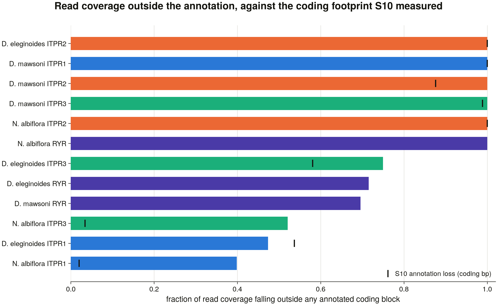

# S12 — are the genes the annotation loses actually transcribed?

S10 found **7** loci where the IP3-receptor gene this project recovered from the genome reaches no annotated gene model, in assemblies whose annotation delivers the other 375 of 382 whole. It could not tell whether those are real genes: the transcript deposits for the species are 43 and 10 records, so a search of them returning nothing is a fact about the deposit. It handed the question here.

This report answers it with reads. **67 public RNA-seq runs** (536,000,000 reads streamed) across **3 species** were aligned against a per-species reference holding every family locus the sweep recovered in that genome, three housekeeping anchors and a composition-matched decoy for each. The measurement is not whether the gene collects reads but whether the **314 exon junctions no annotated model spans** are crossed by reads that read through them.

> Every number below is read from a committed table in this directory. Nothing here is computed from a genome, a SAM file or a network call at render time (D13).

## 1. Which loci, and why those

The scope is derived from S10's committed ranking, not chosen. Four rules, each a positive test:

| rule | test |
|---|---|
| P1 | the locus is eligible under S10's five rules and its annotation loss exceeds 0.5 |
| P2 | its species has at least 4 public Illumina RNA-seq runs — a species with no libraries cannot be asked the question |
| P3 | every **other** ITPR locus the sweep recovered in the same genome joins the reference, whatever its annotation status — known-real genes in the same libraries, on the same reference, by the same aligner |
| P4 | so does the genome's RyR locus: this project's sister family (D14), whose reads must land on RyR |

The panel that produces:

| species | assembly | RNA-seq runs | loci | annotation failures | modes |
|---|---|---|---|---|---|
| *Dissostichus eleginoides* | `GCA_031216635.1` | 18 | 4 | 3 | fragmentation, omission |
| *Dissostichus mawsoni* | `GCA_011823955.1` | 14 | 4 | 3 | omission, truncation |
| *Nibea albiflora* | `GCA_014281875.1` | 157 | 4 | 1 | omission |

That is **every one of S10's 7 failures**, covering all three failure modes, with 5 internal controls beside them.

## 2. What the reads are aligned against

The reference is the **spliced genomic coding sequence** of each locus: the miniprot model's CDS blocks from the archived sweep GFF, fetched out of the assembly by coordinate, reverse-complemented on the minus strand and concatenated in target order.

It is deliberately not S9's frameshift-corrected CDS. S9 needed a clean reading frame because codeml counts codons; a read comes from the genome as it is, and correcting a frameshift inserts 1–2 bp that every read crossing it would then carry as an indel — costing reads at exactly the sites the sweep already flagged as difficult.

### Validation, and the test that had to be replaced

Each reference is checked against the sweep's own `##STA` protein. The obvious check — translate and require high identity — is the wrong instrument, and measuring it is how that became visible: a frameshift costs the reading frame from where it sits, so a **correct** reference scores 1.00 with no frameshifts and 0.92 with nine, and any floor drawn across that range rejects correct references for carrying frameshifts the sweep had already recorded.

What replaced it has no tuned threshold. Each block is translated in its own recorded phase and searched for verbatim in the expected protein **from the previous block's match onwards**, so a block places only if it is this protein's sequence *and* it follows the block before it. The pass rule is then a statement the model makes about itself: **a block may fail to place only if the model's own frameshift count can explain it.** Block *number* is checked separately, against the `cds_bp` the sweep recorded for the locus.

| species | locus | role | nt | exons | frameshifts | blocks placed | junctions (annotated / total) |
|---|---|---|---|---|---|---|---|
| *Dissostichus eleginoides* | `RYR` | control_family | 14,895 | 115 | 2 | 114/114 | 93 / 114 |
| *Dissostichus eleginoides* | `ITPR1` | failed | 8,222 | 58 | 4 | 58/58 | 48 / 57 |
| *Dissostichus eleginoides* | `ITPR2` | failed | 8,074 | 56 | 1 | 56/56 | 0 / 55 |
| *Dissostichus eleginoides* | `ITPR3` | failed | 8,064 | 60 | 2 | 59/60 | 34 / 59 |
| *Dissostichus eleginoides* | `hk_EEF1A1` | housekeeping | 1,440 | 6 | 0 | 6/6 | 5 / 5 |
| *Dissostichus eleginoides* | `hk_GAPDH` | housekeeping | 1,005 | 11 | 0 | 10/10 | 10 / 10 |
| *Dissostichus eleginoides* | `hk_RPL13A` | housekeeping | 618 | 7 | 0 | 6/6 | 6 / 6 |
| *Dissostichus mawsoni* | `RYR` | control_family | 14,887 | 115 | 17 | 109/114 | 80 / 114 |
| *Dissostichus mawsoni* | `ITPR1` | failed | 8,228 | 58 | 4 | 58/58 | 0 / 57 |
| *Dissostichus mawsoni* | `ITPR2` | failed | 8,065 | 56 | 4 | 56/56 | 1 / 55 |
| *Dissostichus mawsoni* | `ITPR3` | failed | 8,058 | 60 | 9 | 55/60 | 0 / 59 |
| *Dissostichus mawsoni* | `hk_EEF1A1` | housekeeping | 1,389 | 7 | 0 | 7/7 | 6 / 6 |
| *Dissostichus mawsoni* | `hk_GAPDH` | housekeeping | 1,003 | 11 | 2 | 9/10 | 9 / 10 |
| *Dissostichus mawsoni* | `hk_RPL13A` | housekeeping | 618 | 7 | 0 | 6/6 | 6 / 6 |
| *Nibea albiflora* | `RYR` | control_family | 14,961 | 116 | 0 | 115/115 | 0 / 115 |
| *Nibea albiflora* | `ITPR1` | control_paralog | 8,255 | 58 | 2 | 58/58 | 46 / 57 |
| *Nibea albiflora* | `ITPR3` | control_paralog | 8,185 | 58 | 1 | 58/58 | 41 / 57 |
| *Nibea albiflora* | `ITPR2` | failed | 8,021 | 56 | 2 | 56/56 | 0 / 55 |
| *Nibea albiflora* | `hk_EEF1A1` | housekeeping | 1,389 | 7 | 0 | 7/7 | 6 / 6 |
| *Nibea albiflora* | `hk_GAPDH` | housekeeping | 1,005 | 11 | 0 | 10/10 | 0 / 10 |
| *Nibea albiflora* | `hk_RPL13A` | housekeeping | 618 | 7 | 0 | 6/6 | 5 / 6 |

**The rule is reported beside the failures it rejects.** Each reference is re-scored twice more: once with its blocks in reverse target order (coordinates and strand intact) and once read off the wrong strand (coordinates and order intact). Both controls are built from the real models, not from a synthetic gene, so these are measurements on the actual references.

| species | locus | as built | blocks reversed | wrong strand | spliced nt vs the sweep's own `cds_bp` |
|---|---|---|---|---|---|
| *Dissostichus eleginoides* | `ITPR1` | 58/58 (1.0) | 1/58 (0.0172) | 0/58 (0.0) | match |
| *Dissostichus eleginoides* | `ITPR2` | 56/56 (1.0) | 1/56 (0.0179) | 0/56 (0.0) | match |
| *Dissostichus eleginoides* | `ITPR3` | 59/60 (0.9833) | 1/60 (0.0167) | 0/60 (0.0) | match |
| *Dissostichus eleginoides* | `RYR` | 114/114 (1.0) | 1/114 (0.0088) | 0/114 (0.0) | match |
| *Dissostichus mawsoni* | `ITPR1` | 58/58 (1.0) | 1/58 (0.0172) | 0/58 (0.0) | match |
| *Dissostichus mawsoni* | `ITPR2` | 56/56 (1.0) | 1/56 (0.0179) | 0/56 (0.0) | match |
| *Dissostichus mawsoni* | `ITPR3` | 55/60 (0.9167) | 1/60 (0.0167) | 0/60 (0.0) | match |
| *Dissostichus mawsoni* | `RYR` | 109/114 (0.9561) | 1/114 (0.0088) | 0/114 (0.0) | match |
| *Nibea albiflora* | `ITPR1` | 58/58 (1.0) | 1/58 (0.0172) | 0/58 (0.0) | match |
| *Nibea albiflora* | `ITPR2` | 56/56 (1.0) | 1/56 (0.0179) | 0/56 (0.0) | match |
| *Nibea albiflora* | `ITPR3` | 58/58 (1.0) | 1/58 (0.0172) | 0/58 (0.0) | match |
| *Nibea albiflora* | `RYR` | 115/115 (1.0) | 1/115 (0.0087) | 0/115 (0.0) | match |

Two further sequences per gene are what make the counts readable. A **reversed decoy** — the same sequence backwards, so identical length and base composition with no homology — measures what this reference collects by accident in this library. And three **housekeeping anchors** (GAPDH, EEF1A1, RPL13A) prove the library worked at all.

The housekeeping anchors are aligned with miniprot and spliced by the same module as the target loci, rather than pulled out of each assembly's annotation. Two of these three annotations name no genes at all — *Dissostichus mawsoni* files all 29,240 of its genes as "hypothetical protein" — so a GFF-derived anchor exists for one species and not the others; and building the anchor and the target the same way means a difference between them cannot be a difference in construction.

Their bait accessions are **resolved by query against a declared length band**, not remembered. The first version of this module hard-coded three and got all three wrong — a 427 aa "GAPDH" (the enzyme is 333), a 1,829 aa "EEF1A1" (462) and an accession that served nothing. A bait of the wrong protein still aligns somewhere and still produces reads, so the anchor would have silently measured a different gene.

## 3. How a junction is counted

Each run is streamed — `fastq-dump -X 4,000,000 | hisat2` — and the SAM parsed in flight; only counts reach the disk. Alignment is **unspliced on purpose**: the reference is already CDS, so a read crossing a junction is contiguous here, and leaving hisat2's spliced mode on would let it open a gap inside the CDS and call an intron that does not exist — which would then be counted as spanning a junction it had actually skipped.

A read spans a junction when **one contiguous aligned block** covers at least 8 nt on **both** sides of it. Requiring the anchor on one side only admits an alignment that has run a few bases past the junction and stopped, which is not evidence of splicing; S10 hit exactly that and its junction rule grew its second half from it.

A locus is called **transcribed** in a run when all three hold:

1. at least 2 junction-spanning reads — the load-bearing clause, because genomic-DNA carryover cannot cross a splice point;
2. at least 5 reads in total;
3. more reads than that run's own decoy.

**67 runs, 536,000,000 reads, 16 independent studies**; 39 of 67 runs carry a tissue confirmed from their own BioSample attributes rather than from a title.

## 4. Are the lost genes transcribed?

| species | locus | mode | annotation loss | runs | runs detected | reads | junction reads | decoy | transcribed |
|---|---|---|---|---|---|---|---|---|---|
| *Dissostichus eleginoides* | ITPR1 | fragmentation | 0.54 | 18 | 16 | 1,645 | 940 | 0 | **yes** |
| *Dissostichus eleginoides* | ITPR2 | omission | 1.00 | 18 | 16 | 2,290 | 1,337 | 0 | **yes** |
| *Dissostichus eleginoides* | ITPR3 | fragmentation | 0.58 | 18 | 13 | 1,175 | 719 | 0 | **yes** |
| *Dissostichus mawsoni* | ITPR1 | omission | 1.00 | 17 | 17 | 2,668 | 1,513 | 0 | **yes** |
| *Dissostichus mawsoni* | ITPR2 | truncation | 0.88 | 17 | 17 | 5,495 | 3,223 | 0 | **yes** |
| *Dissostichus mawsoni* | ITPR3 | truncation | 0.99 | 17 | 16 | 5,035 | 3,189 | 0 | **yes** |
| *Nibea albiflora* | ITPR2 | omission | 1.00 | 32 | 31 | 5,672 | 4,342 | 0 | **yes** |

**7 of 7** of the loci the annotation loses meet all three criteria in at least one library.

> **Prior.** S10 §3 and §4, both cases, verbatim: "0 hits, 0 of them contiguous across a junction. The denominator is the result: this species has 43 transcript records in total [10 for *D. eleginoides*]. … RNA-seq for it does exist and reaching it needs the streaming aligner S12 builds; these junctions are handed there rather than half-answered here." This is the prior S12 was created to settle, and it is the only one in the list that names this task.
>
> **This task.** The question is answerable with reads. 7 of 7 loci are transcribed and spliced; the deposits that could not answer it are re-searched in §10 and still cannot.
>
> **confirmed**

> **Prior.** S10 §3 — every family locus in the case genomes splices into an uninterrupted reading frame: *Nibea albiflora* ITPR2 is 2,673 codons with **0 internal stops** against 14.2 expected under neutral drift to its own divergence, and *D. eleginoides* ITPR3 is 2,687 codons with 0 against 11.4. An intact ORF is a necessary condition for a transcribed gene and not a sufficient one, so S12's answer can corroborate it but a silent locus would not contradict it.
>
> **This task.** An intact reading frame is a necessary and not a sufficient condition, and these loci meet the sufficient one too: 15,263 reads read through their splice junctions.
>
> **confirmed**

## 5. The junctions the annotation does not model

This is the measurement S10 handed here. A junction the annotation models is a junction some gene model already claims; a junction it does not model is sequence no annotated gene delivers, and a read crossing it is transcript evidence for exactly that sequence.

| species | locus | unannotated junctions | crossed | annotated junctions | crossed |
|---|---|---|---|---|---|
| *Dissostichus eleginoides* | ITPR1 | 9 | 9 (100.0 %) | 48 | 44 (91.7 %) |
| *Dissostichus eleginoides* | ITPR2 | 55 | 52 (94.5 %) | 0 | 0 (n/a) |
| *Dissostichus eleginoides* | ITPR3 | 25 | 23 (92.0 %) | 34 | 34 (100.0 %) |
| *Dissostichus mawsoni* | ITPR1 | 57 | 55 (96.5 %) | 0 | 0 (n/a) |
| *Dissostichus mawsoni* | ITPR2 | 54 | 50 (92.6 %) | 1 | 1 (100.0 %) |
| *Dissostichus mawsoni* | ITPR3 | 59 | 58 (98.3 %) | 0 | 0 (n/a) |
| *Nibea albiflora* | ITPR2 | 55 | 51 (92.7 %) | 0 | 0 (n/a) |

Across the failed loci, **298 of 314 (94.9 %) junctions no annotated model spans are crossed by reads**, against 79 of 83 (95.2 %) of the annotated junctions in the same genes.

The two rates are **not** directly comparable, and the table below says why. Several of these libraries are strongly 3′-biased, and in a truncated or fragmented gene the annotated junctions are the ones at the 5′ end — where the coverage is thinnest. Comparing the recovery rates without that would report a property of library preparation as a property of the annotation.

| species | locus | unannotated junctions | median position | annotated junctions | median position |
|---|---|---|---|---|---|
| deleginoides | ITPR1 | 9 | 0.92 | 48 | 0.43 |
| deleginoides | ITPR3 | 25 | 0.78 | 34 | 0.29 |
| dmawsoni | ITPR2 | 54 | 0.46 | 1 | 0.11 |

(position is the fraction of the way along the spliced coding sequence.) The claim this task makes is the absolute one — that these particular junctions are crossed — not the ratio between the two classes.

**Figure 1.** Every junction of every locus the annotation loses, at its position in the spliced coding sequence, coloured by whether the annotation models it. A junction nothing crossed is marked on the baseline, so the denominator is in the picture.

> **Prior.** S10 §3 — 52 of 55 of *Nibea albiflora* ITPR2's internal exon boundaries (94.5 %), and 59 of 59 of *D. eleginoides* ITPR3's (100 %), are placed identically by a majority of the 35 and 40 swept genomes whose own annotation independently models the same paralog from the same bait. That validates the boundaries as an instrument; reads crossing them validate these loci.
>
> **This task.** S10 corroborated these exon boundaries against other genomes' annotations; reads now cross 94.9 % of the boundaries that no annotation of *this* genome models.
>
> **confirmed**

## 6. The controls

### The spurious-mapping floor

Every reference sequence has a reversed twin — identical length, identical base composition, no homology. Across 67 runs those decoys collected **42 reads in total**, in 2 of 469 run x locus comparisons.

Where a decoy did collect reads, the shape of the collection is the point, and it is why `covered_bases` is recorded alongside every count: reads spread over a decoy would mean the reference is porous, whereas reads piled on one short window are a repeat or a low-complexity stretch that survived reversal.

| species | run | tissue | decoy | reads | bases covered | decoy length | its locus's reads |
|---|---|---|---|---|---|---|---|
| *Nibea albiflora* | `SRR10432572` | liver | `decoy_ITPR3` | 21 | 64 | 8,185 | 78 |
| *Nibea albiflora* | `SRR10432579` | liver | `decoy_ITPR3` | 21 | 62 | 8,185 | 27 |

Every affected locus still clears its own decoy in the same run, which is the clause the detection rule actually applies — the decoy is a per-run floor, not a global one.

> **Prior.** the PIEZO project's S12, whose reversed-CDS decoys collected 0 reads across all 78 runs of its four-species panel. Method ported, result not: the decoy floor is re-measured here on different species, different libraries and much larger references.
>
> **This task.** 42 decoy reads across 67 runs and 469 run x locus comparisons. The floor is not exactly zero on this panel, and reporting it as zero because the ported result was zero is the error this comparison exists to prevent. What it is instead is bounded and localised, as the table above shows, and it never changes a detection call.
>
> **contradicted**

### The libraries worked

The three anchors are **not** equally informative, and the reason is measured rather than supposed. The reference holds one model per anchor, so reads from a gene's other genomic copies multi-map and are cut by the MAPQ floor — which orders the anchors exactly as their copy numbers do. A near-zero count on a multi-copy anchor is therefore not a library that failed.

| species | anchor | copies in this genome | reads | junction reads | runs detected |
|---|---|---|---|---|---|
| *Dissostichus eleginoides* | EEF1A1 | 5 | 24,561 | 9,815 | 8/18 |
| *Dissostichus eleginoides* | GAPDH | 3 | 97,390 | 86,670 | 7/18 |
| *Dissostichus eleginoides* | RPL13A | 3 | 171,438 | 131,727 | 18/18 |
| *Dissostichus mawsoni* | EEF1A1 | 5 | 826 | 252 | 3/17 |
| *Dissostichus mawsoni* | GAPDH | 3 | 32,845 | 30,743 | 4/17 |
| *Dissostichus mawsoni* | RPL13A | 1 | 87,324 | 79,527 | 17/17 |
| *Nibea albiflora* | EEF1A1 | 6 | 447 | 239 | 18/32 |
| *Nibea albiflora* | GAPDH | 3 | 63,043 | 61,647 | 26/32 |
| *Nibea albiflora* | RPL13A | 1 | 249,131 | 219,990 | 32/32 |

### The rest of the family in the same libraries

Reads on a locus the annotation loses mean more when the genes beside it behave. The RyR control is this project's sister family (D14): its reads must land on RyR.

| species | locus | role | annotation | reads | junction reads | runs detected |
|---|---|---|---|---|---|---|
| *Dissostichus eleginoides* | RYR | control_family | KUDE01_024247 | 681 | 404 | 3/18 |
| *Dissostichus mawsoni* | RYR | control_family | F7725_014813 | 565 | 356 | 10/17 |
| *Nibea albiflora* | ITPR1 | control_paralog | ITPR1 | 5,307 | 4,137 | 32/32 |
| *Nibea albiflora* | ITPR3 | control_paralog | ITPR2 | 5,340 | 4,185 | 31/32 |
| *Nibea albiflora* | RYR | control_family | — | 1,553 | 1,281 | 23/32 |

### Cross-mapping between the references

The reference is a closed set, so a read from a gene not in it cannot be assigned away. The risk that matters is the paralogs assigning to each other, and the ITPR paralogs are more similar to one another than the PIEZO family this method was ported from — whose S12 argued the risk away in a caveat. Here it is measured.

Every reference sequence was tiled exhaustively with 100 nt synthetic reads at 10 nt steps (12,500 reads) and mapped back with the same aligner settings. **0 of 12,500 reads were assigned to a sequence other than the one they came from** (worst per-sequence rate 0.00000); 0 fell below the MAPQ floor.

The paralogs, the RyR control and the housekeeping anchors are all separable at read level in these genomes; the closed set is safe here as a measured fact.

**Figure 2.** Reads on each recovered locus against its own composition-matched decoy, per species. Log axis: these libraries differ by more than an order of magnitude in depth and the comparison that matters is within a run, not between them.

## 7. The loci the annotation models — as pseudogenes

Not every locus the annotation reaches is a locus it delivers. A GFF3 `pseudogene` may carry a full set of coding features and still emit no protein, so these loci are `found_annotated` in S5's ledger and absent from every protein database.

| species | locus | annotated as | biotype | share of the coding footprint | reads | junction reads | runs detected |
|---|---|---|---|---|---|---|---|
| *Nibea albiflora* | ITPR1 | `ITPR1` | pseudogene | 0.98 | 5,307 | 4,137 | 32/32 |
| *Nibea albiflora* | ITPR3 | `ITPR2` | pseudogene | 0.97 | 5,340 | 4,185 | 31/32 |

**2 of 2** meet all three detection criteria. S10 had already shown these loci splice into an uninterrupted reading frame; the reads add that the frame is transcribed.

In *Nibea albiflora* this is not a detail about one gene: ITPR1, ITPR3 are filed as pseudogenes and the remaining paralog is not annotated at all, so **no IP3 receptor of this species reaches a protein record by any route**.

## 8. Where along the gene the reads fall

S10 measured annotation loss as the share of a recovered gene's coding footprint that no annotated model delivers. The reads give the same quantity a second way: the share of read coverage landing outside any annotated coding block. The two are computed from different evidence — one from a GFF, one from aligned reads — so agreement between them is a check, not a restatement.

| species | locus | S10 annotation loss | read coverage outside annotated CDS | bins with reads (unannotated) |
|---|---|---|---|---|
| *Dissostichus eleginoides* | ITPR1 | 0.54 | 0.47 | 82/83 |
| *Dissostichus eleginoides* | ITPR2 | 1.00 | 1.00 | 199/200 |
| *Dissostichus eleginoides* | ITPR3 | 0.58 | 0.75 | 131/131 |
| *Dissostichus mawsoni* | ITPR1 | 1.00 | 1.00 | 200/200 |
| *Dissostichus mawsoni* | ITPR2 | 0.88 | 1.00 | 200/200 |
| *Dissostichus mawsoni* | ITPR3 | 0.99 | 1.00 | 200/200 |
| *Nibea albiflora* | ITPR2 | 1.00 | 1.00 | 200/200 |

**Figure 3.** The fraction of read coverage falling outside any annotated coding block, with S10's coding-footprint loss marked on each bar.

> **Prior.** S5b — the ledger calls all three ITPR cells of both *Dissostichus* genomes and *Nibea albiflora*'s ITPR2 `found_unannotated`, and S5 deliberately declined to adjudicate: 'one instrument does not overturn a public annotation'.
>
> **This task.** S5b called these cells `found_unannotated` and declined to adjudicate. Reads land outside the annotation in the proportion S10 predicted from the coding footprint for 7 of 7 loci (within 0.25).
>
> **confirmed**

## 9. Where they are expressed

Pooled by tissue, over runs whose organ is confirmed by their own sample attributes. These are shallow subsamples of single libraries, so a tissue with no reads is weak evidence of absence and a tissue with reads is strong evidence of presence.

| species | locus | brain | gill | heart | intestine | kidney | liver | muscle | ovary | skin | spleen | testis |
|---|---|---|---|---|---|---|---|---|---|---|---|---|
| *Dissostichus eleginoides* | ITPR1 | **45** | **235** | **44** | **84** | **211** | **27** | **35** | **15** | — | **608** | — |
| *Dissostichus eleginoides* | ITPR2 | **121** | **523** | **100** | **78** | **424** | **117** | **216** | **32** | — | **223** | — |
| *Dissostichus eleginoides* | ITPR3 | **55** | **396** | **28** | **64** | **145** | **7** | **150** | 0 | — | **250** | — |
| *Dissostichus mawsoni* | ITPR1 | **178** | **255** | — | **197** | **384** | **138** | **323** | **32** | **93** | **482** | — |
| *Dissostichus mawsoni* | ITPR2 | **254** | **662** | — | **934** | **1,051** | **128** | **155** | **26** | **705** | **653** | — |
| *Dissostichus mawsoni* | ITPR3 | **119** | **536** | — | **1,458** | **707** | **13** | **94** | 2 | **952** | **435** | — |
| *Nibea albiflora* | ITPR2 | — | **521** | — | — | **410** | **925** | **92** | — | — | **1,161** | **351** |

Bold is a tissue meeting all three detection criteria on its pooled runs.

## 10. The independent cross-check — the deposits, re-asked

Reads and deposits are different instruments. S10 ran the deposit test on its two cases and could not answer it. S12's panel adds a third species with a very different deposit: NCBI holds **37,166 mRNA records for *Dissostichus mawsoni***, against 43 and 10 for the other two.

| species | nuccore records | mRNA records | TSA | fetched and searched | median record | longest record |
|---|---|---|---|---|---|---|
| *Dissostichus eleginoides* | 2,389 | 10 | 0 | 10 | 1,316 nt | 1,630 nt |
| *Dissostichus mawsoni* | 37,351 | 37,166 | 0 | 37,166 | 547 nt | 5,302 nt |
| *Nibea albiflora* | 800 | 43 | 0 | 43 | 1,417 nt | 6,968 nt |

**854 ±90 nt junction probes** were searched against those deposits: **0 hits, 0 spanning**. The same probes against each locus's own genomic sequence — where 180 nt of contiguous *spliced* sequence cannot span its junction by construction — make 1,791 hits and 0 spans, so the criterion is demonstrably discriminating rather than one that never fires.

The result is a property of the deposits, not of the genes, and the RyR control is what shows it: the probes find 0 hits for the ryanodine receptor too — a gene this project recovered at full length and one of these annotations names. The lengths in the table are why: an IP3-receptor transcript is over 8 kb of coding sequence, and the largest deposit any of these species has is 6,968 nt.

**Figure 4.** The same question asked of both instruments: the fraction of unannotated junctions with evidence, from streamed reads and from submitted transcript records.

> **Prior.** S10 §3 and §4, both cases, verbatim: "0 hits, 0 of them contiguous across a junction. The denominator is the result: this species has 43 transcript records in total [10 for *D. eleginoides*]. … RNA-seq for it does exist and reaching it needs the streaming aligner S12 builds; these junctions are handed there rather than half-answered here." This is the prior S12 was created to settle, and it is the only one in the list that names this task.
>
> **This task.** Re-asked with a denominator 800x larger than S10's, the deposit test still returns 0 spanning hits — and returns 0 for the annotated RyR in the same genomes. The deposits cannot see a gene of this size at this abundance, which is why the reads were needed.
>
> **underpowered**

## 11. Caveats

- Runs are the **first N spots** of each accession, not a random sample; that is a flowcell-order subsample, fine for presence/absence and not for expression level.
- Reads are counted unpaired (each mate independently), so `reads` is a mate count, not a fragment count.
- The reference is a **closed set**: a read from a gene not in it cannot be assigned away. §6 measures the part of that which is testable — whether the sequences in the reference collect each other’s reads — but a read from a *fourth* ITPR-like locus absent from the reference would still land on the nearest member. The sweep found no such locus in these genomes; that is the assumption the closure rests on.
- Several libraries show a strong 3' bias, so junctions near the 5' end of a transcript are asked with less depth than those near the 3' end. The per-junction table carries the position of every junction, so this is visible rather than absorbed.
- **Absence of reads in one tissue is weak evidence of absence.**
- A tissue is only as good as its submitter's metadata; the attribute each tissue call was read from is recorded in `runs_selected.tsv`, and calls resting on a free-text title are marked as such.
- The deposit cross-check is **underpowered by construction** for these species and this gene size, which §10 establishes with its own RyR control rather than assuming.

## Outputs

- `panel_audit.tsv` — every locus P1–P4 considered, and the rule that included or excluded it
- `reference_table.tsv` / `junctions.tsv` — the references and every junction with what the annotation holds there
- `reference_validation.tsv` — each reference scored as built, with its blocks reversed and off the wrong strand
- `runs_considered.tsv` / `runs_selected.tsv` / `run_availability.tsv` — every run the SRA search returned, why each was kept or rejected, and the per-species denominator
- `run_metrics.tsv` — library size, tissue and study per run
- `expression_by_run.tsv` — every run × reference row with its decoy and its detection verdict
- `expression_by_locus.tsv` / `expression_by_tissue.tsv` — pooled
- `junction_support.tsv` — **every junction of every reference**, whether or not a read crossed it
- `annotation_gap_coverage.tsv` — read coverage inside and outside the annotated coding blocks
- `coverage_profile.tsv` — binned coverage per locus
- `crossmap_control.tsv` — every reference tiled with synthetic reads and mapped back, the closed-set control
- `atlas_resources.tsv` / `atlas_probes.tsv` / `atlas_summary.tsv` — the deposit cross-check with its genomic negative control
- `expression_stats.json` — parameters, self-test status and the SHA-256 of every table
- `figures/` — four figures (D13, D19)

