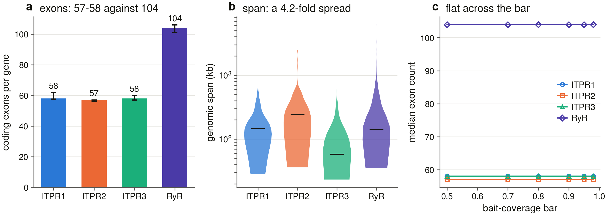
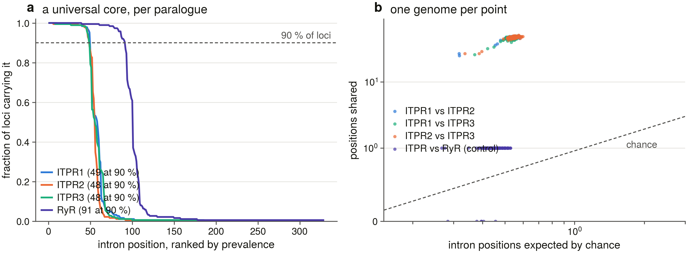

# S21 — gene architecture: the exon structure of an IP3 receptor

*Generated 2026-09-08 by `scripts/s21_run.py` from the
committed tables in `results/gene_architecture/`. Nothing here is
hand-written.*

## 1. What this task measures, and off what

Every task before this one measured a *sequence* or a *search*. S21 measures
the **gene**: how many coding exons an IP3 receptor has, how much genomic
space it takes to hold them, where its introns sit, and whether the three
vertebrate paralogues inherited that structure from one ancestor.

None of it needed a new experiment. The S5 sweep aligned a 38-protein bait
panel to 309 vertebrate genomes with miniprot and kept every genome's
`miniprot.gff`, and each of those files carries, for every alignment, one CDS
record per aligned block with its genomic interval, its span in the bait's own
residue coordinates and its phase. That is a spliced gene model. The genomes
themselves are still on the drive, so every intron's splice dinucleotides can
be read rather than assumed, and the assemblies' own gene sets are there too,
so the boundaries can be checked against a pipeline that never saw a bait.

**2,146 loci** were measured, of which
**1,378** in **189 genomes** are
in the architecture scope. Four rules, each a positive test naming the number
it fired on:

| rule | what it requires | loci it excluded |
|---|---|---|
| A0 | the locus belongs to one of the four cells (D14's family call) | 2 |
| A1 | it is one of S16's committed gene copies (`is_copy`) | 303 |
| A2 | the contig spans the gene (D4) | 448 |
| A3 | the model covers at least 0.9 of its bait | 15 |
| A4 | the bait reaches a usable alignment frame | 0 |

**A2 is the one that does the work.** S19 measured 15.2 % of the sweep's cells
as false negatives of the method and found every one of them is an assembly,
not a gene. An exon count taken below D4's contiguity bar measures contig
lengths, so the scope is above it. **A3** is S21's own bar — S16's copy rule
admits a model covering half its bait, and half a gene has half the exons —
and it is measured rather than assumed: §6 recomputes every count at six
coverage bars and the median exon count moves by at most one exon across the
whole range.

## 2. What an intron is, measured rather than chosen

The brief expected miniprot to emit two CDS records either side of a
frameshift, which would make a broken locus look exon-rich, and asked for
those pairs to be merged. Whether they exist is a measurement, so it was made.

Every consecutive block pair in the sweep — **149,148
of them** — was binned by the gap between the two blocks in gene order and
scored by the splice dinucleotides at that gap's two edges, which is evidence
the alignment score did not produce. The result is that
**0 gaps** sit in a bin the genome
does not call spliceable, the smallest gap anywhere in the sweep is
**10 bp** and it reads as a splice
pair, and the query spans are contiguous across every pair — no residue
emitted twice, none skipped. There is no frameshift-pair population in this
output at all: an indel appears *inside* a block, as a block whose genomic
length differs from three times its residue count.

So the calibration refuses to derive a threshold, in the way
`s15_calibrate_recon.bar()` and `s23_calibrate_loci.separation()` do: a bar
needs gaps on both sides of it, and one side is empty. The floor is placed at
10 bp — *smallest gap the genome calls spliceable — no sub-intron population to exclude* —
and the merge rule consequently fires on **0** of the
112,254 junctions in scope. That zero is a result and not a
rule that cannot act: `s21_test_arch` T5 constructs a pair 2 bp apart with
contiguous query spans and requires the rule to merge it, and the same pair
4.9 kb apart to stay two exons.

## 3. The instrument's own error rate

An exon boundary the aligner placed is a claim about the genome, and the
genome can be asked. Over all **112,254 junctions** in the
architecture scope, **99.89 %** are a
canonical `GT..AG` or one of the two common minor pairs, and
**98.97 %** are canonical outright.
**0.78 %** of junctions carry a frame
step — the reading frame does not carry over, which is how this output records
a frameshift.

That is the instrument judged against the sequence. Judged against **another
pipeline**, 188,146 annotated CDS block edges over
1,171 loci in
164 genomes were compared with the sweep's
own exon boundaries, and **94.5 %** of them
land on one exactly. The assemblies' gene sets were built from evidence
miniprot never saw, so this is corroboration and not a consistency check.
D9's contrast survives it: RefSeq
94.9 % against GenBank
91.1 %.

## 4. The common coordinate frame

An exon boundary is a position in the *bait's* numbering, and the sweep used
38 baits, so comparing an ITPR1 gene's boundaries with an ITPR2 gene's needs
one frame both reach. That frame is S6's committed alignment: all three human
paralogues and human RYR2 are tips of it, so a boundary travels bait → its
cell's human reference (pairwise MAFFT at `--thread 1`, D24) → alignment
column.

**98** (bait, cell) frames were built and
**0** were refused; the worst puts
92.2 % of its bait on the reference against a
70.0 % floor. 9 frames are
`frame_via_cell` — the three unlabelled `vertebrate_basal` baits, which have
no paralogue of their own because S7 declined to place those tips, so their
loci are transferred through the reference of the cell they filled and every
cross-paralogue test is reported with and without them.

**The frame is checked, not assumed.** All **14**
residues S0 *measured* on the 6DQN structure — the ten IP₃ contacts, the two
selectivity-filter residues and the two gate residues, in each paralogue's own
numbering from S17's committed `functional_sites.tsv` — land in the **same
alignment column** in all three paralogues:
14 of 14. A frame that
had slipped anywhere in the pore or the ligand core would fail there, and a
slipped frame is exactly the error that makes a shared-intron count look like
a result. `s21_test_arch` T8 shifts one paralogue's aligned row by a column
and requires the test to refuse.

## 5. Negative controls

Twenty-one constructed controls run **before anything is written**, and the
run refuses to continue if any fails. Four of the rules here return a
*good-looking* number when they are wrong, which is why the suite exists:

- a reader that keys models the way miniprot names them merges the blocks of
  two different genes in the two chunked assemblies, and the merged gene has
  more exons and longer introns (**T1** requires this reader and
  `s5_sweep_lib.parse_miniprot_gff` to return identical genomic blocks for
  every model in an unchunked, a 14-chunk and a 25-chunk genome; **T2**
  requires every `mp_id` the summaries recorded to be a key);
- computing an intron as `next.start − prev.end` reverses every minus-strand
  gene (**T3**), and reading its splice pair without reverse-complementing
  both ends turns every canonical minus-strand intron into `CT..AC` (**T4**);
- inverting the intron-phase convention swaps phases 1 and 2 everywhere,
  changing every shared-intron call without changing a single count (**T7**);
- and asking whether the same bait aligns twice at disjoint positions measures
  *paralogy*, not duplication, in a family whose members are 61-68 % identical
  — the first version of the detector reached a specificity of 0.16 that way
  (**T16**).

The rest are reachability: the merge must be able to fire (**T5**), the loss
of frame must be detectable and absent on a clean chain (**T6**), each scope
rule must fire on its own violation (**T9**), the shared-intron test must
reach both extremes and its exact tail must match a brute-force enumeration
(**T10**, **T11**), both nulls must agree (**T12**), the duplication detector
must fire and decline (**T14**) and its `within_locus` class must be reachable
even though it fires on nothing (**T15**), each terminus class must be
reachable (**T17**, **T18**), the concordance rule must be able to report
disagreement (**T19**), and the intron calibration must refuse without a
second population and place a bar with one (**T20**). **T21** requires the
suite to alter no committed table.

The suite was **mutation-tested on six deliberate rule breakages** — the phase
complement, the intron-phase convention, the strand branch in the gap, the
phase requirement in the shared-intron match, the cell attribution in the
duplication detector, and the reader's collision key — and caught all six, by
T6, T7, T3, T13, T16 and T1 respectively.

## 6. The architecture

| gene | loci | genomes | coding exons (p10–p90) | CDS bp | genomic span bp | median intron bp | mean exon bp |
|---|---|---|---|---|---|---|---|
| ITPR1 | 267 | 188 | 58 (58–62) | 8,250 | 147,445 | 909 | 141 |
| ITPR2 | 190 | 184 | 57 (56–57) | 8,100 | 243,700 | 1,570 | 142 |
| ITPR3 | 187 | 183 | 58 (57–60) | 8,008 | 58,175 | 357 | 138 |
| RyR (control) | 734 | 189 | 104 (101–106) | 14,910 | 142,389 | 564 | 144 |

**The exon count is the conserved thing and the genomic span is not.** Across
1,378 genes in 189 vertebrate
genomes the three paralogues sit at **57–58 coding exons**
and their median genomic spans differ by **4.2-fold**.
The coding sequence is nearly the same size in all three
(8,250, 8,100 and
8,008 bp); what differs is how much intron is
wrapped around it.

The ryanodine receptors, measured through the identical instrument in the same
assemblies, carry **104** exons over
14,910 bp of coding sequence — nearly twice the gene
in both, at almost exactly the same mean exon length
(144 bp against 138–142 bp).

**The count does not depend on the coverage bar.** Recomputed at six bars from
0.50 to 0.98, the median exon count of any
paralogue does not move at all (`architecture_sensitivity.tsv`), so A3 is a scope rule
and not a lever.

Prior: **S0's audit of the literature's "~58-60 exons" left the count verified on human alone, with the accompanying span claim ("hundreds of kb") struck: human ITPR3 spans 76 kb** — roadmap S0 Results; docs/ip3r_background.md. **confirmed** — the literature's ~58-60 was verified on human alone; measured across 189 genomes the medians are 58 (ITPR1), 57 (ITPR2) and 58 (ITPR3)

Prior: **S0 measured the genomic span varying 6.5x across the three human paralogues while the protein length varies 3 %** — roadmap S0 Results; results/s0_baseline/gene_structure.tsv. **confirmed** — S0 measured a 6.5-fold span spread across the three human paralogues; the medians across the whole scope differ 4.2-fold, in the same direction — ITPR3 is the compact gene (58,175 bp) and ITPR2 the long one (243,700 bp)

**{fig:architecture}.** Exon count, genomic span and the coverage-bar
sensitivity. (a) coding exons per gene, median with the 10th–90th percentiles.
(b) genomic span per locus, log axis, one violin per gene. (c) the median exon
count recomputed at every coverage bar.

## 7. Paired within genome (D16)

Intron size, assembly quality and annotation completeness all scale with the
assembly, so every cross-paralogue comparison is made **inside one genome** and
never across the scope: one locus per genome × gene, the best-covered, so a
genome carrying two copies does not weight itself twice. Each is a two-sided
exact sign test with ties dropped and counted (S8's rule) and the whole family
of tests is BH-corrected together (S9's rule). The same comparisons are
repeated inside each of the 4 vertebrate classes with at least
ten genomes.

| pair | metric | genomes | a bigger | b bigger | ties | median difference | q |
|---|---|---|---|---|---|---|---|
| ITPR1 − ITPR2 | n_exons | 183 | 180 | 3 | 0 | 3 | 0 |
| ITPR1 − ITPR2 | span_bp | 183 | 74 | 109 | 0 | -77,408 | 0.0123 |
| ITPR1 − ITPR2 | median_intron_bp | 183 | 71 | 112 | 0 | -258.5 | 0.00341 |
| ITPR1 − ITPR2 | mean_exon_bp | 183 | 14 | 169 | 0 | -4.4 | 0 |
| ITPR1 − ITPR3 | n_exons | 182 | 110 | 49 | 23 | 2 | 2e-06 |
| ITPR1 − ITPR3 | span_bp | 182 | 161 | 21 | 0 | 119,342 | 0 |
| ITPR1 − ITPR3 | median_intron_bp | 182 | 153 | 29 | 0 | 720 | 0 |
| ITPR1 − ITPR3 | mean_exon_bp | 182 | 80 | 101 | 1 | -0.3 | 0.137 |
| ITPR2 − ITPR3 | n_exons | 181 | 11 | 160 | 10 | -1 | 0 |
| ITPR2 − ITPR3 | span_bp | 181 | 146 | 35 | 0 | 144,843 | 0 |
| ITPR2 − ITPR3 | median_intron_bp | 181 | 139 | 42 | 0 | 980.5 | 0 |
| ITPR2 − ITPR3 | mean_exon_bp | 181 | 177 | 4 | 0 | 4.3 | 0 |

Two things are worth reading off that table. **The exon counts differ by one
to three exons and the spans by tens of kilobases**, in the same genomes: the
architecture is shared and the packaging is not. And **the ordering of the
spans is consistent gene by gene**, not an artefact of averaging — ITPR3 is
the shorter gene than ITPR1 in 161
of 182
genomes that carry both.

## 8. Intron positions: what is conserved, and what is ancestral

An intron's *position* here is a pair — the alignment column its upstream exon
ends in, and its classical phase (0, 1 or 2: how many bases of the interrupted
codon lie upstream). Both halves are needed: two paralogues can carry an intron
between the same two residues in different frames, which is not one ancestral
intron, and a column on its own would call any two introns in the same region
shared.

### 8.1 Within a paralogue

| gene | loci | positions seen | in ≥50 % | in ≥90 % | in ≥99 % | median per locus |
|---|---|---|---|---|---|---|
| ITPR1 | 188 | 185 | 58 | 49 | 26 | 57.6 |
| ITPR2 | 184 | 175 | 55 | 48 | 35 | 55.1 |
| ITPR3 | 183 | 179 | 55 | 48 | 26 | 56.8 |
| RyR (control) | 189 | 328 | 100 | 91 | 60 | 101.2 |

Each paralogue carries a core of about **48–49** intron
positions present in at least 90 % of the genomes that have the gene, out of
175–185
positions seen anywhere. The ryanodine receptors have their own core of
91, on the same scale relative to their
101 introns per gene. So the architecture is
not merely a count that happens to be stable — it is the *same introns*, in
the same places, across the vertebrates.

### 8.2 Between paralogues

Two genes with ~58 introns each spread over ~2,700 aligned residues will share
some positions by chance, so every comparison is paired within genome and
scored against a null: each of B's introns placed independently and uniformly
on the columns *both* loci have residues in, keeping its own phase, which makes
the match count a Poisson-binomial whose upper tail is exact — no RNG, no
replicate count. A seeded permutation without replacement is run beside it as a
cross-check and both are committed.

| pair | genomes | median shared | median expected | enrichment | genomes with p < 0.05 | BH q, worst genome |
|---|---|---|---|---|---|---|
| ITPR1 vs ITPR2 | 183 | 48 | 0.55 | 87.6× | 183 / 183 | 0 |
| ITPR1 vs ITPR3 | 182 | 46 | 0.55 | 85.6× | 182 / 182 | 0 |
| ITPR2 vs ITPR3 | 181 | 49 | 0.55 | 88.4× | 181 / 181 | 0 |
| ITPR1 vs RyR | 188 | 1 | 0.46 | 2.1× | 0 / 188 | 1 |
| ITPR2 vs RyR | 184 | 1 | 0.43 | 2.3× | 0 / 184 | 1 |
| ITPR3 vs RyR | 183 | 1 | 0.44 | 2.2× | 0 / 183 | 1 |

**The three IP₃ receptors share about 46 intron positions in every
genome that carries them, against half a position expected.** The enrichment is
85–88× and it is significant in *every* genome tested, not on average.

**And the control is the result.** The ryanodine receptors carry every
ITPR-diagnostic Pfam domain — that is the hazard this whole project is built
around (D14) — and measured through the identical instrument in the same
genomes they share a median of **1** intron position with an IP₃
receptor, in **0** of 188 genomes at p < 0.05.
The two families' exon structures have no ancestry in common. Whatever the
shared domain architecture means, it was not inherited as a gene.

The answer does not rest on exact column identity: the test is run at
tolerances of 0, 1, 2 columns and the operating
point is 0. Repeated with the nine `frame_via_cell` frames
excluded, the counts are in `shared_intron_summary.tsv` under
`excludes_frame_via_cell = 1`.

Prior: **S6 measured the three paralogues at 0.83 mean within-family covered identity and ITPR-to-RyR at 0.249** — results/msa_v2/report.md. **orthogonal** — S6 measured the paralogues at 0.83 mean protein identity and ITPR-to-RyR at 0.249; S21 measures intron positions, and the two are different objects — the RyR sequence identity is a quarter and its shared-intron count is 1, which no identity would predict either way

**{fig:introns}.** (a) intron positions ranked by prevalence, per gene, with
the 90 % line drawn. (b) shared positions against positions expected by chance,
one point per genome per pair, with the identity line.

## 9. Where a fragmentary annotation stops

S18 called 264 of the sweep's loci `fragmentary` and 27 `split`: coding
sequence is there, but no one model covers the gene. That is a statement about
coverage and says nothing about **where** the annotation stopped — and the
difference is the whole claim. A model that stops at a genuine junction has
produced a plausible short gene; one that stops in the middle of an exon has
produced a boundary no splicing machinery could make.

So the unit is the annotated model's own **terminus**, not its internal exon
edges: a model's internal boundaries are its own splice sites and are canonical
by construction, and scoring them would answer §3 a second time. Each terminus
is scored on two axes that know nothing about each other — against the
alignment's exon boundaries, and against the two genomic bases immediately
outside it read in gene orientation — and a terminus coinciding with the gene's
own end is excluded by rule, because a real gene legitimately starts and stops
inside an exon.

The question is asked of **all 291** such loci and not only of the
ones in the architecture scope: those loci sit in the poorer assemblies by
construction, and restricting the question to the architecture scope would
have answered it on 50 of them and dropped the hardest.

| state | loci | genomes | annotation failure | structure disagreement | mixed | broken at real junctions | no internal terminus |
|---|---|---|---|---|---|---|---|
| fragmentary | 264 | 83 | 208 | 40 | 14 | 2 | 0 |
| split | 27 | 15 | 20 | 6 | 0 | 1 | 0 |

Of 1,448 internal termini,
**406** sit inside an exon of the gene model
and **353** inside one of its introns;
689
(47.6 %) land on a boundary the model has.
**228 of 291 loci** carry at least one mid-exon terminus,
which falsifies the reading that the annotation stopped at a real gene
boundary; **3** are broken
entirely at junctions the gene has.

The verdict is one-sided in the way S10's ORF screen is. A mid-exon terminus
falsifies; every terminus landing on a boundary does *not* prove the pieces are
separate genes, so that verdict is named `broken_at_real_junctions` and says
only what it says.

Prior: **S18 called 264 of the sweep's loci `fragmentary` and 27 `split` out of 1,874 scored, and found the family is not recorded worse than its sister** — results/annotation_audit/report.md. **confirmed** — S18 counted the states; S21 says what they are — 228 of 291 split or fragmentary loci stop somewhere nothing splices

Prior: **S10 corroborated the sweep's exon boundaries for two loci against 35 and 40 other genomes' independent annotations, at 94.5 % and 100 % of boundaries shared by a majority** — results/annotation_bugs/report.md; boundary_concordance.tsv. **confirmed** — S10 corroborated two loci's boundaries against 35 and 40 genomes; the same comparison across 164 genomes and 188,146 annotated edges gives 94.5 % exact agreement

## 10. Duplication: is any of this two genes?

An exon count is only a gene's if the locus is one gene. miniprot aligns each
bait independently, so a genome encoding the same part of a protein twice has
the *same* bait aligning twice at two disjoint places — and that geometry, run
naively, measures **paralogy**: the three IP₃ receptors are 61–68 % identical,
every bait aligns at all three genes, and the detector's first version reached
a specificity of 0.16. So the pair has to be inside the cell's own loci, with
the sweep's clustering and attribution imported unchanged, which is where D14
lives.

The detector is then scored as a classifier of a copy count it never sees:
S16's committed `n_copies`, decided by coverage, identity and aligned length
and by no pairwise geometry at all.

| cell | genome × gene cells | tp | fn | fp | tn | sensitivity | specificity |
|---|---|---|---|---|---|---|---|
| all | 1,236 | 342 | 1 | 21 | 872 | 99.7 % | 97.7 % |
| ITPR1 | 309 | 76 | 0 | 6 | 227 | 100.0 % | 97.4 % |
| ITPR2 | 309 | 6 | 0 | 0 | 303 | 100.0 % | 100.0 % |
| ITPR3 | 309 | 4 | 0 | 0 | 305 | 100.0 % | 100.0 % |
| RyR (control) | 309 | 256 | 1 | 15 | 37 | 99.6 % | 71.2 % |

Sensitivity 99.71 % and specificity
97.65 % over 1,236 cells. The RyR
control's specificity is lower on purpose: that cell holds three genes
(RYR1/2/3) in every tetrapod, so the detector *should* fire there, and it does.
The 3R teleost check agrees with S16 on **261 of
267** genome × paralogue cells.

**No locus in the sweep encodes the same part of the protein twice.** The
`within_locus` class — two alignments of one bait inside one locus cluster,
which would be an internal partial duplication, or two neighbouring genes the
10 kb clustering had merged — fires on
**0** pairs. `s21_test_arch` T15 constructs such
a pair and requires the branch to fire, so the zero is a measurement.

Prior: **S16 counted 174 gene copies over 167 clusters and found its split-model merge fired on 0 of 2,146 loci, with the 3R teleosts carrying two copies of a paralogue where the pre-3R ray-finned outgroup carries one** — results/duplication/report.md; loci.tsv, merges.tsv. **confirmed** — S16 found its split-model merge fired on 0 of 2,146 loci; a geometric detector reading the same alignments finds 0 within-locus duplications and agrees with S16's copy call at 99.7 % / 97.7 %

**{fig:fragments}.** (a) the verdict on every split and fragmentary locus.
(b) where the annotation's internal model termini sit relative to the gene
model. (c) the duplication detector scored against S16's copy call.

## 11. What this settles, what it does not, and the hand-off

**Settled.**

1. The IP₃-receptor gene is a **58-exon gene** in all
   three vertebrate paralogues — 58,
   57 and 58 — measured over
   1,378 genes in 189 genomes above
   D4's contiguity bar, and the literature's number was previously verified on
   one species.
2. Its **genomic span is not conserved at all**: a 4.2-fold
   spread between the paralogues' medians, consistent gene by gene within
   genomes, with essentially identical coding length.
3. The three paralogues share ~49
   **intron positions of ~58**, at 85–88× the chance rate, in every genome
   tested — the exon structure is inherited from their common ancestor, not
   convergent.
4. The ryanodine receptors share **1**. The two families' domain
   architecture is shared and their exon structure is not.
5. Database "fragments" are overwhelmingly **annotation failures, not gene
   boundaries**: 228 of
   291 split or fragmentary loci stop
   somewhere nothing splices.
6. The sweep's exon boundaries are corroborated by an independent pipeline at
   **94.5 %** over
   188,146 annotated edges — S10's two-case check,
   generalised to the scope.

**Not settled.**

1. **Where the introns were gained or lost.** S21 counts shared positions; it
   does not reconstruct the ancestral intron set on the tree, and the
   paralogue-specific positions could be gains in one lineage or losses in the
   others. That is a reconciliation question and S13's machinery is the place
   for it.
2. **Anything outside the vertebrates.** The frame is the three human
   paralogues, so the non-vertebrate grade S20 and S23 enumerated is not in
   this measurement at all. Whether the ~58-exon architecture predates the
   2R duplications is unanswered here.
3. **Alternative splicing.** Every count is of one gene model per locus, which
   is the aligner's best path through the genome. The family's characterised
   splice variants (the S1, S2 and SII sites in ITPR1) are not visible to it.
4. **The `in_intron` termini.** 353
   annotated model termini sit inside an intron of the gene model. Some of
   those are the annotation and the alignment genuinely disagreeing about a
   boundary, and S21 records the disagreement rather than adjudicating it.

**Two things to hold against this task.**

- The architecture scope excludes 448
  loci because their contig cannot hold the gene. Those are real genes, and
  every number here is conditional on assembly quality in the way S19 measured.
- The intron-position frame is a protein alignment of four kingdoms, and a
  column is not a homology statement everywhere. The anchor test fixes it at 14
  measured residues in the pore and the ligand core; between those it is the
  aligner's opinion.

