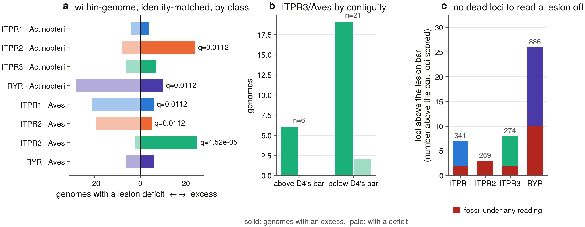

# S15b — the loss counts: 0 across 927 genome × paralog cells, and what it takes to manufacture one

*Generated 2026-09-08 16:22:36 by `scripts/s15b_report.py` from the committed tables in `results/loss_counts/`. Nothing in this report is hand-written; every number is read from a table beside it (D13).*

---

## 1. What this half was asked to do, and what S15a changed about it

S15b's brief asks for Dollo parsimony as the primary count, Mk fits over a sensitivity matrix, and a shared-lesion Poisson test on pseudogene fossils. S15a returned a matrix in which **no cell reaches the state that would license a loss**, and its §11 hands this half four consequences rather than four open questions.

| what S15a handed forward | consequence for this half |
|---|---|
| 0 of 927 cells `absent` | the Dollo count is zero; it is run anyway, because a routine that returns zero without being able to return anything else is not a measurement |
| the `co_trace` population (D46) | the primary coding is **family-level presence per genome**; the paralog-resolved matrix is a sensitivity axis |
| an invariant character | Mk rates are **stated, not fitted** — an invariant character has no transition and a reported rate would be the optimiser's starting point |
| no dead loci | the shared-lesion Poisson test is reported **with its denominator** rather than omitted, and D47's ITPR3 indel excess is followed instead |

So the deliverable is the **sensitivity matrix**: which combinations of coding, evidence bar, branch lengths and contiguity filter manufacture a loss, and how far each is from where S15a stands.

### Everything here is read from a committed table

S15b runs offline. Its inputs are S15a's character matrix, S15a's 309-genome species tree, S15a's ORF-integrity tables and S13's committed node calibrations; it makes no network call, no alignment and no search, and a rerun is deterministic.

The first thing the driver checks is that its recoder **is** S15a's rule chain: re-running all 927 cells at S15a's own setting reproduces `0` mismatches. That check is load-bearing rather than decorative — every comparison in this half is a comparison against S15a's operating point, and a recoder that disagreed with it would make the whole matrix a comparison against something that never ran.

**Priors.** 11 results from earlier tasks are stated in `s15b_priors.py` with where each was said; §9 computes this half's answer beside each and renders the verdict from the comparison, printing both numbers either way.

## 2. The four axes, and what each one is a knob on

Three of the brief's axes change the character; the fourth cannot.

### 2.1 Coding (D46)

`family` asks whether the assembly carries an IP3 receptor at all and is the **primary**. `paralog` asks the same question of each of ITPR1/2/3 separately and is the sensitivity axis, because S15a measured how unreliable per-fragment paralog attribution is in a shattered assembly: 20 `co_trace` regions sit between the candidate and the decoy populations, with a median reassembly of 0.631.

A genome counts as carrying the family if any cell is present **or** it holds spare family loci no cell claimed — the cyclostomes' case, where three ITPR loci sit in a genome the bait panel can only file one of.

### 2.2 Evidence — an ordered ladder named after what each rung refuses

| rung | reconstruction bar | locus rules accepted | the rung |
|---|---|---|---|
| `gap_lo` | 0.1 | R1, R2, R3 | reconstruction bar at the calibration gap's lower edge (the decoy's maximum) |
| `calibrated` | 0.1368 | R1, R2, R3 | S15a's operating point, the gap's midpoint |
| `gap_hi` | 0.1737 | R1, R2, R3 | reconstruction bar at the gap's upper edge (the lowest candidate) |
| `recon_half` | 0.5 | R1, R2, R3 | reconstruction bar at half the reference |
| `recon_strict` | 0.9 | R1, R2, R3 | reconstruction bar at 0.90 of the reference |
| `no_recon` | R4 disabled | R1, R2, R3 | a reference reassembled across contigs is not accepted as presence at all |
| `locus_only` | R4 disabled | R1, R2 | and a locus below the coverage bar with no assembly excuse is not accepted either |
| `full_locus_only` | R4 disabled | R1 | nothing but a locus at or above the sweep's own coverage bar counts as presence |

The first three rungs are the calibration's own numbers and not round ones: `0.1` is the decoy population's maximum, `0.1737` the lowest candidate, and `0.13685` the midpoint S15a operates at. Walking the bar across its whole measured gap is the honest first sensitivity question, and it is asked before any invented threshold is.

`s15b_test_counts.py` T6 requires the ladder to be monotone: a rung named after refusing something must not admit more than the rung above it.

### 2.3 The two protective rules

**D45** (`paralog_unassignable`, R5): a cell the bait panel cannot fill in a genome carrying spare family loci is not evidence the gene is gone. **D4** (`undecidable_contiguity`, R6): an assembly whose contigs are shorter than the gene cannot be evidence that the gene is missing. Each is switched off in turn and in combination — not as a setting anybody should adopt, but to measure what that decision is worth in losses. T7 requires that switching either off can only ever *add* absences.

### 2.4 Branch lengths — the axis that cannot move the count

Dollo parsimony counts **edges**. It does not read a length, so the branch-length axis cannot change the primary result, and this is carried as a column and reported rather than left as an omission. Three schemes are declared (`unit`, `ultrametric`, `calibrated`); the third joins S13's committed node ages by name — 23 of S13's 29 calibrated nodes are present in this tree — and interpolates the rest. The ages are an **input** (D15), not something S15b estimates. Lengths enter the Mk section and nothing else.

## 3. Dollo parsimony, and the bound the tree puts on it

The gain is placed once and losses are the edges below it whose whole subtree has lost the character. **Where the gain goes is a decision, and it is made per character.** The family character is pinned at the root, because S20 (6,928 non-vertebrate eukaryotic reference proteomes) and S23 (194 non-vertebrate genomes) both found IP3 receptors well outside the vertebrates, so the family was present at the root of any vertebrate tree and a vertebrate clade carrying none has lost it. The paralog characters are **not** pinned: S13 places the ITPR2/ITPR3 duplication on the gnathostome stem, so a cyclostome that has neither never had either, and pinning would score the origin of the paralogs as two losses.

### 3.1 The resolution any count is read against

A count of *independent* losses is bounded by how far the tree resolves. Under a polytomy, sibling losses may be separate events or one event on a branch the polytomy does not resolve, so every count is reported as an interval: `dollo_losses_max` counts every loss edge, `dollo_losses_min` counts one per parent carrying any.

| metric | value | what it means |
|---|---|---|
| `internal_nodes` | 468 | including the unary species nodes the sweep's one-tip-per-assembly design creates |
| `unary_nodes` | 308 | one per species represented by a single assembly |
| `polytomies` | 49 | internal nodes of degree 3 or more |
| `max_polytomy_degree` | 23 | the largest unresolved node in the tree |
| `edges_below_polytomies` | 246 | edges whose sibling relationships the tree does not resolve; a loss on one of these is bounded, not counted |
| `settings_with_any_loss` | 43 | rows of dollo_counts.tsv placing at least one loss |
| `settings_where_bound_is_wide` | 16 | rows where the maximum and minimum independent counts differ, i.e. where a polytomy carries more than one loss |

The largest unresolved nodes are degree 23 (×1), degree 17 (×1), degree 10 (×1), degree 9 (×1), against 308 unary species nodes that the sweep's one-tip-per-assembly design creates and that carry no resolution question at all.

## 4. The negative controls

`s15b_test_counts.py` runs **before anything is written** and the driver refuses to continue if it fails: 21/21 passed, status **pass**.

These are checks on *refusal* and on *reachability*, because both failure modes are silent here. A Dollo routine that cannot find a loss returns zero, which is the answer this task expects — so the count would look right while measuring nothing.

| control | the rule it is a control for |
|---|---|
| T1/T2 a constructed loss is found, and sister losses merge | the count must be **reachable**, and a lost clade is one event |
| T3/T3b the gain rule changes the answer in the right direction | unpinned, a clade-wide absence is ancestral; pinned at the root, it is a loss |
| T4 a polytomy bounds rather than fixes the count | two losses under an unresolved node may be one event |
| T5 the recoder reproduces all 927 S15a states exactly | the matrix is a comparison against S15a and must start from it |
| T6/T7 the ladder is monotone and the rules are protective | a rung must not admit more than the one above it; turning a rule off can only manufacture losses |
| T8 the loss state is still reachable after recoding | S15a's T8 property, re-asserted on this module |
| T9/T10 an invariant character is refused on a measured profile | a fitted rate on an invariant character is the optimiser's starting point |
| T11/T12/T13 a varying character *is* fitted, and the pruning matches the closed form | the refusal has to be about the character, not the model |
| T14/T15/T16 the fossil screen fires, refuses and excludes the control | S10's one-sided rule, and the RyR control has no row in the ITPR character matrix |
| T17 BH is a real correction | one family, one correction (S9's rule) |

Mutation-tested: 3 deliberate rule breakages, all caught.

- counted any subtree holding an absent tip as a loss -> T1 fired
- made the strictest rung admit more than the loosest -> T6 fired
- let the fitter fit an invariant character -> T9 fired

## 5. The count

Under S15a's own setting, on both codings:

| coding | character | present | absent | undecided | gain placed at | Dollo losses (max / min) |
|---|---|---|---|---|---|---|
| family | `ITPR_family` | 309 | 0 | 0 | Vertebrata | 0 / 0 |
| paralog | `ITPR1` | 309 | 0 | 0 | Vertebrata | 0 / 0 |
| paralog | `ITPR2` | 307 | 0 | 2 | Gnathostomata | 0 / 0 |
| paralog | `ITPR3` | 307 | 0 | 2 | Gnathostomata | 0 / 0 |

**No vertebrate lineage in this scope has lost an IP3 receptor.** The primary, family-level count is 0, and so is every paralog-resolved one. The count is zero because no cell reaches the state that would license it, not because the routine cannot return anything else: `s15b_test_counts.py` T1 puts a loss on a known edge and requires it found, T2 requires two sister losses merged into their parent, and T8 requires a constructed contiguous, controlled, spare-free empty cell to come back `absent`.

### 5.1 The gain nodes, which nobody asked this instrument for

Dollo places the single gain at the MRCA of the tips that carry the character, and for the paralog characters that node is not pinned. The three answers are **ITPR1 → Vertebrata**, **ITPR2 → Gnathostomata**, **ITPR3 → Gnathostomata** — which is exactly where S13 placed the two duplications, recovered here by a method that reads no gene tree, no alignment and no reconciliation. It is a consistency check and not a second result: the reason ITPR2 and ITPR3 have no cyclostome tip is that S15a coded those cells `paralog_unassignable` for want of a cyclostome-labelled bait, and the reason S13 placed the duplication there is a reconciliation. The agreement is worth printing; it is not independent evidence.

## 6. The sensitivity matrix — the deliverable

With no loss to place, what is worth reporting is the shape of the zero: how far the rules must move before a loss appears, which rule has to move, and what each move buys. 32 settings were walked (8 evidence rungs × D45 on/off × D4 on/off), on both codings, under all three branch-length schemes.

**Figure 1.** Dollo losses manufactured by every setting of the rule chain, for the primary family-level coding (a) and the paralog-resolved one (b). The violet ring marks S15a's own operating point. A zero is drawn as an explicit zero and never as an empty cell, because an empty cell reads as *not measured*.

**Family-level coding (primary, D46).**

| evidence rung | both on (S15a) | D45 off | D4 off | both off |
|---|---|---|---|---|
| `gap_lo` | 0 | 0 | 0 | 0 |
| `calibrated` | 0 | 0 | 0 | 0 |
| `gap_hi` | 0 | 0 | 0 | 0 |
| `recon_half` | 0 | 0 | 0 | 0 |
| `recon_strict` | 0 | 0 | 0 | 0 |
| `no_recon` | 0 | 0 | 0 | 0 |
| `locus_only` | 0 | 0 | 0 | 0 |
| `full_locus_only` | 0 | 0 | 1 | 1 |

**Paralog-resolved coding (max / min independent, worst of ITPR1/2/3).**

| evidence rung | both on (S15a) | D45 off | D4 off | both off |
|---|---|---|---|---|
| `gap_lo` | 0 | 0 | 0 | 0 |
| `calibrated` | 0 | 0 | 0 | 0 |
| `gap_hi` | 0 | 0 | 0 | 0 |
| `recon_half` | 0 | 0 | 1 / 1 | 6 / 5 |
| `recon_strict` | 1 / 1 | 1 / 1 | 7 / 7 | 12 / 8 |
| `no_recon` | 1 / 1 | 1 / 1 | 14 / 14 | 17 / 16 |
| `locus_only` | 1 / 1 | 1 / 1 | 19 / 18 | 22 / 20 |
| `full_locus_only` | 1 / 1 | 2 / 2 | 25 / 23 | 45 / 37 |

Read across the two tables, the result is an asymmetry rather than a number. The **primary coding manufactures a loss in 2 of 32 settings**, and its worst case is 1 genome in 309 — reached only by refusing everything except a complete locus *and* ignoring D4's contiguity bar at the same time. The **paralog-resolved coding manufactures one in 18 of 32**, up to 45 loss edges (37 independent under the tree's own resolution). That is D46 measured rather than asserted: a per-paralog absence is fragile to every one of these knobs and a family-level absence is not.

### 6.1 The three rungs that change nothing

Moving the reconstruction bar across the **whole gap the calibration measured** — `0.1` (the decoy's maximum) to `0.1737` (the lowest candidate) — manufactures no loss on either coding. The bar's position inside its own uncertainty is not what any result here rests on.

### 6.2 What each knob is worth

| the loosest setting that releases the cell | cells | paralog cells | classes |
|---|---|---|---|
| evidence=full_locus_only; R5 off (D45); R6 off (D4) | 65 | ITPR1, ITPR2, ITPR3 | Actinopteri, Aves |
| evidence=full_locus_only; R6 off (D4) | 22 | ITPR1, ITPR2, ITPR3 | Aves, Lepidosauria |
| evidence=recon_strict; R6 off (D4) | 16 | ITPR1, ITPR2, ITPR3 | Aves, Mammalia |
| evidence=no_recon; R6 off (D4) | 14 | ITPR1, ITPR2, ITPR3 | Aves |
| evidence=recon_half; R5 off (D45); R6 off (D4) | 7 | ITPR1, ITPR2, ITPR3 | Actinopteri, Aves |
| evidence=locus_only; R6 off (D4) | 5 | ITPR2 | Aves |
| evidence=gap_lo; R5 off (D45) | 4 | ITPR2, ITPR3 | Hyperoartia, Myxini |
| evidence=recon_half; R6 off (D4) | 3 | ITPR1, ITPR2, ITPR3 | Aves |

**144 of 927 cells read `absent` under at least one of the 32 settings**, and every one of them names in its row what held it at S15a's operating point.

Turning **D45 off alone** — refusing to treat a genome's spare, unassignable family loci as evidence — manufactures 4 losses immediately, at every evidence rung, and they are the cyclostome ITPR2/ITPR3 cells in *Petromyzon marinus* and *Myxine glutinosa*. Both genomes carry three ITPR loci apiece. That is what D45 is worth.

**Tightening the evidence alone**, with both protective rules left on, manufactures 1 loss in the whole scope: *Bothrops jararaca* ITPR2 (GCA_018340635.1), whose reference reassembles at 0.796 across 6 contigs in an assembly contiguous enough to carry the gene, with no spare family locus to explain it. It reads `absent` only if a cross-contig reassembly at 80% of the reference is refused as evidence — six times the bar the calibration measured. It is not a loss; it is the single cell in 927 whose presence rests on the reconstruction instrument alone.

**Figure 2.** The 43 cells R4 places, by what would catch each if the reconstruction bar rose (a), and the losses that rise manufactures under each rule setting (b). The calibrated bar and both edges of its measured gap are drawn, not stated.

## 7. Mk models — stated, not fitted

The brief asks for ER, ARD and an irreversible model with the gain rate pinned to zero. On the primary character all three are **refused**, and the refusal is measured rather than asserted.

An invariant character contains no transition to estimate. Profiling each likelihood along a log-spaced rate grid over eight orders of magnitude gives, at every one of the 12 model × branch-length × axis combinations, a monotone curve with its maximum on the grid's boundary:

| model | axis profiled | branch lengths | shape | arg max | at the boundary |
|---|---|---|---|---|---|
| `ER` | loss | unit | monotone decreasing | 1e-06 | yes |
| `ARD` | loss | unit | monotone decreasing | 1e-06 | yes |
| `ARD` | gain | unit | monotone increasing | 100 | yes |
| `irreversible` | loss | unit | monotone decreasing | 1e-06 | yes |
| `ER` | loss | ultrametric | monotone decreasing | 1e-06 | yes |
| `ARD` | loss | ultrametric | monotone decreasing | 1e-06 | yes |
| `ARD` | gain | ultrametric | monotone increasing | 100 | yes |
| `irreversible` | loss | ultrametric | monotone decreasing | 1e-06 | yes |
| `ER` | loss | calibrated | monotone decreasing | 1e-06 | yes |
| `ARD` | loss | calibrated | monotone decreasing | 1e-06 | yes |
| `ARD` | gain | calibrated | monotone increasing | 100 | yes |
| `irreversible` | loss | calibrated | monotone decreasing | 1e-06 | yes |

The loss axis falls and ARD's **gain** axis rises, to the edge of the grid in both directions — which is what unidentifiability looks like when it is drawn rather than argued. ARD is profiled on its gain axis and not on its diagonal, because the diagonal is ER by construction and would put the same curve on the figure twice under two names.

So no rate is reported for the primary character. A fitter run on it would return its own starting point, and all 12 of 12 model fits at S15a's operating point — every character, under every branch-length scheme — are refusals for exactly that reason.

### 7.1 The informative version

Where the sensitivity matrix *does* produce variation the fits are real, and they are reported for what they are: 405 fits against 117 refusals, one row per *distinct* character (the fits are memoised on the character vector, so a rung that changes no cell costs nothing). The rate tracks the number of losses the setting manufactured and the units the branch lengths are in, which is the whole point — it is a property of the filter, not of the family.

The most extreme cell of the matrix — `paralog` coding, character `ITPR2`, evidence `full_locus_only`, both protective rules off, 56 cells made absent — under the irreversible model:

| branch lengths | model | cells absent | loss rate | lnL | AIC |
|---|---|---|---|---|---|
| calibrated | `irreversible` | 56 | 0.001544 | -167.80 | 337.61 |
| ultrametric | `irreversible` | 56 | 0.7641 | -155.28 | 312.57 |
| unit | `irreversible` | 56 | 0.06645 | -142.14 | 286.28 |

The three rates span a factor of 495 across the three schemes while describing the same character. That is the branch-length axis doing the only thing it can do in this task: set the units a rate is quoted in.

### 7.2 The branch-length axis, reported rather than omitted

Across all 32 settings and all three schemes, the number of settings at which a branch-length scheme changes a Dollo count is **0**. Parsimony counts edges and does not read a length, so this could not have come out any other way — but the brief names branch lengths as an axis, and a matrix that quietly dropped one axis would be indistinguishable from one that had tested it.

**Figure 3.** The primary character's likelihood profile under all three models and all three branch-length schemes (a) — monotone to the boundary, which is the argument for refusing to fit it — and every rate that *can* be fitted, against the number of losses its setting manufactured (b).

## 8. The fossil analysis, and the lead it hands over

### 8.1 The shared-lesion Poisson test, with its denominator

The brief asks whether descendants of a dead paralog share lesions more often than independent decay would give. That test needs dead loci. Of **1,760 scored loci**, 44 clear S15a's measured lesion bar of 1.59 lesions per kilo-residue — and **44 of those 44 are at full coverage**, delivering a complete gene model.

| cell | loci scored | above the lesion bar | fossil under any reading | median identity | median identity above the bar |
|---|---|---|---|---|---|
| ITPR1 | 341 | 7 | 2 | 0.9585 | 0.8538 |
| ITPR2 | 259 | 3 | 3 | 0.9674 | 0.6135 |
| ITPR3 | 274 | 8 | 2 | 0.9672 | 0.8765 |
| RYR | 886 | 26 | 10 | 0.7895 | 0.7443 |

The screen was made deliberately generous — a locus counts as a fossil if *any* of three readings fires (above the bar and below the coverage bar, above the bar with a premature stop, or above the bar in a cell the matrix does not code present) — because a test made hard to pass would make the zero uninformative. Even so, **7 ITPR loci in 874 fire any reading at all**, and all 7 do so on 1–2 internal stops in a complete, full-coverage model:

| organism | cell | coverage | identity | frameshifts | stops | cell state |
|---|---|---|---|---|---|---|
| *Alca torda* | ITPR2 | 1 | 0.9772 | 5 | 1 | `present_single_locus` |
| *Hymenochirus boettgeri* | ITPR1 | 1 | 0.7451 | 5 | 2 | `present_single_locus` |
| *Hymenochirus boettgeri* | ITPR2 | 1 | 0.6135 | 6 | 1 | `present_single_locus` |
| *Lates japonicus* | ITPR1 | 1 | 0.6863 | 8 | 2 | `present_single_locus` |
| *Lates japonicus* | ITPR2 | 1 | 0.5799 | 19 | 1 | `present_single_locus` |
| *Bombina bombina* | ITPR3 | 1 | 0.8812 | 36 | 1 | `present_single_locus` |
| *Takifugu rubripes* | ITPR3 | 1 | 0.8589 | 43 | 2 | `present_single_locus` |

S10 measured 0 internal stops against 4–25 expected under neutral drift at 8 family loci, and set the rule one-sided: zero stops falsifies a pseudogene call and a handful does not establish one. One or two stops in a ~2,700-residue model at full coverage is not the signature of decay. **The shared-lesion Poisson test has no dead loci to run on, and that is reported here with its denominator rather than omitted**, because an omitted section is indistinguishable from a section nobody ran.

### 8.2 D47's lead: the ITPR3 indel excess is a bird result

S15a found that ITPR3 carries an indel excess against its own genome's identity-matched sibling loci — 39 genomes to 14, q = 0.0032 — and nothing in this project explained it. The same committed pairs, the same sign test, the same identity matching, stratified by vertebrate class and BH-corrected across the 8 strata with enough untied pairs to test:

| cell | class | pairs | untied | excess | deficit | ties | p | q (BH) |
|---|---|---|---|---|---|---|---|---|
| ITPR1 | Actinopteri | 20 | 8 | 4 | 4 | 12 | 1.0000 | 1.0000 |
| ITPR1 | Aves | 108 | 27 | 6 | 21 | 81 | 0.0059 | 0.0112 |
| ITPR2 | Actinopteri | 45 | 32 | 24 | 8 | 13 | 0.0070 | 0.0112 |
| ITPR2 | Aves | 104 | 24 | 5 | 19 | 80 | 0.0066 | 0.0112 |
| ITPR3 | Actinopteri | 30 | 13 | 7 | 6 | 17 | 1.0000 | 1.0000 |
| ITPR3 | Aves | 105 | 27 | 25 | 2 | 78 | 5.65e-06 | 4.52e-05 |
| RYR | Actinopteri | 62 | 38 | 10 | 28 | 24 | 0.0051 | 0.0112 |
| RYR | Aves | 73 | 12 | 6 | 6 | 61 | 1.0000 | 1.0000 |

**The excess is a bird result.** In Aves it is 25 genomes to 2 over 27 untied pairs (q = 4.52e-05); in Actinopteri it is 7 to 6 over 13 untied pairs (p = 1.0000) — no signal at all, on a sample that is smaller but not small. Whatever is raising ITPR3's indel density is not doing it across the vertebrates.

**And the design makes a cell and its siblings the same observation twice.** The comparison is within one genome, against that genome's other family loci, so a bird ITPR3 that is elevated makes its own ITPR1 and ITPR2 look deficient by construction — which is exactly the pattern in the table. The three Aves rows are one result, not three.

### 8.3 The control that has to be printed

| cell / class | direction | above D4's bar | below D4's bar | median identity (locus / others) |
|---|---|---|---|---|
| ITPR1 / Aves | deficit | 0:3 (too few to test) | 6:18 (p = 0.0227) | 0.9888 / 0.9841 |
| ITPR2 / Actinopteri | excess | 23:8 (p = 0.0107) | 1:0 (too few to test) | 0.8596 / 0.8696 |
| ITPR2 / Aves | deficit | 5:0 (too few to test) | 0:19 (p = 3.81e-06) | 0.9817 / 0.9869 |
| ITPR3 / Aves | excess | 6:0 (too few to test) | 19:2 (p = 0.0002) | 0.9891 / 0.9841 |
| RYR / Actinopteri | deficit | 10:27 (p = 0.0076) | 0:1 (too few to test) | 0.8784 / 0.8746 |

**21 of 27 of the bird pairs are in assemblies below D4's contiguity bar**, and that is where the test has its power: 19:2, p = 0.0002. Above the bar all 6 pairs point the same way and none points against — but 6 pairs cannot carry a test. S5b measured 66 % of Aves assemblies below the bar, the worst of any class, so this is the class where an indel signal is hardest to separate from an assembly signal. The identity control is clean — locus and siblings are matched to 0.9891 against 0.9841 — so D47's own confounder is not what this is. **The honest verdict is that the lineage is now named and the mechanism is not, and that the contiguous half of the evidence is too small to settle it.**

**Figure 4.** D47's within-genome, identity-matched sign test stratified by vertebrate class (a); the strongest stratum split by D4's contiguity bar (b); and the fossil denominator, with the number of loci scored above each bar (c).

## 9. Every prior, computed on this half's own tables

Each row states what an earlier task concluded and where, computes S15b's answer beside it, and renders the verdict from the comparison.

- **absent_cells** — prior: `0`; this task: `0`; verdict: **confirmed**. Source: S15a — 0 of 927 genome x paralog cells reaches the `absent` state, the only state S15b may count, and that state is reachable: `s15_test_loss.py` T8 constructs a contiguous, controlled, empty, spare-free cell and requires it to come back `absent`.
- **family_coding_primary** — prior: `family-level presence per genome`; this task: `2 of 32 settings manufacture a family loss against 18 of 32 paralog-resolved`; verdict: **confirmed**. Source: S15a D46 — the `co_trace` population (20 regions, median reassembly 0.631, sitting between the candidates and the decoy) is the measured size of the paralog-attribution problem in a shattered assembly, so S15b's primary coding must be family-level and the paralog-resolved matrix is the sensitivity axis.
- **loss_candidates** — prior: `4`; this task: `4`; verdict: **confirmed**. Source: S15a `loss_candidates.tsv` — four near-misses, all of them cyclostome ITPR2/ITPR3 cells stopped by R5 (D45), each row naming the rule that stopped it.
- **itpr1_gain_node** — prior: `Vertebrata`; this task: `Vertebrata`; verdict: *orthogonal*. Source: S13 — the split separating ITPR1 from ITPR2+ITPR3 is on the **vertebrate stem**, older than crown Vertebrata, and the split separating ITPR2 from ITPR3 is on the **gnathostome stem**.
- **itpr23_gain_node** — prior: `Gnathostomata`; this task: `ITPR2 → Gnathostomata, ITPR3 → Gnathostomata`; verdict: *orthogonal*. Source: S13 — ITPR2 and ITPR3 separate on the gnathostome stem, so no cyclostome carries either as such; S7 says the same from the other side, with every cyclostome tip outside all three paralog clades.
- **itpr3_indel_excess** — prior: `0.0032`; this task: `concentrated in Aves (25:2, q = 4.52e-05), absent in Actinopteri`; verdict: *underpowered*. Source: S15a D47 — ITPR3 carries an indel excess against its own genome's identity-matched sibling loci, 39 genomes to 14, q = 0.0032, and nothing in this project explains it. ITPR2's apparent excess disappears under identity matching (q = 0.902) and the RyR control shows none (q = 0.090).
- **no_fossils** — prior: `0`; this task: `7`; verdict: **contradicted**. Source: S15a §11.4 — every locus above the measured lesion bar is at full coverage with an intact model, so the shared-lesion Poisson test has no dead loci to run on.
- **zero_stops_falsifies** — prior: `0`; this task: `27 of 44 loci above the lesion bar carry no internal stop; the rest carry 1-2 at full coverage`; verdict: **confirmed**. Source: S10 — all 8 family loci across the two case genomes carry 0 internal stops against 4-25 expected under neutral drift at the observed divergence; the rule is one-sided, zero stops falsifies a pseudogene call and a handful does not establish one.
- **polytomy_degree** — prior: `23`; this task: `23`; verdict: **confirmed**. Source: S15a — the 309-genome NCBI taxonomy tree carries 468 internal nodes and 49 polytomies, the largest of degree 23 (Passeriformes).

One verdict needs its wording defended. `no_fossils` is rendered **contradicted** because the generous screen fires on 7 ITPR loci where S15a reported none — but every one of the 7 is at full coverage with 1–2 internal stops, so the disagreement is with S15a's *wording* and not with its finding. The screen is written to be easy to pass precisely so that a reader can see how little passing it is worth.

## 10. What this half settles and what it does not

**Settles.**

- **No vertebrate lineage in this scope has lost an IP3 receptor.** Dollo places 0 losses on the family character and 0 on every paralog character, across 927 genome × paralog cells in 309 genomes, and the routine that returns that zero is one that finds a constructed loss on a known edge.
- **The family-level coding is robust and the paralog-resolved one is not**, by a factor of 18 to 2 settings. D46 was a judgement when S15a made it; it is a measurement now.
- **The reconstruction bar's position inside its measured gap changes nothing**, and D45 alone is worth 4 losses that never happened.
- **No Mk rate can be reported for this character, and the reason is measurable**: every likelihood is monotone to its boundary on every model, axis and branch-length scheme.
- **There are no pseudogene fossils**, on a denominator of 1,760 scored loci, with the generous screen printed beside the strict one.

**Does not settle.** Four things, all of them leads rather than gaps.

1. **Why bird ITPR3 carries extra indels.** The lineage is named — 27 identity-matched within-genome pairs, q = 4.52e-05, with no equivalent in ray-finned fish — but 21 of 27 of those pairs sit in assemblies below D4's contiguity bar, and the 6 above it all point the same way without being enough to test. The next instrument is a bird panel restricted to chromosome-level assemblies, which is a different sample and not a different statistic.
2. **What the one reconstruction-only cell actually is.** *Bothrops jararaca* ITPR2 is the single cell in 927 whose presence rests on the cross-contig reassembly and on nothing else. It is not a loss under any bar the calibration licenses, but it is the cell a sceptical reader should be handed first.
3. **The count is bounded by the tree's resolution, and the bound was never tested.** With no loss to place, the interval between `dollo_losses_max` and `dollo_losses_min` is never exercised at the operating point. It is exercised across the manufactured settings, and there it is wide — up to 45 edges collapsing to 37.
4. **A zero across 309 vertebrate genomes is a statement about 309 vertebrate genomes.** S4 declared that denominator and S5b swept it; nothing here extends to a species with no assembly.

**Two things a reader should hold against this half.** The sensitivity matrix's most extreme settings are not settings anybody would adopt — refusing a complete-but-truncated locus *and* ignoring contiguity is not a defensible protocol — so the 144 cells that read `absent` somewhere in the grid should be read as a map of fragility and not as a list of candidates. And the gain-node agreement with S13 is printed because it is worth printing, not because it is independent: the cyclostome cells that put ITPR2 and ITPR3's gain on the gnathostome stem are `paralog_unassignable` for a bait-panel reason, which is the same evidence S13 used, seen from a different side.
