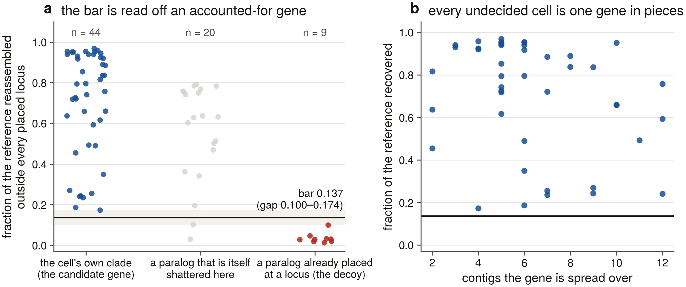
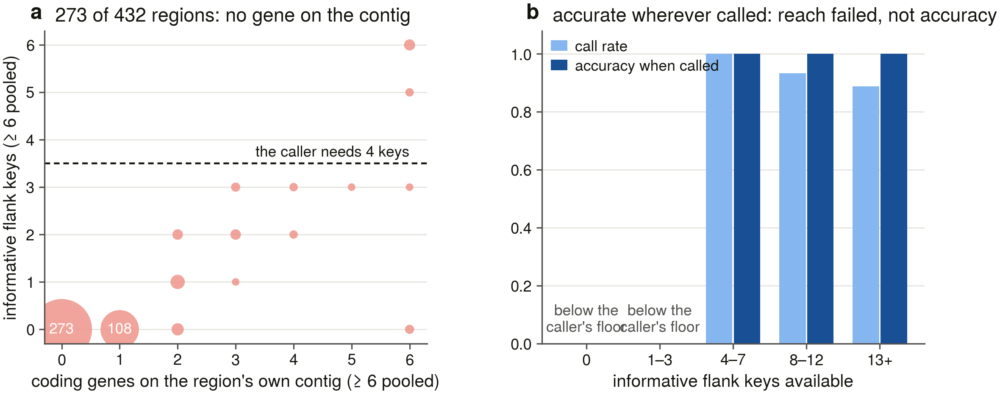
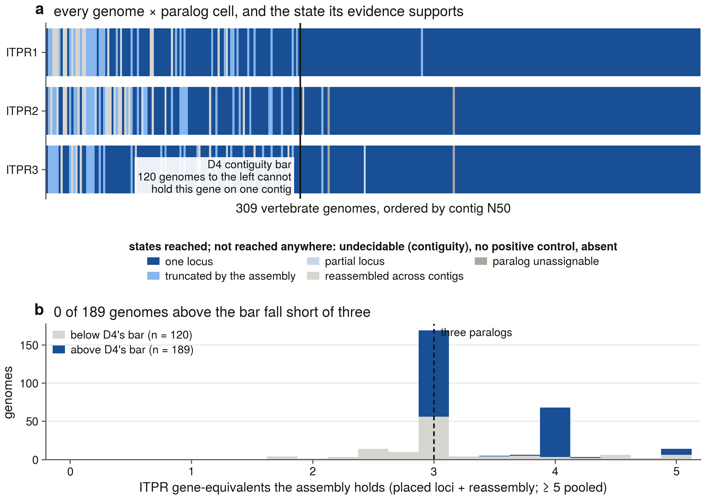
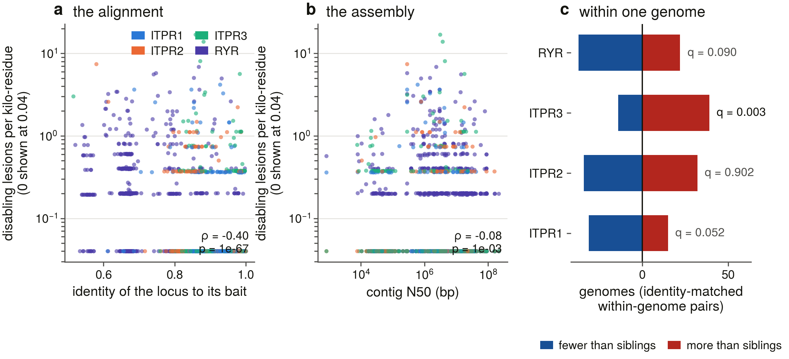

# S15a — the loss instrument: 927 genome × paralog cells across 309 vertebrate genomes

*Generated 2026-09-08 15:44:12 by `scripts/s15_report.py` from the committed tables in `results/loss_dynamics/`. Nothing in this report is hand-written; every number is read from a table beside it (D13).*

S13 placed both duplications that made ITPR1/2/3 and then could not count a single loss: its reconciliation implies 51–53 across the vertebrate subtree and **none** survives being asked of the genome sweep. It handed S15 the reason — a reconciliation on a 134-tip representative alignment cannot count losses, because a paralog missing from the alignment is usually missing from the *sample* — and the instruction: build the character matrix from the 309-genome sweep, one cell per genome × paralog, and not from tips of a tree.

This half of S15 builds that matrix and the three things it needs first. **What counts as a loss** — a state vocabulary in which exactly one state may be counted, reached only after every alternative explanation has been given a positive test. **What the sweep's undecided cells actually contain** — the brief asked for synteny and the answer is that synteny cannot reach them, so the reference is reassembled from the sweep's own archived alignments instead, against a bar measured on a gene that is accounted for elsewhere in the same genome. And **whether a broken reading frame is a broken gene or a broken assembly** — an ORF screen with the confounder controlled three ways, one of which turned out to matter and was not the one anybody expects.

S15b counts the losses: Dollo parsimony as the primary count, Mk model fits, the coding × evidence × branch-length × contiguity sensitivity matrix, and the pseudogene-fossil lesion analysis.

## 1. Scope, and the unit of observation

The matrix is **927 cells**: 309 genomes × three paralogs. The unit is the *assembly*, not the species — two accessions of one species are two independent observations of its gene complement, and collapsing them would average a placed gene with a shattered one.

The RyR sister family is in every genome as the positive control and is **not** a column of the matrix: it is what makes an empty ITPR cell an empty cell in an assembly the search demonstrably reached. It fired in all 309 genomes, so rule R0 excludes nothing.

| parameter | value | where it comes from |
|---|---|---|
| rescue significance | 1e-05 | `s5_rescue.RESCUE_E` — the sweep's own cut, not re-chosen |
| known-locus pad | 5,000 bp | `s5_run_sweep.filter_hsps_outside` — the cross-paralog control |
| full-locus coverage | 0.7 | `s5_classify.COV_FOUND` |
| synteny window | informative10 | `s8_flank_lib` — S8's rule, imported unchanged |
| synteny key floor | 4 | `s8_paralogon.MIN_KEYS` |
| integrity bar quantile | 0.99 | measured on the intact population, §4 |
| identity-match window | 0.02 | §4 — the confounder that turned out to be real |

## 2. What counts as a loss

Eight states, assigned by ordered positive tests; the first rule that fires wins, and each writes the number it fired on into its row of `character_matrix.tsv`. The design constraint is that **exactly one** state may be counted as a loss.

| rule | state | the test it applies |
|---|---|---|
| R0 | `no_control` | the genome's RyR control did not fire — no cell in it supports any claim |
| R1 | `present_single_locus` | a locus at or above the sweep's own coverage bar |
| R2 | `present_truncated` | a locus below it, truncated at a contig edge or an N-run |
| R3 | `present_partial` | a locus below it with no assembly excuse |
| R4 | `present_fragmented` | no locus, but the reference reassembles from sequence outside every locus the aligner found, above the measured bar (§3) |
| R5 | `paralog_unassignable` | no locus and no reassembly, but the genome carries family loci no cell claimed — D45 |
| R6 | `undecidable_contiguity` | nothing found, and the assembly cannot hold the gene on one contig (D4's bar) |
| R7 | **`absent`** | nothing found, in a controlled assembly that could have held it. The only state S15b may count |

Two of these rules exist because of specific incidents earlier in the project. **R5 is D45.** Both cyclostome genomes carry three ITPR loci apiece, all filed in the ITPR1 cell because the S5 bait panel has no cyclostome-labelled bait, and their ITPR2 and ITPR3 cells therefore read `absent` in the ledger. A count that took those at face value would score two independent losses per cyclostome that never happened. **R6 is D4.** An assembly whose contigs are shorter than the gene cannot represent it as one locus, so it cannot be evidence that the gene is missing — and 66 % of the Aves assemblies in this scope are in that position.

The rule order is itself tested: `s15_test_loss.py` T6 moves R5 after R7 and requires the suite to fail, which it does.

## 3. The instrument: reassembling a reference across contigs

The sweep's `tblastn_trace` cells are the ones a loss count can neither ignore nor use. The aligner placed no locus, so the ledger records no coverage; the rescue attributed regions, so they are not nothing either. What is measured here is the **non-redundant coverage of the reference protein, reassembled across contigs** — the union of the query intervals of every significant HSP, over the reference's own length.

Three properties make that a positive test rather than a hopeful one.

1. **It is computed outside every locus the aligner found.** The HSP set passes through the sweep's own exclusion — every clustered locus in the genome, any bait, padded 5 kb — so a reference cannot be reassembled out of the genome's other paralogs' genes. For a family whose paralogs are 61–68 % identical that is the failure mode that matters, and `s15_test_loss.py` T2 removes the filter and requires the suite to fail.
2. **One reference at a time.** A union over three orthologous baits would count a residue covered in any of them and report a coverage no single protein achieves (T3).
3. **The bar is measured, against a gene that is accounted for.**

| metric | n pos | n neg | n co-trace | pos median | pos min | neg median | neg max | Youden J | gap | bar |
|---|---|---|---|---|---|---|---|---|---|---|
| coverage | 44 | 9 | 20 | 0.795 | 0.174 | 0.030 | 0.100 | 1.00 | 0.100–0.174 | 0.137 |
| gene_equiv | 44 | 9 | 20 | 0.929 | 0.199 | 0.030 | 0.136 | 1.00 | 0.136–0.199 | 0.167 |

The negative is the sweep's own output and needed no new search: regions the full 38-bait panel attributes to a paralog whose gene the aligner **already placed at a locus in the same genome**. That paralog is accounted for, so the fragment set cannot be that gene, and what it recovers is what cross-paralog similarity delivers on its own — a median of 0.030 and a maximum of 0.100 against a candidate median of 0.795.

The first version of this calibration did **not** separate, at J = 0.52, and the reason is worth stating because it is a result in itself: the decoy was every region attributed elsewhere, and in a genome where two paralogs are both shattered a fragment attributed to the other one is a piece of a real gene. Those 20 regions are now reported as their own population — `co_trace`, median 0.631, sitting squarely between the two — and they are the **measured size of the paralog-attribution problem in a shattered assembly**. `s15_test_loss.py` T9 folds them back into the decoy and requires the suite to fail.

The operating point is the midpoint of the gap (0.137) rather than Youden's own threshold, which on a perfectly separated pair lands on the lowest positive and is the most permissive bar the data allow. Both edges of the gap are committed so a later run whose populations have drifted into contact is visible in the table, and `s15_calibrate_recon.bar()` refuses to hand out a threshold the calibration marked unusable.

**Figure 2.** The three populations the bar is read off, with the gap shaded and the operating point drawn (a), and every undecided cell against the number of contigs its gene is spread over (b). A calibration figure that asked to be believed would not be one, so both edges of the gap are marks and not a caption.

## 4. The brief's first step, and the number that answers it

S15 was asked to disambiguate the sweep's undecided cells **by synteny**, with measured accuracy against known loci. S8 had already built that instrument and calibrated it leave-one-genome-out on loci whose paralog their own annotation establishes, so the work here was to point it at the trace regions and measure whether it arrives.

**It does not, and that is the result.** Of the 432 rescue regions across the undecided cells, **273 sit on a contig carrying no annotated gene at all**, 151 have too few informative flanking symbols, and **8 reach the caller's 4-key floor**. The median region has 0 informative neighbours and 0 coding genes on its own contig, which extends a median of 39.9 kb — shorter than a single ITPR gene.

That is not a failure of the caller. On S8's own calibration set, binned by the number of keys available, accuracy is 100 % at every key count the caller will act on:

| keys available | n loci | called | call rate | accuracy when called |
|---|---|---|---|---|
| 0 | 39 | 0 | 0.000 | — |
| 1–3 | 10 | 0 | 0.000 | — |
| 4–7 | 13 | 13 | 1.000 | 1.000 |
| 8–12 | 15 | 14 | 0.933 | 1.000 |
| 13+ | 426 | 378 | 0.887 | 1.000 |

On the 8 regions it can reach, the caller returns a call for 6 and **agrees with the alignment's own paralog attribution on 6 of them**. That is an independent instrument corroborating the attribution — on six regions, which is stated for what it is rather than leaned on.

**Figure 3.** Why synteny could not answer. The joint distribution of what a trace region has to work with — genes on its own contig against informative flank keys, with the caller's four-key floor drawn (a) — beside S8's own accuracy on the same axis (b). Putting reach and accuracy on one axis is what makes *accurate and unavailable* a readable sentence.

## 5. Negative controls

`s15_test_loss.py` runs **15 constructed cases before anything is written** and the driver refuses to continue if any fails (15/15 passed on this build). They are checks on *refusal*, because every rule in this task returns a plausible number when it is wrong: a reconstruction without the known-locus filter reassembles a missing gene out of its own paralogs and reports 0.95; a state machine with R5 and R7 the wrong way round manufactures four losses in the cyclostomes; a bar read off a contaminated decoy lands in the middle of the positives.

Mutation-tested — each deliberate rule breakage was applied to the live module and the suite re-run:

| breakage | caught by |
|---|---|
| dropped the known-locus filter from reconstruct() | T2 fired |
| moved R5 (paralog_unassignable) after R7 (absent) | T6 fired |
| used every elsewhere-attributed region as the decoy | T9 fired |

## 6. The character matrix

**No cell in 927 reaches `absent`.** Every genome × paralog cell in the 309-genome sweep is either a placed gene, a gene the assembly holds in pieces, or a cell the bait panel cannot resolve.

| rule | state | cells | share | ITPR1 | ITPR2 | ITPR3 | what it means |
|---|---|---|---|---|---|---|---|
| R1 | `present_single_locus` | 783 | 84.5 % | 261 | 253 | 269 | one locus at full coverage |
| R2 | `present_truncated` | 90 | 9.7 % | 31 | 32 | 27 | a locus truncated by the assembly |
| R3 | `present_partial` | 7 | 0.8 % | 0 | 6 | 1 | a partial locus with no assembly excuse |
| R4 | `present_fragmented` | 43 | 4.6 % | 17 | 16 | 10 | reassembled across contigs (§3) |
| R5 | `paralog_unassignable` | 4 | 0.4 % | 0 | 2 | 2 | family loci the panel cannot file (D45) |
| R6 | `undecidable_contiguity` | 0 | 0.0 % | 0 | 0 | 0 | the assembly cannot hold the gene (D4) |
| R0 | `no_control` | 0 | 0.0 % | 0 | 0 | 0 | the positive control did not fire |
| R7 | `absent` | 0 | 0.0 % | 0 | 0 | 0 | **absent — the only countable loss state** |

The four `paralog_unassignable` cells are ITPR2 and ITPR3 in *Petromyzon marinus* and *Myxine glutinosa* — exactly the four S13 flagged, recovered here by a rule that reads the sweep's own per-genome locus counts rather than S13's table.

The 43 `present_fragmented` cells are the sweep's undecided ones, and they are the substantive change this task makes to the ledger: the S5 ledger held 43 `tblastn_trace` and one `tblastn_trace_ambiguous` cell that a naive count would have read as candidate absences. Every one of them holds an ITPR gene.

## 7. How many ITPR genes each assembly holds

Reference *coverage* cannot count copies. The paralogs are 61–68 % identical, so a genome holding only ITPR1 recovers most of the ITPR2 reference as well — which is why §3 needed a decoy at all. Genomic sequence can count: a placed locus and a reassembly occupy different places in the assembly, so the per-cell contributions add. A cell contributes 1.0 if the aligner placed a whole gene, its own coverage if it placed a partial one, and its reassembly's gene-equivalents if it placed none; a genome's spare family loci (D45) are added, because they are real copies the panel could not file.

| genomes | n | median | min | max | < 2.5 copies | share |
|---|---|---|---|---|---|---|
| above D4's contiguity bar | 189 | 3.00 | 3.00 | 8.00 | 0 | 0.0 % |
| below it | 120 | 3.00 | 1.70 | 8.17 | 11 | 9.2 % |
| all | 309 | 3.00 | 1.70 | 8.17 | 11 | 3.6 % |

**In every one of the 189 assemblies contiguous enough to carry this gene, all three paralogs are there** — median 3.00 gene-equivalents, minimum 3.00, and 0 falling short of 2.5. Below the bar 11 of 120 fall short, and the shortfall tracks contig N50 rather than taxonomy.

The statistic is an *upper* bound below the bar and an estimate above it, in the same direction and for the same reason: fragmentation splits one gene into several loci, so a 6-copy reading in a 16 kb-N50 goodeid is a fragmentation artefact and an 8-copy reading in *Salmo salar* is a salmonid 4R duplication. Neither bears on presence, which is what the matrix is for.

**Figure 1.** Every genome × paralog cell, ordered by assembly contiguity, with D4's bar drawn (a), and the gene-equivalents each assembly holds (b). The panel exists so a reader can see that the red the S5 ledger showed is gone — and see where it went.

## 8. Is the reading frame broken, or the assembly?

The sweep records, per locus, how many frameshifts and in-frame stops miniprot had to accommodate. Read naively that is a pseudogene screen. Read honestly it is mostly a *sequencing and alignment* statistic, and the family's own control makes the point: of the four cells, **RYR** — the sister-family positive control, a 5,000-residue gene nobody claims is dead — has the lowest share of lesion-free loci (58 % of 886, against 82 % for ITPR1).

Lesions are counted per kilo-aligned-residue, never per gene, or the 1.8×-longer RyR reference would lead every ranking by construction. The bar is the 0.99 quantile of a population the screen never scores: 847 loci at full coverage, in assemblies above D4's bar, whose **own annotation** names the gene as family — genes a second pipeline independently calls functional. 72.3 % of them carry no lesion at all, and the bar sits at 1.59 lesions/kaa.

| verdict | loci | share of scored |
|---|---|---|
| `intact` | 1,714 | 97.4 % |
| `not_scored` | 349 | — |
| `elevated_lesions` | 44 | 2.5 % |
| `assembly_explained` | 2 | 0.1 % |

Three confounders, each measured over every scored locus:

| covariate | n | Spearman ρ | p |
|---|---|---|---|
| contig_n50 | 1,760 | -0.077 | 0.0013 |
| identity | 1,760 | -0.397 | 1.5e-67 |
| aligned_aa | 1,760 | 0.123 | 2.1e-07 |

**The confounder that matters is not the one anybody expects.** Assembly contiguity barely moves the count (ρ = -0.077); the locus's identity to its bait moves it a great deal (ρ = -0.397, p = 1.5e-67). A lesion count is substantially a measure of how far the reference is from the gene, because a poorly matched bait buys alignment with frameshifts. Any statement about lesions has to survive that.

So the paired within-genome test — the control the brief asks for, and the only one that removes the assembly entirely — is run twice: over all sibling pairs, and over pairs whose bait identities are within 0.02 of each other. A genome-wide indel rate cancels in the difference either way; the identity match removes the alignment as well. Ties are dropped and counted (S8's rule), and the four tests are one family, so they are BH-corrected together (S9's rule).

| pairs | cell | genomes | informative | more | fewer | ties | direction | p | q (BH) |
|---|---|---|---|---|---|---|---|---|---|
| all | ITPR1 | 258 | 83 | 31 | 52 | 175 | deficit | 0.0275 | 0.0528 |
| all | ITPR2 | 250 | 95 | 58 | 37 | 155 | excess | 0.0396 | 0.0528 |
| all | ITPR3 | 261 | 88 | 64 | 24 | 173 | excess | 2.4e-05 | 9.5e-05 |
| all | RYR | 262 | 90 | 53 | 37 | 172 | excess | 0.1133 | 0.1133 |
| identity-matched | ITPR1 | 179 | 46 | 15 | 31 | 133 | deficit | 0.0259 | 0.0518 |
| identity-matched | ITPR2 | 198 | 66 | 32 | 34 | 132 | deficit | 0.9022 | 0.9022 |
| identity-matched | ITPR3 | 188 | 53 | 39 | 14 | 135 | excess | 0.0008 | 0.0032 |
| identity-matched | RYR | 179 | 59 | 22 | 37 | 120 | deficit | 0.0674 | 0.0899 |

**One result survives, and it is paralog-specific.** ITPR3 carries more disabling lesions than its own genome's identity-matched sibling family loci — 39 genomes to 14, q = 0.0032. ITPR2's excess in the unmatched test **disappears** once identity is matched (q = 0.902), so it was an alignment artefact; ITPR1's deficit does not survive correction (q = 0.052); and the RyR control shows no excess (q = 0.090), so the ITPR3 signal is not a property of the family's gene structure as a whole. Significant after correction: ITPR3.

What that is **not** is a pseudogene finding. 44 loci sit above the bar in contiguous assemblies, and every one of them is at full coverage with an intact gene model; S10 already established the one sound direction here — zero stops falsifies a pseudogene call, a handful does not establish one. The ITPR3 excess is a lead, and the verdict column stays one-sided.

**Figure 4.** Lesion density against the two confounders that could produce it without a gene being dead (a, b), and the paired within-genome test that removes both (c). The identity panel is drawn first because contiguity is the confounder everyone expects and identity is the one that turned out to be real. Density is logarithmic with a zero band: 72 % of intact loci carry no lesion, and a linear axis puts the whole calibration population on one pixel.

## 9. The tree the count will be placed on

S13 curated a 31-species, literature-calibrated species tree because a reconciliation needs ages. S15 cannot use it: 278 of the species whose cells this matrix holds are not in it. So the topology here is NCBI taxonomy, from the same archived `datasets` dumps S4 built the manifest from plus one archived call for the 991 ancestor names — **309 genomes placed, 468 internal nodes, 49 of them polytomies**.

It is an **input**, not a result (D15, with a different source: there, curated ages; here, a curated taxonomy). Nothing in S15 estimates it and no loss placement is evidence about it. Its polytomies are real and are not resolved — for Dollo parsimony that makes a placement less confident and never wrong, but a count of *independent* losses under a polytomy is bounded by the resolution, so the degree distribution is committed:

| node | rank | children | tips |
|---|---|---|---|
| Passeriformes | ORDER | 23 | 57 |
| Eupercaria | CLADE | 17 | 21 |
| Neoaves | CLADE | 10 | 139 |
| Percomorphaceae | CLADE | 9 | 47 |
| Corvoidea | SUPERFAMILY | 8 | 10 |
| Charadriiformes | ORDER | 7 | 7 |
| Goodeidae | FAMILY | 7 | 7 |
| Metatheria | CLADE | 7 | 7 |

And it is **checked against S13's tree rather than assumed compatible**: of the 29 named clades in S13's curated topology, 23 are recovered as clades here on the species the two trees share, 0 are not, and 6 carry fewer than two shared assemblies and cannot be tested. The comparison is asked so the two trees' different *sampling* cannot register as a disagreement — assemblies of species S13 never sampled are unsampled taxa, not intruders, and counting them was the first version's error: it reported 21 of 29 clades as unrecovered while every matched node carried the right name.

## 10. The priors this task is judged against

Each is stated with where the earlier task said it, computed on S15a's own tables, and rendered from the comparison. Both numbers are printed either way.

- **corroborated_losses** — prior: `0`; this task: `0`; verdict: **confirmed**. Source: S13 §4 — the reconciliation implies 51-53 losses across the vertebrate subtree and **0** survive being asked of the S5 genome ledger: 26 of the 46 candidate cells are `sampling_artefact` (the paralog is in the genome but not in S6's representative set) and 4 are `paralog_unassignable`. S13 handed S15 the explicit instruction to build the matrix from the sweep and not from tips of the tree.
- **absent_cells** — prior: `4`; this task: `4 unassignable, 0 absent`; verdict: **confirmed**. Source: S5b — 4 `absent` cells in 1,236, all four cyclostome (ITPR2 and ITPR3 in *Petromyzon marinus* and *Myxine glutinosa*), beside 43 `tblastn_trace` and 7 `fragment`.
- **cyclostome_unassignable** — prior: `2`; this task: `2`; verdict: **confirmed**. Source: S13 D45 — both cyclostome genomes carry **three** ITPR loci apiece, all filed in the ITPR1 cell because the S5 bait panel has no cyclostome-labelled bait, so their `absent` cells are a panel limit and not an absence.
- **synteny_caller** — prior: `1.0`; this task: `1.0 accuracy, but reachable on 8 of 432 regions`; verdict: *underpowered*. Source: S8 §4 — the consensus paralog caller is 405/405 correct on the loci it calls (leave-one-genome-out, on loci whose paralog their own annotation establishes) at a 0.83 % false-call rate on matched random windows. S13 and the S15 brief both name it as the instrument that would disambiguate the traces.
- **aves_contiguity** — prior: `0.66`; this task: `101/152 = 0.66`; verdict: **confirmed**. Source: S5b — 66 % of Aves assemblies fail D4's contiguity bar against 11 % of Actinopteri, and 68 % of margin species against 12 % of order representatives.
- **ryr_control** — prior: `309`; this task: `309`; verdict: **confirmed**. Source: S5b — the RyR positive control fired in every one of the 309 genomes, so no genome is excluded on control grounds and every empty ITPR cell is an empty cell in an assembly the search demonstrably reached.
- **itpr1_constraint** — prior: `ITPR1 held roughly twice as tightly`; this task: `ITPR3 carries excess indels (q = 0.00320932); ITPR1's deficit does not survive correction`; verdict: *orthogonal*. Source: S9b — three independent framings (one-ratio omega per paralog, the two-ratio contrast, and RELAX) agree that ITPR1 is under roughly twice the purifying constraint of ITPR2 and ITPR3.
- **annotation_right** — prior: `0.982`; this task: `783 of 927 cells sit at one full-coverage locus`; verdict: *orthogonal*. Source: S10 — the annotation gets the gene right at 375 of 382 loci (98.2 %) where it demonstrably could, and the 7 failures are in 3 genomes.

## 11. What this half does and does not settle

**Settles.** No vertebrate genome in this scope supplies evidence that an ITPR paralog is absent. The state that would license a loss count is reachable — `s15_test_loss.py` T8 constructs a contiguous, controlled, empty, spare-free cell and requires it to come back `absent` — and nothing in 927 real cells reaches it. Every candidate the S5 ledger offered is a gene in pieces, a gene truncated by its contig, or a gene the bait panel cannot file.

**Does not settle.** Four things, all of them consequences for S15b rather than open questions.

1. **The paralog identity of an individual fragment is not reliable in a shattered assembly.** The `co_trace` population is the measurement: 20 regions whose reassembly (median 0.631) sits between the candidate's and the decoy's. So S15b's primary coding must be **family-level presence per genome**, with the paralog-resolved matrix as the sensitivity axis and not the other way round.
2. **A Dollo count on this matrix is zero, and a sensitivity matrix is the deliverable rather than a robustness check.** With no `absent` cell there is no loss to place, so what S15b has to report is which combinations of coding, evidence threshold, branch lengths and contiguity filter *manufacture* one — the `loss_candidates.tsv` near-miss list, each row naming the rule that stopped it, is built for exactly that.
3. **Mk model fits have no variation to fit.** An invariant character has no transition rate, and reporting a fitted rate for one would be reporting the optimiser's starting point. S15b must state that rather than fit it, and the informative version of the question is the *irreversible* model's likelihood on the sensitivity matrix's non-degenerate cells.
4. **There are no pseudogene fossils to read lesions off.** Every locus above the lesion bar is at full coverage with an intact model, so the shared-lesion Poisson test the brief asks for has no dead loci to run on. S15b must report that with its denominator, and the ITPR3 indel excess (§8) is the lead worth following instead.

**Two things a reader should hold against this task.** The reconstruction's decoy is nine regions — enough to separate cleanly, small enough that the bar's *position* inside its gap is not well determined, which is why the gap's edges are committed and not just its midpoint. And the synteny corroboration rests on 8 regions in four genomes; it agrees with the alignment everywhere it speaks, and it speaks almost nowhere.
