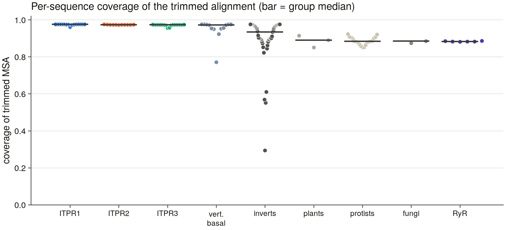
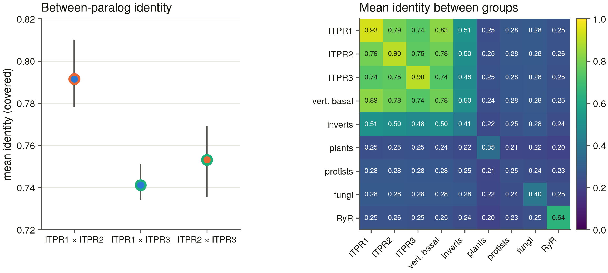

# S6 — the representative alignment (`msa_v2`)

*Generated by `scripts/s6_report.py` from the committed tables in `results/msa_v2/`. 134 representatives selected from 18,065 census v6 records.*

The publication-quality alignment every downstream result stands on: S7's tree and AU test, S9's codon alignment, S11's constraint mapping, S17's conservation. What it has to get right is not the aligner — it is **which sequences are in it**, because a representative set is a sampling decision the tree inherits as a topology.

## 1. The representative set

Chosen by the eight coded rules in `scripts/s6_rep_spec.py` (D8: per clade *and* per kingdom, explicit rules, never longest-per-species). Every chosen row carries the rule, the cell it filled, the runner-up it beat and which component of the quality key separated them — see `representatives.tsv`.

| rule | what it selects | n |
|---|---|---|
| R1 | the vertebrate paralog grid — clade band x ITPR1/2/3, two records in the three bands that dominate the vertebrate census, human forced in | 32 |
| R2 | the teleost 3R co-orthologs — `itprXa`/`itprXb` pairs, the family's only other documented duplication | 4 |
| R3 | the deep vertebrate grade, entered **unlabelled** — cyclostomes, chondrichthyans, the coelacanth grade | 13 |
| R4 | non-vertebrate metazoa, one per phylum and more in the four phyla that dominate that part of the census | 34 |
| R5 | non-metazoan eukaryotes, per group and phylum, gated on S20's per-record plant/fungal verdict | 18 |
| R6 | the copy-number expansions — S23 measured 0-18 copies outside the vertebrates, so the expanded genomes get more than one tip | 16 |
| R7 | the novel gene models no database annotates (`genome_only`) | 11 |
| R8 | the ryanodine-receptor outgroup, which roots the tree | 6 |

Composition by group:

| group | n | median length (aa) |
|---|---|---|
| ITPR1 | 15 | 2,743 |
| ITPR2 | 11 | 2,701 |
| ITPR3 | 18 | 2,670 |
| vertebrate_basal | 13 | 2,710 |
| invert_metazoa | 47 | 2,718 |
| plant | 3 | 3,167 |
| protist | 19 | 2,801 |
| fungi | 2 | 2,599 |
| RYR | 6 | 5,127 |

Total 375,137 residues; longest 5,317 aa (a ryanodine receptor — the outgroup is ~5,000 aa against the family's ~2,700, which is why the alignment is mostly gap).

**One stated deviation from the brief.** The brief asks for "every novel model from S5/S23". There are 424 full-length `genome_only` models across the two sweeps; putting all of them in would triple the alignment, put it past the size where L-INS-i is affordable single-threaded, and — the real objection — fill the tree with vertebrate gene models, since 206 of the 241 vertebrate ones are Aves and Actinopteri. R7 instead takes one per (clade band, paralog cell) and one per non-vertebrate group, which is what the brief's requirement is *for*: that sequences no public database contains are in the tree, and that each clade and cell where they are the only evidence has one. The full set stays in census v4/v6 and is what S18's audit works from.

### 1.1 What actually decided each pick

The quality key is lexicographic, not a weighted sum, so the audit can name the component that chose the winner. Identity appears nowhere in it: S23 (**D29**) retired identity as a call gate for this family outside the vertebrates after finding it separates neither confirmed from contradicted loci (Youden J 0.70/0.71), and a selection rule stated in a statistic that does not separate the populations is not a rule.

| decided by | n |
|---|---|
| length_fit | 50 |
| is_bait | 28 |
| sole_candidate | 22 |
| protein_existence | 8 |
| profile_score | 8 |
| forced | 6 |
| complete_architecture | 6 |
| reviewed | 5 |
| profile_high | 1 |

The length-fit component scores a record against **its own group's median**, measured from the census's complete-architecture non-fragment ITPR records rather than typed:

| group | median length (aa) |
|---|---|
| Amoebozoa | 2,886 |
| Discoba | 2,853 |
| Eukaryota (other) | 2,669 |
| Fungi | 2,599 |
| Metazoa (non-vertebrate) | 2,770 |
| SAR | 2,978 |
| Vertebrata | 2,671 |
| Viridiplantae | 3,182 |

### 1.2 The slots the census could not fill

5 slots stayed empty, and each names the stage that lost it rather than blaming the census in general:

| rule | cell | wanted | filled | pool | why |
|---|---|---|---|---|---|
| R1 | `ITPR2@sarcopterygian_fish` | 1 | 0 | 1 | no record passes the length gate |
| R1 | `ITPR1@cyclostomata` | 1 | 0 | 0 | no census record |
| R1 | `ITPR2@cyclostomata` | 1 | 0 | 0 | no census record |
| R1 | `ITPR3@cyclostomata` | 1 | 0 | 0 | no census record |
| R3 | `basal@sarcopterygian_fish:Latimeria_chalumnae` | 3 | 1 | 1 | pool exhausted |

Each of those cells against what the census actually holds in that clade band, because three statements have to be told apart: no record at all, no record carrying an annotation label, and no record whose label is a paralog *assignment* rather than a bait attribution. Only the last two are results.

| cell | ITPR records | distinct loci | with any label | with a *usable* label | labels present |
|---|---|---|---|---|---|
| `ITPR1@cyclostomata` | 19 | 12 | 6 | 0 | ITPR1 |
| `ITPR2@cyclostomata` | 19 | 12 | 6 | 0 | ITPR1 |
| `ITPR2@sarcopterygian_fish` | 5 | 5 | 4 | 3 | ITPR1, ITPR2, ITPR3 |
| `ITPR3@cyclostomata` | 19 | 12 | 6 | 0 | ITPR1 |
| `basal@sarcopterygian_fish:Latimeria_chalumnae` | 5 | 5 | 4 | 3 | ITPR1, ITPR2, ITPR3 |

**The cyclostome rows are a result.** That band holds 19 ITPR records over 12 distinct loci; 6 carry a paralog label of any kind (only ITPR1, and only from s5_cell), and 0 carry one this task will use. The sea lamprey and the hagfishes each carry **three** ITPR loci, and the sweep's ITPR1 bait wins every one of them — a constant attribution, which is no information about which locus is which. R3 therefore takes the complete copy set of two cyclostome species unlabelled, which is the honest input to S7: whether those three are 1:1 orthologs of ITPR1/2/3 or a lineage-specific expansion is the 2R question, and a set carrying one lamprey tip could not answer it.

4 representatives entered under the architecture-exception floor (below the family's 2,000 aa band but at or above 1,200 aa), because their clade's only records are short and a clade with no tip cannot carry the range claim S20/S23 made about it:

- `invert_metazoa_Bugula_neritina_Brown_bryozoan_Sertula_A0A7J7J401`
- `invert_metazoa_Intoshia_linei_GCA_001642005.1_copy1_548`
- `invert_metazoa_Neoechinorhynchus_agilis_GCA_051530055.1_copy1_5945861`
- `invert_metazoa_Tubiluchus_corallicola_GCA_030141605.1_copy1_290621`

## 2. The alignment

- Aligner: **MAFFT L-INS-i** (v7.526 (2024/Apr/26)) — n=134 <= 200, the brief's L-INS-i applies.
- Command: `mafft --localpair --maxiterate 1000 --thread 1 --anysymbol /Users/george/claude_test/ip3r_genes/results/msa_v2/representatives.fasta`
- **Single-threaded, by decision (D24).** MAFFT L-INS-i at `--thread -1` is not reproducible on this machine: S3 aligned the same 22 RyR seeds twice and got 8,510 and 8,468 columns, because the iterative refinement stage combines partial results in whatever order the threads finish. Everything downstream of this file is built from it, so it is pinned to one thread and the SHA-256 of input and output are recorded.
- Runtime: 61.2 min (3,671 s).
- Result: **11,777 columns**, 76.23 % gaps, 134 sequences.
- `sha256(representatives.fasta)` = `1bb3f87482e83c2e…`; `sha256(aln.fasta)` = `d5418b8e222c3a20…`.

The alignment is checked for raggedness before anything reads it. S1 established that a silent MAFFT failure does not error — it degrades to a star alignment with no other symptom — so unequal row lengths are a hard failure here rather than a warning.

## 3. Trimming

- trimAl v1.5.rev1 build[2025-11-25]
- Command: `trimal -in /Users/george/claude_test/ip3r_genes/results/msa_v2/aln.fasta -out /Users/george/claude_test/ip3r_genes/results/msa_v2/trimmed.fasta -automated1` (0.6 s)
- **1,797 of 11,777 columns kept (15.3 %)**, 7.68 % gaps after trimming.

`-automated1` is trimAl's own heuristic for a phylogeny-bound alignment; the choice is recorded rather than tuned, because a trimming threshold picked by looking at the resulting tree is a threshold fitted to the answer.

## 4. What the alignment shows

### 4.1 The family separation the whole project rests on (D14)

The ryanodine receptors are in this alignment on purpose — they root the tree — and D14 says their separation from ITPR is a positive test at every stage, never an assumption. Measured here under the same covered-only identity metric S1 used, against what S1 measured:

| quantity | this alignment | S1 prior | Δ |
|---|---|---|---|
| mean identity within a vertebrate paralog group | **0.910** | 0.828 | +0.082 |
| mean identity, each paralog group to the RyR outgroup | **0.253** | 0.249 | +0.004 |
| **the separation between them** | **0.656** | 0.579 | +0.077 |

Verdict on the separation: **confirmed** (tolerance 0.15).

Prior source: S1, the same 25 positives to their nearest labelled ITPR bait; S1 `benchmark_controls/bait_margin.tsv`, mean covered-only identity of the 25 ITPR positives to their nearest labelled RyR bait (the same metric this table uses).

The two estimators are not identical and are not expected to agree to three decimals: S1 scored each of 31 control-panel sequences against its *nearest* bait on a pairwise alignment, and this table averages **all** pairs of a 134-sequence trimmed MSA. So the comparison is made on the separation, which is what every later stage actually depends on, rather than on either absolute value.

The separation is 0.656 identity units. That is the margin every stage of this project has had to work inside, and it is why the length band is support and never the call: a 5,000 aa RyR and a 2,700 aa ITPR are 25% identical over the columns they share, which is not far enough apart to trust a heuristic with.

### 4.2 The sister question — a preview, not an answer

Prior: the review (§7.4): which two of the three vertebrate paralogues are sisters *is not fixed by any published, support-annotated ML analysis with an RyR outgroup*.

This alignment can rank the three between-paralog identities. That is not a phylogenetic estimate — it ignores the outgroup, the rate variation and the branch lengths S7's model fits — so it is reported as a preview with the ranking's own margin, and **S7's AU test over the three rooted topologies is the answer**.

| pair | mean identity (covered) | interquartile range | n pairs |
|---|---|---|---|
| ITPR1 × ITPR2 | 0.791 | 0.779 – 0.810 | 165 |
| ITPR2 × ITPR3 | 0.753 | 0.736 – 0.769 | 198 |
| ITPR1 × ITPR3 | 0.741 | 0.735 – 0.751 | 270 |

**ITPR1 × ITPR2 leads by 0.038** over ITPR2 × ITPR3.

The leading pair's interquartile range (0.779 – 0.810) does not overlap either other pair's (highest upper quartile 0.769), so the ranking is not an artefact of a few close pairs — it holds across the middle half of every comparison. It is still not a phylogenetic estimate.

The margin is large enough to be worth carrying into S7 as a hypothesis to test, and small enough that the AU test is what settles it.

### 4.3 The cyclostome trio, previewed

Every cyclostome in this set carries three ITPR loci, and the sweep's ITPR1 bait won all of them (§1.2), so nothing before now could say which locus is which. The alignment can at least ask the question: is each locus closest to a *different* vertebrate paralog — what 1:1 orthology from 2R would look like — or are they all equidistant, which is what a cyclostome-specific expansion would look like?

| locus | ITPR1 | ITPR2 | ITPR3 | nearest | margin over 2nd |
|---|---|---|---|---|---|
| `Myxine glutinosa` NC_136272.1:86116883-8 | 0.732 | 0.718 | 0.684 | **ITPR1** | +0.014 |
| `Myxine glutinosa` NC_136264.1:122839381- | 0.779 | 0.741 | 0.708 | **ITPR1** | +0.038 |
| `Myxine glutinosa` NC_136261.1:297520938- | 0.790 | 0.751 | 0.709 | **ITPR1** | +0.039 |
| `Petromyzon marinus` A0AAJ7U4X1 | 0.849 | 0.783 | 0.733 | **ITPR1** | +0.066 |
| `Petromyzon marinus` A0ACM8BRT5 | 0.821 | 0.777 | 0.730 | **ITPR1** | +0.044 |
| `Petromyzon marinus` A0ACM8C056 | 0.777 | 0.746 | 0.715 | **ITPR1** | +0.031 |

All 6 loci fall nearest the same group (ITPR1). On identity alone the three copies are not separable into ITPR1/2/3, which is what a lineage-specific expansion looks like — and equally what three fast-evolving 1:1 orthologs would look like at this depth. **S7's tree and S8's synteny are what distinguish them**; this table says only that the easy answer is not available.

**The control that table needs.** Leaning towards one paralog could be a fact about the cyclostomes or a fact about the metric — ITPR1 may simply be the slowest-evolving of the three, in which case everything deep is nearest it. The same statistic over the groups that are certainly *not* vertebrate paralogs says what no signal looks like here:

| group | n | nearest paralog | median margin |
|---|---|---|---|
| invert_metazoa | 47 | ITPR1 30, ITPR2 11, ITPR3 6 | 0.008 |
| protist | 19 | ITPR1 10, ITPR2 6, ITPR3 3 | 0.002 |
| RYR | 6 | ITPR2 5, ITPR1 1 | 0.002 |
| **cyclostome loci** | 6 | ITPR1 6 | **0.039** |

The non-vertebrate groups do lean towards ITPR1 more often than chance, but at a median margin of 0.008 — no signal. The cyclostome margin is 5× that. So the lean is a fact about these loci and not an artefact of ITPR1 being the conserved paralog: **the three cyclostome copies are genuinely closer to ITPR1 than to ITPR2 or ITPR3**. That is what a cyclostome-specific expansion from an ITPR1-like ancestor would produce; it is also what 1:1 orthologs would produce if ITPR2 and ITPR3 diverged after the cyclostome split. S7 separates those; S6 can only say the signal is real.

### 4.4 How much of the trimmed alignment each tip actually carries

Median coverage **0.96**; 1 of 134 tips cover less than half the trimmed alignment. A tip below half is not wrong, but it contributes gaps to every column the tree is inferred from, so it is named here rather than left inside a median.

| group | n | median coverage | lowest |
|---|---|---|---|
| ITPR1 | 15 | 0.98 | 0.96 |
| ITPR2 | 11 | 0.97 | 0.97 |
| ITPR3 | 18 | 0.97 | 0.96 |
| vertebrate_basal | 13 | 0.97 | 0.77 |
| invert_metazoa | 47 | 0.93 | 0.29 |
| plant | 3 | 0.89 | 0.85 |
| protist | 19 | 0.88 | 0.85 |
| fungi | 2 | 0.88 | 0.87 |
| RYR | 6 | 0.88 | 0.88 |

Lowest eight tips:

| tip | group | coverage |
|---|---|---|
| `invert_metazoa_Neoechinorhynchus_agilis_GCA_051530055.1_copy1_5945861` | invert_metazoa | 0.29 |
| `invert_metazoa_Intoshia_linei_GCA_001642005.1_copy1_548` | invert_metazoa | 0.55 |
| `invert_metazoa_Bugula_neritina_Brown_bryozoan_Sertula_A0A7J7J401` | invert_metazoa | 0.57 |
| `invert_metazoa_Tubiluchus_corallicola_GCA_030141605.1_copy1_290621` | invert_metazoa | 0.61 |
| `vertebrate_basal_Chiloscyllium_punctatum_Brownbanded_ba_A0A401RNU3` | vertebrate_basal | 0.77 |
| `invert_metazoa_Dysidea_avara_GCF_963678975.1_copy6_5305343` | invert_metazoa | 0.82 |
| `invert_metazoa_Dysidea_avara_GCF_963678975.1_copy2_7972063` | invert_metazoa | 0.84 |
| `protist_Aureococcus_anophagefferens_GCF_000186865.1_copy2_139898` | protist | 0.85 |

### 4.5 Why both identity matrices are committed

`identity_covered.tsv` scores identity over mutually covered columns only; `identity_classic.tsv` counts a gap as a mismatch. For a set that deliberately contains fragments and a ~5,000 aa outgroup, those are different measurements, and the difference is not small. The largest divergences:

| pair | covered | classic | Δ |
|---|---|---|---|
| `invert_metazoa_Epiperipatus_broadwayi_GCA_028023455.1_copy1_8600421` × `invert_metazoa_Neoechinorhynchus_agilis_GCA_051530055.1_copy1_5945861` | 0.61 | 0.16 | +0.44 |
| `invert_metazoa_Branchiostoma_lanceolatum_Common_lance_A0A8K0A0Y4` × `invert_metazoa_Neoechinorhynchus_agilis_GCA_051530055.1_copy1_5945861` | 0.61 | 0.19 | +0.43 |
| `invert_metazoa_Neoechinorhynchus_agilis_GCA_051530055.1_copy1_5945861` × `invert_metazoa_Tubiluchus_corallicola_GCA_030141605.1_copy1_290621` | 0.57 | 0.14 | +0.43 |
| `invert_metazoa_Lingula_anatina_Brachiopod_Lingula_ung_A0A1S3JYY5` × `invert_metazoa_Neoechinorhynchus_agilis_GCA_051530055.1_copy1_5945861` | 0.59 | 0.16 | +0.43 |
| `invert_metazoa_Littorina_saxatilis_A0AAN9BAK1` × `invert_metazoa_Neoechinorhynchus_agilis_GCA_051530055.1_copy1_5945861` | 0.60 | 0.18 | +0.42 |
| `invert_metazoa_Neoechinorhynchus_agilis_GCA_051530055.1_copy1_5945861` × `invert_metazoa_Patiria_pectinifera_Starfish_Asterina__Q8WSR4` | 0.60 | 0.18 | +0.42 |
| `invert_metazoa_Araneus_ventricosus_Orbweaver_spider_E_A0A4Y2F2N2` × `invert_metazoa_Neoechinorhynchus_agilis_GCA_051530055.1_copy1_5945861` | 0.60 | 0.18 | +0.42 |
| `invert_metazoa_Brachionus_calyciflorus_A0A813MP72` × `invert_metazoa_Neoechinorhynchus_agilis_GCA_051530055.1_copy1_5945861` | 0.60 | 0.18 | +0.42 |

Every identity quoted in this report is the covered-only one. The classic matrix is committed beside it so a later task can see what a gap-counting metric would have said instead.

### 4.6 Where the family is conserved

Over the 1,797 trimmed columns, mean conservation **0.552**, with **83 columns (4.6 %) at or above 0.9** — invariant or nearly so across an alignment that spans vertebrates, invertebrates, plants, protists, fungi and the sister family.

Conservation here is 1 − normalised Shannon entropy over the column, **counting a gap as a character** (`src/analysis/evolution.py`). On a trimmed alignment that is the right convention — a column half of the tips do not have is less conserved across the family, not more — but it means the profile is not comparable to one computed over residues only.

`figures/msa_conservation.png` maps human ITPR1's Pfam architecture onto this profile **through the alignment** — the domain bands are drawn where the alignment put those residues, by walking the human row and counting ungapped positions, not by scaling residue coordinates onto column coordinates.

### 4.7 What is left for the tree to work with

trimAl `-automated1` is a heuristic, and a percentage of columns kept says nothing about whether the *informative* ones survived. Counted on the trimmed alignment, by the same definition IQ-TREE reports (a column is parsimony-informative when at least two residues each appear at least twice):

| column class | n | % of trimmed |
|---|---|---|
| constant | 22 | 1.2 % |
| variable uninformative | 36 | 2.0 % |
| parsimony informative | 1,739 | 96.8 % |
| all gap or X | 0 | 0.0 % |

**96.8 % of the trimmed alignment is parsimony-informative** — 1,739 columns. That is the number S7's support values are estimated from, and the number to quote if a node's bootstrap is questioned.

## 5. Caveats

- **The paralog label on a non-vertebrate tip is annotation transfer, not descent.** ITPR1/2/3 are a 2R product. Four representatives outside the vertebrates carry a type number in their UniProt gene symbol or protein name; the audit table keeps that in `paralog` with `paralog_source`, and the figure group is the taxonomic grade regardless. Colouring such a tip as a vertebrate paralog would assert the thing S7 is being run to test.
- **A novel model's group is its bait's hypothesis, not a result.** The R7 tips are loci no database annotates; their ITPR1/2/3 group comes from which bait won them in the S5 sweep, recorded as `paralog_source = s5_cell`. Where that attribution is constant across a clade's loci it is not used at all (the cyclostome grade, §1.2). Where it is used, the tree is what tests it — that is the question those tips are in the alignment to ask.
- **Coverage is not evidence of quality.** A short tip covers less of the alignment; that is what short means. Whether a short tip is a real short gene or a broken model is S15's question, not this one's.
- **The 3R pairs are in by rule, and they are a stress test.** Two teleost species contribute both `itprXa` and `itprXb`. If the tree does not recover them as sisters, the naming is wrong or the alignment is — either way S7 finds out rather than S6 assuming.
- **The RyR outgroup is six sequences against 120.** It roots the tree; it is not a sample of the ryanodine receptors, and no statement about RyR evolution can be read off this alignment.
- **4 tips are below the family's own length band**, admitted under the architecture-exception floor so their clade has a tip at all. They are listed in §1.2 and flagged `short_exception` in `representatives.tsv`.

## 6. Figures

*Pairwise identity over mutually covered columns, ordered by group. The block structure is the result: the three vertebrate paralogs are tight blocks, the non-vertebrate grade is not a block at all, and the RyR outgroup is a uniformly dark band against everything.*

*Per-column conservation of the trimmed alignment with human ITPR1's Pfam architecture mapped through the alignment onto it.*

*Per-sequence coverage of the trimmed alignment by group, bar at the group median — which tips are fragments and which groups they are in.*

*Left: mean between-paralog identity with its interquartile range, the alignment's preview of S7's sister question. Right: mean identity between every pair of groups.*

