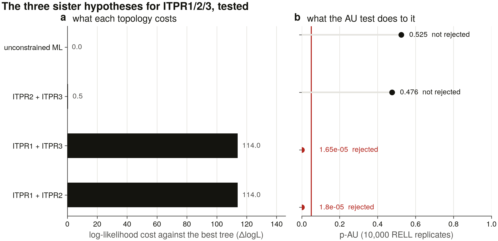
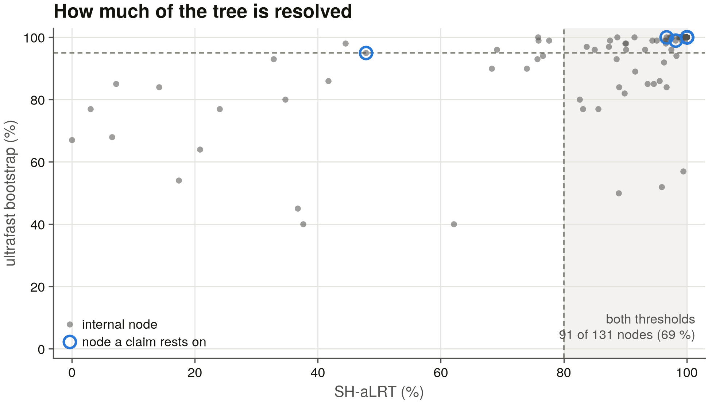
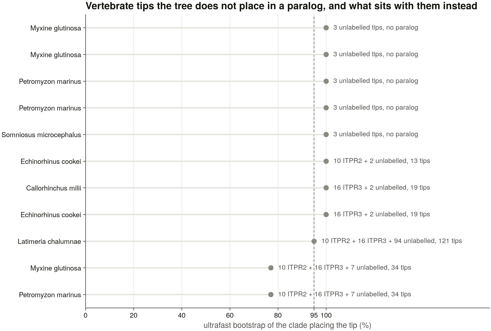

# S7 — the ML phylogeny of the ITPR family (134 tips, 1,797 columns)

*Generated by `scripts/s7_report.py` from the committed tables in `results/phylogeny/`. Nothing here is hand-written (D13): every number is read from a file this task wrote, and the verdicts are computed by comparing those numbers against the priors the earlier tasks recorded.*

## 1. What is in the tree

S6's trimmed alignment, unchanged: **134 sequences × 1,797 columns**, of which 1,739 are parsimony-informative. The ingroup is **128** ITPR records spanning vertebrates, invertebrates, protists, plants and fungi; the outgroup is **6** ryanodine receptors, the sister family that carries every ITPR-diagnostic Pfam domain (D14) and is therefore the only outgroup this family has that is close enough to align and distant enough to root.

| group (census label) | tips |
|---|---|
| ITPR1 | 15 |
| ITPR2 | 11 |
| ITPR3 | 18 |
| vertebrate_basal | 13 |
| invert_metazoa | 47 |
| protist | 19 |
| plant | 3 |
| fungi | 2 |
| RYR | 6 |

The three paralog labels are the census's, not the tree's. Whether they are clades at all is §4.1; §4.2 is what the task exists to answer.

## 2. The model, and why it was not chosen by `-m MFP`

The brief's command is `-m MFP` — ModelFinder's exhaustive scan. It was started, measured and abandoned, and the measurement is the reason:

| measurement | value |
|---|---|
| models scored before the stop | 11 of up to 1,232 |
| wall clock for those | 672 s at 8 threads |
| projected full scan | **~20.9 h** |

The cost is the free-rate models, and they are not optional on this alignment: `LG+R5` beats `LG+I+G4` by **682.3 BIC units** (433,050.5 against 433,732.9), so dropping `+R` to buy the time back would have returned a measurably worse model. The scan was replaced by a greedy two-stage selection, with both stages' tables committed to `model_selection.tsv`:

| stage | scanned | size | best by BIC |
|---|---|---|---|
| A — matrix | every matrix, rate fixed at `G4,I+G4` | 112 models over 28 matrices | **Q.insect+I+G4** |
| B — rate heterogeneity | `Q.insect` alone, every rate model | 20 models | **Q.insect+R7** |

Stage A picked `Q.insect` over `Q.yeast` by **614.6 BIC units**; stage B then bought a further **1,109.4** by changing only the rate model. The tree is built under **`Q.insect+R7`**.

**What this costs, stated rather than buried.** The matrix that wins under `+G4` need not be the matrix that would win under the final rate model. That is the bet a greedy two-stage selection makes, and the margin it was made on is in the table above rather than in a sentence — `model_selection.tsv` carries every model either stage scored, so how close the second-best matrix came is checkable rather than asserted.

## 3. The search

One IQ-TREE run, its command and its inputs' checksums recorded so a rebuild that drifts is visible in the data (D24, the discipline S6 applied to MAFFT):

|  |  |
|---|---|
| version | IQ-TREE multicore version 2.3.6 for MacOS ARM 64-bit built Jul 30 2024 |
| command | `iqtree2 -s /Users/george/claude_test/ip3r_genes/results/phylogeny/input.fasta --prefix /Users/george/claude_test/ip3r_genes/results/phylogeny/itpr_ml -m Q.insect+R7 -B 1000 -alrt 1000 -T 4 -seed 42` |
| threads | 4 — D24 — pinned; -T AUTO chooses from machine load and is not reproducible |
| seed | 42 |
| model | `Q.insect+R7` |
| log-likelihood | -215,451.998 |
| branch support | 1,000 SH-aLRT + 1,000 ultrafast bootstrap |
| runtime | 70.9 min |
| SHA-256 (alignment) | `7e7a9e0851dceb66…` |
| SHA-256 (treefile) | `0992b792fa382851…` |

Support is reported as **SH-aLRT / UFBoot** throughout, and a node counts as well supported only when it clears **both** of IQ-TREE's own thresholds — SH-aLRT ≥ 80 *and* UFBoot ≥ 95. One of the two alone is not enough: UFBoot is known to be optimistic under model violation, which is exactly the condition a 134-tip alignment spanning four kingdoms is in.

## 4. Rooting, and the control it doubles as

The tree is rooted on the **ryanodine receptors** (n=6), the outgroup the brief names. That choice is also a control on the whole alignment: the RyRs are the family this project has spent every stage separating from the ITPRs by a positive test (D14), and if they did not come back as a clade here, the alignment underneath every downstream result would be the thing to doubt.

They do. The 6 RyR tips are **monophyletic**, and the root is placed on the edge separating them from the ITPR ingroup. `rooted.nwk` is what the figure draws.

## 5. What the tree says

### 5.1 Are ITPR1, ITPR2 and ITPR3 clades at all?

Prior: **3 of 3** — assumed by every stage since S2: the architecture call assigns a paralog per record, S5's ledger has one cell per paralog per genome, and S6 built the representative grid on clade band × paralog.

The tree is asked first on the census's own labels, with nothing corrected. A group is monophyletic here if some edge of the *unrooted* tree separates exactly its tips.

| group | tips | monophyletic | SH-aLRT/UFBoot | largest pure clade | tips outside it |
|---|---|---|---|---|---|
| ITPR1 | 15 | no | — | 13 | 2 |
| ITPR2 | 11 | no | — | 10 | 1 |
| ITPR3 | 18 | no | — | 16 | 2 |
| vertebrate_basal | 13 | no | — | 4 | 9 |
| invert_metazoa | 47 | no | — | 18 | 29 |
| plant | 3 | no | — | 2 | 1 |
| protist | 19 | no | — | 5 | 14 |
| fungi | 2 | **yes** | 100/100 | 2 | 0 |
| RYR | 6 | **yes** | 100/100 | 6 | 0 |

**0 of 3** paralogs are monophyletic on the raw census labels — the prior is 3 of 3, so this is **contradicted**.

A label is not evidence, though, and a single mis-annotated tip breaks a clade of forty. The same question, asked after the tree's own corrections (§5.3, derived by coded rule in `s7_constraints.py`, never by hand):

| clade | tips | monophyletic | SH-aLRT/UFBoot |
|---|---|---|---|
| ITPR1 | 13 | **yes** | 47.8/95 |
| ITPR2 | 10 | **yes** | 96.7/100 |
| ITPR3 | 16 | **yes** | 98.2/99 |

**3 of 3** under tree-corrected membership. The difference between the two tables is the size of the family's naming problem, not a change in the tree.

### 5.2 The sister question — what the AU test answers

Prior: **ITPR1 + ITPR2**, from S6 §4.2 — mean covered-only identity over the trimmed MSA ranks ITPR1×ITPR2 at 0.788 against 0.746 and 0.736, a lead of 0.042 with non-overlapping interquartile ranges. S6 reported it as a preview and said the AU test was the answer.

Prior from the literature: **none**. the review §7.4 — which two of the three vertebrate paralogues are sisters is **not fixed by any published, support-annotated ML analysis with an RyR outgroup**.

Three rooted hypotheses, one per way of pairing the three paralogs, each realised as a constrained ML search under the same model and each making all three paralog clades monophyletic — so the test compares the sister arrangement and nothing else. Membership is tree-corrected and the correction is *derived*, not listed (§5.3): a constraint built from census labels asks the test about a topology the data rejects for reasons that have nothing to do with the sister question, and all three hypotheses then fail together.

The same trap has a second door, and this task walked into it. IQ-TREE's `-g` places freely exactly the taxa a constraint **omits**, so a tip that is listed — even in a top-level polytomy — is pinned outside every group the constraint declares. The first constraint files named all 134 tips and so forced the unlabelled vertebrate tips out of the paralog clades this tree nests them in, in all three hypotheses equally; the test rejected every one at ΔlogL ≈ 1,500, including the arrangement the ML tree itself holds at 100/100. Each constraint now names the three paralog cores and the outgroup and nothing else, and `s7_test_tree.py` T5 fails a constraint that names a free tip.

**The unconstrained ML tree groups ITPR2 + ITPR3** at SH-aLRT 100 / UFBoot 100.

| tree | hypothesis | logL | ΔlogL | p-AU | p-KH | p-SH | verdict |
|---|---|---|---|---|---|---|---|
| ML | unconstrained ML tree | -215,453.545 | 0 | 0.525 | 0.508 | 1 | — |
| H1_12 | ITPR1 + ITPR2 sisters, ITPR3 outside | -215,567.563 | 114.02 | 1.8e-05 | 0 | 0.0002 | **rejected** |
| H2_13 | ITPR1 + ITPR3 sisters, ITPR2 outside | -215,567.528 | 113.98 | 1.65e-05 | 0 | 0.0002 | **rejected** |
| H3_23 | ITPR2 + ITPR3 sisters, ITPR1 outside | -215,454.029 | 0.48399 | 0.476 | 0.492 | 0.696 | not rejected |

**2 of 3 sister arrangements are rejected** at p-AU < 0.05.

- rejected: ITPR1 + ITPR2 sisters, ITPR3 outside (ΔlogL 114.02, p-AU 1.8e-05); ITPR1 + ITPR3 sisters, ITPR2 outside (ΔlogL 113.98, p-AU 1.65e-05)
- not rejected: ITPR2 + ITPR3 sisters, ITPR1 outside (ΔlogL 0.48399, p-AU 0.476)

**One arrangement survives: ITPR2 + ITPR3 sisters, ITPR1 outside.** The other two are outside the 95 % confidence set of topologies for this alignment. S6's identity preview predicted **ITPR1 + ITPR2** and the test returns **ITPR2 + ITPR3** — the prior is **contradicted**.

This is the answer the brief asks for, and it is one the literature did not have: the review's §7.4 audit found no published, support-annotated ML analysis with an RyR outgroup that fixes the pair.

What each paralog clade's sister actually is on the rooted ML tree, composition and all:

| paralog | sister is a clade | tips in sister | sister composition | majority |
|---|---|---|---|---|
| ITPR1 | yes | 2 | ITPR1:1;vertebrate_basal:1 | ITPR1 |
| ITPR2 | yes | 3 | vertebrate_basal:2;ITPR2:1 | vertebrate_basal |
| ITPR3 | yes | 3 | ITPR3:2;vertebrate_basal:1 | ITPR3 |

### 5.3 The tips whose census label the tree overturns

Three rules, each a positive test, each recording the number it fired on (`s7_constraints.py`, `membership_audit.tsv`): a tip inside its own group's largest pure clade keeps its label (`core`); a tip outside it whose smallest containing clade holds at least three members of exactly one *other* paralog, at a node clearing SH-aLRT ≥ 80 **and** UFBoot ≥ 95, is moved there (`reassigned`); anything else is left out of all three constraint sets (`unconstrained`) rather than assumed either way.

| rule | tips |
|---|---|
| `core` — label and tree agree | 39 |
| `reassigned` — tree overrules the label | 0 |
| `unconstrained` — tree cannot place it | 5 |

Every tip in the last two rows, with what put it there:

| tip | census label | rule | tree places it with | clade size | SH-aLRT/UFBoot | why |
|---|---|---|---|---|---|---|
| `ITPR1_Latimeria_chalumnae_Coelacanth_H3A1P5` | ITPR1 | unconstrained | — | 121 | 47.8/95.0 | nearest neighbourhood is mixed (ITPR2:10;ITPR3:16;unlabelled:94) |
| `ITPR1_Somniosus_microcephalus_GCF_052327205.1_ITPR1_` | ITPR1 | unconstrained | — | 4 | 99.3/100.0 | nearest neighbourhood is mixed (unlabelled:3) |
| `ITPR2_Echinorhinus_cookei_GCA_057876775.1_ITPR2_1728` | ITPR2 | unconstrained | — | 13 | 100.0/100.0 | nearest neighbourhood is mixed (ITPR2:10;unlabelled:2) |
| `ITPR3_Callorhinchus_milii_Ghost_shark_A0A4W3GWE7` | ITPR3 | unconstrained | — | 19 | 100.0/100.0 | nearest neighbourhood is mixed (ITPR3:16;unlabelled:2) |
| `ITPR3_Echinorhinus_cookei_GCA_057876775.1_ITPR3_4607` | ITPR3 | unconstrained | — | 19 | 100.0/100.0 | nearest neighbourhood is mixed (ITPR3:16;unlabelled:2) |

**Each naming call the tree contradicts is settled independently by reciprocal best hits** — the candidate against the human reference proteome, then that human protein back against the candidate's own species. RBH knows nothing about this alignment, this model or this tree:

| tip | census label | tree rule | forward best hit | reciprocal | RBH call | RBH upholds |
|---|---|---|---|---|---|---|
| `ITPR1_Latimeria_chalumnae_Coelacanth_H3A` | ITPR1 | unconstrained | sp\|Q14643\|ITPR1_HUMAN Inositol 1,4,5-trisphosphate-gated cal | yes | confirmed | yes (the census name) |
| `ITPR1_Somniosus_microcephalus_GCF_052327` | ITPR1 | unconstrained | sp\|Q14643\|ITPR1_HUMAN Inositol 1,4,5-trisphosphate-gated cal | — | forward_only | yes (the census name) |
| `ITPR2_Echinorhinus_cookei_GCA_057876775.` | ITPR2 | unconstrained | sp\|Q14571\|ITPR2_HUMAN Inositol 1,4,5-trisphosphate-gated cal | — | forward_only | yes (the census name) |
| `ITPR3_Callorhinchus_milii_Ghost_shark_A0` | ITPR3 | unconstrained | sp\|Q14573\|ITPR3_HUMAN Inositol 1,4,5-trisphosphate-gated cal | yes | confirmed | yes (the census name) |
| `ITPR3_Echinorhinus_cookei_GCA_057876775.` | ITPR3 | unconstrained | sp\|Q14573\|ITPR3_HUMAN Inositol 1,4,5-trisphosphate-gated cal | — | forward_only | yes (the census name) |

**5 of 5** disputed tips are upheld by RBH. For 5 of them the tree offered no alternative placement, only a refusal to place the tip, so what RBH upholds there is the **census name** — the record is correctly named and the conflict is this tree's own uncertainty about where to hang it, not an annotation error.

### 5.4 The cyclostome trio — expansion, or three 1:1 orthologs?

Prior: **all six loci nearest ITPR1** — S6 §4.3 — all 6 cyclostome loci fall nearest ITPR1 on covered identity, which is equally what a lineage-specific expansion and three fast-evolving 1:1 orthologs look like. S6 said the tree distinguishes them.

The tree can separate the two readings that identity could not. Three 1:1 orthologs from 2R put each locus *inside* a different paralog clade; a lineage-specific expansion puts all of them together, outside all three. A third arrangement — several cyclostome-only clades, each holding both species — is neither, and is what the maximal pure-cyclostome pieces below test for.

| locus | species | tree places it with | clade size | what else is in that clade | SH-aLRT/UFBoot |
|---|---|---|---|---|---|
| `_964187855.1_ITPR1_122839381` | Myxine glutinosa | — | 4 | unlabelled:3 | 99.5/100 |
| `_964187855.1_ITPR1_297520938` | Myxine glutinosa | — | 4 | unlabelled:3 | 99.5/100 |
| `F_964187855.1_ITPR1_86116883` | Myxine glutinosa | — | 34 | ITPR2:10;ITPR3:16;unlabelled:7 | 83.1/77 |
| `rinus_Sea_lamprey_A0AAJ7U4X1` | Petromyzon marinus | — | 4 | unlabelled:3 | 99.5/100 |
| `rinus_Sea_lamprey_A0ACM8BRT5` | Petromyzon marinus | — | 4 | unlabelled:3 | 99.5/100 |
| `rinus_Sea_lamprey_A0ACM8C056` | Petromyzon marinus | — | 34 | ITPR2:10;ITPR3:16;unlabelled:7 | 83.1/77 |

**Every one of the 6 loci sits in a cyclostome-only clade** — 2 of them, each well supported, and 2 holding *both* hagfish and lamprey. So the loci are neither one expansion nor three 1:1 ohnologs: they are **2 anciently separate cyclostome lineages**, and a clade spanning the two species is a duplication older than the hagfish/lamprey split rather than a copy either genome made on its own. The prior — every locus nearest ITPR1 — is **contradicted as a reading**: identity ranked all six against the same paralog because it can only measure distance to the labelled clades, and these loci are outside all of them. Which side of the vertebrate duplication each lineage attaches to is the next table, and S8's synteny is what would settle it *(pending: S8)*.

Per species, in case the expansion is not shared:

| set | loci | form a clade | SH-aLRT/UFBoot |
|---|---|---|---|
| all cyclostome loci | 6 | no | — |
| Myxine glutinosa | 3 | no | — |
| Petromyzon marinus | 3 | no | — |
| cyclostome-only clade, 2 species | 4 | **yes** | 99.5/100 |
| cyclostome-only clade, 2 species | 2 | **yes** | 100/100 |

### 5.5 S6's stress test: the same species, the same paralog, twice

Prior: **sisters** — S6 §1 — the teleost 3R co-orthologs are in the representative set by rule and are a stress test: if the tree does not recover a species' two same-paralog copies as sisters, the naming is wrong or the alignment is.

| paralog | species | copies | sisters on the tree | SH-aLRT/UFBoot | smallest clade holding them all | what else is in it |
|---|---|---|---|---|---|---|
| ITPR1 | Chanos chanos | 2 | no | — | 6 | ITPR1:4 |
| ITPR1 | Danio rerio | 3 | no | — | 6 | ITPR1:3 |

**0 of 2** same-species same-paralog sets come back as clades — against the prior, that reads **contradicted**.

But 2 of the 2 that do not are broken **only by other tips of the same paralog**: the copies sit in a small 6-tip clade made entirely of that paralog, with each copy nearer another species' copy than its own genome's. That is what a duplication *older than the species* looks like, and the teleost 3R is exactly that — so for these the prior was the wrong expectation rather than the tree the wrong answer. S6 put them in as a stress test on the naming; the naming passes, and what fails is the assumption that co-orthologs of a shared duplication should be sisters.

### 5.6 How much of this tree is actually resolved

The support summary is not decoration: a sister question answered on a tree whose deep nodes are unsupported is not answered. This is the whole tree, every internal node:

| statistic | value |
|---|---|
| internal nodes | 131 |
| UFBoot >= 95 | 97 |
| SH-aLRT >= 80 | 107 |
| both thresholds | 91 |
| pct both | 70 |
| median UFBoot | 100 |
| median SH-aLRT | 99 |

**69.5 %** of internal nodes clear both thresholds. The tree is well resolved and the deep nodes the claims rest on are listed with their own support in `claim_nodes.tsv`.

Node by node, for every claim this task or a later one leans on:

| claim | tips | is a clade | SH-aLRT/UFBoot | well supported |
|---|---|---|---|---|
| ITPR1 core clade | 13 | yes | 47.8/95 | no |
| ITPR2 core clade | 10 | yes | 96.7/100 | **yes** |
| ITPR3 core clade | 16 | yes | 98.2/99 | **yes** |
| ITPR1 clade incl. unlabelled tips | 19 | yes | 100/100 | **yes** |
| ITPR2 clade incl. unlabelled tips | 13 | yes | 100/100 | **yes** |
| ITPR3 clade incl. unlabelled tips | 19 | yes | 100/100 | **yes** |
| ITPR1 + ITPR2 | 32 | no | — | no |
| ITPR1 + ITPR3 | 38 | no | — | no |
| ITPR2 + ITPR3 | 32 | yes | 100/100 | **yes** |
| all three paralogs | 51 | no | — | no |
| vertebrate ITPRs (incl. unassigned) | 57 | yes | 100/100 | **yes** |
| ITPR family (all non-RyR) | 128 | yes | 100/100 | **yes** |
| RyR outgroup | 6 | yes | 100/100 | **yes** |

### 5.7 The `--bnni` check on the supports

UFBoot is optimistic when the model is violated, and a 134-tip alignment spanning four kingdoms violates any single substitution model by construction. `--bnni` is UFBoot's own guard: an extra round of NNI optimisation on every bootstrap tree, which strips support that came from the model rather than from the data. It is a **check, not a second answer** — the reported tree is still the main search's — so what is asked here is whether the claims that tree carries survive the guard, on the same clade sets, read from `claim_members.tsv`.

The check ran under the same model (`Q.insect+R7`), the same seed (42) and the same pinned thread count (4), for 169.5 min, at log-likelihood -215,451.249 against the main search's -215,451.998.

| claim | tips | main SH-aLRT/UFBoot | `--bnni` SH-aLRT/UFBoot | verdict |
|---|---|---|---|---|
| ITPR1 core clade | 13 | 47.8/95 | 47.5/73 | unsupported in both |
| ITPR2 core clade | 10 | 96.7/100 | 96.7/98 | held |
| ITPR3 core clade | 16 | 98.2/99 | 98.2/97 | held |
| ITPR1 clade incl. unlabelled tips | 19 | 100/100 | 100/100 | held |
| ITPR2 clade incl. unlabelled tips | 13 | 100/100 | 100/100 | held |
| ITPR3 clade incl. unlabelled tips | 19 | 100/100 | 100/100 | held |
| ITPR1 + ITPR2 | 32 | —/— | —/— | not a clade in the main tree |
| ITPR1 + ITPR3 | 38 | —/— | —/— | not a clade in the main tree |
| ITPR2 + ITPR3 | 32 | 100/100 | 100/100 | held |
| all three paralogs | 51 | —/— | —/— | not a clade in the main tree |
| vertebrate ITPRs (incl. unassigned) | 57 | 100/100 | 100/100 | held |
| ITPR family (all non-RyR) | 128 | 100/100 | 100/100 | held |
| RyR outgroup | 6 | 100/100 | 100/100 | held |

**No claim is weakened or lost by the guard**: 9 of 10 clear both thresholds in the `--bnni` tree as well, so the supports this task leans on are not an artefact of the model.

The remaining 1 was **not well supported in the main tree either**, so `--bnni` took nothing away — it was already outside what this report treats as trustworthy, and it is listed here rather than folded into the count: **ITPR1 core clade** (47.8/95 in the reported tree, 47.5/73 under `--bnni`). The guard does move it further down, which is the honest reading: that clade is the census's labelled set taken bare, and the tree prefers a slightly different grouping (§5.1).

### 5.8 Is the reported tree the best tree found?

Yes. No constrained search reached a higher likelihood than the unconstrained one, so the tree every table and figure here is built from is the best of the four searched.

### 5.9 Caveats

- **The model selection is greedy** (§2). The exchangeability matrix was chosen under `+G4`/`+I+G4` and the rate model then chosen on that matrix alone; the exhaustive scan was measured at ~20.9 h and abandoned. Both stages' tables are committed.
- **One alignment, one tree.** Every statement here is conditional on S6's 134-tip representative set and its trimAl columns. The representative rules are audited in `representatives.tsv` and the trimming is reproducible from `align_stats.json`, but a different taxon sample can move a deep node.
- **UFBoot is optimistic under model violation**, which a four-kingdom alignment is guaranteed to be in. That is why every 'well supported' call in this report requires SH-aLRT ≥ 80 as well, and why a `--bnni` re-run is reported beside the main one where it exists.
- **The paralog labels the tree corrects are corrected by rule, not by hand** — but the rule reads this tree. Where a correction changes a call that matters, the RBH test in §5.3 is the independent check.

### 5.10 Figures

*The rooted ML phylogeny. Branches in neutral ink; the three vertebrate paralog clades and the RyR outgroup boxed and coloured; a filled dot on every node clearing SH-aLRT ≥ 80 and UFBoot ≥ 95. No tip is ringed because the relabelling rule fires on none of them.*

*The three sister hypotheses and what the AU test does to them: constrained log-likelihood against the ML tree, with p-AU beside it and the 0.05 rejection line drawn.*

*How much of the tree is resolved — the joint distribution of SH-aLRT and UFBoot over every internal node, with the claim nodes marked.*

*The vertebrate tips the tree does not place in a paralog — the cyclostome loci and the disputed chondrichthyan and coelacanth records — each against the support of the smallest clade that holds it, annotated with what else is in that clade. None of them resolves inside a single paralog: the cyclostome loci sit with each other and the rest in mixed neighbourhoods.*

