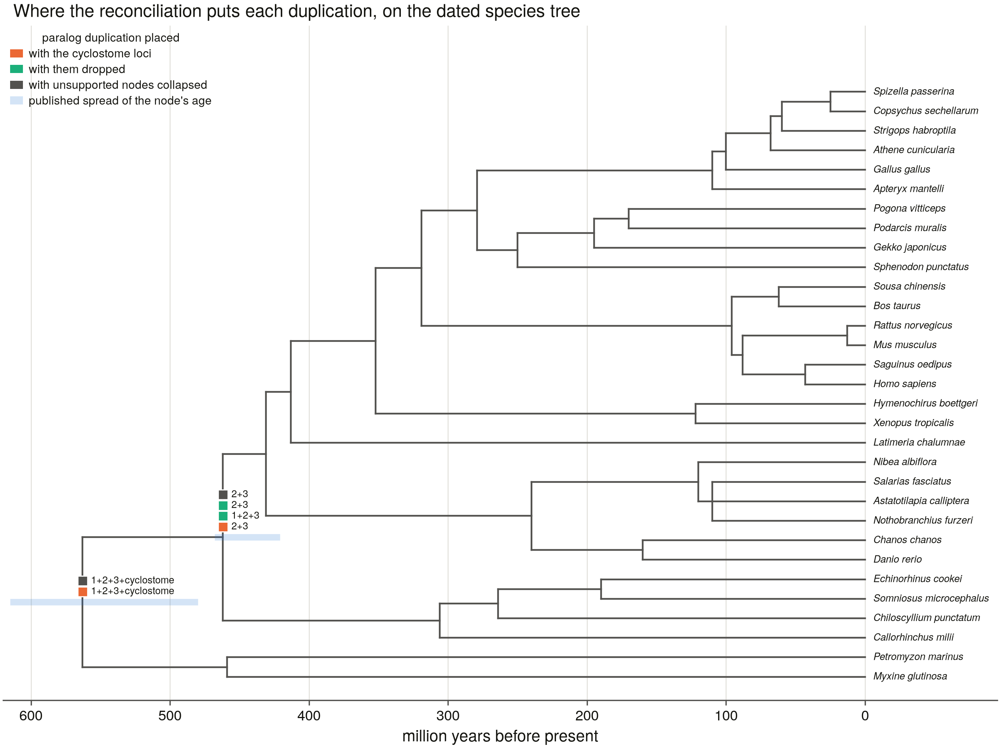
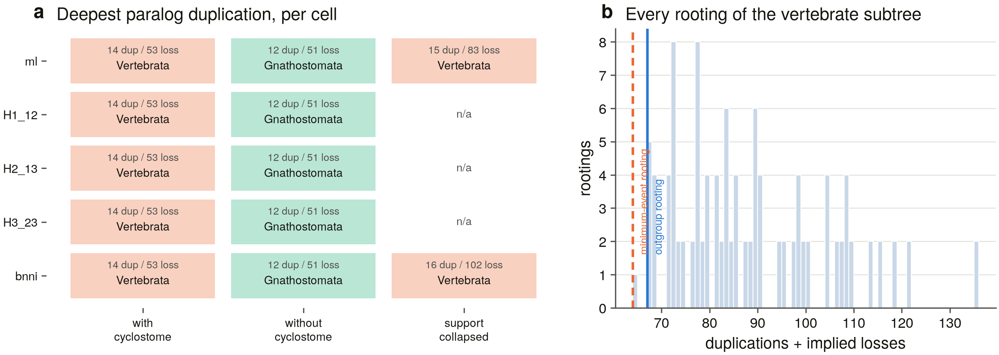
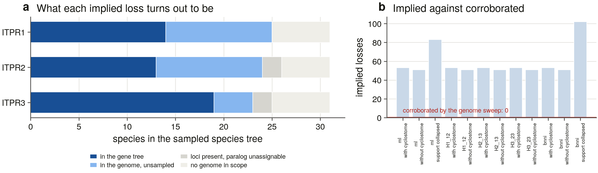
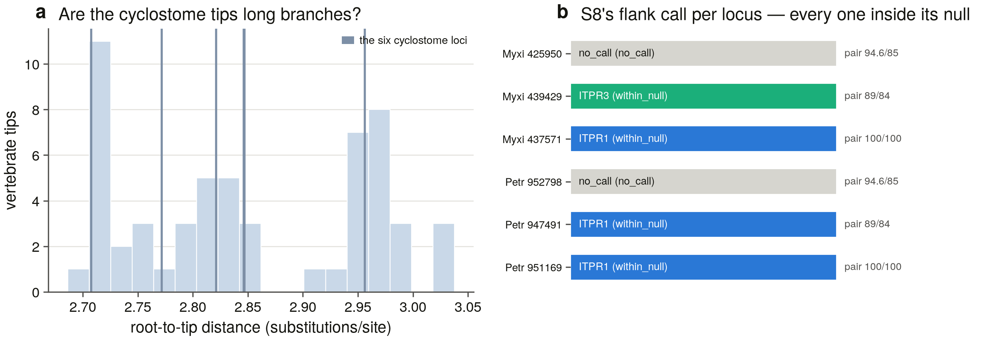

# S13 — where the duplications that made ITPR1/2/3 sit on the vertebrate tree (31 species, 12 reconciliations)

*Generated by `scripts/s13_report.py` from the committed tables in `results/reconciliation/`. Nothing here is hand-written (D13): every number is read from a file this task wrote, and the verdicts are computed by comparing those numbers against the priors the earlier tasks recorded.*

## 1. What this task can and cannot answer

Reconciliation gives a **placement**, not a date. S9 measured median pairwise dS *within* a single paralog set at 4.6-13.5, with 84.6-94.2 % of within-paralog pairs past the dS = 1.5 saturation bar — so no molecular clock this project can run would date a duplication that is older still. What a gene tree and a species tree can do together is say which **branch** of the species tree an event falls on; the endpoints of that branch then bracket it, and the bracket is as narrow as the literature's ages for those two nodes and no narrower.

Everything below is therefore stated as a placement with a bracket, and where the cells of the analysis disagree the disagreement is the result rather than something to average away.

## 2. The species tree is an input, not a result (D15)

A hand-curated topology for the **31 vertebrate species** the S6 representative set samples, with **29 named internal nodes**, every one carrying a literature age, the spread of published estimates and its source. It is validated before use: `python3 scripts/s13_species_tree.py --check` fails on a gene-tree species missing from the tree, on a species tree carrying a taxon with no gene-tree tip, on an uncalibrated node, on a point age outside its own spread, and on any age inversion.

**Two design choices worth stating.** Where published estimates do not resolve an arrangement — the ovalentarian percomorphs here — the node is left a **polytomy** rather than given a shape the sources do not carry; the non-binary reconciliation handles it (§3). And every node carries a **`stem_age_ma`** beside its crown age: the sampled tree omits every lineage this project did not sequence, so a node's parent *in this tree* is usually older than the split that created it. With no marsupial sampled, Boreoeutheria's parent here is Amniota, and a duplication mapped to Boreoeutheria would be bracketed [96, 319] Ma when the honest bracket is [96, 99]. `--check` requires `age <= stem_age <= parent age`.

The nodes every conclusion below rests on, as committed in `species_tree_calibrations.tsv`:

| node | crown age (Ma) | published spread | stem age (Ma) | species under it | source |
|---|---|---|---|---|---|
| **Vertebrata** | 563 | 480–615 | 615 | 31 | TT5 median 615 |
| **Cyclostomata** | 459 | 380–500 | 563 | 2 | TT5 median hagfish-lamprey |
| **Gnathostomata** | 462 | 421–468 | 563 | 29 | TT5 median 462 |
| **Chondrichthyes** | 306 | 190–421 | 462 | 4 | TT5 median (Holocephali-Elasmobranchii) |
| **Osteichthyes** | 431 | 421–453 | 462 | 25 | TT5 median 431 |
| **Sarcopterygii** | 413 | 390–425 | 431 | 19 | TT5 median (Actinistia-Tetrapodomorpha) |
| **Tetrapoda** | 352 | 330–370 | 413 | 18 | TT5 median |
| **Amniota** | 319 | 312–330 | 352 | 16 | TT5 median |

The deep backbone is uncontroversial and fully sampled — no lineage sits between Vertebrata and Gnathostomata, or between Gnathostomata and its two daughters, that this tree omits — so for exactly the nodes the answer uses, the sampled parent *is* the true sister split and the stem age costs nothing.

The shared deep calibrations are identical to the PIEZO project's curated table because both read the same published sources. That is a shared **input**, not a ported result.

## 3. The instrument

LCA reconciliation (Goodman et al. 1979; Page 1994), losses after Zmasek & Eddy 2001, implemented in the stdlib for the same reason S7 carries its own Newick code: the trees are small, the algorithm is exact and deterministic, and a hand-checkable implementation is worth more than a black box for a claim this load-bearing.

**The duplication test is the non-binary one, and that is not a detail.** The familiar rule — a node is a duplication when its species mapping equals a child's — is only valid on a *binary* tree. Under the support-collapsed variant the root of the vertebrate subtree becomes a four-way polytomy whose children map to Cyclostomata, Gnathostomata, Cyclostomata and Gnathostomata: no child maps to Vertebrata, so the binary rule reads it as a **speciation** and the collapse would have been reported as the duplications disappearing. The rule used is the standard generalisation (Vernot et al. 2008) — a duplication when a child maps to M(v) itself, or when two children land in the same child-subtree of M(v). `s13_test_recon.py` T2/T3 are the positive and negative halves of it.

**Tips are labelled by the tree, never by the census.** A tip's paralog is the S7 extended paralog clade that holds it, read out of S7's committed `paralog_clades.tsv` rather than re-derived (T14 fails if the sets differ in size from S7's), and a tip inside none of the three is `unplaced` — it is never assigned by a database name. Species keys go through `s6_lib.binomial`, because the census carries *Latimeria chalumnae* from the genome sweep and *Latimeria chalumnae (Coelacanth)* from UniProt and a raw-string key makes that two species (T9).

The analysis is a **matrix**, not a single tree: 5 topologies x 3 variants = 12 reconciliations run and 3 refused.

| topology | what it is |
|---|---|
| `ml` | unconstrained ML tree (the reported tree) |
| `H1_12` | ITPR1+ITPR2 sisters (AU-rejected, p 1.8e-05) |
| `H2_13` | ITPR1+ITPR3 sisters (AU-rejected, p 1.65e-05) |
| `H3_23` | ITPR2+ITPR3 sisters (not rejected, p 0.476) |
| `bnni` | the --bnni model-violation guard re-search |

| variant | what it removes |
|---|---|
| `with_cyclostome` | nothing — all 57 vertebrate tips |
| `without_cyclostome` | the six cyclostome loci, **actually pruned** rather than filtered out of a wanted set: a tip that is still in the tree still maps to a species and still counts (T5) |
| `support_collapsed` | every internal edge below S7's own bar (SH-aLRT ≥ 80 **and** UFBoot ≥ 95), dissolved into a polytomy |

The three constrained topologies refuse the `support_collapsed` variant, and the refusal is the point: a constrained IQ-TREE search writes **no support values**, so every node of such a tree reads as unsupported. The first run of this variant dissolved all three constrained trees into a single 134-tip polytomy and reported it as a collapse of 40 nodes. `collapse_unsupported` now refuses a tree carrying no support labels (T6) — grading an *unmeasured* support as a failing one is the same error `s7_bnni.py` refuses when it compares a constrained tree on topology alone.

## 4. The negative controls

`s13_test_recon.py` runs **14 groups of constructed controls** before anything is written (`s5_bait_screen.self_test()`'s pattern), and the driver refuses to write if any fails. Status: **passed**.

Every rule in a reconciliation returns a perfectly plausible number when it is wrong, so the controls are checks on **refusal** and on the cases that separate a correct rule from a rule that merely runs:

| control | what must happen |
|---|---|
| **T2/T3** | a polytomy whose children coexist in one ancestor is a duplication; one whose children occupy distinct subtrees is not |
| **T4** | `extract_clade` refuses a clade that also holds a tip outside the requested set |
| **T5** | pruning actually removes the tip and leaves no unary node |
| **T6** | the support collapse refuses a tree with no support labels |
| **T7** | the collapse takes exactly the nodes below the bar and leaves those above |
| **T8** | rerooting at every edge preserves every tip and leaves no unary node |
| **T9** | one species under two spellings maps to one species-tree tip |
| **T10** | each of the ten loss verdicts fires on its own case — including both halves of the rule that stops a bait-panel limit reading as a gene loss |
| **T11** | four hand-derived Zmasek & Eddy loss counts, because a factor-of-two error in that formula looks exactly like a real result |
| **T12** | the species-tree validator can *fail* — on a missing calibration, an age inversion and a stem age younger than its crown |
| **T13** | two reconciliations of identical input agree |
| **T14** | the paralog clade sets are the ones S7 committed |

Mutation-tested on three deliberate rule breakages — reverting to the binary duplication test, dropping the `paralog_unassignable` rule, and letting the collapse run on an unlabelled tree — all three caught.

`reconciliation_stats.json` records the parameters above, the self-test status and the SHA-256 of every committed table, so a rerun that drifts is visible in the data rather than only in a diff.

## 5. Where the duplications sit

### 5.1 The matrix, cell by cell

Every cell reports the same two numbers and the same answer: how many duplications the reconciliation implies, how many losses, and which species-tree node the **deepest paralog-spanning duplication** maps to.

| topology | variant | tips | collapsed | duplications | implied losses | deepest paralog duplication | its support in the gene tree |
|---|---|---|---|---|---|---|---|
| `ml` | with cyclostome | 57 | 0 | 14 | 53 | **Vertebrata** | 100/100 |
| `ml` | without cyclostome | 51 | 0 | 12 | 51 | **Gnathostomata** | 17.4/54 |
| `ml` | support collapsed | 57 | 40 | 15 | 83 | **Vertebrata** | 100/100 |
| `H1_12` | with cyclostome | 57 | 0 | 14 | 53 | **Vertebrata** | — |
| `H1_12` | without cyclostome | 51 | 0 | 12 | 51 | **Gnathostomata** | — |
| `H2_13` | with cyclostome | 57 | 0 | 14 | 53 | **Vertebrata** | — |
| `H2_13` | without cyclostome | 51 | 0 | 12 | 51 | **Gnathostomata** | — |
| `H3_23` | with cyclostome | 57 | 0 | 14 | 53 | **Vertebrata** | — |
| `H3_23` | without cyclostome | 51 | 0 | 12 | 51 | **Gnathostomata** | — |
| `bnni` | with cyclostome | 57 | 0 | 14 | 53 | **Vertebrata** | 100/100 |
| `bnni` | without cyclostome | 51 | 0 | 12 | 51 | **Gnathostomata** | 17.7/34 |
| `bnni` | support collapsed | 57 | 55 | 16 | 102 | **Vertebrata** | 100/100 |

**The topology does not move the answer.** All 5 gene-tree topologies — the ML tree, the three constrained sister arrangements the AU test scored, and the `--bnni` re-search — give identical duplication and loss counts within a variant, and the same deepest placement: Vertebrata with the cyclostome loci, Gnathostomata without them, Vertebrata with the unsupported nodes collapsed.

That is expected rather than surprising, and it is worth saying why: the three AU hypotheses differ only in how the three paralog clades are arranged relative to one another, and every arrangement puts all three inside the same vertebrate clade. What decides the *placement* is not their order but whether cyclostome loci sit among them — which is the second axis.

### 5.2 The two events, and their brackets

| variant | rank | maps to | paralogs below it | gene tips | bracket (Ma) | gene-node support |
|---|---|---|---|---|---|---|
| with cyclostome | 1 | **Vertebrata** | ITPR1+ITPR2+ITPR3 + cyclostome | 57 | older than 563 | 100/100 |
| with cyclostome | 2 | **Vertebrata** | ITPR1+ITPR2+ITPR3 + cyclostome | 53 | older than 563 | 17.4/54 |
| with cyclostome | 3 | **Gnathostomata** | ITPR2+ITPR3 | 32 | 462 – 563 | 100/100 |
| without cyclostome | 1 | **Gnathostomata** | ITPR1+ITPR2+ITPR3 | 51 | 462 – 563 | 17.4/54 |
| without cyclostome | 2 | **Gnathostomata** | ITPR2+ITPR3 | 32 | 462 – 563 | 100/100 |
| support collapsed | 1 | **Vertebrata** | ITPR1+ITPR2+ITPR3 + cyclostome | 57 | older than 563 | 100/100 |
| support collapsed | 2 | **Gnathostomata** | ITPR2+ITPR3 | 32 | 462 – 563 | 100/100 |

Read plainly, on the ML tree with every tip in:

- **The split that separated ITPR1 from ITPR2+ITPR3 is on the vertebrate stem** — older than crown Vertebrata, whose published estimates run 480–615 Ma. Nothing in this tree bounds it from above, and the report says so rather than closing the bracket silently.
- **The split that separated ITPR2 from ITPR3 is on the gnathostome stem** — between crown Gnathostomata (462 Ma; 421–468) and crown Vertebrata (563 Ma). It maps there in **every** cell of the matrix, cyclostomes in or out.

**What forces the older placement is one hagfish/lamprey pair.** Of the six cyclostome loci, 2 sit in a cyclostome-only clade that is itself *nested among the gnathostome paralogs* — sister to the ITPR2+ITPR3 clade at 100/100. A lineage holding both cyclostome and gnathostome copies forces every duplication above it to predate the cyclostome-gnathostome split, which is why both deep events map to Vertebrata. The remaining four sit in a cyclostome-only clade outside everything, which is what the reconciliation reads as a third ancestral vertebrate lineage.

**And what keeps the younger event on the gnathostome stem is the same tip.** That pair is sister to ITPR2+ITPR3 rather than inside either, so the node uniting ITPR2 with ITPR3 holds gnathostomes only and maps below the cyclostome divergence. Had it fallen inside ITPR2 or inside ITPR3, that split too would have been pushed onto the vertebrate stem — the two answers above are decided by where one two-tip clade attaches.

## 6. What the answer depends on

### 6.1 The support the deep placement rests on

Prior: **the deep arrangement is the weak point** — 69.5 % of internal nodes clear both support thresholds, but the node separating ITPR1 from ITPR2+ITPR3 within the vertebrate clade sits at SH-aLRT 17.4 / UFBoot 54. (S7 §5.6)

**confirmed** — the deepest paralog duplication maps to **Vertebrata** on the full tree and to **Vertebrata** after every node below SH-aLRT 80 / UFBoot 95 is dissolved (40 of them on the ML tree). The placement therefore does **not** rest on the weak node: collapsing it merges two duplications into one and the one that survives is carried by a node at 100/100.

This is worth being precise about, because it is the objection a reader should raise. The duplication that separates ITPR1 from ITPR2+ITPR3 sits on a gene-tree node at **17.4/54** — the weakest node in the whole vertebrate subtree, and apparently the one carrying the headline. It is not. Collapsing every node below the bar dissolves that arrangement and the placement stays: the root becomes a polytomy in which more than one child still maps into the gnathostome subtree, and the non-binary rule (§3) reads a duplication at Vertebrata from that alone. What the collapse costs is *resolution* — two separate vertebrate-stem duplications merge into one — not the placement. Remove the cyclostome tips instead and the placement moves at once, which is §7.

### 6.2 Is the rooting doing the work?

Every table above uses the RyR-outgroup rooting, which is evidence from outside the vertebrate subtree. Minimum-event rooting is a different criterion entirely, so the two can disagree — and what matters is not whether they name the same edge but whether the *placement* moves when they do. The subtree was re-rooted at all **112 of its edges**:

| rooting | duplications | implied losses | total | deepest paralog duplication |
|---|---|---|---|---|
| outgroup (RyR) — the one every other table uses | 14 | 53 | 67 | Vertebrata |
| minimum-event (1 of 112 edges) | 13 | 51 | 64 | Vertebrata |

The two criteria pick **different edges** — minimum-event rooting is 3 events cheaper and puts the root inside the ITPR2+ITPR3 side — and they **agree** about where the deepest paralog duplication maps. So the placement is a property of the gene tree's shape, not of the outgroup that rooted it.

## 7. The six tips the older placement rests on

Prior: **the 6 cyclostome loci sit in cyclostome-only clades** — neither one lineage-specific expansion nor three 1:1 ohnologs. S7 asked which side of the vertebrate duplication each lineage attaches to; S8 measured it with flank synteny, returned **underpowered**, and named the instrument that could answer: "the 2R paralogon reconstructed from a cyclostome-anchored gene tree". (S7 §5.4 and S8 §6)

**confirmed** — the tree makes **3 hagfish/lamprey orthology pairs** out of the six loci, in 2 cyclostome-only clades. With them the deepest paralog duplication maps to **Vertebrata**; drop them and it maps to **Gnathostomata**. So they carry the whole difference between a pre-cyclostome and a gnathostome-stem placement — and S13 is the instrument S8 named for the question, so the two checks below are what say how much weight they can take.

### 7.1 Does an instrument that never saw the alignment agree?

| locus | S5 cell | tree pair | pair support | S8 flank call | vs its own null | pair verdict |
|---|---|---|---|---|---|---|
| `LOC137425950` (Myxine) | ITPR1 | 2 | 94.6/85 | no_call | no_call | uninformative |
| `LOC137439429` (Myxine) | ITPR1 | 2 | 89/84 | ITPR3 | within_null | disagree |
| `LOC137437571` (Myxine) | ITPR1 | 2 | 100/100 | ITPR1 | within_null | agree |
| `LOC116952798` (Petromyzon) | ITPR1 | 2 | 94.6/85 | no_call | no_call | uninformative |
| `LOC116947491` (Petromyzon) | ITPR1 | 2 | 89/84 | ITPR1 | within_null | disagree |
| `LOC116951169` (Petromyzon) | ITPR1 | 2 | 100/100 | ITPR1 | within_null | agree |

All six loci join to an S8 locus exactly and offline — 3 by genomic coordinates (the *Myxine* tips are S5 gene models and carry their own) and 3 by the `LOC` gene symbol census v6 records for the UniProt entry, which is the same symbol S8 recorded as the locus's annotated gene.

S8's consensus caller read **only the flanking gene symbols**, so it knows nothing about this alignment, this model or this tree. Of the three orthology pairs the tree proposes it agrees on 1, disagrees on 1 and is uninformative on 1 — and **4 of the 6 loci got a call at all, and every one of those sits inside its own null** (the other 2 are no-calls), so not one of them is evidence in either direction. That is S8's own `underpowered` verdict re-derived one locus at a time, and it is the honest reading: the corroboration this task would most like to have does not exist.

### 7.2 Are they long branches?

Cyclostome sequences are the classic long-branch attraction risk in vertebrate phylogeny, and long branches are attracted to the root — which is exactly where this answer sits. So the objection is measured rather than argued: root-to-tip distance for all **57** vertebrate tips, with the six marked.

| locus | root-to-tip | vs the median of all 57 | rank (1 = longest) |
|---|---|---|---|
| `vertebrate_basal_Myxine_glutinosa_GCF_964187` | 2.956 | 1.04× | 18 of 57 |
| `vertebrate_basal_Petromyzon_marinus_Sea_lamp` | 2.847 | 1.01× | 25 of 57 |
| `vertebrate_basal_Myxine_glutinosa_GCF_964187` | 2.846 | 1.01× | 26 of 57 |
| `vertebrate_basal_Myxine_glutinosa_GCF_964187` | 2.821 | 1.00× | 33 of 57 |
| `vertebrate_basal_Petromyzon_marinus_Sea_lamp` | 2.772 | 0.98× | 40 of 57 |
| `vertebrate_basal_Petromyzon_marinus_Sea_lamp` | 2.708 | 0.96× | 55 of 57 |

**0.96–1.04× the median, ranking 18 to 55 of 57.** These are ordinary branches — not one of them is an outlier, and two sit in the shorter half. The long-branch objection to a cyclostome-anchored deep placement does not apply to these tips. That is a negative result and it is the one that matters most here: it is the reason the placement in §5 is offered as a finding rather than as a caveat.

## 8. The loss audit — and why a loss count from a reconciliation should not be quoted

Prior: **the family is almost never lost in the vertebrate scope** — across 309 genomes the sweep records `absent` in 4 of 1,236 cells (ITPR2 and ITPR3 in the two cyclostomes) with 43 further cells holding a tblastn remnant and 7 a fragment. (S5b)

**confirmed** — the reconciliation implies **51-53 losses** across the 10 fully-resolved cells, and up to 102 once unsupported nodes are collapsed — every child of a polytomy crosses the full depth gap, so a collapse inflates the count without adding evidence. Asked of the S5 genome ledger one species x paralog cell at a time, **0 are corroborated** — 26 are genes the sweep found intact in the genome that S6 simply did not sample, 4 are cells where the genome carries family loci the bait panel cannot assign to a paralog, and 17 are species with no genome in the S4 scope at all.

`msa_v2` is a **representative** alignment — one sequence per clade per species by S6's eight rules — so a species with no ITPR2 tip is almost always a species whose ITPR2 was never sampled, not one that lost it. A reconciliation cannot tell those apart; only a genome can. Every cell of the 93-cell grid is therefore asked of the ledger:

| verdict | ITPR1 | ITPR2 | ITPR3 | all |
|---|---|---|---|---|
| sampled_in_gene_tree | 14 | 13 | 19 | 46 |
| sampling_artefact | 11 | 11 | 4 | 26 |
| paralog_unassignable | 0 | 2 | 2 | 4 |
| no_genome_in_manifest | 6 | 5 | 6 | 17 |

### 8.1 The rule this audit could not do without

Run without `paralog_unassignable`, the only four corroborated losses in the whole table were ITPR2 and ITPR3 in *Myxine glutinosa* and *Petromyzon marinus*. Both genomes carry **three ITPR loci apiece**, all filed by the sweep in the ITPR1 cell because S5 has no cyclostome-labelled bait to offer the other two — its six unfilled bait slots include all three paralogs in cyclostomes. The ledger says `absent` there about a **cell**, not about a gene, and S7 says the same thing from the other side: every cyclostome tip sits outside all three paralog clades. A loss claim built on that cell would report a bait-panel limit as biology.

| species | paralog | ledger | ITPR loci in the genome | loci beyond the cells they fill | tips the tree cannot place | verdict |
|---|---|---|---|---|---|---|
| *Myxine glutinosa* | ITPR2 | absent | 3 | 2 | 3 | **paralog_unassignable** |
| *Myxine glutinosa* | ITPR3 | absent | 3 | 2 | 3 | **paralog_unassignable** |
| *Petromyzon marinus* | ITPR2 | absent | 3 | 2 | 3 | **paralog_unassignable** |
| *Petromyzon marinus* | ITPR3 | absent | 3 | 2 | 3 | **paralog_unassignable** |

So **0 of the 53 implied losses survive contact with the genomes**. The general lesson is the one the PIEZO project reached from the same measurement and it holds here more sharply: loss counts from reconciliations on representative alignments should not be quoted. What can be quoted is the sweep's own number, which is a different measurement on a complete denominator.

## 9. What this changes about the earlier tasks

### 9.1 The 2R question the review left open

Prior: **not demonstrated** — whether ITPR1/2/3 are ohnologues from the two rounds of vertebrate whole-genome duplication has not been shown with synteny-backed, phylogeny-tested evidence, and no published support-annotated ML analysis with an RyR outgroup fixes the rooted topology. (the review, §7.4)

**not corroborated** — the reconciliation places the ITPR1 / ITPR2+ITPR3 split on the **vertebrate stem** and the ITPR2 / ITPR3 split on the **gnathostome stem**, under every topology in the AU 95 % set and under the `--bnni` guard. That is the shape a 2R origin predicts for the older event and it is the first phylogeny-tested placement of either. It is **not** a demonstration that the three are ohnologues: a placement on the right branch is necessary and not sufficient, and S8's paralogon test — which is the synteny half of the same question — retains one shared flanking family for ITPR1×ITPR2 and one for ITPR1×ITPR3 and none for ITPR2×ITPR3.

The verdict is `not corroborated` rather than `confirmed` on purpose. The review asked for synteny-backed, phylogeny-tested evidence; this task supplies the phylogeny-tested half and S8 supplied a synteny half that is positive for two of the three pairs and empty for the third. Stating that as a demonstration of 2R ohnology would be claiming the conjunction from one conjunct.

### 9.2 S7's sister result, seen from the reconciliation

Prior: **ITPR2 + ITPR3 are sisters, ITPR1 outside** — the AU test rejects ITPR1+ITPR2 (p-AU 1.8e-05) and ITPR1+ITPR3 (p-AU 1.65e-05) and does not reject ITPR2+ITPR3 (p-AU 0.476); the unconstrained ML tree groups ITPR2+ITPR3 at 100/100. (S7 §5.2)

**orthogonal** — the reconciliation is consistent with it and adds an ordering: the ITPR2 / ITPR3 duplication is the *younger* of the two, mapping to Gnathostomata while the ITPR1 split maps to Vertebrata. Every topology gives the same counts, so the sister arrangement itself is not what the reconciliation is sensitive to — which is why the three AU hypotheses are indistinguishable here and the AU test, not this task, is what settles the pair.

### 9.3 S8's paralogon asymmetry

Prior: **the surviving paralogon links run through ITPR1** — ITPR1 shares one root-level flanking family with ITPR2 and one with ITPR3, while ITPR2 with ITPR3 retains none at any prevalence bar. (S8 §4)

**orthogonal** — the reconciliation makes ITPR1 the *earlier-diverging* copy, which is the copy S8 found had kept a shared flanking family with each of the other two. Those are different measurements — a retained flank ohnolog is a deletion record, a duplication placement is a branching statement — and 2R quartets lose flank copies independently of duplication order, so the agreement is suggestive and not a test.

### 9.4 What could not be dated, and why that is stated up front

Prior: **no clock is available** — median pairwise dS within a single paralog set runs 4.6-13.5 and 84.6-94.2 % of within-paralog pairs exceed the dS = 1.5 saturation bar, so synonymous sites cannot date anything at this depth, let alone between paralogs. (S9 §4.2)

**confirmed** — unavoidable, and stated in §1 rather than buried in the caveats. Reconciliation supplies a placement and the species tree supplies the bracket; no rate estimated from these sequences enters any number in this report, and the one bracket that matters most is left open at its old end because nothing in this tree closes it.

## 10. Caveats

- **The bracket is as good as the calibration, and the calibration is an input.** Crown Vertebrata carries the widest disagreement in the tree — published estimates span 480–615 Ma — and the older duplication's bracket has no upper bound at all in this tree. `species_tree_calibrations.tsv` carries the spread and the source for every node so a reader can substitute their own.
- **One alignment, one representative set.** Every statement here is conditional on S6's 134-tip sample and S7's tree of it. The reconciliation is robust across topologies, rootings and the support collapse, but none of those re-samples the taxa.
- **Three cyclostome loci per species is what the sweep found, not necessarily what is there.** Both cyclostome genomes are scaffold-level and the bait panel has no cyclostome-labelled bait; a fourth locus in either genome would be exactly the kind of evidence that moves §5.
- **A loss count from this analysis is not a loss count.** §8 is the argument; the number to quote is the sweep's.
- **The reconciliation is parsimony-based.** GeneRax was not run: the PIEZO project established that bioconda 2.1.3 segfaults in `Scenario::savePerSpeciesEventsCounts` on both the osx-arm64 and osx-64 builds, rooted or unrooted, and repeating a known failure buys nothing. The probabilistic cross-check is therefore absent, and what stands in its place is the matrix: 12 reconciliations across topology, taxon sampling, support and rooting, reported cell by cell.

## 11. Figures

*The dated species tree, with every duplication the reconciliation places drawn on the branch it maps to. Ages and their published spreads come from `species_tree_calibrations.tsv`, placements from `duplication_placement.tsv`; nothing is positioned by eye.*

*(a) The topology × variant matrix — the deepest paralog duplication in every cell, with its event counts. (b) Every rooting of the vertebrate subtree by total events, with the outgroup rooting and the minimum-event rooting marked.*

*(a) What each implied loss turns out to be once it is asked of the S5 genome ledger. (b) The implied loss count in every cell of the matrix against the number the genomes corroborate.*

*(a) Root-to-tip distance for all 57 vertebrate tips with the six cyclostome loci marked — the long-branch check. (b) S8's independent flank call for each of those loci, with the pair support the tree gives it; every call sits inside its own null.*

