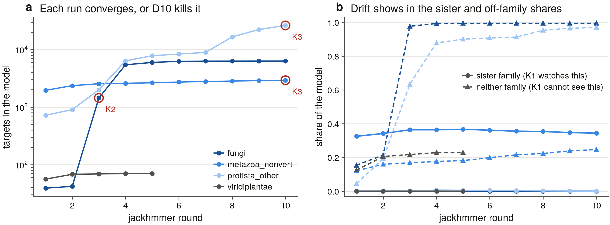

# S20 — the non-vertebrate sweep: the family's true range

_Rendered from the committed tables on 2026-09-05 11:54 by `scripts/s20_report.py` (D13)._

S3 swept the vertebrate reference proteomes and found where the three paralogs live. This task asks the opposite question — how far the family reaches — and the one it was set up to answer: the databases hold a few tens of plant and fungal records while *Arabidopsis* and *S. cerevisiae* hold none. Which of those is a fact about genomes and which about databases?

## The declared search space

| group | proteomes | proteins | residues | sampling | swept |
|---|---|---|---|---|---|
| metazoa_nonvert | 546 | 11,396,529 | 4.56 G | every reference proteome | yes |
| fungi | 1,527 | 17,339,036 | 7.79 G | every reference proteome | yes |
| viridiplantae | 432 | 15,114,263 | 5.81 G | every reference proteome | yes |
| protista_other | 252 | 3,636,524 | 1.78 G | every reference proteome | yes |
| archaea | 634 | 1,754,814 | 0.50 G | every reference proteome | yes |
| bacteria_genus | 3,537 | 13,903,732 | 4.48 G | largest_per_genus | yes |

**6,928 reference proteomes, 63,144,898 proteins, 24.93 G residues.** The four eukaryote groups partition Eukaryota with S3's `vertebrata`, so no proteome is swept twice and the two sweeps' denominators add.

Bacteria are sampled and archaea are not: one proteome per genus (first token of the organism name), the one with the most proteins — the most sensitive member of each genus, so the negative claim is made in the places most likely to break it. Archaea's reference set is small enough to take whole, so no sampling caveat attaches to it.

23 proteome(s) UniProt lists are not published in the current release FTP tree and 404 permanently; they are excluded from the denominator above and recorded in `proteome_unavailable_<group>.tsv` with what they took out of it.

## The instrument

The same two profiles S3 built and calibrated — `itpr.hmm` and `ryr.hmm` — with the same margin assignment: a target is called only when the winning profile beats the loser by more than 10% of its own score, clears 30 bits, and spans at least 200 match states (D22). Reusing S3's instrument rather than building a new one is what makes the vertebrate and non-vertebrate numbers comparable at all.

**One search, two sensitivities.** Every `hmmsearch` ran at `-E 10` and the primary call was taken by filtering the same output at E ≤ 1e-5, so the relaxed set is a superset of the strict one from the same search rather than a second experiment that might have differed some other way.

**That design was tested rather than assumed** (`scripts/s20_test_sensitivity.py`), and the test disproved the assumption it was written to confirm. Running each profile over a group DB at both thresholds and filtering the relaxed output:

| profile × group | targets compared | assignments that move | D22 gate crossings | domain rows that differ | targets on one side only |
|---|---|---|---|---|---|
| `itpr.hmm` × `protista_other` | 798 | 0 | 0 | 11 | 0 (0 called) |
| `ryr.hmm` × `viridiplantae` | 13,728 | 0 | 0 | 81 | 42 (0 called) |

**No assignment and no D22 gate decision moves**, which is what the primary calls rest on. But the two files are not identical, and the differences are worth naming because the first version of this report claimed there were none.

*Domain rows.* `-E` is a **sequence** reporting threshold, but `--domE` (default 10.0) is applied to the **conditional** E-value, which is normalised by how many sequences passed — so a looser `-E` inflates every c-Evalue by a constant factor (1.41× measured) and pushes marginal domains out of the report. Every differing row scores at or below 0 bits. They are not cosmetic: merged into `hmm_coverage`, a −2.0-bit alignment spanning 1,386 match states counts as coverage, and it moved one target's evidence class. This task uses the **relaxed** side, which excludes them — the more conservative reading.

*Boundary targets.* HMMER prints the sequence E-value to two significant figures, so a target whose true E-value sits just above 1e-5 prints as `1e-05` and a `<=` filter admits it while a `-E 1e-5` run never reports it. That is 42 of 13,770 plant targets on the RyR profile, every one at 31.2 bits, and **every one of them declined by the D22 gate** — so they enter no call. The test passes on whether a one-sided target is *called*, not on set equality, because set equality would fail on a printing artefact that cannot reach a result.

1 further run(s) are on disk but not quoted: the test refuses to pass on a comparison of fewer than 25 targets, because two empty sets agree perfectly and prove nothing. Its first run went green that way, on a group with no hit at either threshold.

The relaxed panel adds the family's four Pfam domain models:

| Pfam | name | match states | why it is in the panel |
|---|---|---|---|
| PF08709 | Ins145_P3_rec | 213 | IP3-binding core — the signature that names the family |
| PF02815 | MIR | 185 | MIR — shared with POMT1/2 |
| PF01365 | RYDR_ITPR | 201 | RYDR_ITPR — shared with the ryanodine receptors |
| PF08454 | RIH_assoc | 99 | RIH_assoc — shared with the ryanodine receptors |

| group | itpr.hmm targets | ryr.hmm targets | → ITPR | → RYR | → unassigned | search min |
|---|---|---|---|---|---|---|
| metazoa_nonvert | 2,513 | 8,125 | 1,194 | 1,156 | 6,257 | 18 |
| fungi | 44 | 2,942 | 35 | 20 | 2,897 | 22 |
| viridiplantae | 71 | 13,770 | 54 | 1 | 13,736 | 13 |
| protista_other | 798 | 2,580 | 729 | 121 | 1,871 | 9 |
| archaea | 0 | 7 | 0 | 0 | 7 | 1 |
| bacteria_genus | 0 | 59 | 0 | 0 | 59 | 6 |

## The family's range across the eukaryotic tree

6,928 reference proteomes were swept with both family profiles at the S3 protocol's threshold, and **662/6,928 (10%) carry at least one ITPR call**.

| group | proteomes swept | with an ITPR call | ITPR records |
|---|---|---|---|
| Metazoa (non-vertebrate) | 546 | 509/546 (93%) | 1,194 |
| SAR | 167 | 65/167 (39%) | 602 |
| Fungi | 1,527 | 28/1,527 (2%) | 35 |
| Discoba | 35 | 23/35 (66%) | 58 |
| Viridiplantae | 432 | 15/432 (3%) | 54 |
| Eukaryota (other) | 37 | 13/37 (35%) | 57 |
| Amoebozoa | 13 | 9/13 (69%) | 12 |
| Archaea | 634 | 0/634 (0%) | 0 |
| Bacteria | 3,537 | 0/3,537 (0%) | 0 |

Across every group, **45 clades of the 135 swept carry an ITPR call**. Clade is the phylum where UniProt states one and the next-deepest named group where it does not — the choanoflagellates, filastereans, cryptophytes and apusozoans have no phylum rank, and those are precisely the lineages a range result about this family has to be able to name. Most-covered first:

| clade | proteomes | with an ITPR call |
|---|---|---|
| Arthropoda | 311 | 292/311 (94%) |
| Nematoda | 110 | 106/110 (96%) |
| Mollusca | 32 | 32/32 (100%) |
| Platyhelminthes | 40 | 26/40 (65%) |
| Oomycota | 40 | 26/40 (65%) |
| Euglenozoa | 30 | 20/30 (67%) |
| Mucoromycota | 34 | 18/34 (53%) |
| Chlorophyta | 48 | 15/48 (31%) |
| Ciliophora | 16 | 15/16 (94%) |
| Cnidaria | 14 | 14/14 (100%) |
| Evosea | 12 | 8/12 (67%) |
| Dinophyceae | 10 | 8/10 (80%) |
| Chordata | 8 | 8/8 (100%) |
| Rotifera | 8 | 8/8 (100%) |
| Chytridiomycota | 16 | 6/16 (38%) |
| Annelida | 6 | 6/6 (100%) |
| Bolidophyceae | 6 | 6/6 (100%) |
| Echinodermata | 5 | 5/5 (100%) |
| Pelagophyceae | 4 | 4/4 (100%) |
| Haptophyta | 4 | 4/4 (100%) |
| Heterolobosea | 4 | 3/4 (75%) |
| Porifera | 3 | 3/3 (100%) |
| Perkinsozoa | 3 | 3/3 (100%) |
| Tardigrada | 2 | 2/2 (100%) |
| Basidiobolomycota | 2 | 2/2 (100%) |

Census v5 holds **8,807 ITPR records across 1,401 taxa**.

## D14 outside the vertebrates

28,137 targets were scored by at least one profile. **2,769 were scored by both above the 30-bit floor** — the only ones where the two families can be said to compete at all — and of those **1/2,769 (0%) fall inside D7's 10% no-call band**, where this instrument declines to choose.

| outcome | targets |
|---|---|
| declined: shared module only | 24,725 |
| called | 3,310 |
| declined: under the bit-score floor | 101 |
| declined: inside the no-call band | 1 |

The 200-state floor (D22) is doing most of the declining: a protein sharing one module with a full-length channel model scores against it, and outside the vertebrates that is the common case rather than the exception.

### What each call actually rests on

A call is only as good as how much of the model it spans, and the two profiles are very different sizes — `itpr.hmm` is 2,684 match states, `ryr.hmm` 4,930 — so 200 states is 7 % of one model and 4 % of the other. Breaking the calls out by evidence class is what stops that asymmetry from being read as biology:

| group | call | records | architecture (≥50 % of the model) | partial | median coverage |
|---|---|---|---|---|---|
| fungi | ITPR | 35 | 28 | 7 | 91% |
| fungi | RYR | 20 | 0 | 20 | 5% |
| metazoa_nonvert | ITPR | 1,194 | 617 | 577 | 54% |
| metazoa_nonvert | RYR | 1,156 | 441 | 715 | 27% |
| protista_other | ITPR | 729 | 466 | 263 | 75% |
| protista_other | RYR | 121 | 2 | 119 | 4% |
| viridiplantae | ITPR | 54 | 23 | 31 | 41% |
| viridiplantae | RYR | 1 | 0 | 1 | 5% |

The split runs along the one line that matters. Where ryanodine receptors are expected — the invertebrates — the RYR calls are real: 441/1,156 (38%) span at least half the model. Everywhere else they are not: 2/142 (1%). The ITPR calls hold up in both (617/1,194 (52%) and 517/818 (63%)). So the module-level RYR calls in fungi, green algae and protists are the shared architecture D14 exists to see through, not receptors: read as gene counts they would invent a ryanodine receptor family across half the eukaryotic tree, and read as coverage they do not.

The 2 architecture-level RYR call(s) outside the invertebrates are worth naming, because where the sister family is tells you when the two families split:

| accession | species | length | ryr bits | coverage | margin | a profile seed? |
|---|---|---|---|---|---|---|
| A0A0D2WXI6 | *Capsaspora owczarzaki (strain ATCC 30864)* | 6625 | 4662.5 | 96% | 86% | yes — circular |
| F2UC37 | *Salpingoeca rosetta* | 5340 | 1387.2 | 59% | 65% | no |

A record that is itself one of `ryr.hmm`'s seeds scores well against a profile built partly from it, so its score is not independent evidence and the column says so. The rest are.

The contested targets — kept and reported, not resolved:

| accession | species | itpr bits | ryr bits | margin |
|---|---|---|---|---|
| A0AAN0JU79 | *Amphimedon queenslandica* | 44.4 | 45.1 | 1.6% |

## Land plants: a genome fact or a database fact?

S2 enumerated the InterPro-seeded space and found **Streptophyta — the land-plant lineage — with 0 ITPR calls from 15 records in 13 taxa**. That is a claim about a space a protein enters only by already carrying a family Pfam annotation. Sweeping the proteomes themselves asks the question without that filter.

**CONFIRMED** — 0/384 (0%) Streptophyta reference proteomes carry an ITPR call: searching the proteomes themselves finds no more than the seeded space did.

| clade | proteomes swept | with an ITPR call |
|---|---|---|
| Chlorophyta | 48 | 15/48 (31%) |
| Streptophyta | 384 | 0/384 (0%) |

Viridiplantae overall: 15/432 (3%) proteomes.

Every Viridiplantae record called ITPR by either instrument was chased individually (64 records):

| verdict | records | what it means |
|---|---|---|
| fragment | 42 | real but incomplete gene model |
| real_gene | 22 | survives every test |

The surviving records are not evenly spread: **Cymbomonas tetramitiformis** alone contributes 12 of them, against a median of 1 per species. Whether that is real copy-number expansion or a duplicated assembly is a question for an assembly search, not a proteome one *(pending: S23)*.

The 22 that survive, by lineage:

| accession | species | phylum | length | nearest outside its kingdom |
|---|---|---|---|---|
| A0A150GRF6 | *Gonium pectorale (Green alga)* | Chlorophyta | 2580 | 23.2 % (Vertebrata) |
| A0A2J8AAQ9 | *Tetrabaena socialis* | Chlorophyta | 2680 | 22.6 % (Vertebrata) |
| A0A2K3CTW4 | *Chlamydomonas reinhardtii (Chlamydomonas smithii)* | Chlorophyta | 3210 | 21.6 % (Metazoa (non-vertebrate)) |
| A0A835TB45 | *Chlamydomonas incerta* | Chlorophyta | 3182 | 20.9 % (Vertebrata) |
| A0A835Y1X9 | *Edaphochlamys debaryana* | Chlorophyta | 3268 | 23.2 % (Vertebrata) |
| A0A836B9Y3 | *Chlamydomonas schloesseri* | Chlorophyta | 3219 | 21.9 % (Vertebrata) |
| A0A8S1J4S2 | *Ostreobium quekettii* | Chlorophyta | 2446 | 20.5 % (Fungi) |
| A0A9W6C1N2 | *Pleodorina starrii* | Chlorophyta | 3372 | 22.6 % (Vertebrata) |
| A0AAE0BBD3 | *Cymbomonas tetramitiformis* | Chlorophyta | 2899 | 20.6 % (Vertebrata) |
| A0AAE0BCU2 | *Cymbomonas tetramitiformis* | Chlorophyta | 2953 | 19.9 % (Vertebrata) |
| A0AAE0ESH2 | *Cymbomonas tetramitiformis* | Chlorophyta | 3164 | 28.4 % (SAR) |
| A0AAE0ET13 | *Cymbomonas tetramitiformis* | Chlorophyta | 2660 | 20.4 % (Metazoa (non-vertebrate)) |
| A0AAE0ETT8 | *Cymbomonas tetramitiformis* | Chlorophyta | 3163 | 28.4 % (SAR) |
| A0AAE0EZ22 | *Cymbomonas tetramitiformis* | Chlorophyta | 2761 | 21.6 % (Metazoa (non-vertebrate)) |
| A0AAE0G204 | *Cymbomonas tetramitiformis* | Chlorophyta | 2900 | 39.9 % (SAR) |
| A0AAE0G465 | *Cymbomonas tetramitiformis* | Chlorophyta | 2922 | 22.4 % (Vertebrata) |
| A0AAE0GMP6 | *Cymbomonas tetramitiformis* | Chlorophyta | 2998 | 38.5 % (SAR) |
| A0AAE0GPV6 | *Cymbomonas tetramitiformis* | Chlorophyta | 3355 | 24.3 % (SAR) |
| A0AAE0GZ30 | *Cymbomonas tetramitiformis* | Chlorophyta | 2462 | 21.5 % (Metazoa (non-vertebrate)) |
| A0AAE0LDZ1 | *Cymbomonas tetramitiformis* | Chlorophyta | 3375 | 24.3 % (SAR) |

## Dikarya: the yeasts and moulds

S2 found **Dikarya contributing no records at all** to the seeded space — not zero calls from some records, zero records. Every fungal call sat in an early-diverging phylum (Mucoromycota 15, Chytridiomycota 6, Basidiobolomycota 3, Entomophthoromycota 1).

**CONFIRMED** — 0/1,353 (0%) Ascomycota + Basidiomycota reference proteomes carry an ITPR call: searching the proteomes themselves finds no more than the seeded space did.

| clade | proteomes swept | with an ITPR call |
|---|---|---|
| Mucoromycota | 34 | 18/34 (53%) |
| Chytridiomycota | 16 | 6/16 (38%) |
| Basidiobolomycota | 2 | 2/2 (100%) |
| Zoopagomycota | 3 | 1/3 (33%) |
| Entomophthoromycota | 2 | 1/2 (50%) |
| Ascomycota | 1034 | 0/1,034 (0%) |
| Basidiomycota | 319 | 0/319 (0%) |
| Kickxellomycota | 35 | 0/35 (0%) |
| Microsporidia | 29 | 0/29 (0%) |
| Glomeromycota | 27 | 0/27 (0%) |
| Mortierellomycota | 18 | 0/18 (0%) |
| Rozellomycota | 2 | 0/2 (0%) |
| Blastocladiomycota | 2 | 0/2 (0%) |
| Neocallimastigomycota | 2 | 0/2 (0%) |
| Monoblepharomycota | 1 | 0/1 (0%) |
| Olpidiomycota | 1 | 0/1 (0%) |

Fungi overall: 28/1,527 (2%) proteomes.

Every Fungi record called ITPR by either instrument was chased individually (35 records):

| verdict | records | what it means |
|---|---|---|
| real_gene | 25 | survives every test |
| fragment | 10 | real but incomplete gene model |

The 25 that survive, by lineage:

| accession | species | phylum | length | nearest outside its kingdom |
|---|---|---|---|---|
| A0A1Y1XHY3 | *Basidiobolus meristosporus CBS 931.73* | Basidiobolomycota | 2495 | 24.2 % (Metazoa (non-vertebrate)) |
| A0A1Y1YQ92 | *Basidiobolus meristosporus CBS 931.73* | Basidiobolomycota | 2278 | 29.8 % (Amoebozoa) |
| A0ABR2W6A1 | *Basidiobolus ranarum* | Basidiobolomycota | 2502 | 24.6 % (Metazoa (non-vertebrate)) |
| A0A1Y2B255 | *Rhizoclosmatium globosum* | Chytridiomycota | 3246 | 33.2 % (Amoebozoa) |
| A0A507FK04 | *Chytriomyces confervae* | Chytridiomycota | 3329 | 33.5 % (Amoebozoa) |
| A0AAD5U9K5 | *Clydaea vesicula* | Chytridiomycota | 2759 | 30.5 % (Amoebozoa) |
| A0AAD5XWK9 | *Clydaea vesicula* | Chytridiomycota | 2327 | 20.5 % (Metazoa (non-vertebrate)) |
| A0ABR4NG49 | *Polyrhizophydium stewartii* | Chytridiomycota | 3104 | 23.6 % (Metazoa (non-vertebrate)) |
| A0ABR4NID5 | *Polyrhizophydium stewartii* | Chytridiomycota | 4446 | 30.5 % (Amoebozoa) |
| A0ACC2TPX2 | *Entomophthora muscae* | Entomophthoromycota | 2567 | 23.5 % (Metazoa (non-vertebrate)) |
| A0A0C9M4R7 | *Mucor ambiguus* | Mucoromycota | 2599 | 23.2 % (Metazoa (non-vertebrate)) |
| A0A162V9Q6 | *Phycomyces blakesleeanus (strain ATCC 8743b / DSM 1359 / FGSC 10004 / NBRC 33097 / NRRL 1555)* | Mucoromycota | 2551 | 23.5 % (Metazoa (non-vertebrate)) |
| A0A168KKP7 | *Mucor lusitanicus CBS 277.49* | Mucoromycota | 2620 | 33.1 % (Amoebozoa) |
| A0A168RJ50 | *Absidia glauca (Pin mould)* | Mucoromycota | 2540 | 22.7 % (Metazoa (non-vertebrate)) |
| A0A1C7NSC1 | *Choanephora cucurbitarum* | Mucoromycota | 2547 | 22.3 % (Metazoa (non-vertebrate)) |
| A0A1X2G6S3 | *Hesseltinella vesiculosa* | Mucoromycota | 2642 | 23.9 % (Metazoa (non-vertebrate)) |
| A0A1X2IXV9 | *Absidia repens* | Mucoromycota | 2651 | 24.2 % (Metazoa (non-vertebrate)) |
| A0A433QY11 | *Jimgerdemannia flammicorona* | Mucoromycota | 2599 | 23.6 % (Metazoa (non-vertebrate)) |
| A0A8H7BU48 | *Apophysomyces ossiformis* | Mucoromycota | 2391 | 22.4 % (Metazoa (non-vertebrate)) |
| A0A8H7VCW8 | *Mucor plumbeus* | Mucoromycota | 2604 | 22.5 % (Metazoa (non-vertebrate)) |

## The negative claims, at a stated sensitivity

Every claim was made at **E ≤ 1e-5** with the two full-length family profiles and re-made at **E ≤ 10** with those two *plus* the family's four Pfam domain models — a 213-state IP₃-core model can reach something a 2,684-state channel model cannot.

Reported at E ≤ 10 / of those, spanning at least half the model at E ≤ 1e-5:

| lineage | PF01365 | PF02815 | PF08454 | PF08709 | itpr | ryr |
|---|---|---|---|---|---|---|
| land plants | 357 / **0** | 849 / **633** | 137 / **1** | 448 / **0** | 744 / **0** | 32,423 / **0** |
| Chlorophyta (control) | 36 / **30** | 81 / **37** | 34 / **29** | 44 / **26** | 146 / **23** | 1,038 / **0** |
| Dikarya | 88 / **0** | 4,527 / **4,376** | 82 / **0** | 25 / **0** | 435 / **0** | 6,097 / **0** |
| Mucoromycota (control) | 12 / **3** | 351 / **329** | 18 / **16** | 100 / **16** | 120 / **16** | 709 / **0** |

**The controls fire and the claims do not.** PF08709 is the IP₃-binding core, the signature that names the family:

- **land plants**: 0 substantial PF08709 match(es), against 26 in *Chlorophyta*, the nearest lineage in the same kingdom where the family is present.

- **Dikarya**: 0 substantial PF08709 match(es), against 16 in *Mucoromycota*, the nearest lineage in the same kingdom where the family is present.

And the search is demonstrably sensitive in those very genomes: PF02815 (MIR, which the family shares with POMT1/2 and every eukaryote therefore carries) returns 633 substantial matches in land plants, 4,376 substantial matches in Dikarya. The promiscuous domain finds thousands where the family-defining one finds none, which is what an absence looks like when the instrument is working rather than blind.

Across every relaxed group, **51 target(s) span at least half a full-length family profile** at the relaxed threshold.

| group | profile | accession | species | length | E-value | model coverage |
|---|---|---|---|---|---|---|
| fungi | itpr | A0ABR2W6A1 | *Basidiobolus ranarum* | 2502 | 0.0 | 97% |
| fungi | itpr | A0A1Y1XHY3 | *Basidiobolus meristosporus CBS 931.73* | 2495 | 0.0 | 94% |
| fungi | itpr | A0A1Y1YQ92 | *Basidiobolus meristosporus CBS 931.73* | 2278 | 0.0 | 85% |
| fungi | itpr | A0A1Y2B255 | *Rhizoclosmatium globosum* | 3246 | 0.0 | 97% |
| fungi | itpr | A0A433QY11 | *Jimgerdemannia flammicorona* | 2599 | 0.0 | 90% |
| fungi | itpr | A0A507FK04 | *Chytriomyces confervae* | 3329 | 0.0 | 90% |
| fungi | itpr | A0ACC2TPX2 | *Entomophthora muscae* | 2567 | 0.0 | 88% |
| fungi | itpr | A0AAD5K078 | *Phascolomyces articulosus* | 2588 | 0.0 | 91% |
| fungi | itpr | A0AAD7UQL8 | *Lichtheimia ornata* | 2610 | 0.0 | 91% |
| fungi | itpr | A0ABR4NID5 | *Polyrhizophydium stewartii* | 4446 | 0.0 | 97% |
| fungi | itpr | A0ABR4NG49 | *Polyrhizophydium stewartii* | 3104 | 0.0 | 97% |
| fungi | itpr | A0A162V9Q6 | *Phycomyces blakesleeanus (strain ATCC 8743b / DSM 1359 / FGSC 10004 / NBRC 33097 / NRRL 1555)* | 2551 | 0.0 | 93% |
| fungi | itpr | A0ABR3B852 | *Phycomyces blakesleeanus* | 2551 | 0.0 | 93% |
| fungi | itpr | A0A1X2IXV9 | *Absidia repens* | 2651 | 0.0 | 97% |
| fungi | itpr | S2J437 | *Mucor circinelloides f. circinelloides (strain 1006PhL)* | 2592 | 0.0 | 97% |
| fungi | itpr | A0AAN7D8C4 | *Mucor velutinosus* | 2613 | 0.0 | 97% |
| fungi | itpr | A0A8H7VCW8 | *Mucor plumbeus* | 2604 | 0.0 | 97% |
| fungi | itpr | A0A1X2G6S3 | *Hesseltinella vesiculosa* | 2642 | 0.0 | 97% |
| fungi | itpr | A0A168KKP7 | *Mucor lusitanicus CBS 277.49* | 2620 | 0.0 | 97% |
| fungi | itpr | A0A0C9M4R7 | *Mucor ambiguus* | 2599 | 0.0 | 97% |

## Iterated search, per group (D10)

A single profile pass can only find what it is already close enough to. Each group was therefore searched again with `jackhmmer` from a seed native to that group — the highest-scoring full-length ITPR call in the group's own sweep — iterated to convergence under D10's coded kill criterion.

| group | seed | rounds | converged | D10 verdict | rule fired | targets in the accepted model |
|---|---|---|---|---|---|---|
| fungi | A0ABR2W6A1 | 10 | no | killed | K2 | 42 |
| viridiplantae | A0AAE0LDZ1 | 5 | yes | clean | none | 70 |

### What each converged model is built from

The completeness statement the iterated search exists to make. A model seeded in one lineage and iterated to convergence either reaches a neighbouring lineage or it does not, and the targets **only iteration found** are the ones that matter: if they sit in the same lineage as the seed, the absence next door is not a sensitivity artefact.

| group | clade | profile call | targets | found by the single pass | iteration only |
|---|---|---|---|---|---|
| fungi | Mucoromycota | ITPR | 17 | 17 | 0 |
| fungi | Chytridiomycota | ITPR | 9 | 9 | 0 |
| fungi | Basidiobolomycota | ITPR | 5 | 5 | 0 |
| fungi | Mucoromycota | unassigned | 5 | 5 | 0 |
| fungi | Ascomycota | not called by the single pass | 2 | 0 | 2 |
| fungi | Chytridiomycota | unassigned | 1 | 1 | 0 |
| fungi | Zoopagomycota | ITPR | 1 | 1 | 0 |
| fungi | Mucoromycota | not called by the single pass | 1 | 0 | 1 |
| fungi | Entomophthoromycota | ITPR | 1 | 1 | 0 |
| viridiplantae | Chlorophyta | ITPR | 54 | 54 | 0 |
| viridiplantae | Chlorophyta | unassigned | 10 | 10 | 0 |
| viridiplantae | Chlorophyta | not called by the single pass | 6 | 0 | 6 |

9 target(s) entered an accepted model that the single profile pass never reported. Those are the ones iteration was run to find, so they are named rather than counted:

| group | accession | species | clade | length | what it is |
|---|---|---|---|---|---|
| fungi | A0A433P6E3 | *Jimgerdemannia flammicorona* | Mucoromycota | 260 | Uncharacterized protein (Fragment) |
| fungi | G8BQA4 | *Tetrapisispora phaffii (strain ATCC 24235 / CBS 4417 / NBRC 1672 / NRRL Y-8282 / UCD 70-5)* | Ascomycota | 756 | Dolichyl-phosphate-mannose--protein mannosyltransferase |
| fungi | H2AW46 | *Kazachstania africana (strain ATCC 22294 / BCRC 22015 / CBS 2517 / CECT 1963 / NBRC 1671 / NRRL Y-8276)* | Ascomycota | 759 | Dolichyl-phosphate-mannose--protein mannosyltransferase |
| viridiplantae | A0A150FXB1 | *Gonium pectorale* | Chlorophyta | 1735 | Uncharacterized protein |
| viridiplantae | A0A2J7ZQW2 | *Tetrabaena socialis* | Chlorophyta | 450 | Uncharacterized protein |
| viridiplantae | A0A8J4D7B9 | *Volvox reticuliferus* | Chlorophyta | 142 | Uncharacterized protein (Fragment) |
| viridiplantae | A0AAE0F7T8 | *Cymbomonas tetramitiformis* | Chlorophyta | 114 | Uncharacterized protein (Fragment) |
| viridiplantae | A0AAE0F895 | *Cymbomonas tetramitiformis* | Chlorophyta | 324 | MIR domain-containing protein (Fragment) |
| viridiplantae | A0AAE0G568 | *Cymbomonas tetramitiformis* | Chlorophyta | 300 | RyR/IP3R Homology associated domain-containing protein (Fragment) |

**2 of them sit in a lineage this task calls empty** — so the absence there is not quite absolute, and what they are decides whether that matters: Dolichyl-phosphate-mannose--protein mannosyltransferase.

Every one is a mannosyltransferase — the MIR-domain sharer S1's decoy panel was built around (POMT1/2), not a receptor. The iterated search reaches these lineages exactly far enough to pick up the known false positive and no further.

2 group(s) had not finished iterating when this report was rendered and are reported as unfinished rather than summarised from a partial log: metazoa_nonvert, protista_other. The bottleneck is the per-round alignment, not the search — a round over a group with thousands of included targets costs far more to align than to scan, and that cost is not reduced by more cores.

## Census v5

**17,882 records**, of which 785 are new from this sweep. Calls: ITPR 8,807, RYR 8,468, unassigned 605, conflict 2.

0 records changed their call against census v4, and 2 are `conflict` — kept and reported rather than resolved (D23).

| group | ITPR | RYR | conflict | unassigned | total |
|---|---|---|---|---|---|
| Amoebozoa | 11 | 1 | 1 | 0 | 13 |
| Bacteria | 0 | 0 | 0 | 1 | 1 |
| Discoba | 59 | 19 | 0 | 3 | 81 |
| Eukaryota (other) | 57 | 5 | 0 | 10 | 72 |
| Fungi | 35 | 20 | 0 | 14 | 69 |
| Metazoa (non-vertebrate) | 1,860 | 2,147 | 0 | 211 | 4,218 |
| SAR | 609 | 99 | 1 | 20 | 729 |
| Vertebrata | 6,112 | 6,176 | 0 | 324 | 12,612 |
| Viridiplantae | 64 | 1 | 0 | 22 | 87 |

The conflicts:

| accession | species | census v4 | S20 sweep | reason |
|---|---|---|---|---|
| A0A152A7I8 | *Tieghemostelium lacteum (Slime mold) (Dictyostelium lacteum)* | RYR | ITPR | census v4 recorded a conflict and it stands — this sweep's profile verdict agrees with the profile side of it, but that is the same instrument, not a third opinion |
| A0A1Q9CN86 | *Symbiodinium microadriaticum (Dinoflagellate) (Zooxanthella microadriatica)* | RYR | ITPR | census v4 recorded a conflict and it stands — this sweep's profile verdict agrees with the profile side of it, but that is the same instrument, not a third opinion |

## Figures

**jackhmmer_s20.** Per-group convergence, where D10 killed a run, and the off-family drift K1 cannot see.

**plant_fungal_chase.** The verdict on every plant and fungal record, and the cross-kingdom identities the contamination test rests on.

**profile_separation.** Both profiles' scores on every S20 target, with D7's no-call band drawn rather than described.

**range_by_phylum.** Where the family is, as a fraction of the reference proteomes actually swept in each clade.

---

Groups: metazoa_nonvert, fungi, viridiplantae, protista_other (eukaryotes), archaea, bacteria_genus (prokaryotes).

