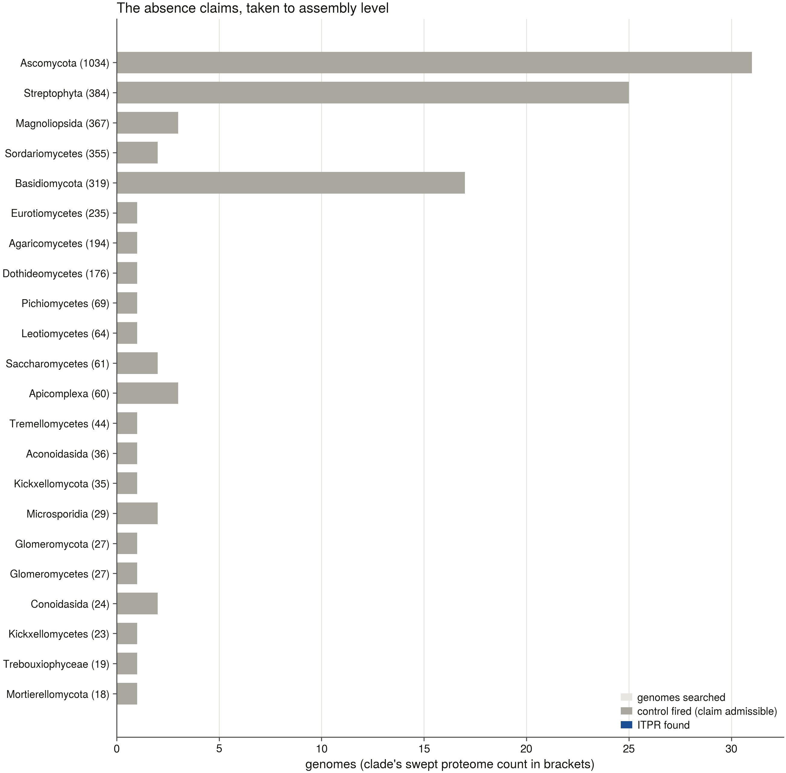
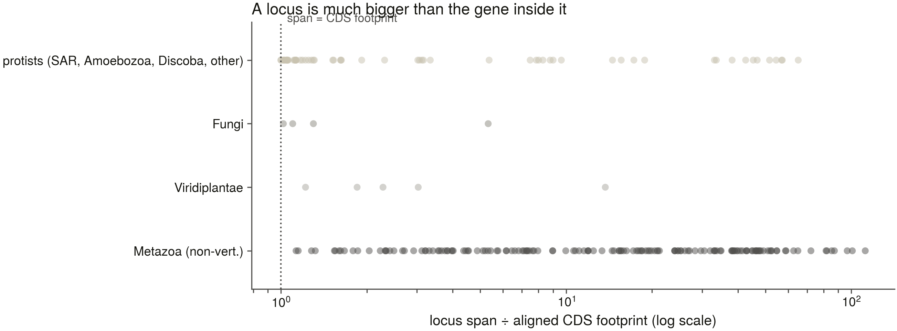

# S23 — the non-vertebrate genomic sweep

*Generated by `scripts/s23_report.py` from the committed tables only (D13). Nothing here is hand-written.*

S20 swept 6,928 reference **proteomes** and found the family absent from the land plants, the Dikarya, the Apicomplexa and a scatter of fungal phyla. Every one of those is an annotation fact: a proteome is what a gene-caller found, a genome is what is there. S23 takes them to assembly level. **194 of 194 declared genomes swept.**

## 1. The denominator

**194 genomes, 100.4 Gbp** (FASTA ≈ 100.4 GB, zip ≈ 30.1 GB against 804.6 GB free), selected from 24,596 NCBI eukaryote reference assemblies. 6,216 of those are vertebrate and belong to S4's manifest, leaving 18,380 in scope.

The scope rule is **sample most finely where the negative claim is**. Five rules, every one derived from a committed table except the anchors, which are hand-written because an anchor is a genome whose answer is known from the literature and no table can derive that.

| rule | genomes | what it selects |
|---|---|---|
| G1 phylum_rep | 66 | one best assembly per non-vertebrate eukaryotic phylum (66 phyla in the pool) |
| G2 class_rep | 87 | one per class in the phyla S20 swept ≥ 100 proteomes of: Ascomycota (1,034), Streptophyta (384), Basidiomycota (319), Arthropoda (311), Nematoda (110) |
| G3 absence_clade | 35 | one per clade S20 swept ≥ 10 proteomes of and found 0 ITPR in (35 clades) |
| G4 anchor | 14 | the reference organisms the claims are calibrated on |
| G5 copy_number | 36 | the highest-copy species per class, above the vertebrate paralog count |

33 genomes carry more than one reason and are one row each, so the row count is the number of genomes to download.

**G3 re-derives S20a's target list from the presence table rather than repeating it, and finds three absences S20a's summary never named** — Bacillariophyta 0/16, Rhodophyta 0/12, and **Cestoda 0/11, a metazoan clade with no ITPR record at all**.

By kingdom-level group: amoebozoa 4, discoba 3, fungi 66, metazoa 66, other 15, sar 11, viridiplantae 29.

## 2. The two genomic thresholds, measured for this scope

S5a measured both for the vertebrates and neither transfers. A vertebrate ITPR gene spans 76–498 kb; a *Drosophila* Itpr spans 22 kb. Measured here over **16 genes in 16 species across 14 bands**, from NCBI's own gene annotations for genes the census independently calls ITPR — not from miniprot, because the aligner's `-G` shapes the loci it reports and a measurement taken that way cannot falsify the setting it calibrates.

Spans run **3,739 – 324,840 bp, median 19,435**. That is a ~100× range, against the 6.5× S0 measured inside the vertebrates, so a single bar would be far too lax for the metazoans or far too strict for the protists. **The bar is therefore per group.**

| group | genes | span range (bp) | contiguity bar (bp) | miniprot -G (bp) |
|---|---|---|---|---|
| amoebozoa | 2 | 8,692 – 8,934 | 8,813 | 200,000 |
| discoba | 1 | 9,426 – 9,426 | 9,426 | 200,000 |
| fungi | 1 | 9,363 – 9,363 | 9,363 | 200,000 |
| metazoa | 10 | 8,564 – 324,840 | 83,321 | 649,680 |
| sar | 2 | 3,739 – 10,871 | 7,305 | 200,000 |

The S5 vertebrate bar was 142,212 bp and 120 of 309 genomes failed it — S5b's headline caveat. Here **metazoan genes are ~9× longer than protist and fungal ones** (83 kb median against 7–9 kb), and the genomes carrying this task's negative claims are judged against the ~9 kb bar, which almost any modern assembly clears.

`-G` moves the other way and is floored at miniprot's own default: a `-G` below an unmeasured species' largest intron **splits** its gene, and a split ITPR reads out of a copy-number ledger as `fragment`. 41 of the 57 panel records were unmeasurable (their locus tags have no NCBI gene record), so erring high is the only safe direction.

**Gap to state:** no Viridiplantae gene span was measured — the chlorophyte census records carry locus tags NCBI has no gene record for — so every plant genome is judged against the global median. `s23_calibration.contiguity_bar()` returns that fallback in its own return value rather than hiding it.

## 3. The bait panel, and the control that had to be replaced

**108 baits, 277,611 residues**: 37 ITPR, 16 RyR and 55 proof-of-search control, derived from census v5 by seven enforced rules, 21 of them S3 seeds reused unchanged (B6).

### 3.1 S5's positive control does not transfer

S5 can write "the RyR control fired in all 309 genomes, so none is excluded on control grounds" because every vertebrate has three RyRs. Outside Metazoa that argument collapses: S20 found architecture-level RyR in **2 of 6,928** non-metazoan proteomes. A land plant with no RyR locus is the *correct* answer, so RyR cannot be that genome's proof-of-search — and without one, "no ITPR in *Arabidopsis*" is indistinguishable from "the sweep did not run properly on *Arabidopsis*". Every negative claim in this task rests on closing that gap.

S23a's replacement was the **MIR-domain sharer** (PF02815) — the protein O-mannosyltransferase family S1's decoy panel was built around and S20 used as its in-search positive control, where PF08709 returns 0 matches in land plants and PF02815 returns 633. It is in the family's own signature set, it is drawn from the clade each claim is about, and it is simultaneously the sharpest available decoy.

**It was still one profile fixed in advance for every clade, and that is what failed.** Both apicomplexan classes carry a single PF02815 protein each across 60 swept proteomes, and the S23a pilot's *Toxoplasma gondii* came back `uncontrolled`. S23b therefore chooses the control profile **per clade, by measurement**: six candidate profiles — all large, deeply conserved, multi-exon eukaryotic families — run over each clade's own swept reference proteomes, and each clade takes the one that is actually there (`control_profile_coverage.tsv` carries every candidate's number, not only the winner's). The MIR bait stays in the panel whatever the measurement says, because dropping it would buy a proof-of-search and sell D14's negative control.

**55 usable control baits across 56 control clades: 48 strong, 7 weak.** A control is strong when it is present across at least a quarter of the clade's swept proteomes, carries most of its profile's own model, and is a substantial multi-exon protein rather than a lone domain; the classification is recorded per clade rather than resolved, because it is the reader's to weigh.

| chosen profile | clades it controls | example |
|---|---|---|
| PF00063 (Myosin_head) | 27 | Magnoliopsida — 0.9745 of its 367 swept proteomes |
| PF02463 (SMC_N) | 1 | Rhodophyta — 1.0000 of its 12 swept proteomes |

| clade | bait | aa | bits | clade coverage | why weak |
|---|---|---|---|---|---|
| Conoidasida | A0A2A9M081 | 2498 | 125.8 | 1.0 | carries 65% of the control profile's model |
| Mortierellomycetes | A0A9P6QF68 | 2372 | 302.4 | 0.9412 | carries 60% of the control profile's model |
| Aconoidasida | A0ABQ7J9N3 | 233 | 38.6 | 0.0278 | not named a mannosyltransferase; 233 aa — a short MIR-only protein, not the full PMT (< 600); PF02815 found in only 3% of the clade's swept proteomes |
| Conoidasida | A0AAV9Y0A3 | 231 | 33.2 | 0.0435 | not named a mannosyltransferase; 231 aa — a short MIR-only protein, not the full PMT (< 600); PF02815 found in only 4% of the clade's swept proteomes |
| Trebouxiophyceae | A0AAV1I2H9 | 208 | 66.5 | 0.8235 | not named a mannosyltransferase; 208 aa — a short MIR-only protein, not the full PMT (< 600) |
| Bacillariophyta | A0ABD3PUM4 | 217 | 60.2 | 1.0 | not named a mannosyltransferase; 217 aa — a short MIR-only protein, not the full PMT (< 600) |
| Rhodophyta | A0A2V3J3L8 | 219 | 66.6 | 0.9167 | not named a mannosyltransferase; 219 aa — a short MIR-only protein, not the full PMT (< 600) |

**The apicomplexan control was the thin one, and it is the one that mattered.** Under PF02815 alone both classes carried a single control protein across 60 swept proteomes (3–4 % clade coverage) and *Toxoplasma* returned neither a receptor nor a control. Measured, they take: **Aconoidasida** Myosin_head (PF00063) in 36 of  swept proteomes; **Conoidasida** Myosin_head (PF00063) in 23 of  swept proteomes.

### 3.2 The screen rejected a control on its first run

A control bait must be assigned to **neither** family — a control protein the profiles call a family member is a finding, not a control. One was:

| clade | accession | organism | aa | its own name | screen verdict |
|---|---|---|---|---|---|
| Cestoda | A0A0R3TP59 | Rodentolepis nana | 931 | MIR domain-containing protein | assigned RYR by the screen (itpr 179 / ryr 1121 bits) |

A tapeworm protein UniProt calls a "MIR domain-containing protein" is a ryanodine receptor. Cestoda is a metazoan clade, so its genomes keep the RyR control; the slot is left empty rather than filled with a family member.

### 3.3 Unfilled slots

13 slots have no bait. The reason is recorded per slot and distinguishes the census having no record from a threshold rejecting the records it has — the first version of this table said "no census record at all" for seven bands, four of which have dozens.

| band | role | records | pass shape | why |
|---|---|---|---|---|
| Bryozoa | ITPR | 11 | 0 | 11 census record(s), none passing the shape rules (length band / architecture); the band's records are fragmentary or divergent |
| Bryozoa | RYR | 2 | 0 | 2 census record(s), none passing the shape rules (length band / architecture); the band's records are fragmentary or divergent |
| Cnidaria | RYR | 2 | 0 | 2 census record(s), none passing the shape rules (length band / architecture); the band's records are fragmentary or divergent |
| Ctenophora | RYR | 0 | 0 | no census record in this band at all |
| Priapulida | ITPR | 2 | 0 | 2 census record(s), none passing the shape rules (length band / architecture); the band's records are fragmentary or divergent |
| Priapulida | RYR | 3 | 0 | 3 census record(s), none passing the shape rules (length band / architecture); the band's records are fragmentary or divergent |
| Tardigrada | RYR | 7 | 0 | 7 census record(s), none passing the shape rules (length band / architecture); the band's records are fragmentary or divergent |
| Orthonectida | ITPR | 6 | 0 | 6 census record(s), none passing the shape rules (length band / architecture); the band's records are fragmentary or divergent |
| Orthonectida | RYR | 5 | 0 | 5 census record(s), none passing the shape rules (length band / architecture); the band's records are fragmentary or divergent |
| Zoopagomycota | ITPR | 1 | 0 | 1 census record(s), none passing the shape rules (length band / architecture); the band's records are fragmentary or divergent |
| Perkinsozoa | ITPR | 3 | 0 | 3 census record(s), none passing the shape rules (length band / architecture); the band's records are fragmentary or divergent |
| Euglenozoa | ITPR | 37 | 0 | 37 census record(s), none passing the shape rules (length band / architecture); the band's records are fragmentary or divergent |
| Preaxostyla | ITPR | 10 | 0 | 10 census record(s), none passing the shape rules (length band / architecture); the band's records are fragmentary or divergent |

### 3.4 Both measured thresholds had to be stratified

The bait length band is **[2450, 3250] aa** and the architecture-exception floor **751.8 bits**, each measured over the complete-architecture non-vertebrate records **capped at 20 per band** (25 bands contribute).

Measured without the cap the band is [2550, 3100] aa and the floor ~1,095 bits — the numbers of a population that is 53 % Arthropoda, wearing the whole tree's name. They excluded *Bodo saltans*, a 2,356–4,222 aa euglenozoan ITPR at 4/5 architecture and 780 bits, which is exactly the deep-branching record a non-vertebrate panel exists to carry. This is the same correction S20 made when it stratified its bacterial sample by genus, and the same one G3 and G5 make in the scope: **a threshold measured on the best-sampled clade describes the sampling, not the family.**

The chimera screen is S5's module unchanged (D5), and its own negative controls run on every build: **3/3 synthetic failures rejected**, each by the rule responsible.

## The locus thresholds, measured for this scope
S5b's `MIN_LOCUS_IDENTITY` = 0.40 came from a wide empty gap in the vertebrates: confirmed loci from 0.759 up, junk from 0.23 to 0.34, and every genome with a bait from its own class. Neither holds here — the bands are whole phyla and 13 bait slots are unfilled — so this sweep **recorded** every cluster down to 0.15 and the threshold was measured afterwards from what it recorded. A threshold measured from the population it has already filtered is circular; this one is not (D27).
Over 194 genomes the sweep recorded 917 clusters. Two evidence axes were used, and the first is thin for a reason worth stating: **only 21 of 917 clusters sit on a gene whose name says anything at all.** Outside the vertebrates most gene models carry locus tags — *Chlamydomonas* files its receptor as `CHLRE_16g665450v5`, *Strongylocentrotus* as `LOC594527` — so the evidence S5b calibrated 571 loci against does not exist at that depth in this scope.
| evidence axis | confirmed | contradicted |
|---|---|---|
| the assembly's own annotation | 10 | 11 |
| the S3 profiles (itpr.hmm / ryr.hmm) | 226 | 0 |
| **pooled** | 226 | 11 |

**No threshold on either statistic separates them.**
| statistic | confirmed reach down to | contradicted up to | separates? |
|---|---|---|---|
| identity | 0.193 | 0.318 | **no — they overlap** |
| coverage | 0.101 | 0.955 | **no — they overlap** |

**`call_min_identity` = 0.15.** **neither identity nor coverage separates the two populations in this scope.** 226 confirmed loci reach down to 0.193 on identity while 11 contradicted ones reach up to 0.318, and the best achievable threshold on either statistic still discards a large part of the confirmed set (see `separation` in this file). S5b's inherited 0.40 would discard 87 confirmed loci, 56 of them **complete gene models**. Outside the vertebrates a locus's identity to its nearest bait measures how far away the nearest bait is — a whole phylum — not whether it is a gene. Identity is therefore retired as a call gate (set to the recording floor) and the **profile call** carries it (D14/D23), which is where this project puts every other family call. That gate is validated against the one axis it does not share: see `profile_gate_vs_annotation`

**The gate that replaces it, scored against the one axis it does not share.** the profile gate agrees with 10 of 10 loci the assembly's own annotation names for this family, and declines 10 of 11 it names for something else.
The one exception is *Emiliania huxleyi CCMP1516* gene `IPR1` — 0.9553 of its bait at 1007.7 bits against 328.6 for `ryr.hmm`. `IPR1` is not in the family name list, so the annotation axis scored it as naming a different gene; on the evidence it is more likely the name list is short than that the gate is wrong. It is reported as a conflict rather than reconciled — adding `ipr1` as a name substring would collide with every InterPro accession.

What each candidate floor would have cost, for the record:
| floor | confirmed kept | confirmed lost | contradicted kept | no evidence either way |
|---|---|---|---|---|
| 0.15 | 226 | 0 | 11 | 681 |
| 0.20 | 222 | 4 | 11 | 648 |
| 0.25 | 179 | 47 | 3 | 262 |
| 0.30 | 167 | 59 | 1 | 27 |
| 0.35 | 147 | 79 | 0 | 0 |
| 0.40 | 139 | 87 | 0 | 0 |
| 0.45 | 128 | 98 | 0 | 0 |
| 0.50 | 98 | 128 | 0 | 0 |
| 0.55 | 79 | 147 | 0 | 0 |
| 0.60 | 68 | 158 | 0 | 0 |
| 0.65 | 52 | 174 | 0 | 0 |
| 0.70 | 45 | 181 | 0 | 0 |

**0 `no_locus` genome(s) carry a cluster within 0.05 of the floor.** The brief asked for this number explicitly: a genome called absent because its best evidence scored just under the bar is a different claim from one whose best evidence was nowhere near it.

### A locus is much bigger than the gene inside it
`-G` is 650 kb for the metazoa, so a cluster is a large object. In the S23a pilot *Drosophila*'s 22 kb *Itpr* sat inside a 297 kb cluster — harmless for a status call, fatal for a copy count, because two genes inside one such chain would be counted once. Copy number is therefore counted on **non-overlapping complete alignments**, not on clusters.
| group | loci | median span ÷ CDS | max | ≥ 10× |
|---|---|---|---|---|
| amoebozoa | 6 | 8.2× | 19× | 1 |
| discoba | 11 | 1.6× | 17× | 2 |
| fungi | 4 | 1.2× | 5× | 0 |
| metazoa | 156 | 15.8× | 112× | 93 |
| other | 20 | 33.4× | 65× | 12 |
| sar | 24 | 1.2× | 9× | 0 |
| viridiplantae | 5 | 2.3× | 14× | 1 |

`copy_max_overlap` = 0.20 — 16 same-contig copy pairs, largest residual overlap 4%; the rule's threshold is not contradicted by the data it produced

## The positive control
S5b could write "the RyR control fired in all 309" because every vertebrate has three RyRs. Outside Metazoa that sentence is not available (D26), and S23a's replacement — the MIR-domain sharer — has its own hole: both apicomplexan classes carry **one** PF02815 protein each across 60 swept proteomes, and the pilot's *Toxoplasma gondii* came back with neither a receptor nor a control.
**The fix is not a different profile, it is not fixing the profile in advance.** A control's job is to fire in the clade whose absence is the claim, so which family makes the best control is a property of the clade and is measurable. Six candidate profiles — all large, deeply conserved, multi-exon eukaryotic families — were run over each clade's own swept reference proteomes, and each clade takes the one that is actually there.
| profile | clades it controls | example clade |
|---|---|---|
| PF00063 (Myosin_head) | 27 | Magnoliopsida |
| PF02463 (SMC_N) | 1 | Rhodophyta |

**193 of 194 genomes are controlled** (193/194 (99%)); 0 are not, and no absence claim rests on those.
| verdict | genomes | what it means |
|---|---|---|
| `controlled_cross_kingdom` | 115 | a control locus, and a bait from another kingdom aligns across it |
| `controlled_by_target` | 77 | the ITPR baits found a full locus — the search reached this assembly |
| `controlled_partial` | 1 |  |
| `no_control_bait` | 1 | the panel carries no control bait for this genome's clade — a silent control, not an absent result |

**115 genome(s) are controlled across a kingdom boundary** — a control bait from a different kingdom-level group aligns across the same locus. That is the tier that matters for an absence claim: it shows the search reaches across the divergence any receptor here would have to be found across, not merely that the assembly is readable.
*Against the pilot:* 1 of 14 genomes were uncontrolled there (Toxoplasma gondii); here 0 of 194.

## Copy number
Outside the vertebrates the paralog cells do not exist — ITPR1/2/3 are a 2R product and S5b found the trio absent below the cyclostomes — so the question is how many receptors a genome has.
Across the 193 controlled genomes:
| complete ITPR gene models | genomes |
|---|---|
| 0 | 116 |
| 1 | 43 |
| 2 | 11 |
| 3 | 14 |
| 4 | 3 |
| 5 | 2 |
| 6 | 1 |
| 8 | 1 |
| 13 | 1 |
| 18 | 1 |

**34 genome(s) carry more than one complete model.**
| organism | group | phylum | copies | clusters |
|---|---|---|---|---|
| *Macrostomum lignano* | metazoa | Platyhelminthes | 18 | 17 |
| *Stentor coeruleus* | sar | Ciliophora | 13 | 12 |
| *Dysidea avara* | metazoa | Porifera | 8 | 7 |
| *Amphimedon queenslandica* | metazoa | Porifera | 6 | 6 |
| *Dimorphilus gyrociliatus* | metazoa | Annelida | 5 | 5 |
| *Dreissena polymorpha* | metazoa | Mollusca | 5 | 5 |
| *Elysia marginata* | metazoa | Mollusca | 4 | 4 |
| *Guillardia theta CCMP2712* | other |  | 4 | 4 |
| *Naegleria fowleri* | discoba | Heterolobosea | 4 | 4 |
| *Cymbomonas tetramitiformis* | viridiplantae | Chlorophyta | 3 | 2 |
| *Vermamoeba vermiformis* | amoebozoa | Tubulinea | 3 | 3 |
| *Prymnesium parvum* | other | Haptophyta | 3 | 3 |

**The copy rule changed the count in 7 genome(s)** relative to counting full-graded clusters — the two columns above. Where they differ, a cluster either chained two genes or several baits hit one.
*Against the pilot:* the 14 anchors topped out at 1 copy; here the maximum is 18.

## The absence claims, taken to assembly level
A proteome absence is a fact about what a gene-caller found. Only an assembly search makes it a fact about the genome. Each clade below counts **controlled genomes only** in both columns — an uncontrolled genome contributes to neither, which is the point of carrying a control.
| clade | proteomes (S20) | genomes | controlled | with full ITPR | trace only | verdict |
|---|---|---|---|---|---|---|
| Ascomycota | 1034 | 31 | 31 | 0 | 0 | absence holds at assembly level |
| Streptophyta | 384 | 25 | 25 | 0 | 2 | absence holds at assembly level |
| Magnoliopsida | 367 | 3 | 3 | 0 | 0 | absence holds at assembly level |
| Sordariomycetes | 355 | 2 | 2 | 0 | 0 | absence holds at assembly level |
| Basidiomycota | 319 | 17 | 17 | 0 | 0 | absence holds at assembly level |
| Eurotiomycetes | 235 | 1 | 1 | 0 | 0 | absence holds at assembly level |
| Agaricomycetes | 194 | 1 | 1 | 0 | 0 | absence holds at assembly level |
| Dothideomycetes | 176 | 1 | 1 | 0 | 0 | absence holds at assembly level |
| Pichiomycetes | 69 | 1 | 1 | 0 | 0 | absence holds at assembly level |
| Leotiomycetes | 64 | 1 | 1 | 0 | 0 | absence holds at assembly level |
| Saccharomycetes | 61 | 2 | 2 | 0 | 0 | absence holds at assembly level |
| Apicomplexa | 60 | 3 | 3 | 0 | 0 | absence holds at assembly level |
| Tremellomycetes | 44 | 1 | 1 | 0 | 0 | absence holds at assembly level |
| Aconoidasida | 36 | 1 | 1 | 0 | 0 | absence holds at assembly level |
| Kickxellomycota | 35 | 1 | 1 | 0 | 0 | absence holds at assembly level |
| Microsporidia | 29 | 2 | 2 | 0 | 0 | absence holds at assembly level |
| Glomeromycota | 27 | 1 | 1 | 0 | 0 | absence holds at assembly level |
| Glomeromycetes | 27 | 1 | 1 | 0 | 0 | absence holds at assembly level |
| Conoidasida | 24 | 2 | 2 | 0 | 0 | absence holds at assembly level |
| Kickxellomycetes | 23 | 1 | 1 | 0 | 0 | absence holds at assembly level |
| Trebouxiophyceae | 19 | 1 | 1 | 0 | 0 | absence holds at assembly level |
| Mortierellomycota | 18 | 1 | 1 | 0 | 0 | absence holds at assembly level |
| Mortierellomycetes | 18 | 1 | 1 | 0 | 0 | absence holds at assembly level |
| Bacillariophyta | 16 | 1 | 1 | 0 | 0 | absence holds at assembly level |
| Ustilaginomycetes | 16 | 1 | 1 | 0 | 0 | absence holds at assembly level |
| Malasseziomycetes | 16 | 1 | 1 | 0 | 0 | absence holds at assembly level |
| Exobasidiomycetes | 15 | 1 | 1 | 0 | 0 | absence holds at assembly level |
| Pucciniomycetes | 14 | 1 | 1 | 0 | 0 | absence holds at assembly level |
| Microbotryomycetes | 13 | 1 | 1 | 0 | 0 | absence holds at assembly level |
| Lecanoromycetes | 13 | 1 | 1 | 0 | 0 | absence holds at assembly level |
| Rhodophyta | 12 | 1 | 1 | 0 | 0 | absence holds at assembly level |
| Pezizomycetes | 12 | 1 | 1 | 0 | 0 | absence holds at assembly level |
| Orbiliomycetes | 12 | 1 | 1 | 0 | 0 | absence holds at assembly level |
| Cestoda | 11 | 1 | 1 | 0 | 0 | absence holds at assembly level |
| Lipomycetes | 10 | 1 | 1 | 0 | 0 | absence holds at assembly level |

**35 absence(s) hold at assembly level; 0 do not.**
- **Ascomycota — confirmed.** 0 ITPR across 1034 reference proteomes (S20) and none in 31 controlled assembly search(es).
- **Streptophyta — confirmed.** 0 ITPR across 384 reference proteomes (S20) and none in 25 controlled assembly search(es).
- **Basidiomycota — confirmed.** 0 ITPR across 319 reference proteomes (S20) and none in 17 controlled assembly search(es).
- **Apicomplexa — confirmed.** 0 ITPR across 60 reference proteomes (S20) and none in 3 controlled assembly search(es).
- **Kickxellomycota — confirmed.** 0 ITPR across 35 reference proteomes (S20) and none in 1 controlled assembly search(es).
- **Microsporidia — confirmed.** 0 ITPR across 29 reference proteomes (S20) and none in 2 controlled assembly search(es).
- **Glomeromycota — confirmed.** 0 ITPR across 27 reference proteomes (S20) and none in 1 controlled assembly search(es).
- **Mortierellomycota — confirmed.** 0 ITPR across 18 reference proteomes (S20) and none in 1 controlled assembly search(es).
- **Bacillariophyta — confirmed.** 0 ITPR across 16 reference proteomes (S20) and none in 1 controlled assembly search(es).
- **Rhodophyta — confirmed.** 0 ITPR across 12 reference proteomes (S20) and none in 1 controlled assembly search(es).
- **Cestoda — confirmed.** 0 ITPR across 11 reference proteomes (S20) and none in 1 controlled assembly search(es).

## D14 outside the vertebrates
The family call is a positive test on alignment score: a locus won by the RyR or the control baits is never offered to the family, and the margin says by how much the winner won.
**195 graded ITPR loci**, family margin median 1.000, minimum 0.597. 189 locus/loci have a margin of 1.0 — the RyR and control baits put no alignment there at all.
**0 control locus/loci were called ITPR.** A control protein the family call claims would be the sharpest possible failure of D14, and the panel carries one in every genome precisely so that failure has somewhere to show up.

## Figures

**copy_number.** How many ITPR genes a genome has outside the vertebrates, by kingdom-level group, with the vertebrate paralog count drawn as a reference line.

**absence_at_genome.** Every absence clade: genomes searched, genomes whose control fired, and genomes with a complete gene model. A claim whose control bar is short is standing on nothing, and the figure shows it.

**identity_floor.** The measured locus identity floor — annotation-confirmed loci against annotation-contradicted ones, with the floor drawn where the measurement put it.

**span_inflation.** Locus span divided by aligned CDS footprint, per group: why copy number is counted on alignments rather than on clusters.
