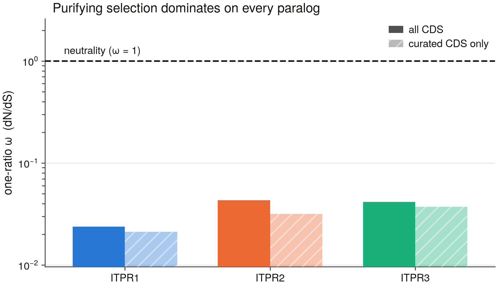
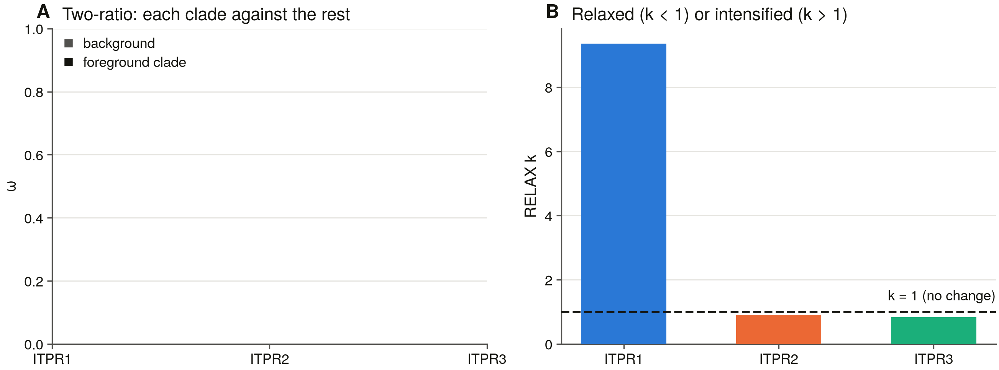
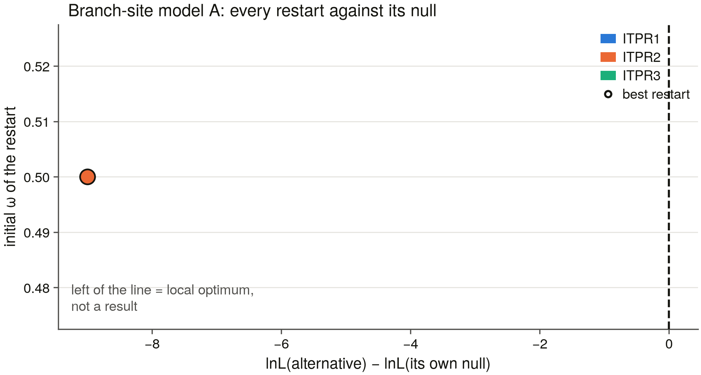

# S9 — ML selection across the ITPR family

Rendered from the committed tables by `scripts/s9_report.py` (D13). Every number below is in a TSV beside this file.

## 1. Scope — what a codon alignment of this family can be

dN/dS is a statement about codons, so every number below rests on a nucleotide sequence that provably encodes the *exact* protein S6 aligned and S7 built its tree from. Nothing here is a translated database record taken on trust.

- vertebrate family tips in S6's representative set: **57**
- validated CDS recovered: **57 / 57** (100.0 %)
- by route: `miniprot` 14, `uniprot` 43
- tips where the first CDS a route offered was **not** the aligned isoform: **2**
- codons masked to `NNN` across the whole set: **24**, of which 15 are internal stops in genome gene models

The RyR outgroup is deliberately absent. It roots S7's protein tree, but synonymous sites do not survive that distance — and as §4.2 shows, they barely survive the vertebrate span *inside* a paralog. A model fitted across the family/outgroup split would be estimating alignment error.

| selection set | tips |
|---|---|
| ITPR1 | 19 |
| ITPR2 | 13 |
| ITPR3 | 19 |
| background | 6 |

The three paralog sets are **S7's extended paralog clades**, not the census labels. codeml's branch models mark a *node*: a foreground that is not a clade does not fail, it silently marks a larger one and returns a well-formed ω for a hypothesis nobody asked. `s9_sets.py` re-derives each clade from `rooted.nwk` with S7's own rule and aborts unless it matches `paralog_clades.tsv` in size and membership.

The tree nests **7** `vertebrate_basal` loci carrying no paralog label of their own inside a paralog clade, and they are analysed there. That is D30 read forwards — outside the vertebrates a paralog label means nothing, but inside a 100/100-supported vertebrate paralog clade the tree has just supplied one.

**6** tips sit in no paralog clade at all. They stay in the whole-tree analyses, because dropping them would change the branch lengths every other estimate is made on, and they are in no foreground, because a locus the tree could not place is not evidence about a paralog.

They are *Myxine glutinosa* ×3, *Petromyzon marinus* ×3 — which is the *same six loci* S7 placed in two cyclostome-only clades and handed to S8, and that S8 reported as underpowered because after ~550 Myr there is no shared flank vocabulary left to compare. A third instrument now declines the same question for a third reason: a codon model can only ask about a paralog whose clade the tree defines, and for these six it defines none.

### 1.1 The codon alignment

- tips with a validated CDS: **57**
- codon alignment: 3253 codons
- trimAl -automated1 kept: **2459 codons** (75.6 %)
- tips the S7 tree places in no paralog clade (background only): 6

| set | tips | codons (trimmed subset) | note |
|---|---|---|---|
| ITPR1 | 19 | 2459 | 2 genome gene models |
| ITPR2 | 13 | 2459 | 2 genome gene models |
| ITPR3 | 19 | 2459 | 7 genome gene models |
| ITPR1 (curated CDS only) | 17 | 2459 | sensitivity subset |
| ITPR2 (curated CDS only) | 11 | 2459 | sensitivity subset |
| ITPR3 (curated CDS only) | 12 | 2459 | sensitivity subset |

## 2. Instrument — the models, and the traps in them

PAL2NAL builds the codon alignment and an **independent in-house protein→codon mapping is computed beside it**; a single nucleotide of disagreement aborts the build. trimAl's `-automated1` columns are chosen on the protein and applied codon-aware, whole triplets only.

- codeml jobs run: **19**, 4.1 h of CPU time
- likelihood-ratio tests: **6**, Benjamini–Hochberg corrected across the whole family
- branch-site model A restarted from initial ω = 0.5, 1.5, 2.5, 4.0 on every paralog stem
- pairwise dS above **1.5** is flagged saturated

Three of those are decisions, not settings.

**Branch-site model A is restarted by construction.** A nested alternative cannot have a lower optimum than its own null, yet codeml reaches one routinely on alignments this size — the PIEZO project hit exactly that and had to add restarts after the fact. Running four initial ω from the start makes "the best of several optima" the reported number rather than a repair, and `bs_restarts.tsv` commits the spread, so a stem that is *still* stuck is visible in the data.

**The branch-site LRT is tested against a 50:50 mixture.** Its null fixes ω₂ = 1 on the boundary of the parameter space, so 2ΔlnL is distributed as ½χ²₀ + ½χ²₁ and a plain χ²₁ p-value is twice too small. `lrt_table.tsv` carries both; the halved one is reported.

**BH runs across the whole LRT family.** S9 asks the same question three times, once per paralog. Reporting the smallest of three p-values uncorrected is the multiple-testing error this project's self-tests exist to avoid.

## 3. Self-tests

Twelve constructed negative controls run on every build of the codon alignment (`s9_test_codon.py`), each rejected by the rule responsible: a frame-shifted CDS, a CDS encoding a different protein, an internal stop that must be masked rather than refused, the requirement that an accepted CDS translate to its aligned protein modulo `X`, the gap-exactness of the in-house codon map, whole-triplet gap stripping, **a non-monophyletic foreground being refused**, `$1`-vs-`#1` labelling, unrooting, the locus-rerun difference bound in all three directions, and the S7 cross-check being able to fail at all. A codon alignment is the one artefact here where a silent error is invisible downstream — codeml will fit a model to a frame-shifted alignment and return a plausible ω — so these are checks on *refusal*, not on output appearing.

## 4. Results

### 4.1 Every paralog is under strong purifying selection

Prior: S6 §4.1 — mean covered-only identity *within* a vertebrate paralog group is 0.910, and the background (`docs/ip3r_background.md` §1) describes a 2,700-residue channel whose every domain is load-bearing. Nothing before S9 measured selection: identity is a distance, not a rate, and a conserved protein and a slowly evolving one are not the same statement.

| paralog | one-ratio ω | ω, curated CDS only | κ | tree length |
|---|---|---|---|---|
| ITPR1 | **0.0238** | 0.0212 | 1.633 | 11.37 |
| ITPR2 | **0.0430** | 0.0318 | 1.809 | 8.85 |
| ITPR3 | **0.0415** | 0.0371 | 1.973 | 11.12 |

The highest of the three is **ω = 0.0430** (ITPR2), which is 23× below neutrality.

**confirmed** — the identity S6 measured (mean 0.91 within a paralog) is a distance; this is a rate, and it says the same thing far more sharply — a 2,700-residue channel accumulating one non-synonymous change per 23 synonymous ones

The sensitivity subsets — the same paralogs with every genome gene model removed, so no masked frameshift or stop codon contributes — move ω by at most **0.0112**. The estimates are not an artefact of the miniprot models.

### 4.2 Synonymous sites are saturated across the vertebrate span — inside a paralog, not only between them

Prior: S6 §4.2 — mean covered-only identity *between* paralog groups is 0.791 (ITPR1×ITPR2), 0.753 (ITPR2×ITPR3) and 0.741 (ITPR1×ITPR3), against 0.910 within. The three paralogs are 2R products older than 500 Myr, so S9 expects synonymous sites between them to be saturated and every cross-paralog ω to be qualified by that.

| set | pairs | median dS | median dN | fraction dS > 1.5 |
|---|---|---|---|---|
| ITPR1 | 171 | 5.721 | 0.0659 | **94.2 %** |
| ITPR2 | 78 | 4.638 | 0.1017 | **84.6 %** |
| ITPR3 | 171 | 13.48 | 0.0977 | **85.4 %** |

This is the result that qualifies every ratio in this report, and it is stronger than the prior expected. S6's identities led S9 to expect saturation *between* the 2R paralogs. It is already reached **within** them: 94.2 % of within-paralog pairs in the worst set exceed dS = 1.5, because a single paralog set spans shark to teleost to mammal — 450 Myr of fourfold-degenerate sites.

**confirmed** — saturation is present and reaches further than the prior anticipated, so **the pairwise ω matrix is a diagnostic here and not an estimate**. Every ω quoted in this report comes from a tree-based model, which distributes substitutions over branches instead of asking one pair to carry 450 Myr

### 4.3 The three paralogs are not equally constrained

Two priors meet here, and they are priors about different things. S8 measured how well each paralog's *neighbourhood* travels; the background records which paralog carries the family's *clinical* burden. ω is neither of those — it is the coding sequence's own rate — so the verdicts below say what kind of agreement was available, not merely whether the numbers matched.

| rank | paralog | one-ratio ω |
|---|---|---|
| 1 | ITPR1 | 0.0238 |
| 2 | ITPR3 | 0.0415 |
| 3 | ITPR2 | 0.0430 |

Most constrained → least: **ITPR1 < ITPR3 < ITPR2**.

**confirmed** — ITPR1 is the most constrained of the three (ω 0.0238), which is what a paralog carrying a dominant missense disease burden should look like

**orthogonal** — ITPR3's neighbourhood is the one that does not travel, but its coding sequence is not the least constrained (ITPR2 is). Neighbourhood conservation is rearrangement history and ω is coding-sequence rate; they are different quantities and this is not a disagreement

**orthogonal** — recovery rate is a property of the assembly and the bait panel. S9 measures the gene's evolutionary rate, and the two are not comparable — stated so the reader is not invited to read one as the other

### 4.4 Branch-site model A on each paralog stem

The stem branch is where a duplicate's fate is decided: it is the interval between the duplication and the first surviving split of the new copy, and if a paralog was ever free to change, that is when. Model A asks whether a class of sites on that one branch has ω > 1 while the rest of the tree does not.

**underpowered** — no branch-site job has finished

### 4.5 Site models within each paralog

M2a vs M1a and M8 vs M7 ask whether *any* site in a paralog has ω > 1 across the whole clade — a different question from the stem, and the one that would find a site under recurrent positive selection anywhere in the vertebrate history of that copy.

| test | 2ΔlnL | df | q (BH) | ω of the extra class | its share of sites | sites at BEB ≥ 0.95 |
|---|---|---|---|---|---|---|
| M2a vs M1a within ITPR1 | 0.00 | 2 | 1 | **20.816** | 0.00000 | 0 |
| M8 vs M7 within ITPR1 | 19.35 | 2 | 0.000188 | **1.000** | 0.00307 | 0 |
| M2a vs M1a within ITPR2 | 0.00 | 2 | 1 | **36.481** | 0.00000 | 0 |
| M8 vs M7 within ITPR2 | 17.36 | 2 | 0.000339 | **1.000** | 0.00680 | 0 |
| M2a vs M1a within ITPR3 | 0.00 | 2 | 1 | **94.213** | 0.00000 | 0 |
| M8 vs M7 within ITPR3 | 19.43 | 2 | 0.000188 | **1.000** | 0.00394 | 1 |

**3 of 6 tests are significant after BH, and 0 of them is evidence of positive selection.** The likelihood-ratio test and the claim are different statements, and the columns above are what separates them:

- *M8 vs M7 within ITPR1* — the extra class sits at **ω = 1.00000**, codeml's boundary — a class of *unconstrained* sites, not positively selected ones, carrying 0.31 % of the alignment, with 0 site(s) reaching a 0.95 posterior.
- *M8 vs M7 within ITPR2* — the extra class sits at **ω = 1.00000**, codeml's boundary — a class of *unconstrained* sites, not positively selected ones, carrying 0.68 % of the alignment, with 0 site(s) reaching a 0.95 posterior.
- *M8 vs M7 within ITPR3* — the extra class sits at **ω = 1.00000**, codeml's boundary — a class of *unconstrained* sites, not positively selected ones, carrying 0.39 % of the alignment, with 1 site(s) reaching a 0.95 posterior.

So the honest reading is that **M8 fits better than M7 because this family has a small class of sites that are free to drift, not because any site is being driven**. A beta distribution on [0, 1] cannot represent a spike at the neutral boundary, so adding one class that lands exactly there improves the fit significantly and says nothing about adaptation. Reporting the three q-values without the class they are testing would turn "under 1 % of sites are unconstrained" into "positive selection in all three paralogs".

It is also consistent with everything else here: §4.1 puts ω between 0.02 and 0.05 across the whole protein, and M2a — which *is* free to place a class above 1, and does estimate one — gives it a proportion of exactly zero in all three paralogs.

### 4.6 RELAX — is any paralog's selection *relaxed*?

codeml's branch models ask whether a foreground's ω differs. RELAX asks whether the whole ω distribution on the test branches is pulled towards ω = 1 (relaxation, k < 1) or away from it (intensification, k > 1). In a family where every ω is far below 1, that is the sharper question, and it comes with its own test.

| test set | k | direction | p | LRT | test branches | reference branches |
|---|---|---|---|---|---|---|
| ITPR1 | **9.359** | intensified | < 1e-300 (underflow) | 11317.2 | 37 | 63 |
| ITPR2 | **0.908** | relaxed | 4.08e-11 | 43.6 | 25 | 74 |
| ITPR3 | **0.836** | relaxed | < 1e-300 (underflow) | 199.5 | 37 | 62 |

- **ITPR1**: k = 9.359 — selection is *intensified* relative to the other two paralogs (p < 1e-300 (underflow)).
- **ITPR2**: k = 0.908 — selection is *relaxed* relative to the other two paralogs (p 4.08e-11).
- **ITPR3**: k = 0.836 — selection is *relaxed* relative to the other two paralogs (p < 1e-300 (underflow)).

**The three copies have not been held to the same standard since 2R.** ITPR1 is under *intensified* selection relative to the other two, and ITPR2, ITPR3 under *relaxed* selection relative to theirs. That is the same ordering §4.1's one-ratio ω gives, arrived at by a different statistic on a different model — ω compares point estimates, k compares the whole distribution — so the two are a check on each other rather than one number told twice.

*1 non-finite literal(s) repaired while reading HyPhy's json.* The partitioned descriptive model estimates a per-branch ω, and a branch with no synonymous change gets an infinite one, which HyPhy writes as the bare token `inf` — not legal JSON. It is normal output, but the failure it causes is silent in the wrong direction: the analysis succeeds and the *parse* throws. On the first run that turned ITPR1's result into a blank row.

The unlabelled vertebrate tips the S7 tree places in no paralog clade are left **unlabelled** in these runs rather than swept into the reference: a branch whose paralog identity is unresolved is not evidence about either side of the contrast.

## 5. What this does not establish

1. **Synonymous saturation.** 88.8 % of all within-paralog pairs exceed the dS bar. Tree-based models handle this far better than pairwise ML, but they do not repeal it: an ω estimated where dS is poorly determined is a ratio whose denominator is soft, and every number here should be read as a lower bound on precision, not a point estimate with a small error.
2. **Genome gene models.** 14 of the CDS come from miniprot reconstructions with masked frameshift or stop codons. The curated sensitivity subsets in §4.1 show ω barely moves without them, but those models are also the only evidence for several lineages, so the subset is a control, not a replacement.
3. **The tree is conditioned on.** Every branch test is run on S7's topology. If the sister arrangement were wrong, the stems S9 marks would be the wrong branches — which is why S7 ran an AU test over all three arrangements before this task started, and why §4.4 records the dependency instead of quietly relying on it.
4. **This is a vertebrate result.** The non-vertebrate grade is not in the codon alignment at all. Nothing here says anything about the constraint on the single-copy receptors S20 and S23 found outside the vertebrates.

## 6. Figures

*Per-paralog one-ratio ω with the curated-CDS sensitivity estimate beside it, and neutrality drawn rather than described.*

*Pairwise dN against dS within each paralog, with the neutral diagonal and the saturation bar. The panel that qualifies every cross-paralog number in this report.*

*Two-ratio background vs foreground ω per paralog clade, and the RELAX k beside it.*

*Every branch-site restart against its own null. A point below the line is a local optimum, not a result — the reason this task restarts model A by construction.*

