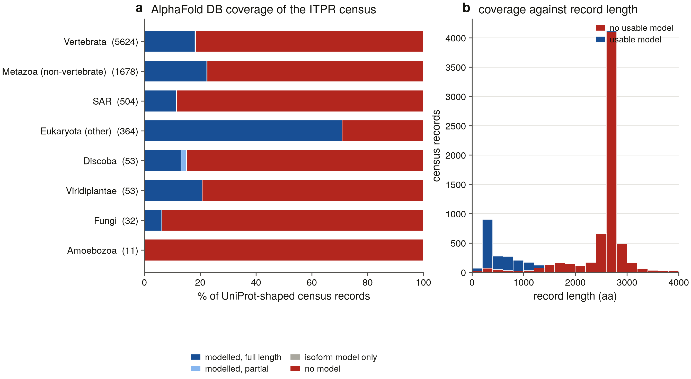
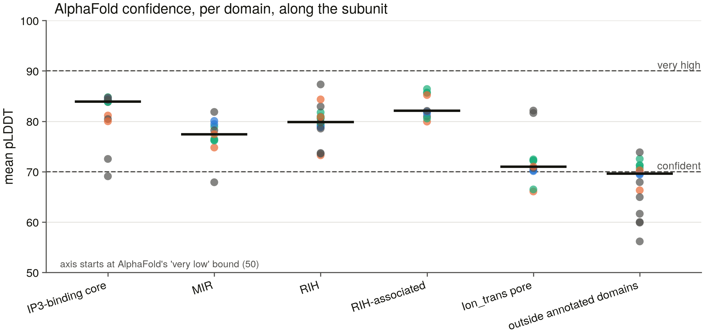

# S11 — structures

Two questions. **Does what the census calls an IP3 receptor fold like one?** — asked of predicted models against cryo-EM references, with negative controls setting the floor. And **can it be told from a ryanodine receptor by shape alone?** — D14 put to a sixth instrument, one that reads no gene symbol, no Pfam annotation, no alignment score and no tree.

The panel is **29** structures: 16 model, 5 reference, 5 state panel, 3 control. Every reference was resolved by an RCSB query over the family's own Pfam signatures and assigned to a family by this project's census, never by an entry title.

> TM-align 20240303. Scores are read against TM-align's own published bars — **0.17**, below which a pair is indistinguishable from two random structures of the same size, and **0.5**, above which they share a fold. Neither is a threshold this project chose.

> Every number below is read from a committed table in this directory. Nothing here is computed from a structure file, an API or a TM-align run at render time (D13).

## 1. What AlphaFold DB actually holds

A vertebrate IP3 receptor subunit is ~2,700 residues, which is where AlphaFold DB's monomer pipeline stops; the sister family at ~5,000 is past it outright. So the family's structural coverage is measured before anything is compared, and it is measured three ways that do not agree.

| scope | records | UniProt-shaped | full-length model | isoform model only | no model | usable (≥ 95 % covered) |
|---|---|---|---|---|---|---|
| reps | 134 | 90 | 6 | 5 | 79 | 9 (10.0 %) |
| census | 8,990 | 8,319 | 1,735 | 6 | 6,570 | 1,739 (20.9 %) |

**20.9 % of the census's UniProt-shaped ITPR records have a usable predicted model**, and of the 134 representatives S6 selected — the set every alignment, tree and selection result in this project stands on — **9** do.

> **Prior.** the S11 brief — "AFDB coverage of the family: … Expect it to be poor for ~2,700-residue proteins; that absence is itself a result." This is the one prior in the list that is a *guess written in advance*, which is exactly why it is worth writing down before measuring.
>
> **This task.** 20.9 % of census records and 9/134 representatives are modelled at full length.
>
> **confirmed**

### The isoform trap

AFDB is keyed on a UniProt accession but answers with whatever record it holds, and that record may be an **isoform**. Asked for the three human paralogs it returns `Q14643-4` (2,695 aa of a 2,758-residue protein), `Q14571-2` — **181 residues of a 2,701-residue protein** — and the canonical `Q14573`. A probe that took the first record and called it a hit would report the family's reference paralogs as fully modelled. Coverage here is therefore the modelled span against the length the census holds, and the 181-residue ITPR2 model is carried into the panel and rejected there by the minimum-chain rule rather than quietly used.

### Coverage is a function of length, not of taxonomy

The median modelled record is **392 aa**; the median unmodelled one is **2,674 aa**. Of the 5,861 census records at or above the family's own 2,000 aa floor — the plausibly full-length ones — **13** (0.2 %) have a usable model. The coverage AFDB offers this family is concentrated on its *fragments*, which are the records a structural argument can do least with.

**Figure 1.** AlphaFold DB coverage of the ITPR census, by group (**a**) and against record length (**b**). Panel **b** is the result: the usable-model mass sits below ~1,300 residues while the peak at ~2,700 — a full-length receptor subunit — is almost entirely unmodelled.

## 2. The references, resolved by query

The brief is emphatic that reference structures are resolved by a query and not from memory, and this family makes the reason concrete: the IP3 and ryanodine receptor entries share every diagnostic Pfam and half their titles. So the candidate set is enumerated from RCSB by the family's own signatures — **237** entries, **414** polymer entities — and each entity's family is decided by *this project's census*, on the UniProt accession RCSB maps it to. No title is read.

| eligibility | entities |
|---|---|
| R1 not called family | 192 |
| eligible | 117 |
| R4 state not readable | 81 |
| R2 not cryo-EM | 22 |
| R5 paralog not named by the census | 2 |

The cryo-EM restriction is a measurement about what exists, not a preference. The **9** X-ray ITPR entities in the candidate set run 226–2,217 aa at 1.90–7.40 Å, against full-length cryo-EM entities of 2,453–2,771 aa — and the longest X-ray construct (5GUG, 2,217 aa, 7.40 Å) is also the lowest-resolution structure the family has. Every one of them is a truncation, so an X-ray reference would make each TM-score a statement about part of a subunit.

### Primary references (R5 — best resolution per paralog)

| paralog | entry | resolution (Å) | organism | state | ligands modelled |
|---|---|---|---|---|---|
| ITPR1 | 7LHF | 2.96 | *Rattus norvegicus* | apo | — |
| ITPR2 | 9YKK | 2.95 | *Homo sapiens* | apo | — |
| ITPR3 | 8TKG | 2.50 | *Homo sapiens* | resting | ATP+Ca2++IP3 |
| RYR1 | 9NMO | 2.40 | *Mus musculus* | closed | ATP+Ca2++caffeine |
| RYR2 | 7U9X | 2.58 | *Homo sapiens* | closed | ATP |

**No RYR3 reference exists.** No cryo-EM entry in the candidate set carries a full-length RYR3 entity the census names, so nothing in this report is scored against a RYR3 structure.

### The state panel (R6 — 6 conformations of one paralog)

A model scored against a single conformation confounds the fold question with the gating question. The state panel is the control on that: several experimental structures of the *same* protein, so the report can say how much of a TM-score difference is conformation before it attributes any to fold. The table lists 5; the remaining conformation is the primary reference above, which is the same file and is not downloaded twice.

| state | entry | resolution (Å) | ligands modelled |
|---|---|---|---|
| activated | 8TKF | 3.20 | ATP+Ca2++IP3 |
| apo | 6DQJ | 3.49 | — |
| higher-order inhibited | 8TLA | 3.20 | ATP+Ca2++IP3 |
| labile resting | 8TKH | 3.50 | ATP+IP3 |
| preactivated | 7T3P | 3.20 | ATP+IP3 |

### Negative controls (R7)

Drawn from **S1's committed decoy panel**, one per decoy class, rather than invented here — so S11's floor is set by the same proteins S1 validated the discovery scorer against. Each is held to the same cryo-EM and full-length rules as a reference, and picked to be *size-matched* to the family reference: TM-score is length-normalised, but the score two unrelated structures can reach still depends on their size ratio.

| class | protein | entry | chain length | resolution (Å) |
|---|---|---|---|---|
| giant (out of band) | DYNC1H1 | 9BLZ | 4,646 | 2.20 |
| in-band channel | CACNA1A | 8X93 | 2,549 | 2.92 |
| in-band non-channel | Tln1 | 8VDO | 2,804 | 2.70 |

**Unfilled control classes.** A class with no qualifying structure is named with the stage that lost it, never dropped:

- `MIR-domain sharer` (2 decoys) — no experimental entry

## 3. The panel

Nothing enters the panel unread. Every file is parsed, reduced to **one chain** — both families are homotetramers and an IP3R assembly is ~11,000 residues, so scoring a monomer model against a deposited assembly would answer a question about quaternary structure — and measured. `model_coverage` in the manifest is *resolved residues over the length the census holds*, not what an API advertised.

**29** of 30 structures are usable.

| rejected | role | reason |
|---|---|---|
| `model_Q14571` | model | too_short: 181 residues < 300 |

The rejected row is the ITPR2 isoform model — the trap in §1, caught by a rule rather than by inspection.

### Which slots the models fill

The S6 representative set has a usable model for very few of its tips, so a panel built from representatives alone would be six proteins and no non-vertebrate breadth. Where a slot has no representative model, the best-covered census record in that slot stands in, and the audit records that the slot was *filled* rather than met.

| slot | census records | outcome | filled with |
|---|---|---|---|
| Amoebozoa | 16 | unfilled — no AFDB model at any coverage | — |
| Discoba | 63 | filled from census | A0A6A5BJU9 |
| Eukaryota (other) | 865 | filled from census | A0AAN0K328 |
| Fungi | 36 | filled from census | A0A4P9Y2S6 |
| ITPR1 | 1,358 | met by representative | — |
| ITPR2 | 1,006 | met by representative | — |
| ITPR3 | 813 | met by representative | — |
| Metazoa (non-vertebrate) | 1,808 | met by representative | — |
| SAR | 521 | filled from census | G0QNB9 |
| Vertebrata | 2,447 | filled from census | A0AAD9FCG5 |
| Viridiplantae | 57 | filled from census | A0AAE0F2K9 |

**Figure 2.** Every structure in the panel: the pale bar is the sequence length the record claims, the filled bar what the structure actually delivers. Faded rows failed the 300-residue minimum.

## 4. What a TM-score means on this panel

Before any structure is called, the scale is calibrated on this panel rather than taken from the literature. Five classes of pair, each answering a different question, and the negative controls are what put a floor under all of them.

TM-align normalises by each input's length, and on this panel the two normalisations say different things: an IP3 receptor subunit resolves to ~2,200 residues and a ryanodine receptor to ~4,300, so **which chain a cross-family score is normalised by decides whether it reads as a fold result or a size one**. Both are given.

| comparison | pairs | median TM, by the longer chain | median TM, by the shorter | range (longer) |
|---|---|---|---|---|
| same protein, different state | 51 | **0.78** | 0.85 | 0.57–0.98 |
| IP3R vs IP3R | 225 | **0.43** | 0.68 | 0.18–0.94 |
| IP3R vs RyR | 48 | **0.39** | 0.64 | 0.16–0.43 |
| RyR vs RyR | 1 | **0.90** | 0.93 | 0.90–0.90 |
| control vs anything | 81 | **0.19** | 0.25 | 0.09–0.25 |

The negative controls span **0.09–0.25** with a median of **0.19**, and **0 of 81** control pairs reach the 0.5 same-fold bar under either normalisation (best control score anywhere: 0.35). That is the floor this task's positive results are read against, measured on proteins S1 chose as decoys for a *sequence* scorer and re-used here without reselection.

> **Prior.** S0's structural measurement and the review §3 — the family's cryo-EM series resolves apo, resting, preactivated, activated and inhibited states of the *same* protein. If those states moved TM-score as much as paralog identity does, no fold claim in this task would be readable, so the state panel is a control on S11's own instrument.
>
> **This task.** Two structures of the same paralog in different conformations score a median **0.78**; two different IP3 receptors score **0.43**, a spread whose lower tail is the partial non-vertebrate models rather than a fold difference (§6). Conformation is worth 0.22 of TM-score on this panel, so a fold difference of that size or less is not readable and is not claimed.
>
> **confirmed**

> **Prior.** S1 — ITPR-to-RyR covered-only sequence identity is 0.249, against 0.828 within the family; S6 confirmed both on the representative alignment. Structure is a different quantity from identity and the two families are known to share the channel fold, so what S11 can add is the *size* of the structural gap, not a repeat of the sequence one.
>
> **This task.** The two families sit at a median TM of **0.39** normalised by the ryanodine receptor and **0.64** normalised by the IP3 receptor, against **0.43** within the IP3 receptors, where the sequence gap is 0.828 within against 0.249 between. The two cross the bar in **one direction only**: a ryanodine receptor accounts for an IP3 receptor's fold (0.64) while an IP3 receptor cannot account for a ryanodine receptor's (0.39), which is as much a statement about a 2,200-residue protein being aligned into a 4,300-residue one as about fold.
>
> **orthogonal**

**Figure 3.** The family call, structurally (**a**) and the calibration behind it (**b**). Both of TM-align's published bars are drawn — 0.17 (random) and 0.5 (same fold) — rather than described. Panel **b** uses the conservative normalisation (by the longer chain).

## 5. D14, asked of shape

Every stage of this project has had to separate IP3 from ryanodine receptors by a positive test. This is the sixth instrument to be asked, and the first that reads no gene symbol, no Pfam architecture, no alignment score and no tree — only coordinates.

The test is the best TM-score against the IP3R references, the best against the RyR references, and a **relative** margin of 10% between them — relative for the reason `s3_assign.py` gives, that an absolute gap would call every full-length structure and no fragment. Scores are normalised **by the reference**, which is the question being asked: does this structure account for an IP3 receptor, or for a ryanodine receptor?

A margin is only consulted once the winner clears the 0.5 same-fold bar. That gate is not decoration: all three negative controls beat their own runner-up by about 30 % of their score while scoring 0.17–0.27 against everything, so a rule gated on the margin alone calls a dynein heavy chain an IP3 receptor. With the gate, they are declined.

| structural call | structures |
|---|---|
| ITPR | 18 |
| below_fold_bar | 9 |
| RYR | 2 |

**20 of 20** structures the instrument could call, whose family the census also names, are called the same way by shape (100.0 %) — and **0 of 3** negative controls receives a family call.

The instrument declines **6** further census-named structures. A refusal is not a disagreement, and none of these is scored as one:

| structure | census call | best vs IP3R | best vs RyR | modelled residues | why declined |
|---|---|---|---|---|---|
| `model_A0AAD9FCG5` | ITPR | 0.45 | 0.22 | 1,274 | top score 0.454 is below the 0.5 same-fold bar — no family call |
| `model_A0AAE0F2K9` | ITPR | 0.41 | 0.19 | 1,135 | top score 0.4116 is below the 0.5 same-fold bar — no family call |
| `model_A0AAN0K328` | ITPR | 0.37 | 0.19 | 1,274 | top score 0.3666 is below the 0.5 same-fold bar — no family call |
| `model_A0A6A5BJU9` | ITPR | 0.36 | 0.17 | 1,238 | top score 0.3554 is below the 0.5 same-fold bar — no family call |
| `model_G0QNB9` | ITPR | 0.35 | 0.17 | 1,273 | top score 0.3459 is below the 0.5 same-fold bar — no family call |
| `model_A0A4P9Y2S6` | ITPR | 0.30 | 0.16 | 1,019 | top score 0.2953 is below the 0.5 same-fold bar — no family call |

Every one of them still prefers the IP3 receptors over the ryanodine receptors by roughly 2:1; what they cannot do is account for enough of a reference to earn a call. These are the partial, low-confidence models AlphaFold DB holds for the non-vertebrate groups (§1), and §6 separates how much of the shortfall is their length from how much is their similarity.

> **Prior.** D14, and every stage since S2 — the ITPR/RyR separation has been a positive test at architecture (S2), profile (S3), alignment score (S5), tree (S7) and neighbourhood (S8) level, agreeing with the census call every time. S11 asks the same question of a sixth instrument that reads none of the same evidence: shape.
>
> **This task.** 100.0 % of the structures the fold test could call agree with the census (20/20), and no negative control is called at all (0/3).
>
> **confirmed**

## 6. Do the deep records fold like receptors?

This is the question S11 is worth most on. The plant, fungal, SAR, Discoba and non-vertebrate metazoan records were called ITPR on sequence evidence alone — profile score, architecture, and in S20's case a per-record contamination chase. None of that is shape.

| group | model | modelled residues | best vs IP3R | ceiling | ref | best vs RyR | call |
|---|---|---|---|---|---|---|---|
| Discoba | `A0A6A5BJU9` | 1,238 | **0.36** | 0.60 | ITPR3_7T3P | 0.17 | below_fold_bar |
| Eukaryota (other) | `A0AAN0K328` | 1,274 | **0.37** | 0.63 | ITPR3_8TLA | 0.19 | below_fold_bar |
| Fungi | `A0A4P9Y2S6` | 1,019 | **0.30** | 0.50 | ITPR3_8TLA | 0.16 | below_fold_bar |
| SAR | `G0QNB9` | 1,273 | **0.35** | 0.62 | ITPR3_7T3P | 0.17 | below_fold_bar |
| Viridiplantae | `A0AAE0F2K9` | 1,135 | **0.41** | 0.55 | ITPR3_7T3P | 0.19 | below_fold_bar |
| invert_metazoa | `Q8WSR4` | 2,698 | **0.94** | 1 | ITPR3_6DQJ | 0.43 | ITPR |
| invert_metazoa | `Q9Y0A1` | 1,713 | **0.57** | 0.84 | ITPR3_7T3P | 0.28 | ITPR |

**2 of 7** deep models reach the 0.5 same-fold bar against an IP3 receptor, and **2** are called ITPR rather than RyR or no-call.

The **ceiling** column separates how much of that shortfall is length from how much is similarity. A reference-normalised TM-score divides by the reference's length, so a model of *n* residues scored against an *L*-residue reference cannot exceed *n/L* before similarity is considered at all. Most of these models are 1,000–1,300 residues — the only records AlphaFold DB holds for these groups (§1) — against ~2,050-residue references. None of them is excluded by arithmetic alone — every one had the headroom to pass and did not.

So the shortfall is only partly about length: each declined model reaches 0.56–0.74 of its own ceiling — far above the negative controls and far below a full-length receptor. That is what a genuinely divergent homolog modelled at a mean pLDDT in the low 60s (§7) should look like. The fold test neither confirms nor contradicts these records; it does not reach them.

> **Prior.** S20 and S23 — the family's range reaches Viridiplantae, Fungi, SAR, Discoba and Amoebozoa, and S20's per-record verdicts chased each plant and fungal record for contamination rather than accepting it. Those records are the ones a fold test is worth most on: they are held on sequence evidence alone.
>
> **This task.** 2 of 7 non-vertebrate models are assigned to the IP3 receptors by fold. The rest prefer the IP3 receptors over the ryanodine receptors by roughly 2:1 but fall short of the same-fold bar — and, having had the headroom, fall short on similarity and not on length alone.
>
> **underpowered**

## 7. Where the models are confident

A mean pLDDT over a 2,700-residue multi-domain channel averages a well-predicted β-trefoil with hundreds of residues of linker, and the resulting single number is high enough to look reassuring while saying nothing about the part any claim rests on. Confidence is reported per domain, with the boundaries S0 measured on the human paralogs transferred by pairwise alignment; a domain that lands on too little of its reference span is reported **unplaced** rather than averaged over whatever aligned.

The `shared with` column is a statement about the *domain*, not about the function: PF08709 is annotated on the ryanodine receptors too — its Pfam name is "Inositol 1,4,5-trisphosphate/ryanodine receptor" — and what the IP3 receptors do not share is the ligand that binds in it.

| domain | Pfam | shared with | models | median pLDDT | min | max | ≥ 70 |
|---|---|---|---|---|---|---|---|
| IP3-binding core (β-trefoil) | PF08709 | shared | 14 | **83.88** | 69.09 | 84.79 | 13 |
| MIR | PF02815 | shared | 11 | **77.43** | 67.90 | 81.86 | 10 |
| RIH | PF01365 | shared | 22 | **79.75** | 73.25 | 87.32 | 22 |
| RIH-associated | PF08454 | shared | 10 | **82** | 79.94 | 86.41 | 10 |
| Ion_trans pore | PF00520 | generic | 11 | **71.01** | 66.07 | 82.13 | 9 |
| outside annotated domains | - | none | 16 | **69.50** | 56.16 | 73.85 | 6 |

> **Prior.** the review §2 and S22's scope — PF08709 is annotated on *both* families (its Pfam name is "Inositol 1,4,5-trisphosphate/ryanodine receptor", and S0 measured it on RYR1/2/3 as well as on ITPR1/2/3), but only the IP3 receptors bind IP$_3$ there — the β-trefoil is shared as a *domain* and unshared as a *function*. S22 is scoped around it, so whether AlphaFold models it well decides whether S17 and S22 can stand on predicted structures at all.
>
> **This task.** The IP3-binding core is modelled at a median pLDDT of **83.88** — the highest of any domain in the table — against **69.50** outside the annotated domains, while the pore, the part the two families genuinely share as a working channel, is the worst-modelled domain of the receptor. The ligand-binding core is among the better-modelled parts, not among the worse.
>
> **confirmed**

**28** domain slots could not be placed at all, concentrated in the short non-vertebrate models: RIH (10), RIH-associated (6), MIR (5), Ion_trans pore (5), IP3-binding core (β-trefoil) (2).

**Figure 4.** AlphaFold confidence per domain, ordered along the subunit from the N-terminal IP3-binding core to the pore. Points are coloured by paralog; the horizontal rules are AlphaFold's own confident (70) and very-high (90) bands.

## 8. Foldseek sweep

A structure-first search of the **afdb_swissprot** subset of AlphaFold DB, run from the IP3 receptor references (3 queries). The subset is named in every output row because a negative here is a negative about a *declared* space, which is the roadmap's scoping rule applied to a structural search.

A hit is only a receptor if it explains the *whole* query. Foldseek's own `qtmscore` cannot carry that: on this data a 191-residue alignment against a 2,300-residue query still comes back at 0.72. Coverage is therefore computed as aligned length over the query chain's own length.

| verdict | hits |
|---|---|
| below the same-fold bar | 545 |
| confirms census ITPR | 36 |
| shared domain, not a receptor | 10 |

**No novel structural lead.** Nothing in the reviewed proteome reaches the same-fold bar across a majority of an IP3 receptor without already being in the census. Given how little of the family AlphaFold DB holds (§1) this is a weak negative about the *family* and a clean one about the *subset*: within Swiss-Prot's predicted structures there is no unrecognised IP3-receptor-shaped protein.

### What it does return: the shared domain

The **8** distinct above-bar hits the census has never held are all short, high-scoring matches to one domain — median coverage 0.09 of the query.

| accession | gene | protein | Pfam | organism | TM | query covered |
|---|---|---|---|---|---|---|
| Q9HCN8 | SDF2L1 | Stromal cell-derived factor 2-like protein 1 | PF02815 | *Homo sapiens* | 0.79 | 0.09 |
| Q9ESP1 | Sdf2l1 | Stromal cell-derived factor 2-like protein 1 | PF02815 | *Mus musculus* | 0.78 | 0.09 |
| Q3T083 | SDF2L1 | Stromal cell-derived factor 2-like protein 1 | PF02815 | *Bos taurus* | 0.78 | 0.09 |
| Q99470 | SDF2 | Stromal cell-derived factor 2 | PF02815 | *Homo sapiens* | 0.78 | 0.09 |
| Q93ZE8 | SDF2 | Stromal cell-derived factor 2-like protein | PF02815 | *Arabidopsis thaliana* | 0.76 | 0.09 |
| Q54P23 | — | Stromal cell-derived factor 2-like protein | PF02815 | *Dictyostelium discoideum* | 0.75 | 0.09 |
| Q9DCT5 | Sdf2 | Stromal cell-derived factor 2 | PF02815 | *Mus musculus* | 0.75 | 0.09 |
| Q3SZ45 | SDF2 | Stromal cell-derived factor 2 | PF02815 | *Bos taurus* | 0.73 | 0.09 |

Every one of them carries **PF02815 (MIR) and nothing else** — the domain the IP3 receptors share with the O-mannosyltransferases and the SDF2 proteins. That is the one negative-control class §2 could not fill from the PDB, and the structural sweep finds it unprompted: the sharpest thing in the reviewed proteome that is shaped like part of this family is the part the family does not own.

> **What this sweep cannot find.** AlphaFold DB holds no ryanodine receptor model at all — at ~5,000 residues they are past its ceiling, and the API returns 404 for RYR1. So the absence of a `sister family (D14)` verdict here is unreachable by construction, not an observation.

## 9. What this task does not establish

- **The panel is small, and it is small for a reason that is itself the result.** 16 predicted models, of which 7 are under 2,000 residues, because AlphaFold DB holds full-length models for a small minority of this family (§1). A structural argument over the whole census is not available from public predictions and would need models generated for the project.
- **A TM-score is not an orthology statement.** The IP3 and ryanodine receptors are one fold — they score above the 0.5 bar against each other (§4) — so shape separates them by a margin, not by presence and absence. It corroborates D14; it could not have established it.
- **Every reference is one chain of a tetramer.** Nothing here tests quaternary structure, and the family's assembly is where much of its regulation lives.
- **Conformation is a floor on resolution.** The state panel puts a number on how much TM-score moves between structures of the same protein (§4); differences smaller than that are not read.
- **pLDDT is a confidence, not an accuracy.** A domain at 85 is a domain AlphaFold is confident about, which is not the same as a domain that is right — and for the deep non-vertebrate records there is no experimental structure to check it against.

## Outputs

- `afdb_coverage_reps.tsv` / `afdb_coverage_census.tsv` / `afdb_coverage_summary.tsv` — the AFDB probe, per record and summarised, with UniProt's cross-reference beside what the API serves
- `reference_candidates.tsv` — every RCSB entity carrying a family Pfam, with its family call and the rule that admitted or excluded it
- `reference_selection.tsv` — the references, the state panel and the controls, each with the rule that picked it
- `control_candidates.tsv` / `unfilled_controls.tsv` — the decoy structures considered, and the classes that had none
- `model_slots.tsv` — which taxonomic slot each predicted model fills, and which were left unfilled
- `structure_manifest.tsv` — the panel: chain used, resolved residues, coverage, resolution, state, path and SHA-256
- `tm_scores.tsv` — every TM-align pair, both normalisations
- `tm_vs_reference.tsv` — the structural family call with its margin
- `plddt_domains.tsv` / `plddt_summary.tsv` — per-domain confidence
- `structures_stats.json` — parameters, self-test status and the SHA-256 of every table
- `figures/` — four figures (D13, D19)

