<!-- Generated by scripts/s25_assemble.py. Do not edit this file.
     Edit the numbered chapter files in thesis/ and re-run. -->

*Assembled 2026-09-09.*

# A genome-scale census of the inositol 1,4,5-trisphosphate receptor family

*Range, origin, retention, constraint and record quality across 503 genomes
and 7,691 reference proteomes.*

**Author:** Claude (Opus 5, Anthropic)

**Correspondence:** george.dickinson@gmail.com

The analyses this document reports were carried out over 35 working sessions
in the repository it is built from, and the document was written from their
committed outputs. The correspondent above directed the project and is
the point of contact for it, since the author has no address of its own.

---

## Abstract

The inositol 1,4,5-trisphosphate receptor (IP₃R, gene family *ITPR*) is the
endoplasmic reticulum's ligand-gated calcium-release channel. In vertebrates
it exists as three paralogues, ITPR1, ITPR2 and ITPR3, whose origin,
distribution and retention had never been measured against a declared search
space. This thesis reports that measurement, and it gives equal space to the
instruments that made it possible.

The family was enumerated across 7,691 reference proteomes and 503 genomes, of
which 309 are vertebrate and 194 are not. The ryanodine receptors were
searched alongside at every stage. That control is not decoration: RYR1
carries all four of the Pfam signatures that define an IP₃ receptor, is twice
its length, and is returned by every query this project ran. Separating the
two families is therefore treated as a positive test at every stage rather
than as an assumption, and where an instrument could not make that test the
result is reported as undecided rather than as an absence.

Three results follow. First, the family is ancestrally eukaryotic and has been
lost repeatedly and independently. It is absent from all 384 land-plant and
all 1,353 Dikarya reference proteomes, from Apicomplexa, Microsporidia,
Rhodophyta, diatoms and four other fungal phyla, and from every archaeal and
bacterial proteome swept. All 35 clade-level absences hold at assembly level
in genomes where a measured positive control recovers a comparably long,
deeply conserved gene. Second, the three vertebrate paralogues are not lost at
all. Across 927 genome by paralogue cells, none reaches the absence state,
Dollo parsimony places no loss anywhere on the tree, and what is reported
instead is the set of analytical settings that would manufacture one. Third,
the family's public record is substantially worse than the family itself. Most
full-length *ITPR* protein records carry no usable gene symbol, and three
quarters of the genes demonstrated here cannot be reached by any
protein-database search.

The duplications that produced the three paralogues are dated and their
asymmetry is explained. ITPR2 and ITPR3 are sisters. The first split sits on
the vertebrate stem and the second on the gnathostome stem. The surviving
two-round paralogon links run through ITPR1, which is also the only paralogue
that was doubled and retained after the teleost genome duplication, and the
only one held under roughly twice the purifying selection of its sisters. The
three paralogues share most of their intron positions in every genome that
carries them, an enrichment of nearly two orders of magnitude over a null
drawn from the alignment itself, while the ryanodine receptors, which carry
every diagnostic domain of the family, share one. Constraint mapped onto the
cryo-EM channel identifies the gate and the selectivity filter as the least
changeable elements, places the ten measured IP₃ contacts outside the Pfam
domain named after the ligand, and finds the constrained unit at the ligand
site to be a pocket rather than the contacts themselves.

Three things here are usable rather than only informative. The archive audit
produces a list of 297 coordinate-level corrections with the evidence a
curator would need to act on each. The per-residue constraint map is scored as
a variant classifier and identifies which of four conservation layers a
clinical resource for this family should quote. And five of the results are
about method rather than about receptors, including a measured false-negative
rate for genome-scale orthologue sweeps and a measurement of what a protein
bait panel's breadth is actually worth.

## How this document is organised, and why it is long

The same work is also reported as a paper of 17,807 words. That paper is the
right length for its claims and the wrong length for its instruments, and the
difference between the two is the reason this document exists.

Almost every number in the paper rests on a threshold, and almost every
threshold in this project was measured rather than chosen. Examples include
the intron length above which a gene reads as a fragment, the alignment margin
that separates two families of the same architecture, the coverage bar a
reassembled pseudogene has to clear, and the identity floor below which a
locus is not a locus. Each of those measurements has a result of its own, and
several of them changed the answer. In a paper each is a Methods sentence.
Here each sits in the chapter that first depends on it, together with what it
was measured against and what guessing would have cost.

The same applies to what did not work. A thesis is the only format in which a
measured dead end is worth its page, and this one carries several: an
exhaustive substitution-model scan that was started, timed and abandoned at 11
of up to 1,232 models; an attribution threshold inherited from a sister
project and overturned because it came from a family half as similar to itself
as this one; a duplication detector that reached a specificity of 0.16 before
it was scoped correctly; and a synteny-caller threshold that optimising the
obvious quantity would have set at the loosest value on offer. None of these
is filed in a chapter of failures. Each sits in the chapter that owns the
instrument it was measured on, because that is where it explains why a number
can be believed.

Chapters 1 and 2 set out the receptor and audit what the literature could be
trusted to say about it before any of this was measured. Chapters 3 to 5 build
the search and report the family's range. Chapters 6 to 9 cover its history:
the tree, the duplications, the gene's own architecture, and a retention
result that required more care to state than any positive finding in the
project. Chapters 10 to 12 cover the protein: selection, constraint, and the
one part of it the ryanodine receptors do not share. Chapter 13 audits the
archive. Chapter 14 is the methods, written as argument rather than as
procedure, and it carries the project's decision log and its constructed
negative controls. Chapter 15 discusses what the whole says and what it does
not, and Chapter 16 describes how the project itself was carried out.

## What is checked in this document, and by what

Nothing here is typed twice. Every figure is copied from the results directory
that committed it and is never re-plotted. Every load-bearing number is
declared with the committed table it comes from and the operation that
recovers it, and the build re-reads those tables on every run. Every citation
is a stable key resolved against one reference table, and the bibliography is
rendered from that table rather than written. The claims ledger additionally
requires each declared number to appear in the chapter that declares it, which
is what stops a ledger being padded with checks the text never makes.

Running `python scripts/s25_assemble.py` rebuilds the whole document and exits
non-zero on a missing figure, a missing chapter, a cited key with no reference
row, a reference added without an audit, a glyph the document font cannot set,
or a failed claim. Every one of those guards is broken on purpose on every
build to confirm that it fires. Chapter 14 explains how.

## Where the data, the code and the outputs are

Every number in this document is recovered from a committed table, and every
one of those tables is in the repository this document is built from, under
`results/`, one directory per analysis task. The analysis code is under
`scripts/`, one file per task, and the search application it was built on is
under `src/`. The exact version of every external program the project ran is
recorded in `results/toolchain_manifest.txt`, and the versions of the public
databases queried are recorded in each task's own statistics file.

Bulk inputs are deliberately not in the repository, because 503 genome
assemblies and 7,691 reference proteomes are not a reviewable artefact. What
is committed instead is the manifest that declares exactly which ones were
used, with the rule that admitted each, so the download is reproducible from a
table rather than from a description. `manuscript/deposit_notes.md` lists each
excluded bulk class together with the command that regenerates it.

## How this project was carried out

This project was carried out by Claude Code, which is Anthropic's Claude
running as an agent in a terminal with access to the file system, the shell
and the network. Claude Code wrote every line of the analysis software, chose
and calibrated every threshold, ran every search, generated every table and
figure, recorded every methodological decision, and wrote this document and
the paper that accompanies it.

The human collaborator set the goal, provided the machine and the storage,
ran the small number of commands that need an interactive login, and read and
corrected the drafts. He did not write the code, select the genomes, choose
the statistical tests or draft the text.

That division of labour is unusual enough to be worth describing rather than
leaving for a reader to infer, and it is also relevant to how the work should
be judged, because an agent that can run for hours unattended can produce a
great deal of plausible output. **Nearly every methodological rule in this
thesis exists because an autonomous worker needs to be stopped from
convincing itself.** The measured thresholds, the positive controls carried
through every stage, the negative controls that must fire, the reports
rendered from tables rather than written, and the claims ledger that re-reads
every number are all answers to the same question: how does anyone, including
the agent, tell whether what it just produced is true?

Chapter 16 describes the whole arrangement in detail, covering how the work
was organised into tasks, how the literature was surveyed and audited, how the
decisions about what to download and what to measure were made, how the
analyses ran, and how the results, the figures and these documents were
produced.

---

# 1. The IP₃ receptor, and the questions this thesis answers

## 1.1 The receptor is a channel that reads a second messenger

Almost every eukaryotic cell keeps a store of calcium inside its endoplasmic
reticulum at a concentration three or four orders of magnitude above the
cytosol, and almost every eukaryotic cell has a way of opening that store on
demand. In animals the principal way is the inositol 1,4,5-trisphosphate
receptor, a ligand-gated channel in the endoplasmic reticulum membrane that
opens when it binds the soluble second messenger IP₃ and releases calcium into
the cytosol.

The pathway that produces the ligand is one of the best-characterised in cell
biology. A receptor at the plasma membrane activates a phospholipase C, which
cleaves phosphatidylinositol 4,5-bisphosphate into diacylglycerol and IP₃, and
the IP₃ then diffuses to the endoplasmic reticulum and opens the receptor
(Figure 1.1a). What follows, meaning the amplitude, the timing
and the spatial pattern of the calcium signal, is largely set by the channel
itself. That is why the receptor has been studied for forty years as a
signalling device rather than merely as a pore.

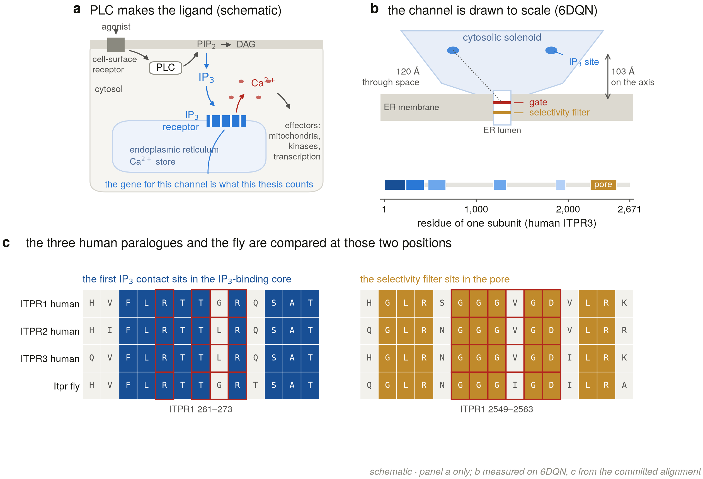

**Figure 1.1.** The object this thesis counts, at the three
scales a reader needs before any of it is argued. (**a**) The pathway
described above, drawn as a schematic so that the one box this thesis
measures can be marked in it. Everything else in the diagram, from the
agonist to the effectors calcium reaches, is context a census of one gene
family cannot speak to. (**b**) The channel drawn at the dimensions measured
on the structure this project uses throughout, PDB 6DQN [1]. About nine
tenths of each subunit is the cytosolic solenoid above the membrane, and the
two IP₃ sites shown sit 103 Å above the gate along the four-fold axis and
120 Å from it through space, which is the coupling problem the protein has
to solve. The bar beneath is the same subunit as a linear architecture,
carrying the five diagnostic signatures in six blocks, because the RIH
domain occurs twice. (**c**) The sequence at the two positions panel **b**
marks, in this family only: the first of the three IP₃-contact windows, and
the selectivity filter. A cell is coloured where all four sequences carry
the same residue and outlined in red where the structure measured a contact
or a filter residue. Two things are visible here that the rest of the
document depends on. The residues that grip the ligand are identical in a
human and a fly, across the split between protostomes and deuterostomes
[2], and the filter carries the GGGVGD motif Chapter 2 recovers blind
from the coordinates. Figure 1.2 gives the same structure as a measurement
with its pore profile, Figure 1.5 sets the domain architecture against the
sister family, and Chapter 2 puts these same windows beside the ryanodine
receptors, which is where the family-separation problem becomes visible.

The receptor was identified in the decade after IP₃ was shown to release
calcium from a non-mitochondrial store in pancreatic acinar cells [3].
Purification and reconstitution demonstrated that a single protein was
sufficient for the flux [4], and the primary structure, obtained from the
cerebellar P400 protein, revealed a very large polypeptide of about 2,700
residues [5,6]. The title of one of those first reports named the problem
this thesis had to solve before it could measure anything: *Putative receptor
for inositol 1,4,5-trisphosphate similar to ryanodine receptor* [7].

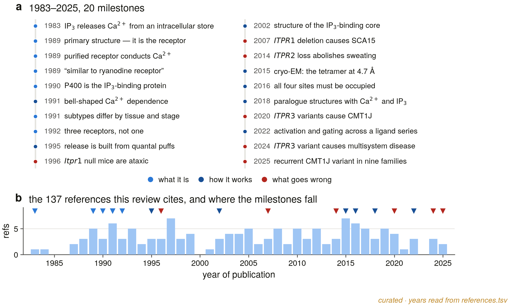

**Figure 1.6.** Four decades of work on the receptor as the
literature records it, with each milestone drawn at the year of its
published source. The figure is generated from a curated table in which no
year is typed: each is read from the reference row it cites, so a milestone
cannot be dated differently from the paper it rests on. What the shape shows
is how recently the evidence this thesis depends on became available. The
biochemistry and physiology were settled over forty years, but the
near-atomic structures that make a residue-level constraint map
interpretable are less than a decade old, and the genome assemblies behind a
503-genome census are more recent still, so the questions asked here could
not have been asked before the right-hand end of this figure.

## 1.2 The receptor shares its entire domain architecture with a much larger sister family

An IP₃ receptor is a homotetramer. Each subunit is around 2,700 residues, of
which roughly nine tenths are cytosolic. Reading from the N-terminus, a
subunit consists of a β-trefoil suppressor domain, then the IP₃-binding core
(a β-trefoil with an armadillo fold), then a long central solenoid of armadillo
repeats, and then, near the C-terminus, a six-transmembrane pore module of the
voltage-gated-channel superfamily, followed by a tail that folds back into the
cytosolic mass (Figure 1.2). The ligand binds some 100 Å from the
gate, and everything between the two is the machine that couples them.

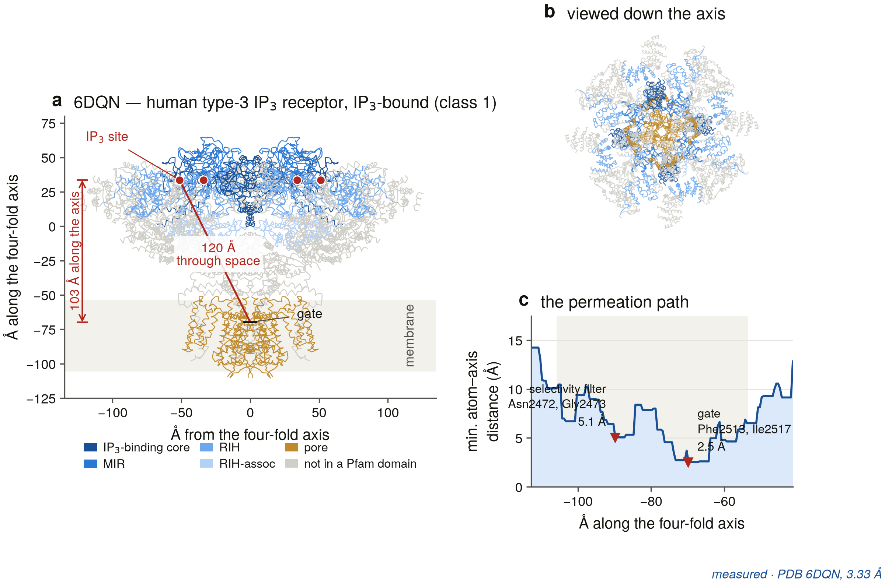

**Figure 1.2.** The channel measured rather than drawn. The
figure shows one C4-symmetric subunit's Cα trace from PDB 6DQN, a human
IP₃R3 in the IP₃-bound state at 3.33 Å [1], together with the four-fold
axis, the axial extent of the membrane, the pore radius profile and the two
constrictions recovered from the coordinates. The narrowest luminal point
lands on the GGGVGD selectivity-filter motif and the cytosolic constriction
on the gate residues, neither of which the geometry was told about. That
blind agreement is what makes the same geometry usable as a coordinate
system later: it can define a luminal loop boundary no annotation carries,
which Chapter 11 needs, and a ligand pocket measured by distance rather than
taken from a contact list, which Chapter 12 needs. A structure drawn from a
published residue list could do neither, because it would only return what
was put into it.

In domain-annotation terms the diagnostic signatures of the family are the MIR
domains (PF02815) in the suppressor region, the IP₃-binding core Ins145_P3_rec
(PF08709), the RyR–IP₃R homology domain RIH (PF01365), the RIH-associated
domain (PF08454), and the generic Ion_trans pore (PF00520).

Every one of the first four is also carried by every human ryanodine receptor
(Figure 1.5). This is not an artefact of database annotation.
The two families are one structural superfamily: their N-terminal regions are
conserved to the point of direct comparison [8], and the near-atomic
structures published for both in 2015 [9,10,11,12] show the same
organisation, in which a vast cytosolic solenoid transduces ligand binding to
a C-terminal pore. They differ in scale, the ryanodine receptors being nearly
twice the size at around 4,900 to 5,000 residues.

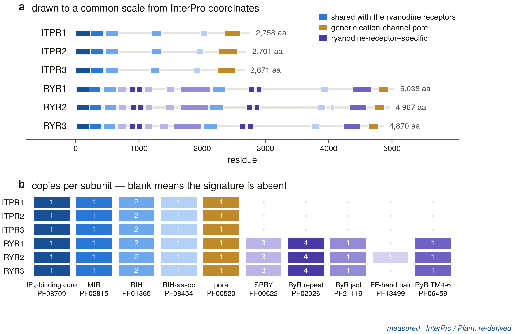

**Figure 1.5.** Every signature that defines an IP₃ receptor
is also carried by a ryanodine receptor, in the same copy number, down to
the two RIH domains. What separates the families is what the ryanodine
receptors carry in addition: four further domains and some 2,200 extra
residues. This figure is the reason the project has the shape it does.
Because the diagnostic signatures cannot separate the two families, every
stage from the first enumeration to the last structural comparison had to
carry a positive family test, and the sister family had to be searched
alongside rather than filtered out. Roughly half the methodological rules in
Chapter 14 exist because of what this figure shows.

Three consequences of that shared architecture run through every chapter of
this thesis.

**Any similarity search for one family returns the other.** The scale of the
problem is easy to underestimate. A single query for the IP₃-binding-core
signature in zebrafish returns 109 protein records across 10 gene symbols, of
which 53, or 49 %, are ryanodine receptors. Seven of those records come from a
4,900-residue locus that carries no gene name at all. That number is measured
in Chapter 2, in the exact query this project's own planning document had
quoted as a clean result.

**The separation between the two families must therefore be a positive test.**
It cannot be a filter that removes what looks wrong. It has to be evidence
that a record is one thing rather than the other, in the form of best-profile
assignment with a stated margin, or a labelled-bait identity margin, applied
at every stage from the first enumeration to the last structural comparison.
Where the evidence does not reach the required bar, the honest output is a
refusal, and this project produces a great many of them.

**Size is a filter and not evidence.** The two families do separate cleanly by
length in a well-annotated genome. That is a fact about annotation quality in
that genome, and using it as the call would make every result downstream a
restatement of how good the annotation already was, which is one of the things
this thesis set out to measure.

## 1.3 What the channel is for, and why the three paralogues are not interchangeable

The channel's behaviour is not a simple function of ligand concentration. Its
response to cytosolic calcium is biphasic, activating at low concentrations
and inhibiting at high, which under IP₃ produces the bell-shaped
calcium-response curve that has organised thinking about the receptor since it
was measured [13]. IP₃ binding and calcium binding are cooperative rather
than independent [14], and the stoichiometry required to initiate release has
been resolved, in that more than one subunit must be occupied [15]. ATP
modulates the channel at two sites [16], protein kinase A phosphorylates it
[17], and it is a hub for protein interactions, including with Bcl-2 [18]
and IRBIT [19].

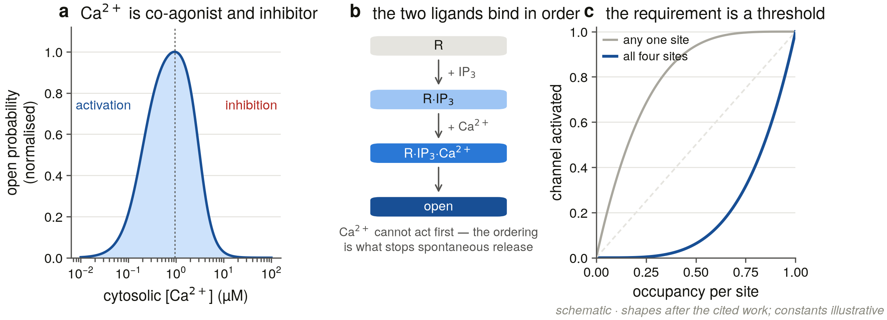

**Figure 1.3.** What opens the channel and what closes it, drawn as
the logic rather than as a mechanism. The row that matters for a census is
the last one: the same channel produces puffs, waves and oscillations, and
the properties that distinguish those outputs belong to the individual
paralogue. If the three vertebrate paralogues were interchangeable, their
copy number would be a matter of dosage and their individual retention would
carry little information. Because they differ in affinity, in calcium
sensitivity and in downstream output, the finding in Chapter 9 that all
three are retained in every vertebrate genome is a statement about three
distinct functions rather than about three copies of one.

What the channel produces is not one signal but a graded family of them
(Figure 1.4), and this is the level at which a genome-scale
census stops being able to speak. A census counts genes, so it can say
whether the channel is present and how many copies a genome carries, and it
cannot say what a cell does with the signal.

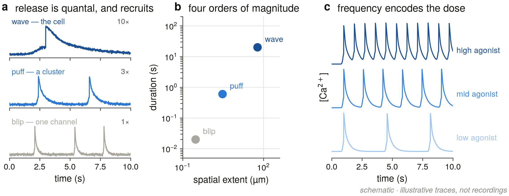

**Figure 1.4.** How the calcium signal is built, and what carries
the dose. (**a**) The three event classes, drawn as illustrative traces
rather than recordings: a blip is one channel opening, a puff is a cluster of
them, and a wave is the cell. Each has its own amplitude band, because the
blip is roughly ten times smaller than the wave and one shared axis would
draw it as a flat line. (**b**) The same three events placed by how far they
spread and how long they last, which is four orders of magnitude on each
axis. (**c**) Raising the agonist raises the *frequency* of the events rather
than their size, so the dose is carried in the timing. The figure is here to
mark the boundary of what follows: everything in this thesis is a statement
about the gene and the protein, and nothing in it reaches panel **c**.

Those output differences are the reason the paralogues matter. The three
vertebrate receptors differ in IP₃ affinity, in calcium sensitivity, in
regulation and in tissue distribution [20,21,22], and they are not
redundant. Calcium transfer from the endoplasmic reticulum to the
mitochondrion, and the apoptotic decisions downstream of it, depend on which
paralogue is present [23]. A cell's calcium signalling repertoire is in part
a statement about which of ITPR1, ITPR2 and ITPR3 it expresses.

## 1.4 Four things about the family were not established

For a family this well studied, a surprising amount was not established at the
level a genome-scale question requires.

**Its taxonomic range had never been enumerated against a declared space.**
The receptor is described as animal machinery with scattered occurrences
elsewhere. Those scattered occurrences had never been
enumerated against a declared search space, and the conspicuous absences,
meaning no IP₃ receptor in *Arabidopsis* and none in budding yeast, had never
been tested at the level of an assembly rather than a gene set. An absence in
a proteome is a statement about what a gene caller found. Whether it is also a
statement about the genome is a different measurement, and nobody had made it.

**Where the three vertebrate paralogues came from had no tested answer.**
That vertebrates carry three is a database fact. That the three arose in the
two rounds of whole-genome duplication at the base of the vertebrates [24,25] is a reasonable inference from their number and their age, and it had
not been tested against the genomic neighbourhoods that a duplication of
that kind leaves behind. Which two of the three are sisters had no published
answer at all. Worse, the proposition that the IP₃ and ryanodine receptor
triplications happened independently, which this project's own background
document asserted, turned out to have no primary source and had to be
downgraded to an open question before any of the work could begin. Chapters
6 and 7 answer it.

**What has happened to the paralogues since could not be asked without a
false-negative rate.** Gene families of this age normally lose copies
[26]. Whether this one has, and where, is a question that cannot be
answered without a false-negative rate, because a gene that a search fails
to find looks exactly like a gene that is not there. That single sentence
determined the structure of a third of this thesis.

**How well the family is recorded had never been audited.** Every one of the
questions above is answered using public databases, and the quality of those
databases for this family had never been audited. The audit turned out to be
a result in its own right.

Those four gaps are the questions this thesis answers, and they can be stated
in one sentence each. How far does the family reach, measured against a
declared search space rather than against whatever records exist? Where did
the three vertebrate paralogues come from, and which two of them are sisters?
Has any vertebrate lineage lost one, and how would anybody know the difference
between a loss and a search that failed? And how well is the family recorded
by the public archives that every one of those answers depends on? Chapters 5,
6 and 7, 9 and 13 answer them in that order, and Chapters 3, 4, 8, 10, 11 and
12 build and test the instruments the answers rest on.

## 1.5 How every claim in this thesis is scoped

Every result here is scoped to a declared search space. The claim is never
"all IP₃ receptors" but always a specific set: 7,691 UniProt reference
proteomes and 503 NCBI genome assemblies, each set enumerated by a stated rule
and committed as a manifest before any search ran. An absence is an absence
from that space, measured with a positive control that demonstrates the search
could have found the gene had it been there.

That discipline is why the negative results in this document can be read as
results. The family is absent from all 384 land-plant reference proteomes, and
it is also absent from those genomes, in assemblies where a measured control
recovers a comparably long, deeply conserved gene. Those are two different
claims and both are made separately, because the second is the one that means
something biological and the first is what a database can support on its own.

The same discipline runs in the other direction. Chapter 9 reports that not
one of the 927 genome by paralogue cells in the vertebrate scope reaches the
state this project defines as a loss. A zero of that kind is worth nothing
unless the instrument that produced it could have produced something else, so
Chapter 4 measures the search's own false-negative rate on cells whose gene is
independently known to be present, and Chapter 9 reports, cell by cell, the
analytical settings that would manufacture a loss out of this data. The
strongest form in which that result can be stated is the one that names its
own escape routes.

## 1.6 What each chapter of this thesis does

Chapter 2 audits the literature this project started from, claim by claim, and
reports the four statements that did not survive. Chapter 3 builds the
instrument that separates the two receptor families and enumerates the search
space. Chapter 4 takes that instrument to 309 vertebrate genomes and then
measures what the search was worth. Chapter 5 takes it outside the vertebrates
and reports the family's range and its absences.

Chapter 6 builds the alignment and the tree that everything downstream stands
on. Chapter 7 asks where the three paralogues came from, using the genomic
neighbourhood, the species tree and the duplication record. Chapter 8 measures
the gene itself, meaning its exons, its introns, and what a fragmentary
annotation actually is. Chapter 9 counts the losses.

Chapter 10 measures selection across the vertebrate family. Chapter 11 maps
constraint onto the channel and asks whether it explains the clinical
variants. Chapter 12 takes the one part of the receptor the ryanodine
receptors do not share. Chapter 13 audits the archive. Chapter 14 sets out the
methods as the argument behind each instrument rather than as a procedure, and
Chapter 15 discusses what the whole says. Chapter 16 describes how the project
itself was carried out, which is a question about the work rather than about
the receptor and is answered separately for that reason.

---

# 2. Auditing what the literature could be trusted to say

## 2.1 Why this project began by auditing its own background document

Every genome-scale project begins with a background document, meaning the set
of things taken as known against which the new measurements will be read. That
document is normally written from reading, and it is normally the least
scrutinised artefact in the project, because it is not a result.

This one was treated as a result. Nineteen atomic claims were extracted from
the `[lit]`-tagged statements of the project's background document and checked
against their primary sources. Every `[db]`-tagged number was re-queried
against the live database it came from. The application that would do the
searching was run against all three public interfaces to establish that it
worked at all. The exercise took a session and changed four claims, one of
which would have made a later chapter's conclusion into an assumption.

The tagging scheme is the point. A statement is `[db]` if it can be re-derived
from a database with a stated query, `[lit]` if it rests on a published
source, and `[open]` if it is a question this project answers. A background
document that does not separate these three cannot be audited, because there
is no way to say what would falsify any given sentence.

## 2.2 Four of the nineteen literature claims did not survive as written

Twelve of the nineteen were verified as written against their primary sources.
Three were verified but qualified, meaning they were supported by wording that
overstated the strength of the evidence and were re-written accordingly. The
remaining four did not survive in the form they were stated.

**One claim was promoted from literature to database.** The cytogenetic
locations of the three human genes, with ITPR1 at 3p26.1, ITPR2 at 12p11.23
and ITPR3 at 6p21.31, were carried as a literature claim. They were re-derived
from Ensembl and confirmed exactly, so they became a `[db]` statement with a
query attached rather than a citation.

**One claim was demoted to an open question, and this is the important one.**
The background document asserted that the IP₃ and ryanodine receptor families
had independently expanded to three vertebrate paralogues each. The
three-paralogue state of each family is a database fact. The independence of
the two triplications is not, because no primary source establishes it. Left
in place, that sentence would have made Chapters 6 and 7 and the
reconciliation that dates the duplications into an elaborate confirmation of
something already assumed. It was retagged `[open]` before any tree was built.

**Two claims were corrected.** The first is discussed in §2.3. The second
concerned Gillespie syndrome, which the background document described as
caused by pore-proximal ITPR1 variants acting dominant-negatively in the
tetramer. That is half the genetics. The syndrome arises from both biallelic
recessive variants and de novo heterozygous ones, and only the latter act
dominant-negatively through the channel domain. Stating only the
dominant-negative mechanism would have misdirected the constraint analysis in
Chapter 11, which asks where pathogenic variants sit relative to the
constrained core, and would have had it looking for one signal where there are
two.

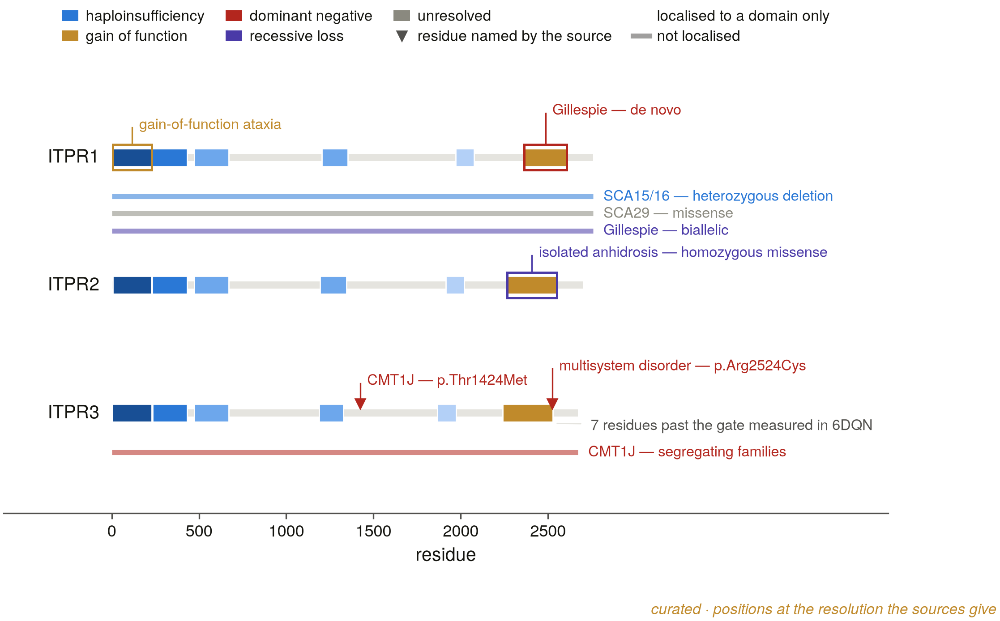

**Figure 2.7.** The curated disease-variant map, with each variant
recorded as `point`, `domain` or `gene` according to how far its cited
source actually localises it. That third column is the honesty of the
figure: a source reporting a deletion of the whole gene cannot be drawn as a
residue, and a map that drew it as one would assert a resolution the
literature does not have. The distinction is what makes Chapter 11's variant
analysis possible at all. A constraint map is scored against positions, and
recording how far each source localises its variant is what showed that only
two residue-level positions were available from the literature, which is why
that chapter harvests a clinical database instead and uses those two as its
positive control.

## 2.3 The background claim about gene size was false, and it became a measurement

The background document stated that each ITPR is "a ~58–60 exon gene spanning
hundreds of kb". Ensembl's canonical transcripts say otherwise
(Figure 2.1).

The exon counts are 62, 57 and 58, which is a range of 57 to 62 rather than 58
to 60. That is a small correction. The span is not: ITPR1 covers 354,174 bp,
ITPR2 covers 497,888 bp, and ITPR3 covers **76,245 bp**. "Hundreds of kb" is
wrong for one of the three, and the genomic span varies 6.5-fold across the
three paralogues while the protein length varies by about 3 %.

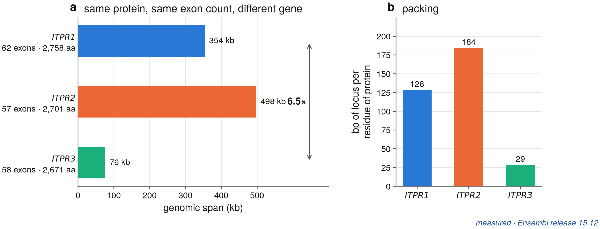

**Figure 2.1.** The three human genes drawn to one scale
from Ensembl coordinates. Exon count is nearly identical across the three
and genomic span is not, and the difference between them is almost entirely
intron length. The figure is where a corrected sentence became a
measurement. Three paralogues encoding proteins whose lengths differ by 3 %
occupy genomic spans differing by a factor of six and a half, which must
mean that either their exon structure or their intron content differs, and
only the first would be a statement about how the coding sequence has
evolved. Chapter 8 resolves it in favour of the second, and that chapter
exists because of this figure.

A failed background claim is normally just a correction. This one became a
measurement. If three paralogues of one gene, encoding proteins of the same
length, occupy genomic spans that differ by a factor of six and a half, then
either the exon structure differs between them or the introns do, and either
answer says something about how the family has evolved. That question is
Chapter 8, and it exists because a sentence taken from reading turned out to
be false.

The correction also has an operational consequence that reaches into Chapter
4. A protein-to-genome aligner has a maximum intron length, and a gene whose
largest intron exceeds it is split into pieces, so a split gene reads out of a
genomic sweep as a fragment. Setting that parameter is not a performance
choice, and it cannot be made from a claim about "hundreds of kb" that is
wrong for a third of the family.

## 2.4 Every database number in the background document reproduced exactly

Every `[db]` number in the background document was re-queried on the day the
audit ran. All of them reproduced exactly, which is the boring outcome and the
one worth recording: the numbers were right, and they are now right with a
query beside them.

Two of those numbers set up the whole project. The IP₃-binding core signature
PF08709 was carried by 12,338 proteins, the RIH domain PF01365 by 13,177, the
RIH-associated domain PF08454 by 12,062, the MIR domain PF02815 by 23,453,
whose excess over the others is the O-mannosyltransferases that share it, and
the generic pore PF00520 by 206,115, which is why the pore is not a family
signature.

The taxonomic distribution carried an anomaly. Forty Viridiplantae proteins
and forty-one fungal proteins carried PF08709, the IP₃-binding core, while
*Arabidopsis thaliana* and *Saccharomyces cerevisiae* had none. Eighty-one
records in kingdoms whose model organisms have no IP₃ receptor is either a
real distribution or an artefact, and no amount of reading resolves which
(Figure 2.2). Chapter 5 chases all of them individually.

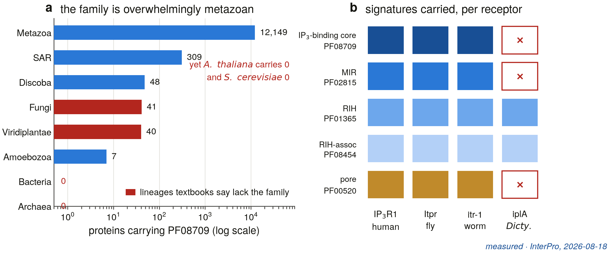

**Figure 2.2.** What the databases said the family's range
was at the start of this project, shown as signature counts by taxon from a
live InterPro query. The plant and fungal columns are the anomaly: 81
proteins in kingdoms whose model organisms have none. The figure is
important as a statement of what was not known, and as an illustration of
why a count of records is a weak instrument for a range question. A record
enters here by carrying a domain annotation, and nothing in the count says
whether the protein is real, whether it is in that organism's genome, or
whether it is an IP₃ receptor at all. Turning this figure into a biological
range claim took the two chapters and 194 genome searches that Chapter 5
reports.

## 2.5 The sister-family hazard was measured in the query that was supposed to be clean

The background document cited a UniProt query on taxonomy 7955 and Pfam
PF08709 as evidence that zebrafish carries four IP₃ receptors. Re-running that
query returns 109 protein records across ten gene symbols, and only four of
those genes are IP₃ receptors. Fifty-three of the 109 records, or **49 %**,
are ryanodine receptors.

This is the single most useful number the audit produced. It is a measured
floor on the contamination that any signature-driven enumeration of this
family inherits, obtained in the exact query that had been quoted as a clean
result. It is why every later chapter separates the two families by positive
evidence rather than by filtering. It also carries a second finding in
passing: one of the six ryanodine-sized genes in that result, a 4,900-residue
locus, carries no gene name at all. That is the first appearance of the
unnamed-locus problem that Chapter 13 eventually audits across 503 genomes.

The length band happens to separate the two families cleanly in this
particular query. That is a fact about zebrafish annotation quality rather
than a rule, and treating it as one would import the quality of an annotation
into the definition of a gene family.

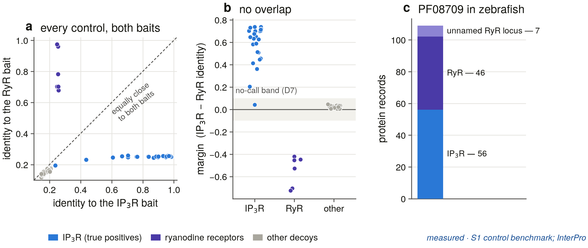

**Figure 2.3.** Separating the families by evidence
rather than by name, using the control panel Chapter 3 builds. Panel **a**
shows every control scored against a labelled IP₃ receptor bait and a
labelled ryanodine receptor bait, and the two families fall on opposite
sides of the diagonal with nothing between them. Panel **b** shows the same
data as a margin, with the band inside which this project declines to call
either way drawn rather than described. The one positive inside that band is
*Dictyostelium* iplA, a characterised receptor that the family's own
defining signature does not find. Panel **c** shows the zebrafish query and
the 53 records in it that are the sister family. The importance of the gap
in panel **b** is that it is what every later instrument had to reproduce. A
margin with no gap would mean the two families cannot be separated by
sequence, and every downstream count would then be a mixture of both. The
one positive inside the no-call band is equally important in the other
direction, because it shows that this instrument cannot reach the deepest
branches, which is why the profile models of Chapter 3 exist.

## 2.6 Two sequence measurements become a coordinate system for later chapters

Two further measurements were made for the literature review, and the rest of
this thesis uses them as a coordinate system rather than as a result.

The first is a per-column conservation profile over a family alignment, in
human ITPR1 numbering (Figure 2.4). The second is a set of
alignment windows anchored on sites measured in the structure, meaning the
three stretches that contact the bound IP₃, the selectivity filter and the
gate, rather than on a residue list taken from a paper
(Figure 2.5).

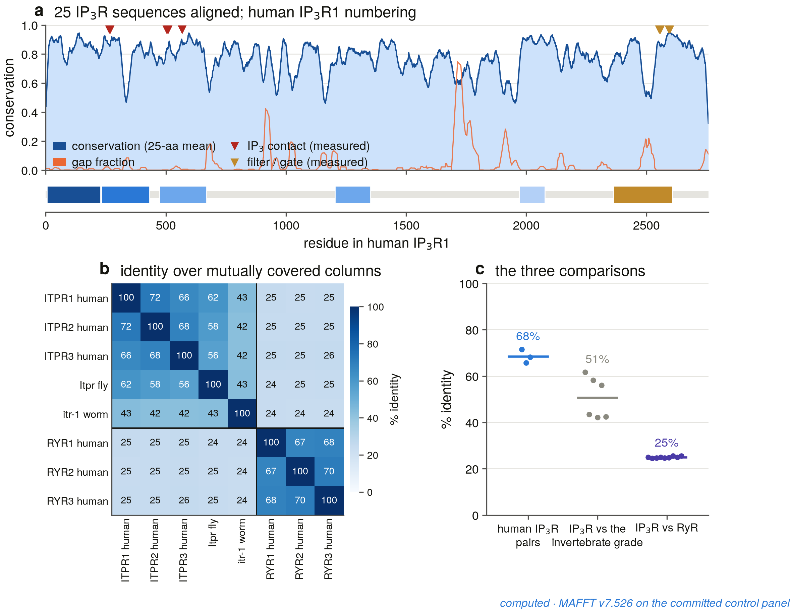

**Figure 2.4.** Per-column conservation across a 25-sequence
family alignment, mapped onto human ITPR1 numbering, with the domain
architecture beneath it. Chapter 11 rebuilds this at a very different depth,
using 249 to 265 orthologues of each individual paralogue rather than 25
sequences of the whole family, and the two agree about where the peaks are.
That agreement matters for a practical reason: if a shallow family alignment
and a deep within-paralogue alignment disagreed about where the receptor is
conserved, neither could be used to interpret a clinical variant. It is what
licenses Chapter 11 to compare four conservation layers as classifiers
rather than to pick one on faith.

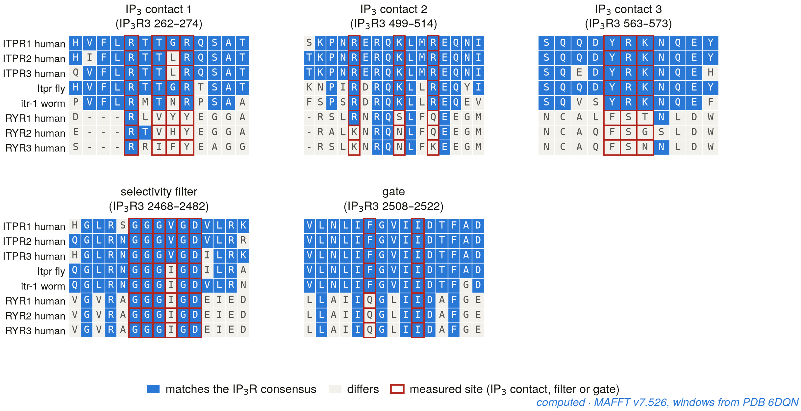

**Figure 2.5.** Where the two families agree, and where
they stop agreeing. At the pore they are interchangeable, showing GGGVGD
against GGGIGD in the filter and a gate that differs by conservative
substitution. At the ligand site they are not: the arginines and lysines
that grip the trisphosphate are absent from all three ryanodine receptors,
and one window carries a three-residue deletion. This asymmetry is the
biological reason Chapter 12 exists, because it identifies the one place in
the protein where a functional difference between the two families is
visible in sequence. Everything that chapter measures follows from it,
including the result that the module named after the ligand is the less
constrained of the two.

Measuring the structure for these figures produced three things the text did
not have. The channel's two constrictions were recovered blind from the
coordinates and landed on the GGGVGD filter motif and on Phe2513 and Ile2517,
without the geometry being told where the filter was. The distance from the
ligand to the gate resolved into 103 Å along the axis and 120 Å through space,
two numbers that are usually quoted as one. And *Dictyostelium* iplA, a
characterised IP₃-gated channel, carries none of PF08709, PF02815 or PF00520,
making it a real receptor that the family's defining signature does not find.
That last observation is why Chapter 3's profile seeds include it
deliberately.

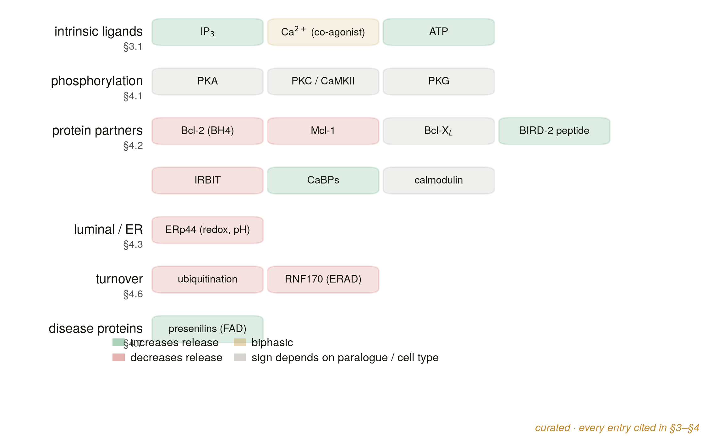

**Figure 2.6.** The curated regulator map, showing what binds
the receptor, where, and with what effect. It is here as a statement of
scope rather than as a result, because it is the part of the biology this
thesis does not measure. Nothing in a genome-scale census can say whether a
protein interaction is conserved, so the regulatory layer drawn here is
untouched by every measurement in this document, and a reader deciding what
the census settles should be able to see the size of what is left out.

## 2.7 A fault in one public interface, and why it was worth diagnosing

The audit ended by running the search application against all three public
interfaces. Two of four runs returned all three sources, and the two failures
were more useful than the successes.

Ensembl returned nothing at all for the human panel. This was not an outage
and not a slow network. The endpoint the client used to resolve gene symbols,
`/xrefs/symbol/{species}/{symbol}`, **stalls indefinitely for `homo_sapiens`**,
and it does so for *BRCA2* as well as for *ITPR1*, so the fault is not
gene-specific. The same endpoint answers in 0.6 s for `danio_rerio`. That is
why the zebrafish run got three sources and the human run got none, and it is
why a retry budget could never have fixed it, because there is nothing to
retry against. The client now resolves through the database's other symbol
endpoint [27], which works, and falls back to the old path only on a clean
404, never after a transport error, which would walk straight back into the
stall. Human ITPR1 went from 0 variants to 24.

Fixing that fault exposed a second one underneath it. Ensembl's latency is
unstable: the same 451-byte call measured 0.61 s, 7.61 s and 13.91 s inside
one session, and the call that carries the transcript and exon payload costs
about 12 s every time. A panel of eight species by three genes is 24
sequential pairs, which is somewhere between five and thirty-eight minutes.
The headless run budget was raised accordingly. The instruction that came out
of it is worth restating, because it applies to every latency figure in this
thesis: do not treat a single measurement of a public interface as a rate, and
treat the spread as the design constraint.

## 2.8 What Chapter 3 inherits from this audit

Chapter 3 inherits four things. A background document whose every statement is
tagged by how far it can be trusted, with four claims corrected. A set of
database numbers with queries attached, re-derived and reproducing exactly. A
measured floor on sister-family contamination of 49 % in the query that had
been quoted as clean, which turns the separation of the two receptor families
from a caveat into a design requirement. And a gene-architecture question,
raised by the one background claim that was simply false, which becomes
Chapter 8.

---

# 3. Separating two receptor families that share every diagnostic domain

## 3.1 Why the separation has to be a positive test rather than a filter

Chapter 2 measured the hazard: 49 % of the records returned by a query on the
IP₃-binding-core signature in one well-annotated genome are ryanodine
receptors. This chapter builds the instrument that separates the two families,
and it does so in three passes, because no single test reaches the whole
family.

The requirement is stated as a rule rather than a preference. Every record in
this project is assigned to one family or the other by a **positive test**,
meaning evidence that it is one thing rather than evidence that it is not the
other. Where no positive test reaches the required margin the record is left
uncalled and counted as uncalled. The gene's own name is never an input to
that test at any stage, and a length filter is never the call.

Three instruments follow, in the order they were built. The first is a
labelled-bait identity margin, benchmarked against 56 controls. The second is
a domain-architecture rule, applied to an exhaustive enumeration of the search
space and audited against gene symbols it never sees. The third is a pair of
profile hidden Markov models, one per family, calibrated against the
architecture rule before being used.

## 3.2 A control benchmark was run before any search, and it failed on the first attempt

Nothing was searched until the discovery scorer had been run against a panel
of known answers: 25 positive controls, comprising the three vertebrate
paralogues across a species panel plus the invertebrate and non-metazoan
single-receptor grade, together with 31 decoys.

The decoys were chosen to be hard rather than plausible. Six are the human and
mouse ryanodine receptors, which are the sharp decoy because they carry all
four family-diagnostic signatures. Two are the O-mannosyltransferases POMT1
and POMT2, which share the MIR domain. Fifteen are in-band channels and
non-channels, meaning proteins of the right size and the wrong identity, from
CACNA1A to talin. Four are out-of-band giants.

Recall was 24 of 25, and specificity 31 of 31.

**Specificity was not 31 of 31 on the first run.** It was 25 of 31, and every
one of the six failures was a ryanodine receptor. Each carried all four family
signatures, so each took the domain component, which also satisfies the
evidence gate that stops size and novelty alone promoting a candidate, and
each scored 45 against a threshold of 40. The instrument, run as designed,
called the sister family the family.

What fixed it is the labelled-bait margin, and its three properties are the
reason it is used unchanged for the rest of the project. It compares a
candidate's identity to the nearest labelled IP₃ receptor bait against its
identity to the nearest labelled ryanodine receptor bait, and assigns to
whichever wins by more than a stated margin. It is a positive test on
distances, so an unnamed 4,900-residue locus is called exactly as a named one
is. The length band contributes only to the size component and never to the
call. And the margin is recorded on every candidate, so every exclusion can be
audited afterwards.

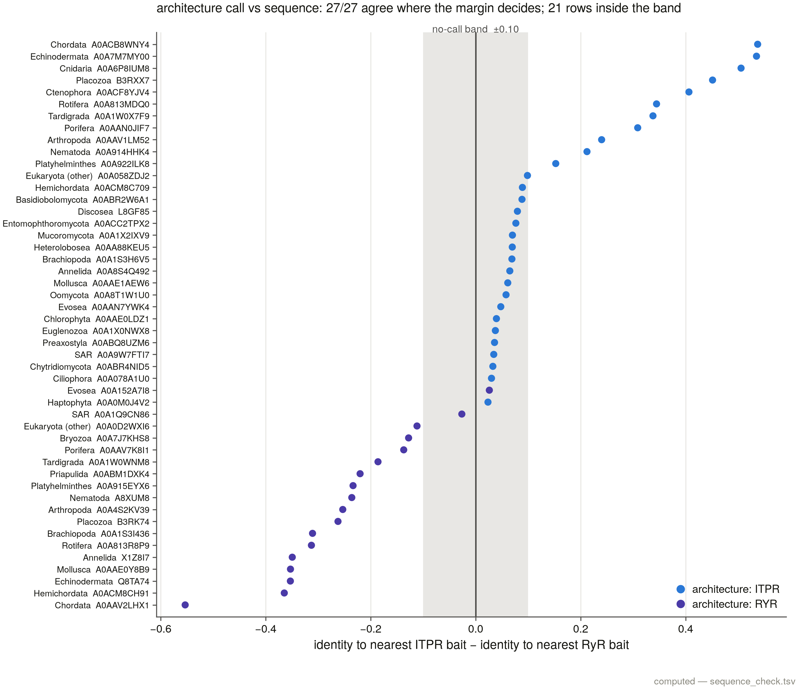

**Figure 3.4.** The labelled-bait margin measured across the
census, inside and outside the band in which the project declines to call.
The two families do not overlap: the narrowest true positive sits at +0.065
and the narrowest ryanodine receptor at −0.536, a gap of 0.601 with nothing
in it. The importance of the gap is that it is a measured floor rather than
a chosen threshold. Because the narrowest correct call and the narrowest
correct rejection are separated by 0.601 with nothing between them, the 0.10
margin the project uses is not a compromise between sensitivity and
specificity; it sits in an empty region six times its own width. That is
what allows every later chapter to treat the family call as settled and
spend its uncertainty budget elsewhere.

That gap is comfortable, and one true positive sits inside the no-call band
anyway. *Dictyostelium* iplA, a characterised IP₃-gated channel, has a margin
of +0.065, which has the right sign and is smaller than the 0.10 the rule
requires for a call. The margin is not wrong about it; the margin simply
cannot reach it. That is a scope limit on this instrument, measured on the
first day, and it is why the profile route in §3.5 is not optional.

**The obvious identity metric understated the risk.** A ryanodine receptor is
about 1.8 times the length of an IP₃ receptor, so identity computed over the
full alignment dilutes every cross-family comparison toward zero. The
ryanodine decoys sit at 0.105 to 0.110 identity to the nearest IP₃ receptor
bait, which is below the floor at which the scorer's novelty component fires.
Under a fragment-aware metric that scores only mutually covered columns, the
same comparisons rise to 0.249 to 0.258, which is inside the twilight zone and
worth a further 20 points. A later switch to the better metric, which the one
recall failure argues for, would have promoted every ryanodine receptor to 65
without the sister test. Both columns are committed, which is how that is
known rather than suspected.

**The single missed positive is worth its line.** *Drosophila* Itpr scored 35.
It needs one non-known sibling at 0.35 identity or better, and its nearest is
the worm receptor at 0.342 under the metric the scorer uses, short by 0.008.
Under the fragment-aware metric the same pair scores 0.420 and the component
fires. The honest worst case is therefore measured rather than assumed: **a
lone true family member, 40 to 60 % diverged, with no sibling in the set,
scores 35 and is missed.** In the census that follows, the invertebrate grade
is represented by many lineages that corroborate one another, so the artefact
does not recur, but it is the shape of this instrument's failure and it is on
the record.

## 3.3 The search space was enumerated to exhaustion, and its own counts cannot be trusted

The census was built by walking three Pfam signatures [28] to exhaustion,
through the domain database that serves them [29]: PF08709 (the IP₃-binding
core), PF01365 (the RyR–IP₃R homology domain) and PF08454 (RIH-associated).
The MIR domain PF02815 is deliberately not a seed, because it is carried by
the O-mannosyltransferases as well as by both receptor families, so it widens
the space without adding evidence. It is kept as an annotation column instead.

Three things about that walk are worth a thesis's space.

**The database's own record count is not a completeness criterion, and it is
wrong in both directions.** PF08709 advertises 12,339 records and serves
12,507, an excess of 168. PF01365 advertises 13,177 and serves 13,233. PF08454
advertises 12,066 and serves 11,890, which is 176 fewer than advertised. The
advertised values were stable across re-queries, so this is not an edit during
the walk, and in every case what the interface serves matches UniProt's
independent count for the same signature to within two records. It is the
advertised number that is wrong.

Both directions bite. Stopping at an understated count drops records in
silence. Trusting an overstated one declares a complete walk incomplete, which
is what happened: this task's own completeness test failed PF08454 and exited
non-zero on a walk that had run its cursor chain to the end. The recorded
criterion is therefore cursor exhaustion, with both counts kept beside it.

**The documented interface was down for the duration.** The database answers
the same queries on two hosts, the documented one and the one its own website
uses. During this work the documented host returned HTTP 500 to 11 of 12 probe
requests while the other served 12 of 12, with identical payloads and the same
counts. The client now tries both before it sleeps, which is why the walk
completed at all.

**One signature would not have been enough.** A census built on PF08709 alone,
which is the signature that names the family, would have enumerated 12,507 of
the 15,421 proteins here and missed 2,914, including 758 that this census
calls IP₃ receptor across 385 taxa. Only 10,256 records, or 66.5 %, carry all
three seeds. *Dictyostelium* iplA is among the records a single-signature
census would have missed, because it carries PF01365 and PF08454 and none of
PF08709, PF02815 or PF00520. It is a characterised receptor that the family's
defining domain does not annotate.

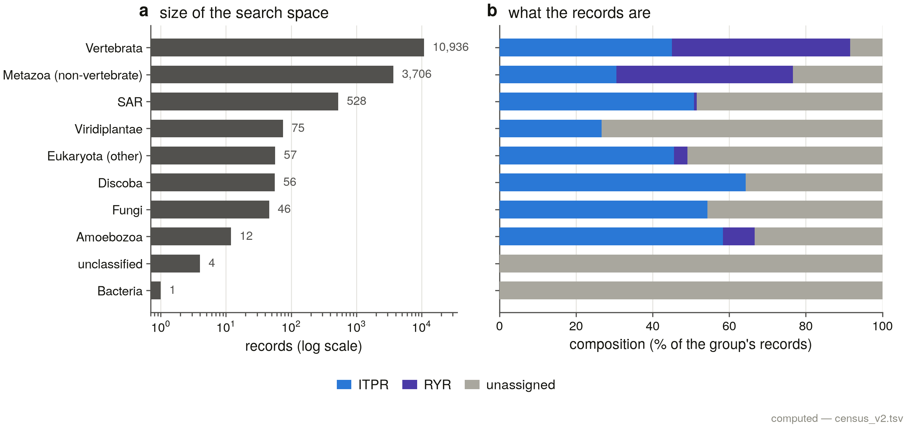

**Figure 3.1.** The enumerated search space by signature, with the
overlaps drawn. The union is 15,421 proteins across 1,488 taxa and the
intersection of all three seeds is 10,256. The difference between those two
numbers quantifies what a conventional search would have missed: a census
built on the signature that names the family, which is what a reader looking
for IP₃ receptors would query, would have missed 2,914 proteins including
758 this census calls family across 385 taxa. Enumerating the union is the
difference between a search that finds what is annotated and one that finds
what is there.

## 3.4 A domain-architecture call is audited against gene symbols it never sees

Every record is called by domain architecture. A record is a **ryanodine
receptor** if it carries any of four RyR-specific signatures, namely PF02026,
PF06459, PF21119 or PF00622. It is an **IP₃ receptor** if it carries the
complete five-signature architecture of PF08709, PF01365, PF08454, PF02815 and
PF00520 and none of those four. Length is recorded on every row and enters
only as support for a medium-confidence call. The size band was chosen to
exclude ryanodine receptors, so letting it decide would beg the question the
call exists to answer.

The result is 6,433 IP₃ receptors, 6,807 ryanodine receptors and 2,181 records
that satisfy neither positive test.

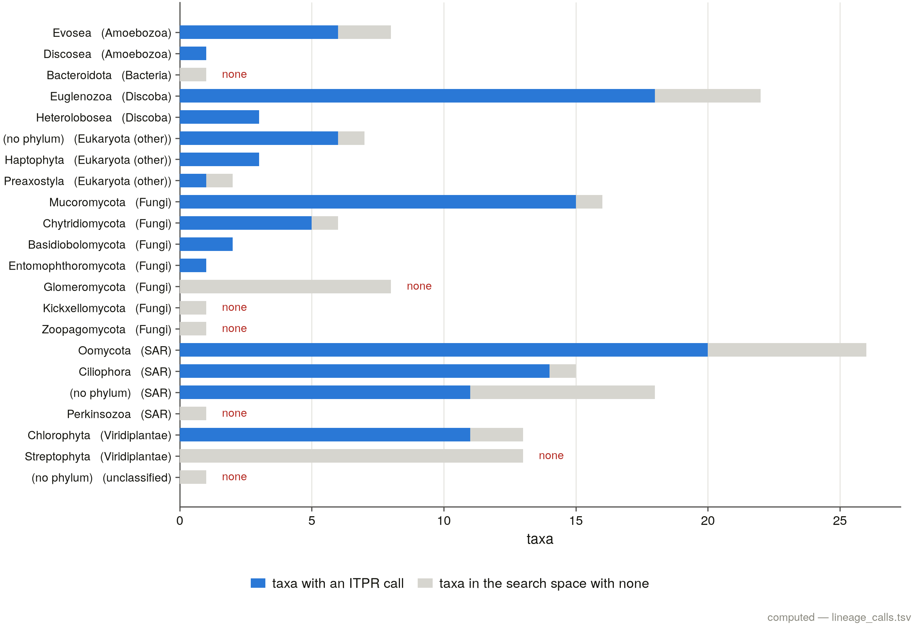

**Figure 3.2.** The census by lineage with both family calls, and
with the sister family drawn beside the family everywhere. The figure is a
warning about denominators. The vertebrate bar carries 10,936 of the 15,421
records, which is a fact about where sequencing effort has gone rather than
about where the family lives, so any range claim read off record counts
would report the history of genome sequencing. That is why Chapter 5 counts
proteomes and taxa instead.

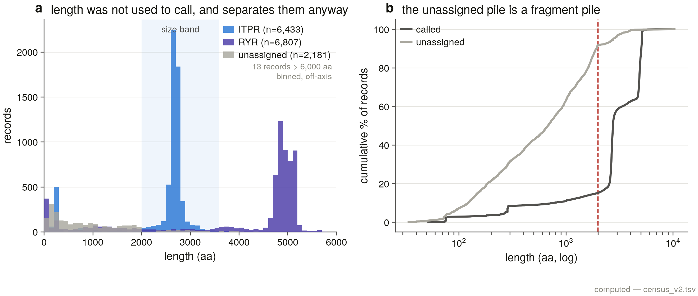

**Figure 3.3.** Length distributions of the two families as
called. The medians are 2,671 and 4,856 residues and the distributions
barely touch. The figure shows why a filter that works is still not
evidence: length separates the two families almost perfectly here, and it
does so on a population whose annotations are already good, which is
precisely where no separation is needed. In the fragmentary and unannotated
records where the call actually matters, this separation is unavailable, and
a project that had trusted it would have inherited annotation quality as a
definition of the gene family.

**The audit of that rule is possible because the rule never sees a gene
symbol**, which makes symbols an independent label to score it against. Every
symbol-labelled record in the census is used rather than a sample. The rule
agrees with the symbol on 2,479 of 2,479 decided IP₃ receptor cases and 2,492
of 2,492 decided ryanodine receptor cases, disagreeing on none. Four
subsidiary claims about individual signatures are scored the same way and each
is 100 % correct across two to three thousand records.

One of those subsidiary claims deserves suspicion and gets it. The rule leans
on SPRY (PF00622) being diagnostic of ryanodine receptors, and SPRY sits in
roughly 114,000 UniProt proteins and is in no sense specific to that family.
The claim being made is conditional, in that SPRY is diagnostic *among
proteins that already carry a family seed signature*, and the audit tests
exactly that conditional claim on 2,335 records, where it holds. It is stated
here as the row of the audit table a reader should check first, because it is
the one that is a claim about this search space rather than about a domain.

**A note on the 1,220 calls that rest on a gene symbol.** Some records have an
architecture too partial to decide and a name that is not. Those are called
from the name at explicitly low confidence, with the reason written into every
affected row and the pure architecture call kept in its own column, so the
audit above can score the rule with no symbols anywhere in its input. Section
3.5 revisits all of them with an instrument that reads residues, and overturns
one.

**The unassigned pile is a pile of fragments.** The 2,181 records that satisfy
neither test have a median length of 678 residues against 2,671 for a called
receptor, and only 143 of them fall inside the size band at all. A rule that
reads the absence of a domain as evidence cannot call a partial annotation,
and refusing to is the intended behaviour rather than a shortfall.

**Because length never decides a call, the size band was free to catch
something else.** Seven records carry the complete five-signature architecture
inside 2,000 residues, from 1,528 to 1,993, against 2,000 for the shortest
real family member. An intact architecture in two-thirds of the length is a
truncated gene model. None of the seven is flagged as a fragment by UniProt,
because a truncated model submitted as a whole protein is not marked as one,
and all seven are unnamed locus tags from three species. They are the first
evidence in this project for the annotation failures Chapter 13 audits.

## 3.5 Two profile models are calibrated against the architecture rule before they are used

The architecture rule reads annotation and a profile reads residues. Building
both and requiring them to agree is what makes the census defensible, because
they can fail in different ways.

Two profile hidden Markov models [30] were built, one of 2,684 match states
from 34 seeds and one of 4,930 from 22, each seed drawn from the census and
carrying that census's call, so the profiles are labelled by a rule rather
than by a gene name. Five selection rules are enforced in code rather than
trusted: a seed whose census call, architecture count or length has drifted
since the manifest was written aborts the build, and on the first run it did.

Five seeds carry an incomplete architecture and are in the set deliberately,
each with its reason written into the manifest row. The most important is
*Dictyostelium* iplA, at two signatures of five, which is in the IP₃ receptor
seed set precisely so that the profile can find its relatives, since the
architecture rule cannot.

Two build decisions are measurements rather than settings. MAFFT is run
**single-threaded**, because at automatic thread count it is not reproducible:
the same ryanodine seeds aligned twice gave 8,510 and 8,468 columns and
profiles of 4,933 and 4,908 match states. MAFFT's return code is checked and a
ragged alignment aborts the build, because the benchmark in §3.2 established
that a silent MAFFT failure degrades to a star alignment with no other symptom
at all. The SHA-256 of every seed set, alignment and profile is recorded, so a
rebuild that drifts is visible in the data rather than only in a count.

**The instrument is calibrated before it is used.** Both profiles were run
over the archived sequence set, which holds 15,381 of the census's 15,421
records, every one of them called by a rule that read annotation rather than
residues, and the two instruments were scored against each other. With the
seed sequences removed, because they are in that set by construction, the
profile assignment agrees with the architecture call on 11,875 records and
disagrees on 1.

**Figure 3.5.** The two profiles' scores against each
other, with the band inside which no call is made drawn rather than
described. A call requires the winning profile to clear 30 bits, to span at
least 200 match states, and to beat the loser by more than 10 % of its own
score. That margin is relative rather than absolute because bit scores scale
with alignable length, so a fixed gap would confidently call every
full-length protein and refuse every fragment, restricting the census to the
sequences that were never in doubt. The relative form is what allows 2,314
records the architecture rule could not decide to be called at all.

The span floor is measured rather than tuned. In this project's own structural
domain coordinates the shortest observed PF08709, which is the IP₃-binding
core that names the family, is 200 residues, and the longest observed SPRY is
137, so the floor sits in the gap between them. What it costs is on the
record: 89 records that the architecture rule could call lose their profile
verdict to it.

The second instrument earns its place exactly where the first fails. **2,314
of the 3,360 records the architecture rule leaves unassigned get a call from
the profiles**, because a partial architecture defeats a rule that reads
absence as evidence and does not defeat a sequence profile. Of the 1,220 calls
that had rested on a gene symbol, the profiles scored 1,219 and overturned
exactly one. The symbol fallback was sound, and it is now checked rather than
assumed.

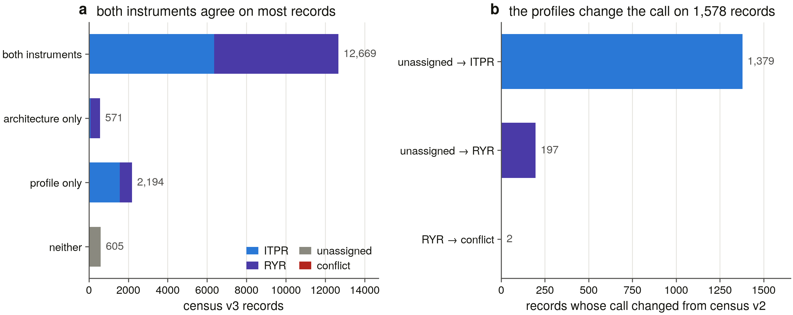

**Figure 3.6.** Which instrument calls each record. The
census keeps the two verdicts side by side and merges them by a stated rule:
both agreeing gives a high-confidence call, one speaking gives that one's, a
disagreement is kept and reported as a conflict rather than resolved by
preference, and neither speaking leaves the record unassigned. Two
instruments reading different evidence disagree on two records in 16,039,
which is the number that justifies treating the merged call as reliable, and
keeping both verdicts is what makes a disagreement visible instead of
assigning it to whichever instrument the author trusted more.

## 3.6 A sweep of 763 vertebrate proteomes required a span gate to be usable

The profiles were then run over 763 vertebrate reference proteomes [31],
comprising 14,414,821 canonical proteins, one per gene, because isoform sets
add isoforms of genes already counted and this census counts genes.

The union of the two searches is 18,501 targets. Before that number means
anything, **12,609 hits are declined as module-only matches.** Both profiles
are full-length channel models, so a protein sharing one small domain with
either scores against it, and the ryanodine profile carries SPRY, already
flagged as sitting in roughly 114,000 proteins. Without the span gate this
sweep called 14,981 vertebrate proteins ryanodine receptors, headed by
troponin, DEAD-box helicases and calcium-binding proteins. That is what a
sensitive profile search returns if nothing stops it, and it is the single
clearest demonstration in this project that a threshold on score alone is not
an instrument.

Of the declined hits, 1,794 carry a gene symbol from this family or its
sister. They are not domain-sharing proteins that happen to score. They are
pieces of split or truncated gene models, sitting under the gate because there
is not enough of the protein left to span a family domain. They are kept as an
annotation lead rather than discarded, and Chapter 13 takes them up.

**618 sweep hits are absent from the enumeration entirely**, meaning proteins
in a vertebrate reference proteome that the exhaustive InterPro walk never
returned, 188 of them called IP₃ receptor. A signature-based enumeration and a
profile sweep of the same organisms do not return the same set, and the
difference is not small.

## 3.7 Three iterative searches forced the kill criterion to be rewritten

The completeness argument needs a third line of evidence: iterate a model from
a single sequence until it stops finding new things, and see whether the
family it converges on is the one the census holds.

Three iterative searches [32] were run to convergence, from a human IP₃R1, a
*Drosophila* Itpr and an *Acanthamoeba* receptor, which is to say from a
vertebrate, an insect and an amoebozoan. Only the fly run converged. The other
two reached the ten-round ceiling and were killed.

Killing them is the point. The failure mode for this family is specific: an
IP₃-seeded iterative search drifts across the shared architecture into the
ryanodine receptors and reports a converged, confident, wrong answer. So the
criterion is coded and evaluated per round on that round's own inclusion list,
rather than judged by eye afterwards.

**The first version of that criterion was wrong, and how it was wrong is a
result.** It was coded as a flat ceiling of 5 % sister-family content, and it
fired on every run at round one, because a single IP₃ receptor sequence
searched at a sensitive threshold already returns 32 % to 37 % ryanodine
receptors before any iteration has happened. That is not contamination. The
two families are genuine homologues sharing the entire pore, and a search
sensitive enough to reach *Acanthamoeba* is necessarily sensitive enough to
reach RYR1. The level is a fact about shared ancestry, and only the change in
it can be attributed to iterating the model. The rule measures the rise.

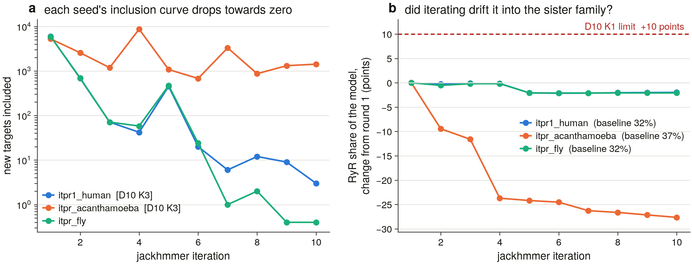

**Figure 3.7.** Convergence for each seed, with the
sister-family trace beside it. Two runs never converge and are excluded from
any completeness claim, and the third does. The curves decay to an asymptote
of a few new targets a round rather than to zero, and the tail is proteins
sharing one small domain rather than family members. That is why convergence
alone cannot be a completeness criterion here, and why the argument in §3.8
rests on three distant seeds recovering the same family core rather than on
any single run converging.

## 3.8 The family core is the same whichever seed finds it

A convergence curve says a search has stopped finding things. It does not say
what it found. Every target supporting each run's final model was therefore
classified by the sweep's own two-profile verdict.

The result is the strongest completeness statement in this chapter, and it
does not depend on convergence at all. **The family core is the same whichever
seed finds it.** Three starting points as far apart as a human, a fly and an
amoeba produce final models carrying identical family-called content: 1,656
architecture-complete IP₃ receptors in all three, 1,565 to 1,569
architecture-complete ryanodine receptors, and 952 partial IP₃ receptors in
all three.

What differs between them is everything that is *not* the family. The
*Acanthamoeba* run's final model rests on 26,266 targets against the human
run's 7,222, and 18,670 of those are proteins that neither profile scores at
all. The rise-based kill criterion **cannot see that drift**, because
off-family accretion dilutes the sister-family share rather than raising it.
Across that run the share falls from 36.6 % to 8.9 % while the model grows
five-fold, so the rule that catches the failure it was designed for reads this
one backwards. The ten-round ceiling is what caught it, and the composition
table is why the run is reported rather than quietly dropped. Chapter 4
returns to this and scores all three rules as classifiers of an outcome
measured on the finished model.

## 3.9 Completeness checked in the expensive direction: which known records the profiles missed

A sweep is a completeness argument only if it is also checked the other way
round. How many records that the enumeration called IP₃ receptor, in a
proteome that was swept, did the profiles fail to find?

The answer is 2,787. Each was then looked up in the 8.8-gigabyte search
database itself, in one streaming pass, rather than explained away by its gene
name. Of those, 1,987 were absent from the database though another entry of
the same gene was hit, and 800 were absent and never searched.

**Not one was in the database and missed.** Every apparent miss is a UniProtKB
entry that its taxon's reference proteome does not contain, because a
reference proteome holds one canonical protein per gene and the enumeration
walked all of UniProtKB, so it was never searched at all. The profiles'
sensitivity failures over 763 vertebrate reference proteomes number zero.

Fifteen of those 763 proteomes carry no IP₃ receptor record. That is a list of
leads for the genome sweep rather than a list of losses, because a reference
proteome is an annotation, and Chapter 4 tests all fifteen against the genomes
themselves.

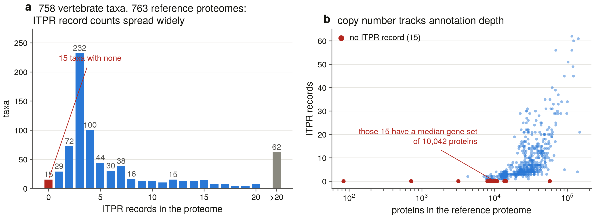

**Figure 3.8.** Copy number per proteome against annotation
depth. This relationship is the single strongest argument in the thesis for
searching genomes rather than gene sets: a census built on reference
proteomes measures how thoroughly each organism has been annotated at least
as much as it measures how many receptors that organism has, and the
correlation drawn here is that confound made visible. Every absence claim in
this thesis is taken to an assembly for this reason, which is what Chapter 4
begins.

## 3.10 What census v3 holds, and the three limits it carries forward

The merged census is 16,039 records: 8,000 IP₃ receptors, 7,432 ryanodine
receptors, 605 unassigned and 2 conflicts. Both instruments speak for 79.0 %
of records, the profiles alone for 13.7 %, and the architecture rule alone for
3.6 %.

Three limits carry forward, and each becomes a later chapter.

**The sweep is vertebrates only.** Every count here is a statement about 763
vertebrate reference proteomes, and nothing in it bears on the plant, fungal
or protist questions the enumeration opened. That is Chapter 5.

**A reference proteome is a gene set, not a genome.** A gene missing from one
may be missing from the annotation rather than from the DNA. That is Chapter
4.

**Profile assignment inherits its seeds' breadth.** The deep branches are
represented by seven non-metazoan seeds, and a lineage more diverged than any
of them is outside what this instrument has been shown to call. Chapter 5
builds a second panel by different rules for exactly that reason.

---

# 4. Searching 309 vertebrate genomes, and measuring what that search was worth

## 4.1 Why the reference proteomes were not enough

Chapter 3 ended with two limits. A reference proteome is a gene set rather
than a genome, so a gene missing from one may be missing from an annotation
rather than from the DNA, and fifteen of 763 vertebrate reference proteomes
carried no IP₃ receptor record at all. Neither of those is a biological
statement. Turning them into one requires searching the assemblies.

This chapter does that over a declared scope of 309 vertebrate genomes, and
then does something less usual: it measures what the search was worth. The
second half is not a methods appendix. The numbers it produces are the error
bars on Chapters 5, 9 and 13, and a census that reports zero losses, as
Chapter 9 does, is worth nothing unless somebody has measured how often the
same search fails to find a gene that is demonstrably there. That measurement
belongs with the instrument rather than with the result it qualifies.

## 4.2 The denominator was declared before the search ran

The scope is 309 assemblies, and it is the union of two rules.

The first rule is taxonomic. It takes one best assembly per vertebrate order
[33], 161 of them, ranked by a stated function that prefers annotated over
unannotated, RefSeq over GenBank, then assembly level, then scaffold N50,
which is the length such that half the assembly sits in pieces at least that
long and is the standard summary of how contiguous an assembly is.

The second rule is a margin rule, and it is computed from the census rather
than hand-listed. Four positive tests put a species in scope: its reference
proteome returned no family record at all, or it carries fewer than three
paralogues, or every record it has is below the family's minimum length, or it
is an anchor species the project needs for another reason. That produces 169
margin species, and the union with the order representatives is 309 genomes
and 552.5 Gbp.

The point of computing the margin set from the census is that the denominator
rebuilds itself. If the census changes, the scope changes with it, and the
scope document is rendered from the manifest rather than written.

That design has a consequence discovered later and worth stating here, because
it shapes every absence claim in the thesis. The margin species were selected
for what their *proteomes* lack. They turn out to be very largely the same
genomes whose *assemblies* cannot hold the gene: 68 % of margin species fall
below the contiguity bar against 12 % of order representatives. The two
signals are confounded by construction, and separating them is what §4.7 and
Chapter 9 exist to do.

## 4.3 Seven rules chose the bait panel, and six slots stayed empty

The sweep aligns proteins to genomes, so it needs baits. There are 38 of them,
comprising 30 IP₃ receptors and 8 ryanodine receptors as an internal positive
control, 121,294 residues in total, derived from the census by seven stated
rules rather than assembled by hand.

The rules are worth listing because each is a positive test. A bait's
paralogue label must come from the census rather than from its own gene
symbol. It must be full length and carry the complete architecture. There is
one bait per paralogue per clade band, and two in the bands that dominate the
scope. Every candidate passes a chimera screen. The ryanodine baits are a
presence control. The existing profile seeds are reused rather than
re-derived. And the panel is scoped to the vertebrate genomes of this sweep
and no other.

**Six slots stay empty, and that is a finding rather than an oversight.** They
are ITPR1 and ITPR2 in cartilaginous fish, ITPR2 in the coelacanth grade, and
all three in cyclostomes. The census holds no labelled, full-length,
complete-architecture record for those combinations at all, because the
paralogue labels simply run out below the well-annotated clades. Rather than
promote an unlabelled record into a labelled slot, three unlabelled baits
cover those genomes without making a paralogue claim, and Chapter 6 settles
the assignment.

**The chimera screen has its own negative control, run on every build.** The
screen rejected none of the 57 candidates, and a screen that cannot fire looks
identical from outside to a shortlist that is clean. So every build constructs
three synthetic failures from real panel baits and requires each to be
rejected by the rule responsible: an IP₃ receptor N-terminus joined to a
ryanodine receptor C-terminus, caught by the family assignment; a mis-joined
gene model with 435 unaligned residues inside its envelope, caught by the
shape rule; and a truncated model, caught by the length band.

That test earned its place on its first run by failing. It originally asked
the envelope rule to reject the truncation, which the envelope cannot and
should not do, because a protein truncated to 40 % of its length aligns 100 %
of itself to the profile in one clean segment. Truncation is the length band's
job and the envelope's job is fusion.

## 4.4 The aligner's intron parameter is a threshold on the call, not a performance knob

The protein-to-genome aligner [34] takes a maximum intron length. Its
default is 200 kb, and it is not a performance knob: a gene whose largest
intron exceeds it is split into pieces, and a split IP₃ receptor reads out of
this ledger as a fragment. Setting it wrongly manufactures exactly the
observation the thesis is trying to measure.

Chapter 2 supplied the wrong number for this. It measured genomic *spans*,
with human ITPR2 at 498 kb, and a span over 57 exons is not an intron. So the
largest single intron of every IP₃ and ryanodine receptor gene was measured
directly across an eleven-species panel.

**No IP₃ receptor gene in the panel has an intron over the default.** The
widest is 152,216 bp, in human ITPR1. The ryanodine control exceeds 200 kb
twice, the widest being human RYR2 at 227,927 bp. So the default is adequate
for the deliverable and marginal for the control, which is the opposite of
what the span figures suggested.

The rule the sweep uses takes the widest measured intron, doubles it, scales
it by genome size, floors it at the aligner's own default and caps it for
tractability. It is deliberately not the intron-per-gigabase ratio, because
that statistic is largest in the smallest genomes measured, and extrapolating
it linearly asks for a 7.4 Mbp setting on the lungfish, which is an artefact
of a small denominator rather than a measurement. The cap binds on two genomes
and the ledger flags both, because a fragment there could be a real intron the
sweep declined to span.

## 4.5 What the sweep found across 309 genomes

The sweep covered 309 genomes of the declared 309, recorded 2,144 loci, and
carried a ryanodine receptor bait with every one of them.

**The control fired in 309 of 309 genomes.** Ryanodine receptors are present
in three copies in every vertebrate, so a genome where the control finds
nothing has an assembly or a pipeline problem rather than a biological result,
and until it fires that genome's IP₃ receptor cells say nothing. None failed,
so no result below is excluded on control grounds.

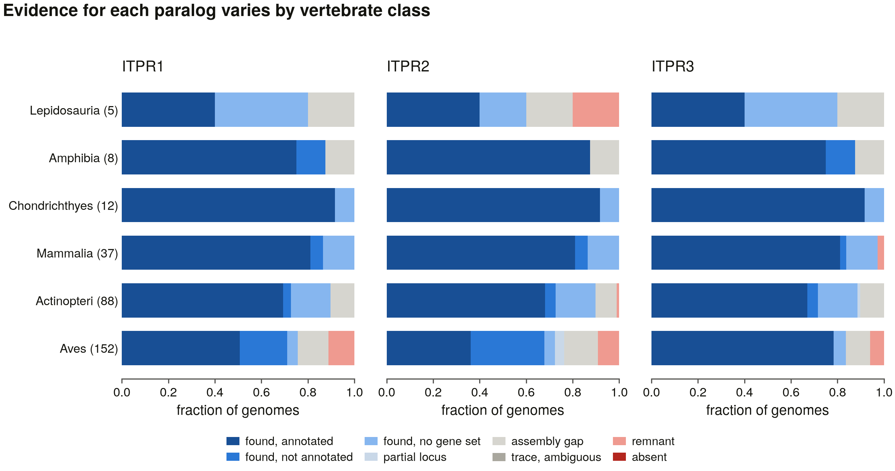

**Figure 4.1.** The three-paralogue ledger across 309 vertebrate
genomes, by class. This is the raw ledger before any of Chapter 9's
restatement, so it shows the problem that chapter had to solve. The family
is found nearly everywhere it is looked for, and what red there is falls in
particular vertebrate classes rather than scattered across them. Those
classes turn out to be the ones whose assemblies are worst rather than the
ones whose biology is different, so reading this figure directly as a map of
gene loss is the mistake the rest of the thesis is built to avoid.

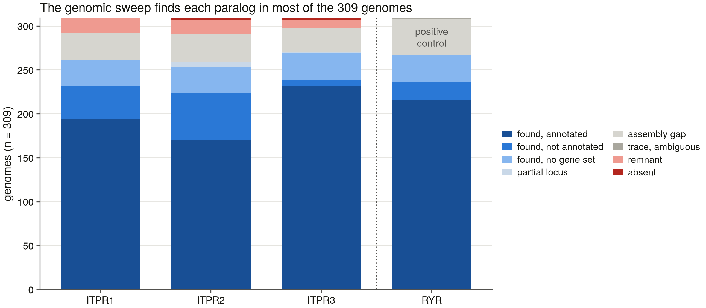

**Figure 4.2.** Cell status across the sweep, by paralogue. Four
cells of 927 are called absent, meaning no spliced-alignment locus and no
remnant from the rescue search. Those four are the strongest negative the
search itself can produce, and they are still not a loss claim: Chapter 9
shows that every one sits in an assembly that could not hold the gene or in
a genome whose paralogue labels the bait panel cannot resolve. The distance
between this figure and that conclusion is the distance between a search
result and a biological result.

**The two families never contested a locus.** At all 2,144 loci, only one
family's baits aligned at all. That is a far sharper separation than the
protein level afforded, where, before the sister test existed, all six
ryanodine decoys were promoted as candidate family members, and it holds from
the six-genome pilot through to full scale. Spliced alignment against a
labelled panel settles the family before any margin has to be applied.

## 4.6 A threshold inherited from another project was measured and overturned

The rescue step [35] attributes a fragment to a paralogue when its best bait
beats the runner-up by a stated relative margin. That margin arrived in this
project as an inheritance: 0.333, a 1.5-fold bit-score ratio, from a sister
project on a gene family whose paralogues are 40 to 50 % identical. These are
61 to 68 % identical.

The question is whether the threshold transfers, and it can be answered
without any new search. Loci whose paralogue identity the assembly's own
annotation establishes carry a margin measured on evidence the bait scores did
not produce. Across 542 such loci the margin runs from 0.136 to 0.411 with a
median of 0.314, and **368 of the 542 fall below the inherited threshold.**

A complete locus bounds a fragment's separation from above, so a threshold
that complete evidence fails cannot be met by a fragment. Under the inherited
value every rescue trace in this project would have been reported ambiguous
and no absence claim could ever have been attributed to a paralogue at all.
The threshold is now 0.22, which is the highest value that rejects none of
those correct calls, and its limitation is stated rather than hidden: derived
from complete loci and applied to fragments, it is a ceiling on the right
answer rather than the right answer.

The full sweep then produced the fragments themselves. Fifty-three rescue
regions overlap a gene the assembly names for a paralogue, so their identity
is established independently of the bait scores. The attribution agrees with
the annotation on 53 of 53, and none falls below the threshold in force. That
bounds the threshold from below, meaning it establishes how low the threshold
must be to keep correct calls, and not from above. That limitation is said
plainly because no region was attributed against its annotation, so nothing
measures where wrong calls would start.

**A second inherited constant failed the same way.** Rescue attribution
originally ranked every bait clade against every other, including the
unlabelled baits. Those are the gar, chimaera and lamprey seeds, which are
evidence that a region is an IP₃ receptor rather than a rival hypothesis about
which one. Ranking them as competitors collapsed real margins. In one bird
genome an ITPR1 trace scoring 916.1 against ITPR2's 700.6, a margin of 0.235,
was reported at 0.027 because an unlabelled bait sat between them at 891.6.
Every ITPR1 and ITPR2 trace in that genome was deflated the same way.

## 4.7 Assembly contiguity is why four absences are not four losses

An assembly whose contigs are shorter than the gene cannot carry the gene on
one contig, so an empty cell in such an assembly is evidence about the
assembly.

The bar this project uses is the median measured IP₃ receptor genomic span,
142,212 bp of contig N50, taken from gene geometry with no error rate in its
derivation. **120 of 309 genomes fall below it, which is 39 %, and they are
not a random 39 %.** Assembly quality across the vertebrates is uneven by
clade and by sequencing era, which is the problem the reference genome
consortia were set up to address [36], and this family's genes are long
enough to feel it. Two thirds of birds fail it against 11 % of
ray-finned fish, and 68 % of margin species against 12 % of order
representatives.

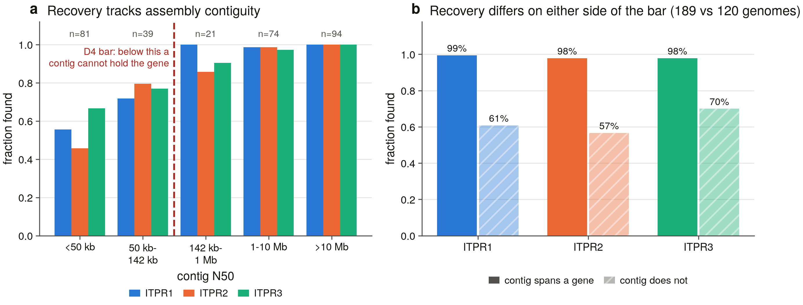

**Figure 4.3.** Recovery against assembly contiguity, binned
on the bar rather than across it. A sliding window straddling the threshold
would report a recovery rate that no genome in the window has, smoothing
away the very discontinuity the panel exists to show. The relationship drawn
here is the confounder every absence claim in this thesis has to survive,
and it is why the contiguity floor is applied before any cell is read as
evidence about biology.

The pilot had predicted, from six genomes, that a fragmented assembly loses
the long paralogues first, because a 231 kb ITPR2 needs a contig that an 82 kb
ITPR3 does not. At 309 genomes that is confirmed: above the bar all three
paralogues are found in 98 to 99 % of genomes, while below it ITPR1 is
recovered in 61 %, ITPR2 in 57 % and ITPR3 in 70 %.

This matters more than it looks. The detection bias runs in the same direction
as the loss signal the margin species were selected for. A per-paralogue
absence in a fragmented assembly cannot be read as a loss, and the confound is
structural rather than incidental.

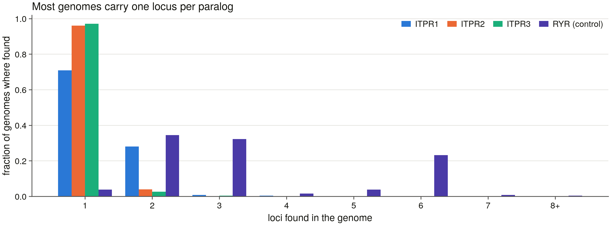

**Figure 4.4.** Copy number per genome across the sweep. The
excess above three copies is not spread across the vertebrates but sits
almost entirely in the ray-finned fish, which is what a whole-genome
duplication confined to one lineage looks like from a copy count. Chapter 7
turns that observation into a tested claim about which paralogue was doubled
and retained.

## 4.8 The three paralogues are not annotated equally well

The sweep also produces something the protein databases cannot: for every gene
it finds, whether an annotation is there and whether that annotation names the
right paralogue. The measurement is restricted to loci the sweep found in an
assembly that carries a gene set, so the denominator is genes that exist and
are annotatable, and it then additionally holds contiguity constant, because
otherwise it measures assembly quality and calls it annotation quality.

Above the bar, a gene model is present at 96 % of found loci for all three
paralogues. It names the paralogue correctly at 65 % for ITPR1, 87 % for ITPR2
and 88 % for ITPR3.

A 23-point gap between genes of near-identical protein length in the same
genomes is not a biological difference. A census built on gene symbols
inherits that gap as an apparent difference in copy number, which is why
Chapter 13 exists.

The uncontrolled version of that table is instructive about the control.
Without holding contiguity constant, ITPR3 appears to be 21 points better
annotated than ITPR2. Above the bar the two are within one point, so the
apparent annotation gap between those two paralogues was assembly quality.

## 4.9 The sweep found 318 genes that exist only as DNA

The sweep contributes 1,058 gene models from 224 genomes, each scored against
both profiles so that a new census row rests on the instrument that called the
old ones. The census becomes 17,097 records.

The interesting column is not how many but **how a database holds each locus**.
318 IP₃ receptor gene models exist only as DNA, meaning there is no gene model
at the locus, or the assembly has no gene set at all. A further 167 sit inside
an annotated gene that carries no family name, so no search by name can reach
them however complete the protein databases are.

Three loci are claimed by a paralogue cell other than the one the assembly's
annotation names, and one of those sits in a genome that also carries a
separate locus for the paralogue the annotation names, so the two cannot both
be that paralogue and the disagreement is internally coherent. They are handed
to Chapter 13 rather than adjudicated here, because one instrument does not
overturn a public annotation and this family's paralogue margins are narrow.

---

## 4.10 How the search can be used as its own control series

Everything above is a search. What follows is a measurement of that search,
and it is placed here rather than in a methods appendix because the numbers it
produces are the error bars on Chapters 5, 9 and 13.

The design is what makes it possible, and it depends on a result that has not
been reported yet. Chapter 9 reconstructs no losses anywhere in this scope. If
no gene in the scope is absent, then every cell whose gene is independently
known to be present and which the ledger did not find is a **false negative of
the method**. It is not a biological absence and not an ambiguous case, but a
miss with a known right answer. That turns the whole sweep into its own
control series.

Two independent series are carried, because one of them would be circular on
its own. The first is every cell that Chapter 9's state rules call present.
The second is the ryanodine receptor sister cell, which uses none of those
rules at all: every vertebrate has three ryanodine receptors, so every
genome's control cell has a known answer that no part of this project's state
logic produced.

Before any of it is written, 32 constructed negative controls run and refuse
the build if they fail. Their character is worth noting, because it is the
character of every test suite in this project: they are checks on refusal and
on reachability. One requires that a false negative be **constructible** at
all, because a control that can only ever return zero misses is not a
measurement. Another requires the full-panel simulation to reproduce the
committed ledger cell for cell. A third requires the suite itself to alter no
committed table, and it exists because an earlier build's test called the real
routine and overwrote a committed table with its two constructed rows, after
which the report read two runs where there are seven.

## 4.11 The search misses about one cell in seven, and every miss is an assembly

Over the whole 309-genome scope the search misses **140 of 923 control cells,
15.2 %**.

The misses are not distributed evenly. A missed cell's assembly has a median
contig N50 of 23,460 bp against 3,396,515 bp for a found one, and the odds of
finding the gene rise 8.10-fold per tenfold of contig N50 in the IP₃ receptor
series and 19.99-fold in the ryanodine series. On chromosome-level assemblies
the IP₃ series misses 3 of 512 cells and the ryanodine series misses none of
172.

**Figure 4.5.** The measured false-negative rate against assembly
contiguity, with the bar drawn. This is the figure that licenses the
retention result, because a survey reporting zero losses is worth nothing
unless somebody has measured how often the same search fails to find a gene
that is demonstrably present. The two series are independent, since the
ryanodine sister series uses none of the state rules the family series
depends on, and they agree, which is what stops the number being read as the
search agreeing with itself.

**The contiguity bar was chosen a priori and survives calibration.** The
142,212 bp floor came from gene geometry, meaning the median measured genomic
span of the gene, with no error rate anywhere in its derivation, and it had
never been scored against one. Scored now, the IP₃ series has a residual miss
rate of 0.9 % over 563 cells above the bar and the ryanodine series 0.0 % over
189. That is conservative against a conventional five-per-cent target, which
the scan reaches at a floor of 100,000 bp, and about right against a
one-per-cent target.

The bar is not free. It removes 38.8 % of the genomes, and it removes them
disproportionately from exactly the clades a loss survey is most interested
in. That cost is quantified rather than absorbed: the clade composition of
what each candidate floor retains is committed, so a reader can see which
question each floor makes unanswerable.

The residual is also diagnosed locally rather than dismissed. Contig N50 is a
genome-wide statistic and a regional assembly defect is invisible to it, so
each remaining miss is checked against the flanking-gene consensus of its own
paralogue to ask whether the region survived at all.

## 4.12 The bait panel was ablated exactly rather than modelled

How much of the panel was doing work? The question is normally answered by
argument. Here it is answered exactly, because the aligner aligns each bait
independently: dropping baits from a retained alignment and re-clustering
reproduces exactly what the sweep would have reported with a smaller panel.

The full chain is reproduced rather than approximated. It runs cluster, then
the identity floor, then the cell assignment where the family call lives,
because scoring the best coverage over every alignment instead would let an
ITPR3 bait's hit at the ITPR1 gene stand in as ITPR3 evidence and make every
panel look alike. The simulation reproduces the committed ledger 1,236 cells
out of 1,236, so every delta below is measured against the sweep itself rather
than against a model of it.

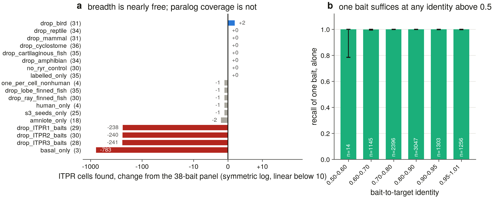

**Figure 4.6.** Nineteen panels, drawn as change from the full panel on
a symmetric-log axis. Every panel scores between 0.58 and 0.85 of the cells,
so on an absolute linear axis the entire breadth result would be one pixel,
and the one ablation that removes every labelled bait sits 783 cells away
from the rest. The importance of this figure is that it overturns the usual
intuition about how to build a bait panel. Phylogenetic breadth, which is
what a panel is normally padded with, buys almost nothing inside the
vertebrates, while paralogue coverage buys everything. Anyone designing a
comparable survey should spend their panel budget on paralogues and on
clades where no labelled record exists, and this figure is the measurement
that says so.

Two readings fall out, and they point in opposite directions.

**Phylogenetic breadth buys almost nothing.** Four human baits, one per cell,
recover 782 of the 783 cells that the 38-bait panel recovers. Dropping any
single clade band costs at most two cells. The three unlabelled baits cost
nothing when removed and recover zero cells on their own, because the sweep
offers an unresolved-clade locus to whichever labelled paralogue scores
highest there, and with no labelled bait present there is nobody to offer it
to. Their function is to keep a real shark or lamprey gene inside the family
when it outranks every labelled bait, not to place it in a cell.

**Paralogue coverage buys everything.** Removing one paralogue's own baits
costs 238, 240 and 241 cells, which is about a quarter of the recovery each,
and no amount of breadth in the other two replaces it.

**Removing the sister-family control changes no call.** The positive family
test at genome scale costs nothing in recall, which is the cheapest possible
price for it.

**An ablation can gain a cell, and that is a property of the rule.**
Sixty-eight of the 2,179 call changes across all panels are gains, by the same
mechanism every time. A cell's coverage is read off its top-scoring bait
rather than its best-covering one, so removing a competitor can promote a bait
whose coverage is fractionally higher and push a marginal cell across the
coverage bar. The two gains under one ablation are a chicken bait at 0.6956
coverage giving way to a lizard bait at 0.7022, which is seven thousandths
either side of the threshold. They are reported rather than folded away,
because an ablation table with unexplained positive deltas invites the reading
that a smaller panel searches better.

## 4.13 What each search channel actually contributed, on three separate denominators

Three denominators are kept apart, because conflating them is the standard way
this question gets answered wrongly.

**How the census accumulated.** The targeted database search that started the
project returned 1,571 records. Exhaustive signature enumeration took it to
15,421. The vertebrate profile sweep added 618 and the genome sweep added
1,058. The non-vertebrate proteome sweep added 785 and the non-vertebrate
genome sweep 183, giving 18,065.

**Profile models against domain annotation, inside one database.** Both
channels are counted by what they call family rather than by raw hits, and
both are restricted to accessions the swept files actually hold. Comparing a
curated set against a raw hit list would credit the vertebrate sweep with the
13,371 targets its own gate declined.

At gene scale the two return nearly the same set. In the vertebrates the
enumeration returns 3,135 gene-scale records and the profile sweep 3,136, of
which 3,135 are shared, so the profile adds one. In the non-vertebrate metazoa
it adds two to 1,021. Its entire gain is in the fragment tail. The one
exception is worth naming: in the protists it adds 89 gene-scale records the
enumeration never returned, which is where the family's architecture is least
well annotated.

The other side of that statement is the same measurement seen from the other
direction: 766 vertebrate records carry a family signature and are declined by
the profile pair, all of them under 1,000 residues, which is the span gate
doing exactly what it was added for.

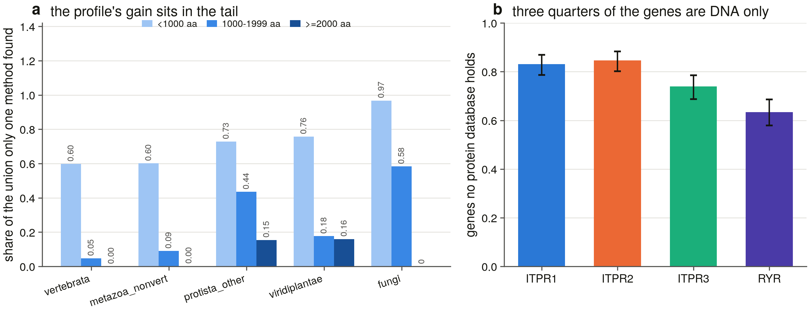

**Figure 4.7.** What each channel contributed, drawn as
disagreement rates rather than as stacked counts. The claim is a proportion,
and stacking proportions on a logarithmic axis misreads them by
construction. The figure matters because it prices the standard approach. A
family profile searched over reference proteomes, which is how most
gene-family surveys are done, returns at gene scale almost exactly what
domain annotation already returns. Its entire gain is fragments, and the
only place it finds whole genes that annotation missed is the clades where
annotation is worst.

**Per gene, what a protein-database search would have missed.** Asked per
genome by cell rather than per record, with the genome sweep as ground truth
for where the genes are, **940 of 1,232 demonstrated genes, or 76.3 %, are not
reachable by any protein-database search.** They are not hard to find. No
protein record of them exists.

That is not an artefact of the margin species. Split by why each genome is in
scope, the rate is 74.3 % for order representatives against 78.5 % for margin
species. Chapter 13 is what that number turns into.

## 4.14 The rule written to catch iterative-search drift never fires

Chapter 3 left a question open: two of three iterative searches were killed by
a round ceiling rather than by the rule written for the hazard. With seven such
runs now available across the whole project, the rules can be scored as
classifiers.

The outcome is measured on the finished model rather than taken from any
session's prose, using the share of a run's final included set that neither
profile scores at all. The seven runs separate cleanly, with three at 0.81,
0.97 and 0.99 against four at 0.23 to 0.34 and nothing between 0.34 and 0.81,
so the labels are not a judgement call.

**Figure 4.8.** Each kill rule scored as a classifier of a drift
outcome measured on the finished model. The figure records an instrument
failing at the one job it was built for: the rule written to catch
sister-family drift has a sensitivity of zero across seven runs, including
all three that drifted, because the drift dilutes the very quantity the rule
measures. The correction is a one-line change to a different axis, and it is
reported rather than applied, because it was validated after the fact on the
runs it would reclassify.

**The sister-family rule fires on none of the seven runs, including all three
that drifted.** The reason is now measured rather than described: off-family
accretion dilutes the sister-family share, so the rule's own statistic moves
the wrong way while a run drifts. The sister share fell over the run in four
of the seven.

The round ceiling catches all three drifted runs and also flags three that did
not. It counts rounds rather than content, which is right for a budget and
useless as a diagnosis.

**One change fixes it.** Moving the same threshold from the sister-family
share to the off-family share separates all seven runs completely, firing at
round 2 or 3 in each of the three that drifted and never in the other four, at
sensitivity 1.00 and specificity 1.00. It is reported and **not applied**,
because it is validated after the fact on seven runs with an inherited
threshold, and applying it would overturn committed verdicts. That is a
decision for a session that owns those tables rather than for the one that
noticed.

**Seed choice does not change the family, only the debris.** The three
vertebrate runs were seeded from a human paralogue, a fly gene and an
amoebozoan gene. Their family content is the same set three times over: they
intersect on 4,785 family records and differ by at most 162. What the seed
changes is everything that is not the family, in that the amoebozoan run
carries 19,949 non-family targets against roughly 2,439 for each of the other
two. A distant seed does not reach further into the family. It reaches further
out of it.

## 4.15 The inference ran out in four places, rather than the search

Four limits were met while doing something else, and each is a general result
about the method rather than about this family.

**A reconciliation's loss count is mostly sampling.** Losses implied by a gene
tree over a 134-tip alignment, checked cell by cell against the 309-genome
ledger, give 47 implied cells, 26 of them the paralogue present in the genome
and absent only from the sample, and none corroborated.

**Synteny disambiguation is accurate and unavailable.** The neighbourhood
caller built in Chapter 7 is right wherever it acts and almost never acts on
the cells that need it: of 432 trace regions it reaches 8, because a
fragment's contig carries no neighbours to read. Accuracy and reach are
different numbers, and quoting only the first would report contig lengths as
method performance.

**Per-site codon models are past their power at these divergences.** The
synonymous rate is unidentifiable at 671 of 7,368 sites, and 373 of 420
pairwise comparisons are flagged saturated. Any per-site rate formed as a
ratio of sums is dominated by sites whose denominator is not estimable.

**A likelihood tree need not resolve the question asked of it.** The test
that compares the three sister arrangements leaves two topologies inside its
95 % confidence set, so the sister question is answered by what the data
excludes rather than by reading the best tree. Chapter 6 reports both.

## 4.16 Five results here apply to anyone doing the same thing

1. **A genome-scale orthologue sweep misses about one cell in seven, and every
   miss is an assembly.** A survey that reports absences without a contiguity
   floor is reporting assembly quality.
2. **A contiguity bar can be set from gene geometry before any error is
   measured**, and it lands where a calibration would have put it, at a cost
   of 38.8 % of the genomes, disproportionately in the clades a loss survey
   most cares about.
3. **Phylogenetic breadth in a protein bait panel is nearly worthless within
   the vertebrates, and paralogue coverage is everything.** Spend the budget
   on paralogues and on clades where no labelled record exists.
4. **A family profile over reference proteomes is not a discovery method for
   whole genes.** At gene scale it returns what domain annotation already
   returns, its gain is fragments, and it adds gene-scale records only where
   the annotation is worst.
5. **The obvious rule for catching iterative-search drift measures the wrong
   thing.** Sister-family contamination is the quantity this project and its
   predecessor both chose to monitor, and it is diluted by the very drift it
   is meant to detect.

---

# 5. How far the family reaches across the eukaryotes

## 5.1 Two questions that look like one, and have to be answered separately

"Where does this gene family occur?" is normally answered from a database and
reported as a range. That answer conflates two questions that have to be kept
apart, and this chapter answers them separately.

The first question is about the record: in how many reference proteomes does a
family member appear? That is a statement about what gene callers have found,
and it is the one a database can support on its own.

The second question is about the DNA: in genomes where no gene caller found
one, is there one? Answering it requires searching assemblies and, crucially,
a **positive control that demonstrates the search could have found the gene
had it been there**. Without that control, "no IP₃ receptor in *Arabidopsis*"
is indistinguishable from "the search did not run properly on *Arabidopsis*".
The distinction is not academic in this family. Plant cells release calcium in
response to IP₃, no plant receptor gene has been identified, and the standing
review of the subject asks in its title whether the receptor is real [37],
so a plant absence is a claim somebody has been waiting for.

Both questions are answered here, over 6,928 reference proteomes and 194
genomes.

## 5.2 The proteome sweep covers 6,928 proteomes and partitions the eukaryotes

The sweep covers six groups: non-vertebrate metazoa, fungi, green plants,
other protists, archaea and a genus-stratified bacterial sample. Together they
comprise **6,928 reference proteomes, 63,144,898 proteins and 24.93 gigabases
of residue.** The four eukaryotic groups partition Eukaryota with Chapter 3's
vertebrate sweep, so no proteome is swept twice and the two denominators add.

Two sampling decisions are stated rather than assumed. Bacteria are sampled at
one proteome per genus, taking the one with the most proteins, which is the
most sensitive member of each genus, so a negative claim is made in the places
most likely to break it. Archaea's reference set is small enough to take
whole, so no sampling caveat attaches to it.

Twenty-three proteomes that UniProt lists are not published in the release
tree and return a permanent 404. They are excluded from the denominator and
recorded, together with what they took out of it, rather than retried. A
listed but unpublished proteome is not a transient failure and retrying cannot
fix it.

The instrument is Chapter 3's, unchanged: the same two profile hidden Markov
models [30] over the same reference proteome collection [31], with the
same 30-bit floor, the same 200-match-state span gate and the same relative
margin.
Reusing it rather than building a new one is what makes the vertebrate and
non-vertebrate numbers comparable at all.

## 5.3 The family is present in 662 of 6,928 proteomes, and in no prokaryote

**662 of 6,928 reference proteomes carry an IP₃ receptor call**, and 45 of the
135 clades swept do.

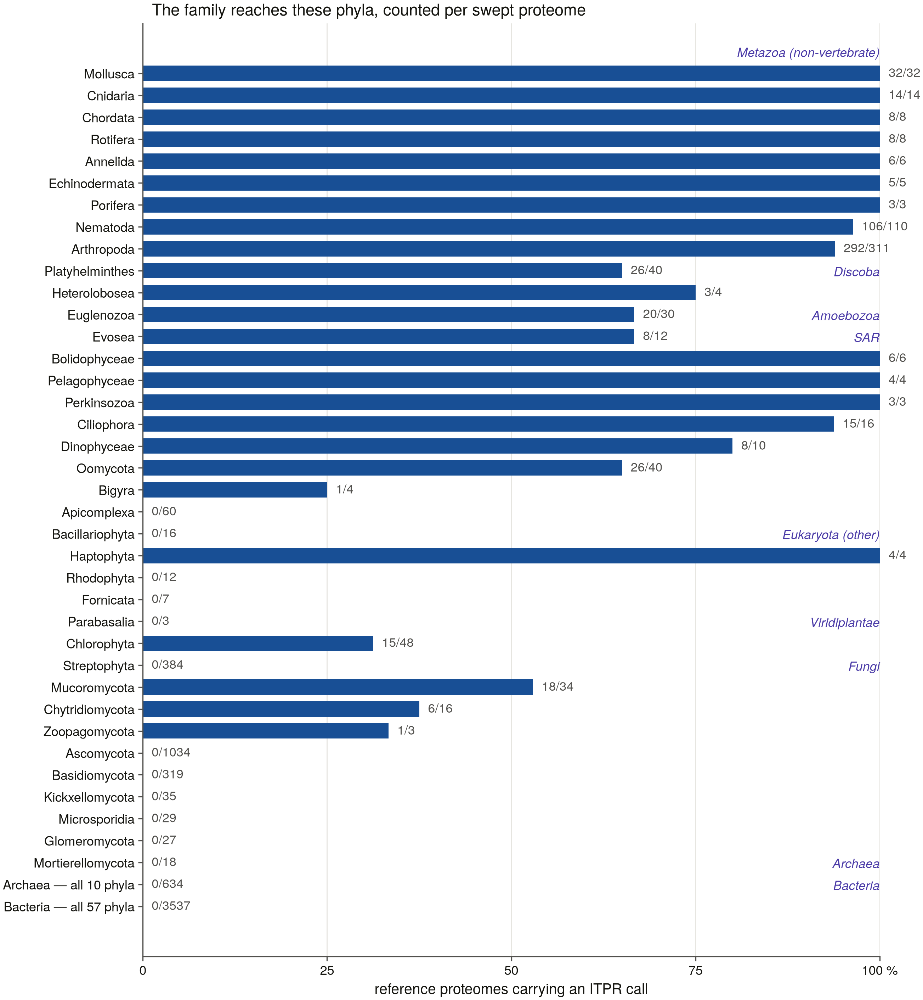

**Figure 5.1.** The family across the eukaryotes, drawn as a
fraction of swept proteomes rather than of records. That denominator is the
whole point: counted by records, a single well-sequenced alga outvotes a
sparsely sampled phylum, and the figure would report sequencing effort. The
importance of this figure is the shape rather than any single bar. A family
present across the metazoa, in several protist lineages, in the green algae
and in the early-diverging fungi, and absent from land plants and from the
yeasts and moulds, is a family that was present in the eukaryotic ancestor
and has been lost repeatedly since. That is a different claim from an animal
innovation, and it is what the figure supports.

The shape is a family that is ancestrally eukaryotic and has been lost
repeatedly, which is what earlier surveys of the calcium-signalling toolkit
had inferred from smaller samples [38,39,40] and what repeated loss is
now understood to look like as an ordinary evolutionary mechanism [26]. It
is in 94 % of arthropod proteomes, 96 % of nematode, and 100 %
of molluscan, cnidarian and sponge. It is in 65 % of oomycetes, 67 % of
euglenozoans, 94 % of ciliates and 69 % of amoebozoans. It is in none of 634
archaeal and none of 3,537 bacterial proteomes.

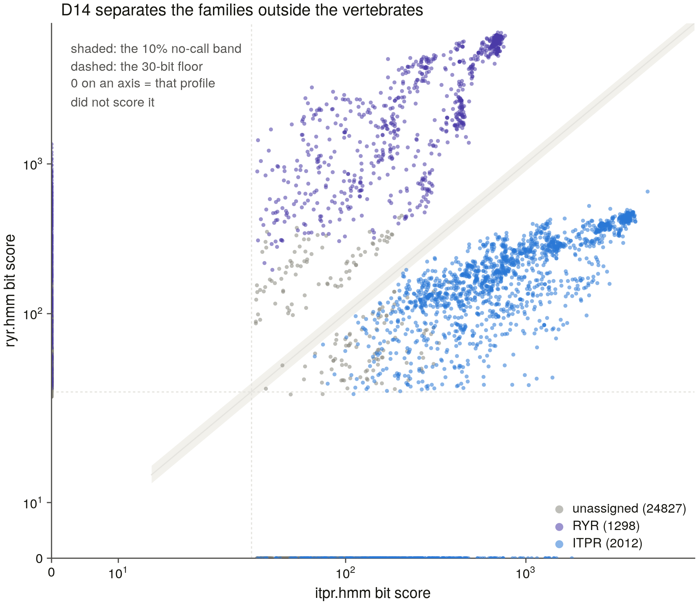

**Figure 5.2.** The same two-profile separation outside
the vertebrates, with the no-call band drawn. 28,137 targets were scored by
at least one profile and 2,769 by both above the floor, which are the only
ones where the two families can be said to compete at all, and exactly one
of those falls inside the band where the instrument declines to choose. The
family separation therefore transfers intact to organisms a billion years of
divergence away from where it was calibrated. Without that, every
non-vertebrate count in Chapter 5 would be a mixture of two families rather
than a measurement of one.

## 5.4 Land plants and Dikarya have no IP₃ receptor, and their early-diverging relatives do

Chapter 2 recorded an anomaly: forty plant and forty-one fungal proteins carry
the IP₃-binding-core signature while *Arabidopsis* and budding yeast have
none. Chapter 3 sharpened it. In the enumerated space every green-plant call
was in Chlorophyta and **Streptophyta, the land-plant lineage, had none**,
while every fungal call was in an early-diverging phylum and **Dikarya
contributed no records at all**.

Those were statements about a space a protein enters only by already carrying
a family domain annotation. Sweeping the proteomes themselves asks the
question without that filter, and both statements hold.

For land plants, **0 of 384 Streptophyta reference proteomes carry a call**,
against 15 of 48 Chlorophyta. For the fungi, **0 of 1,034 Ascomycota and 0 of
319 Basidiomycota** carry one, against 18 of 34 Mucoromycota, 6 of 16
Chytridiomycota and both Basidiobolomycota.

That is the shape of a loss rather than of an absence: the family is present
in the early-diverging lineage of both kingdoms and gone from the derived one,
with the fungal split read against the accepted backbone of the kingdom
[41]. In the plants it puts a genomic answer under a question the plant
calcium literature has kept open, because the green algae these lineages
descend from carry the gene [42] and the land plants that followed do not,
so whatever performs the physiology there is built from other channel
families [43,44].

**Every plant and fungal record was then chased individually**, 64 and 35 of
them, through four independent lines of evidence, because a handful of records
in a kingdom whose model organisms have none is exactly the shape of a
contamination artefact.

**Figure 5.3.** Every plant and fungal record chased, with the
cross-kingdom identities the contamination test rests on. That axis decides
whether these records are biology or contamination, which is the question
the whole range claim turns on: a genuine deep homologue is 20 to 40 %
identical to its metazoan relatives, while an assembly contaminant is 95 to
100 % identical to one particular animal. Nothing here is above 40 %, so the
surviving records are real green-algal and early-diverging fungal genes,
which is what makes the land-plant and Dikarya absences losses rather than
the family's boundary.

Twenty-two plant records and 25 fungal records survive every test, and the
rest are fragments of real genes. The surviving plant records run from 19.9 %
to 39.9 % identity to anything outside their kingdom, and the fungal ones from
20.5 % to 33.5 %. None is a contaminant.

They are also not evenly spread. *Cymbomonas tetramitiformis*, a green alga,
contributes twelve of the twenty-two plant records against a median of one per
species. Whether that is a real copy-number expansion or a duplicated assembly
is not a question a proteome can answer, and §5.8 answers it.

## 5.5 Every negative claim was made twice, at two stated sensitivities

Every negative claim in this chapter was made twice: once with the two
full-length family profiles at a strict threshold, and once at a much looser
one with those profiles plus the family's four individual Pfam domain models.
A 213-state domain model can reach something a 2,684-state channel model
cannot, and a negative claim should be made with the most sensitive instrument
available rather than the most specific.

The design behind that is worth stating. The same search is run once and
filtered twice: every search runs at the loose threshold and the strict call
is taken by filtering the same output, so the strict set is exactly what a
strict run would have produced and the loose set is a superset from the same
search rather than a second experiment.

That equivalence was tested rather than assumed, and **the assumption behind
it turned out to be wrong.** The reporting threshold is applied to the
conditional expectation value, which is normalised by how many sequences
passed, so a looser setting inflates every conditional value by a constant
factor and pushes marginal domain rows out of the report. Measured across 798
protist targets, the sequence sets and all 798 assignments agree and no gate
decision moves, but 11 domain rows differ. A second effect appears only at
scale: the sequence expectation value is printed to two significant figures,
so a target whose true value sits just above the cut prints as if it were at
the cut, and 42 of 13,770 plant targets on the ryanodine profile are admitted
by a less-than-or-equal filter that a strict run would never have reported.
All 42 are declined by the span gate anyway.

The pass criterion is therefore about the call rather than about set equality:
no assignment moves, no gate decision moves, and no one-sided target is
called. The equivalence test also refuses to pass vacuously. Its first run
went green on the archaeal group, which has no hit at either threshold, so a
comparison of fewer than 25 targets is now a failure with its own message.

**Each group was also searched again iteratively**, from a seed native to that
group, under the same coded kill criterion Chapter 3 used. The completeness
question this answers is precise. A model seeded in one lineage and iterated
to convergence either reaches a neighbouring lineage or it does not, and the
targets that only iteration found are the ones that matter. If they sit in the
same lineage as the seed, the absence next door is not a sensitivity artefact.

**Figure 5.4.** Per-group convergence with the sister-family trace
beside it. One of four groups converges and the other three hit the kill
criterion, and Chapter 4 explains why the rule that catches them is the
wrong one. The figure matters as a sensitivity check on the absences this
chapter reports: an iterative search that reached into an empty lineage and
found a receptor would overturn them, and what the trace shows instead is a
search running until it meets the sister family and stopping there.

Nine targets entered an accepted model that the single pass never reported.
They are named rather than counted, and two of them sit in a lineage this
chapter calls empty, so the absence there is not quite absolute and what those
two are decides whether that matters. **Both are mannosyltransferases**,
meaning the MIR-domain sharer that Chapter 3's decoy panel was built around
rather than a receptor. The iterated search reaches these lineages exactly far
enough to pick up the known false positive and no further, which is the most
informative result the iteration could have produced.

## 5.6 The absences were taken from the proteome to the genome

A proteome absence is a fact about a gene caller. The 194-genome sweep turns
the ones that matter into facts about genomes.

**The scope is chosen to sample most finely where the negative claim is.**
Five rules were applied to 24,596 NCBI eukaryotic reference assemblies
[33], minus the 6,216 vertebrate ones: one assembly per non-vertebrate
eukaryotic phylum; one per class in the five phyla with more than 100 swept
proteomes; one per clade with at least ten swept proteomes and zero calls;
the anchor organisms whose answer is known from the literature; and the
highest-copy species per class. That gives 194 genomes and 100.4 Gbp.

The third rule re-derives the target list from the presence table rather than
repeating a summary, and in doing so it **found three absences that summary
never named**: diatoms at 0 of 16, red algae at 0 of 12, and **Cestoda at 0 of
11, a metazoan clade with no record at all.** The first two sit in lineages
whose calcium-channel repertoires have been surveyed and found to differ
sharply from the animal one [45], and the third is a clade that has shed
gene families across its whole biology as an adaptation to parasitism [46].
The apicomplexan and microsporidian absences belong with the severe genome
reduction those lineages have undergone [47,48].

**Both genomic thresholds had to be re-measured, and neither transferred.** A
vertebrate IP₃ receptor gene spans 76 to 498 kb and a *Drosophila* one spans
22 kb. Measured across sixteen genes in sixteen species from NCBI's own gene
annotations, and deliberately not from the aligner, whose own intron setting
shapes the loci it reports so that a measurement taken that way cannot falsify
the setting it calibrates, spans run from 3,739 to 324,840 bp with a median of
19,435. That is a hundred-fold range against the 6.5-fold measured inside the
vertebrates, so **the contiguity bar is set per group**. Metazoan genes are
about nine times longer than protist and fungal ones, at 83 kb against 7 to 9
kb, and the genomes carrying this chapter's negative claims are judged against
the smaller bar, which almost any modern assembly clears.

One gap is stated in the output rather than hidden. No green-plant gene span
could be measured, because the chlorophyte census records carry locus tags
with no gene record, so every plant genome is judged against the global
median. The calibration function returns that fallback in its own return value
so that a caller cannot fail to notice.

## 5.7 The positive control had to be replaced twice

Chapter 4 could write "the ryanodine control fired in all 309 genomes" because
every vertebrate has three ryanodine receptors. Outside the metazoa that
sentence is not available, because the proteome sweep found architecture-level
ryanodine receptors in **2 of 6,928** non-metazoan proteomes. A land plant
with no ryanodine locus is the correct answer, so it cannot be that genome's
proof of search.

The first replacement was the MIR-domain sharer, meaning the
O-mannosyltransferase family, which is in the family's own signature set,
present in the clade each claim is about, and simultaneously the sharpest
available decoy. Where a query on the IP₃-core signature returns nothing in
land plants, a query on MIR returns 633.

**It was still one profile fixed in advance for every clade, and that is what
failed.** Both apicomplexan classes carry a single MIR protein each across 60
swept proteomes, and the pilot's *Toxoplasma gondii* came back with neither a
receptor nor a control, making it the one genome in the pilot whose absence
claim therefore rested on nothing.

The fix is not a different profile. It is not fixing the profile in advance. A
control's job is to fire in the clade whose absence is the claim, so which
family makes the best control is a property of the clade and is measurable.
Six candidate profiles, all large, deeply conserved, multi-exon eukaryotic
families, were run over each clade's own swept proteomes, and each clade takes
the one that is actually there, with every candidate's coverage committed
rather than only the winner's. The MIR bait stays in the panel whatever the
measurement says, because dropping it would buy a proof of search and sell the
family's negative control.

**193 of 194 genomes are controlled**, and 115 of them across a kingdom
boundary, meaning that a control bait from a different kingdom-level group
aligns across the same locus. That is the tier an absence claim needs, because
it shows the search reaches across the divergence any receptor here would have
to be found across rather than merely that the assembly is readable. In the
pilot, 1 of 14 genomes was uncontrolled. Here, none.

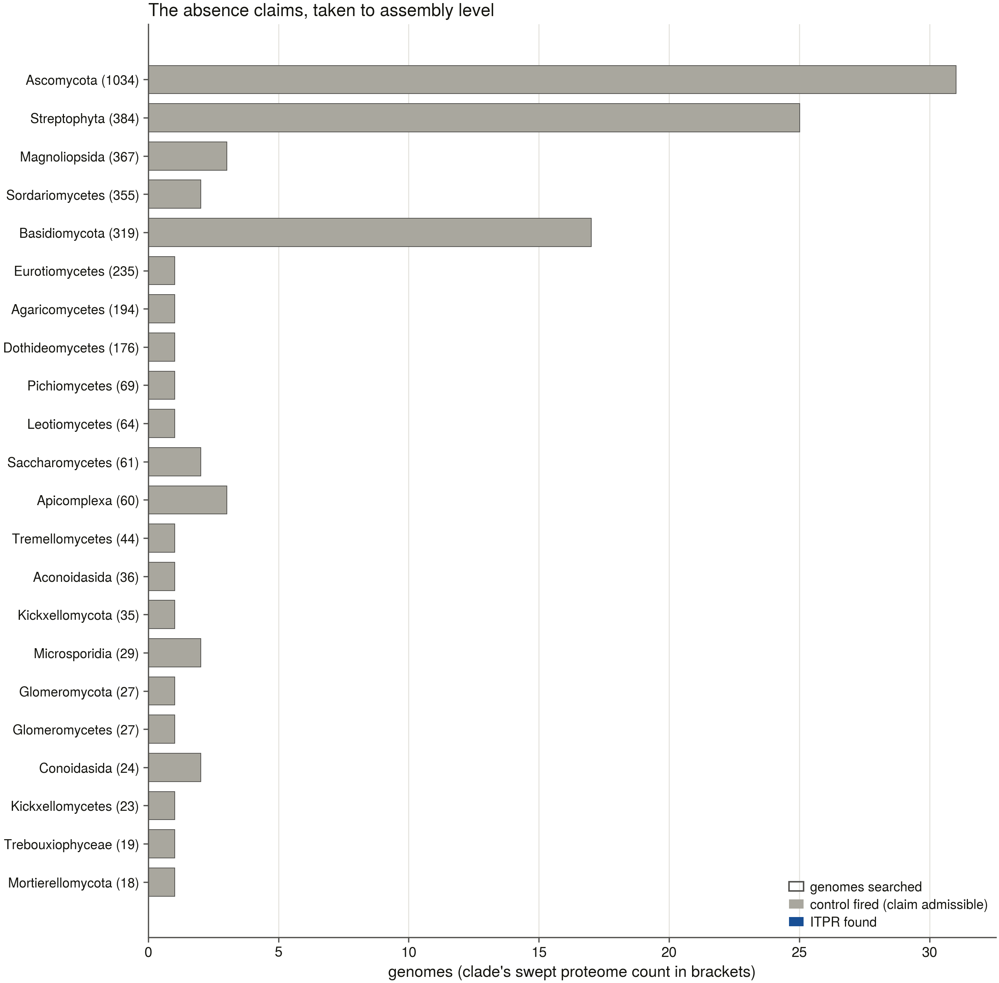

**Figure 5.6.** Each absence claim with the number of
controlled genomes drawn beside the number searched. The two bars are the
difference between a database observation and a biological claim. A clade
with no records in any proteome may simply not have been searched properly,
so what licenses an absence claim is the number of genomes in which a
measured positive control recovered a comparably long, deeply conserved
gene. A claim whose control bar is short is standing on nothing, and drawing
the two counts together is the only honest way to present a table of zeros.

**Every one of the 35 clade-level absences holds at assembly level, and none
fails.** Ascomycota has none in 31 controlled assemblies, Streptophyta none in
25, and Basidiomycota none in 17. Apicomplexa, Microsporidia, Glomeromycota,
diatoms, red algae and Cestoda likewise.

## 5.8 Copy number outside the vertebrates reaches eighteen

Outside the vertebrates the three paralogue cells do not exist, because ITPR1,
ITPR2 and ITPR3 are a vertebrate whole-genome-duplication product and Chapter
4 found the trio absent below the cyclostomes. The question is simply how many
receptors a genome has.

Of 193 controlled genomes, 116 carry none, 43 carry one, and 34 carry more
than one. The top of the distribution is a flatworm, *Macrostomum lignano*,
with 18 complete gene models, then a ciliate, *Stentor coeruleus*, with 13,
then two sponges at 8 and 6.

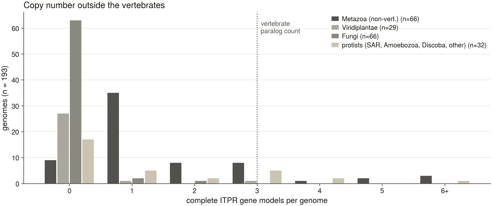

**Figure 5.5.** Copy number outside the vertebrates, with the
vertebrate paralogue count drawn as a reference line rather than as a
category. Drawing it that way shows the vertebrate three to be unremarkable:
a flatworm carries eighteen receptors and a ciliate thirteen, so copy-number
expansion in this family is not a vertebrate story and three is not the
family's high-water mark. What is specific to the vertebrates is that their
three copies are ancient, distinct and universally retained.

*Cymbomonas*, the green alga that contributed twelve of the twenty-two
surviving plant protein records, carries **three** complete gene models across
two clusters. Twelve records and three genes is what a duplicated assembly and
a multi-isoform gene set look like from the protein side, and it is the answer
the proteome could not give.

## 5.9 Two further thresholds had to be measured for this scope

Two thresholds in this sweep are measurements rather than settings, and both
had to be made here because neither transfers from the vertebrates.

**A cluster of alignments is not a gene.** With the intron parameter set high,
as §5.6 requires, a cluster is a large object, and two rules pull in opposite
directions. Neighbouring same-strand clusters whose bait spans are
complementary are one gene the aligner broke, and one cluster containing two
distinct complete models is two genes. Both were implemented, both record the
numbers they fired on, and their measured effect over the sweep is seven genes
recovered in seven genomes.

**The identity floor below which a locus is not a locus** was measured against
loci whose identity the assembly's own annotation establishes, which is
evidence the alignment score did not produce. The sweep deliberately records
every cluster down to a much lower floor precisely so that the floor is not
measured from the population it has already filtered.

**Figure 5.7.** The measured identity floor and the two
populations it separates. The importance of the figure is a negative result
that changed the instrument. Outside the vertebrates the annotation axis is
nearly empty, with 21 of 917 clusters carrying an informative gene name, and
neither identity nor coverage separates the confirmed from the contradicted
loci cleanly, so a threshold placed on either would have been a number with
no population behind it. A second, independent axis was added for that
reason, scoring every recorded cluster against both family profiles, and the
calibration reports both axes rather than the one that looked better.

That calibration also refuses to write below a floor of genomes and confirmed
loci, and the reason is an incident. A smoke-test run over one genome produced
a threshold of 0.25 from two loci, wrote it, and the next sweep read it back
and moved three genomes from one status to another. A calibration that can
pass vacuously is worse than no calibration.

**Figure 5.8.** Locus span against coding footprint, by group. The
figure shows why a cluster of alignments is not a gene: a locus is much
larger than the coding sequence inside it, and by a factor that varies
roughly nine-fold between metazoan and protist genomes, so a single intron
setting and a single contiguity bar would be far too lax for one group and
far too strict for the other. This is the measurement behind the decision to
set both per group, and behind the rule that a locus is not a copy.

## 5.10 The family's range is stated with its scope attached

The family is **ancestrally eukaryotic**. It is present across the metazoa,
across several protist lineages including ciliates, oomycetes, euglenozoans
and amoebozoans, in the green algae, and in the early-diverging fungi. It is
absent from land plants, from Dikarya, and from every archaeal and bacterial
proteome swept.

Every one of those absences is a claim about a declared space. The
proteome-level claims are about 6,928 reference proteomes, and the
genome-level claims are about 194 assemblies in which a measured positive
control recovered a comparably long, deeply conserved gene. Where the two
disagree, which they do not in any of the 35 clades tested, the genome would
win.

The merged census is 18,065 records, of which 8,990 are called IP₃ receptor
across 1,402 taxa. Chapter 12 returns to the absences with a different
question: whether the enzyme that makes the ligand went with the receptor.

---

# 6. Building the alignment and the tree that later chapters stand on

## 6.1 What this chapter has to produce, and why the care is warranted

Chapters 7, 10, 11 and 12 all rest on a single multiple sequence alignment. It
is worth the care that goes into it, and it is worth saying which decisions in
building it are measurements and which are choices.

The requirement is a set of representatives spanning the whole family, meaning
every clade and every kingdom in which Chapter 5 found the receptor, with the
ryanodine receptors included to root the tree.

## 6.2 Eight rules choose the representatives, and none of them uses length or identity

Eight rules choose the set, and the first thing to say about them is what none
of them does. **No rule ranks or filters on sequence identity, and no rule
takes the longest record per species.**

Longest-per-species is the obvious rule and it reliably selects chimeric gene
models, because a mis-joined model is longer than the real gene, so a rule
that prefers length prefers the error. Identity was retired as a call gate
outside the vertebrates in Chapter 5, after it was measured and found to
separate neither confirmed from contradicted loci, and a selection rule stated
in a statistic that does not separate the populations is not a rule.

What the eight rules do select is the following. They take the vertebrate
paralogue grid of clade band by paralogue, with human forced in. They take the
teleost co-orthologue pairs as a stress test. They take the deep vertebrate
grade, meaning cyclostomes, cartilaginous fish and the coelacanth grade,
entered **unlabelled**, because a paralogue label is a vertebrate concept and
assigning one here would assert what the tree is being run to test. They take
non-vertebrate metazoa by phylum. They take non-metazoan eukaryotes, gated on
Chapter 5's per-record plant and fungal verdicts, so that a suspected
contaminant cannot become the plant branch's tip. They take the copy-number
expansions, because Chapter 5 found up to 18 copies in one genome and a single
tip would misrepresent that. They take the novel gene models no database
annotates. And they take the ryanodine outgroup.

The quality key is **lexicographic rather than a weighted sum**, precisely so
the audit can name the component that decided each pick. Every chosen row
carries its rule, the cell it filled, the runner-up it beat and which
component separated them.

**Length targets are measured rather than borrowed.** Each group is scored
against its own median over its non-fragment records, because the family's
size varies far more outside the vertebrates than within, and one target would
score the plant and ciliate grades against a vertebrate ruler. The bar for a
record to count toward that median is four of five signatures rather than
five, and the record floor is three rather than five. Both were loosened for a
measured reason. At the strict setting two groups had too few qualifying
records and fell back to the global median: the green plants had two and the
amoebozoa one, so both were scored at 2,694 residues, a metazoan number, and
in the plant grade that decided which tip was chosen. At the looser setting
the well-populated groups barely move and the starved ones gain a real ruler,
in that the green plants go from two qualifying records to thirteen and their
target from a metazoan 2,694 to 3,182. The tier and record count behind every
target is committed, so a number computed from four records is visible as
such.

**One deviation from the brief is stated rather than absorbed.** The brief asks
for every novel gene model from both sweeps. There are 424 full-length models
with no database record, and including all of them would triple the alignment,
put it past the size where the chosen aligner is affordable single-threaded,
and, the real objection, fill the tree with vertebrate gene models, since 206
of the 241 vertebrate ones are birds and ray-finned fish. The rule instead
takes one per clade band and paralogue cell and one per non-vertebrate group,
which is what the requirement is for: that sequences no public database
contains are in the tree, and that each clade where they are the only evidence
has one.

The result is 134 representatives, 375,137 residues, the longest of them a
5,317-residue ryanodine receptor.

Six of the selection rules have constructed negative controls that run on
every build, covering a fragment, a ryanodine-length record offered as a
family member, a suspected contaminant, a protist whose UniProt name reads
"type 2" by annotation transfer, one species under two spellings, and a
score-ranked single-clade pool. Two further checks cover properties the step
before the aligner must have for reproducibility to mean anything downstream:
determinism, and Newick-legal unique tip labels.

## 6.3 The alignment is pinned to one thread because otherwise it is not reproducible

The aligner is MAFFT in its most accurate iterative mode [49]: 61 minutes,
producing 11,777 columns at 76.23 % gaps.

**It is run single-threaded, by decision.** At automatic thread count it is not
reproducible on this machine, because the same seeds aligned twice in Chapter
3 gave 8,510 and 8,468 columns, since the iterative refinement stage combines
partial results in whatever order the threads finish. Everything downstream is
built from this file, so it is pinned and the SHA-256 of input and output are
recorded. A ragged alignment is a hard failure rather than a warning, because
a silent aligner failure degrades to a star alignment with no other symptom.

An automated trimming heuristic [50] then keeps **1,797 of 11,777 columns,
15.3 %**. The choice of heuristic is recorded rather than tuned, because a
trimming threshold picked by looking at the resulting tree is a threshold
fitted to the answer.

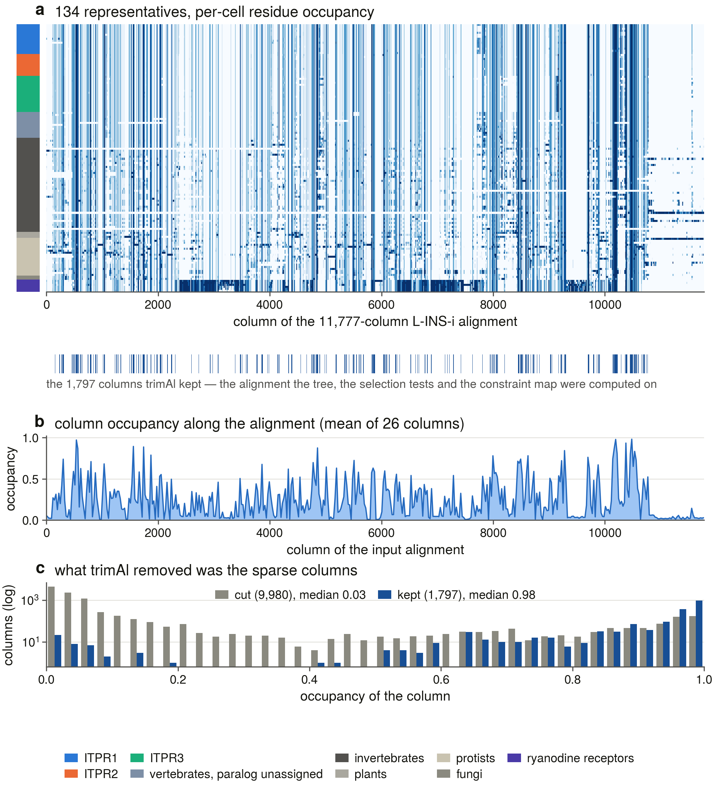

**Figure 6.5.** The alignment, with the columns the
tree actually saw marked in the input's own coordinates. The trimmed
alignment is the input with 9,980 columns deleted and the two share no
x-axis, so only one raster can honestly be drawn and the cuts marked beneath
it. The raster bins columns and plots occupancy rather than residue
identity, because at 11,777 columns one printed pixel is nine columns and a
residue palette would draw whichever residue happened to land on it. The
importance of this figure is that it lets a reader see what the tree was
actually computed on. Trimming removed 85 % of the columns, and the ones it
removed were the sparse ones, at a median occupancy of 0.03 against 0.98 for
those it kept. Every tree, selection estimate and constraint layer
downstream rests on the kept set, and a reader who wants to know how much of
the alignment that is can read it here rather than take it on trust.

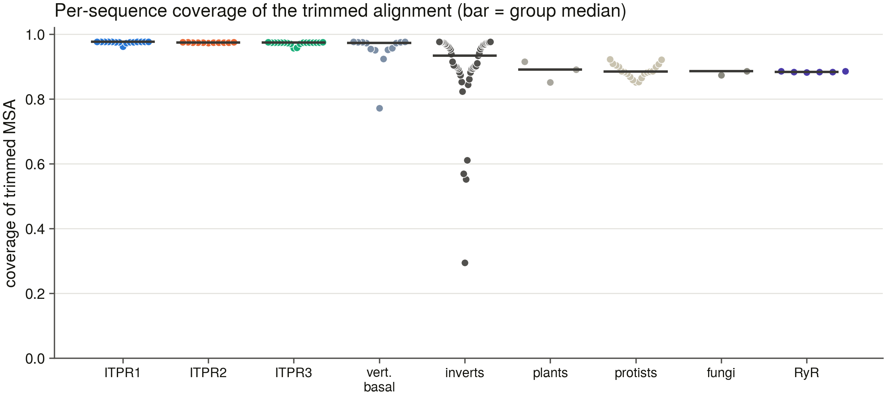

**Figure 6.4.** Per-sequence coverage of the trimmed alignment. The
median is 0.96 and one tip of 134 covers less than half. Coverage matters
because a tip that covers half the alignment contributes gaps to every
column the tree is inferred from, and gaps are not neutral for a likelihood
model. Naming that one tip, rather than reporting only the median, is what
allows a reader to judge whether any deep node depends on it.

## 6.4 What the alignment says before any tree is built

**The family separation, re-measured.** The ryanodine receptors are in this
alignment on purpose, and their separation from the family is a positive test
at every stage rather than an assumption. Measured here, mean identity within
a vertebrate paralogue group is 0.910 and from each paralogue group to the
outgroup 0.253, giving a separation of 0.656 identity units. Chapter 3's
benchmark, using a different estimator on a different panel, measured 0.828
and 0.249. The comparison is made on the separation rather than on either
absolute value, and it is confirmed.

That separation is what every stage of this project works inside. A
5,000-residue ryanodine receptor and a 2,700-residue IP₃ receptor are 25 %
identical over the columns they share, which is not far enough apart to trust
a heuristic with.

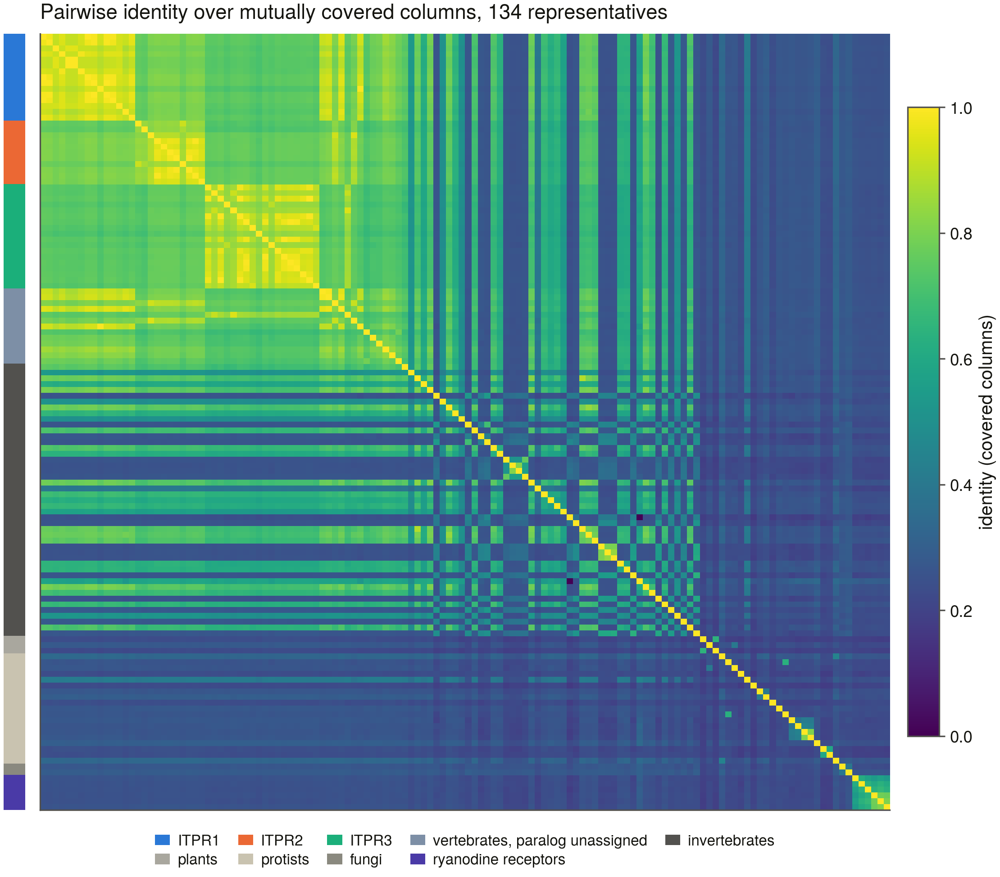

**Figure 6.2.** All-pairs identity across the representative
set. Two identity matrices are committed rather than one, because they
answer different questions and disagree systematically wherever a fragment
is involved. A metric that counts gaps as mismatches makes every partial
sequence look divergent, which would confound sequence divergence with
assembly quality, and that confound runs through this entire project.

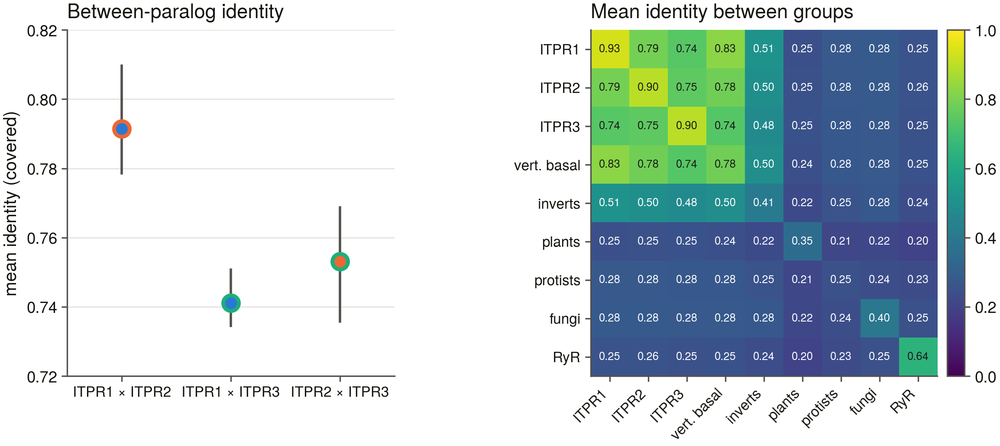

**Figure 6.3.** Identity within and between groups. This
figure fixes the scale every later comparison is read against: the three
vertebrate paralogues sit at 0.74 to 0.79 to one another and at 0.91 within
themselves, which is close enough that a bait from one aligns at all three
genes. That single fact is why the duplication detector of Chapter 8 needed
the family call before its geometry meant anything, and why the attribution
margin inherited from a less similar family had to be overturned.

**The alignment's preview of the sister question turns out to be wrong.** The
alignment can rank the three between-paralogue identities: ITPR1 with ITPR2
leads at 0.791, against 0.753 and 0.741, and the leading pair's interquartile
range does not overlap either of the others. That is a real ranking and it is
not a phylogenetic estimate, because it ignores the outgroup, the rate
variation and the branch lengths, so it was reported as a preview with the
tree named as the answer. Section 6.8 reports that the tree contradicts it.

**The alignment's preview of the cyclostome loci is wrong in a different way.**
Every cyclostome in this set carries three loci, all won by the same bait, so
nothing before the alignment could say which was which. On identity all six
fall nearest ITPR1, at margins of 0.014 to 0.066.

That table needs a control, because leaning towards one paralogue could be a
fact about the cyclostomes or a fact about the metric. If ITPR1 is simply the
slowest-evolving of the three, everything deep is nearest it. The same
statistic over groups that are certainly not vertebrate paralogues gives the
no-signal baseline: invertebrate metazoa lean toward ITPR1 at a median margin
of 0.008, protists at 0.002, and the ryanodine receptors at 0.002. The
cyclostome margin is five times that, so the lean is real. What it means is a
different question, and §6.9 gives an answer neither reading predicted.

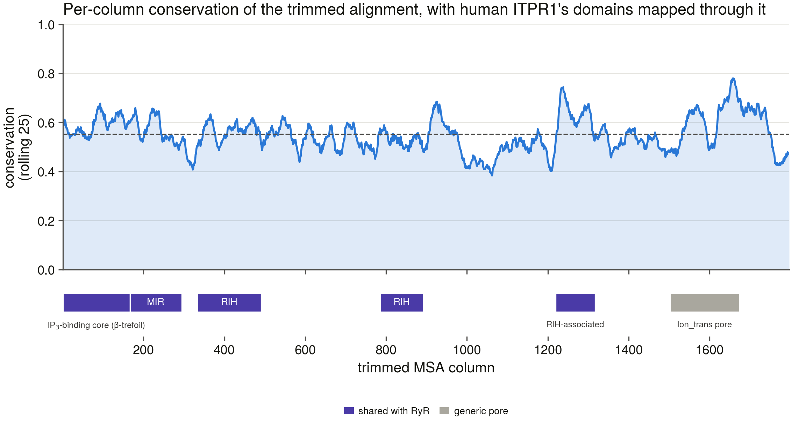

**Figure 6.1.** Per-column conservation with human ITPR1's
domain architecture mapped onto it through the alignment, by walking the
human row and counting ungapped positions, rather than by scaling residue
coordinates onto column coordinates. The second method places every domain
boundary wrong by exactly the gap content of the sequence. Since Chapters 11
and 12 both make claims about which element a residue belongs to, a
systematic offset here would have propagated into every one of them.

## 6.5 The exhaustive model scan was measured and abandoned

The obvious command is an exhaustive model scan [51]. It was started, timed
and abandoned, and the measurement is the reason: **11 models of up to 1,232
in 672 seconds, projecting about 20.9 hours.**

The cost is the free-rate models, and they are not optional on this alignment,
because the best free-rate model beats the best gamma model by 682.3 units of
the Bayesian information criterion, the fit statistic the selection is scored
on. Dropping them to buy the time back would have returned a measurably
worse model.

The replacement is greedy in two stages, with both tables committed: every
exchangeability matrix at fixed rate heterogeneity, then every rate model on
the winning matrix. Stage A chose its matrix by 614.6 BIC units over the
runner-up, and stage B bought a further 1,109.4 by changing only the rate
model.

**What that costs is stated rather than buried.** The matrix that wins under a
gamma model need not be the matrix that would win under the final rate model.
That is the bet a greedy selection makes, and the margin it was made on is in
a committed table rather than in a sentence, so how close the second-best
matrix came is checkable.

## 6.6 The tree search is pinned and guarded, and its rooting doubles as a control

The analysis used one maximum-likelihood search [52], taking 71 minutes,
with 1,000 ultrafast bootstrap replicates [53] and 1,000 approximate
likelihood-ratio replicates [54]. **Threads are pinned rather than
automatic**, because automatic thread count reads the machine's current load
and the search is reproducible only at a fixed seed and a fixed thread count.
The number pinned is what the program's own benchmark returned for this
alignment, so pinning costs nothing.

Support is reported as both branch tests together, and a node counts as well
supported only when it clears both thresholds. One alone is not enough,
because the bootstrap is optimistic under model violation, which is exactly
the condition a 134-tip alignment spanning four kingdoms is in.

Two guards on the search itself came out of one incident. Every stage resumes
on the report file rather than the tree file, because the program writes a
tree at checkpoints and a search killed part-way leaves a tree of an
unfinished topology that the next run would silently reuse. And a run refuses
a prefix that a live process already owns. Both exist because a previous
session's constrained searches were interrupted, kept running orphaned for
fifty minutes, and a fresh run started three more on the same prefixes, after
which the topology test was handed whichever checkpoint tree happened to be on
disk.

**Rooting doubles as a control on the whole alignment.** The tree is rooted on
the ryanodine receptors, and if they did not come back as a clade the
alignment underneath every downstream result would be the thing to doubt. They
do, at maximal support.

**Figure 6.6.** The rooted maximum-likelihood phylogram. Branches
are in neutral ink, the three paralogue clades and the outgroup are boxed,
and a filled dot marks every node clearing both support thresholds. No tip
is ringed, because the relabelling rule described in §6.7 fires on none of
them, and the legend entry for a ring appears only when a ring does, since a
key naming a marker the figure does not carry asserts a correction that was
never made. The tree matters because it answers a question the literature
had left open: the review's own audit found no published, support-annotated
maximum-likelihood analysis with a ryanodine outgroup that fixes which two
of the three paralogues are sisters.

## 6.7 The three paralogues are clades, but only after the tree's own corrections

Every stage since Chapter 3 has assumed they are clades: the architecture call
assigns a paralogue per record, the genome ledger has one cell per paralogue
per genome, and the representative grid is built on clade band by paralogue.

Asked on the census's own labels with nothing corrected, **none of the three
is monophyletic.** ITPR1's largest pure clade holds 13 of 15 tips, ITPR2's 10
of 11, and ITPR3's 16 of 18.

A label is not evidence, and a single mis-annotated tip breaks a clade of
forty. So the same question is asked after the tree's own corrections, derived
by coded rule and never by hand. A tip inside its group's largest pure clade
keeps its label. A tip outside it whose smallest containing clade holds at
least three members of exactly one other paralogue, at a well-supported node,
is moved. Anything else is left out of all three sets rather than assumed
either way.

Under tree-corrected membership **all three are monophyletic.** The difference
between the two tables is the size of the family's naming problem rather than
a change in the tree.

**The correction rule fires on nothing.** 39 tips agree with their label, 0
are reassigned, and 5 are left unplaced. That is worth saying plainly: the
tree does not overturn a single census name in this set.

The rule that produces that result was itself wrong on its first version, and
the way it was wrong is instructive. It climbed the tree from a mislabelled
tip until some paralogue dominated and then assigned the tip there, which
hands a tip to whichever clade is largest three nodes up, and that is a fact
about clade sizes rather than about the tip. It now stops at the tip's own
nearest neighbourhood. Two constructed controls, a positive and a negative
half, caught it: a weakly supported placement must not overrule a census
label, and a strongly supported one must.

**Every naming call the tree disputes is checked by a different instrument.**
Neither the alignment nor the model can tell a mis-annotated record from a
tree error, because both produced the placement in question. So each of the
five unplaced tips is put through reciprocal best hits against the human
reference proteome and back, using an instrument that knows nothing about this
alignment, this model or this tree. **All five uphold the census name.** For
each of them the tree offered no alternative, only a refusal to place, so what
is upheld is the name: the record is correctly named, and the conflict is this
tree's own uncertainty about where to hang it.

That verification is set up so that it can fire. An earlier version filtered
to the reassigned tips only, which made it report that the tree contradicted
no census label while the table it had just read held five tips the tree
declined to place. A verification that cannot fire is not a verification.

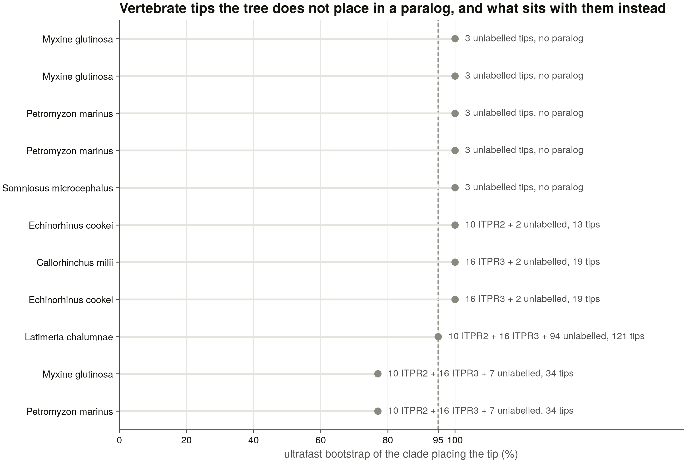

**Figure 6.9.** Where the tree places each tip against its
census label. Thirty-nine agree, none is reassigned, and the five the tree
declines to place are named, with reciprocal best hits against an
independent database upholding the name for every one of them. The panel
matters because a gene tree disagreeing with the annotation would have cast
doubt on the paralogue cells every later chapter is built on.

## 6.8 ITPR2 and ITPR3 are sisters, and the other two arrangements are rejected

Three rooted hypotheses were tested, one per way of pairing the three
paralogues, each realised as a constrained search under the same model, and
each making all three paralogue clades monophyletic, so that the test compares
the sister arrangement and nothing else.

Two traps had to be avoided and the second was walked into first.

Membership must be **tree-corrected**, because a constraint built from census
labels asks the test about a topology the data rejects for reasons unrelated
to the sister question, and all three hypotheses then fail together. That trap
is documented, and the correction here is derived from the tree rather than
hand-listed.

The second trap is that the constraint mechanism places freely exactly the
taxa a constraint omits, so a tip that is listed, even in a top-level
polytomy, is pinned outside every group the constraint declares. The first
constraint files named all 134 tips and thereby forced the unlabelled
vertebrate tips out of the paralogue clades this tree nests them in,
identically in all three hypotheses. The test then rejected every arrangement
at a log-likelihood difference of about 1,500, **including the one the tree
itself holds at maximal support.** Each constraint now names the three
paralogue cores and the outgroup and nothing else, and a constructed control
fails any constraint that names a free tip.

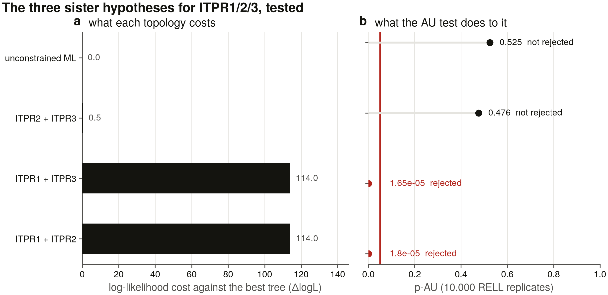

**Figure 6.7.** The three hypotheses under the approximately unbiased
test [55], with log-likelihood difference and p-value on two panels
sharing one row of categories rather than on two y-axes. They are different
measures on different scales, and a twin axis invites a comparison that has
no meaning. This figure is the answer to Chapter 6's central question, and
its importance is that it excludes rather than merely prefers. Two of the
three possible sister arrangements fall outside the 95 % confidence set of
topologies for this alignment, at p below 2 × 10⁻⁵, so the result is not a
ranking that a slightly different alignment could reverse. Chapter 7 then
shows the genomic neighbourhood pointing the other way, and the two are
reported as a disagreement rather than reconciled.

**The unconstrained tree groups ITPR2 and ITPR3 at maximal support**, and the
test agrees. The arrangement pairing ITPR1 with ITPR2 is rejected at
p = 1.8 × 10⁻⁵, ITPR1 with ITPR3 at 1.65 × 10⁻⁵, and ITPR2 with ITPR3 is not
rejected at p = 0.476.

The alignment's identity preview predicted ITPR1 with ITPR2 and the test
returns ITPR2 with ITPR3, so **the preview is contradicted**, which is the
reason it was reported as a preview.

This is an answer the literature did not have. The review's own audit found no
published, support-annotated maximum-likelihood analysis with a ryanodine
outgroup that fixes the pair.

## 6.9 The cyclostome loci are two ancient lineages, which neither earlier reading predicted

The alignment left two hypotheses. Three one-to-one orthologues from the
vertebrate duplications would put each cyclostome locus inside a different
paralogue clade, while a lineage-specific expansion would put all of them
together, outside all three.

The tree gives a third answer. **Every one of the six loci sits in a
cyclostome-only clade.** There are two such clades, each well supported, and
both hold hagfish and lamprey together. So the loci are neither one expansion
nor three one-to-one orthologues. They are two anciently separate cyclostome
lineages, and a clade spanning the two species is a duplication older than the
hagfish and lamprey split rather than a copy either genome made on its own.

The identity preview is contradicted as a reading rather than as a
measurement. Identity ranked all six against the same paralogue because it can
only measure distance to the labelled clades, and these loci are outside all
of them. Which side of the vertebrate duplication each lineage attaches to is
Chapter 7's question, and the neighbourhood is what would settle it.

## 6.10 A stress test on the naming failed, for the right reason

The teleost co-orthologue pairs are in the representative set as a stress test
on the naming: if the tree does not recover a species' two same-paralogue
copies as sisters, either the naming is wrong or the alignment is.

**Neither set comes back as a clade.** Both are broken only by other tips of
the same paralogue, in that the copies sit in a small clade made entirely of
that paralogue, with each copy nearer another species' copy than its own
genome's.

That is exactly what a duplication older than the species looks like, and the
teleost genome duplication is precisely that. The naming passes. What fails is
the expectation that co-orthologues of a shared duplication should be sisters,
which was the wrong prior rather than the wrong tree.

## 6.11 How much of the tree is resolved, and what the model-violation guard says

A sister question answered on a tree whose deep nodes are unsupported is not
answered. Of 131 internal nodes, **91 clear both thresholds, which is 69.5 %**,
with a median bootstrap of 100 and a median branch-test value of 99.

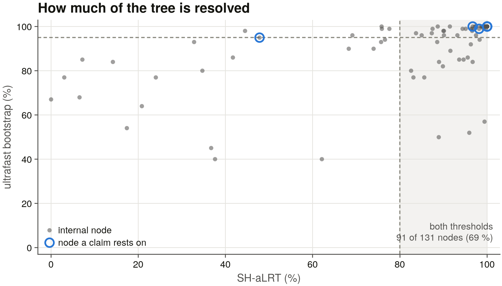

**Figure 6.8.** Node support drawn as a scatter rather than as
two histograms, because the claim is about the joint condition and a pair of
marginals cannot show it. A node is trustworthy here only when both branch
tests agree. The bootstrap alone is known to be optimistic under model
violation, which a 134-tip alignment spanning four kingdoms guarantees, so
every well-supported claim in this thesis requires both.

Every node a claim rests on is listed with its own support. The ITPR2 with
ITPR3 clade the sister result depends on is at maximal support. The one weakly
supported claim node is ITPR1's core clade, meaning the census's labelled set
taken bare, at a branch-test value of 47.8, which the tree prefers to group
slightly differently. The same clade including the unlabelled tips is at
maximal support.

**A model-violation guard was run over the whole search.** Because the
bootstrap is optimistic under model violation, the whole search was re-run
with an extra optimisation round on every bootstrap tree, and the same clade
questions were asked of that tree, with membership read from a committed
table rather than re-derived so that a bookkeeping difference cannot surface
as a topology change.

**No claim is weakened or lost.** Nine of ten clear both thresholds in the
guarded tree as well. The tenth was not well supported in the main tree
either, so the guard took nothing away. It is listed rather than folded into
the count, and the guard does push it further down, which is the honest
reading.

The tree reported is also the best tree found, because no constrained search
reached a higher likelihood than the unconstrained one. That check exists
because a constrained search can reach a better optimum than the free one, and
if it did, the tree every table is built from would not be the global optimum.

## 6.12 What the tree settles, and what it hands to Chapter 7

The tree settles that the three vertebrate paralogues are clades, that ITPR2
and ITPR3 are sisters with the other two arrangements outside the 95 %
confidence set, and that the cyclostome loci are an ancient cyclostome-specific
pair of lineages rather than orthologues of the three.

It does not settle when the duplications happened, where on the vertebrate
tree they sit, or whether they are the two rounds of whole-genome duplication
at all. A gene tree gives branching order, it does not give dates, and it
cannot distinguish a genome duplication from a tandem one. That is Chapter 7,
and it needs a different kind of evidence entirely: the genomic
neighbourhood.

---

# 7. Where ITPR1, ITPR2 and ITPR3 came from

## 7.1 A gene tree cannot answer the questions this chapter asks

Chapter 6 established that the three vertebrate paralogues are clades, that
ITPR2 and ITPR3 are sisters, and that the cyclostome loci are something else
again. It could not say when the duplications happened, where on the
vertebrate tree they sit, or whether they are whole-genome duplications at
all.

Those are three different questions and they need three different kinds of
evidence. Where a gene sits relative to its neighbours is a statement about
the genome that no alignment contains. When a duplication happened requires a
species tree with dates on it, which is an input rather than a result. And
whether a duplication was part of a whole-genome event requires showing that
the neighbourhood was duplicated too, which needs a paralogy map rather than a
synteny map.

This chapter does all three, and the answers do not entirely agree. Where they
disagree, the disagreement is reported rather than resolved by preference, and
§7.13 says what it is.

## 7.2 Reading the genomic neighbourhood needs three decisions and a matched control

Every IP₃ and ryanodine receptor locus of every swept genome was taken with
its flanking genes, and every measurement below is a comparison between two
such neighbourhoods.

Three decisions make that comparison mean anything.

**Loci come from the per-genome sweep output rather than from the ledger.**
The ledger holds one row per genome by cell and therefore only each cell's
best locus. In a teleost a cell holds two genes, so a ledger-driven comparison
would score one species' first copy against the next species' second copy and
report the mismatch as a synteny result.

**Two window rules are committed rather than one**, because naming density is
not constant: human annotation names 97 % of coding genes and sea lamprey
27 %. One rule takes a fixed number of coding genes each side, and the other
takes the nearest informative symbols each side, so that a difference in
neighbourhood similarity cannot be a difference in annotation depth.

**Three key vocabularies are used.** The first is a strict symbol, the second
a relaxed one with teleost duplicate suffixes stripped, and the third a
**root** key with the trailing digit run removed. The last is the only level
at which a whole-genome-duplication ohnologue pair is visible at all, because
after 500 million years the two copies almost never carry the same symbol.

**Every real comparison is scored against a matched random control.** A
neighbourhood similarity of 0.21 says nothing on its own, so every pair of
loci is scored against control pairs of random coding genes in the same two
genomes, under the same window and key rules, which holds the two genomes,
their annotation depth, their naming conventions and the normalisation
constant fixed. Sampling is seeded per accession, and a contig too short to
hold a window is refused rather than allowed to degrade the null.

Eleven constructed negative controls run on every build. The most instructive
requires that **two empty neighbourhoods score zero rather than one**,
because otherwise two unannotated genomes are a perfect synteny match, and a
survey across 309 genomes of very unequal annotation depth would find its
strongest signal in its worst data. Another caught a real hash-seeded
nondeterminism in a ranked output table.

## 7.3 The neighbourhood confirms the paralogue cells at two orders of magnitude

Every stage since Chapter 3 has treated a cell's paralogue label as orthology.
Nothing before this had tested that with evidence outside the gene itself.

**It holds, by two orders of magnitude.** Within-paralogue neighbourhood
similarity runs at 216 to 413 times the matched null, with 98 to 99.8 % of
individual pairs beating their own control.

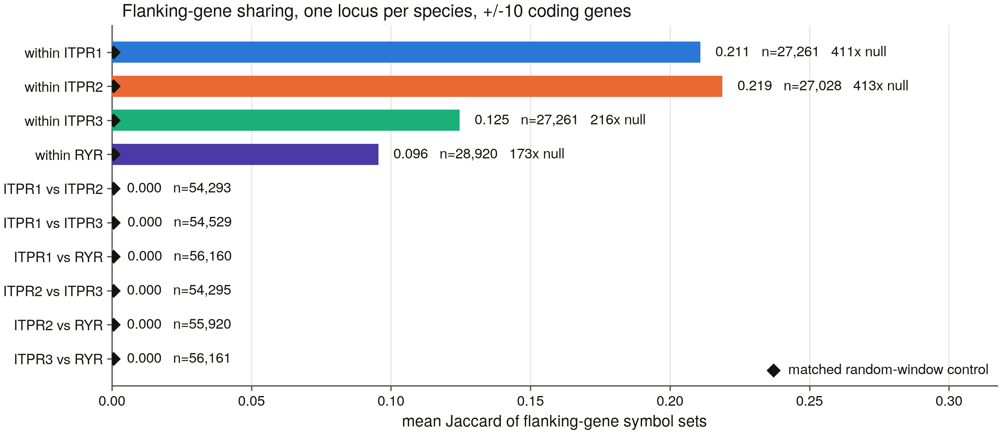

**Figure 7.2.** Every pair class against its matched
random-window control. This is the first test in the thesis of an assumption
every earlier chapter had made, since the paralogue cells were assigned from
sequence and nothing before this had checked them against evidence outside
the gene itself. Neighbourhood similarity within a paralogue runs at two to
four hundred times a matched null while every cross-paralogue class sits at
or below it, so the cells are orthology groups rather than similarity bins.

**Across the family boundary there is nothing.** Over 168,241 pairs of IP₃ and
ryanodine loci the highest mean similarity of any class is 0.0002, which is
below the random-window control itself. An instrument that shares nothing with
the sequence evidence returns the same family separation.

**The three paralogues are not equal, and pooling hides it.** A pooled
within-paralogue mean answers two questions at once: whether two mammals share
a neighbourhood, which they nearly trivially do, and whether a mammal shares
one with a teleost. Only the second is about the locus.

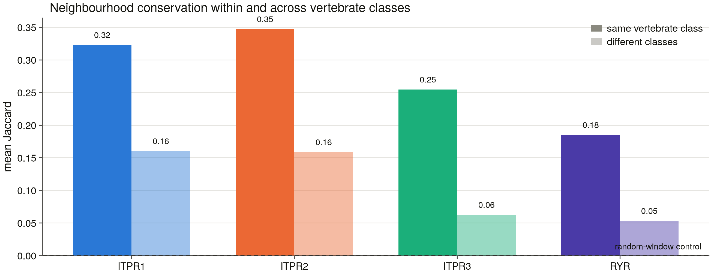

**Figure 7.4.** How far a neighbourhood travels, split into
within-class and cross-class comparisons. Within a vertebrate class the
three paralogues span 0.254 to 0.347. Across classes, ITPR3 retains 0.062
against 0.160 and 0.158, which is a 2.5-fold gap and the one asymmetry in
this panel that a pooled mean would have hidden.

**ITPR3's neighbourhood is the one that does not travel.** It is still 157
times its own null and 96.9 % of its cross-class pairs still beat their
control, so this is decay rather than absence. It is also worth noting what it
is not. ITPR3 is the best-recovered paralogue in the genome sweep and the
best-annotated. Ease of finding a gene and stability of the ground it sits on
are different properties, and in human that ground is the major
histocompatibility region at 6p21.31, one of the most rearranged and most
polymorphic neighbourhoods in the genome.

## 7.4 The surviving paralogon links run through ITPR1

If the three paralogues are the product of whole-genome duplication [24,25], their neighbourhoods should be paralogous rather than identical,
meaning the flanking genes should be surviving copies of the same ancestral
families under different names. That is exactly what a same-symbol test
cannot see, and it is why cross-paralogue symbol similarity above is a flat
zero.

At the root-key level two links survive, and each was scored against the rate
at which random windows in the same genomes share a root family.

**ITPR1 with ITPR3 share a metabotropic glutamate receptor family**, present
in 42 % of one side and 53 % of the other against a background of 0.45 %,
which is an enrichment of 93-fold. **ITPR1 with ITPR2 share a basic
helix-loop-helix family**, at 62 % and 85 % against 0.74 %, which is 84-fold.

**ITPR2 with ITPR3 share nothing, at any threshold**, and nor does any pair of
IP₃ and ryanodine neighbourhoods.

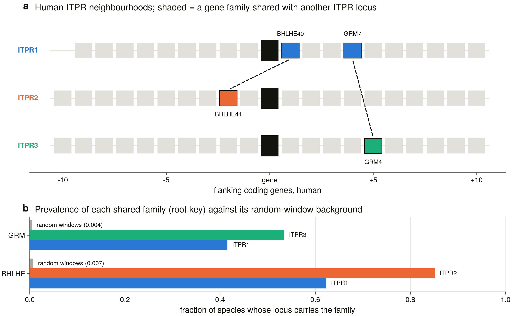

**Figure 7.1.** The three human neighbourhoods drawn as gene
tracks with the shared ohnologue families linked. The tracks are read out of
a committed table rather than named in the figure code, so the figure cannot
show a gene the data does not have. This figure carries the neighbourhood
half of the duplication argument. If the three paralogues arose in
whole-genome duplications, their neighbourhoods should be paralogous rather
than identical, and the surviving shared families are what remains of that.
The importance of the asymmetry is that both surviving links run through
ITPR1 and none connects ITPR2 to ITPR3, which is the first of five
independent measurements that put ITPR1 on its own side.

That is a clean measurement, since both families are under 1 % of random
windows at every threshold from 10 % to 50 %, and it is the first result in
this thesis that does not corroborate an earlier one. Chapter 6's tree makes
ITPR2 and ITPR3 sisters, and ITPR2 and ITPR3 are the one pair whose
neighbourhoods share nothing.

That is not a contradiction, and §7.13 says why at length. In short, a tree
estimates the order of duplication, while a retained flanking ohnologue
records which copies survived deletion beside each gene, and the quartets
left by whole-genome duplication lose flank copies lineage by lineage in a
way that carries no memory of the duplication order [56,57]. What can
be said is that the synteny does not corroborate the tree's pair, and that
whichever pair is sister, the ITPR1 neighbourhood is the one that kept its
ohnologues.

## 7.5 A caller built only from the neighbours places 131 unlabelled loci

The neighbourhood can also be used forwards. If each paralogue has a
characteristic set of neighbours, an unlabelled locus can be assigned by its
neighbours alone.

A consensus is built per paralogue from the keys carried by a stated fraction
of the species holding it, **with the query's own species dropped from every
consensus first**, so a locus cannot be scored against evidence it supplied.
The caller is calibrated on loci whose paralogue their own assembly's
annotation establishes, which is evidence the caller never sees, since it
reads the symbols of the neighbours and the truth is the symbol of the gene
itself.

**The threshold is measured, and the obvious way to measure it is wrong.** The
sweep reports what each setting buys, meaning the call rate on the confirmed
loci, and what it costs, meaning the rate at which random neighbourhoods in
the same genomes are called a paralogue. Optimising call rate alone selects
the loosest setting on offer, which is how an instrument gets tuned into
agreeing with itself. The rule is to maximise the difference, with ties broken
toward the stricter setting.

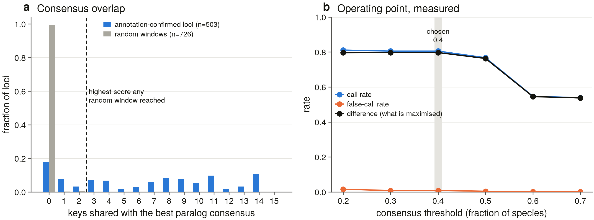

**Figure 7.3.** The caller calibrated and swept across its
threshold range, with the random-window false-call rate drawn beside the
call rate. At the chosen setting it is correct on 405 of 405 calls over 503
annotation-confirmed loci, calls 80.5 % of them, and calls 6 of 726 random
control windows. Drawing both curves is what makes the operating point
defensible, since the two move together and only their difference says what
a setting is worth. The caller then places 131 loci that the alignment could
not label, each with a null tail probability attached.

Accuracy is 1.000 across the whole range, so it separates nothing and is not
what is optimised. It is reported rather than used.

The reporting bar is the **null's own maximum** rather than a probability cut.
The highest consensus overlap any random window reached is 2, so a call at or
below that score is reported as inside the null however clean it looks. With
726 control windows, a one-in-726 tail is not a rate to build a claim on.

**131 loci gain a paralogue assignment that no random neighbourhood could have
produced**, comprising 73 ITPR1, 42 ITPR2 and 16 ITPR3, each carrying its
score, its margin and its null tail probability. Thirty-six of them are second
and later copies inside one paralogue cell, and 36 of 36 are placed in the
same paralogue as the cell they were filed under. A cell holding two loci
holds two copies of one gene rather than a misfiled second gene.

## 7.6 The neighbourhood cannot reach the cyclostome question

Chapter 6 handed this chapter a specific question: the six cyclostome loci sit
in two ancient cyclostome-only lineages, and which side of the vertebrate
duplication each attaches to is undecided.

The neighbourhood cannot answer it. Of the six loci, four get a call at all,
and **every one of those sits inside its own null.** The other two are
no-calls.

That is not a negative result, it is an absence of measurement, and the
distinction matters enough to have its own verdict in this project's
vocabulary. A neighbourhood comparison taken where 27 to 29 % of the flanking
genes carry a symbol is a measurement that did not happen. The corroboration
this chapter would most like to have does not exist, and saying so is better
than reporting the four inside-null calls as evidence.

---

## 7.7 Dating the duplications requires a species tree, which is an input

A reconciliation maps a gene tree onto a species tree and reads duplications
off the mapping. The species tree is therefore an input, and it is declared as
one rather than estimated here.

It is a hand-curated topology for the 31 vertebrate species the alignment
samples, with 29 named internal nodes, every one carrying a literature age,
the spread of published estimates, and its source [58,2,59,60,61]. A validator fails the build on a gene-tree species missing from the
tree, a taxon with no gene-tree tip, an uncalibrated node, a point age outside
its own spread, or any age inversion.

Two things it does that a cladogram with ages written on it does not.

**Where the literature does not resolve an arrangement, the node is left a
polytomy** rather than given a shape the sources do not carry.

**Every node carries a stem age beside its crown age.** The sampled tree omits
every unsequenced lineage, so a node's parent in this tree is usually older
than the split that created it. Without the stem age, a duplication on the
placental mammal branch would be bracketed at 96 to 319 Ma instead of 96 to
99.

The reconciliation itself uses the **non-binary** duplication rule [62]
rather than the familiar binary one, and that is load-bearing rather than
fastidious. The binary rule is valid only on a binary tree, and on the
support-collapsed root, which is a four-way polytomy, it reads a speciation,
which would have reported the collapse as the duplications disappearing.
Losses are counted by the standard method [63] and the mapping is the
standard least-common-ancestor one [64].

**Fourteen groups of constructed negative controls run before anything is
written**, and two of them caught real errors: the two halves of the
non-binary duplication rule, and the support-collapse routine refusing a tree
with no support labels. That last exists because a constrained search writes
no support values, and the first run dissolved all three constrained
topologies into one 134-tip polytomy.

## 7.8 The two duplications sit on different branches

Twelve reconciliations were run. Five topologies, comprising the
maximum-likelihood tree, the three constrained sister hypotheses and the
model-violation re-search, were crossed with three variants: all tips, the
cyclostome loci pruned, and every node below the support bar collapsed. Three
combinations are refused with their reason.

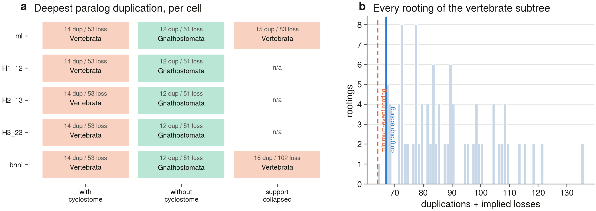

**Figure 7.10.** The topology by variant matrix, with the deepest
paralogue duplication in every cell, and beside it every rooting of the
vertebrate subtree scored by total events, with the outgroup rooting and the
minimum-event rooting marked. The matrix matters because it separates the
placement from the topology it was read off. Twelve reconciliations across
five topologies and three taxon treatments put the younger duplication on
the gnathostome stem in every cell, so that placement does not depend on
which sister arrangement is correct. The rooting panel beside it shows the
same for the choice of root.

Read plainly, on the tree with every tip in, two results follow.

**The split that separated ITPR1 from ITPR2 and ITPR3 is on the vertebrate
stem**, meaning older than crown Vertebrata [65,66], whose published
estimates run 480 to 615 Ma. Nothing in this tree bounds it from above, and
the bracket is reported open rather than closed silently.

**The split that separated ITPR2 from ITPR3 is on the gnathostome stem**,
meaning between crown Gnathostomata at 462 Ma and crown Vertebrata at 563 Ma.
It maps there in every cell of the matrix, cyclostomes in or out.

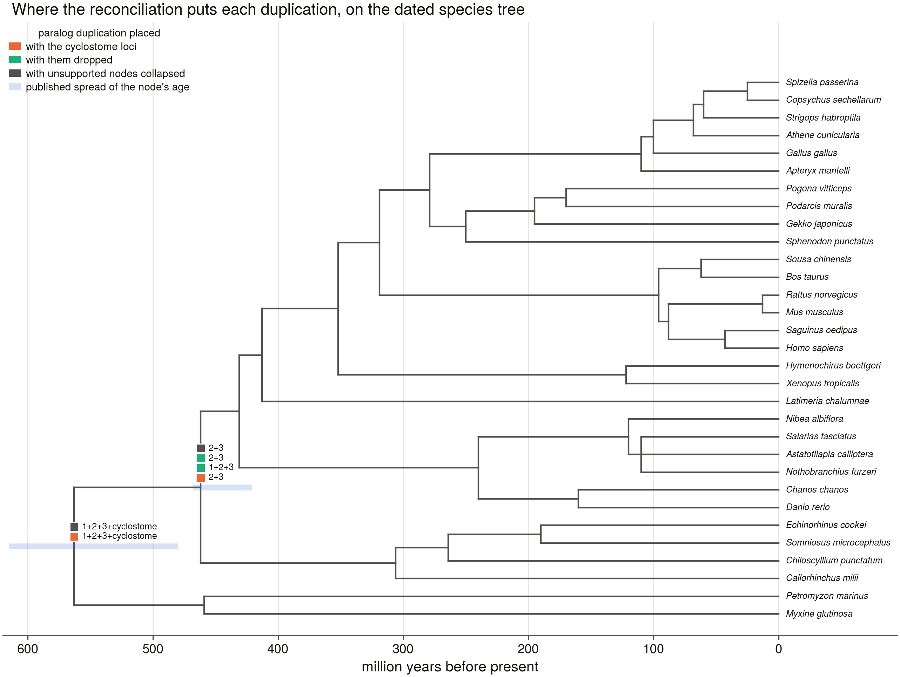

**Figure 7.9.** The dated backbone on a linear time axis
with each calibration's spread drawn as a band, rather than a cladogram with
ages written on it, because the result is an interval and a cladogram cannot
show one. Placements are deduplicated to one marker per distinct
arrangement, since the matrix repeats the same placement across cells and
drawing each would make agreement look like weight. The deepest bracket is
left open at its old end because nothing in this tree closes it, and the
widest disagreement in the whole calibration set sits at exactly the node
the older duplication maps to.

**The two duplications are not on the same branch.** That is the finding, and
it is what makes ITPR1 the earlier-diverging copy.

## 7.9 Two objections to the deep placement were measured rather than argued

Two objections a reader should raise are measured rather than argued.

**Does the placement rest on the weakest node in the tree?** The gene-tree
node separating ITPR1 from ITPR2 and ITPR3 sits at a branch-test value of 17.4
and a bootstrap of 54, which is the weakest node in the whole vertebrate
subtree and apparently the one carrying the headline. It is not. Collapsing
every node below the support bar dissolves that arrangement and the placement
survives, because the root becomes a polytomy in which more than one child
still maps into the gnathostome subtree, and the non-binary rule reads a
duplication at Vertebrata from that alone. What the collapse costs is
resolution, in that two separate vertebrate-stem duplications merge into one,
rather than the placement.

**What forces the older placement is one hagfish and lamprey pair.** Of the six
cyclostome loci, two sit in a cyclostome-only clade that is itself nested
among the gnathostome paralogues, sister to ITPR2 and ITPR3 at maximal
support. A lineage holding both cyclostome and gnathostome copies forces every
duplication above it to predate the split between cyclostomes and
gnathostomes. The same tip is what keeps the younger event on the gnathostome
stem, because that pair is sister to ITPR2 and ITPR3 rather than inside
either, so the node uniting ITPR2 with ITPR3 holds gnathostomes only. Had it
fallen inside either, that split too would have been pushed onto the
vertebrate stem. **The two answers are decided by where one two-tip clade
attaches**, and saying so is the honest form of the result.

**Are those tips long branches?** Cyclostomes are the classic long-branch
attraction risk in vertebrate phylogeny, and long branches are attracted to
the root, which is exactly where this answer sits. So the objection is
measured. Root-to-tip distance for all 57 vertebrate tips puts the six
cyclostome loci at **0.96 to 1.04 times the median, ranking 18th to 55th of
57.** Not one is an outlier and two sit in the shorter half.

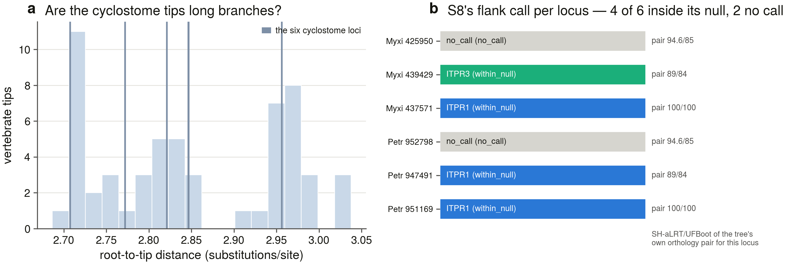

**Figure 7.12.** The six cyclostome loci marked on the
distribution of root-to-tip distance across the tree, and beside it the
independent neighbourhood call for each locus with the pair support the tree
gives it. The first panel removes the standard objection to this placement
by measurement rather than by argument. The second matters because the
neighbourhood knows nothing about the alignment, so its agreement is
corroboration from an instrument that could have disagreed.

That negative result is the one that matters most here. It is the reason the
placement is offered as a finding rather than as a caveat.

**A loss count from this analysis is not a loss count.** The reconciliation
implies 47 lost cells. Checked one at a time against the genome ledger, 26 of
them are the paralogue present in the genome and absent only from the 134-tip
sample, and none is corroborated.

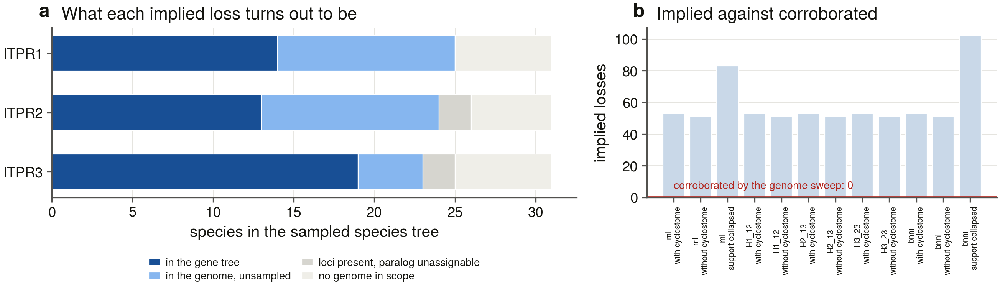

**Figure 7.11.** What each implied loss turns out to be once it is
asked of the genome ledger, and the implied count in every cell of the
matrix against the number the genomes corroborate. The figure is the reason
a loss count is not read off a reconciliation: a reconciliation over a
representative sample counts sampling, not biology. That is why Chapter 9
counts losses from 309 genomes instead, and why the two chapters' numbers
are not alternative estimates of the same quantity.

## 7.10 Testing whole-genome duplication needs dated paralogy, not synteny

Neighbourhood similarity can show that two blocks are related. It cannot show
when they became related, and that distinction is what separates an ohnologue
pair from the two rounds of duplication from an older duplication whose two
copies happen to sit beside these genes.

So the human paralogy map was taken from a comparative-genomics database
[67] through a **pinned dated archive** rather than the rolling one [68].
That is the same reproducibility discipline applied to a database release,
since the rolling host follows the release cycle and a re-run would score the
same windows against a different tree. The archive's own registry is committed
beside the map, so the release is evidence in the results directory rather
than a sentence in a report.

Three rules make it a test rather than a description.

**Every IP₃ and ryanodine receptor gene leaves every window.** Counting the
ITPR1 and ITPR2 paralogy as evidence that their blocks are paralogous is
circular, and leaving a ryanodine receptor in an IP₃ window would import the
control's answer into the test.

**The null is drawn from real genomic windows** at the matched gene count, so
the clustering of gene families that a shuffled gene set throws away is kept,
and it inflates the real window and the null alike.

**The links are dated.** The database's duplication node is what separates an
ohnologue pair from the two rounds from an older duplication, and it is read
in two nested vocabularies.

**Dating the links changed the answer.** Two paralogue links survive between
the three human neighbourhoods at every window size, and they are exactly the
two families the neighbourhood analysis found by a completely different
instrument. But one of them, the basic helix-loop-helix pair linking ITPR1 and
ITPR2, is dated to Opisthokonta. It is a pair far older than the vertebrates
whose two copies happen to sit beside these genes. It is real paralogy and it
is not an ohnologue pair from the two rounds. The metabotropic glutamate
receptor pair linking ITPR1 and ITPR3 is dated to Vertebrata, which is what
the two rounds mean.

**The single human genome is underpowered, and the report says so twice.** At
the primary window each family retains exactly one vertebrate-dated ohnologue
pair between two of its three neighbourhoods, each clears its own permutation
null when asked once per family rather than three times per pair, and neither
survives correction across all 135 tests the stage ran. The ryanodine trio's
two-round origin is not in question, so what the human test measures is the
instrument's ceiling on one genome rather than a difference between the
families.

**The replication is where the answer is.** The same human map, asked of the
flank sets in every swept genome, against matched random neighbourhoods in the
same genomes drawn by the same sampler, gives the following. The ITPR1
neighbourhood carries a paralogue of the ITPR2 neighbourhood in 141 of 175
genomes, which is 80.6 %, and of the ITPR3 neighbourhood in 89 of 152, against
2.6 % of matched random windows. **ITPR2 and ITPR3 sit at exactly the
background rate, at 2.7 % against 2.6 %, p = 0.554.**

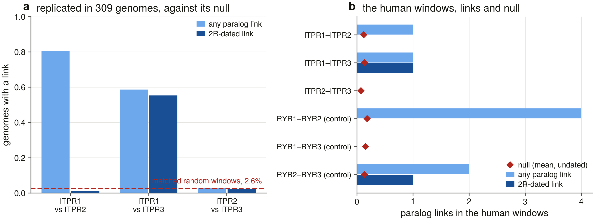

**Figure 7.6.** The two-round test with its null drawn across the
bars rather than quoted in a caption, and the ryanodine trio run through the
identical instrument in the same genomes beside it. What carries the claim
is not the human window but the replication across 309 genomes against
matched random neighbourhoods, and what makes it readable is the sister
family, whose two-round origin is not in question and which behaves the same
way through the same instrument.

The dated column splits the two links cleanly: the ITPR1 to ITPR3 link is
vertebrate-dated in 84 genomes and the ITPR1 to ITPR2 link in 2.

**The fourth slot cannot be found**, and current reconstructions of what the
vertebrate duplications left behind [69,57] are what a positive answer
would have to be read against. A genome-wide block scan returns no block that
both carries no family gene and looks like these blocks' missing sibling. With
one dated ohnologue pair surviving between the blocks that do carry a gene, a
block that lost the gene too has nothing left to be recognised by. That is a
limit of the evidence rather than a claim that no fourth slot existed. The
quartet test additionally flags its circular pairs in the data, because a
window tested against its own top-scoring block tests the selection rather
than the quartet, and all six such pairs are significant by construction.

## 7.11 The teleost duplication doubled ITPR1 and only ITPR1

Ray-finned fish underwent a further whole-genome duplication [70,71], and
the copy-number landscape says that is where all this family's variation is.

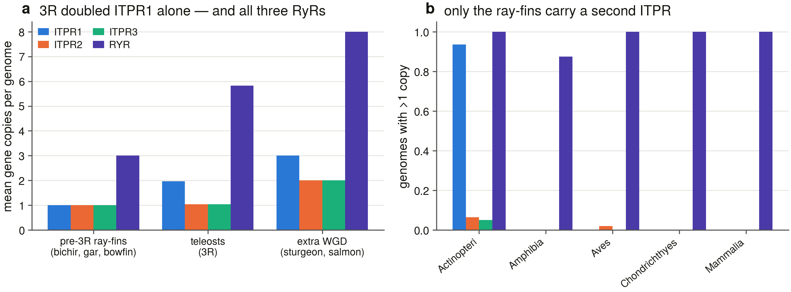

**Figure 7.5.** Copy number grouped by whole-genome-duplication
status rather than by taxonomy, because the result is a contrast between
lineages defined by which duplications they have been through, and a
per-class bar buries it inside the ray-finned fish. Grouping by duplication
history rather than by taxonomy is what makes this figure a test. The
prediction is specific: lineages that diverged before the teleost
duplication should carry one copy of each paralogue, teleosts two of one,
and lineages with a further duplication more again. All three hold, and a
second copy in the outgroup or an undoubled sister family would each have
falsified the reading.

**Above the contiguity bar, every non-teleost gnathostome genome in the sweep
carries exactly one of each paralogue and three ryanodine receptors.**

Five predictions were checked.

**Pre-duplication lineages carry one copy.** The bichir, gar and bowfin carry
1.00 of each and 3.00 ryanodine receptors, which is the gnathostome state.

**Teleosts carry two of one.** They average 1.97 ITPR1, 1.04 ITPR2, 1.04 ITPR3
and 5.82 ryanodine receptors, with 97.3 % of 73 genomes carrying more than one
ITPR1.

**Lineages with a further duplication carry more again** [72]. Sturgeon and
salmon carry 3.00, 2.00, 2.00 and 8.00.

A second copy appearing in the outgroup, or a teleost ryanodine count that had
not doubled, would each have killed the reading, and neither does. **The
ryanodine control is what makes the singletons interpretable**: the
duplication duplicated ITPR2 and ITPR3 as surely as ITPR1, and the sister
family in the same genomes kept all six of its copies. So the teleost ITPR2
and ITPR3 singletons are a statement about retention rather than about the
sweep's ability to find a duplicate.

**The copies are not tandem, and this is measured rather than asserted.** Of
71 teleost genomes with two copies above the bar, 20 put them on different
contigs and the rest sit a median 8,870,578 bp apart, with the closest pair
anywhere at 535,374 bp.

**Both copies keep part of the ancestral neighbourhood and between them
account for it.** Of 49 two-copy genomes with both copies flanked, 46 keep
ancestral symbols on both copies against a tetrapod reference and 47 against a
pre-duplication ray-finned one, and in 45 and 46 respectively **the two sets
are disjoint**. Disjoint is the load-bearing word: the copies do not merely
each resemble the ancestor, they partition it, which is what reciprocal gene
loss after one duplication produces and what a pair of independent later
duplications would not.

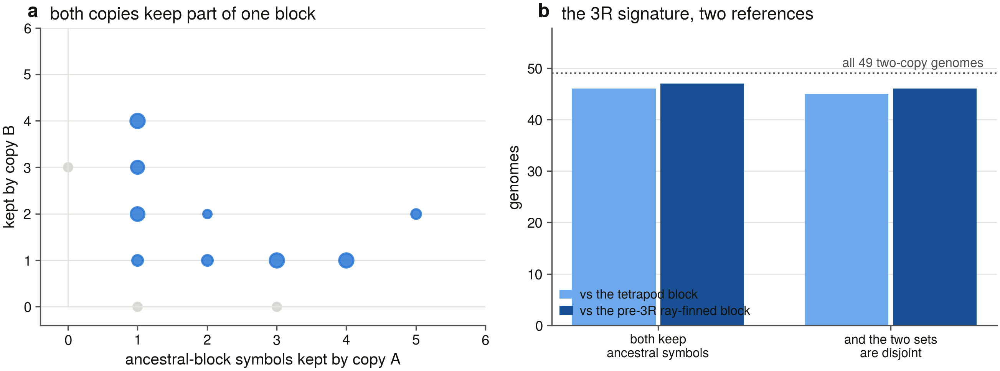

**Figure 7.7.** Double-conserved synteny, with the two copies plotted
against each other so that disjointness is a geometric fact on the figure
rather than a number in a table. The load-bearing word in this figure is
disjoint. Two copies that each resemble the ancestral neighbourhood could be
two independent later duplications, but two copies that partition it between
them are what reciprocal gene loss after a single duplication produces. That
distinction is what turns a copy count into a claim about one shared event.

Two references were used rather than one, because teleost gene symbols diverge
from tetrapod ones even after normalisation, so a tetrapod consensus
under-counts. Both give the same answer.

## 7.12 The two teleost copies are one ancestral duplication, not many

The five predictions are all consistent with a single duplication in the
teleost ancestor. They are also consistent with a series of independent
lineage-specific duplications, and separating those is the sixth check.

The obvious statistic has no power, because each genome's copy labels are
arbitrary, so a matched-versus-crossed comparison measures nothing. Instead,
anchors from different orders assign every genome independently, and the
question is whether the anchors agree.

**705 of 705 assignments agree**, across six anchors from six orders. Under
independent lineage-specific duplications the anchors carry no shared
information and the statistic sits at 0.5, and a constructed control builds
exactly that case and requires the statistic to land there, so the perfect
agreement is a measurement rather than a property of the routine.

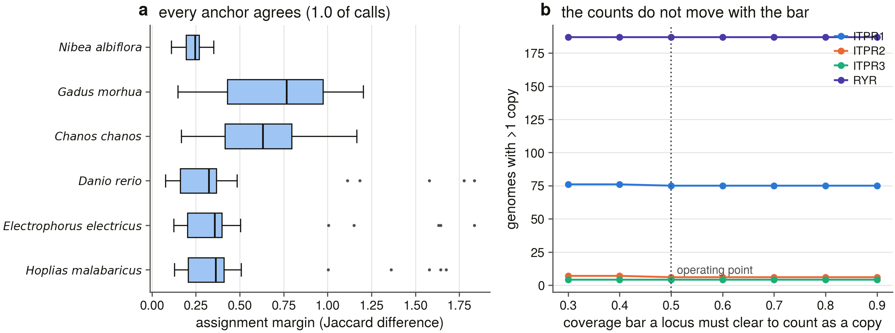

**Figure 7.8.** Cross-anchor block identity, and the sensitivity of
every count to the coverage bar. Seven bars are scanned, because a
duplication claim that survives only one bar is a claim about the bar. The
anchor panel is what separates one ancestral duplication from a series of
lineage-specific ones, which the copy counts alone cannot do, because
anchors from six different orders assign every genome independently and
would carry no shared information if each lineage had duplicated on its own.

It is corroborated by evidence of a different kind. Which bait won each copy
is a sequence call made with no neighbourhood input at all, and in the six
genomes whose two copies won different baits the sequence call and the
neighbourhood block agree six times out of six. The reference for that check
is chosen as the first anchor whose own two copies won different baits,
because anchors are ranked on flank richness and taking the first one blindly
makes the check unrunnable.

## 7.13 What this chapter settles, and the disagreement it leaves standing

**Six things are settled.** The three paralogue neighbourhoods are shared
within a paralogue
at 216 to 413 times a matched null and share nothing across the family
boundary. The blocks are paralogous and the paralogy runs through ITPR1. One
of the two surviving links is vertebrate-dated and the other is far older. The
ITPR1 against ITPR2-plus-ITPR3 split sits on the vertebrate stem and the ITPR2
against ITPR3 split on the gnathostome stem, and the placement survives
collapsing every weakly supported node. The teleost duplication doubled ITPR1
and only ITPR1, in 97 % of teleost genomes, while doubling all three ryanodine
receptors in the same genomes, and the two copies are one ancestral
duplication.

**One disagreement is left standing.** The tree makes ITPR2 and ITPR3
sisters. The
neighbourhood makes ITPR1 the block that kept its ohnologues with both of the
others, and ITPR2 with ITPR3 the one pair that retains nothing above
background. Two instruments give two answers, and the project's verdict is
*not corroborated* rather than *contradicted*.

The reason is that they are not the same quantity. A tree estimates the order
in which copies diverged. A retained flanking ohnologue records which copies
survived deletion beside each gene, hundreds of millions of years later, and
quartets from whole-genome duplication lose flank copies independently of the
duplication order. The reconciliation adds a third view that is consistent
with both, because it makes ITPR1 the earlier-diverging copy, which is the
copy whose neighbourhood kept a shared family with each of the other two. That
is suggestive rather than a test.

Stating that as a disagreement rather than resolving it is a decision. The
alternative, which is quietly preferring whichever instrument agreed with the
headline, is how a project of this size talks itself into a wrong answer.

**Three things are not settled.** The chapter does not settle which of the two
duplication
rounds made which split, because the dated link is dated to Vertebrata, which
is both rounds, and separating them needs the cyclostome side of the quartet,
which §7.6 found underpowered. It does not settle whether the quartet had a
fourth slot. And it does not settle **why ITPR1 alone kept its teleost
duplicate**, because the observation is clean and the cause is not in this
chapter's evidence. Chapters 10 and 11 are where a dosage or
subfunctionalisation argument would have to be made.

---

# 8. The gene itself: exons, introns, and what a fragmentary annotation is

## 8.1 A failed background claim left a question about gene size

Chapter 2 struck a claim: that each IP₃ receptor is a 58-to-60-exon gene
spanning hundreds of kilobases. The exon counts turned out to be 62, 57 and
58, and the spans 354, 498 and **76** kb. Three paralogues encoding proteins
that differ in length by 3 % occupy genomic spans that differ by a factor of
six and a half.

That leaves a question with two possible answers. Either the exon structure
differs between the paralogues, or the introns do, and only one of those is a
statement about how the gene has evolved. Answering it across 309 genomes also
answers a second question the annotation audit needs: when a database calls a
locus fragmentary, is that a real gene boundary or an annotation that stopped
somewhere nothing splices?

## 8.2 Reading exons out of a genomic alignment has four traps

The measurement is made on the sweep's own alignments rather than on
annotations, because Chapter 4 found that most of these genes have no usable
annotation. Four things a naive reader of that output gets wrong, each with a
constructed control that fires on it.

**The model keys collide.** The aligner numbers its alignments from one per
run, so the two assemblies large enough to be processed in chunks repeat every
identifier. A reader that keys models the way the aligner names them merges
the blocks of two different genes, and the merged gene has more exons and
longer introns than either.

**Gene order is not coordinate order.** Blocks come in target order, and an
intron computed as the next block's start minus the previous block's end
reverses every minus-strand gene.

**Splice dinucleotides must be read strand-corrected.** Reading an intron's
two ends without reverse-complementing both turns every canonical
minus-strand intron into a non-canonical one, which is a systematic signal
that would discredit exactly the alignments this chapter is defending.

**A block is not an exon.** The aligner emits blocks, and some adjacent pairs
are separated by a gap too small to be an intron.

Measurement also shows that **frameshifts sit inside blocks rather than
between them**, which means the merge this chapter needs is a sub-intron-gap
merge rather than a frameshift merge.

## 8.3 What counts as an intron was measured against the genome, not chosen

Rather than choose a minimum intron length, every block pair was binned by gap
size and scored by its splice dinucleotides, which is evidence the alignment
score did not produce.

The calibration then **refuses to hand out the threshold it was written to
produce**. The sub-intron population is empty, meaning there is no population
of small gaps that fail the splice test. So the floor goes at the smallest gap
the genome calls spliceable, at 10 bp, rather than at a declared 30 bp
fallback, which would have merged the ten junctions between 10 and 29 bp that
read as canonical splice pairs.

## 8.4 The aligner places a canonical splice pair at 99.89 % of junctions

Before measuring exon structure with an aligner, it is worth knowing how often
the aligner puts a boundary where no splice site is. **99.89 % of 112,254
junctions read as a canonical splice pair.**

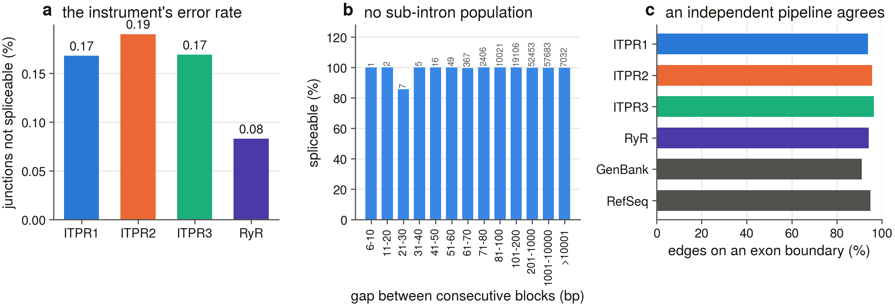

**Figure 8.3.** The aligner's junction error rate, drawn on the
complement, because at 99.9 % agreement a bar of the agreement is four full
bars and shows nothing. Each gap bin carries the count it rests on. This
figure is the instrument's own error rate, and it has to be measured before
exon structure inferred from alignments can be used for anything. At 99.89 %
of junctions reading as a canonical splice pair, the boundaries the
shared-intron test depends on are the aligner's rather than an artefact, and
the independent check against 188,146 annotated edges from 164 genomes is
what rules out a systematic bias the dinucleotides alone could not see.

That is corroborated by a second, independent pipeline: the sweep's boundaries
against **188,146 annotated coding-sequence edges from 164 genomes**, at
94.5 % exact agreement. An earlier chapter made the same comparison for two
loci against 35 and 40 genomes, and this is that check generalised.

## 8.5 One coordinate frame lets the three genes be compared, and it is checked

An exon boundary is a position in the bait's numbering, and the sweep used 38
baits, so comparing an ITPR1 gene's boundaries with an ITPR2 gene's needs a
frame both can reach. That frame is Chapter 6's alignment, because all three
human paralogues and a human ryanodine receptor are tips of it, so a boundary
travels from the bait to its cell's human reference and then to an alignment
column.

Ninety-eight frames were built and none refused.

**The frame is checked rather than assumed.** All fourteen residues measured
on the structure, meaning the ten IP₃ contacts, the two selectivity-filter
residues and the two gate residues, each in its own paralogue's numbering,
land in the **same alignment column in all three paralogues**. A frame that
had slipped anywhere in the pore or the ligand core would fail there, and a
slipped frame is exactly the error that makes a shared-intron count look like
a result. A constructed control shifts one paralogue's aligned row by a single
column and requires the test to refuse.

Twenty-one constructed controls run before anything is written, and the suite
was mutation-tested on six deliberate rule breakages, all six caught. Four of
this chapter's rules return a good-looking number when they are wrong, which
is why the suite is as large as it is: the model-key collision, the strand
branch, an inverted intron-phase convention that swaps two phases everywhere
without changing a single count, and the duplication detector discussed in
§8.9.

## 8.6 The exon count is conserved and the packaging is not

Across 1,378 genes in 189 vertebrate genomes, the three paralogues sit at **57
to 58 coding exons** with median genomic spans differing by **4.2-fold**, and
coding sequence lengths of 8,250, 8,100 and 8,008 bp. These are *coding* exon
counts, which is why they sit below the 62, 57 and 58 that Chapter 2 read off
the human canonical transcripts: a protein-to-genome alignment sees only the
translated part of the gene, so a purely untranslated first or last exon is
invisible to it and counted by the transcript annotation. What differs between
them is how much intron is wrapped around nearly the same protein.

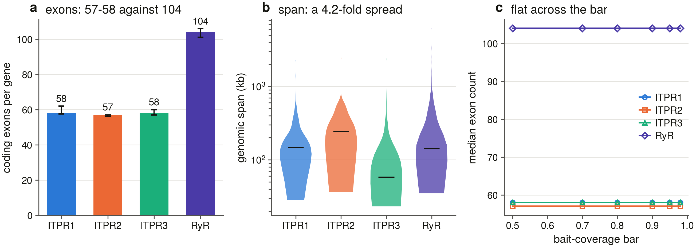

**Figure 8.1.** Exon count and genomic span on separate
axes, with span logarithmic and count not. The separation matters because
the result is a contrast between two quantities measured on the same genes,
one of which is conserved and the other of which is not, and a shared scale
would hide it. Fifty-seven to fifty-eight coding exons across 189 genomes,
wrapped in genomic spans differing four-fold, means the paralogues inherited
one coding architecture and then diverged in intron content alone.

The ryanodine receptors, measured through the identical instrument in the same
assemblies, carry **104 exons over 14,910 bp** of coding sequence, which is
nearly twice the gene in both dimensions, at almost exactly the same mean exon
length of 144 bp against 138 to 142. The control tells us the instrument is
measuring gene structure rather than a property of this family's alignments.

Every count is recomputed at six coverage bars, because a count that survives
only one bar is a claim about the bar.

**The comparison is paired inside one genome.** Intron size, assembly quality
and annotation completeness all scale with the assembly, so every
cross-paralogue comparison uses one locus per genome per gene, sign-tested
with ties dropped and counted, and the whole family of tests corrected
together.

Two things fall out. The exon counts differ by one to three exons and the
spans by tens of kilobases, in the same genomes. That intron content, rather
than coding structure, is what varies is worth holding against the evidence
that intron length is itself under selection, with shorter introns in highly
expressed genes [73], although the explanation usually offered for that
pattern has been contested [74]. And the ordering of the spans
is consistent gene by gene rather than an artefact of averaging, in that ITPR3
is the shorter gene than ITPR1 in 161 of the 182 genomes carrying both.

## 8.7 The three paralogues share the same introns in the same places

An intron's position here is a pair: the alignment column its upstream exon
ends in, and its phase. Intron positions are among the most durable
characters a gene has, conserved across kingdoms and gained and lost slowly
enough to carry information about deep relationships [75,76], which is
what makes this comparison worth making at all. Both halves of the pair are
needed. Two paralogues can carry an intron between the same two residues in
different frames, which is not one ancestral intron, and a column alone
would call any two introns in the same region shared.

**Within a paralogue**, each carries a core of about 48 to 49 intron positions
present in at least 90 % of the genomes that have the gene, out of 175 to 185
positions seen anywhere. The ryanodine receptors have their own core of 91, on
the same scale relative to their 101 introns per gene. So the architecture is
not merely a count that happens to be stable. It is the same introns, in the
same places, across the vertebrates.

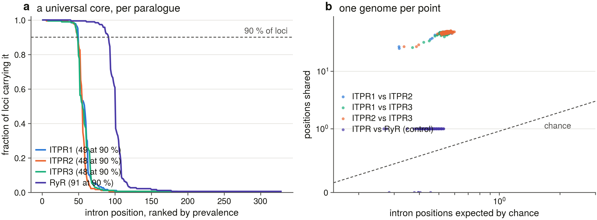

**Figure 8.2.** Intron positions by alignment column and phase,
per paralogue. The columns line up, and that alignment is what the
enrichment in §8.7 is measured on. Plotting phase as well as column is what
keeps two introns that fall between the same two residues in different
reading frames from being counted as one inherited intron.

**Between paralogues** is the test this chapter exists for. Two genes with
about 58 introns each spread over about 2,700 aligned residues will share some
positions by chance, so every comparison is paired within a genome and scored
against a null in which each of one gene's introns is placed independently and
uniformly on the columns both loci have residues in, keeping its own phase.
That makes the match count a Poisson-binomial whose upper tail is exact, with
no random number generator and no replicate count, and a seeded permutation
without replacement is run beside it as a cross-check.

**The three paralogues share 46 to 49 of their roughly 58 intron positions in
every genome that carries them**, at an enrichment of 85 to 88-fold,
significant in every one of 181 to 183 genomes.

**The ryanodine receptors share one.** That is an enrichment of 2.1 to
2.3-fold, significant in none of 188 genomes.

That is the sharpest single result in this chapter and it needs the control to
be readable. The ryanodine receptors carry every diagnostic domain of this
family, they are the same superfamily, and they have been in every search.
Their intron positions have nothing to do with the IP₃ receptors', while the
three IP₃ receptors' have almost everything to do with each other. The three
paralogues did not converge on a shared architecture. They inherited one, from
a common ancestor much younger than the split from the ryanodine receptors.

## 8.8 A fragmentary annotation usually stops where nothing splices

Chapter 13's audit calls 264 loci fragmentary and 27 split, meaning coding
sequence is present and no single model covers the gene. That is a statement
about coverage and says nothing about **where** the annotation stopped, and
the difference is the whole claim. A model that stops at a genuine junction
has produced a plausible short gene. One that stops in the middle of an exon
has produced a boundary no splicing machinery could make.

So the unit is the annotated model's own **terminus** rather than its internal
exon edges, because a model's internal boundaries are its own splice sites and
are canonical by construction, so scoring them would answer §8.4 a second
time. Each terminus is scored on two axes that know nothing about each other:
against the alignment's exon boundaries, and against the two genomic bases
immediately outside it read in gene orientation. A terminus coinciding with
the gene's own end is excluded by rule, because a real gene legitimately
starts and stops inside an exon.

The question is asked of all 291 such loci rather than only those in the
architecture scope, because those loci sit in the poorer assemblies by
construction and restricting the question would have answered it on 50 of them
and dropped the hardest.

Of 1,448 internal termini, 406 sit inside an exon of the gene model and 353
inside one of its introns, while 689 land on a boundary the model has. **228 of
the 291 loci carry at least one mid-exon terminus**, which falsifies the
reading that the annotation stopped at a real gene boundary. Three are broken
entirely at junctions the gene has.

The verdict is one-sided by design. A mid-exon terminus falsifies. A terminus
landing on a boundary does not prove the pieces are separate genes, so that
verdict is named for what it is and claims nothing more.

## 8.9 A duplication detector had to be scoped before it measured duplication

An exon count is only a gene's if the locus is one gene. The aligner aligns
each bait independently, so a genome encoding the same part of a protein twice
has the same bait aligning twice at two disjoint places.

Run naively, that geometry measures **paralogy** rather than duplication,
because the three receptors are 61 to 68 % identical, every bait aligns at all
three genes, and the detector's first version reached a specificity of
**0.16**. The pair has to be inside the cell's own loci, with the sweep's
clustering and family attribution imported unchanged.

Scored as a classifier of a copy count it never sees, which is decided by
coverage, identity and aligned length and by no pairwise geometry at all, the
detector reaches **99.7 % sensitivity and 97.7 % specificity over 1,236
cells.**

The ryanodine control's specificity is lower on purpose, because that cell
holds three genes in every tetrapod, so the detector should fire there, and it
does.

**No locus in the sweep encodes the same part of the protein twice.** The
within-locus class, meaning two alignments of one bait inside one cluster,
which would be an internal partial duplication, fires on zero pairs, and a
constructed control builds such a pair and requires the branch to fire, so the
zero is a measurement rather than an unreachable code path.

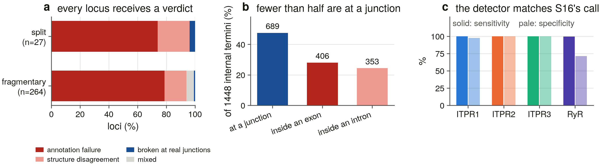

**Figure 8.4.** The verdict on every split and
fragmentary locus, where the annotation's internal termini sit relative to
the gene model, and the duplication detector scored against an independent
copy call. The first panel converts a database label into a testable claim:
a locus called fragmentary might have been annotated as a plausible short
gene, or the annotation might have stopped where no splicing machinery could
stop, and only the second is an error. 228 of 291 such loci carry at least
one terminus in the middle of an exon, which falsifies the innocent reading.
The second panel makes the same point about an instrument, since scoring the
detector against a copy call it never sees moves its specificity from 0.16
to 0.977 once the family assignment is applied first.

## 8.10 What this chapter settles about the gene

The three vertebrate paralogues inherited one gene architecture and have kept
it: 57 to 58 coding exons, of which 46 to 49 positions are shared between any
two of them in every genome that carries both, at nearly two orders of
magnitude above a null drawn from the alignment itself. The ryanodine
receptors, which are the same superfamily, share one.

What varies is intron length, and it varies by a factor of four in the median
and consistently gene by gene. The 6.5-fold span difference that Chapter 2's
failed background claim exposed is entirely intronic.

And a database's "fragmentary" is usually not a gene boundary, because 228 of
291 such loci stop somewhere nothing splices.

---

# 9. Counting a loss that never happened

## 9.1 A zero is the hardest result in this thesis to state

Gene families of this age normally lose copies [26,77]. The prior for a
three-paralogue family present since the origin of the vertebrates is that
somewhere in 309 genomes at least one lineage has dropped one.

This chapter reports that **not one of the 927 genome by paralogue cells in
the vertebrate scope reaches the state this project defines as a loss**, that
Dollo parsimony [78] places no loss anywhere on the tree, and that no rate
can be fitted to a character that never changes.

A zero is the easiest result to obtain by accident and the hardest to defend.
It is what a broken pipeline produces, what an over-conservative rule
produces, and what a search too insensitive to find anything produces. So most
of this chapter is not the count. It is the machinery that makes the count
mean something: a state vocabulary in which exactly one state can be counted
as a loss and every other explanation must be positively excluded first; an
instrument for the cells the sweep could not decide; a false-negative rate,
measured in Chapter 4, that says how often the search misses a gene that is
there; and a sensitivity matrix that names, cell by cell, the analytical
settings that would manufacture a loss out of this data.

## 9.2 Eight states are assigned, and only one of them can be counted as a loss

The genome ledger's own statuses were not built to license a loss count. In
that ledger "absent" means the rescue search attributed no region, which in a
shattered assembly is a statement about contig lengths. So every cell is
restated under a chain of ordered positive tests, where the first rule that
fires wins and each writes the number it fired on into its own row.

The design constraint is that **exactly one state may be counted as a loss**,
reachable only by passing every test that could explain the absence otherwise.

The chain runs as follows. The genome's positive control did not fire, so no
cell in it supports any claim. Or there is a locus at or above the coverage
bar. Or a locus below it, truncated at a contig edge or a run of ambiguous
bases. Or a locus below it with no assembly excuse. Or no locus, but the
reference reassembles from sequence outside every locus the aligner found. Or
no locus and no reassembly, but the genome carries family loci that no cell
claimed. Or nothing found, and the assembly cannot hold the gene on one
contig. And finally, nothing found in a controlled assembly that could have
held it.

**Two of those rules exist because of specific incidents.**

The sixth is the cyclostome rule. Both cyclostome genomes carry three family
loci apiece, all filed in the ITPR1 cell because the bait panel has no
cyclostome-labelled bait, so their ITPR2 and ITPR3 cells read as absent in the
ledger. A count taking that at face value would score two independent losses
per cyclostome that never happened.

The seventh is the contiguity rule. An assembly whose contigs are shorter than
the gene cannot represent it as one locus, so it cannot be evidence that the
gene is missing, and two thirds of the bird assemblies in this scope are in
that position.

The rule order is itself tested. A constructed control moves the cyclostome
rule after the absence rule and requires the suite to fail.

## 9.3 Reassembling a reference across contigs decides the undecided cells

The sweep's undecided cells are the ones a loss count can neither ignore nor
use. The aligner placed no locus, so the ledger records no coverage, and the
rescue search attributed regions, so they are not nothing either.

What is measured is the **non-redundant coverage of the reference protein,
reassembled across contigs**. Three properties make that a positive test
rather than a hopeful one.

**It is computed outside every locus the aligner found**, passing through the
sweep's own exclusion set of every clustered locus in the genome, any bait,
padded. For a family whose paralogues are 61 to 68 % identical that is the
failure mode that matters, because without the filter a missing gene
reassembles out of its own paralogues and reports 0.95 coverage. A constructed
control removes the filter and requires the suite to fail.

**It uses one reference at a time**, never a union over baits, because a union
over three orthologous baits counts a residue covered in any of them and
reports a coverage no single protein achieves.

**The bar is measured against a gene that is accounted for**, with the
separation statistic [79] reported beside the threshold. The negative
population needed no new search: it is the regions the full bait panel
attributes to a paralogue whose gene the aligner already placed at a locus in
the same genome. That paralogue is accounted for, so the fragment set cannot
be that gene, and what it recovers is what cross-paralogue similarity delivers
on its own, at a median of 0.030 against a candidate median of 0.795.

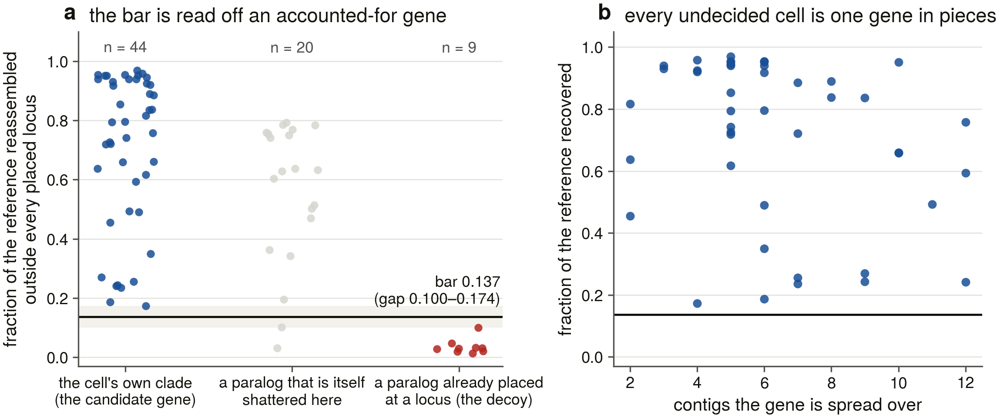

**Figure 9.2.** The three populations the bar is read off, with
the gap shaded and the operating point drawn, and every undecided cell
against the number of contigs its gene is spread over. A calibration figure
that asked to be believed would not be one, so both edges of the gap are
marks rather than a caption. The third population is the one worth looking
at: it lies between the other two, it was not anticipated, and the paragraph
below explains what separating it out did to the threshold.

**The first version of this calibration did not separate**, at a Youden index
of 0.52, and why is a result in itself. The decoy was every region attributed
elsewhere, but in a genome where two paralogues are both shattered, a fragment
attributed to the other one is a piece of a real gene. Those 20 regions are
now reported as their own population, with a median of 0.631 sitting squarely
between the two, and they are the **measured size of the paralogue-attribution
problem in a shattered assembly**. A constructed control folds them back into
the decoy and requires the suite to fail.

The operating point is the **midpoint of the gap** rather than the Youden
threshold, which on a perfectly separated pair lands on the lowest positive
and is the most permissive bar the data allow. Both edges are committed, so a
later run whose populations have drifted into contact is visible in the table,
and the calibration refuses to hand out a threshold it has marked unusable.

## 9.4 Synteny could not reach the undecided cells, and that is the result

The task was asked to disambiguate the undecided cells **by synteny**, with
measured accuracy. Chapter 7's caller already existed and was already
calibrated, so the work was to point it at these regions and measure whether
it arrives.

**It does not, and that is the result.** Of 432 rescue regions, **273 sit on a
contig carrying no annotated gene at all**, 151 have too few informative
flanking symbols, and 8 reach the caller's floor. The median region has zero
informative neighbours and zero coding genes on its own contig, which extends
a median of 39.9 kb, shorter than a single IP₃ receptor gene.

That is not a failure of the caller. Binned by the number of keys available,
its accuracy on its own calibration set is 100 % at every key count at which
it acts.

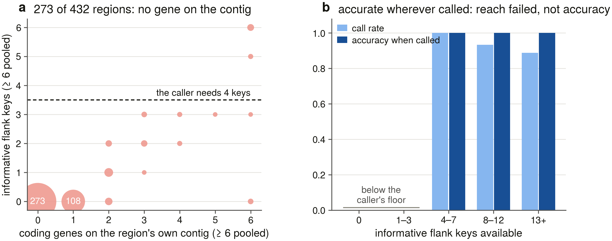

**Figure 9.4.** Why synteny could not answer, showing the joint
distribution of what a trace region has to work with, with the caller's
floor drawn, beside the caller's own accuracy on the same axis. The
neighbourhood caller is right at every key count at which it acts, and it
acts on 8 of 432 regions, because a fragment's contig carries no neighbours
to read. Putting reach and accuracy on one axis is the only way to show that
the method's failure here is a property of the data rather than of the
method, which is what makes accurate and unavailable a readable verdict
rather than an excuse.

On the 8 regions it can reach the caller returns a call for 6 and agrees with
the alignment's own attribution on all 6. That is an independent instrument
corroborating the attribution, on six regions, stated for what it is.

## 9.5 No cell in 927 reaches the absence state

Of the 927 cells, 783 are a single locus at full coverage, 90 a locus
truncated by the assembly, 7 a partial locus with no assembly excuse, 43
reassembled across contigs, and 4 family loci the panel cannot file. Zero fall
in each of the three states that would license a loss claim or invalidate a
genome.

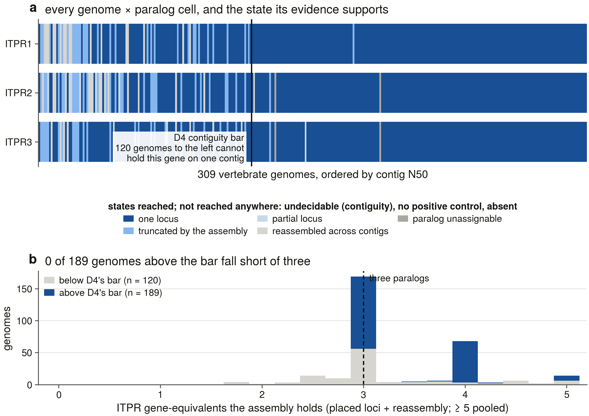

**Figure 9.1.** Every genome by paralogue cell, ordered by
assembly contiguity with the bar drawn, and the gene-equivalents each
assembly holds. The panel exists so a reader can see that the red the genome
ledger showed is gone, and see where it went. This figure is the whole of
Chapter 9's argument in one panel. Ordering the genomes by contiguity and
drawing the bar shows that the apparent absences in the raw ledger are
concentrated below it, and the second panel shows that in every one of the
189 assemblies contiguous enough to carry the gene, all three paralogues are
present. What a reader should take from it is where the red went, not merely
that it is gone.

The 43 reassembled cells are the substantive change this chapter makes to the
ledger, because those were the cells a naive count would have read as
candidate absences. Every one of them holds a gene.

The four unfilable cells are ITPR2 and ITPR3 in the two cyclostomes, which are
exactly the four the reconciliation flagged, recovered here by a rule that
reads the sweep's own per-genome locus counts rather than that chapter's
table.

**Reference coverage cannot count copies, and genomic sequence can.** The
paralogues are similar enough that a genome holding only ITPR1 recovers most
of the ITPR2 reference, which is why the calibration needed a decoy at all. A
placed locus and a reassembly occupy different places, so the per-cell
contributions add.

**In every one of the 189 assemblies contiguous enough to carry this gene, all
three paralogues are there**, at a median of 3.00 gene-equivalents and a
minimum of 3.00. Below the bar, 11 of 120 fall short, and the shortfall tracks
contig N50 rather than taxonomy.

## 9.6 Lesion counts are mostly an alignment statistic, and the confounder is not the obvious one

The sweep records how many frameshifts and in-frame stops each locus required.
Read naively that is a pseudogene screen. Read honestly it is mostly a
sequencing and alignment statistic, and the family's own control makes the
point: the ryanodine receptors, which are a 5,000-residue gene nobody claims
is dead, have the lowest share of lesion-free loci of the four cells.

Lesions are counted per kilo-aligned-residue rather than per gene, or the
1.8-times-longer ryanodine reference leads every ranking by construction. The
bar is the upper quantile of a population the screen never scores, comprising
loci at full coverage, in contiguous assemblies, whose own annotation names
them as family, which are genes a second pipeline independently calls
functional. 72 % of them carry no lesion at all.

**The confounder that matters is not the one anybody expects.** Measured over
every scored locus, assembly contiguity barely moves the lesion count
(ρ = −0.077) and the locus's identity to its bait moves it a great deal
(ρ = −0.397). A lesion count is substantially a measure of how far the
reference is from the gene, because a poorly matched bait buys alignment with
frameshifts.

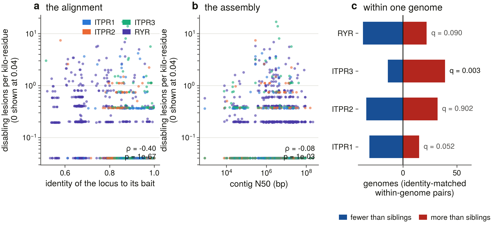

**Figure 9.3.** Lesion density against the two confounders that could
produce it without a gene being dead, and the paired within-genome test that
removes both. The identity panel is drawn first because contiguity is the
confounder everyone expects and identity is the one that turned out to be
real. Density is logarithmic with an explicit zero band, since 72 % of
intact loci carry no lesion and a linear axis puts the whole calibration
population on one pixel.

So the paired within-genome test, in which each cell is compared against the
same genome's other family loci and which removes the assembly entirely, is
run twice, once identity-matched, with ties dropped and counted and the four
tests corrected together by the false-discovery-rate procedure this project
uses throughout [80].

**One result survives, and it is paralogue-specific.** ITPR3 carries more
disabling lesions than its own genome's identity-matched sibling loci, in 39
genomes to 14. ITPR2's excess in the unmatched test disappears once identity
is matched, so it was an alignment artefact. ITPR1's deficit does not survive
correction, and the ryanodine control shows no excess, so the ITPR3 signal is
not a property of the family's gene structure as a whole.

What that is **not** is a pseudogene finding. All 44 loci above the bar in
contiguous assemblies are at full coverage with an intact gene model, and the
one sound direction here was already established: zero stops falsifies a
pseudogene call, and a handful does not establish one. The verdict column
stays one-sided.

## 9.7 The tree the count is placed on is a taxonomy, declared as an input

A reconciliation needs dates and a hand-curated tree, and a loss count needs
coverage. Chapter 7's 31-species tree cannot serve here, because 278 of the
species whose cells this matrix holds are not in it.

So the topology is NCBI taxonomy over all 309 assemblies, taken from the same
archived dumps the manifest was built from: 309 genomes placed, 468 internal
nodes, **49 of them polytomies**. There is one tip per accession rather than
per species, because the sweep's unit of observation is an assembly.

It is an input rather than a result. Its polytomies are real and are not
resolved, which for parsimony makes a placement less confident and never
wrong, but a count of independent losses under a polytomy is bounded by the
resolution, so the degree distribution is committed. The tree's compatibility
with the curated one is checked rather than assumed, and the check is asked so
that the two trees' different sampling cannot register as a disagreement. The
first version counted assemblies of species the curated tree never sampled as
intruders and reported 21 of 29 clades as unrecovered while every matched node
carried the right name.

## 9.8 Dollo parsimony places no loss, and the gain nodes agree with Chapter 7

Under the operating point, on both codings, the family character and all three
paralogue characters are present in every genome that can be scored, absent in
none, and Dollo places **zero losses**, at both the maximum and the minimum.

The count is zero because no cell reaches the state that would license it,
rather than because the routine cannot return anything else. A constructed
control puts a loss on a known edge and requires it found, another requires
two sister losses merged into their parent, and a third constructs a
contiguous, controlled, spare-free empty cell and requires it to come back as
an absence. **A count that can only ever return zero is not a measurement**,
and these are what stop this one being that.

**The gain nodes are a consistency check nobody asked for.** Dollo places the
single gain at the most recent common ancestor of the tips carrying the
character, and for the paralogue characters that node is not pinned. The three
answers are Vertebrata, Gnathostomata and Gnathostomata, which is exactly
where Chapter 7 placed the two duplications, recovered by a method that reads
no gene tree, no alignment and no reconciliation.

It is worth printing and it is **not independent evidence**, because the
reason ITPR2 and ITPR3 have no cyclostome tip is that those cells are
unfilable for want of a cyclostome-labelled bait, and the reason the
reconciliation placed the duplication there is a reconciliation.

## 9.9 What it would take to manufacture a loss out of this data

With no loss to place, what is worth reporting is the shape of the zero: how
far the rules must move before a loss appears, which rule has to move, and
what each move buys.

Thirty-two settings were walked, comprising an ordered eight-rung evidence
ladder, each rung named after what it refuses, crossed with the two protective
rules on and off, on both codings, under three branch-length schemes. The
first three rungs of the ladder are the calibration's own measured gap edges
and midpoint rather than round numbers, so the first sensitivity question
asked is whether moving the bar across its own uncertainty changes anything.

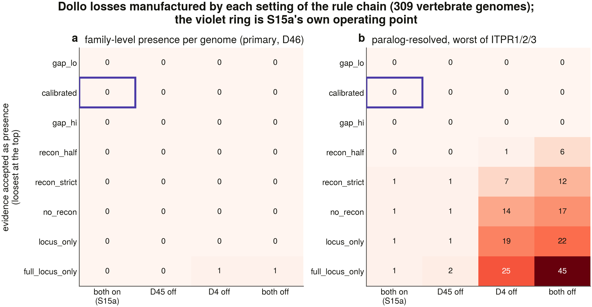

**Figure 9.6.** The loss count in every cell of the grid, for
the family-level coding and the paralogue-resolved one, with the operating
point marked. This is what a zero looks like when it is defended properly.
Rather than assert robustness, the count is recomputed under every
combination of four analytical axes, and the asymmetry that reveals is the
result: a family-level absence is stable across 30 of 32 settings while a
paralogue-resolved one is fragile to every knob. A zero is drawn as an
explicit zero and never as an empty cell, because an empty cell reads as not
measured and the zero is the result.

**Moving the reconstruction bar across the whole gap the calibration measured
manufactures no loss on either coding.** The bar's position inside its own
uncertainty is not what any result here rests on.

Read across the two codings, the result is an asymmetry rather than a number.
The **family-level coding manufactures a loss in 2 of 32 settings**, and its
worst case is one genome in 309, reached only by refusing everything except a
complete locus and ignoring the contiguity bar at the same time. The
**paralogue-resolved coding manufactures one in 18 of 32**, up to 45 loss
edges. A per-paralogue absence is fragile to every one of these knobs and a
family-level absence is not.

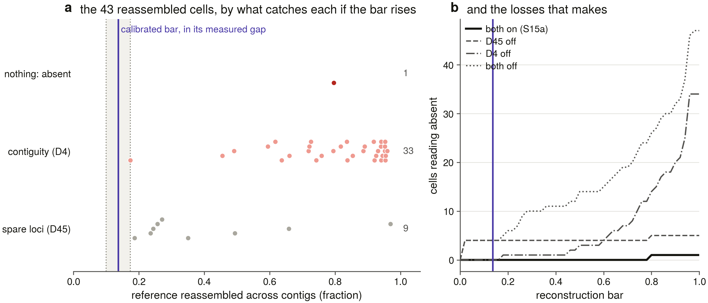

**Figure 9.5.** The calibrated bar with the gap's two edges
drawn. The within-row offset of each point is its rank in its own row, using
no hash and no random number generator, so the figure is reproducible.
Drawing both edges is what makes the threshold's own uncertainty visible,
and the answer to the first sensitivity question is that moving the bar
anywhere inside it changes no cell in 927.

**The branch-length axis changes nothing, and that is reported rather than
omitted.** Across all 32 settings and all three schemes, the number of
settings at which a branch-length scheme changes a parsimony count is zero.
Parsimony counts edges and does not read a length, so this could not have come
out any other way, but the brief names branch lengths as an axis and a matrix
that quietly dropped one axis would be indistinguishable from one that had
tested it.

## 9.10 The rate models are refused, and the refusal is measured

The brief asks for equal-rates, all-rates-different and irreversible Markov
models [81]. On the primary character all three are **refused**, and the
refusal is measured rather than asserted.

An invariant character contains no transition to estimate. Profiling each
likelihood along a rate grid over eight orders of magnitude gives, at every one
of the twelve model by branch-length by axis combinations, a monotone curve
with its maximum on the grid's boundary. The loss axis falls to the floor and
the all-rates-different model's gain axis rises to the ceiling, which is what
unidentifiability looks like when it is drawn rather than argued.

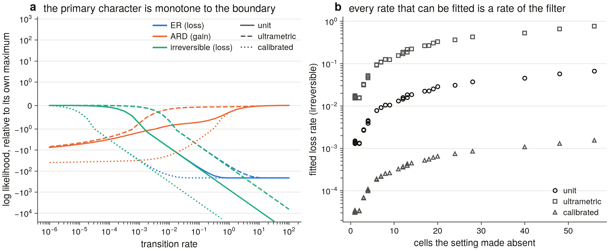

**Figure 9.7.** The likelihood along a rate grid for every model, axis
and branch-length scheme. The all-rates-different model is profiled on its
gain axis rather than on its diagonal, because the diagonal is the
equal-rates model by construction and would put the same curve on the figure
twice under two names. The figure is a refusal turned into a measurement:
rather than assert that an invariant character cannot be fitted, it shows
what the likelihood surface actually does, which is to run to the edge of
the grid in every one of the twelve combinations.

So no rate is reported for the primary character, because a fitter run on it
would return its own starting point.

Where the sensitivity matrix does produce variation the fits are real, and
they are reported for what they are: a property of the filter rather than of
the family. In the most extreme cell of the matrix the three branch-length
schemes give rates spanning a factor of 495 while describing the same
character, which is the branch-length axis doing the only thing it can do
here, namely setting the units a rate is quoted in.

## 9.11 The fossil test has no dead loci to run on, and it hands on one lead

If a paralogue died in an ancestor, its descendants should share lesions more
often than independent decay would give. That test needs dead loci.

Of 1,760 scored loci, 44 clear the measured lesion bar, and **all 44 are at
full coverage, delivering a complete gene model.** The screen was made
deliberately generous, counting a locus as a candidate if any of three
readings fires, because a test made hard to pass would make the zero
uninformative. Even so, seven family loci in 874 fire any reading at all, and
all seven do so on one or two internal stops in a complete model.

One or two stops in a 2,700-residue model at full coverage is not the
signature of decay. **The shared-lesion test has no dead loci to run on, and
that is reported with its denominator** rather than omitted, because an
omitted section is indistinguishable from a section nobody ran.

**The one lead this chapter hands on is a bird result.** The ITPR3 lesion
excess of §9.6, stratified by vertebrate class and corrected across the
strata, is 25 genomes to 2 in birds and 7 to 6 in ray-finned fish, which is no
signal at all on a sample that is smaller but not small.

**Figure 9.8.** The identity-matched sign test stratified by
vertebrate class, with the contiguity control drawn beside it. The
stratification names a lineage and the control immediately removes the
ground from under it, which is why both belong on one figure. The verdict
this panel supports is that the mechanism behind the excess is unsettled
rather than found.

The design makes a cell and its siblings the same observation twice, because
the comparison is within one genome against that genome's other family loci,
so a bird ITPR3 that is elevated makes its own ITPR1 and ITPR2 look deficient
by construction. The three bird rows are one result rather than three.

**The control has to be printed.** Twenty-one of the 27 bird pairs are in
assemblies below the contiguity bar, and that is where the test has its power.
Above the bar all six pairs point the same way and none points against, but
six pairs cannot carry a test. Two thirds of bird assemblies are below the
bar, the worst of any class, so this is precisely the class where an indel
signal is hardest to separate from an assembly signal. The identity control is
clean, so the confounder that mattered in §9.6 is not what this is. **The
lineage is now named and the mechanism is not, and the contiguous half of the
evidence is too small to settle it.**

## 9.12 What the zero means, and the two ways to escape it

Every vertebrate genome in a declared scope of 309, searched with an
instrument whose false-negative rate is measured at 15.2 % overall and 0.9 %
in contiguous assemblies, carries all three IP₃ receptors. No lineage has lost
one. The count is robust to moving every threshold across its measured
uncertainty, and the settings that would manufacture a loss are named and
counted rather than avoided.

That is a strong claim, and the strongest form in which it can be made is the
one that names its own escape routes. There are two. A per-paralogue absence
is fragile to the analytical settings in a way a family-level absence is not,
and a reader who wants a loss can have one by refusing all reconstruction
evidence and ignoring assembly contiguity, which is a description of the
setting rather than a defence of it. And the scope is 309 vertebrate genomes,
so nothing here extends to a lineage with no assembly.

---

# 10. Measuring selection across the vertebrate family

## 10.1 An identity is a distance, and this chapter measures a rate

Chapter 6 measured identity within a paralogue at 0.910 and concluded the
family is conserved. That is a distance. A conserved protein and a slowly
evolving one are not the same statement: identity says how far two sequences
have moved apart, and a selection test says whether the moves that did happen
were the ones selection tolerates.

This chapter measures the rate. It is the shortest analytical chapter in the
thesis and the one with the most traps in it, because a codon model returns a
perfectly plausible number when its input is wrong, when its optimiser has
found a local peak, or when its denominator has stopped existing.

## 10.2 Every coding sequence had to be proved to encode the aligned protein

A ratio of non-synonymous to synonymous substitution is a statement about
codons, so every number here rests on a nucleotide sequence that provably
encodes the exact protein the alignment holds. Nothing is a translated
database record taken on trust.

Three routes supply candidates, comprising a genome database, cross-references
from the protein record, and the genomic gene models the sweep produced, and
each is a **generator of candidates** rather than an answer. A protein entry
lists every transcript of its gene and the entry's own sequence is one
particular isoform. Human ITPR1 lists five and ITPR2 two, and in **both** the
first is not the isoform the alignment holds. Returning the first coding
sequence that downloads would silently substitute a different isoform for the
protein the tree was built on, which is a wrong codon alignment rather than a
missing one.

Every candidate is translated against the aligned protein and **every**
disagreement is masked, not only internal stops. A codon that encodes
something else is not that protein's codon at that site whatever the cause,
and the model must see missing data rather than a residue that is not there.

Fifty-seven of 57 vertebrate tips have a validated coding sequence, from two
routes, with 24 codons masked across the whole set.

**The genomic route has its own trap.** The sweep ran the aligner in a mode
whose emitted protein skips frameshift residues, so the alignment's coding
blocks run out of frame against it and splicing them is not offered at all.
The locus is realigned in a mode that keeps those residues, and the
reconstruction is accepted only if it reproduces the sweep's protein. The one
concession is measured rather than assumed: a locus re-run indexes a fraction
of the genome the sweep indexed, so a terminal exon can be placed differently,
by nine residues of 2,666 in one frog. Same length and within 1 % is the same
gene model and its disagreeing codons are masked, and anything beyond that is
a different model and is refused.

The codon alignment is then produced by a protein-guided aligner [82] and
**cross-checked nucleotide by nucleotide against an independent in-house
mapping**, with a disagreement aborting the build. A residue masked in step
one is written as an unknown in the protein rows too, so the aligner is never
asked to reconcile a pair that disagrees, which it does by dropping the
sequence silently. Trimming is chosen on the protein and applied codon-aware,
whole triplets only.

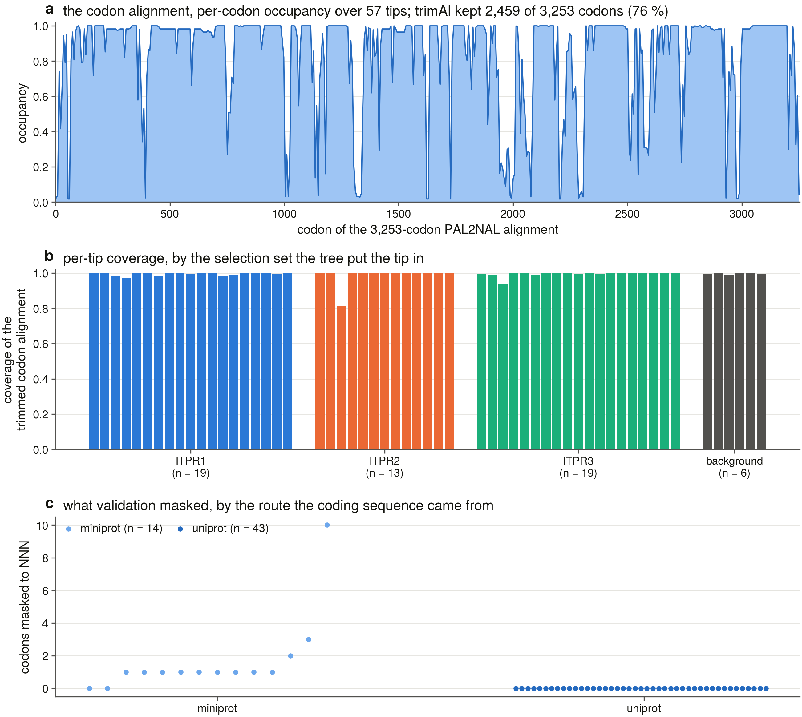

**Figure 10.5.** The trimmed codon alignment behind every
estimate in this chapter, plotted in codons, because an axis in nucleotides
would make a three-fold difference look like a property of the data. The
panel exists so a reader can see the size of what every rate in Chapter 10
was estimated on, which is 2,459 codons of 3,253 after trimming, across 57
tips whose coding sequences were each proved to encode the aligned protein.

**Twelve constructed negative controls run on every build**, and their
character is the point. A codon alignment is the one artefact in this project
where a silent error is invisible downstream, because the model will fit a
frame-shifted alignment and return a perfectly plausible rate. So the controls
are checks on refusal: a frame-shifted sequence, one encoding a different
protein, an internal stop that must be masked and not refused, whole-triplet
gap stripping, and a non-monophyletic foreground being refused.

## 10.3 The tree decides which tips are in which selection set

A branch model marks a node. A foreground that is not a clade does not fail.
It silently marks a larger one and returns a well-formed rate for a hypothesis
nobody asked.

So the three selection sets are Chapter 6's extended paralogue clades,
re-derived here from the rooted tree with that chapter's own rule and
cross-checked against its committed table, with a disagreement in size or
membership treated as a hard failure.

Two consequences follow. A tip the tree recorded as unplaced is placed by the
tree or by nothing, never by a database symbol. And the seven unlabelled tips
the tree nests inside a paralogue clade join that set, because outside the
vertebrates a paralogue label means nothing, but inside a maximally supported
vertebrate paralogue clade the tree has just supplied one.

Six tips sit in no paralogue clade. They stay in the whole-tree analyses,
because dropping them would change the branch lengths every other estimate is
made on, and they are in no foreground, because a locus the tree could not
place is not evidence about a paralogue.

They are the six cyclostome loci. Chapter 6 placed them in two cyclostome-only
clades and handed the question on, Chapter 7 reported the neighbourhood
underpowered because after 550 million years there is no shared flank
vocabulary left, and a third instrument now declines the same question for a
third reason: a codon model can only ask about a paralogue whose clade the
tree defines, and for these six it defines none.

## 10.4 All three paralogues are under strong purifying selection

One-ratio estimates [83] give ITPR1 at 0.0238, ITPR2 at 0.0430 and ITPR3 at
0.0415. The highest of the three is **23 times below neutrality**.

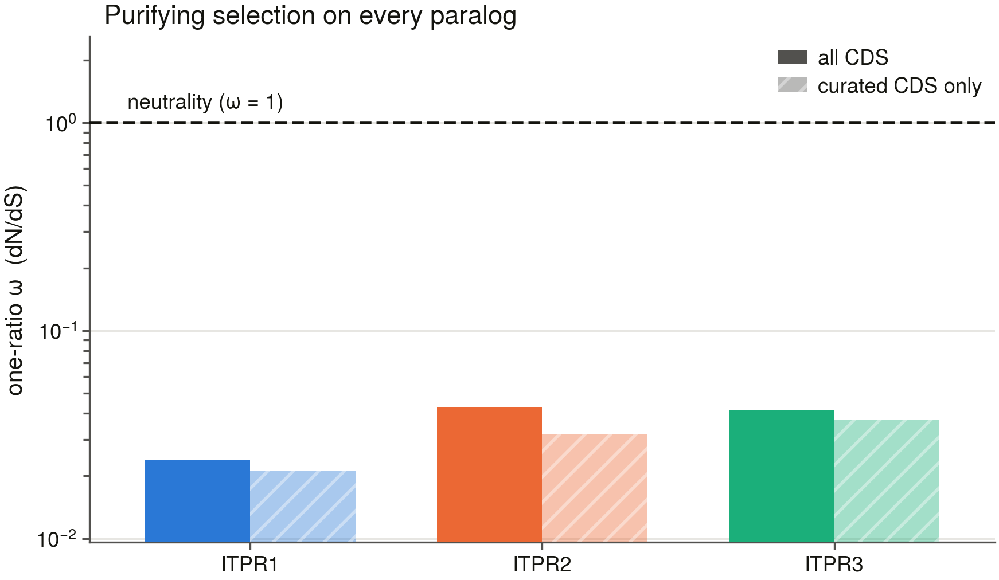

**Figure 10.1.** Per-paralogue rate with the curated-sequence
sensitivity estimate beside it, and neutrality drawn rather than described.
The axis is logarithmic because the result is how far below neutrality these
rates sit, and on a linear axis every bar is on the floor. The sensitivity
estimate beside each bar is what shows the rates are not an artefact of the
reconstructed gene models, since it is computed with every one of them
removed.

The identity Chapter 6 measured says the same thing far less sharply. This is
a 2,700-residue channel accumulating one non-synonymous change per 23
synonymous ones.

The sensitivity subsets, meaning the same paralogues with every genomic gene
model removed so that no masked codon contributes, move the estimate by at
most 0.0112. The estimates are not an artefact of the reconstructed models.

## 10.5 Synonymous saturation qualifies every other number in this chapter

Synonymous sites are **saturated across the vertebrate span, inside a single
paralogue and not only between them.** In the worst set, 94.2 % of
within-paralogue pairs exceed the conventional saturation bar, and the medians
run from 4.6 to 13.5.

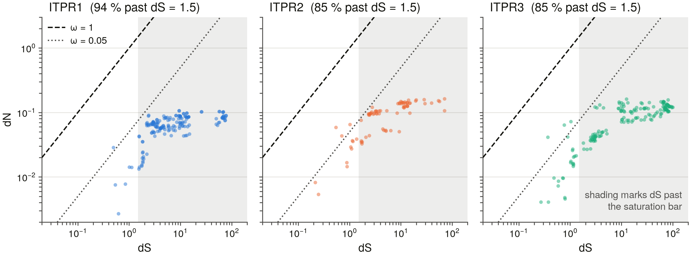

**Figure 10.3.** Pairwise rates within each paralogue, drawn
log-log with the neutral diagonal and the saturation bar. On a
logarithmic-x, linear-y plot the neutral diagonal is not a line at all: the
first draft's neutrality ran off the panel within the first pixel and left
the saturation bar as the only line on the figure, which reads as
neutrality. What the panel shows is that saturation is reached inside a
single paralogue and not only between the three, which is the reason no rate
in this chapter is taken from a pairwise matrix.

The expectation going in was saturation between the paralogues, which are
older than 500 million years. It is already reached within them, because a
single paralogue set spans shark to teleost to mammal.

That has one immediate consequence and one that runs through the rest of the
chapter. **The pairwise rate matrix is a diagnostic here rather than an
estimate**, so every rate quoted comes from a tree-based model, which
distributes substitutions over branches instead of asking one pair to carry
450 million years. And every rate should be read as a lower bound on precision
rather than a point estimate with a small error, because a ratio whose
denominator is soft is soft.

## 10.6 ITPR1 is the most constrained of the three

Ranked from most constrained to least, the order is ITPR1, then ITPR3, then
ITPR2.

Each paralogue clade tested against the rest of the family as a two-ratio
branch model confirms it, with every test corrected across the family. ITPR1's
foreground rate is 0.0241 against a background of 0.0432, ITPR2's is 0.0435
against 0.0317, and ITPR3's is 0.0455 against 0.0308.

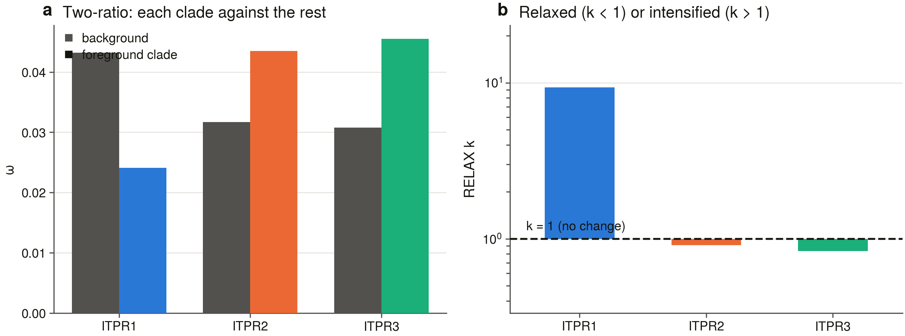

**Figure 10.2.** Background against foreground rate per paralogue
clade, with the relaxation coefficient beside it. The importance of this
figure is that two different statistics on two different models give the
same ordering. A point-estimate contrast and a test on the whole rate
distribution both put ITPR1 under roughly twice the purifying selection of
its sisters, and both make its selection intensifying relative to theirs.
That agreement is what turns a ranking into a claim about the three copies
having been held to different standards.

ITPR1 is the paralogue that carries the family's dominant missense disease
burden, and it is the most constrained. It is also the paralogue whose
neighbourhood Chapter 7 found best preserved and the one that alone kept its
teleost duplicate.

**ITPR3's neighbourhood is the one that does not travel, while its coding
sequence is not the least constrained.** Those are different quantities,
because neighbourhood conservation is rearrangement history and this is coding
sequence rate, so the mismatch is not a disagreement, and the project's
verdict vocabulary has a word for that rather than forcing a choice.

## 10.7 The stem branches carry three optimiser failures a single run would have hidden

A duplicate's fate is decided on its stem, meaning the interval between the
duplication and the first surviving split of the new copy. If a paralogue was
ever free to change, that is when. Branch-site model A [84] asks whether a
class of sites on that one branch has a rate above one while the rest of the
tree does not.

**Model A is restarted from four initial rates by construction here** rather
than repaired afterwards. A nested alternative cannot have a lower optimum
than its own null, and yet **3 of the twelve restarts converged below their
own null, one on every stem.** Each of those is a local-optimum failure that a
single-start run would have reported as its answer.

A different starting value fails on each stem, so no single initial value
would have been safe. That is the case for running several rather than for
choosing a better one.

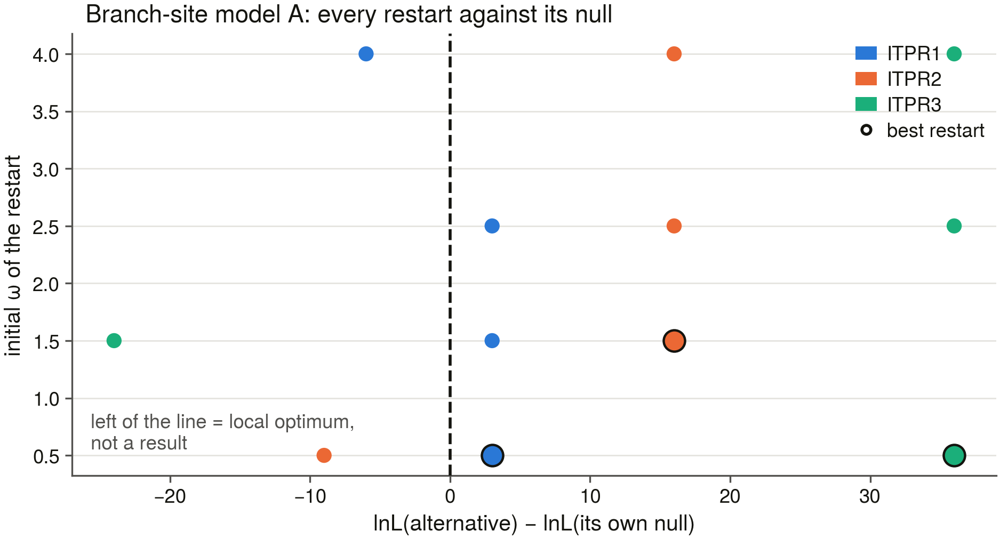

**Figure 10.4.** Every restart against its own null. A point below the
line is a local optimum rather than a result, and three of twelve sit there,
one on every stem, with a different starting value failing each time. The
importance is general rather than local: a branch-site result from a
single-start run is a result whose optimiser has not been checked, and
nothing in its output says so.

**All three stems are significant after correction, and one of the three
carries a rate the data actually determine.** That distinction is the
substance of this section, and it comes from a parameter printed outside the
test rather than from the test.

On the ITPR2 and ITPR3 stems the foreground rate is pinned at the optimiser's
upper bound of 999. That is not an estimate of 999. It is the optimiser
reporting that the foreground has no synonymous signal left to normalise a
rate against, which is exactly what §10.5 predicts for a branch this old.
Restarts reaching the same likelihood put one of them at 162 and at 999, which
is a six-fold spread at an unchanged likelihood and is the definition of an
unidentified parameter. On one of them, no site clears the posterior bar at
all.

On the ITPR1 stem the rate is **5.53 on 11 % of sites**, well inside the
estimable range, stable across restarts, with 8 sites clearing the posterior
bar [85] and 5 clearing the stricter one.

**So the reportable branch-site finding is ITPR1 alone**: a class of sites on
its stem evolving several times faster than neutrally while the rest of the
tree sits near 0.03. The other two stems' tests are significant and their
effect size is unmeasurable, and those are different sentences. A pipeline
that printed the three p-values would have reported its strongest signal on
the stem whose parameter is least determined.

## 10.8 A significant site-model test can mean something quieter than its p-value

Site models ask whether any site in a paralogue has a rate above one across
the whole clade, which is a different question from the stem, and the one that
would find recurrent positive selection anywhere in the vertebrate history of
that copy.

The pattern that recurs is a significant likelihood-ratio test whose fitted
parameter says something quieter than the p-value suggests: an extra rate
class at exactly 1.000 on 0.3 % of sites, or a class above 1 with a share of
zero, and no site clearing the posterior bar. A significant test with no site
above the posterior bar is the signature of a fit driven by saturation rather
than by identifiable substitutions, so every significant test in this chapter
is printed beside its posterior column.

That discipline is the reason three of this chapter's significant tests are
reported as meaning something other than what their p-values suggest, and in
every case the tell was a parameter printed outside the test.

## 10.9 Selection on ITPR1 is intensified, and on its sisters relaxed

A branch model asks whether a foreground's rate differs. The relaxation test
[86], run locally in the same framework as the per-site model [87], asks
whether the whole distribution on the test branches is pulled towards
neutrality or away from it, which in a family where every rate is far below
one is the sharper question.

ITPR1 is intensified at k = 9.36, ITPR2 relaxed at k = 0.908, and ITPR3
relaxed at k = 0.836.

That is the same ordering the one-ratio estimates give, arrived at by a
different statistic on a different model, in that one compares point estimates
and the other compares whole distributions, so the two are a check on each
other rather than one number told twice.

**The three copies have not been held to the same standard since they were
made.** ITPR1 is under roughly twice the purifying selection of its sisters
and is intensifying relative to them, and it is the copy the teleost
duplication kept, the copy whose neighbourhood is best preserved, and the copy
that carries the dominant disease burden.

The unlabelled tips the tree places in no paralogue clade are left unlabelled
in these runs rather than swept into the reference set, because a branch whose
paralogue identity is unresolved is not evidence about either side of a
contrast.

One implementation note is worth keeping because the failure it causes is
silent in the wrong direction. The descriptive model estimates a per-branch
rate, and a branch with no synonymous change gets an infinite one, which the
program writes as a bare token that is not legal JSON. It is normal output,
the analysis succeeds and the parse throws, and on the first run that turned
one paralogue's entire result into a blank row.

## 10.10 What this chapter does not establish

**Saturation is not repealed by using a tree.** Nearly nine tenths of all
within-paralogue pairs exceed the saturation bar. Tree-based models handle it
far better than pairwise estimation, but a rate estimated where the synonymous
rate is poorly determined is a ratio with a soft denominator.

**Fourteen of the coding sequences come from genomic reconstructions** with
masked codons. The curated subsets show the estimates barely move without
them, but those models are also the only evidence for several lineages, so the
subset is a control rather than a replacement.

**The tree is conditioned on.** Every branch test runs on Chapter 6's
topology. If the sister arrangement were wrong, the branches marked here would
be the wrong branches, which is why that chapter ran a topology test over all
three arrangements before this one started, and why the dependency is recorded
rather than quietly relied on. A branch test cannot corroborate the topology
it is conditioned on.

**This is a vertebrate result.** The non-vertebrate grade is not in the codon
alignment at all, so nothing here bears on the constraint acting on the
single-copy receptors Chapter 5 found across the eukaryotes.

**Two of the three branch-site effect sizes are not identified**, which is not
the same as being large.

The whole suite ran unattended in 22.7 hours, and every stage renders whatever
has landed and marks an unfinished section as unfinished, because waking up to
a partial analysis that says which parts are partial is worth more than waking
up to nothing.

---

# 11. The channel's shape, its constraint, and the clinical variants

## 11.1 This chapter asks two questions about the protein rather than the gene

Everything so far has been about genes: where they are, where they came from,
and whether they are still there. This chapter is about the protein.

It asks two questions. Does what the census calls an IP₃ receptor fold like
one, and can it be told from a ryanodine receptor by shape alone? And which
parts of the receptor cannot change, meaning where the constraint is, whether
it sits where the structure says the machine works, and whether it explains
the clinical variants?

The first question has an answer that is mostly about a database, and it is
worth having in advance because it constrains what the second can be built on.

## 11.2 The structure prediction database does not hold this family

A vertebrate IP₃ receptor subunit is about 2,700 residues, which is where the
monomer prediction pipeline [88] stops, and the sister family at about 5,000
is past it outright. So structural coverage is measured before anything is
compared, and it is measured three ways that do not agree: the cross-reference
in the protein record, an actual probe of the prediction database [89], and
model coverage against the length the census holds.

Only the third can see the trap.

**The database is keyed on an accession and answers with whatever record it
holds, and that record may be an isoform.** Asked for the three human
paralogues it returns a 2,695-residue model of a 2,758-residue protein, the
canonical 2,671-residue ITPR3, and **181 residues of the 2,701-residue
ITPR2.** A probe that took the first record and called it a hit would report
the family's own reference paralogues as fully modelled.

**20.9 % of the census's protein-database records have a usable model**, and
of the 134 representatives every alignment, tree and selection result in this
thesis stands on, **nine** do.

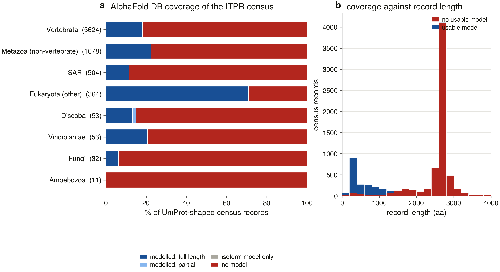

**Figure 11.4.** Coverage by group, and against record length.
The second panel is the result, and it sets the ceiling on every structural
argument this family can support: the usable-model mass sits below about
1,300 residues, while the peak at about 2,700, which is a full-length
subunit, is almost entirely unmodelled. A reader who assumed the prediction
database covers modern proteomes uniformly would expect a receptor of this
size to be modelled. Every structural statement in this chapter therefore
rests on experimental depositions, and the figure is what makes that a
measured constraint rather than a preference.

The median modelled record is 392 residues and the median unmodelled one
2,674. Of the 5,861 census records at or above the family's own length floor,
meaning the plausibly full-length ones, **13, or 0.2 %, have a usable model.**
The coverage this database offers the family is concentrated on its fragments,
which are the records a structural argument can do least with.

This was written down as a guess before it was measured, which is the only
reason it is worth reporting as a confirmed prediction rather than as an
observation.

## 11.3 Seven rules build the structural panel, and nothing enters unread

The references are resolved by query rather than from memory, and seven rules
choose what goes in, each a positive test.

**The family call comes from this project's census on the entity's accession,
never from an entry title**, because the two families share every diagnostic
domain and half their titles. Structures must be cryo-electron microscopy with
a recorded resolution and full length in the family's declared band, so a
ryanodine receptor cannot enter through the IP₃ band because the band was
defined to exclude it. The conformational state must be readable from the
title against a stated vocabulary, ordered so that compound states are tested
before the words they contain. One reference is taken per paralogue, and a
paralogue the census does not name gets no label rather than falling back to
the family name. A state panel is built on the paralogue offering the most
conformations, because a model scored against one conformation confounds fold
with gating. And the negative controls come from Chapter 3's committed decoy
panel, one per class, held to the same rules and size-matched.

Enumerating candidates on the **union** of the four family signatures is
load-bearing. The structural database's own domain annotation of human ITPR3,
which is this project's own IP₃ receptor reference, carries four signatures
and **not** the one that names the family, which is the same absence Chapter 3
measured on 2,911 of 15,417 proteins. A query on that signature alone would
have missed the reference.

One further instrument is available and is deliberately optional: a
structure-based homology search over the whole prediction database [90],
which is the one stage in the project needing a multi-gigabyte index and is
off by default. What it returns is the shared domain rather than the family,
which is the same statement §11.5 makes with coordinates.

**Nothing enters the panel unread.** Every file is parsed, reduced to **one
chain**, because both families are homotetramers and an assembly is about
11,000 residues, so scoring a monomer against a deposited assembly would
answer a question about quaternary structure, and then measured. Twenty-nine
of thirty structures are usable, and the one rejection is the 181-residue
isoform model, caught by a rule rather than by inspection.

Where a taxonomic slot has no representative with a model, the best-covered
census record stands in, and the audit records that the slot was filled rather
than met. Without that, the panel is six proteins.

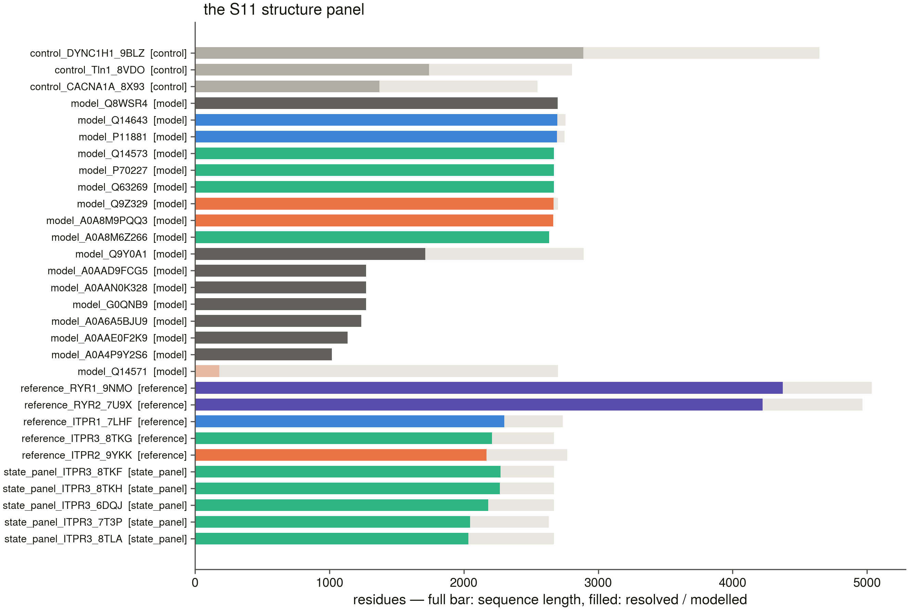

**Figure 11.1.** Every structure in the panel, where the pale bar is the
length the record claims and the filled bar what the structure delivers. The
importance of drawing the claimed and delivered lengths as two bars is that
the gap between them is what a fold comparison is actually computed on. A
structure resolving half its record has half its residues, and a score
normalised by the wrong one of those two numbers is a statement about size
rather than about shape. The panel lets a reader see, for every entry, how
much protein each later comparison had to work with.

## 11.4 The comparison scale is calibrated on this panel before any structure is called

Before any structure is called, the scale is calibrated on this panel rather
than taken from the literature, using five classes of pair, each answering a
different question.

**The negative controls span 0.09 to 0.25 and none of 81 control pairs reaches
the same-fold bar** under either normalisation. That is the floor every
positive result is read against, measured on proteins chosen as decoys for a
sequence scorer and re-used here without reselection.

**Conformation is worth 0.22 of the score.** Two structures of the same
paralogue in different states score a median 0.78, while two different IP₃
receptors score 0.43. So a fold difference of that size or less is not
readable on this panel and is not claimed, which is what the state panel
exists to establish.

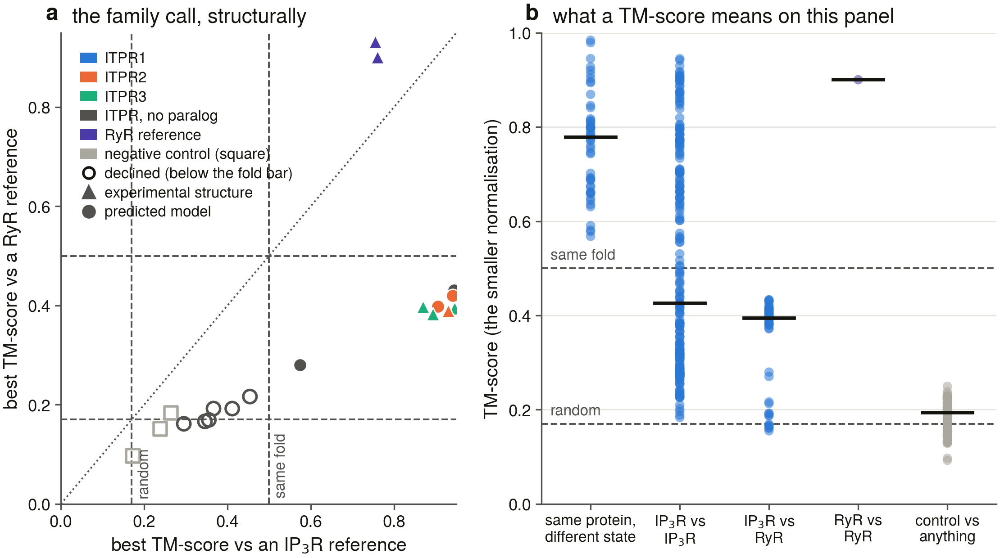

**Figure 11.2.** The family call made structurally, and the
calibration behind it. Both of the alignment method's published bars are
drawn, meaning the random-similarity floor and the same-fold bar [91],
rather than described. A calibration figure that asked to be believed would
not be one. The importance of this figure is that it turns the family
separation into a structural result rather than a sequence one. Everything
before this chapter told the two families apart on sequence and domain
content; here the same separation is recovered from shape alone, against
published bars the project did not choose. That matters because the two
families share every diagnostic domain, so a reader is entitled to ask
whether the distinction survives when domain annotation is removed from the
evidence.

Both normalisations are kept, because on this panel they say different things.
A subunit resolves to about 2,200 residues and a ryanodine receptor to about
4,300, so **which chain a cross-family score is normalised by decides whether
it reads as a fold result or a size one.**

## 11.5 Shape separates the two families exactly as the census does

This is the sixth instrument in the thesis to separate the two families, and
the first that reads no gene symbol, no domain architecture, no alignment
score and no tree, but only coordinates.

The test is the best score against the IP₃ references, the best against the
ryanodine references, and a **relative** margin between them, with scores
normalised by the reference, which is the question being asked: does this
structure account for an IP₃ receptor, or for a ryanodine receptor?

A margin is only consulted once the winner clears the same-fold bar, and that
gate is not decoration. All three negative controls beat their own runner-up
by about 30 % of their score while scoring 0.17 to 0.27 against everything, so
a rule gated on the margin alone calls a dynein heavy chain an IP₃ receptor.

**Twenty of twenty structures the instrument could call are called the way the
census calls them, and none of three negative controls receives a family call
at all.**

The instrument declines six further census-named structures, and a refusal is
not a disagreement. Every one of them still prefers the IP₃ receptors over the
ryanodine receptors by roughly two to one. What they cannot do is account for
enough of a reference to earn a call.

## 11.6 The fold test does not reach the deep records

This is where the structural work is worth most. The plant, fungal, protist
and non-vertebrate metazoan records were called IP₃ receptor on sequence
evidence alone, meaning profile score, architecture, and a per-record
contamination chase. None of that is shape.

**Two of seven deep models reach the same-fold bar** and the rest fall short.

The interesting column is the **ceiling**. A reference-normalised score
divides by the reference's length, so a model of *n* residues scored against
an *L*-residue reference cannot exceed *n*/*L* before similarity is considered
at all. Most of these models are 1,000 to 1,300 residues, which are the only
records the prediction database holds for these groups, against references of
about 2,050.

**None of them is excluded by arithmetic alone.** Every one had the headroom
to pass and did not, reaching 0.56 to 0.74 of its own ceiling, which is far
above the negative controls and far below a full-length receptor. That is what
a genuinely divergent homologue modelled at low confidence should look like.

The honest verdict is that the fold test neither confirms nor contradicts
these records. It does not reach them, and the project's vocabulary has a word
for a measurement that did not happen.

## 11.7 Prediction confidence is highest at the ligand core and lowest at the pore

A mean confidence score over a 2,700-residue multi-domain channel averages a
well-predicted β-trefoil with hundreds of residues of linker, and the
resulting number is high enough to look reassuring while saying nothing about
the part any claim rests on. So confidence is reported **per domain**, with
the boundaries transferred by pairwise alignment, and a domain landing on too
little of its reference span is reported unplaced rather than averaged over
whatever aligned.

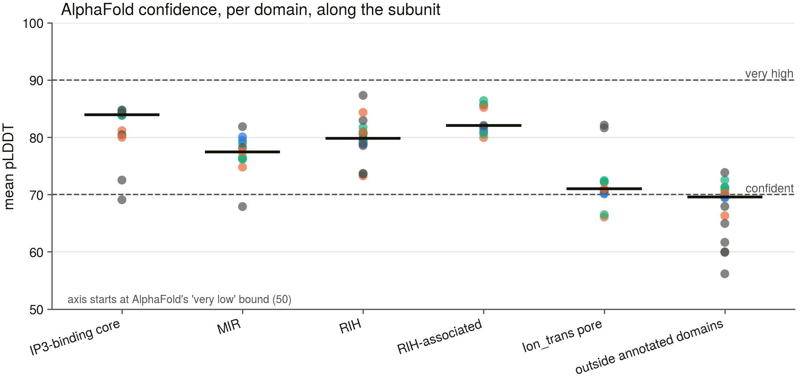

**Figure 11.3.** Confidence per domain, ordered along the
subunit, with the prediction method's own confident and very-high bands
drawn. Every model also gets an outside-annotated-domains contrast row,
which is what gives a high value something to be high against.

**The IP₃-binding core is the best-modelled domain of the receptor** at a
median of 83.9, against 69.5 outside the annotated domains, and **the pore,
which is the part the two families genuinely share as a working channel, is
the worst of the named domains** at 71.0. That matters for the next chapter,
which is scoped around the ligand site, because whether the prediction is good
there decides whether a structural argument about it can stand at all.

## 11.8 The constraint map needs depth the representative alignment does not have

The rest of this chapter is per-residue conservation, and it needs depth the
representative alignment does not have. Thirteen to nineteen tips per
paralogue is a phylogeny and it is not a per-site estimate.

So one locus per genome per paralogue was taken out of the 309 sweep outputs,
giving **249 to 265 orthologues of each individual paralogue.** Five rules
select them, and the fifth is one the sweep's own bars cannot do.

Bait coverage is aligned residues over bait length, so a model that covers the
bait and carries two thousand extra residues passes everything, which is
exactly what a large intron setting manufactures in the giant genomes. So the
fraction of each sequence's own residues landing in reference columns is
measured, and the bar is put in that distribution's own gap with both edges
committed, refusing to fire at all when nothing sits below the lowest curated
record.

**It drops one sequence, and that sequence was inflating one paralogue's
alignment from 3,380 to 5,676 columns.**

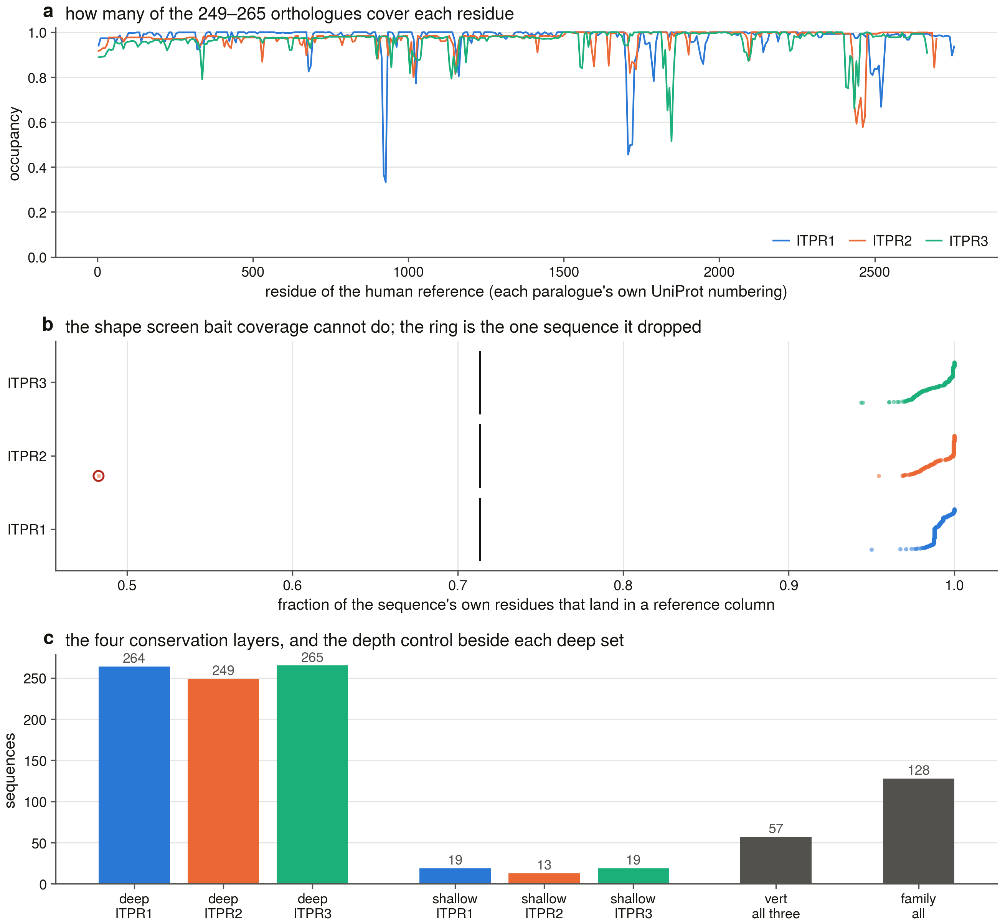

**Figure 11.9.** The three deep alignments the constraint
map is computed on, drawn as occupancy along the human reference rather than
along an alignment column, since the three have three widths and no shared
coordinate. What the panel shows is the depth behind the map, which is the
difference between this resource and one built on a handful of sequences,
and where that depth thins out enough that a score there should be trusted
less.

Three conventions run through every score. **Conservation is
sequence-weighted** [92] before any column statistic, and the column metric
is an information-theoretic divergence [93], because ray-finned fish are
about a third of the genome scope and unweighted, every teleost-specific
residue in a 260-sequence alignment reads as conserved. **Gaps are missing
data rather than a 21st state**, and the occupancy each score is conditional
on is reported. And the paralogue of each alignment tip is read from Chapter
6's committed table rather than re-derived from the tree, because a third
derivation that disagreed would be a silent fork in what this project means by
"ITPR2".

## 11.9 The Pfam signature named after the ligand does not contain the ligand site

Joining the domain coordinates to the structural measurements says something
that changes how the rest of this chapter has to be read.

**None of the ten measured IP₃ contacts lies in the Pfam signature named
*Inositol 1,4,5-trisphosphate/ryanodine receptor*.** They sit in MIR and RIH,
which are the two domains the family shares with the ryanodine receptors.

So the N-terminal β-trefoil is not the ligand site, and the ligand question is
asked throughout of the measured contacts and never of the Pfam label. A
report that had taken the label at face value would have measured the
suppressor domain and called it the IP₃-binding core.

The structural elements, meaning the filter, the gate and the ten contacts,
are in one paralogue's numbering and are transferred, each with an **anchor
test that can fail**: the filter must arrive on the same motif, the gate on
the same lining residues, and a failed anchor aborts rather than writing a
coordinate. The Pfam elements are measured per accession and are not
transferred at all, so the whole class of transfer error does not arise for
them.

One element no annotation carries is located **by geometry**: the luminal
loop, defined as the contiguous run of channel residues whose backbone lies
beyond the membrane on the luminal side of the measured axial span. A boundary
drawn on the conservation profile would be the profile explaining itself.

Residues outside every named element are given **named linkers** rather than
left blank, because a single unassigned bucket would pool the N-terminus, five
inter-domain stretches and the whole C-terminal tail, and then use it as the
within-protein control.

---

## 11.10 The gate and the selectivity filter are the least changeable elements

Every element is tested against the same protein's own linkers rather than
against its whole-protein mean, which would contain the element being tested.

**The gate and the selectivity filter are the most constrained elements of the
protein, on both metrics and in all three paralogues.** The RIH-associated
domain is the most constrained domain. Every named element except one sits
above its own protein's linker mean.

**Figure 11.6.** Constraint by element, with the composition-free
metric drawn beside the divergence metric rather than instead of it. The
headline result and its most obvious artefact are therefore on the same
axis: the gate and the filter come top on both metrics, so the ranking is
not a property of one scoring choice, and a reader can check that agreement
rather than take it on assurance. The second metric is there because a
divergence from a background frequency table [93] scores a transmembrane
element lower at equal conservation, which would have manufactured the very
result the chapter reports.

## 11.11 One element inside the channel is the exception, and finding it changed the result

The luminal loop scores far below every other element and below the linker
mean, making it by a wide margin the least conserved sequence in the receptor,
on the composition-free metric as well.

**Before it was separated out, the pore domain read as the least constrained
named element in the receptor, below the linkers.** That is a strange thing to
report about the pore of an ion channel, and the sort of result that should
not be printed without asking what else could produce it. Three explanations
were checked and all three were measured rather than argued.

The first candidate explanation was a **metric artefact**, since the
divergence measure is computed against a background frequency table and a
transmembrane domain is built of common residues. It was ruled out, because
the composition-free metric gave the same picture.

The second was a **gene-model artefact**, since the deep alignment is about
95 % genomic translations and the exon-dense transmembrane region is where a
mis-placed boundary would do most damage. It was ruled out, because
recomputing on the curated subset alone still put the domain below the
linkers.

The third was **an unresolved element**, and it was confirmed. The domain's
mean was the average of the most conserved stretch in the protein and the
least, and a bar of that mean is a number no residue has.

With the loop separated, **the pore module is more constrained than the
linkers, and the fifty residues of luminal loop inside it are the most
variable sequence in the receptor.** Those two live about fifty residues apart
in the same Pfam domain.

This is what the geometric definition was for. Had the loop boundary been
drawn on the conservation profile, this section would be circular. Drawn on
the membrane's own axial span in the structure, it is an independent
prediction that landed on the dip.

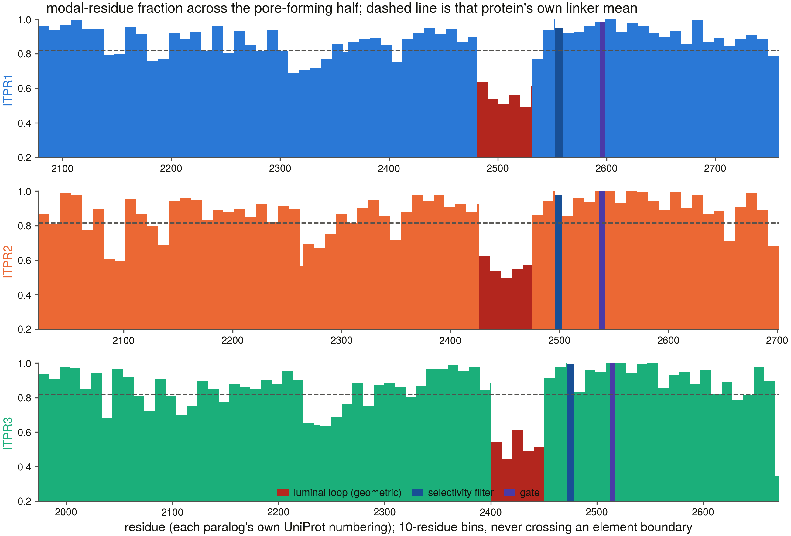

**Figure 11.5.** Constraint along the channel, binned, with
the bins never crossing an element boundary. This is where the chapter's
structural claim becomes visible as a shape rather than a table: constraint
is not uniform along the channel but peaks on the residues the structure
says do the work and collapses in the luminal loop between them. The binning
rule matters because a sliding window across that edge would smear the
collapse into the gate and erase the contrast the panel exists to show.

## 11.12 The ligand contacts and the gate are the two extremes of paralogue divergence

Each site class is tested against two controls: against the whole protein,
and, the sharper one, against the rest of its own element. A gate residue
beating the average residue of a 2,700-residue receptor is nearly guaranteed,
and beating the rest of the pore domain is not.

**The measured IP₃ contacts are more constrained than the rest of the domains
that carry them, in all three paralogues.** That is a statement about ten
residues and is reported as such. The filter and gate sets are two residues
each, and their means are given because the element-level test is where those
elements are actually powered, so a p-value on two residues is not offered.

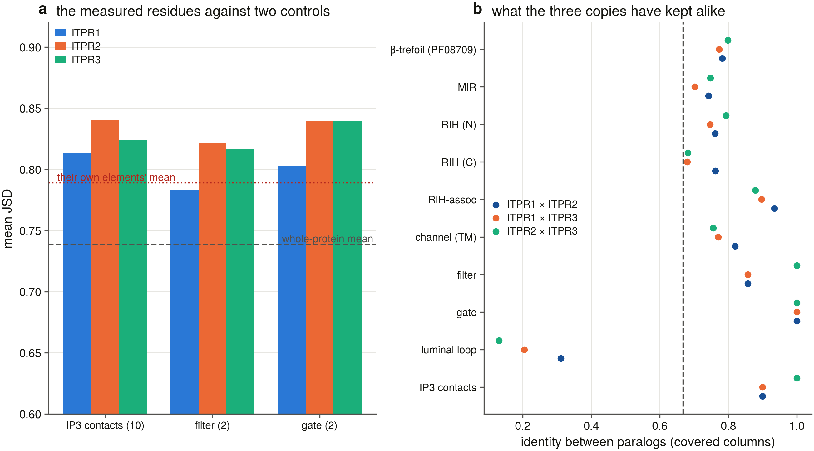

**Figure 11.7.** The measured functional residues scored
twice, against the whole protein and against the rest of the element each
sits in. The second comparison is the harder one and the one worth reading.
Most of a 2,700-residue receptor is linker, so clearing the first bar is
close to guaranteed, whereas clearing the second shows that the structure's
annotation picks out something its surrounding domain does not already have.
That is the test which makes a constraint map useful for interpreting a new
position.

A second and completely independent instrument on the same question is
identity between the paralogues, which needs no alignment depth and no
conservation metric at all.

**The gate is identical in all three pairs.** The luminal loop retains 13 to
31 %. The whole protein sits at 0.64 to 0.70.

So the two extremes of paralogue divergence in this receptor are **five
residues that have not changed since the duplications** and **fifty that
retain a tenth to a third of their identity**, and they sit inside the same
domain. Whatever the three copies were free to differ in, it was not the gate.

**One number looks like a disagreement with Chapter 6 and is not.** Chapter 6
reports between-paralogue identity at 0.741 to 0.791 and this chapter reports
0.64 to 0.70. Neither is wrong, because Chapter 6 measured on the trimmed
alignment, which kept 15 % of the columns. So every per-element row here
carries the same pair measured Chapter 6's way as well, and it reproduces that
chapter's committed matrix exactly.

This chapter cannot use the trimmed alignment, and the reason is the result.
Trimming deletes divergent and gappy columns, and the element this section's
headline rests on is the most divergent and gappiest in the receptor: 12 of
the luminal loop's 51 residues survive trimming, against all of the gate and
all of the filter. A per-element identity read off the trimmed alignment would
be a measurement of what survived trimming.

## 11.13 Conservation works as a variant classifier, and the best layer is not the deep one

The harvest returned 1,753 missense records across the three genes, and
**none was dropped.**

Numbering is checked rather than assumed. Every cited transcript's own
translated coding sequence is fetched, aligned to the canonical, positions
transferred through that alignment, and the reference amino acid then required
to match. All three genes file their records on a transcript whose translation
is the canonical, so the check passes with nothing dropped.

That is a result of the check rather than a reason it was unnecessary. The
same code on another channel family found 512 of 773 positions carrying a
different amino acid in the canonical sequence, and a resource built without
the check would have been wrong everywhere. Here it is right everywhere, and
the report can say which.

**The harvest carries a positive control it could fail.** Chapter 2's curated
table localises exactly two variants to a named residue, and both must come
back out of a query returning about 1,750 records. Both are recovered.

**The clinical record is mostly uncertain, and that is a finding.** 1,546 of
1,753 records, or 88 %, are of uncertain significance, and the labelled sets a
classifier can be scored on are 49, 1 and 5 pathogenic positions. One
paralogue's entire clinical record is a single pathogenic missense variant, so
no per-gene classifier score is reported for it.

**The four layers are compared on one fixed set of variants.** They do not
cover the same residues, because the representative-alignment layers lose
gappy columns the deep alignment fills and the reverse, so ranking four scores
measured on four slightly different variant sets would compare the sets as
much as the layers. The comparison is restricted to the 44 pathogenic and 34
benign positions where every layer has a reliable score.

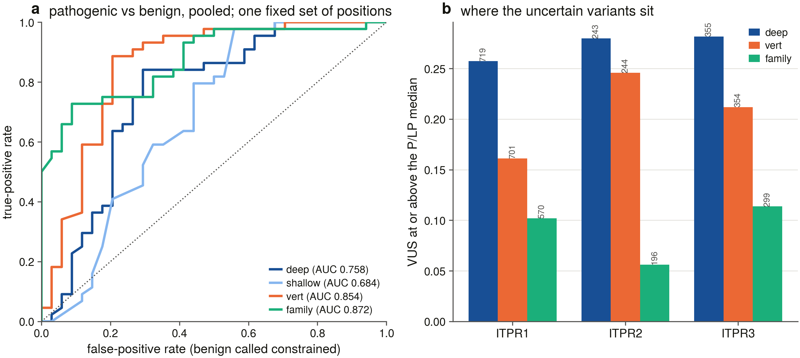

**Figure 11.8.** Four conservation layers as classifiers,
drawn as full curves rather than as a bar of summary scores, because the
layers cross. This figure carries a result that runs against the chapter's
own design, which is why it is drawn as full curves. The family-wide layer
outperforms the deep within-paralogue layer this chapter was built to
produce, and the shallow control is worst, so depth was worth building but
breadth was worth more. Summary scores would have hidden the crossings that
make the ranking readable, and a resource for this family should quote the
layer this panel puts on top.

Two things fall out, and one is against this chapter's own design.

The shallow control is the worst layer, so the depth was worth building,
because without the deep orthologue sets that is the number this thesis
would have had.

But **the best layer is the family-wide one rather than the deep
within-paralogue one.** Taxonomic breadth beats within-gene depth here,
because a position conserved across 500 million years of paralogue divergence
and across the eukaryotes discriminates pathogenic from benign better than a
position merely invariant across 260 vertebrate orthologues of the same gene.
A resource for this family should quote the family-wide layer, and the
instrument this chapter was built around is the second best of four.

**The whole-protein control is why the first column cannot be read alone.**
Every layer also separates pathogenic positions from the average residue, but
by less than it separates them from the benign set, so part of the signal is
benign calls being enriched in unconstrained positions rather than only
pathogenic calls being enriched in constrained ones. Both directions are real
and the control is what distinguishes them.

## 11.14 What a constraint resource can offer an uncertain variant

Eighty-eight per cent of the record is uncertain, and a per-site score is what
a resource of this kind can offer such a variant. Each is placed against the
labelled distributions of the same gene, on thresholds that are those
distributions' own medians, so no cut was chosen to make a count.

**This is a stratification rather than a call.** It says where a variant sits
on an axis the labelled variants separate on, which is a different claim from
pathogenicity, and the per-gene numbers inherit the problem above, in that one
paralogue's pathogenic median is a single position's score.

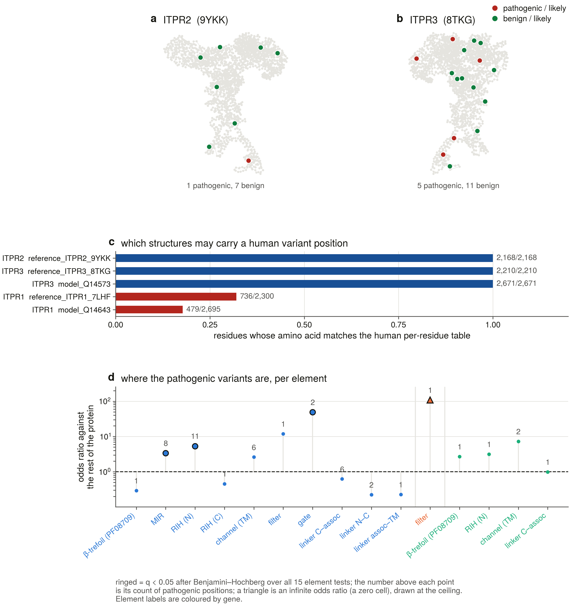

**Figure 11.11.** Every labelled variant with the
per-element enrichment test beside it. An infinite odds ratio is drawn at
the ceiling with a marker rather than allowed off the axes, where a
significant result would simply vanish. The importance of this figure is
that it puts the clinical record on the same coordinates as the constraint
map, which is what a variant resource has to do to be usable. Pathogenic
positions concentrating in the elements the structure says gate and select
is the observation that licenses stratifying the 1,546 uncertain variants at
all. Drawing an infinite odds ratio at the ceiling keeps the strongest
enrichments on the figure, where otherwise they would silently leave it.

The deliverable is one table per human paralogue, giving every residue in its
own numbering, four conservation layers, the occupancy each is conditional on,
its element, and whether it is a measured contact, filter or gate residue.

## 11.15 Per-site selection rates land on the same coordinates

Chapter 10 answered the whole-gene question and not where the constraint sits.
A per-site rate model [94] on the same codon alignments gives that, and
every site is carried onto the human reference through a **validated
transfer**, in which a site whose amino acid disagrees after realignment is
written with no residue rather than with a plausible wrong one.

The gate and the filter come back at a non-synonymous rate of zero with 100 %
of sites called significantly constrained, in every paralogue where the test
has power.

Three cautions are carried forward rather than restated. A per-site ratio is
taken only over sites where the synonymous rate is identifiable, with the
excluded count as a column. The constrained fraction is read at the method's
own significance threshold. And the obvious aggregate, meaning the sum of one
rate over the sum of the other, is not usable here, because Chapter 10
measured synonymous saturation on these alignments and the method duly pins
the synonymous rate at its bound on a share of sites, so the sum is dominated
by sites whose denominator is unidentifiable rather than large.

## 11.16 The constraint map is painted onto the experimental structures

Both layers are written into the B-factor column of every IP₃ receptor
structure in the panel, on one scale read the same way round, so they colour
with one command. Sixteen structures are painted at 98 to 100 % of their
resolved residues.

**Unscored residues are written as −1 rather than 0**, and that distinction is
load-bearing for exactly one region. The luminal loop is both the least
conserved element in the receptor and the one the maps resolve worst, and on a
coloured structure those two must not look the same. A chain that maps less
than half of itself to its paralogue is refused rather than painted with
somebody else's profile.

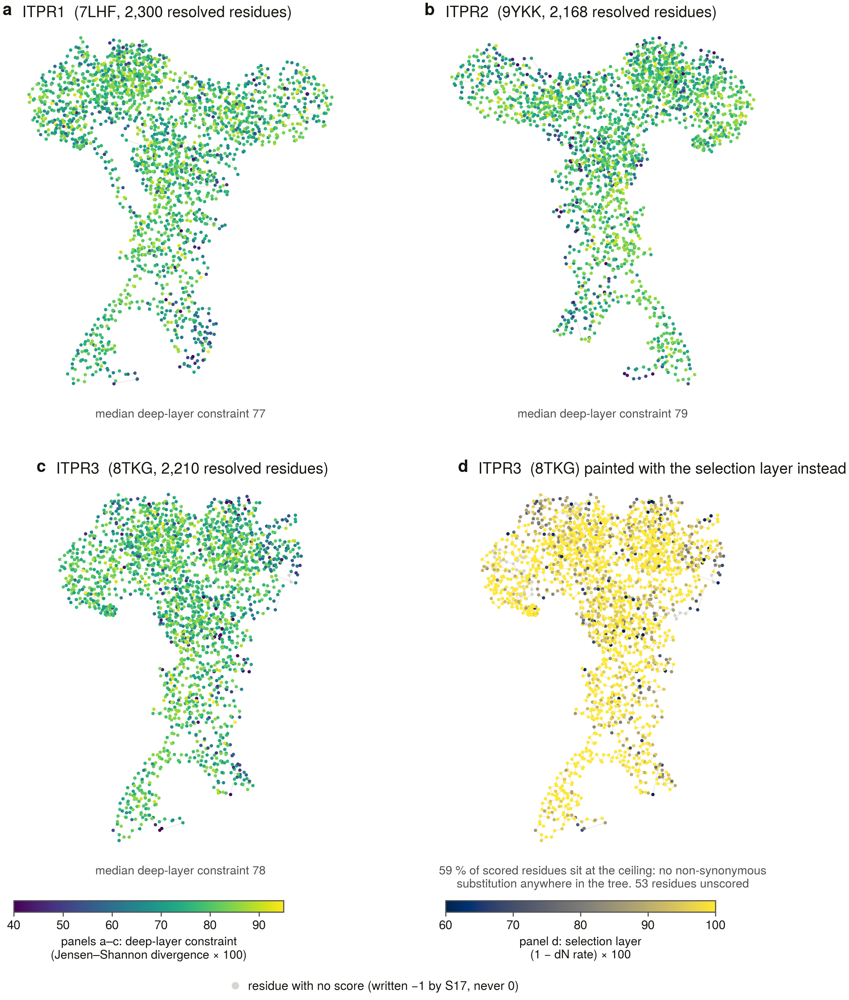

**Figure 11.10.** The constraint map painted onto the
channel, drawn from the file the painting step wrote and coloured from its
own B-factor column, so a disagreement with the per-residue tables would be
a bug in the painting step. Writing the layer into a structure's own
coordinate column is what makes the chapter's numerical claims checkable by
a third party in any viewer. Unscored residues are grey rather than at the
low end of the scale, which keeps missing data from reading as an absence of
constraint, and that matters most in the luminal loop, where the two
coincide.

**The panel is carried by experimental structures rather than predicted ones.**
The human ITPR2 prediction is the 181-residue isoform of §11.2 and has no file
to paint, so that paralogue's constraint is shown on a cryo-electron
microscopy entry. A structural resource for this family cannot be built out of
the prediction database.

One further check has to be recorded because it fails on half its candidates.
A structure may carry a human variant position only if every residue it shares
with the human table carries the same amino acid, and two of four candidates
fail, comprising a rat reference and an isoform model. One paralogue's 55
pathogenic positions are therefore not placed on a structure at all, which is
a limit stated rather than worked around.

## 11.17 What this chapter settles about the channel

The gate and the selectivity filter are the least changeable elements of the
receptor, on two metrics, in all three paralogues, and the gate is identical
between all three. The measured IP₃ contacts are more constrained than the
rest of the domains carrying them, and those domains are MIR and RIH rather
than the Pfam signature named after the ligand. The pore module is more
constrained than the linkers once the fifty residues of luminal loop are
separated from it, and that loop is the most variable sequence in the
receptor.

Conservation is a usable variant classifier for this family, at a
discrimination the shallow control does not reach, and the layer that works
best is not the one this chapter was built to produce.

Fourteen constructed negative controls run before anything is written, and one
of them found a real bug on its first run: the within-protein control was
being selected by a prefix test that swept 225 residues of the N-terminal
β-trefoil, which is the element the ligand question is about, into the control
set. The suite was mutation-tested on four deliberate rule breakages and
caught all four.

What it does not settle is what the ligand site is for evolutionarily, which
is the next chapter.

---

# 12. The ligand site, which is the one part the ryanodine receptors do not share

## 12.1 One functional asymmetry makes three questions askable

Every chapter so far has had to separate two families that share a fold, a
pore, four domains and half their titles. There is one thing they do not
share: the ryanodine receptors do not bind IP₃, and their gating is organised
around a different set of ligands entirely [95].

That makes the ligand site the single place where a functional difference
between the families is visible in sequence, and it makes three questions
askable that are not askable anywhere else. Is the IP₃-binding core under
different constraint from the pore? Do the ten residues that touch the ligand
behave differently from the rest of the site? And in lineages that have lost
the enzyme that makes IP₃, does the receptor's binding site relax?

The answers are, in order: yes and in the opposite direction to the
expectation; no, and the reason is informative; and no, with the null bounded.

## 12.2 Neither module can be defined from Pfam, so both are defined by measurement

Neither module is a Pfam domain, and that is the whole reason this stage
exists.

Pfam calls the ligand core *MIR* and *RIH_N* and knows nothing about the
ligand, because Chapter 11 established that none of the ten measured contacts
lies in the signature named after IP₃. And Pfam's pore domain contains fifty
residues of luminal loop that Chapter 11 measured as the least conserved
sequence in the receptor.

So the **primary ligand core** is defined as the minimal contiguous span
containing every measured IP₃ contact, and the **primary pore module** as the
Pfam pore domain less the luminal loop. A sensitivity definition is committed
beside each and every test is run under all four combinations, using the
published binding core [96] transferred through the same routine, and the
pore domain as the database draws it.

Every definition is checked against something it does not contain. The core
must hold all ten contacts and no pore site, and the pore both filter residues
and both gate residues and no contact. A failure raises rather than being
written.

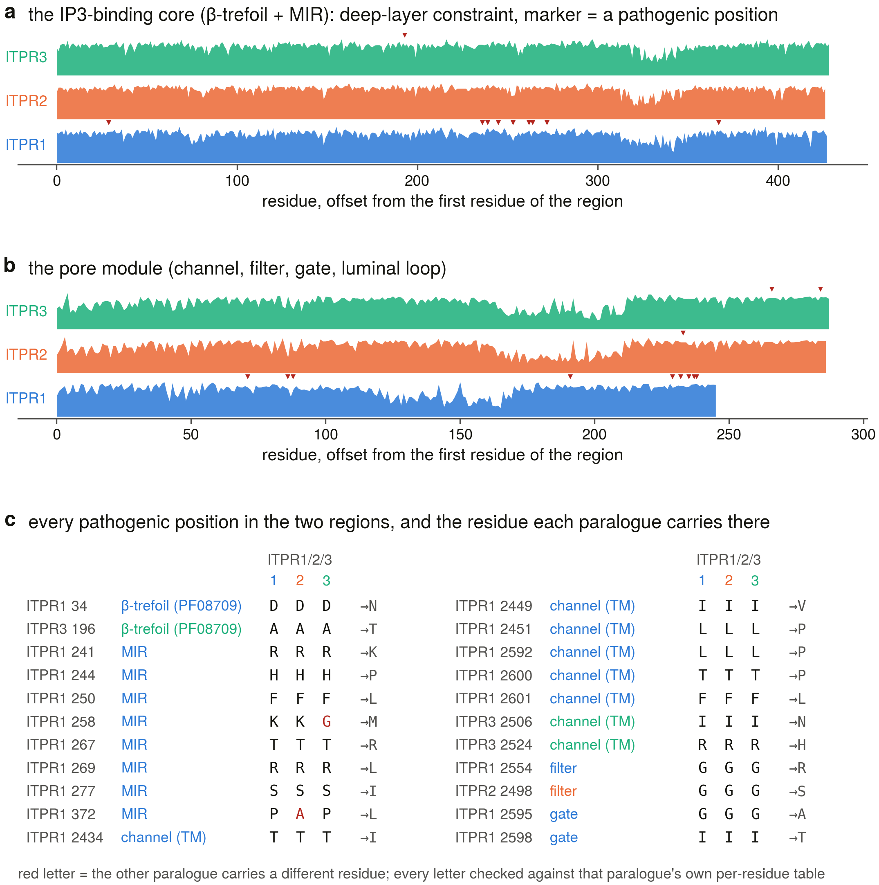

**Figure 12.5.** The two modules at residue resolution
across all three paralogues, with every pathogenic position's residue
printed. Printing the residues converts the chapter's module definitions
from an assertion into something a reader can audit position by position,
which matters because both modules are defined here by measurement rather
than taken from a domain database. Every letter has been through the join
guard described in Chapter 14: each variant's reference amino acid must be
the residue its own paralogue's per-residue table holds there, and each
aligned partner the residue the other paralogue's table holds.

## 12.3 The site is measured as a distance to the ligand, not as a contact label

A binary contact-or-not label discards the one thing a structure can say that
an alignment cannot. So every residue within 15 Å of the bound ligand was
measured, all-atom, in **six independent depositions**, comprising the
structure used throughout this thesis [1] and five further IP₃-bound entries
from other groups and other gating states [97,98,99].

The reader is deliberately small and all-atom. Chapter 11's structural reader
is backbone-only, and a backbone trace puts an arginine 8 Å from a phosphate
its side chain is hydrogen-bonded to.

**The ten contacts are the positive control and a hard failure**: the reader
must recover all ten in the reference structure or the stage raises. A residue
past the search radius is absent from the table rather than pooled into an
open bin, which would be a population defined by the geometry of the search.

## 12.4 The comparison is paired inside one protein, which controls the taxon sampling

The two modules sit in the same protein, so every comparison uses **one core
number and one pore number per orthologue**, and a difference between them
cannot be a difference in taxon sampling.

A tip must resolve half of **both** modules to enter, and the dropped ones
name the module that lost them, without which an N-terminally truncated gene
model enters as an extreme ligand-core divergence.

Forty-four constructed negative controls run before anything is written, split
across two suites with one entry point so the driver cannot run half of them,
and the suite was mutation-tested on ten deliberate rule breakages, all ten
caught. Four of this chapter's rules return a number that looks better when
they are wrong. A core drawn without checking it holds the contacts still
gives a clean p-value. A paired test admitting a tip that covers the pore and
not the core reports a truncated gene model as ligand-core divergence. A
permutation that resamples the whole module instead of the label answers a
different question significantly. And a panel filing "no reference proteome"
as "no enzyme" manufactures its own test set.

## 12.5 The pore is more conserved than the ligand core, which is not what was expected

**The pore module is more conserved than the ligand core rather than less.**

Paired per orthologue inside each paralogue's own alignment, across roughly
250 orthologues each, ITPR1 puts the pore ahead by 0.024 identity units with
the tips running seven to one, ITPR3 by 0.020 with the tips running five to
one, and ITPR2 shows no difference at all.

The module that gives this family its name and its defining signature is the
less constrained of the two across a vertebrate orthologue set.

## 12.6 The core-against-pore answer reverses on one boundary nobody has had to state

**All three paralogues flip sign** when the luminal loop is left inside the
pore module, which is how the domain database draws it and therefore how the
comparison would be made by default.

Include the loop and the ligand core wins by about five identity points at
overwhelming significance in all three paralogues. Exclude it and the pore
wins in two and ties in the third.

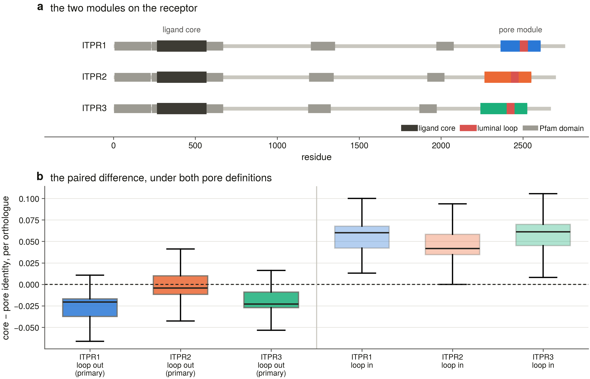

**Figure 12.1.** The core against the pore under both pore definitions
on one axis with zero marked. This is the chapter's central result and its
principal caveat in one panel: the pore is more conserved than the ligand
core, which is the opposite of what a ligand-gated channel invites one to
expect, and the comparison reverses in all three paralogues when fifty
residues of luminal loop are left inside the pore. Drawing both definitions
shows what the boundary choice costs instead of asserting it in a methods
sentence.

Neither answer is wrong about its own module. They are answers about different
modules, and the difference between them is one boundary that a comparison
drawn on database spans would never have to declare. **Any version of this
comparison that does not state the boundary is not interpretable.**

**A second disagreement is reported rather than dropped.** At column level the
divergence metric sees no difference between the modules while the
per-orthologue identity does. That is not a contradiction, because the
divergence metric is measured against a background amino-acid table [93], so
a transmembrane module scores lower than a soluble one at equal
conservation.
The composition-free column metric agrees with the paired test. The null
result is a property of the metric, and it is printed here because a reader
coming from Chapter 11's tables would otherwise find two of this project's own
numbers pointing different ways with no explanation.

## 12.7 What selection holds at the ligand site is a pocket, not a contact set

**The ten residues that touch IP₃ are more constrained than the rest of the
binding core, and not more constrained than the rest of the pocket.**

Against the core the contacts win in all three paralogues. Against every other
residue the structure places within 15 Å of the ligand they win in none.

The permutation resamples **which positions carry the contact label**, keeping
the constraint values where they are, because the hypothesis is about these
particular residues.

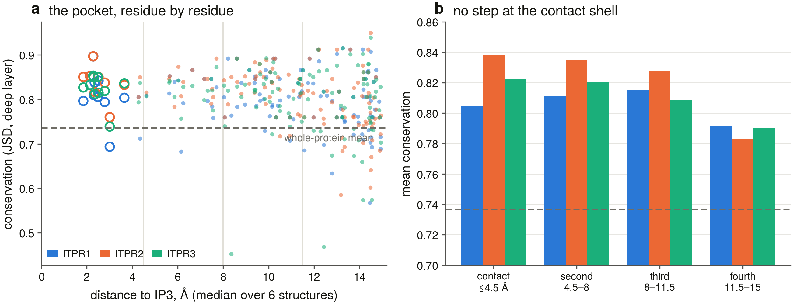

**Figure 12.2.** Constraint against distance from the ligand, drawn as
a scatter rather than as a bar of shells, because the claim is the absence
of a step at the contact radius and four bars cannot show an absence. The
importance of this figure is the absence it shows. If the constrained unit
were the contact set, constraint would step down beyond the contact radius,
and it does not: it declines smoothly across the pocket. That is what moves
the claim from ten residues that touch the ligand to a pocket about 15 Å
across, and it is a claim only a continuous distance axis can support.

Every shell out to 15 Å sits above the whole-protein mean, and the step a
contact-driven model predicts at the contact radius is not there. The gradient
across the neighbourhood is real and shallow, and reaches significance in one
paralogue.

**The result replicates on an independent axis.** Every contact site in every
paralogue is under detectable purifying selection by the per-site rate model
[87],
and the share of significantly constrained sites falls with distance from the
ligand. It is not monotone, because the outermost shell sits a little above
the third, so what the data show is a step down from the ligand's first two
shells onto a floor rather than a gradient running all the way out, and it is
reported as such rather than as a gradient.

Two instruments, two alignments and two different statistics give the same
pocket.

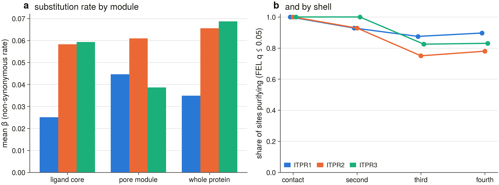

**Figure 12.3.** Per-site rates by module and by shell. The importance
of this figure is that it asks the same question with a different quantity.
A column's dispersion across orthologues and a site's substitution rate on a
tree are both called constraint and are not the same measurement, so a
result that appears on one axis and not the other is bounded rather than
confirmed. The contact result replicates here and the module comparison does
not, and the figure is where that distinction is visible.

**The module comparison does not replicate on the rate axis, and in one
paralogue it points the other way.** Both are computed correctly and they are
not the same measurement, in that one uses 250 sweep orthologues of one
paralogue and the other 57 vertebrate tips, and one is a column's dispersion
and the other a rate on a tree. But a reader should have the disagreement in
front of them rather than only the half that agrees. With a rate that is
exactly zero at most sites and a quarter of the sequences, this is the
underpowered version of the same comparison, and the module result is read off
the identity axis.

## 12.8 The upstream enzyme repertoire was measured rather than assumed

The third question needs a list of lineages whose IP₃-producing pathway is
reduced or absent. A list taken from reading would be an assumption dressed as
a scope, so it is derived from the same reference proteomes the family was
swept over.

**What counts as a phosphoinositide-specific phospholipase C** is a protein
carrying both halves of the catalytic barrel in one sequence. Either half
alone is not one, because one of them in particular turns up in unrelated
proteins and counting it would report a pathway where there is none. Both
halves are counted separately, so a proteome scoring one and not the other is
visible as such.

**The vertebrate group is swept as the positive control for the search**, and
760 of 763 vertebrate reference proteomes carry the enzyme. A vertebrate
proteome scoring zero would be an instrument failure rather than a result.

**Sixty-four proteomes in the whole sweep carry an IP₃ receptor and no
phosphoinositide-specific phospholipase C.** They are not scattered: they are
the oomycetes, the early-diverging fungi, three *Perkinsus* species, two
ciliates, four prasinophyte algae and a group of flatworms, with two clades
accounting for more than half.

**The internal control for that list costs nothing and is strong.** Every one
of those proteomes carries a full-length IP₃ receptor, meaning a
2,700-residue multi-exon gene the sweep found in it. A gene set complete
enough to hold this receptor is complete enough to hold a phospholipase C.

A separate stratum records proteomes with no reference set at all, because
filing "we could not look" as "there is none" would manufacture the test set
out of missing data.

## 12.9 The pooled lineage comparison is a clade artefact

Asked of the representative alignment, the test has two tips on one side. That
alignment was built to span four kingdoms with 134 sequences, and these taxa
are not the taxa a diversity rule picks.

**The positive control fires there.** The ryanodine receptors, which have the
same pore, the same diagnostic domains and no IP₃ site, move the paired
difference by about a tenth of an identity unit on six tips.

So the test is repeated on the whole population the question is asked of,
meaning all 662 non-vertebrate reference proteomes carrying a receptor, each
aligned to the human reference through the same module residues, of which 486
resolve both modules and enter.

**Pooled, the enzyme-absent records have a wider gap, and that number should
not be believed.** The covariate table says why: enzyme-absent proteomes sit
at a median pore identity of 0.358 against 0.589 for the rest. They are
oomycetes and early-diverging fungi, far further from the human reference than
the arthropods and nematodes that dominate the other cell, and the paired
difference is itself correlated with divergence. A pooled comparison of absent
against present is largely a comparison of distant against near.

Inside a phylum, only three strata have both cells populated at all. And the
one that cannot be tested is the most informative: **every early-diverging
fungal proteome in this set that carries a receptor lacks the enzyme**, so the
phylum has no internal control.

## 12.10 Matched on divergence the effect disappears, and the null is bounded

Each enzyme-absent record is matched to up to three enzyme-present records
within a stated distance of its own pore identity and scored against their
median. That is the identity-matched paired design of Chapter 9 applied to the
same kind of claim, and it removes the confound rather than arguing with it.

All 36 matched. **The median within-pair difference is −0.0064, with a
confidence interval from −0.0161 to 0.0152, the tips splitting 19 to 17, and
p = 0.87.**

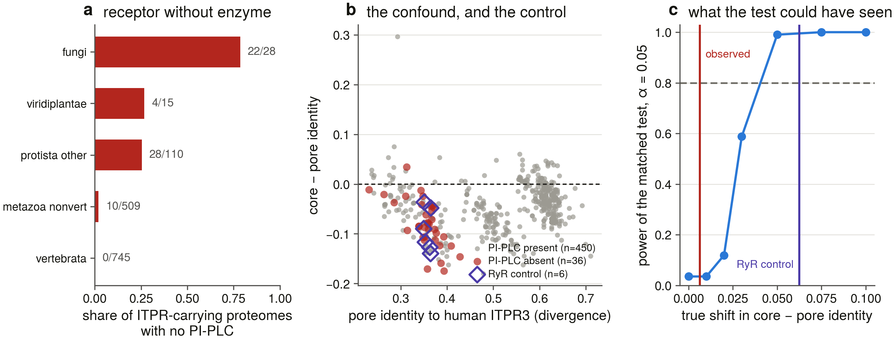

**Figure 12.4.** The lineage strata with the power curve beside them,
which is what makes a negative result readable. Lineages that lost the
enzyme making the ligand show no relaxation at the binding site, and without
a bound on what the comparison could have detected that would be an
untestable statement. The ryanodine receptors are the positive control,
because they carry the same pore and no ligand site, so the shift the design
can see is measured rather than assumed. The ligand core is drawn in a
neutral dark rather than a hue, because the palette reserves its accent
colour for that control.

**The null is bounded rather than empty.** Measured through the same pairwise
instrument at the same divergence as the test group, the ryanodine receptors'
paired difference is a shift of −0.062. The matched test has essentially full
power at that shift and 59 % at half of it, and its confidence interval
excludes anything larger than about 0.016.

**Losing the enzyme that makes IP₃ does not relax the receptor's IP₃-binding
core.** This is not a case of being unable to tell. The test can see a
ligand-free core when there is one, at the same evolutionary distance, and it
does not see one here.

## 12.11 What this chapter settles, and what it does not

**The ligand core is not the most constrained part of this receptor.** Paired
per orthologue against roughly 250 sequences per paralogue, the pore module is
ahead in two and level in the third, and that answer depends on one boundary
and reverses when fifty residues of luminal loop are counted as pore.

**The constrained unit at the ligand site is a pocket about 15 Å across rather
than a contact set.** The ten measured contacts beat the rest of the core and
do not beat the rest of the pocket, and the same shape appears on the rate
axis.

**Losing the upstream enzyme does not relax the site**, with the null bounded
by a positive control measured on the same instrument.

**What is not settled** is whether the pocket's constraint is about IP₃ at
all, because everything within 15 Å of the ligand is also within the fold that
holds it, and no measurement here separates ligand binding from domain
packing. A mutational or binding dataset would, and sequence will not. Nor is
it settled what these lineages' receptors are gated by, because a search for
one enzyme family says the canonical route to IP₃ is missing rather than that
the receptor has no ligand, and the bounded null is consistent with the site
being held by something else.

There is one prior this chapter does not corroborate, and it is worth stating
plainly. The signature that names the family is the IP₃-binding core, and it
is the one diagnostic domain the ryanodine receptors do not carry
functionally. It is also the less constrained of the two modules measured
here. **Naming a family after its diagnostic domain is a statement about what
the domain identifies rather than about what selection holds most tightly**,
and this is the first measurement in the project to ask the second question.

---

# 13. An archive that cannot find the gene

## 13.1 Three quarters of these genes are unreachable from any protein database

Chapter 4 measured that **940 of 1,232 demonstrated genes, or 76.3 %, are not
reachable by any protein-database search.** They are not hard to find, because
no protein record of them exists.

That is a statement about databases rather than about biology, and it is
easily the most immediately useful result in the thesis. Automated annotation
is known to be imperfect, and the ways in which it fails have been reviewed
[77]; what has not been available for this family is a measurement of how
often and in which direction. It is also a claim
that has to be made carefully, because there are three quite different ways a
gene can be missing from a public record, and they have different remedies.

The gene may not be annotated at all. It may be annotated and split across
several models, none of which delivers the protein. Or it may be annotated
perfectly, named perfectly, and filed as something that emits no protein.

All three happen. This chapter measures how often, audits whether it is worse
for this family than for its sister, validates two cases down to the exon,
confirms with reads that the lost genes are transcribed, and produces a
correction list addressed to somebody else.

## 13.2 Three rules decide whether the audit is measuring anything

Every gene-scale locus in the 309-genome scope is scored into one of five
states, comprising complete, split, fragmentary, non-coding only and
unannotated, against each assembly's own submitted gene set [33], under
three rules that decide whether the audit is measuring anything.

**Only same-strand features count**, because an antisense gene overlapping the
locus perfectly is not an annotation of it.

**Loci are scored against coding blocks rather than gene spans**, because a
gene span covers its own introns and these genes' introns reach 152 kb, so a
passenger gene inside one would score as covering the locus.

**The name is read off whichever model the annotation actually places there**,
deliberately generously, because accusing a database of failing to name a gene
it did name is the expensive error.

The name verdict itself has two values that exist because their absence
manufactured errors. A name that claims neither family, and a name that claims
the family but no paralogue, are recorded as such rather than as wrong.
Without those two values the audit produced 66 wrong-family and 6,660
wrong-paralogue errors out of names that claim neither.

**The bar for "complete" is validated rather than re-derived.** The audit
inherits the sweep's coverage threshold and scores it against the distribution
it sits in, and every state is re-counted across the whole bar range so the
reader can see what the choice costs.

Forty-four constructed negative controls run before anything is written, and
the suite was mutation-tested on nine deliberate rule breakages, all nine
caught. The measurement is cached and the verdicts are not, because the first
version cached both and a later rule change survived into a committed table.

## 13.3 A quarter of annotated loci are not delivered as one complete model

Of the 932 loci in assemblies that ship a gene set, **73.9 % are delivered as
one complete annotated model and 26.1 % are not.** Thirty-eight have no
same-strand annotated feature at all, and 42 are held only by a non-coding
one, so the database serves no protein for either.

**The single largest determinant is not the paralogue but the assembly.**
Above the contiguity bar the failure rate falls from 26.1 % to **6.7 %**, so
two thirds of what looks like an annotation problem is a contig too short to
hold a 2,700-residue gene.

By class the spread is wide. Cartilaginous fish and mammals are
near-perfect, ray-finned fish good, and **birds are complete at 56 % with 29 %
fragmentary**, which is the same class the contiguity bar removes two thirds
of.

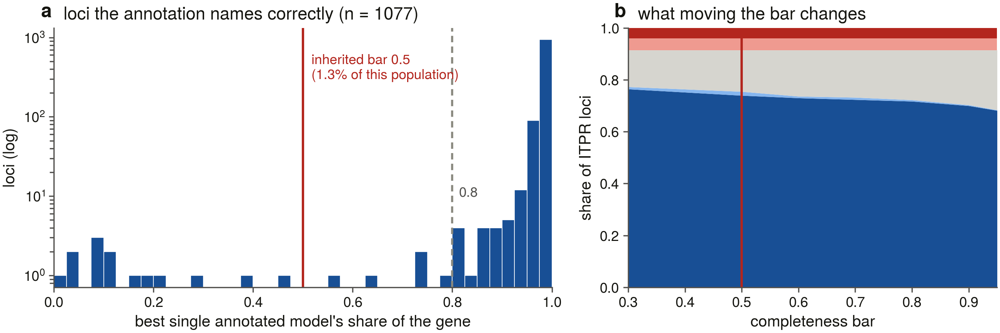

**Figure 13.2.** The completeness bar drawn inside the
distribution it sits in, because a number in a legend cannot show a tail.
The importance of drawing the bar inside its own distribution is that the
whole audit turns on it. Every locus in this chapter is called complete or
not against one coverage threshold, and a threshold quoted as a number in a
sentence cannot show whether it sits in a gap or in the middle of a
population. The bar was validated rather than replaced here, and this panel
is the evidence for that decision.

## 13.4 Curated and submitter-deposited gene sets differ, and only partly because of assembly quality

A curated reference gene set and a submitter-deposited one are not comparable
evidence, and they are not close.

**98.8 % of loci in curated annotations are complete, against 37.5 % in
submitter-deposited ones.**

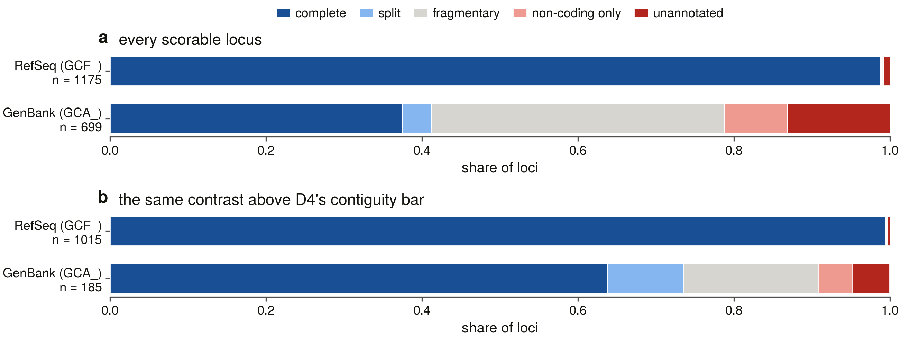

**Figure 13.1.** Locus state by annotation source, raw and above the
contiguity bar. The control is drawn beside the raw contrast rather than
instead of it, because that is what separates a database effect from an
assembly effect. Curated and submitter-deposited gene sets are not applied
to the same assemblies, so a difference between them partly measures which
genomes each was run on, and the two bars together show how much of the gap
survives the control.

The confounder is obvious and is controlled rather than argued. Submitter
assemblies are less contiguous, and a locus on a contig too short to hold the
gene cannot be annotated completely by anybody. Re-run over the loci that
clear the bar, the contrast **narrows and does not close**, at 99.4 % against
63.8 %. About 42 % of the gap between the two archives is assembly quality and
the rest is the gene set.

## 13.5 The family is not recorded worse than its sister family

The audit's premise was that a 2,700-residue, 58-exon gene with a sister
family sharing every diagnostic domain should be badly recorded.

**The control says otherwise, and that is the result.** The IP₃ receptor cells
fail on 26.1 % of loci, and the ryanodine receptors, in the same assemblies
through the same pipelines, on 22.1 %. Above the contiguity bar the two are
6.7 % and 5.5 %. **No overall difference survives correction. How this family
is recorded is how vertebrate genes of this size are recorded.**

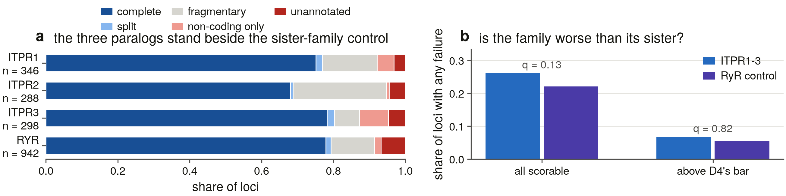

**Figure 13.3.** This family against its sister in the same
assemblies. Without this comparison, a failure rate is not a statement about
this family at all. This figure carries the result that overturns the
chapter's own premise. The audit was built expecting a large, many-exon gene
with a confusable sister family to be recorded badly, and the sister family
in the same assemblies through the same pipelines fails at a comparable
rate. Without a control of this kind, a quarter of loci not delivered as one
model reads as an indictment of this family; with it, it reads as the
failure rate for vertebrate genes of this size.

**One state does separate, and it is the family-specific one.** An IP₃
receptor locus is 2.7 times more likely than a ryanodine locus to be held only
by a non-coding feature, in 42 loci against 16. That is a gene the annotation
identifies correctly, names correctly, and files as non-coding, so no protein
record is ever created and no name-based search can reach it.

**It does not survive the contiguity control.** Above the bar the same
comparison is 4 against 5, so the effect is confined to assemblies too broken
to carry the gene, which is where a submitter has most reason to file a model
as non-coding in the first place. The excess is real in the record set, and
this measurement cannot say it is a fact about the family rather than about
the assemblies its loci happen to sit in.

## 13.6 Half the protein records carry no usable gene symbol

Each of the 11,402 full-length family protein records held by the protein
databases [31] was scored against the committed bait panel, assigned to a
family only on a stated margin, then to a paralogue inside the winning
family, with the record's own gene symbol and protein name read through the
same verdict rule the genome half uses.

**The family call is not in dispute.** The sequence disagrees with the census
call on 4 of 11,402 records, and the databases name the sister family at only
5, every one a non-vertebrate record where the sequence barely separates the
families either. The hazard measured at 49 % of records in one query in
Chapter 2 does not appear as a naming error in the full-length record set.

**The paralogue call is not in dispute either.** Fifty-two of 8,306 vertebrate
records carry a symbol naming a paralogue the panel assigns elsewhere, and a
further 74 claim a paralogue **this panel cannot call**, because the bait
table records no bait for it, so those are reported as outside the
instrument's reach rather than as errors. Without that guard they would have
been 74 database naming errors manufactured by a missing bait.

**What is in dispute is whether the records are findable.** 3,872 records
carry a placeholder gene symbol and 2,395 carry none at all, so **55.0 % of
the family's full-length protein records have no usable gene symbol.** On the
protein-name side, 66 are named for the superfamily in a way that names the
family and its sister together and therefore separates neither.

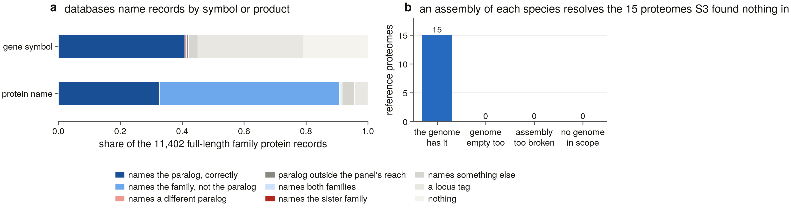

**Figure 13.4.** The protein records, showing what the name
claims against what the sequence is. The importance of separating what a
name claims from what a sequence is is that the two failure modes have
different remedies. The family and paralogue calls turn out not to be in
dispute, so this is not a record full of misidentified proteins; more than
half of it simply carries no usable gene symbol. A record that is correct
and unfindable needs a name, not a reannotation, and that distinction is
what the panel makes visible.

**Would a signature query have found them?** The signature that names this
family reaches 95.6 % of the records both instruments agree on and 81.2 % of
those only one instrument found. It is a good but not complete index of its
own family, and the deficit is concentrated outside the vertebrates, falling
to 64 % in the amoebozoa and the stramenopiles.

## 13.7 All fifteen empty proteomes are gene-caller failures

Chapter 3 swept 763 vertebrate reference proteomes and 15 returned no family
hit at all. On its own that is uninterpretable, because a receptor-shaped hole
in a proteome is either a gene the species lacks or a gene its gene caller did
not find.

Each was resolved against an assembly of its own species, searched with an
instrument that owes the gene caller nothing.

**All 15 are gene-caller failures.** Every one of the 15 species has a genome
in scope, and in every one the genomic sweep recovers at least one locus at
over half the bait's length while the proteome holds none.

The verdict vocabulary carries a fourth value that fires on none of them, and
that is the point of having it: a species with no assembly in scope would be
recorded as undecidable rather than as an absence. Being able to say it fires
on none is worth more than assuming it would.

---

## 13.8 Two annotation failures were validated down to the exon

An audit that counts states is a survey. Proving that a particular annotation
is wrong about a particular gene needs molecular evidence, and this section
takes two cases down to the exon.

**Which two cases, and why those.** The measurement is annotation loss,
meaning the share of a recovered gene's coding footprint that no single
annotated model delivers, read straight off the sweep's own coverage rather
than re-derived. Five eligibility rules apply, each a positive test, and the
fifth is the one that does the work: at least ten annotated protein-coding
genes elsewhere in the same genome must be longer than the locus.

Without it, the top of the ranking is loci in assemblies with a genome-wide
gene-length ceiling, and validating one would report a property of the whole
gene set as a bug at this gene. Measured over the sweep it removes six loci in
two genomes, one whose longest annotated gene anywhere is 42 kb and one whose
longest is 138 kb against a 726 kb locus, and nothing else.

Three failure modes are labelled and **two are selectable, one case each**,
because taking the top two of a single ranking gives two omissions and leaves
the fragmentation claim unvalidated. Ties are broken on **control strength**,
meaning how many other family loci in the same genome the annotation gets
right.

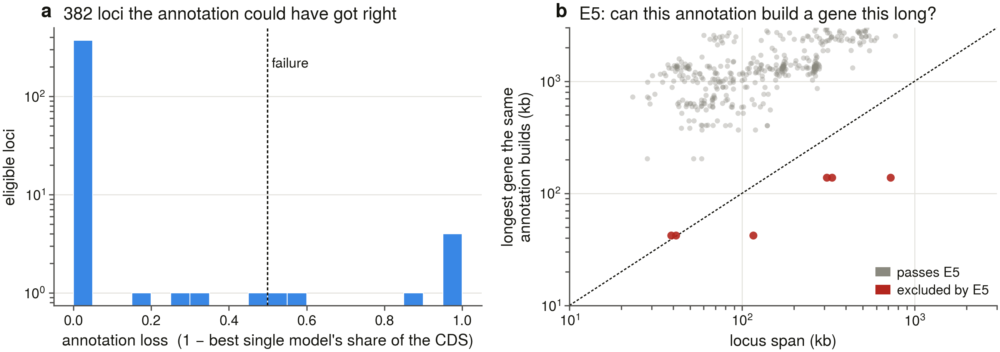

**Figure 13.6.** Annotation loss across every recovered locus: 880
loci, 382 eligible, and 360 of them at zero loss. The full distribution is
drawn because it is the denominator the two validated cases are chosen from,
and a case study without its denominator is an anecdote. The failures are a
tail rather than a norm, so the two cases taken forward are the extreme of a
measured distribution rather than the two examples that happened to be
noticed.

**Case A is an omission.** It is a 52.5 kb locus in a chromosome-level fish
assembly whose contigs are 84 times the length of the gene. The gene has 56
coding exons totalling 8,021 bp, and **the annotation places zero gene models
over them.** Not a partial model and not a mis-named one: the annotation has
nothing there, while working on both sides of the gap, with named genes 4.2 kb
downstream and 5.5 kb upstream.

**Case B is a fragmentation.** It is a 68 kb locus in another chromosome-level
fish assembly, with 60 coding exons totalling 8,064 bp, over which the
annotation places **three gene models** contributing 38 disjoint coding blocks
and covering 58 % of the coding footprint. 3,400 bp in 28 blocks has no coding
model at all and reaches no protein.

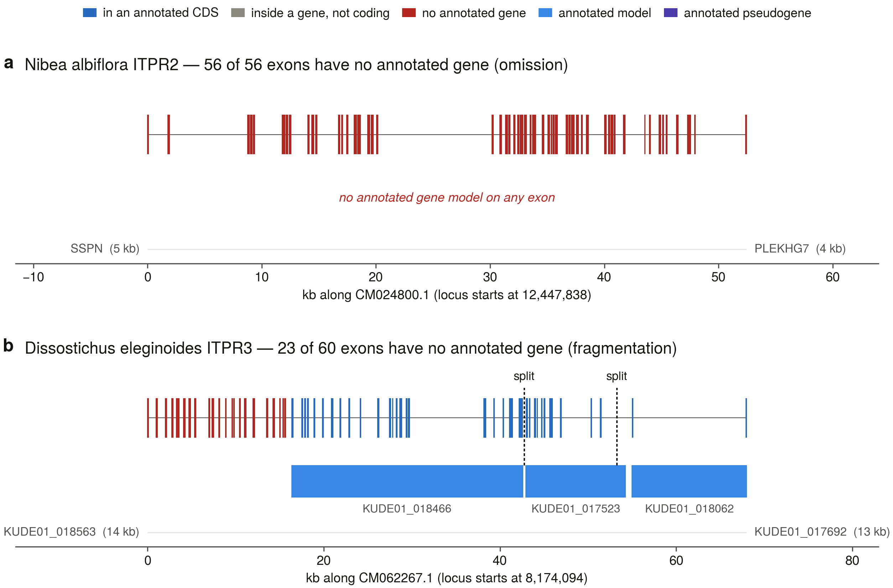

**Figure 13.5.** The two loci at true genomic width, with exons never
widened to be visible. A 56-exon gene over 52 kb averages 143 bp an exon, so
fattening the exons would draw a gene whose coding fraction looks like 40 %
when it is 15 %. That geometry is the point: what the annotation missed is a
few per cent of the locus distributed over dozens of small exons across tens
of kilobases, which is why the gene is hard to annotate and why the failure
is systematic rather than careless.

## 13.9 What the DNA says at those two loci, and five checks on it

**Case A's locus splices into 2,673 codons with zero internal stops** and a
terminal stop present. Under neutral drift to its observed divergence, 14.2
stops would be expected, computed from the locus's own codon usage. **Case B
gives 2,687 codons, zero internal stops, and 11.4 expected.**

That comparison is the right shape for the claim being made. The annotation's
implicit assertion, that this is not a protein-coding gene, is falsifiable,
and zero nonsense codons over 2,700 falsifies it. The rule is deliberately
one-sided: zero stops falsifies a pseudogene call, and a handful would not
establish one.

Five independent checks follow, and they are stated in the order a reader
needs them rather than in the order that flatters the conclusion.

**Splice sites.** Every intron in both loci carries a canonical splice pair.
An alignment is not a gene, and an exon structure whose introns are spliceable
is evidence that this one is.

**Exon boundaries against other genomes' annotations.** Thirty-five and 40
swept genomes carry the same paralogue, aligned from the same bait, with their
own annotation independently placing one model over the whole alignment.
94.5 % and 100 % of each locus's internal boundaries are shared by a majority
of them. This validates the instrument at this gene rather than the individual
locus, which is why it is reported alongside the reading frame and the splice
sites rather than instead of them.

**Transcript evidence at the junction was searched for, and the denominator
is the result.** Probes across every junction the annotation does not model
were searched against every transcript record for the species, and returned
nothing. The species has 10 transcript records in total. A search of that
many returning nothing has not shown the gene is untranscribed. It has shown
the species has almost no deposits.

**That criterion has its own negative control**, and it needed a second half.
Run against the locus's own genomic DNA, where a probe of contiguous spliced
sequence cannot span its junction by construction, the probes make 50 hits and
none spans. So the zero above is a discriminating zero rather than a test that
never fires. On its first run that control returned six false spans, which is
how the rule acquired its second half: an anchor requirement alone admits an
alignment that has run a dozen bases past the junction into the intron.

**The rest of the family in the same genome is intact.** Every other family
locus in both assemblies also splices into an uninterrupted reading frame.
Whatever the annotation is doing here, it is not responding to a damaged
gene.

**The neighbourhood check is available for one case and not the other.**
Case A's missing gene sits between the two neighbours its paralogue carries
in 197 and 183 of 215 swept vertebrates. For Case B the
check is not available at all, because that annotation names its genes by
locus tag and there is nothing to match, and that is reported as a limitation
of the comparison rather than as a negative result.

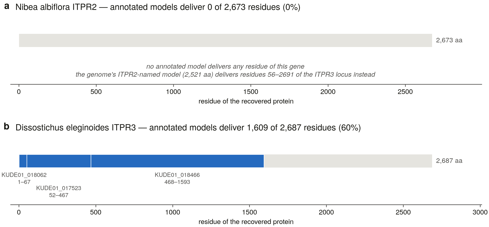

**Figure 13.7.** The annotated proteins tiled back onto the
genome's own recovered loci, which is what says whether the annotation
missed a gene or broke it into pieces. The proteins are translated from the
assembly's own annotation and genome rather than downloaded, because a locus
filed as a pseudogene emits no protein record and those loci are exactly the
ones under dispute. The guard that matters is that the subject set is the
genome's own loci: a query whose own locus is missing from it lands on its
nearest paralogue instead, and the row then reads as a confident naming
disagreement, which is exactly what happened before the check existed.

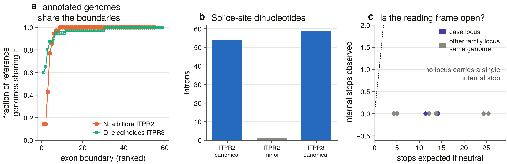

**Figure 13.8.** The five checks on each case, together. The
importance of showing the five checks together is that no single one of them
is decisive. Splice dinucleotides, an intact reading frame, junction probes,
exon-boundary concordance and the neighbourhood consensus each fail in
different circumstances, and they do not fail together. A reader asking
whether a recovered gene is an alignment artefact is asking whether every
one of these could be wrong at once, which is what this panel is arranged to
answer.

**One number frames both cases.** One of the two assemblies files 7,380 of its
23,345 genes as pseudogenes, which is 31.6 % of the gene set. Its 14
family-named gene models include 8 filed as pseudogenes and 6 emitting a
protein.

## 13.10 Reads show that all seven lost genes are transcribed and spliced

The junction question the case studies could not answer needs reads rather
than deposits, and this is where it is answered.

**The scope is derived from the ranking rather than chosen.** Four rules, each
a positive test, apply. Every locus the eligibility rules admit whose
annotation loss clears a floor is included, read straight off the committed
ranking rather than re-derived. The species must have enough public runs,
which is a floor on askability rather than on power. And every other family
locus in the same genome joins as an internal control, including the ryanodine
locus, whose reads must land on the ryanodine gene.

A control locus carries the loss measured for it or none at all, in that the
field is empty rather than zero, because a locus never ranked and a locus
measured at zero loss must not share a cell.

Reads come from the public sequence archive [100] and are mapped with a
splice-aware aligner [101], run in unspliced mode for the reason given below.

**The reference every read is mapped against is built rather than
downloaded.** It is the spliced genomic coding sequence, deliberately not the
frameshift-corrected version, because correcting a frameshift inserts one or
two bases that every read crossing it would carry as an indel, costing reads
at exactly the difficult sites.

Validation is **colinear block placement**, which has no tuned threshold. Each
block is translated in its own phase and searched verbatim in the aligner's
own protein from the previous block's match onwards, and a block may fail to
place only if the model's own frameshift count explains it. The identity test
it replaced was the wrong instrument, and measuring it showed why: a correct
reference scores 1.00 with no frameshifts and 0.92 with nine.

Three housekeeping anchors are aligned **by the same aligner and spliced by
the same module as the targets** rather than pulled from each annotation,
because two of the three annotations name no genes at all, one filing all
29,240 of its models as hypothetical proteins. Building anchor and target
alike means a difference between them cannot be a difference in construction.
The anchor accessions are **resolved by query against a declared length band**
rather than remembered, because the first version hard-coded three and got all
three wrong, including a 427-residue protein named for a 335-residue enzyme.

**Seven of seven loci that the annotation loses are transcribed and spliced**,
meeting all three detection criteria in at least one library, against their
own reversed decoys at zero.

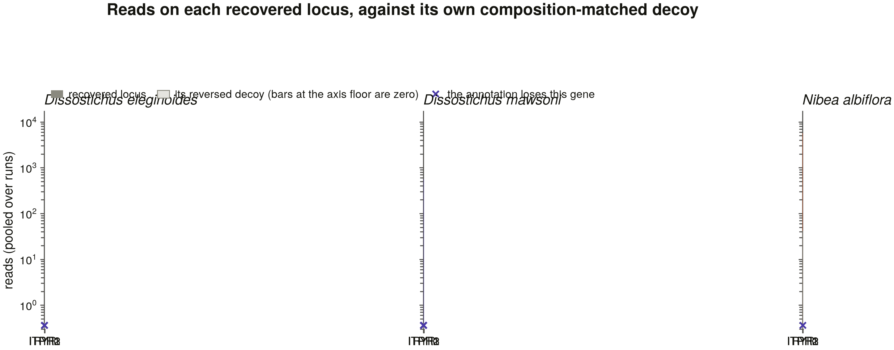

**Figure 13.10.** Detection per locus against its own reversed decoy,
which is the spurious-mapping floor of this particular reference rather than
a threshold. The decoy replaces a chosen cut with a measured one: a sequence
of identical length and composition and no homology collects whatever this
reference collects by accident, so a locus above its own decoy is detected
on evidence. Counts are on logarithmic axes because these libraries differ
roughly forty-fold in depth, and the comparison that means anything is
between a locus and its decoy in the same run.

**298 of 314 junctions that no annotated model spans are crossed by reads**,
which is 94.9 %, against 95.2 % of the annotated junctions in the same genes.

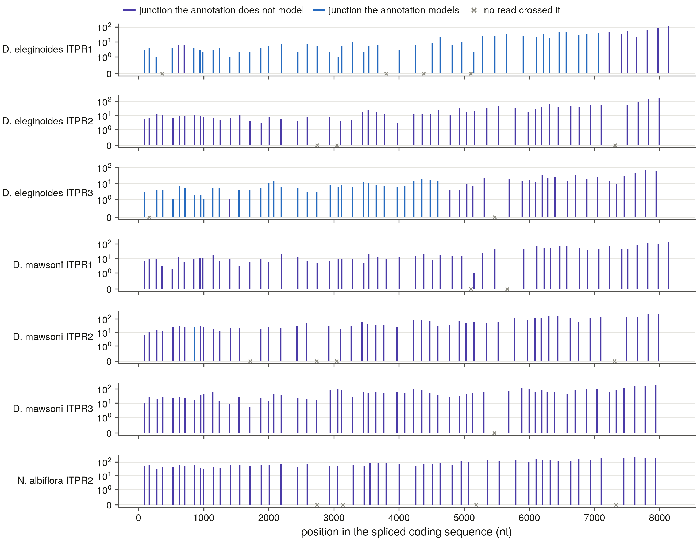

**Figure 13.9.** Every junction of every reference, crossed or not,
scored per junction rather than per gene, with the decoy floor drawn rather
than stated. That unit is what makes the read evidence answer the annotation
question rather than a weaker one: that a gene is transcribed says little
when part of it is already annotated, whereas the particular junctions no
model contains being crossed by reads is direct evidence for the exon
structure the annotation is missing.

**The confound is printed beside the ratio.** Several of these libraries are
strongly 3′-biased, and in a truncated or fragmented gene the annotated
junctions are the ones at the 5′ end, where coverage is thinnest. Comparing
the two recovery rates without saying so would report a property of library
preparation as a property of the annotation. **The claim this makes is the
absolute one**, that these particular junctions are crossed, rather than the
ratio.

**Figure 13.11.** Read coverage over the sequence the annotation
loses, which is the read-level form of the loss measurement. Two independent
instruments, one aligning a protein to a genome and one mapping reads to a
spliced reference, are asked about the same missing sequence, and their
agreement is what rules out the loss being an artefact of either.

## 13.11 Four controls make the read evidence readable

**A spurious-mapping floor is measured per sequence.** Every reference carries
a reversed decoy of identical length and composition with no homology, so what
it collects is this reference's own floor rather than a number from a paper.

**Cross-mapping between paralogues is measured rather than argued away.** The
reference is a closed set, so if the paralogues were similar enough at
nucleotide level for a read to cross between them, the whole exercise would be
measuring the wrong gene, and these paralogues are more similar to each other
than the family this method was ported from, whose version dismissed the risk
in a caveat. Every reference was tiled exhaustively with synthetic reads at
fixed steps and mapped back under the same settings. **Zero of 12,500 reads
are assigned elsewhere**, and the result is committed whether it is zero or
not. It is tiled rather than sampled, so it is exhaustive over positions and
deterministic.

**Spliced alignment is switched off deliberately.** The reference is already
coding sequence, so a junction read is contiguous here, and leaving spliced
mode on would let the aligner open a gap inside the coding sequence and call
an intron that does not exist.

**Junctions with no reads are written as zeros rather than omitted**, because
the denominator is half the result.

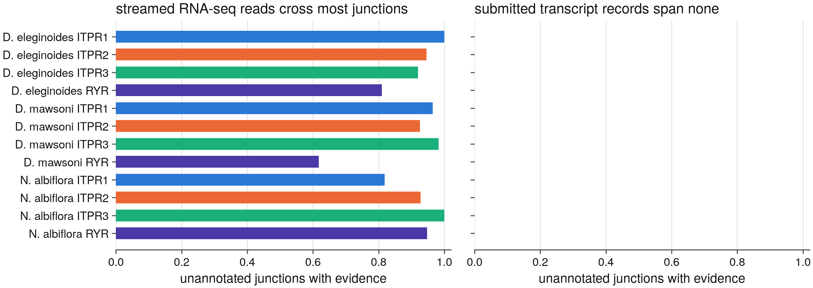

**Figure 13.12.** The deposit cross-check with its genomic negative
control. The same junction-probe test the case studies ran is re-asked on a
panel that now includes a species with 37,166 transcript records against the
other two species' 43 and 10, and it still cannot answer. A search returning
nothing in a species with tens of thousands of deposits and nothing in a
species with ten is two very different situations, and the negative control
is what shows the probes themselves work. Reporting the result as
underpowered is what keeps a database's emptiness from being read as a
biological absence.

Eleven constructed negative controls run before anything is written, and were
mutation-tested on five deliberate breakages, all five caught. The most
instructive requires junction classes to be matched **by genomic coordinate
rather than by index**, on a two-intron minus-strand gene, which is the
smallest case that can tell a coordinate lookup from an index lookup, because
a coordinate-sorted and a target-sorted list have the same length and opposite
order on a minus-strand gene. A one-intron test cannot distinguish them, and a
mutation test found exactly that mapping slipping through.

## 13.12 The correction list is 297 items addressed to somebody else

The deliverable of this chapter is addressed to somebody else: **297 correction
items, 52 of them high priority, 18 withheld.**

Each row carries the assembly, the coordinates, the current state, the current
name, the proposal, an archived evidence file a curator can open, and the
numbers the class fired on.

**Priority is a rule rather than an impression.** High priority needs the gene
demonstrably present, the assembly demonstrably able to carry it, and the
reading frame intact. A partial recovery or an unscored reading frame is
medium. Anything below the contiguity bar is low, because there the
annotation's silence may be the assembly's fault rather than the annotator's.

**The integrity veto is applied as a column rather than a filter.** Where the
lesion screen scored a locus as lesion-rich, the audit does not propose
resurrecting it, but the row is still written, flagged, with its reason,
because a locus this audit declined to correct is evidence about the audit.

A protein-record rename additionally needs an absolute score as well as a
relative margin, since the candidates score 90 to 191 bits over roughly 2,700
residues.

## 13.13 What this chapter settles about the record

The family's public record is substantially worse than the family. Three
quarters of the genes this project demonstrated are unreachable from any
protein database, more than half of the full-length protein records that do
exist carry no usable gene symbol, and a quarter of the loci in annotated
assemblies are not delivered as one complete model.

**And it is not this family's fault.** The sister family, in the same
assemblies through the same pipelines, fails at the same rate. What this
chapter measures is how vertebrate genes of this size and structure are
recorded, for which this family is an unusually well-controlled probe, because
it comes with a size-matched, domain-sharing sister to compare against.

Two of the failures are proved at the exon and confirmed by reads. Both are
genes with intact reading frames, canonical splice sites, boundaries
corroborated by dozens of other genomes' independent annotations, and
transcript evidence crossing the junctions no model spans, in chromosome-level
assemblies whose contigs are dozens of times the length of the gene.

Two thirds of the apparent annotation problem, however, is assembly quality,
and every claim here is made with the contiguity control beside it.

---

# 14. Methods, written as the reasoning behind each instrument

## 14.1 Why the methods are written here as argument rather than as procedure

A paper's methods section says what was done. It has to, because a reader
needs to reproduce it. It cannot say why each threshold is the number it is,
and for this project that is where most of the work went.

88 methodological decisions were recorded across 35 working sessions,
numbered as they were made. Several of them changed an answer.
Several were made, tested and overturned. None of them has ever been written
out as prose, and this chapter is that: not a list, but the arguments in the
order they matter, with the incident that produced each one.

The chapter is organised by what a decision is about, covering thresholds,
controls, refusals, reproducibility, and the rules that keep a document from
drifting away from its data.

**Where the procedures themselves are.** Because each instrument is built in
the chapter that first depends on it, a reader looking for a procedure rather
than for an argument needs a map, and this is it.

| Instrument | Built in |
|---|---|
| Control benchmark, domain-architecture call, profile models | §3.2 to §3.5 |
| Bait panel, spliced-alignment sweep, rescue attribution | §4.3 to §4.6 |
| Contiguity bar | §4.7 |
| False-negative rate, panel ablation, channel contribution | §4.11 to §4.13 |
| Proteome sweep, per-clade positive control, identity floor | §5.2, §5.7, §5.9 |
| Representative selection, alignment, model choice, tree search | §6.2 to §6.6 |
| Neighbourhood windows, matched control, paralogue caller | §7.2, §7.5 |
| Species tree and reconciliation, dated paralogy | §7.7, §7.10 |
| Exon and intron reading, coordinate frame, shared-intron null | §8.2 to §8.7 |
| State vocabulary, reassembly bar, Dollo count, sensitivity grid | §9.2, §9.3, §9.8, §9.9 |
| Coding-sequence validation, codon alignment, selection models | §10.2, §10.3, §10.7 |
| Structural panel, fold calibration, constraint layers | §11.3, §11.4, §11.8 |
| Module definitions, ligand shells, paired test | §12.2 to §12.4 |
| Locus states, name verdicts, read evidence | §13.2, §13.10 |

Every one of those sections names the committed table its output lives in, and
the analysis code is one file per task under `scripts/`, mapped in the
repository's `INTERFACE.md`. The exact version of every external program the
project shelled out to is recorded in `results/toolchain_manifest.txt`.

## 14.2 Thresholds are measured rather than chosen, and never ported

**A threshold ported from another project must be re-measured before it is
used rather than merely restated in this project's units.** This project
inherited a methodology from a sister project on a different gene family, and
the inheritance is deliberate, because the methods were paid for over two
dozen sessions and re-deriving them buys nothing.

The boundary of that rule is a number. The attribution margin arrived as a
bit-score ratio restated in this project's units, which made it look derived
while leaving it tuned to a family whose paralogues are 40 to 50 % identical.
These are 61 to 68 % identical. Measured against loci whose identity an
independent annotation establishes, the inherited value would have reported
every rescue fragment ambiguous and made every absence claim unattributable.

**A method ports, and a number that encodes how far apart that family's
paralogues sit does not.** Neither does one that encodes its gene sizes. The
same session found the aligner's maximum-intron parameter needed measuring for
the same reason. Where a ported constant cannot be re-measured yet, it is used
with its limitation stated in the code and the per-row value recorded, so the
cut can be revisited without re-running anything.

**A threshold cannot be calibrated from the population it has already
filtered.** The sweeps deliberately record every candidate down to a floor far
below the one they apply, precisely so that the floor is not measured on data
it has already removed.

**A threshold the data has no population for is not lowered to a round
number.** One brief asked for a merge rule that would join the pair of coding
blocks an aligner emits either side of a frameshift. Measured across all 309
genomes, **no such pair exists**, because every one of 149,148 consecutive
block pairs has contiguous query spans and the smallest genomic gap anywhere
is 10 bp. So the calibration refuses to derive a bar, since there is nothing
on the other side of it, and the floor goes at the smallest gap the genome
calls spliceable rather than at the declared fallback, which would have merged
ten real junctions. The merge then fires on zero junctions, and a constructed
control builds such a pair and requires the branch to fire, which is what
makes the zero a measurement rather than a rule that cannot act.

**A calibration must be able to refuse.** More than one in this project does:
it reports its separation statistic beside its threshold and raises rather
than handing out a bar its own data does not support. One refused with a
Youden index of 0.52 and sent a chapter back to find the population that was
contaminating its decoy.

**A calibration must not be able to pass vacuously.** A smoke-test run over
one genome once produced a threshold from two loci, wrote it, and the next
sweep read it back and moved three genomes between statuses. Calibrations now
carry floors on the number of observations they may be computed from, and one
equivalence test refuses to report success on a comparison of fewer than 25
targets after its first run went green on a group that had no hits at either
setting.

**An operating point is not the same as a separation statistic.** Youden's
index on a perfectly separated pair of populations lands on the lowest
positive, which is the most permissive bar the data allow. Where a gap exists,
the operating point goes at its midpoint and **both edges are committed**, so
a later run whose populations have drifted into contact is visible in the
table rather than only in a verdict.

## 14.3 Controls are positive, negative and matched

**The sister family is this project's positive control rather than its
nuisance.** The ryanodine receptors carry every diagnostic domain of the IP₃
receptors, are twice their length, and are inside every search this project
ran. Rather than filter them out, they are carried through every stage and
measured through the identical instrument: as a presence control in the genome
sweep, as a decoy in the discovery benchmark, as the outgroup that roots the
tree, as a second family the synteny method has to work on, as the family
whose triplication makes the teleost singletons interpretable, as the
annotation audit's comparison, and as the ligand-site chapter's positive
control for a receptor with no IP₃ site.

**A positive control does not port across the scope it controls.** The
vertebrate sweep can write "the ryanodine control fired in all 309 genomes"
because every vertebrate has three. Outside the metazoa that sentence is not
available. The replacement was a domain-sharing protein family, and that
failed too, in the one clade where it matters, because a single profile fixed
in advance for every clade is the mistake rather than the choice of profile.
The fix is to choose the control per clade by measurement, running six
candidates over each clade's own proteomes and taking the one that is actually
there.

**A within-genome paired test makes a cell and its siblings one observation.**
Where a comparison is between paralogues inside one genome, the strata from it
are not independent corroboration, because an elevated cell makes its own
siblings look deficient by construction and three significant rows can be one
result.

**A confounder that can be matched is matched rather than argued away.** Two
chapters here found their headline effect disappear under identity matching,
and both report the matched result as the answer. A third measured a risk that
a sister project had dismissed in a caveat, namely cross-mapping between
paralogues, by tiling every reference exhaustively with synthetic reads and
mapping them back. **An argument in a caveat and a measurement in a table are
not the same evidence, and the second costs minutes.**

**A ported control's result is re-measured rather than inherited.** The sister
project's reversed decoys collected zero reads, and here they collected 42, in
two of 469 comparisons, confined to 64 bp of one decoy. It changes no
detection call. Writing "zero" because zero was the ported answer is exactly
the failure the rule exists to prevent.

## 14.4 A refusal is not a disagreement

**A refusal is not a disagreement.** This is the rule that appears in the most
instruments. A structural test declines six models, and their agreement column
is left **blank rather than zero**, because scoring a refusal as a
disagreement would turn "this model is too partial to place" into "shape
contradicts the census". The tree's unplaced tips, the sweep's uncontrolled
genomes and the census's unassigned records are the same rule in earlier
instruments.

The piece that makes a refusal checkable was added late. The report prints the
**arithmetic ceiling** each declined structure could have reached, so "too
short to pass" becomes a claim that can be falsified. Here it was: every one
of the six had the headroom and fell short on similarity instead.

**A verdict vocabulary needs a word for a measurement that did not happen.**
This project's is five-valued, comprising confirmed, contradicted, not
corroborated, orthogonal and underpowered, and the last three do the work that
stops a comparison being overclaimed. *Not corroborated* is a related property
measured cleanly that does not support the prior. *Orthogonal* is a different
property of the same object, such as a tree's branching order against a
retained flanking ohnologue, a column's dispersion against a rate on a tree,
or a search's recovery rate against a gene's evolutionary rate. And
*underpowered* is not a polite word for a negative, because a neighbourhood
comparison taken where 73 % of the flanking genes are unnamed is a measurement
that did not happen.

**A ratio is estimated on a tree rather than from a pair, once the pairs are
saturated.** The counting method a pairwise estimate rests on [102] is used
in the application's own exploratory tool and nowhere in this thesis's
results, for the reason Chapter 10 measures: nearly nine tenths of
within-paralogue pairs are past the saturation bar, so a pairwise matrix is a
diagnostic here rather than an estimate.

**A significant test is not a claim, and the fitted parameter is.** Three of
the selection chapter's significant tests mean something other than what their
p-values suggest, and in every case the tell was a parameter printed outside
the test: an effect size pinned at the optimiser's bound, a rate class at
exactly one with a share of zero, or a likelihood-ratio test with no site
clearing its own posterior threshold. Every significant test in this thesis is
printed beside the parameter it is about.

**A likelihood-ratio test whose null sits on a boundary needs the right null
distribution**, and both are written out rather than one chosen.

## 14.5 Four things in this project were not reproducible until they were pinned

**Anything a committed artefact is built from is aligned single-threaded.**
The alignment program's [49] iterative refinement combines partial results
in whatever order the threads finish, so at automatic thread count it is not
reproducible: the same seeds aligned twice gave 8,510 and 8,468 columns, and
the profiles built from them 4,933 and 4,908 match states. This was discovered
by rebuilding profiles after an unrelated edit and noticing the match-state
count had moved. **A profile that changes when it is rebuilt cannot be the
profile a committed result was produced with.** Single-threaded costs 87
seconds instead of 15, once.

**Thread counts and seeds are pinned for the tree search [52] too**, because
automatic thread selection reads the machine's current load and the search is
reproducible only at a fixed seed and a fixed thread count. The number pinned
is what the program's own benchmark returned, so pinning costs nothing.

**A database release is pinned like a parameter.** The paralogy map is taken
from a dated archive rather than the rolling host, because the rolling host
follows the release cycle and a re-run would score the same windows against a
different tree. The archive's own registry is committed beside the map.

**A figure is not reproducible until its file is.** Figures were being written
with a creation timestamp in the vector output, so the same code on the same
data produced different bytes and no checksum recorded against a figure meant
anything. The timestamp is now dropped at save time. A mutation test written
to catch this initially passed on the broken code, because both saves landed
in the same second.

**A failed run is never cached, and a running stage owns a lock.** An
interrupted structural run left its parent process orphaned while its children
were killed. It went on spawning work beside the driver that replaced it, and
the killed pairs were written to the cache as zero-score results with empty
error text, giving ten permanent false negatives that only the stage's own
self-test caught. A result that is not marked successful is no longer written,
and a stage claims a lock checked against a live process, so a crash does not
block the next run for ever.

**A cache may hold what a parser found, never what a rule decided.** One audit
cached both, and a later rule change survived into a committed table.

## 14.6 Six rules make a report unable to lie

**Reports are rendered from the committed tables rather than written by hand
alongside them.** Every report in this project's results tree is generated,
and the numbers in it come from the tables in the same directory. That is why
the claims ledger can use a text search against a report as a check that is
not weaker than a table lookup: the report carries no hand-written numbers.

**Headlines are chosen by the data.** Where a chapter tests a prediction an
earlier chapter made, the prior is stated in code with where it was said, the
new statistic is computed, and the verdict is rendered from the comparison,
with both numbers printed either way. A generator written to narrate the
expected answer would print it whatever the data said, which is how a pipeline
launders an assumption into a result.

**A comparison that has to be sayable is the one that goes badly.** Several
chapters here report a result against their own design. The constraint chapter
finds the deep layer it was built around is the second best of four. The
ligand-site chapter finds the module that names the family is the less
constrained of two. The annotation chapter finds the family is not recorded
worse than its sister. Each of those had to be as easy to print as its
opposite, and the report generators are written so that it is.

**Every load-bearing number is declared with the table it comes from and the
operation that recovers it.** The manuscript carries 276 such declarations and
this thesis carries its own, through the same engine rather than a fork, so a
number quoted in both documents is recovered once and cannot disagree between
them.

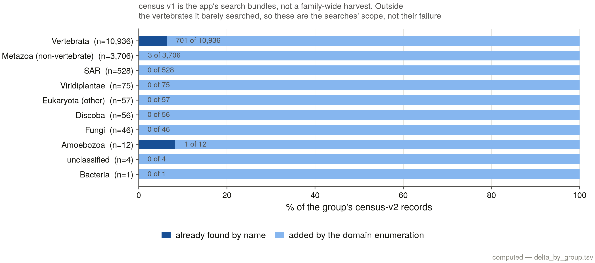

**Figure 14.1.** How the census grew across its six editions, and on
what evidence each addition rests. It is in the methods chapter rather than
in a results chapter because it is a statement about the search rather than
about the family: each edition is a channel, and the figure is the shape of
what each channel was worth. For a reader planning similar work it prices
four search strategies against each other on one family. A targeted search
of the obvious databases, which is where most projects stop, returned about
a tenth of what exhaustive enumeration by domain signature did, and only the
two genome sweeps recovered the genes no protein database holds at all.

**Citations are keys resolved at build time and the bibliography is rendered
rather than typed.** No author, title, year or journal is written into a
chapter file, and a cited key with no reference row is a build error. This is
a decision rather than a convenience, because a bibliography typed beside the
text is the one part of a document no table check can reach.

**A typeset build is not finished until its own log has been read for dropped
glyphs.** A missing character is a warning to the typesetter and a hole in the
page to a reader. One early build printed the receptor's own name without its
subscript because the document font has no subscript glyphs, and nothing in
the build said so.

## 14.7 Four rules are specific to this family

Four of the 88 recorded decisions are about this family and could not have
been ported from anywhere.

**Separating IP₃ from ryanodine receptors is a positive test at every stage.**
Never assume a domain hit, a similarity hit or a gene model is a family
member. Assign by best profile or by a labelled-bait margin, record the
margin, and treat the length band as a filter that supports the call rather
than as the call itself.

**A paralogue label is only meaningful inside the vertebrates.** ITPR1, ITPR2
and ITPR3 are a whole-genome-duplication product, so a protist record whose
protein name reads "receptor type 2" carries that number by annotation
transfer rather than by descent. Four representatives were affected.

**A bait attribution is only a label where it varies.** The sweeps record
which bait won each locus, and for most clades that discriminates because the
three baits win different loci. In the cyclostomes it does not, because each
genome carries three full-length loci and the same bait wins all of them. A
constant attribution is no information, and filling a paralogue grid cell from
it would assert an orthology the data does not contain. The rule counts
distinct attributed cells per band, so the exception is found rather than
named.

**In a family whose members are 61 to 68 % identical, "the same query aligns
twice" measures paralogy rather than duplication.** Run on raw alignments, a
duplication detector fires in essentially every vertebrate genome because
every bait aligns at all three genes, at a specificity of 0.16. The fix is the
family call applied to a pairwise test, in which the pair must sit inside the
cell's own loci, and specificity goes to 0.977 against a copy call the
detector never sees. **A geometric signature is only evidence once the family
assignment has been made.**

## 14.8 Two rules govern the scope of an absence claim

**An absence claim must pass two bars rather than one:** a genome-wide
contiguity floor, and a local check that the region itself is present.
Residual false negatives are regional rather than random, and a genome missing
a whole syntenic block is not evidence of gene loss.

That bar was chosen a priori from gene geometry, meaning the median measured
genomic span of the gene, with no error rate anywhere in its derivation, and
it has now been scored against a measured false-negative rate for the first
time. It gives 0.9 % residual error on the family series and 0.0 % on the
sister series, and it **stands**. The cost is reported beside it, because it
removes 38.8 % of the scope, disproportionately from the clades a loss survey
most wants.

**A search's sensitivity is measurable rather than estimable when the family
has no losses.** That is the design that makes Chapter 4's second half
possible, and it needs three rules to be a measurement rather than a
restatement. The cells the state rules decline to call are in neither the
numerator nor the denominator. The sister cell is carried as an independent
replicate using none of those state rules. And a false negative must be
constructible, because a control that can only ever return zero misses is not
a measurement.

---

## 14.9 The constructed negative controls are worth taking as a body of work

The paper reports these in one Methods paragraph and a count. There are more
of them than there are paragraphs in the paper's Results, and the ones that
mattered mattered a great deal.

There are **437 named constructed checks across 19 suites.** The inventory in
Appendix B is derived from the test modules themselves rather than typed, so a
control that is deleted disappears from the appendix and one that is added
appears in it. The unit counted is a named check, meaning one assertion
reported by name as the suite runs, and where a suite groups its checks into
named test functions instead, that is what is counted and the table says so,
because the two units are not the same size and adding them together silently
would be worse than either.

Every suite runs **before anything is written**, and a failure refuses the
build.

### What the controls are checks on

Almost none of them checks that a routine returns the right answer. They check
that it **refuses**, and that it **can act**.

That emphasis is not stylistic. In this project almost every rule returns a
plausible number when it is wrong. An interval routine that scores against
gene spans instead of coding blocks credits an annotation with sequence it
never called. A minus-strand intron read without reverse-complementing both
ends is non-canonical, and getting that wrong makes every minus-strand gene in
the sweep look broken, which is a systematic signal that would discredit
exactly the alignments a chapter is defending. A codon model will fit a
frame-shifted alignment and return a perfectly plausible rate. A duplication
detector that ignores the family call measures paralogy at a specificity of
0.16 and a sensitivity of 0.997, which looks like an excellent instrument.

**A rule that fires on nothing is indistinguishable from a rule that cannot
fire.** Several results in this thesis are zeros: no locus encodes the same
part of the protein twice, no block pair is a frameshift pair, no cell reaches
the absence state, the merge fires on none of 2,146 loci, and the chimera
screen rejects none of 57 candidates. Each of those zeros has a constructed
control that builds the case the rule is supposed to catch and requires it
caught, which is the only thing that makes the zero a measurement.

### Six controls changed something

**The chimera screen's own control failed on its first run, and the test was
wrong.** It asked the domain-envelope rule to reject a truncation, which the
envelope cannot and should not do, because a protein truncated to 40 % of its
length aligns 100 % of itself to the profile in one clean segment. Truncation
is the length band's job and fusion is the envelope's.

**A reassignment rule's positive and negative halves both failed**, and the
rule was wrong rather than the test. It climbed the tree from a mislabelled
tip until some group dominated, which hands a tip to whichever clade is
largest three nodes up.

**A ranked-table order-invariance check caught real hash-seeded
nondeterminism** in a committed table.

**A within-protein control was being selected by a name-prefix test** that
swept 225 residues of the element the ligand question is about into the
control set.

**A self-test damaged the artefact it tested.** One suite called the real
routine on constructed rounds and wrote its two synthetic rows over a
committed table, after which the report read two runs where there are seven,
and nothing failed. Two rules follow: any routine a control exercises takes a
write flag and the control passes it false, and the suite checks the checksum
of every committed table before and after it runs.

**A mutation test passed on broken code**, twice, in one suite. A
duplicate-column case has to be built where the two columns hold the same
residues, or an earlier guard catches it and the one being tested is never
exercised. And a byte-identity check on a saved figure passes vacuously
whenever both saves land in the same second, so the property is now tested
directly.

### Mutation testing is the check on the checks

Where a suite's own report records it, the suite was **mutation-tested**,
meaning the rule it guards was deliberately broken and the suite required to
catch it. Across the tasks that recorded this, every deliberate breakage was
caught by the check responsible, giving a total of dozens of mutations across
the analysis chapters, with each one named in its task's committed statistics
rather than summarised.

That is the check on the checks. A suite that has never been shown to fail is
a suite whose passing means nothing.

## 14.10 One rule cannot be automated: look at the figure

One decision in this project cannot be automated, and it is stated as an
instruction rather than a rule: **look at the figure.**

Every main and supplementary figure was opened and read against its own
legend, because errors of the kind "the legend says four and the figure draws
three" are invisible to every table check in the project. A figure is
generated from a committed table, so its data cannot drift. Its description
can, and nothing downstream notices.

**Twenty-three figures were inspected and 26 findings recorded**, comprising
16 legends corrected and 10 figures corrected. They are recorded as data, one
row per finding, with what the legend said, what the figure shows, the
committed table the correction was re-derived from, and which of the two was
changed.

The findings are worth characterising because they are all of one kind. One
key described two colours where the figure draws four. One legend said
"lineages grouped by kingdom" where three of the groups are not kingdoms.
Another named the class with the most non-blue area where the figure shows a
different class ahead on the fraction it plots. One figure carried a bold
panel letter with no second panel to go with it. And one legend called four
labels the extended paralogue clades where the figure carries five nodes. None
of these is a data error, and none would have been caught by re-reading a
table.

**The mechanical half of that inspection is now automated and runs on every
build.** Every figure must have a legend, every legend a figure, and each
multi-panel figure's legend letters must match its panel files. A later pass
added the other mechanical half, requiring every figure to be cited by a
sentence of the body and the citations to run in ascending order, because
before it two figures were cited by nothing at all and the methods figure was
numbered last and first mentioned in the third results section.

## 14.11 Two joins behind the supplementary figures are checked in code

A supplementary figure exists so a reader can check a join, so both joins were
checked first, in code, as hard failures.

**The trimming column map** requires that every trimmed column be the input
column the map names, for every sequence, across 1,797 columns and 134
sequences, walked exhaustively. The trimming program writes no column map of
its own. One was recovered from a reporting flag, and it is **not trusted**,
because an off-by-one would have no other symptom: every column would still
map to a column, and every residue claim downstream would be renumbered with
nothing to show for it.

**The residue at the column** requires that every variant's reference amino
acid be the residue its own paralogue's per-residue table holds there, and
every aligned partner the residue the other paralogue's table holds, across
1,780 variants and 2,699 partners.

Both passed, which is why a residue-level figure in this thesis prints
letters.

**A structure may carry a position from another numbering only if it earns
it.** A structure carries a human variant position only when every residue it
shares with the human table carries the same amino acid, and two of four
candidates fail, so one paralogue's pathogenic positions are simply not drawn
on coordinates that are not theirs.

## 14.12 How this document is built, in eight stages

Running `python scripts/s25_assemble.py` runs eight stages in dependency order
and exits non-zero on any failure.

The **guards** stage breaks every build guard on purpose and checks that each
fires, and §14.13 and Appendix E describe it.

The **assign** stage commits the chapter grouping and fails on a results
directory that is neither assigned to a chapter nor explicitly excluded, which
is the no-leftovers rule enforced rather than asserted, and which means a
future task's results cannot be silently left out of this thesis.

The **controls** stage derives the negative-control inventory from the test
modules themselves.

The **refs** stage audits every reference added for this document, and §14.14
is that audit.

The **figures** stage copies every placed figure from the results directory
that committed it, in both formats, and fails on a missing file, a slug used
twice, or a committed figure that the thesis neither places nor explicitly
excludes.

The **claims** stage re-verifies every load-bearing number against its
committed table through the manuscript's own engine, and additionally requires
each declared number to **appear in the chapter that declares it**, which is
what stops a ledger being padded with checks the text never makes.

The **stitch** stage concatenates the chapters, numbers the figures per
chapter in order of first placement, resolves the citation keys, and fails on
a missing chapter, a placed figure the map does not declare, a declared figure
no chapter places, a figure placed in a chapter other than its own, or a
figure reference that resolves to nothing.

The **pdf** stage typesets the result and reads the typesetter's own log for
dropped glyphs.

## 14.13 Every guard is broken on purpose, on every build

The requirement was that each guard be broken on purpose once. Doing that by
hand proves it for one afternoon, so it is instead a build stage that runs
first, and it carries two properties that make it worth the file.

**Each case declares a fragment the guard's own message must contain**, so a
case that starts failing for a different reason is a failure rather than a
pass. The suite's own first run had four cases returning non-zero for the
wrong reason: two path bugs in the harness, one guard reading a module-level
constant the sandbox could not redirect, and one mutation applied to a list
the driver had already copied.

**It runs against a sandboxed copy of the thesis directory and checks the
SHA-256 of every committed file before and after**, because this project has
already had a self-test overwrite the committed table it was testing.

All 18 fire, and `thesis/guard_check.tsv` records what each said.

## 14.14 The reference audit caught nine citations that named the wrong paper

The literature review carries 137 references, audited when it was built. This
document needed 58 more, almost all of them methods and tools, and the rule
for them is the review's rule unchanged: **a reference added and not audited
is worse than no reference, because it launders an assumption into a
citation.**

So nothing bibliographic is typed. Each new reference is declared by an
identifier alone, meaning a PubMed identifier or a digital object identifier
where the work predates indexing, together with a distinctive phrase that must
appear in the title that identifier resolves to, and a note of what the thesis
rests on it for. The build resolves each identifier against a live record,
admits it **only if the title carries the declared phrase**, and then writes
the bibliographic row from the fetched record.

**That check caught nine of 76.** Nine identifiers written from memory
resolved perfectly well, to entirely different papers. A gene-duplication
inference algorithm's identifier returned a Bayesian phylogenetics program. A
reconciliation method's returned a paper on real-time gene expression. A
morphological-character likelihood model's returned a paper on species names
in phylogenetic nomenclature. A vertebrate ancestral-genome reconstruction's
returned a paper on structured RNAs.

Every one of those would have entered a bibliography looking entirely normal,
with the right journal era, a plausible author and a number nobody checks. **A
bibliography assembled by hand has no way to notice**, and that is the whole
argument for the rule.

The audit is committed as a table with one row per new reference, giving the
source database, the identifier queried, the phrase required, the title
returned, and the verdict. All 58 now read *verified*.

---

# 15. General discussion

## 15.1 What is now known about the family that was not known before

Before this work, the IP₃ receptor family was described as animal machinery
with scattered occurrences elsewhere, three vertebrate paralogues of
unresolved relationship, and a well-studied protein whose gene had never been
counted.

Six things are now measured that were not. Each is stated below with what it
changes, because a census is only worth the questions it makes askable, and
several of these results bear directly on literatures that have been arguing
without the relevant numbers.

### The family now has a measured range, and every absence names the space it was measured in

The receptor is present across the metazoa, in several protist lineages, in
the green algae and in the early-diverging fungi. It is absent from land
plants, from the yeasts and moulds, from apicomplexans, microsporidia, red
algae, diatoms, tapeworms and every archaeal and bacterial proteome swept.
Each of those absences is a claim about a declared space, and each of the 35
clade-level ones has been taken to the genome in assemblies where a measured
positive control recovers a comparably long, deeply conserved gene.

**This changes the status of the family's distribution from an impression to a
measurement.** The receptor's occurrence outside the animals has been reported
from whichever genomes were available when each survey was written, and the
resulting picture is a list of sightings rather than a range [38,39,40,48]. A sighting list cannot support an absence, because the absence of a
report and the report of an absence look identical in it. What is different
here is the denominator: 7,691 reference proteomes and 194 non-vertebrate
genomes, with a control in every genome that carries the claim.

**The land-plant absence answers a question that has been open in the plant
literature for two decades.** Plant cells release calcium in response to
IP₃ in physiological assays, and no plant receptor gene has ever been
identified, so the standing review of the subject asks in its title whether
the receptor is real [37]. This work gives the genomic half of that answer
in the strong form: land plants do not have the gene, and the green algae they
descend from do [43,42]. That relocates the question rather than closing
it. The physiology still needs a carrier, and the plant calcium toolkit is
built from channel families that animals use differently or not at all [44,45], so the useful next experiment is about what performs the function in a
lineage that demonstrably lost the receptor.

**The absences in the reduced parasite genomes are the least surprising and
the most useful as controls.** Microsporidia and apicomplexans have undergone
severe genome reduction [47], and the tapeworms have lost gene families
across their entire biology as an adaptation to parasitism [46]. A method
that failed to find the receptor in those lineages when it is there would show
the same pattern, which is why each of those claims is carried by a positive
control drawn from the same clade rather than by the search returning nothing.
The apicomplexan calcium literature has had to work around exactly this
uncertainty [48].

**A measured range turns the receptor into an instrument for other questions.**
Co-occurrence across genomes is one of the oldest ways of assigning function
without an experiment [103], and it requires a range on both sides of the
comparison. Chapter 12 uses this one: the receptor's distribution is compared
against the distribution of the enzyme that makes its ligand, across the same
7,691 proteomes, and the comparison is only possible because both were swept
rather than recalled.

### The distribution has a shape, and the shape is repeated independent loss

The family is present in the early-diverging lineage of both green plants and
fungi and gone from the derived one in each. Combined with its presence across
the metazoa and in several protist groups, that makes it ancestrally
eukaryotic and lost repeatedly rather than invented more than once.

**Loss is the expected fate of a gene family and is still the harder thing to
demonstrate.** Gene loss is now understood as an ordinary evolutionary
mechanism rather than as degradation [26], but a loss claim needs a
denominator and a control, which is what most reports of a missing channel
lack. The pattern here is worth stating because it is convergent: the same
receptor is retained by the chlorophyte algae and absent from land plants
[43,42], and retained by the early-diverging fungi and absent from the
Dikarya [41]. Two kingdoms lost the same signalling component on the two
branches where each made its largest change in cell biology, and calcium
signalling in both is now carried by other machinery [44].

That is a comparison a physiologist can act on. It identifies the pairs of
lineages between which the substitution happened, and it names assemblies on
both sides of each pair.

### The three vertebrate paralogues now have a dated order of duplication

ITPR2 and ITPR3 are sisters, with both alternatives outside the confidence set
of topologies. The split that separated ITPR1 from the other two sits on the
vertebrate stem and the split between them on the gnathostome stem, so the two
duplications are not on the same branch and ITPR1 is the earlier-diverging
copy. The neighbourhood agrees that the three blocks are paralogous and that
the surviving links run through ITPR1, with one of the two dated to the
vertebrate radiation and the other far older.

**The placement matters because it puts this family on the two branches the
genome-scale reconstructions assign to the two vertebrate duplications.**
Reconstructions of the proto-vertebrate, proto-cyclostome and proto-gnathostome
genomes place the first round before the cyclostome and gnathostome split and
the second after it [104], which is the arrangement this family's two splits
recover from an independent gene tree and its own neighbourhood evidence
[25,69,57]. A family whose duplication history matches the
genome-scale account needs no lineage-specific explanation, and one that
did not would have been a problem for either the family or the account.

**It also changes how the functional literature should be read.** The three
receptors are usually discussed as three coequal subtypes with different
regulation, distribution and physiology [105,106,107]. The tree says they
are not symmetric: ITPR2 and ITPR3 are a younger pair and ITPR1 is the
outgroup to both. A functional difference shared by ITPR2 and ITPR3 and absent
from ITPR1 is therefore the cheaper hypothesis, because it needs one change on
one branch rather than two.

### The teleost genome duplication kept one paralogue doubled and discarded the other two

The teleost genome duplication doubled ITPR1 and only ITPR1, in 97 % of
teleost genomes, while doubling all three ryanodine receptors in the same
genomes.

**Which duplicate copies survive is one of the few things about whole-genome
duplication that is predictable, and this result fits the prediction and
sharpens it.** Retention after a genome duplication is biased towards
dosage-sensitive genes, whose products work in complexes where the ratio of
partners matters [108], and the genes that stay duplicated are a small and
non-random remainder of an otherwise rapid return to single copy [56,70]. The receptor is a homotetramer that also forms heterotetramers, so it
is a dosage-sensitive gene by that argument, and the interesting part of the
result is not that a copy was retained but that only one paralogue's was.
The ryanodine receptors in the same genomes, under the same duplication and
the same subsequent loss, kept all three.

**The same paralogue is dosage-sensitive in humans.** Ohnologues from the
vertebrate duplications are over-represented among the genes whose copy-number
changes cause disease [109], and ITPR1 is one of them: heterozygous deletion
of ITPR1 causes spinocerebellar ataxia in humans [110,111,112] and the
gene is among the most constrained in the human population record [113].
A copy kept doubled for 300 million years in one clade and intolerant of
hemizygosity in another is the same statement about dosage made twice.

### The gene has one architecture that is conserved and one that is not

Each paralogue has fifty-seven to fifty-eight coding exons, of which 46 to 49
positions are shared between any two paralogues in every genome carrying both,
which is an enrichment of nearly two orders of magnitude over a null drawn
from the alignment itself. The ryanodine receptors, which carry every
diagnostic domain of the family, share one. What differs between the
paralogues is intron length, by a factor of four.

**Shared intron positions are among the most durable characters a gene has**,
conserved across kingdoms and lost or gained at rates low enough to be
informative about deep relationships [75,76]. Reporting 46 to 49 shared
positions therefore says something the sequence alignment does not: the three
paralogues did not merely diverge from a common protein, they inherited a
common gene, intron by intron, and have kept the boundaries through 500
million years of sequence divergence.

**The ryanodine receptor control is what makes that a statement about
descent.** Two proteins with the same domain content and the same fold could
share intron positions because the splicing machinery prefers the same places
in that kind of sequence, and the way to test it is to ask the same question
of a family with the same domains and a separate origin. One shared position
against 46 to 49 is the answer, and it is the difference between an
observation about splicing and an observation about ancestry.

**The four-fold difference in intron length is the other half of the result,
and it is a live question rather than a settled one.** Intron length is under
selection, with shorter introns in highly expressed genes [73], although the
energetic explanation usually offered for that has itself been contested
[74]. Three paralogues that agree on every coding boundary and disagree
four-fold on the DNA between them are a controlled comparison for whatever
sets intron length, because everything a comparison of unrelated genes would
have to control for is already matched.

### No vertebrate genome in the scope has lost the gene

Across 927 genome by paralogue cells in 309 vertebrate genomes, none reaches
the state this project defines as an absence, and parsimony places no loss
anywhere on the tree.

**A zero is the least interesting result to report and the most demanding to
defend**, which is why §15.3 is about the defence rather than the number. What
makes it worth reporting at all is the contrast with the expectation. Gene
loss is common enough to be a normal evolutionary mechanism [26], and this
family has demonstrably used it repeatedly outside the vertebrates, so a clade
in which none of three paralogues has been lost in any of 309 genomes is a
statement about that clade rather than about the family's general behaviour.

**Every paralogue has a loss-of-function phenotype, which is the mechanism the
retention result points at.** Deleting ITPR1 in mice produces ataxia and
seizures [114], the human heterozygous deletion is a recognised ataxia
[110,111], loss of ITPR2 function abolishes sweat secretion in humans and
mice [115] and ITPR3 variants cause a peripheral neuropathy [116]. Retention
across a whole vertebrate clade, an ohnologue kept doubled in the teleosts,
and dosage intolerance in humans are three independent observations pointing
at the same conclusion, and none of them establishes it on its own.

## 15.2 Five independent measurements put ITPR1 on the same side

Five independent measurements point the same way, and they were made by
methods that share almost nothing.

ITPR1 is the paralogue whose neighbourhood retained a dated ohnologue with
each of the other two, while they retained none with each other. It is the
copy the teleost genome duplication kept doubled. It is the most constrained
of the three by coding-sequence rate, at roughly twice the purifying selection
of its sisters, and the only one whose selection is intensifying relative to
them. It is the earlier-diverging copy on the reconciliation. And it carries
the family's dominant missense disease burden.

It is also the one whose stem branch carries the single branch-site result
this thesis reports: a class of sites evolving several times faster than
neutrally, on the interval between the duplication and the first surviving
split, while the rest of the tree sits near a rate of 0.03.

That is a coherent story and it is not a demonstrated one. The obvious
reading, in which ITPR1 retained or acquired the ancestral dosage requirement
and the other two were free to specialise, is consistent with every
measurement above and is not tested by any of them. What can be said is that
whatever distinguishes ITPR1 from its sisters is visible in the genome's
arrangement, in the coding sequence's rate, in what a whole-genome duplication
kept, and in the clinic, and that a hypothesis with that many independent
footprints is worth a targeted experiment.

## 15.3 What it takes to defend a count of zero losses

The retention result is the one this thesis worked hardest for and the one
that would be easiest to disbelieve.

A count of zero losses is what a broken pipeline produces, what an
over-conservative rule produces, and what an insensitive search produces. The
defence is not a claim about care. It is four measurements.

**The search's own false-negative rate is measured rather than estimated**, at
15.2 % of control cells over the whole scope and 0.9 % above a contiguity bar
set from the gene's own geometry. That measurement was only possible because
the count is zero, since if no gene in the scope is missing then every unfound
cell whose gene is independently known present is a miss with a known right
answer, and it is carried on two independent series, one of which uses none of
the state rules the other depends on.

**The state vocabulary was built so that exactly one state can be counted as a
loss**, and every alternative explanation must be positively excluded first.
Two of its eight rules exist because of specific incidents in which a naive
count would have scored losses that never happened.

**The threshold that decides the hardest cells was calibrated against a decoy
population**, refused to separate on its first attempt, and was fixed by
identifying the population that was contaminating the decoy, comprising 20
regions that are pieces of real genes in genomes where two paralogues are both
shattered.

**The sensitivity of the count is reported as a grid rather than as a
robustness claim**, covering thirty-two settings, on two codings, under three
branch-length schemes. The family-level count manufactures a loss in 2 of 32
settings and the paralogue-resolved one in 18, and moving the calibrated bar
across the whole gap its own calibration measured changes nothing in 927
cells.

**The strongest form in which a zero can be stated is the one that names its
own escape routes**, and this thesis names them: refuse all reconstruction
evidence and ignore assembly contiguity, and a loss appears. That is a
description of a setting rather than a defence of it, and it is in a committed
table rather than in a sentence.

## 15.4 The public record is the weakest thing about this family

Three quarters of the genes demonstrated here are unreachable from any protein
database. Fifty-five per cent of the full-length protein records that do exist
carry no usable gene symbol. A quarter of the loci in annotated assemblies are
not delivered as one complete model.

**And it is not this family's fault.** The sister family, in the same
assemblies through the same pipelines, fails at the same rate. What is being
measured is how vertebrate genes of this size and structure are recorded, for
which this family is an unusually well-controlled probe because it comes with
a size-matched, domain-sharing sister to compare against.

Two thirds of the apparent problem is assembly quality, since the failure rate
falls from 26 % to 7 % above the contiguity bar, and the remaining third
splits between the two archives, with 99 % of loci in curated gene sets
complete against 64 % in submitter-deposited ones above the same bar.

The parts that are not assembly quality are worth naming because they are
fixable. A gene the annotation identifies correctly, names correctly, and
files as non-coding emits no protein and cannot be reached by name. A gene
with a locus tag instead of a symbol is invisible to every symbol-based query.
A gene delivered as three models covering 58 % of its coding footprint is a
gene nobody can retrieve.

Two of these failures are proved here at the exon and confirmed by reads.
They are genes with intact reading frames over 2,700 codons, canonical splice
sites, boundaries corroborated by dozens of other genomes' independent
annotations, and transcript evidence crossing the junctions no model spans, in
chromosome-level assemblies whose contigs are dozens of times the length of
the gene. The deliverable addressed to somebody else is a list of 297
corrections with coordinates, evidence and a priority rule.

## 15.5 What the protein measurements say, and what they cannot

Constraint mapped onto the channel puts the gate and the selectivity filter at
the top, as the least changeable elements of the receptor on two metrics in
all three paralogues, with the gate identical between all three since the
duplications. The pore module as a whole is more constrained than the linkers,
once fifty residues of luminal loop are separated from it, and that loop is
the most variable sequence in the receptor, sitting about fifty residues from
the most conserved.

Two results at the ligand site were not what the question expected.

**The IP₃-binding core is the less constrained of the two functional
modules**, paired per orthologue across roughly 250 sequences per paralogue,
and that answer reverses on whether the luminal loop counts as pore. Any
version of that comparison which does not declare the boundary is not
interpretable, which is a methodological result as much as a biological one.

**The constrained unit at the ligand site is a pocket rather than a contact
set.** The ten measured contacts beat the rest of the binding core and do not
beat the rest of the 15 Å neighbourhood, and the same shape appears
independently in per-site substitution rates. What selection holds is a
neighbourhood, and the step a contact-driven model predicts is not there.

Losing the enzyme that makes the ligand does not relax the site. That null is
bounded rather than empty, because the test can see a ligand-free core when
there is one, in the ryanodine receptors, at the same evolutionary distance,
on the same instrument, and it does not see one in the 36 lineages that have
lost the upstream enzyme.

Conservation is a usable variant classifier for this family, and the layer
that works best is not the one built for it, because taxonomic breadth beats
within-gene depth. That is worth stating because building the deep layers took
most of a session and the honest result is that the family-wide layer, which
was already available, discriminates better.

## 15.6 Five results here are about method rather than about receptors

Some of what this thesis found is not about IP₃ receptors at all.

**A genome-scale orthologue sweep misses about one cell in seven, and every
miss is an assembly.** A survey that reports absences without a contiguity
floor is reporting assembly quality.

**Phylogenetic breadth in a protein bait panel is nearly worthless within the
vertebrates, and paralogue coverage is everything.** Four human baits recover
782 of the 783 cells a 38-bait panel recovers, while removing one paralogue's
own baits costs about a quarter of the recovery.

**A family profile over reference proteomes is not a discovery method for
whole genes.** At gene scale it returns what domain annotation already
returns, adding one extra record in 3,135 in the vertebrates. Its gain is
fragments, and gene-scale records only where the annotation is worst.

**The obvious rule for catching iterative-search drift measures the wrong
thing.** Sister-family contamination is the quantity this project and its
predecessor both chose to monitor, and it is diluted by the drift it is meant
to detect. Scored as classifiers of an outcome measured on the finished model,
the sister-family rule has a sensitivity of zero on seven runs including all
three that drifted, while the off-family share separates them perfectly.

**A reference added without an audit is worse than no reference.** Nine of 76
identifiers written from memory resolved to entirely different papers, each of
which would have entered a bibliography looking completely normal.

## 15.7 Six things this thesis does not settle

**Which of the two duplication rounds made which split.** The dated ohnologue
link is dated to the vertebrate radiation, which is both rounds, and
separating them needs the cyclostome side of the quartet, which the
neighbourhood evidence cannot reach, because 27 to 29 % of those genomes'
coding genes carry a symbol at all.

**Whether the paralogue quartet had a fourth slot.** With one dated ohnologue
pair surviving between the blocks that do carry a gene, a block that lost the
gene too has nothing left to be recognised by.

**Why ITPR1 alone kept its teleost duplicate.** The observation is clean and
the cause is not in this evidence.

**Whether the ligand pocket's constraint is about IP₃.** Everything within
15 Å of the ligand is also within the fold that holds it, and no sequence
measurement separates ligand binding from domain packing.

**What the receptors of the enzyme-less lineages are gated by.** A search for
one enzyme family says the canonical route to IP₃ is missing rather than that
the receptor has no ligand.

**The bird lesion result is named but not explained.** ITPR3 carries an
excess of disabling indels against its own genome's identity-matched sibling
loci, and stratified it is entirely a bird result, at 25 genomes to 2.
Twenty-one of the 27 informative pairs are in assemblies below the
contiguity bar, which is where the test has its power, and the six above it
all point the same way without being enough to test. The lineage is named
and the mechanism is not, and what would settle it is a different sample,
meaning birds at chromosome level, rather than a different statistic.

## 15.8 The general shape of the argument is a stance about negatives

If there is one thing this project would offer somebody starting a comparable
census, it is not a pipeline. It is a stance about negatives.

Every interesting result here is a negative or rests on one. The family is
absent from land plants. No vertebrate lineage has lost a paralogue. The
ryanodine receptors share one intron position with the IP₃ receptors. Losing
the upstream enzyme does not relax the binding site. No locus encodes the same
part of the protein twice. The family is not recorded worse than its sister.

A negative is only worth stating when three things are true of it: the search
space is declared, a positive control demonstrates the search could have found
the thing, and the rule that produced the zero has been shown able to produce
something else. The third is the one most often missing, and it is cheap,
requiring only a constructed case that the rule is supposed to catch,
required to be caught.

Almost every methodological decision in Chapter 14 is a specialisation of that
stance. Measure the threshold rather than choosing it, because a chosen
threshold has no error bar. Carry the sister family through every stage,
because a control that rides along costs nothing and makes every number
readable. Report a refusal as a refusal, because a blank and a zero are
different claims. Print the parameter beside the p-value, because a
significant test with an unidentified effect size is a different sentence.
Render the report from the table, because a number typed beside its data will
eventually stop matching it.

None of that is specific to calcium channels. What is specific to this family
is the reason it was all necessary: a sister family that carries every
diagnostic domain, sits in every genome in triplicate at twice the length, and
is returned by every query. Half the rules in this thesis exist because of the
ryanodine receptors, and the other half exist because 309 genomes contain
enough broken assemblies to manufacture any answer somebody wants.

---

# 16. How this project was carried out with Claude Code

## 16.1 What Claude Code did, and what it did not

This project was carried out by Claude Code, which is Anthropic's Claude
running as an agent in a terminal with access to the file system, the shell
and the network. It reads and writes files, runs commands, inspects their
output, and decides what to do next.

**Claude Code did the following.** It designed the project plan and wrote it
down as a task ledger with dependencies. It wrote all 374 Python files under
`scripts/`, which run to over a hundred thousand lines, together with the
9,243 lines of the search application under `src/`. It audited the
literature the project started from, claim by claim, against primary
sources. It decided which genomes and proteomes to download, wrote the
manifests that declare them, and fetched 624 GB of assemblies and 60 GB of
proteomes. It chose every threshold in the work and, in most cases, measured
it rather than choosing it. It ran every search, alignment, tree, selection
test and structural comparison. It produced all 444 committed result tables
and all 112 committed figures. It recorded 88 numbered methodological
decisions as it made them. And it wrote the literature review, the
manuscript, this thesis and every one of the 28 rendered task reports that
stand behind them, which together run to 109,250 words.

Every figure in that list is measured rather than recalled. The build
re-derives them from the repository on every run and commits them as
`thesis/production_stats.tsv`, so they move as the project does and this
chapter cannot describe a repository that no longer exists.

**The human collaborator did the following.** He stated the goal, which was a
publication-grade genome-scale census of one gene family. He provided the
machine, the external storage and the network access. He ran the small number
of commands that require an interactive login or elevated privileges. He read
the drafts and corrected them, including two corrections to this document that
are recorded in the decisions log. And at the start of each working session he
said, in effect, continue.

He did not write the code, choose the genomes, select the statistical tests,
set the thresholds or draft the text.

**What follows is a description of that arrangement rather than a defence of
it.** An agent that runs for hours unattended can produce a great deal of
plausible output, and the interesting question is not whether it can but how
anybody, including the agent, can tell whether the output is true. Almost
every methodological rule in this thesis is an answer to that question, and
§16.9 sets out what the answer looks like in practice.

## 16.2 The work was organised as a ledger of one-task sessions

The organising artefact is a single file, `PUBLICATION_ROADMAP.md`, which
Claude Code wrote in the first session and has amended in every session since.
It contains four things: a statement of the goal and how the claim is scoped;
a session protocol; a task ledger; and a decisions log.

**The session protocol is a fixed procedure that starts and ends every working
session.** At the start it opens a progress dashboard, pulls the repository,
verifies that the external storage is attached and stops if it is not, then
picks exactly one task, which is the single row already in progress, or
otherwise the topmost pending row whose dependencies are all complete. It
announces that task and works only that task until its completion criteria
pass. At the end it updates the ledger and the results column, appends to the
session log, appends a plain-language entry to a findings document, refreshes
the repository's README, commits and pushes.

That protocol exists because of a specific failure mode. An agent with a long
list of things to do will do several of them partially, and a project of this
size dies of half-finished tasks rather than of hard ones. **Working one task
to its stated completion criteria, and splitting a task in the ledger when it
proves too large, is the rule that kept it finishable.** Several tasks were
split this way, and each split is visible in the ledger as two rows with the
reason recorded.

**The ledger is 37 tasks, of which 34 are complete.** Each row carries the
task, its dependencies, its status with a date, and a results column holding
the load-bearing numbers and the paths they came from. The two incomplete rows
are the human-gated deposit, which needs a person to create a public archive
record, and the paper series, which is the next task.

Alongside the ledger, a briefs document holds a detailed specification for
every row: the goal, the steps, the completion criteria, the outputs, and, for
the later rows, what would make that task a failure. Claude Code wrote those
briefs in advance of doing the work, which matters because a brief written
after the fact describes what happened rather than what was intended.

**35 sessions were logged across 9 working days**, the first on 2026-08-18 and
the most recent on 2026-09-09. The session log is a running technical record
of what ran, what resulted and what is next. It is written for the next
session rather than for a reader, and it is the mechanism by which an agent
with no memory between sessions resumes work that is already in progress.

## 16.3 The literature was surveyed and then audited claim by claim

The first substantive task was not a search. It was to write down what the
project was taking as known, and then to check it.

Claude Code assembled a background document in which every statement carries a
tag: `[db]` if it can be re-derived from a database with a stated query,
`[lit]` if it rests on a published source, and `[open]` if it is a question
the project answers. It then extracted nineteen atomic claims from the
`[lit]`-tagged statements and checked each against its primary sources,
and re-queried every `[db]` number against the live database it came from.

Chapter 2 reports the outcome. Twelve claims were verified, three were
qualified, two were corrected and one was demoted to an open question. The
demoted one mattered most: the background asserted that the IP₃ and ryanodine
receptor families had independently expanded to three paralogues each, no
primary source establishes it, and leaving it in place would have made three
later chapters into a confirmation of something already assumed.

**Claude Code then wrote a full literature review**, running to 137 references
and twelve generated figures, as a separate document. That review is not
decoration. It is where the project's claim about what is already known lives,
and it is built by a script from numbered source files with citations resolved
against one reference table, so its text and its bibliography cannot drift
apart.

Two habits from that stage run through everything after it. **A number is
quoted with the query that produces it**, and **a claim is tagged by how far
it can be trusted**, so that a later chapter can tell the difference between a
fact it inherited and a fact it measured.

## 16.4 What to download was decided by rule and committed as a manifest

The project needed 503 genome assemblies and 7,691 reference proteomes. Which
ones was not a judgement call, because a judgement call cannot be audited.

**The denominator is declared before the search runs, and it is derived from
the data rather than hand-listed.** For the vertebrate scope, Claude Code
wrote two rules: one best assembly per vertebrate order, ranked by a stated
function, and a margin rule with four positive tests that reads the census to
find species whose protein records are missing, fragmentary or absent. The
union is 309 genomes. For the non-vertebrate scope it wrote five rules under
one principle, which is to sample most finely where the negative claim is, and
one of those rules re-derives its own target list from a committed presence
table. That rule found three absences the earlier summary had never named,
including a metazoan clade with no record at all.

**Both manifests are committed tables with a reason column on every row**, so
the scope rebuilds itself if the census changes, and a reader can see why any
given genome is in the study.

The downloads themselves were run by a script Claude Code wrote for the
purpose, which verifies every archive against its published checksums,
retries download, extraction and verification together because a truncated
archive surfaces as a checksum failure rather than a download error, and can
operate in a fetch, search and purge cycle so that a 624 GB scope can be
processed at one genome of peak storage.

## 16.5 What to analyse was decided by a menu written before the analyses ran

Between building the search and running the analyses, Claude Code wrote a
document listing what the harvested data could answer. Each entry names its
inputs, its method, its deliverable and the caveat that would invalidate it,
and the entries became ledger rows.

Writing that menu before doing the work is the difference between a study and
a fishing expedition. **An analysis chosen after seeing the data is chosen
partly because of what the data shows**, and the menu is the record that these
were not.

The menu is also where the project's scope discipline is visible. Several
entries were written and then answered as underpowered rather than dropped,
because a measurement that did not reach its question is a result about the
evidence and an omission is indistinguishable from a section nobody ran.

## 16.6 The analyses ran unattended, and each one is a driver with stages

Every analysis task is a set of small modules and one driver script with
ordered, resumable stages. The pattern is the same throughout: a driver with
`--only` and `--from` flags, stages that are individually re-runnable, a
negative-control suite that runs before anything is written and refuses the
build if it fails, and a report and figures rendered at the end from the
tables the stages committed.

**Three properties made unattended operation possible.**

Stages are resumable, so a run that is interrupted resumes at the stage that
failed rather than from the beginning. The genome sweep is resumable per
genome, and the selection suite is resumable per job.

**A failed stage does not stop the stages after it that do not depend on it**,
and the report marks an unfinished section as unfinished. Waking up to a
partial analysis that says which parts are partial is worth more than waking
up to nothing.

And expensive work is cached at the level that makes a re-run cheap, with the
rule that **a cache may hold what a parser found and never what a rule
decided**, so that changing a rule invalidates the verdicts without
invalidating the parse.

The largest single run was the selection suite, which ran for 22.7 hours
unattended. The genome sweep processed 309 vertebrate assemblies and then 194
non-vertebrate ones. **15.2 compute-hours are recorded across the eight search
channels**, measured on clean recomputes rather than on cached re-runs,
because a cached run makes a budget look free.

During long runs the drivers write a small progress file that a dashboard
reads, so the human collaborator could see what was happening without
interrupting it.

## 16.7 Thresholds were measured rather than chosen, which is where the agent's judgement went

The part of this project that most needed judgement was not which analysis to
run. It was where to put each threshold, and the answer Claude Code arrived at
early and applied throughout is that **a threshold should be measured against
a population the threshold has not already filtered, and reported with its
separation**.

Chapter 14 sets out the rules in full. What is worth saying here is that this
is where the agent's own reasoning is most visible, and it is visible because
it was written down at the time. **88 numbered decisions** are recorded in the
roadmap, each with the incident that produced it. Several changed an answer.
An attribution margin inherited from a sister project was measured and
overturned, because it came from a family whose paralogues are half as similar
to each other as this one's. An intron-length parameter was measured across
eleven species because it is not a performance setting but a threshold on
whether a gene reads as a fragment. A calibration refused to separate its two
populations and sent a chapter back to find the contamination in its decoy.

**The decisions log is also where the agent recorded being wrong.** A kill
criterion written for the project's central hazard turned out to have a
sensitivity of zero when it was finally scored. A duplication detector reached
a specificity of 0.16 before it was scoped correctly. A self-test overwrote
the committed table it was testing. Each is in the log with the fix and the
rule that generalises it.

---

## 16.8 Results, tables and figures are generated, and nothing is typed twice

Every number this project reports lives in one of 444 committed result
tables, and every
document that quotes one reads it from there. That rule has three parts, and
Claude Code applied all three from the first analysis onward.

**Reports are rendered from the committed tables rather than written beside
them.** All 28 task reports are generated by a script from the tables in their
own directory. None contains a hand-written number. That is why a text search
against a report is a legitimate check in the claims ledger: the report cannot
contain a number its tables do not.

**Headlines are chosen by the data.** Where a task tests a prediction an
earlier task made, the prior is stated in code together with where it was
said, the new statistic is computed, and the verdict is rendered from the
comparison, with both numbers printed either way. A report generator written
to narrate the expected answer would print it whatever the data said. Several
reports consequently say that an earlier task's finding was not corroborated,
and one says that the task's own premise was wrong.

**Figures are drawn only from committed tables, by one style module, at the
width they will be printed at.** There are 112 committed figures. A single
module holds the page geometry, the validated palette and a save function that
refuses to write a figure whose layout runs off the canvas or whose text needs
a glyph the font lacks. Figures are never re-plotted downstream: the paper and
this thesis copy the file the analysis committed, and record its checksum.

Several figure decisions are recorded because they are substantive rather than
cosmetic. A contiguity panel bins on the threshold rather than across it,
because a sliding window straddling the bar reports a value no genome in it
has. An exon track draws exons at true genomic width and never widens them to
be visible, because widening them would draw a gene whose coding fraction
looks like 40 % when it is 15 %. A saturation panel is drawn on log-log axes,
because on a log-linear plot the neutral diagonal is not a line and the first
draft left the saturation bar as the only line on the figure, which reads as
neutrality.

**One check on figures cannot be automated, and Claude Code did it by hand.**
Every main and supplementary figure was opened and read against its own
legend, which found 26 discrepancies of the kind a table check cannot see: a
key describing two colours where the figure draws four, a legend naming the
wrong class as the largest, a bold panel letter with no second panel. Sixteen
legends and ten figures were corrected, and each finding is recorded as a row
of data with the table the correction was re-derived from. The mechanical half
of that inspection now runs on every build.

## 16.9 The final documents are built by script, and every guard is broken on purpose

Three documents are produced from the same committed evidence: a
137-reference literature review, a manuscript, and this thesis.

**Each is assembled by a driver with ordered stages, and each exits non-zero
on a defect rather than producing a document with a hole in it.** The
manuscript's build collects figures, re-verifies its numbers, stitches its
sections, typesets and builds a deposit manifest. The thesis's build adds
three stages of its own: it commits the chapter grouping and fails if a
results directory is neither assigned nor explicitly excluded, it derives the
negative-control inventory by parsing the test modules, and it measures the
repository to produce the statistics this chapter quotes.

**Citations are keys resolved at build time and the bibliography is rendered
rather than typed.** No author, title, year or journal appears in any source
file of any of the three documents. A cited key with no reference row is a
build error.

**Every load-bearing number is declared with the table it comes from and the
operation that recovers it.** The manuscript declares 276 and this thesis
declares 220, through one shared engine so that a number quoted in both is
recovered once and cannot disagree between them. The thesis adds a second
condition: a declared number must also appear in the chapter that declares it,
which is what stops a ledger being padded with checks the text never makes.

**Every guard in the thesis build is broken on purpose on every build.** A
suite runs first, in a sandboxed copy, breaking each of the fifteen guards in
turn and requiring each to fire with the message it is supposed to, and then
verifying that it altered no committed file. That last condition exists
because an earlier self-test in this project overwrote the committed table it
was testing, after which a report read two runs where there were seven and
nothing failed.

**The bibliography is audited on entry, and the audit caught nine references
in fifty-eight.** Nothing bibliographic is typed: a new reference is declared
by an identifier and a phrase its title must carry, resolved against a live
record, and written from what comes back. Nine identifiers written from
memory resolved to entirely different papers, each of which would have looked
completely normal in a reference list. This is the clearest single example in
the project of a check catching the agent rather than the data.

## 16.10 What the human collaborator contributed

The division of labour is worth stating precisely, because "written by an
agent" is easy to overstate in either direction.

**The goal and the standard came from the human.** The instruction was a
publication-grade census of one gene family, to the evidence standard of a
molecular-evolution journal, with an exhaustive search space, a completeness
argument, support values, synteny-backed orthology, model-based selection
tests, molecular validation of every annotation-error claim, and one-command
reproducibility. That specification shaped everything.

**The infrastructure came from the human**: the machine, the external drive
that holds 700 GB of bulk data, the network access, and the credentials for
the interactive logins that an agent cannot perform.

**Continuation came from the human.** Each session began with an instruction
to continue. The agent chose the task, but a person decided that there would
be a session.

**Correction came from the human, and it mattered.** The literature review was
expanded to a full illustrated document at his request, outside the ledger.
The prose of this thesis was rewritten after he read it and reported that
sentence fragments and overused dashes made it confusing, which produced two
recorded decisions and a full rewrite of all 27 chapter files. The title and
the authorship of this document were corrected the same way.

**And every commit carries both.** Every commit on the main branch is
authored by the human collaborator and carries a co-author trailer naming
Claude, which is an accurate record of how they were made: the agent wrote the
change and the message, and the human's account and machine committed it.

## 16.11 What this arrangement is good at, and where it needs watching

Three things this way of working did well.

**It sustained a long, dependency-ordered plan.** 37 tasks with declared
dependencies, worked one at a time to stated completion criteria across 35
sessions, with the ledger and the session log carrying the state between them.
An agent with no memory between sessions can do this only if the state lives
in the repository, and the protocol is what puts it there.

**It made the methodology explicit.** 88 numbered decisions with the incident
that produced each is a level of methodological record-keeping that is
uncommon in a paper, and it exists because the agent had to write down why it
did something in order to be able to follow the same rule three weeks later.

That count is itself an example of the arrangement working, and it has
demonstrated it twice. Writing this chapter added a decision to the log, and
the editorial pass that followed added another. On both occasions the build
re-measured the repository and the claims ledger refused the document, naming
the number the chapter still carried and the number the log now held. The
figure in the sentence above was corrected each time because a check declined
to pass it, which is the whole of what §16.9 describes, applied to the chapter
that describes it.

**It made checking cheap enough to do everywhere.** 437 constructed negative
controls, 496 declared claims across two documents, guards that are broken on
every build, and reports that cannot contain a number their tables do not.
Each of those is tedious for a person and almost free for an agent, so they
were applied uniformly rather than where somebody remembered.

Three things that need watching, stated because they are the risks of the
arrangement rather than incidental faults.

**A fluent agent produces plausible prose about work it has not checked.** The
reference audit is the clearest case: nine of seventy-six citations were
confidently wrong, and no amount of care in the writing would have caught them.
The only thing that caught them was a check that resolved each identifier
against a live record. **The general lesson is that an agent's confidence is
not evidence, and the fix is a mechanical check rather than more care.**

**A rule that fires on nothing looks exactly like a rule that cannot fire.**
Several of this project's results are zeros, and an agent generating both the
rule and the result has an obvious way to produce a satisfying zero by
accident. Every such zero here has a constructed control that builds the case
the rule is supposed to catch and requires it caught, and that is the only
thing that makes the zero a measurement.

**Style rules are applied where somebody notices unless they are checked.**
The first prose pass through this thesis fixed the confusing headings and
removed every long dash, and a systematic check afterwards found thirty more
headings with no verb and fifteen fragmentary paragraph openings. The rule
that came out of it is the same one the science follows: **a pass that has not
been checked mechanically is a pass that fixed the instances somebody happened
to see.**

---

# Appendix A. The correction list

This appendix is the one deliverable of the thesis addressed to somebody else.
It is a list of specific, coordinate-level proposals to the public archives,
each with the evidence a curator would need to act on it, and it is committed
in full as `results/annotation_audit/corrections.tsv`.

There are **297 items, comprising 52 at high priority, 19 at medium and 226 at
low, with 18 vetoed.**

## A.1 What each row contains

Every row carries the assembly accession, the annotation source, the organism
and its vertebrate class, the paralogue cell, the contig with start, end and
strand, the current annotation state, the current name and biotype, the
proposal, the numbers the class fired on, the priority with the rule that
assigned it, and an archived evidence file a curator can open.

## A.2 The correction list has six classes

**Twenty items are unannotated.** No same-strand annotated feature overlaps
the recovered gene at all, and the proposal is a coding model over the aligned
exons.

**Fifty-four items are held only by a non-coding feature.** The annotation
places a feature there and files it as something that emits no protein, most
often a pseudogene. This is the class where the family differs from its
sister, and where the failure is most invisible to a user, because the gene
is identified, frequently named correctly, and simply produces no protein
record, so no name-based or sequence-based protein search can ever reach it.

**Two hundred and seventeen items are incomplete.** One or more coding
models are present and between them deliver a fraction of the gene. The
proposal names how many models are there, what fraction they deliver
together, what the best single one delivers, and asks for extension or
merging to the aligned exons. The typical row delivers a tenth of the gene
across two models.

**One item carries a wrong paralogue name.** Its annotation names a paralogue
the alignment assigns elsewhere, in a genome that also carries a separate
locus for the paralogue the annotation names, so the two cannot both be that
gene.

**Five items are protein records naming the wrong family.** Each is a
full-length protein record whose sequence the bait panel assigns to one
family and whose name claims the other. All five are non-vertebrate records
where the sequence barely separates the families either, and each
additionally required an absolute score as well as a relative margin before
it was written, because these candidates score 90 to 191 bits over roughly
2,700 residues.

Two hundred and ninety-two of the items concern a genome annotation and five a
protein record.

## A.3 Priority is assigned by a rule

**High priority** requires three things simultaneously: the gene demonstrably
present, the assembly demonstrably able to carry it, and the reading frame
intact. Only 52 items meet all three, and they are concentrated in ray-finned
fish, with a handful in birds, mammals and amphibians.

**Medium priority** covers a partial recovery or an unscored reading frame.

**Low priority** covers anything below the contiguity bar, because there the
annotation's silence may be the assembly's fault rather than the annotator's,
and a correction proposed on that basis would be asking a curator to annotate
a gene the assembly cannot represent.

## A.4 The integrity veto is a column rather than a filter

Eighteen items are vetoed. Where the lesion screen scored a locus as
lesion-rich, this audit does not propose resurrecting it.

**The row is still written**, flagged, with its reason. A locus the audit
declined to correct is evidence about the audit, and filtering those rows out
would leave a list that looks cleaner than the evidence behind it.

## A.5 What the list is not

It is not a claim that these annotations are wrong in a sense a curator must
accept. It is a set of specific, checkable proposals with coordinates and
evidence, produced by one instrument, about genes that instrument recovered.
Two of them, one omission and one fragmentation, are validated in Chapter 13
down to the exon and confirmed by junction-spanning reads. The other 295 rest
on the same instrument that produced those two, applied at scale.

---

# Appendix B. The constructed negative controls

This appendix lists the constructed negative controls of this project. It is
derived from the test modules rather than counted by hand and is committed as
`thesis/control_inventory.tsv`.

There are **437 named constructed checks across 19 suites.**

## B.1 What is counted, and what a unit is

Two conventions are in use across the project and both are counted, because it
grew them at different times and neither is wrong. Some suites group their
checks into named test functions, while others call a helper once per
assertion, naming each check as it runs. **A named check is the finer unit, so
it is preferred where a module has any, and the table records which unit each
row counts**, because the two are not the same size and adding them together
silently would be worse than either.

The count is derived by parsing each module. Any call to one of the project's
check helpers whose first argument is a string literal is one named control,
and any top-level function whose name matches the project's test-function
convention is one grouped control. A control deleted from a module disappears
from this appendix, and one added appears in it.

## B.2 Where the controls are

| suite | unit | controls |
|---|---|---|
| `s6_test_selection.py` | named check | 24 |
| `s7_test_tree.py` | named check | 18 |
| `s8_test_flanks.py` | named check | 49 |
| `s9_test_codon.py` | named check | 14 |
| `s10_test_evidence.py` | named check | 58 |
| `s11_test_structures.py` | named check | 24 |
| `s12_test_expression.py` | named check | 11 |
| `s13_test_recon.py` | test function | 14 |
| `s15_test_loss.py` | test function | 15 |
| `s15b_test_counts.py` | named check | 21 |
| `s16_test_dup.py` | named check | 21 |
| `s17_test_constraint.py` | test function | 14 |
| `s18_test_audit.py` | named check | 42 |
| `s19_test_methods.py` | named check | 33 |
| `s21_test_arch.py` | named check | 9 |
| `s21_test_claims.py` | named check | 12 |
| `s22_test_ligand.py` | named check | 23 |
| `s22_test_lineage.py` | named check | 18 |
| `s24_test_supp.py` | named check | 17 |

Further controls run inside the analysis modules themselves rather than in a
test module, comprising the bait screen's three synthetic failures, the
chunked-genome equivalence test, the resume test and the
one-search-two-sensitivities equivalence test. They are not in the table
because they are not separately addressable checks.

## B.3 What the controls are checks on

Almost none of them checks that a routine returns the right answer. They check
that it **refuses**, and that it **can act**. Chapter 14 gives the argument.
The short form is that in this project almost every rule returns a plausible
number when it is wrong, and several of the thesis's results are zeros that
would be indistinguishable from a rule that cannot fire.

Every suite runs before its task writes anything, and a failure refuses the
build.

## B.4 Six of the controls found something

Six are described in Chapter 14: the chimera screen's control that failed
because the test was wrong rather than the rule; a reassignment rule whose
positive and negative halves both failed and whose rule was wrong; an
order-invariance check that caught real hash-seeded nondeterminism in a
committed table; a within-protein control selected by a name prefix that swept
the element under test into the control set; a self-test that overwrote the
committed table it was testing; and two mutation tests that passed on broken
code until the case was rebuilt to exercise the guard it was aimed at.

---

# Appendix C. The sensitivity tables

Four results in this thesis rest on a threshold that somebody chose, and in
each case the count was recomputed across the whole range of that threshold
and committed. This appendix says where those tables are, what each axis is a
knob on, and what moving it costs.

The principle behind all four is the same, and it is worth stating once. **A
threshold-dependent result must say which settings manufacture it, and it must
walk the threshold across its own measured uncertainty before any invented
value.** A robustness claim asserted in prose is not checkable, and a grid is.

## C.1 The loss count is walked across four axes

The table is `results/loss_counts/sensitivity_matrix.tsv`, with 384 rows.

It has four axes. **Coding** contrasts the family-level presence character
with the paralogue-resolved one. **Evidence** is an ordered eight-rung ladder,
each rung named after what it refuses, whose first three rungs are the
reconstruction calibration's own measured gap edges and midpoint rather than
round numbers. **The cyclostome rule** is switched on and off, and so is **the
contiguity bar**. Every cell is computed under three branch-length schemes.

The count is zero at the operating point on both codings. The family-level
coding manufactures a loss in 2 of 32 settings and the paralogue-resolved one
in 18, up to 45 loss edges.

The companion table `manufactured_losses.tsv`, with 144 rows, says the same
thing at cell resolution, giving every genome by cell that ever reads absent
under any setting, the state and rule that held it at the operating point, and
the loosest setting that releases it. That table is what makes the sensitivity
claim checkable one cell at a time rather than one count at a time.

**The branch-length axis is carried and reported as invariant.** Parsimony
counts edges and cannot read a length, so no scheme changes any count, and a
matrix that quietly dropped that axis would be indistinguishable from one that
had tested it and found nothing.

## C.2 Copy number is recomputed at seven coverage bars

The table is `results/duplication/copy_sensitivity.tsv`, with 56 rows.

It recomputes every copy count in the duplication chapter at seven coverage
bars. A duplication claim that survives only one bar is a claim about the bar,
and the teleost result is the one this table exists to protect, because it
holds across the range.

## C.3 Gene architecture is recomputed at six coverage bars

The table is `results/gene_architecture/architecture_sensitivity.tsv`, with 24
rows.

It recomputes exon counts, spans and intron statistics at six coverage bars.
The result the table protects is that the exon count is conserved and the span
is not, which is a comparison between two quantities measured on the same loci
and therefore robust to the bar by construction. But the bar decides which
loci, and the table says so.

## C.4 Annotation states are recomputed across the completeness bar

The table is `results/annotation_audit/state_sensitivity.tsv`, with 21 rows.

It re-counts every locus state across the whole range of the completeness bar.
The audit inherits that bar from the sweep rather than deriving a second one,
so this table is what validates the inherited value: it shows where each state
boundary sits in the distribution and what a different bar would have done to
the headline.

## C.5 Two thresholds have no sensitivity table, and here is why

**The reconstruction bar** has none, because the evidence ladder in C.1 is its
sensitivity analysis. Its first three rungs are the two edges of the gap the
calibration measured and the midpoint between them, and moving across the
whole gap changes no cell in 927.

**The identity floor for what counts as a locus** outside the vertebrates has
none, because the calibration that produced it reported that neither identity
nor coverage separates its two populations cleanly, and a sensitivity grid
around a threshold whose calibration refused to separate would be a grid
around nothing. What was done instead was to add a second, independent axis,
in which every recorded cluster is scored against both family profiles, and to
report both statistics.

---

# Appendix D. The reference audit

The audit table is `thesis/reference_audit.tsv`, with one row per reference
added for this document, giving the source database, the identifier queried,
the phrase the title had to carry, the title returned, the year, the journal,
the first author, the verdict, and what the thesis rests on the reference for.

**76 references were added and all 76 verified.** Nine required a
corrected identifier before they could be.

## D.1 What the rule for a new reference requires

The literature review's 137 references were audited when it was built, and
this document inherits them as a frozen baseline, committed as
`thesis/reference_baseline.txt` before any new reference was added. Every key
cited by this thesis that is not in that baseline is a new reference, and the
build fails on a new reference with no verified audit row.

The rule for a new reference is the review's rule unchanged: it is **audited
on entry**. What that means in practice is that nothing bibliographic is
typed. Each new reference is declared by an identifier alone, together with a
distinctive phrase that must appear in the title that identifier resolves to.
The build resolves the identifier against a live record, using PubMed for
anything indexed there and Crossref otherwise, admits it only if the title
carries the phrase, and then writes the bibliographic row from the fetched
record.

So a mistyped identifier fails the audit instead of quietly putting a
different paper in the bibliography, and no author, title, year or journal can
be wrong, because none of them is entered by hand.

Responses are archived, so the audit re-runs offline.

## D.2 What the audit caught

**Nine of the 76 identifiers resolved to entirely different papers.**

A gene-duplication inference algorithm's identifier returned a Bayesian
phylogenetics program. A reconciliation method's returned a paper on
statistical challenges in real-time gene expression. A morphological-character
likelihood model's returned a paper on species names in phylogenetic
nomenclature. A vertebrate ancestral-genome reconstruction's returned a paper
on structured RNAs in the human genome. A zebrafish gene-cluster paper's
returned a paper on a poly(ADP-ribose) polymerase at telomeres. Two timetree
papers, a gene-loss review and a Dollo-parsimony paper resolved elsewhere or
not at all.

One of the nine was a different failure and is worth separating: the
identifier was right and the phrase was wrong. That one was corrected by
adjusting the phrase, because the record the identifier returned was the
intended work.

Every one of the other eight would have entered a bibliography looking
entirely normal, with the right journal era, a plausible author list, and a
number nobody checks. That is the argument for the rule in one sentence: **a
bibliography assembled by hand has no way to notice.**

## D.3 What the new references are

By audit class, there are 12 tools this project actually ran, whose versions
are recorded in the toolchain manifest; 21 methods, models or statistical
procedures implemented or applied; 10 databases, cited at the release the
project used; and 33 substantive biological or evolutionary claims.

The tool and method references are the bulk of the addition and the reason it
was needed at all. The manuscript cites 29 references and none of them is a
tool, because a paper can name its software in a Methods section and be
understood. A chapter that explains why an alignment was run single-threaded,
or why a branch-site likelihood ratio is tested against a mixture, is citing a
method and must say whose.

## D.4 What is not audited here

The 137 inherited references are not re-audited. They were audited once,
against their primary sources, in the session that built the literature
review, and 19 atomic claims resting on them were scored, giving 12 verified,
3 qualified, 2 struck and 1 downgraded to an open question. Chapter 2 reports
that audit and what it changed.

Re-auditing them would be a second session's work for no new information. What
this appendix adds is that the new references have been through a check the
inherited ones were not: their identifiers have been resolved against a live
record and required to return the paper the declaration names.

---

# Appendix E. How the results were assigned to chapters, and the build guards

## E.1 What the assignment table records

The assignment is committed as `thesis/chapter_assignment.tsv`, with one row
per entry under `results/`, giving the chapter it is primary in, the rule that
placed it, what it is, and the chapter it might plausibly have gone to instead
with the reason it did not.

There are **37 results directories assigned across 13 chapters, with one
excluded.**

The rules are written out in `thesis/chapter_rules.md`, which was committed
before any chapter prose was written, and four of the seven are enforced by
the build rather than asserted.

**Rule T4 says a results directory is primary in exactly one chapter.** It is
enforced by construction, because the assignment is a mapping.

**Rule T6 says a grouping that only holds leftovers is an appendix.** It is
enforced in the strong direction: every entry under `results/` is either
assigned to a chapter with a rule and a reason, or named in an exclusion list
saying why it is not a result. A directory that exists and is unassigned fails
the build, which also means a future task's results cannot be silently left
out of this thesis. One entry is excluded, namely the dashboard's progress
panel, which is session state.

**Rule T7 says every figure is copied from a committed results directory and
never re-plotted.** It is enforced, in that a missing file, a slug used twice,
or a committed figure the thesis neither places nor explicitly excludes all
fail the build. **The thesis places 104 figures**, every one copied from the
results directory that committed it in both formats, with the source and the
SHA-256 of each recorded in `thesis/figure_manifest.tsv`. Eight figures are
explicitly excluded, all of them the search application's own bundle plots
from smoke-test runs, which are drawn from whatever one search returned rather
than from a committed analysis table.

**Rule T3 allows four to twelve figures per results chapter.** It is checked
by inspection against the figure manifest rather than by the build. The
introduction, the methods chapter and the discussion are exempt as exposition,
and the methods chapter carries one figure.

## E.2 The paper series should expect one departure from this assignment

This task ran before S26, so this table is the one S26 starts from. There is
one place where a paper series will have to choose differently, and it is
recorded here as a disagreement rather than resolved.

**The methods results, meaning the measurement of what the search was worth,
sit entirely in Chapter 4** with the search they measure. S26's own starting
proposal splits them across two papers: a retention paper taking the
false-negative rate, and an archive paper taking the contribution half.

Both are right about their own format, and the reason they differ is not a
matter of taste.

**The thesis's reason.** The false-negative rate is a property of the search,
in that 15.2 % of cells whose gene is independently known present were not
found by the ledger. A document that explained the search in one chapter and
then withheld the number saying what that search was worth until five chapters
later would be hiding the instrument's error bar from the chapter that builds
the instrument.

**The series' reason.** A retention claim without its own false-negative rate
is a paper whose central control lives somewhere else, which is exactly what
S26's second rule forbids, since every control a paper's claims rest on must
be measured inside that paper.

The rule that forces the choice is the one both documents share, namely that a
result is primary in exactly one place, and it is shared deliberately so that
a disagreement between the two groupings is visible rather than invisible.

**What a reader holding both documents should take from it.** The thesis and
the series are not the same object cut two ways. A chapter can be a stage in a
longer construction and a paper cannot. Where the two groupings differ, the
difference is a fact about the two formats, and this appendix is where it is
recorded rather than smoothed over.

## E.3 Every guard is broken on purpose, and this is what each one said

Every guard in the build is broken on purpose on **every** build, by
`scripts/s25_test_guards.py`, which runs as the first stage and writes
`thesis/guard_check.tsv`. **All 18 fire with the message they are supposed
to**, and the suite verifies that it altered no committed file while doing it,
because a self-test that damages what it tests is a failure mode this project
has already had once.

Each case declares a fragment the guard's own message must contain, so a case
that starts failing for a different reason is a failure rather than a pass.

| guard | how it was broken | what it said |
|---|---|---|
| the assignment (T6) | a results directory removed from the assignment | `results/<name> is neither assigned to a chapter nor listed in ASSIGNMENT_EXCLUDED (rule T6)` |
| the assignment (existence) | an assignment pointing at a directory that does not exist | `results/<name> is assigned but does not exist` |
| a missing chapter | a chapter file moved aside | `missing chapter file thesis/<name>` |
| a missing figure | a declared figure's source file moved aside | `<slug>: missing <path>.png` |
| a duplicated slug | one figure declared twice | `slug '<slug>' is declared more than once` |
| an unexcluded figure | a committed figure removed from the exclusion list | `<path>.png is committed under a chapter's results tree but is neither placed in the thesis nor listed in UNPLACED` |
| an unplaced figure | a declared figure's placement deleted from its chapter | `<slug> is declared for chapter N but no chapter places it` |
| a borrowed figure | a figure placed in a chapter other than its own | `thesis/<file> places <slug>, which is declared for chapter N` |
| a dangling figure reference | a reference to a figure that is never placed | `{fig:<slug>} is referenced but the figure is never placed` |
| an undeclared reference | a citation key with no row in the reference table | `cited keys with no row in references.tsv: <key>` |
| an unaudited reference | a new key cited with its audit row removed | `cited keys added after the frozen baseline with no verified audit row: <key>` |
| a decorative reference | a key's single citation deleted | `references added for the thesis and never cited: <key>` |
| a failed claim | a claim's expected value altered | `[FAIL] <id> <claim>: expected X, found Y` |
| a padded claim | a claim declared for a chapter whose text does not state its value | `chapter N does not state 'X', so either the number is missing from the text or the claim is padding` |
| a dropped glyph | a character the document font cannot set | `N distinct missing characters, so the document font lacks a glyph the text uses` |
| an em-dash | an em-dash reintroduced into a chapter source | `N em-dash(es) in a chapter source` |
| a legend repeating itself | a sentence duplicated inside one figure legend | `legend <slug> says the same thing twice` |
| a legend repeating its neighbour | a legend given the text of the paragraph beside it | `legend <slug> restates the paragraph after it` |

Four of these are the ones this thesis added over the manuscript's build: the
padded-claim guard and the three prose guards at the foot of the table. The
padded-claim guard closes the ledger in the direction the manuscript's cannot,
because it fails not only when the document states a number no table produces,
but when the ledger declares a check the document never makes. The three prose
guards exist because the two editorial passes on this document each introduced
a defect that every other guard passed over: an em-dash carrying a clause a
reader needed, and a figure legend saying the same thing twice.

---

# References

Every entry below is rendered from `results/s0_baseline/references.tsv`, which
is the one reference table this project keeps, and numbered in order of first
appearance in the text. No author, title, year or journal is typed into a
chapter file, and a cited key with no row in that table fails the build.

The 137 keys inherited from the literature review were assembled and audited
in the session that built it. The 76 added for this document were each
resolved against a live record, using PubMed for anything indexed there and
Crossref otherwise, and admitted only if the title the identifier returned
carried the phrase the declaration said it should. Appendix D is that audit,
and it reports what it caught.

1. Paknejad N, Hite RK. Structural basis for the regulation of inositol trisphosphate receptors by Ca2+ and IP3. *Nat Struct Mol Biol* **2018**. PMID 30013099. doi:10.1038/s41594-018-0089-6.

2. Benton M, Donoghue P, Vinther J, Asher R, Friedman M, Near T. Constraints on the timescale of animal evolutionary history. *Palaeontologia Electronica* **2015**. doi:10.26879/424.

3. Streb H, Irvine RF, Berridge MJ, Schulz I. Release of Ca2+ from a nonmitochondrial intracellular store in pancreatic acinar cells by inositol-1,4,5-trisphosphate. *Nature* **1983**. PMID 6605482. doi:10.1038/306067a0.

4. Ferris CD, Huganir RL, Supattapone S, Snyder SH. Purified inositol 1,4,5-trisphosphate receptor mediates calcium flux in reconstituted lipid vesicles. *Nature* **1989**. PMID 2554143. doi:10.1038/342087a0.

5. Furuichi T, Yoshikawa S, Miyawaki A, Wada K, Maeda N, Mikoshiba K. Primary structure and functional expression of the inositol 1,4,5-trisphosphate-binding protein P400. *Nature* **1989**. PMID 2554142. doi:10.1038/342032a0.

6. Maeda N, Niinobe M, Mikoshiba K. A cerebellar Purkinje cell marker P400 protein is an inositol 1,4,5-trisphosphate (InsP3) receptor protein. Purification and characterization of InsP3 receptor complex. *EMBO J* **1990**. PMID 2153079. doi:10.1002/j.1460-2075.1990.tb07386.x.

7. Mignery GA, Sudhof TC, Takei K, De Camilli P. Putative receptor for inositol 1,4,5-trisphosphate similar to ryanodine receptor. *Nature* **1989**. PMID 2554146. doi:10.1038/342192a0.

8. Seo MD, Velamakanni S, Ishiyama N, Stathopulos PB, Rossi AM, Khan SA *et al.* Structural and functional conservation of key domains in InsP3 and ryanodine receptors. *Nature* **2012**. PMID 22286060. doi:10.1038/nature10751.

9. Fan G, Baker ML, Wang Z, Baker MR, Sinyagovskiy PA, Chiu W *et al.* Gating machinery of InsP3R channels revealed by electron cryomicroscopy. *Nature* **2015**. PMID 26458101. doi:10.1038/nature15249.

10. Zalk R, Clarke OB, des Georges A, Grassucci RA, Reiken S, Mancia F *et al.* Structure of a mammalian ryanodine receptor. *Nature* **2015**. PMID 25470061. doi:10.1038/nature13950.

11. Yan Z, Bai X, Yan C, Wu J, Li Z, Xie T *et al.* Structure of the rabbit ryanodine receptor RyR1 at near-atomic resolution. *Nature* **2015**. PMID 25517095. doi:10.1038/nature14063.

12. Efremov RG, Leitner A, Aebersold R, Raunser S. Architecture and conformational switch mechanism of the ryanodine receptor. *Nature* **2015**. PMID 25470059. doi:10.1038/nature13916.

13. Bezprozvanny I, Watras J, Ehrlich BE. Bell-shaped calcium-response curves of Ins(1,4,5)P3- and calcium-gated channels from endoplasmic reticulum of cerebellum. *Nature* **1991**. PMID 1648178. doi:10.1038/351751a0.

14. Marchant JS, Taylor CW. Cooperative activation of IP3 receptors by sequential binding of IP3 and Ca2+ safeguards against spontaneous activity. *Curr Biol* **1997**. PMID 9210378. doi:10.1016/s0960-9822(06)00230-5.

15. Alzayady KJ, Wang L, Chandrasekhar R, Wagner LE, Van Petegem F, Yule DI. Defining the stoichiometry of inositol 1,4,5-trisphosphate binding required to initiate Ca2+ release. *Sci Signal* **2016**. PMID 27048566. doi:10.1126/scisignal.aad6281.

16. Bezprozvanny I, Ehrlich BE. ATP modulates the function of inositol 1,4,5-trisphosphate-gated channels at two sites. *Neuron* **1993**. PMID 7686381. doi:10.1016/0896-6273(93)90319-m.

17. Supattapone S, Danoff SK, Theibert A, Joseph SK, Steiner J, Snyder SH. Cyclic AMP-dependent phosphorylation of a brain inositol trisphosphate receptor decreases its release of calcium. *Proc Natl Acad Sci USA* **1988**. PMID 2847175. doi:10.1073/pnas.85.22.8747.

18. Chen R, Valencia I, Zhong F, McColl KS, Roderick HL, Bootman MD *et al.* Bcl-2 functionally interacts with inositol 1,4,5-trisphosphate receptors to regulate calcium release from the ER in response to inositol 1,4,5-trisphosphate. *J Cell Biol* **2004**. PMID 15263017. doi:10.1083/jcb.200402193.

19. Ando H, Mizutani A, Matsu-ura T, Mikoshiba K. IRBIT, a novel inositol 1,4,5-trisphosphate (IP3) receptor-binding protein, is released from the IP3 receptor upon IP3 binding to the receptor. *J Biol Chem* **2003**. PMID 12525476. doi:10.1074/jbc.M210119200.

20. Higo T, Hattori M, Nakamura T, Natsume T, Michikawa T, Mikoshiba K. Subtype-specific and ER lumenal environment-dependent regulation of inositol 1,4,5-trisphosphate receptor type 1 by ERp44. *Cell* **2005**. PMID 15652484. doi:10.1016/j.cell.2004.11.048.

21. Nakagawa T, Okano H, Furuichi T, Aruga J, Mikoshiba K. The subtypes of the mouse inositol 1,4,5-trisphosphate receptor are expressed in a tissue-specific and developmentally specific manner. *Proc Natl Acad Sci USA* **1991**. PMID 1648733. doi:10.1073/pnas.88.14.6244.

22. Danoff SK, Ferris CD, Donath C, Fischer GA, Munemitsu S, Ullrich A *et al.* Inositol 1,4,5-trisphosphate receptors: distinct neuronal and nonneuronal forms derived by alternative splicing differ in phosphorylation. *Proc Natl Acad Sci USA* **1991**. PMID 1849282. doi:10.1073/pnas.88.7.2951.

23. Bartok A, Weaver D, Golenar T, Nichtova Z, Katona M, Bansaghi S *et al.* IP3 receptor isoforms differently regulate ER-mitochondrial contacts and local calcium transfer. *Nat Commun* **2019**. PMID 31427578. doi:10.1038/s41467-019-11646-3.

24. Ohno S. Evolution by Gene Duplication. *Springer Berlin Heidelberg* **1970**. doi:10.1007/978-3-642-86659-3.

25. Dehal P, Boore JL. Two rounds of whole genome duplication in the ancestral vertebrate. *PLoS Biol* **2005**. PMID 16128622. doi:10.1371/journal.pbio.0030314.

26. Albalat R, Cañestro C. Evolution by gene loss. *Nat Rev Genet* **2016**. PMID 27087500. doi:10.1038/nrg.2016.39.

27. Harrison PW, Amode MR, Austine-Orimoloye O, Azov AG, Barba M, Barnes I *et al.* Ensembl 2024. *Nucleic Acids Res* **2024**. PMID 37953337. doi:10.1093/nar/gkad1049.

28. Mistry J, Chuguransky S, Williams L, Qureshi M, Salazar GA, Sonnhammer ELL *et al.* Pfam: The protein families database in 2021. *Nucleic Acids Res* **2021**. PMID 33125078. doi:10.1093/nar/gkaa913.

29. Blum M, Chang HY, Chuguransky S, Grego T, Kandasaamy S, Mitchell A *et al.* The InterPro protein families and domains database: 20 years on. *Nucleic Acids Res* **2021**. PMID 33156333. doi:10.1093/nar/gkaa977.

30. Eddy SR. Accelerated Profile HMM Searches. *PLoS Comput Biol* **2011**. PMID 22039361. doi:10.1371/journal.pcbi.1002195.

31. . UniProt: the Universal Protein Knowledgebase in 2023. *Nucleic Acids Res* **2023**. PMID 36408920. doi:10.1093/nar/gkac1052.

32. Johnson LS, Eddy SR, Portugaly E. Hidden Markov model speed heuristic and iterative HMM search procedure. *BMC Bioinformatics* **2010**. PMID 20718988. doi:10.1186/1471-2105-11-431.

33. O'Leary NA, Cox E, Holmes JB, Anderson WR, Falk R, Hem V *et al.* Exploring and retrieving sequence and metadata for species across the tree of life with NCBI Datasets. *Sci Data* **2024**. PMID 38969627. doi:10.1038/s41597-024-03571-y.

34. Li H. Protein-to-genome alignment with miniprot. *Bioinformatics* **2023**. PMID 36648328. doi:10.1093/bioinformatics/btad014.

35. Camacho C, Coulouris G, Avagyan V, Ma N, Papadopoulos J, Bealer K *et al.* BLAST+: architecture and applications. *BMC Bioinformatics* **2009**. PMID 20003500. doi:10.1186/1471-2105-10-421.

36. Rhie A, McCarthy SA, Fedrigo O, Damas J, Formenti G, Koren S *et al.* Towards complete and error-free genome assemblies of all vertebrate species. *Nature* **2021**. PMID 33911273. doi:10.1038/s41586-021-03451-0.

37. Krinke O, Novotná Z, Valentová O, Martinec J. Inositol trisphosphate receptor in higher plants: is it real?. *J Exp Bot* **2007**. PMID 17150991. doi:10.1093/jxb/erl220.

38. Plattner H, Verkhratsky A. Ca2+ signalling early in evolution--all but primitive. *J Cell Sci* **2013**. PMID 23729741. doi:10.1242/jcs.127449.

39. Plattner H. Molecular aspects of calcium signalling at the crossroads of unikont and bikont eukaryote evolution--the ciliated protozoan Paramecium in focus. *Cell Calcium* **2015**. PMID 25601027. doi:10.1016/j.ceca.2014.12.002.

40. Cai X, Clapham DE. Ancestral Ca2+ signaling machinery in early animal and fungal evolution. *Mol Biol Evol* **2012**. PMID 21680871. doi:10.1093/molbev/msr149.

41. James TY, Kauff F, Schoch CL, Matheny PB, Hofstetter V, Cox CJ *et al.* Reconstructing the early evolution of Fungi using a six-gene phylogeny. *Nature* **2006**. PMID 17051209. doi:10.1038/nature05110.

42. Merchant SS, Prochnik SE, Vallon O, Harris EH, Karpowicz SJ, Witman GB *et al.* The Chlamydomonas genome reveals the evolution of key animal and plant functions. *Science* **2007**. PMID 17932292. doi:10.1126/science.1143609.

43. Wheeler GL, Brownlee C. Ca2+ signalling in plants and green algae--changing channels. *Trends Plant Sci* **2008**. PMID 18703378. doi:10.1016/j.tplants.2008.06.004.

44. Edel KH, Marchadier E, Brownlee C, Kudla J, Hetherington AM. The Evolution of Calcium-Based Signalling in Plants. *Curr Biol* **2017**. PMID 28697370. doi:10.1016/j.cub.2017.05.020.

45. Verret F, Wheeler G, Taylor AR, Farnham G, Brownlee C. Calcium channels in photosynthetic eukaryotes: implications for evolution of calcium-based signalling. *New Phytol* **2010**. PMID 20456068. doi:10.1111/j.1469-8137.2010.03271.x.

46. Tsai IJ, Zarowiecki M, Holroyd N, Garciarrubio A, Sánchez-Flores A, Brooks KL *et al.* The genomes of four tapeworm species reveal adaptations to parasitism. *Nature* **2013**. PMID 23485966. doi:10.1038/nature12031.

47. Keeling PJ, Slamovits CH. Causes and effects of nuclear genome reduction. *Curr Opin Genet Dev* **2005**. PMID 16188433. doi:10.1016/j.gde.2005.09.003.

48. Prole DL, Taylor CW. Identification of intracellular and plasma membrane calcium channel homologues in pathogenic parasites. *PLoS One* **2011**. PMID 22022573. doi:10.1371/journal.pone.0026218.

49. Katoh K, Standley DM. MAFFT multiple sequence alignment software version 7: improvements in performance and usability. *Mol Biol Evol* **2013**. PMID 23329690. doi:10.1093/molbev/mst010.

50. Capella-Gutiérrez S, Silla-Martínez JM, Gabaldón T. trimAl: a tool for automated alignment trimming in large-scale phylogenetic analyses. *Bioinformatics* **2009**. PMID 19505945. doi:10.1093/bioinformatics/btp348.

51. Kalyaanamoorthy S, Minh BQ, Wong TKF, von Haeseler A, Jermiin LS. ModelFinder: fast model selection for accurate phylogenetic estimates. *Nat Methods* **2017**. PMID 28481363. doi:10.1038/nmeth.4285.

52. Minh BQ, Schmidt HA, Chernomor O, Schrempf D, Woodhams MD, von Haeseler A *et al.* IQ-TREE 2: New Models and Efficient Methods for Phylogenetic Inference in the Genomic Era. *Mol Biol Evol* **2020**. PMID 32011700. doi:10.1093/molbev/msaa015.

53. Hoang DT, Chernomor O, von Haeseler A, Minh BQ, Vinh LS. UFBoot2: Improving the Ultrafast Bootstrap Approximation. *Mol Biol Evol* **2018**. PMID 29077904. doi:10.1093/molbev/msx281.

54. Guindon S, Dufayard JF, Lefort V, Anisimova M, Hordijk W, Gascuel O. New algorithms and methods to estimate maximum-likelihood phylogenies: assessing the performance of PhyML 3.0. *Syst Biol* **2010**. PMID 20525638. doi:10.1093/sysbio/syq010.

55. Shimodaira H. An approximately unbiased test of phylogenetic tree selection. *Syst Biol* **2002**. PMID 12079646. doi:10.1080/10635150290069913.

56. Inoue J, Sato Y, Sinclair R, Tsukamoto K, Nishida M. Rapid genome reshaping by multiple-gene loss after whole-genome duplication in teleost fish suggested by mathematical modeling. *Proc Natl Acad Sci U S A* **2015**. PMID 26578810. doi:10.1073/pnas.1507669112.

57. Nakatani Y, Takeda H, Kohara Y, Morishita S. Reconstruction of the vertebrate ancestral genome reveals dynamic genome reorganization in early vertebrates. *Genome Res* **2007**. PMID 17652425. doi:10.1101/gr.6316407.

58. Kumar S, Suleski M, Craig JM, Kasprowicz AE, Sanderford M, Li M *et al.* TimeTree 5: An Expanded Resource for Species Divergence Times. *Mol Biol Evol* **2022**. PMID 35932227. doi:10.1093/molbev/msac174.

59. Irisarri I, Baurain D, Brinkmann H, Delsuc F, Sire JY, Kupfer A *et al.* Phylotranscriptomic consolidation of the jawed vertebrate timetree. *Nat Ecol Evol* **2017**. PMID 28890940. doi:10.1038/s41559-017-0240-5.

60. Betancur-R R, Wiley EO, Arratia G, Acero A, Bailly N, Miya M *et al.* Phylogenetic classification of bony fishes. *BMC Evol Biol* **2017**. PMID 28683774. doi:10.1186/s12862-017-0958-3.

61. Prum RO, Berv JS, Dornburg A, Field DJ, Townsend JP, Lemmon EM *et al.* A comprehensive phylogeny of birds (Aves) using targeted next-generation DNA sequencing. *Nature* **2015**. PMID 26444237. doi:10.1038/nature15697.

62. Vernot B, Stolzer M, Goldman A, Durand D. Reconciliation with non-binary species trees. *J Comput Biol* **2008**. PMID 18808330. doi:10.1089/cmb.2008.0092.

63. Zmasek CM, Eddy SR. A simple algorithm to infer gene duplication and speciation events on a gene tree. *Bioinformatics* **2001**. PMID 11590098. doi:10.1093/bioinformatics/17.9.821.

64. Goodman M, Czelusniak J, Moore GW, Romero-Herrera AE, Matsuda G. Fitting the Gene Lineage into its Species Lineage, a Parsimony Strategy Illustrated by Cladograms Constructed from Globin Sequences. *Systematic Zoology* **1979**. doi:10.2307/2412519.

65. Smith JJ, Timoshevskaya N, Ye C, Holt C, Keinath MC, Parker HJ *et al.* The sea lamprey germline genome provides insights into programmed genome rearrangement and vertebrate evolution. *Nat Genet* **2018**. PMID 29358652. doi:10.1038/s41588-017-0036-1.

66. Marlétaz F, Firbas PN, Maeso I, Tena JJ, Bogdanovic O, Perry M *et al.* Amphioxus functional genomics and the origins of vertebrate gene regulation. *Nature* **2018**. PMID 30464347. doi:10.1038/s41586-018-0734-6.

67. Herrero J, Muffato M, Beal K, Fitzgerald S, Gordon L, Pignatelli M *et al.* Ensembl comparative genomics resources. *Database (Oxford)* **2016**. PMID 27141089. doi:10.1093/database/baw053.

68. Smedley D, Haider S, Durinck S, Pandini L, Provero P, Allen J *et al.* The BioMart community portal: an innovative alternative to large, centralized data repositories. *Nucleic Acids Res* **2015**. PMID 25897122. doi:10.1093/nar/gkv350.

69. Simakov O, Marlétaz F, Yue JX, O'Connell B, Jenkins J, Brandt A *et al.* Deeply conserved synteny resolves early events in vertebrate evolution. *Nat Ecol Evol* **2020**. PMID 32313176. doi:10.1038/s41559-020-1156-z.

70. Jaillon O, Aury JM, Brunet F, Petit JL, Stange-Thomann N, Mauceli E *et al.* Genome duplication in the teleost fish Tetraodon nigroviridis reveals the early vertebrate proto-karyotype. *Nature* **2004**. PMID 15496914. doi:10.1038/nature03025.

71. Amores A, Force A, Yan YL, Joly L, Amemiya C, Fritz A *et al.* Zebrafish hox clusters and vertebrate genome evolution. *Science* **1998**. PMID 9831563. doi:10.1126/science.282.5394.1711.

72. Session AM, Uno Y, Kwon T, Chapman JA, Toyoda A, Takahashi S *et al.* Genome evolution in the allotetraploid frog Xenopus laevis. *Nature* **2016**. PMID 27762356. doi:10.1038/nature19840.

73. Castillo-Davis CI, Mekhedov SL, Hartl DL, Koonin EV, Kondrashov FA. Selection for short introns in highly expressed genes. *Nat Genet* **2002**. PMID 12134150. doi:10.1038/ng940.

74. Huang YF, Niu DK. Evidence against the energetic cost hypothesis for the short introns in highly expressed genes. *BMC Evol Biol* **2008**. PMID 18492248. doi:10.1186/1471-2148-8-154.

75. Rogozin IB, Wolf YI, Sorokin AV, Mirkin BG, Koonin EV. Remarkable interkingdom conservation of intron positions and massive, lineage-specific intron loss and gain in eukaryotic evolution. *Curr Biol* **2003**. PMID 12956953. doi:10.1016/s0960-9822(03)00558-x.

76. Roy SW, Gilbert W. The evolution of spliceosomal introns: patterns, puzzles and progress. *Nat Rev Genet* **2006**. PMID 16485020. doi:10.1038/nrg1807.

77. Salzberg SL. Next-generation genome annotation: we still struggle to get it right. *Genome Biol* **2019**. PMID 31097009. doi:10.1186/s13059-019-1715-2.

78. Farris JS. Phylogenetic Analysis Under Dollo's Law. *Systematic Zoology* **1977**. doi:10.2307/2412867.

79. YOUDEN WJ. Index for rating diagnostic tests. *Cancer* **1950**. PMID 15405679. doi:10.1002/1097-0142(1950)3:1<32::aid-cncr2820030106>3.0.co;2-3.

80. Benjamini Y, Hochberg Y. Controlling the False Discovery Rate: A Practical and Powerful Approach to Multiple Testing. *Journal of the Royal Statistical Society Series B: Statistical Methodology* **1995**. doi:10.1111/j.2517-6161.1995.tb02031.x.

81. Lewis PO. A likelihood approach to estimating phylogeny from discrete morphological character data. *Syst Biol* **2001**. PMID 12116640. doi:10.1080/106351501753462876.

82. Suyama M, Torrents D, Bork P. PAL2NAL: robust conversion of protein sequence alignments into the corresponding codon alignments. *Nucleic Acids Res* **2006**. PMID 16845082. doi:10.1093/nar/gkl315.

83. Yang Z. PAML 4: phylogenetic analysis by maximum likelihood. *Mol Biol Evol* **2007**. PMID 17483113. doi:10.1093/molbev/msm088.

84. Zhang J, Nielsen R, Yang Z. Evaluation of an improved branch-site likelihood method for detecting positive selection at the molecular level. *Mol Biol Evol* **2005**. PMID 16107592. doi:10.1093/molbev/msi237.

85. Yang Z, Wong WS, Nielsen R. Bayes empirical bayes inference of amino acid sites under positive selection. *Mol Biol Evol* **2005**. PMID 15689528. doi:10.1093/molbev/msi097.

86. Wertheim JO, Murrell B, Smith MD, Kosakovsky Pond SL, Scheffler K. RELAX: detecting relaxed selection in a phylogenetic framework. *Mol Biol Evol* **2015**. PMID 25540451. doi:10.1093/molbev/msu400.

87. Kosakovsky Pond SL, Poon AFY, Velazquez R, Weaver S, Hepler NL, Murrell B *et al.* HyPhy 2.5-A Customizable Platform for Evolutionary Hypothesis Testing Using Phylogenies. *Mol Biol Evol* **2020**. PMID 31504749. doi:10.1093/molbev/msz197.

88. Jumper J, Evans R, Pritzel A, Green T, Figurnov M, Ronneberger O *et al.* Highly accurate protein structure prediction with AlphaFold. *Nature* **2021**. PMID 34265844. doi:10.1038/s41586-021-03819-2.

89. Varadi M, Anyango S, Deshpande M, Nair S, Natassia C, Yordanova G *et al.* AlphaFold Protein Structure Database: massively expanding the structural coverage of protein-sequence space with high-accuracy models. *Nucleic Acids Res* **2022**. PMID 34791371. doi:10.1093/nar/gkab1061.

90. van Kempen M, Kim SS, Tumescheit C, Mirdita M, Lee J, Gilchrist CLM *et al.* Fast and accurate protein structure search with Foldseek. *Nat Biotechnol* **2024**. PMID 37156916. doi:10.1038/s41587-023-01773-0.

91. Zhang Y, Skolnick J. TM-align: a protein structure alignment algorithm based on the TM-score. *Nucleic Acids Res* **2005**. PMID 15849316. doi:10.1093/nar/gki524.

92. Henikoff S, Henikoff JG. Position-based sequence weights. *J Mol Biol* **1994**. PMID 7966282. doi:10.1016/0022-2836(94)90032-9.

93. Lin J. Divergence measures based on the Shannon entropy. *IEEE Transactions on Information Theory* **1991**. doi:10.1109/18.61115.

94. Kosakovsky Pond SL, Frost SD. Not so different after all: a comparison of methods for detecting amino acid sites under selection. *Mol Biol Evol* **2005**. PMID 15703242. doi:10.1093/molbev/msi105.

95. Mackrill JJ. Ryanodine receptor calcium release channels: an evolutionary perspective. *Adv Exp Med Biol* **2012**. PMID 22453942. doi:10.1007/978-94-007-2888-2_7.

96. Bosanac I, Alattia JR, Mal TK, Chan J, Talarico S, Tong FK *et al.* Structure of the inositol 1,4,5-trisphosphate receptor binding core in complex with its ligand. *Nature* **2002**. PMID 12442173. doi:10.1038/nature01268.

97. Fan G, Baker MR, Wang Z, Seryshev AB, Ludtke SJ, Baker ML *et al.* Cryo-EM reveals ligand induced allostery underlying InsP3R channel gating. *Cell Res* **2018**. PMID 30470765. doi:10.1038/s41422-018-0108-5.

98. Schmitz EA, Takahashi H, Karakas E. Structural basis for activation and gating of IP3 receptors. *Nat Commun* **2022**. PMID 35301323. doi:10.1038/s41467-022-29073-2.

99. Fan G, Baker MR, Terry LE, Arige V, Chen M, Seryshev AB *et al.* Conformational motions and ligand-binding underlying gating and regulation in IP3R channel. *Nat Commun* **2022**. PMID 36376291. doi:10.1038/s41467-022-34574-1.

100. Leinonen R, Sugawara H, Shumway M. The sequence read archive. *Nucleic Acids Res* **2011**. PMID 21062823. doi:10.1093/nar/gkq1019.

101. Kim D, Paggi JM, Park C, Bennett C, Salzberg SL. Graph-based genome alignment and genotyping with HISAT2 and HISAT-genotype. *Nat Biotechnol* **2019**. PMID 31375807. doi:10.1038/s41587-019-0201-4.

102. Nei M, Gojobori T. Simple methods for estimating the numbers of synonymous and nonsynonymous nucleotide substitutions. *Mol Biol Evol* **1986**. PMID 3444411. doi:10.1093/oxfordjournals.molbev.a040410.

103. Pellegrini M, Marcotte EM, Thompson MJ, Eisenberg D, Yeates TO. Assigning protein functions by comparative genome analysis: protein phylogenetic profiles. *Proc Natl Acad Sci U S A* **1999**. PMID 10200254. doi:10.1073/pnas.96.8.4285.

104. Nakatani Y, Shingate P, Ravi V, Pillai NE, Prasad A, McLysaght A *et al.* Reconstruction of proto-vertebrate, proto-cyclostome and proto-gnathostome genomes provides new insights into early vertebrate evolution. *Nat Commun* **2021**. PMID 34301952. doi:10.1038/s41467-021-24573-z.

105. Taylor CW, Genazzani AA, Morris SA. Expression of inositol trisphosphate receptors. *Cell Calcium* **1999**. PMID 10668562. doi:10.1054/ceca.1999.0034.

106. Mangla A, Guerra MT, Nathanson MH. Type 3 inositol 1,4,5-trisphosphate receptor: A calcium channel for all seasons. *Cell Calcium* **2020**. PMID 31790953. doi:10.1016/j.ceca.2019.102132.

107. Miyakawa T, Maeda A, Yamazawa T, Hirose K, Kurosaki T, Iino M. Encoding of Ca2+ signals by differential expression of IP3 receptor subtypes. *EMBO J* **1999**. PMID 10064596. doi:10.1093/emboj/18.5.1303.

108. Birchler JA, Veitia RA. Gene balance hypothesis: connecting issues of dosage sensitivity across biological disciplines. *Proc Natl Acad Sci U S A* **2012**. PMID 22908297. doi:10.1073/pnas.1207726109.

109. McLysaght A, Makino T, Grayton HM, Tropeano M, Mitchell KJ, Vassos E *et al.* Ohnologs are overrepresented in pathogenic copy number mutations. *Proc Natl Acad Sci U S A* **2014**. PMID 24368850. doi:10.1073/pnas.1309324111.

110. van de Leemput J, Chandran J, Knight MA, Holtzclaw LA, Scholz S, Cookson MR *et al.* Deletion at ITPR1 underlies ataxia in mice and spinocerebellar ataxia 15 in humans. *PLoS Genet* **2007**. PMID 17590087. doi:10.1371/journal.pgen.0030108.

111. Iwaki A, Kawano Y, Miura S, Shibata H, Matsuse D, Li W *et al.* Heterozygous deletion of ITPR1, but not SUMF1, in spinocerebellar ataxia type 16. *J Med Genet* **2008**. PMID 17932120. doi:10.1136/jmg.2007.053942.

112. Novak MJ, Sweeney MG, Li A, Treacy C, Chandrashekar HS, Giunti P *et al.* An ITPR1 gene deletion causes spinocerebellar ataxia 15/16: a genetic, clinical and radiological description. *Mov Disord* **2010**. PMID 20669319. doi:10.1002/mds.23223.

113. Karczewski KJ, Francioli LC, Tiao G, Cummings BB, Alföldi J, Wang Q *et al.* The mutational constraint spectrum quantified from variation in 141,456 humans. *Nature* **2020**. PMID 32461654. doi:10.1038/s41586-020-2308-7.

114. Matsumoto M, Nakagawa T, Inoue T, Nagata E, Tanaka K, Takano H *et al.* Ataxia and epileptic seizures in mice lacking type 1 inositol 1,4,5-trisphosphate receptor. *Nature* **1996**. PMID 8538767. doi:10.1038/379168a0.

115. Klar J, Hisatsune C, Baig SM, Tariq M, Johansson AC, Rasool M *et al.* Abolished InsP3R2 function inhibits sweat secretion in both humans and mice. *J Clin Invest* **2014**. PMID 25329695. doi:10.1172/JCI78173.

116. Ronkko J, Molchanova S, Revah-Politi A, Pereira EM, Auranen M, Toppila J *et al.* Dominant mutations in ITPR3 cause Charcot-Marie-Tooth disease. *Ann Clin Transl Neurol* **2020**. PMID 32949214. doi:10.1002/acn3.51151.

---
